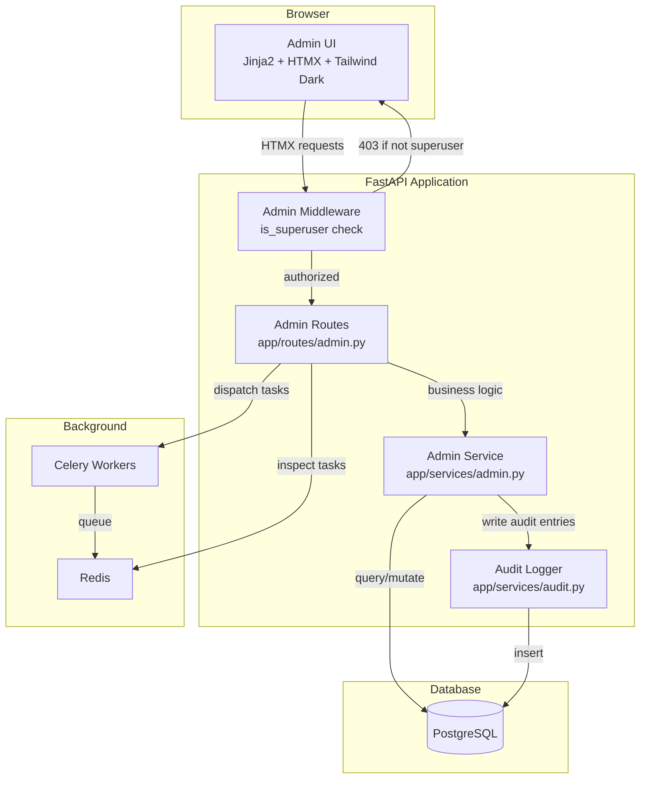
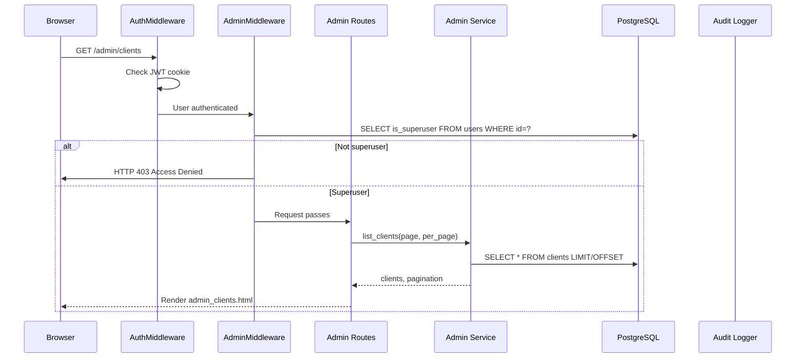
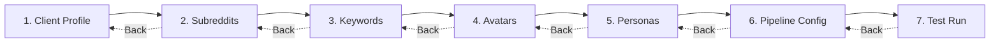

# Design Document: Admin Panel & Client Onboarding

## Overview

This design extends the Reddit Marketing SaaS platform with a comprehensive admin panel and structured client onboarding wizard. The admin panel replaces the current minimal admin capabilities (AI cost page at `/admin-page` and settings at `/settings`) with a full system management interface.

**Key design decisions:**

1. **Dark theme scoped to admin panel only.** The existing non-admin pages (`/`, `/review`, `/avatars-page`, etc.) keep their current light theme via `base.html`. All admin pages use a new `admin_base.html` with the brandbook dark theme (Slate Night `#0F172A` background, Dark Steel `#1E293B` surfaces). This avoids breaking existing UI and tests while delivering the new brand identity where it matters most.

2. **Sidebar navigation pattern.** Admin pages use a fixed left sidebar (240px) with icon + label links, replacing the top nav pattern used in non-admin pages. The top nav bar from `base.html` is preserved for non-admin pages without modification.

3. **HTMX-first interactivity.** All CRUD operations, wizard steps, and real-time updates use HTMX partials (`hx-swap`, `hx-target`, `hx-trigger`) — no JavaScript framework needed. The wizard uses `hx-swap="outerHTML"` for step transitions.

4. **Superuser middleware guard.** A new `AdminMiddleware` (or route dependency) checks `is_superuser` on every `/admin/*` request, returning HTTP 403 for non-superusers. This is layered on top of the existing `AuthMiddleware`.

5. **Service layer pattern.** All admin business logic lives in `app/services/admin.py` (CRUD, audit logging, health checks). Routes stay thin — they parse requests, call services, and render templates.

6. **Existing route prefix conflict resolution.** The current `dashboard.py` router is mounted at `/admin` prefix (for `/admin/stats` and `/admin/ai-usage` API endpoints). These will be moved to `/api/admin` to free up `/admin/*` for the new admin panel UI pages.

## Architecture

### Route Structure

```
/admin/                     → Admin dashboard (system overview)
/admin/users                → User management (list, create, toggle)
/admin/clients              → Client list
/admin/clients/new          → Create client form
/admin/clients/{id}         → Client detail/edit
/admin/clients/{id}/onboard → Onboarding wizard
/admin/avatars              → Avatar management
/admin/personas             → Persona management
/admin/subreddits           → Subreddit management (per-client)
/admin/keywords             → Keyword management (per-client)
/admin/tasks                → Celery task monitoring
/admin/health               → System health dashboard
/admin/ai-costs             → Enhanced AI cost tracking
/admin/audit-logs           → Audit log viewer
/admin/billing              → Billing placeholder
```

### Component Diagram



### Request Flow



## Components and Interfaces

### 1. Admin Middleware / Dependency

**File:** `app/middleware/admin.py` (or as a FastAPI dependency)

The superuser check is implemented as a FastAPI dependency rather than a full Starlette middleware, because it needs DB access to look up the user record (the existing `AuthMiddleware` only stores `user_id` and `email` in `request.state`, not `is_superuser`).

```python
# app/dependencies/admin.py
async def require_superuser(request: Request, db: Session = Depends(get_db)) -> User:
    """Dependency that ensures the current user is a superuser.
    Returns the User object for use in route handlers.
    Raises HTTPException(403) if not superuser."""
    user_id = getattr(request.state, "user_id", None)
    if not user_id:
        raise HTTPException(status_code=303, headers={"Location": "/login"})
    user = db.query(User).filter(User.id == user_id, User.is_active.is_(True)).first()
    if not user or not user.is_superuser:
        raise HTTPException(status_code=403, detail="Access Denied")
    return user
```

All admin routes include `current_user: User = Depends(require_superuser)` as a parameter.

### 2. Admin Routes

**File:** `app/routes/admin.py`

Single router with all admin page endpoints. Uses `APIRouter(prefix="/admin", dependencies=[Depends(require_superuser)])` so the superuser check applies to all routes automatically.

Key route groups:
- **Dashboard:** `GET /admin/` — system overview with stats cards
- **Users:** `GET /admin/users`, `POST /admin/users`, `POST /admin/users/{id}/toggle-active`, `POST /admin/users/{id}/toggle-superuser`, `POST /admin/users/{id}/delete`
- **Clients:** `GET /admin/clients`, `GET /admin/clients/new`, `POST /admin/clients/new`, `GET /admin/clients/{id}`, `POST /admin/clients/{id}`, `POST /admin/clients/{id}/deactivate`
- **Onboarding Wizard:** `GET /admin/clients/{id}/onboard/step/{n}`, `POST /admin/clients/{id}/onboard/step/{n}`
- **Personas:** `GET /admin/personas`, `POST /admin/personas`, `POST /admin/personas/{id}`, `POST /admin/personas/{id}/deactivate`
- **Keywords:** `GET /admin/keywords/{client_id}`, `POST /admin/keywords/{client_id}/add`, `POST /admin/keywords/{client_id}/{index}/remove`, `POST /admin/keywords/{client_id}/{index}/update`
- **Subreddits:** `GET /admin/subreddits/{client_id}`, `POST /admin/subreddits/{client_id}/add`, `POST /admin/subreddits/{client_id}/{id}/remove`
- **Tasks:** `GET /admin/tasks`, `POST /admin/tasks/trigger/{pipeline_type}/{entity_id}`
- **Health:** `GET /admin/health`
- **AI Costs:** `GET /admin/ai-costs`
- **Audit Logs:** `GET /admin/audit-logs`
- **Billing:** `GET /admin/billing`

### 3. Admin Service

**File:** `app/services/admin.py`

Business logic layer for all admin operations. Key functions:

```python
# User management
def list_users(db, page, per_page) -> tuple[list[User], int]
def create_admin_user(db, email, password, full_name, is_superuser) -> User
def toggle_user_active(db, user_id, current_user_id) -> User
def toggle_user_superuser(db, user_id) -> User

# Client management
def list_clients_paginated(db, page, per_page) -> tuple[list[dict], int]
def create_client(db, **fields) -> Client
def update_client(db, client_id, **fields) -> Client
def deactivate_client(db, client_id) -> Client

# Keyword management
def get_client_keywords(db, client_id) -> list[dict]
def add_keyword(db, client_id, name, priority) -> dict
def remove_keyword(db, client_id, index) -> None
def update_keyword_priority(db, client_id, index, priority) -> dict
def validate_keyword(name: str, priority: str) -> tuple[bool, str]

# Subreddit management
def add_subreddit(db, client_id, name, type) -> ClientSubreddit
def remove_subreddit(db, subreddit_id) -> None
def validate_subreddit_name(name: str) -> tuple[bool, str]

# Persona management
def list_personas(db, client_id=None) -> list[Persona]
def create_persona(db, client_id, name, voice_profile) -> Persona
def update_persona(db, persona_id, **fields) -> Persona
def deactivate_persona(db, persona_id) -> Persona

# System health
def check_system_health(db) -> dict
def get_db_statistics(db) -> dict

# AI costs
def get_ai_cost_summary(db) -> dict
def get_ai_costs_by_client(db) -> list[dict]
def get_ai_costs_by_operation(db) -> list[dict]
def get_ai_costs_by_model(db) -> list[dict]

# Task monitoring
def get_recent_tasks(celery_app) -> list[dict]
def trigger_pipeline(celery_app, pipeline_type, entity_id) -> str
```

### 4. Audit Service

**File:** `app/services/audit.py`

Dedicated service for writing and querying audit log entries.

```python
def log_action(db, user_id, action, entity_type, entity_id=None, client_id=None, details=None) -> AuditLog
def query_audit_logs(db, page, per_page, user_id=None, client_id=None, action=None, date_from=None, date_to=None) -> tuple[list[AuditLog], int]
```

Every admin mutation (create, update, deactivate, trigger) calls `log_action()` after the DB operation succeeds.

### 5. Template System

**Base template:** `app/templates/admin_base.html`

Dark theme layout with:
- Fixed left sidebar (240px) with navigation links and active state highlighting
- Main content area with header breadcrumbs
- Brand colors from brandbook (Slate Night background, Dark Steel surfaces)
- Inter font for UI, JetBrains Mono for technical data
- HTMX loaded globally

**Template hierarchy:**
```
admin_base.html                    ← Dark theme, sidebar layout
├── admin_dashboard.html           ← System overview
├── admin_users.html               ← User management
├── admin_clients.html             ← Client list
├── admin_client_new.html          ← Create client form
├── admin_client_detail.html       ← Client detail/edit
├── admin_onboard_step{1-7}.html   ← Wizard steps (7 templates)
├── admin_personas.html            ← Persona management
├── admin_keywords.html            ← Keyword management
├── admin_subreddits.html          ← Subreddit management
├── admin_tasks.html               ← Celery task monitoring
├── admin_health.html              ← System health
├── admin_ai_costs.html            ← AI cost tracking
├── admin_audit_logs.html          ← Audit log viewer
├── admin_billing.html             ← Billing placeholder
└── partials/
    ├── admin_user_row.html        ← HTMX partial for user table row
    ├── admin_keyword_row.html     ← HTMX partial for keyword row
    ├── admin_subreddit_row.html   ← HTMX partial for subreddit row
    ├── admin_task_list.html       ← HTMX partial for task list (polling)
    └── admin_wizard_step.html     ← HTMX partial for wizard step content
```

### 6. Onboarding Wizard

The wizard is a 7-step flow within a single page. Each step is an HTMX partial that replaces the wizard content area.



**Step 1 — Client Profile:** Creates the Client record. After submission, the client ID is available for all subsequent steps.

**Step 2 — Subreddits:** Add/remove subreddits with type selection (professional/hobby). Uses HTMX for inline add/remove without page reload.

**Step 3 — Keywords:** Add keywords with priority levels (HIGH/MEDIUM/LOW). Inline editing with HTMX partials.

**Step 4 — Avatar Assignment:** Shows available avatars with checkboxes. Assigns selected avatars to the client.

**Step 5 — Persona Creation:** Create one or more personas with name and voice profile. Each persona is saved immediately.

**Step 6 — Pipeline Configuration:** Review summary of all configured items. Toggle pipeline settings (enable/disable scheduled runs).

**Step 7 — Test Run:** Trigger a full pipeline run for the new client. Display task status with HTMX polling.

**Back navigation:** Each step stores data in the database immediately (not in session). Going back loads the current state from DB, so no data is lost.

### 7. Seed Script Extension

**File:** `app/seed.py` (extended)

Add a `seed_neuroyoga()` function that creates the NeuroYoga client with all associated data. The function is idempotent — it checks for existing records by `client_name` before creating.

### 8. Top Navigation Enhancement

The existing `base.html` top nav gets a conditional "Admin" link visible only to superusers. This requires passing `is_superuser` to the template context. The `_render` helper in `pages.py` is updated to look up the user and pass `is_superuser` to the context.

## Data Models

### Existing Models (No Changes Required)

All existing models support the admin panel requirements without schema changes:

| Model | Table | Key Fields for Admin |
|-------|-------|---------------------|
| `User` | `users` | `email`, `full_name`, `is_active`, `is_superuser`, `created_at` |
| `Client` | `clients` | `client_name`, `brand_name`, `keywords` (JSONB), `is_active`, all profile text fields |
| `Avatar` | `avatars` | `client_ids` (ARRAY), `reddit_username`, `active`, voice fields |
| `Persona` | `personas` | `client_id` (FK), `persona_name`, `voice_profile`, `is_active` |
| `ClientSubreddit` | `client_subreddits` | `client_id` (FK), `subreddit_name`, `type`, `is_active` |
| `AIUsageLog` | `ai_usage_log` | `client_id`, `operation`, `model`, `cost_usd`, tokens |
| `AuditLog` | `audit_log` | `user_id`, `client_id`, `action`, `entity_type`, `entity_id`, `details` |
| `SystemSetting` | `system_settings` | `key`, `value`, `is_secret` |

### Keywords Data Structure

Keywords are stored as JSONB in `clients.keywords`. The admin panel uses a structured format:

```json
{
  "high": ["attack path", "exposure management", "CTEM"],
  "medium": ["vulnerability prioritization", "hybrid attack surface"],
  "low": ["security posture", "risk management"]
}
```

The keyword management UI presents this as a flat list with priority badges, and the service layer handles the JSONB manipulation (add/remove/update priority).

### Validation Rules

| Entity | Field | Rule |
|--------|-------|------|
| User | email | Valid email format, unique in `users` table |
| User | password | Non-empty string (hashed with bcrypt before storage) |
| Client | client_name | Non-empty string |
| Client | brand_name | Non-empty string |
| Keyword | name | Non-empty string, trimmed |
| Keyword | priority | One of: `HIGH`, `MEDIUM`, `LOW` |
| Subreddit | name | Regex: `^[a-zA-Z0-9_]{3,21}$` (valid Reddit subreddit name) |
| Persona | persona_name | Non-empty string |
| Persona | client_id | Must reference existing active client |

### Pagination

All list endpoints use offset-based pagination:
- Default: `page=1`, `per_page=20`
- Response includes: `items`, `total`, `page`, `per_page`, `total_pages`
- Templates render pagination controls with HTMX for seamless page transitions


## Correctness Properties

*A property is a characteristic or behavior that should hold true across all valid executions of a system — essentially, a formal statement about what the system should do. Properties serve as the bridge between human-readable specifications and machine-verifiable correctness guarantees.*

### Property 1: Superuser access control on all admin routes

*For any* admin route path under `/admin/*` and *for any* authenticated user where `is_superuser` is false, the response status code SHALL be 403.

**Validates: Requirements 1.4, 15.1, 15.2**

### Property 2: User creation preserves data

*For any* valid email string and non-empty password, creating a user through the admin service SHALL result in a new User record in the database with the same email, a bcrypt-hashed password, and `is_active=True`.

**Validates: Requirements 2.2**

### Property 3: Duplicate email rejection

*For any* email that already exists in the `users` table, attempting to create another user with the same email SHALL fail with an error, and the total user count SHALL remain unchanged.

**Validates: Requirements 2.3**

### Property 4: Boolean field toggle is an involution

*For any* User record and *for any* boolean field (`is_active`, `is_superuser`), toggling the field SHALL flip its value. Toggling twice SHALL restore the original value.

**Validates: Requirements 2.4, 2.5**

### Property 5: Client creation preserves all provided fields

*For any* non-empty `client_name`, non-empty `brand_name`, and *for any* combination of optional text fields (`company_profile`, `company_worldview`, `company_problem`, `competitive_landscape`, `brand_voice`, `icp_profiles`), creating a client SHALL result in a Client record where every provided field matches the input value.

**Validates: Requirements 3.2**

### Property 6: Client partial update preserves unmodified fields

*For any* existing Client record and *for any* non-empty subset of updatable fields with new values, after updating, the modified fields SHALL have the new values and all unmodified fields SHALL retain their original values.

**Validates: Requirements 3.4**

### Property 7: Keyword addition to JSONB

*For any* valid keyword name (non-empty, trimmed) and *for any* valid priority level (HIGH, MEDIUM, or LOW), adding the keyword to a client's keywords JSONB SHALL result in the keyword appearing in the corresponding priority list, and the total keyword count SHALL increase by one.

**Validates: Requirements 4.4, 6.2**

### Property 8: Keyword removal from JSONB

*For any* existing keyword in a client's keywords JSONB, removing it SHALL result in the keyword no longer appearing in any priority list, and the total keyword count SHALL decrease by one.

**Validates: Requirements 6.3**

### Property 9: Keyword priority update

*For any* existing keyword in a client's keywords JSONB and *for any* valid new priority level different from the current one, updating the priority SHALL move the keyword from the old priority list to the new priority list, and the total keyword count SHALL remain unchanged.

**Validates: Requirements 6.4**

### Property 10: Keyword validation rejects invalid input

*For any* string composed entirely of whitespace (or empty), keyword validation SHALL reject it. *For any* string not in the set {HIGH, MEDIUM, LOW}, priority validation SHALL reject it.

**Validates: Requirements 6.5**

### Property 11: Subreddit name validation matches Reddit pattern

*For any* string, the subreddit name validation SHALL accept it if and only if it matches the regex `^[a-zA-Z0-9_]{3,21}$`.

**Validates: Requirements 7.5**

### Property 12: Subreddit reactivation instead of duplicate creation

*For any* client and *for any* subreddit name that was previously added and then soft-deleted (is_active=false), re-adding the same subreddit name SHALL reactivate the existing record (set is_active=true) and SHALL NOT create a new ClientSubreddit record.

**Validates: Requirements 7.3**

### Property 13: Avatar assignment adds client ID to array

*For any* avatar and *for any* client, after assigning the avatar to the client, the avatar's `client_ids` array SHALL contain the client's ID string. The assignment SHALL be idempotent — assigning the same avatar to the same client twice SHALL not create duplicate entries in the array.

**Validates: Requirements 4.5**

### Property 14: Every admin mutation produces an audit log entry

*For any* admin create, update, or deactivate operation on a client, user, persona, keyword, or subreddit, an `audit_log` entry SHALL be created with the correct `action`, `entity_type`, `entity_id`, and the performing admin's `user_id`.

**Validates: Requirements 13.1, 13.2, 13.3, 13.4**

### Property 15: Audit log filtering returns only matching entries

*For any* combination of filter parameters (user_id, client_id, action, date_from, date_to), all returned audit log entries SHALL satisfy every specified filter criterion.

**Validates: Requirements 11.2**

### Property 16: Audit log sorting is descending by creation date

*For any* set of audit log entries returned by a query, each entry's `created_at` timestamp SHALL be greater than or equal to the next entry's `created_at` timestamp.

**Validates: Requirements 11.3**

### Property 17: Seed script idempotency

*For any* number of consecutive executions of the NeuroYoga seed function (N ≥ 1), the count of NeuroYoga-related records (client, subreddits, keywords, personas) SHALL be identical to the count after a single execution.

**Validates: Requirements 14.5**

## Error Handling

### HTTP Error Responses

| Scenario | Status Code | Response |
|----------|-------------|----------|
| Unauthenticated access to `/admin/*` | 303 | Redirect to `/login` |
| Non-superuser access to `/admin/*` | 403 | HTML page: "Access Denied" with link to dashboard |
| Entity not found (client, user, persona, etc.) | 404 | HTML page: "Not Found" with back link |
| Duplicate email on user creation | 200 | Re-render form with error message "Email already registered" |
| Invalid subreddit name format | 200 | Re-render form with validation error message |
| Invalid keyword (empty name or bad priority) | 200 | Re-render form with validation error message |
| Self-deactivation attempt | 200 | Re-render page with error "Cannot deactivate your own account" |
| Celery task dispatch failure | 200 | Display error message on tasks page |
| External service health check failure | 200 | Display "Error" status with truncated error message |

### Validation Error Pattern

All form validation errors follow the same pattern:
1. Server-side validation in the service layer (not just client-side)
2. On validation failure, re-render the same template with `error` context variable
3. The template displays the error message in a red alert box above the form
4. Form fields retain their submitted values (no data loss on error)

For HTMX partial requests (keywords, subreddits), validation errors return an HTML fragment with the error message that replaces the form area.

### Database Error Handling

- All DB operations use SQLAlchemy sessions with proper commit/rollback
- Unique constraint violations (e.g., duplicate email) are caught and converted to user-friendly error messages
- The existing `ErrorMiddleware` catches unhandled exceptions and renders a generic error page

### Celery Task Error Handling

- Task dispatch failures are caught and displayed as error messages
- Task result inspection uses `AsyncResult` with timeout to avoid blocking
- Failed tasks show their traceback in the task detail view
- The task list page handles the case where Redis is unavailable gracefully

## Testing Strategy

### Test Framework

- **Unit tests:** pytest (existing framework, 60 tests passing)
- **Property-based tests:** Hypothesis (Python PBT library)
- **Test database:** SQLite in-memory (existing pattern from `conftest.py`)
- **HTTP testing:** FastAPI `TestClient` (existing pattern)

### Property-Based Tests

Each correctness property maps to a Hypothesis property test. Configuration:
- Minimum 100 examples per property (`@settings(max_examples=100)`)
- Each test tagged with a comment referencing the design property
- Tests use Hypothesis strategies to generate random valid inputs

**Property test file:** `reddit_saas/tests/test_admin_properties.py`

| Property | Hypothesis Strategy | What's Generated |
|----------|-------------------|-----------------|
| P1: Superuser access control | `st.sampled_from(ADMIN_ROUTES)` | Random admin route paths |
| P2: User creation | `st.emails()`, `st.text(min_size=1)` | Random emails and passwords |
| P3: Duplicate email | `st.emails()` | Random emails to test uniqueness |
| P4: Boolean toggle | `st.booleans()`, `st.sampled_from(["is_active", "is_superuser"])` | Random initial states and fields |
| P5: Client creation | `st.text(min_size=1)` for names, `st.text()` for optional fields | Random client data |
| P6: Client partial update | `st.dictionaries(st.sampled_from(FIELDS), st.text())` | Random subsets of fields |
| P7: Keyword addition | `st.text(min_size=1, alphabet=st.characters(whitelist_categories=("L", "N")))`, `st.sampled_from(["HIGH", "MEDIUM", "LOW"])` | Random keyword names and priorities |
| P8: Keyword removal | Index into existing keywords | Random keyword selection |
| P9: Keyword priority update | `st.sampled_from(["HIGH", "MEDIUM", "LOW"])` | Random new priorities |
| P10: Keyword validation | `st.text()`, `st.text()` | Random strings for name and priority |
| P11: Subreddit validation | `st.text(max_size=30)` | Random strings to test regex |
| P12: Subreddit reactivation | `st.from_regex(r"[a-zA-Z0-9_]{3,21}")` | Valid subreddit names |
| P13: Avatar assignment | Random client/avatar pairs | Idempotency check |
| P14: Audit logging | `st.sampled_from(MUTATION_OPS)` | Random admin operations |
| P15: Audit log filtering | `st.fixed_dictionaries(...)` with optional filters | Random filter combinations |
| P16: Audit log sorting | N/A (verified on query result) | Random audit log entries |
| P17: Seed idempotency | `st.integers(min_value=1, max_value=5)` | Number of seed runs |

### Unit Tests (Example-Based)

**Test file:** `reddit_saas/tests/test_admin.py` (extend existing)

| Test | What's Verified |
|------|----------------|
| `test_admin_dashboard_renders` | Dashboard page returns 200 with stats cards |
| `test_admin_sidebar_links` | All 12 navigation links present in sidebar |
| `test_admin_active_nav_highlight` | Current page nav item has active CSS class |
| `test_unauthenticated_redirect` | Unauthenticated request to /admin/ redirects to /login |
| `test_non_superuser_403` | Non-superuser gets 403 on /admin/ |
| `test_user_list_pagination` | User list shows correct page of results |
| `test_user_create_success` | Create user with valid data succeeds |
| `test_user_create_duplicate_email` | Duplicate email shows error message |
| `test_self_deactivation_blocked` | Admin cannot deactivate own account |
| `test_client_list_shows_counts` | Client list shows subreddit and avatar counts |
| `test_client_create_success` | Create client with all fields succeeds |
| `test_client_edit_prepopulates` | Edit form shows current client data |
| `test_client_deactivate` | Deactivate sets is_active=false |
| `test_onboarding_wizard_step_order` | Wizard steps render in correct order |
| `test_onboarding_back_navigation` | Back button preserves data |
| `test_onboarding_test_run` | Test run dispatches Celery task |
| `test_persona_list_grouped` | Personas grouped by client |
| `test_persona_filter_by_client` | Filter returns only matching personas |
| `test_keyword_add_remove` | Add and remove keywords from JSONB |
| `test_keyword_invalid_name` | Empty keyword name rejected |
| `test_keyword_invalid_priority` | Invalid priority rejected |
| `test_subreddit_add_success` | Valid subreddit name accepted |
| `test_subreddit_invalid_name` | Invalid subreddit name rejected |
| `test_subreddit_reactivation` | Re-adding deactivated subreddit reactivates |
| `test_health_page_renders` | Health page shows all service statuses |
| `test_ai_costs_summary` | AI costs page shows correct totals |
| `test_ai_costs_by_operation` | Breakdown by operation type correct |
| `test_ai_costs_budget_warning` | Warning shown when cost > 80% budget |
| `test_audit_log_list` | Audit log page shows entries |
| `test_audit_log_filter` | Filtering returns correct entries |
| `test_audit_log_readonly` | No mutation endpoints for audit logs |
| `test_billing_placeholder` | Billing page shows "Coming Soon" |
| `test_seed_neuroyoga` | Seed creates NeuroYoga with all data |
| `test_seed_idempotent` | Running seed twice doesn't duplicate |
| `test_non_admin_pages_accessible` | Dashboard, review, avatars-page work for non-superusers |
| `test_admin_link_visibility` | Admin link visible only to superusers |

### Integration Tests

| Test | What's Verified |
|------|----------------|
| `test_celery_task_dispatch` | Pipeline trigger dispatches Celery task (mocked broker) |
| `test_celery_task_list` | Task list reads from Celery/Redis (mocked) |
| `test_health_check_redis` | Redis health check with mocked connection |
| `test_health_check_celery_workers` | Celery worker inspection with mocked inspect |

### Test Configuration

```python
# conftest.py additions
@pytest.fixture
def superuser(db):
    """Create a superuser for admin tests."""
    user = create_user(db, email="admin@test.com", password="admin123", full_name="Admin")
    user.is_superuser = True
    db.commit()
    return user

@pytest.fixture
def regular_user(db):
    """Create a regular (non-superuser) user."""
    return create_user(db, email="user@test.com", password="user123", full_name="User")

@pytest.fixture
def admin_client(superuser):
    """TestClient authenticated as superuser."""
    token = create_access_token(data={"sub": str(superuser.id), "email": superuser.email})
    client = TestClient(app)
    client.cookies.set("access_token", token)
    return client
```
