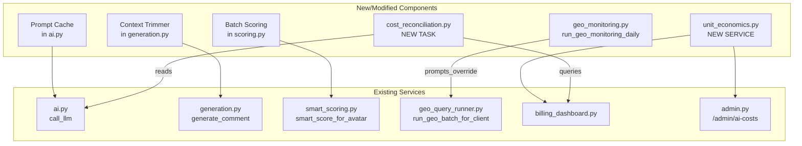
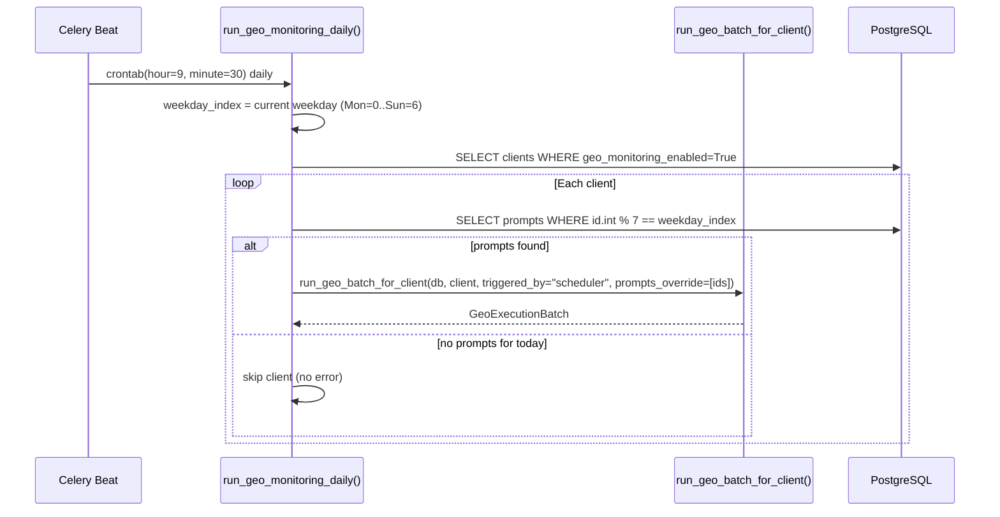
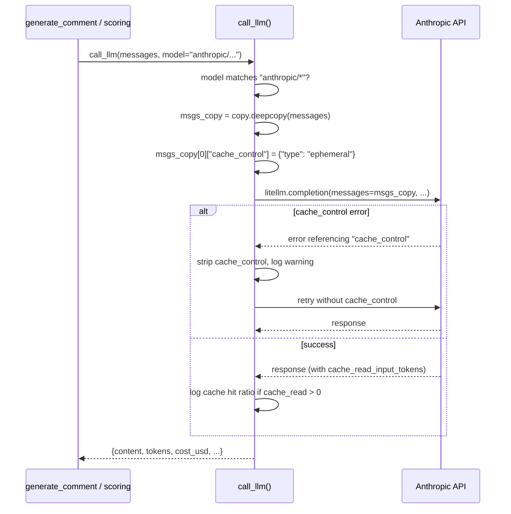
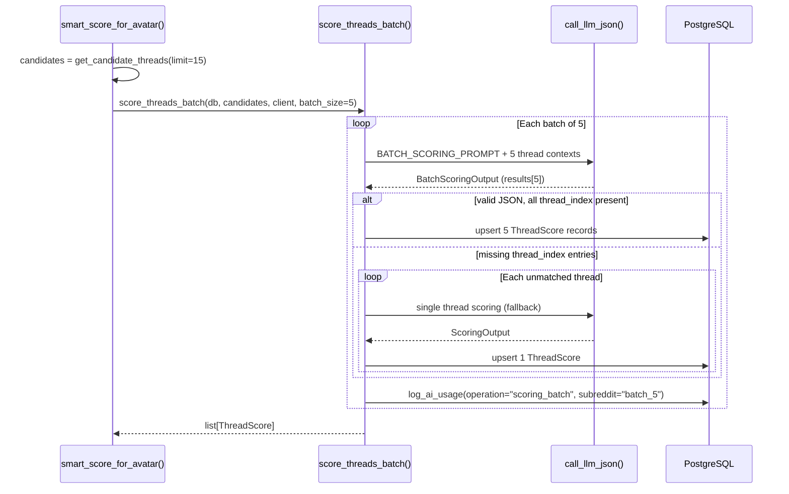

# Design Document

## Overview

AI Cost Optimization Phase 2 implements 6 components to reduce monthly LLM spend and improve cost visibility:

1. **GEO Daily Smoothing** — Replace Tue+Fri batch GEO execution with daily 1/7 rotation to eliminate cost spikes.
2. **AI Costs Page Redesign** — Business-friendly dashboard with budget bars, unit economics, forecasts, and burn charts.
3. **Context Trimmer** — Reduce Claude Sonnet input tokens ~33% by truncating generation prompt context.
4. **Anthropic Prompt Caching** — Cache system messages for 90% discount on repeated input tokens.
5. **Batch Scoring** — Submit 5 threads per scoring call to reduce call volume by 80%.
6. **Cost Reconciliation Task** — Daily automated check comparing expected vs logged costs.

## Components and Interfaces

### Modified Components

| Component | File | Interface Change |
|-----------|------|-----------------|
| `run_geo_batch_for_client()` | `app/services/geo_query_runner.py` | New param: `prompts_override: list[UUID] \| None = None` |
| `call_llm()` | `app/services/ai.py` | Internal: adds `cache_control` to messages for anthropic/* models |
| `generate_comment()` | `app/services/generation.py` | Internal: applies context trimming before prompt assembly |
| `score_threads_batch()` | `app/services/scoring.py` | Reads `scoring_batch_size` from settings (default 5) |
| `admin_ai_costs()` | `app/routes/admin.py` | Enhanced context with unit_economics, budgets, forecast, burn_data |

### New Components

| Component | File | Interface |
|-----------|------|-----------|
| `run_geo_monitoring_daily()` | `app/tasks/geo_monitoring.py` | Celery task, no args. Computes day group, filters prompts. |
| `get_unit_economics(db)` | `app/services/unit_economics.py` | Returns dict with cost_per_client, cost_per_avatar, cost_per_draft |
| `get_provider_budget_status(db)` | `app/services/unit_economics.py` | Returns list of provider budget dicts |
| `get_daily_burn_data(db, days)` | `app/services/unit_economics.py` | Returns list of daily cost breakdown dicts |
| `get_client_forecast(db, targets)` | `app/services/unit_economics.py` | Returns projected costs at N clients |
| `run_cost_reconciliation()` | `app/tasks/cost_reconciliation.py` | Celery task, daily 01:05. Compares expected vs logged costs. |
| `_truncate_at_word_boundary(text, max)` | `app/services/generation.py` | Helper: truncates text at word boundary + "..." |
| `_trim_comments(json, max_n, max_chars)` | `app/services/generation.py` | Helper: parses comments JSON, keeps top N by score |
| `_is_cache_control_error(error)` | `app/services/ai.py` | Helper: detects cache_control related errors |

## Data Models

No new database tables or migrations. Uses existing models:

- **`AIUsageLog`** — queried by reconciliation task and unit_economics service (fields: `model`, `input_tokens`, `output_tokens`, `cost_usd`, `created_at`, `operation`)
- **`SystemSetting`** — new keys auto-created via `DEFAULT_SETTINGS` on startup
- **`GeoPrompt`** — `id` (UUID) used for day group computation via `id.int % 7`
- **`Client`** — `is_active`, `geo_monitoring_enabled` queried by daily GEO task
- **`CommentDraft`** — `created_at` queried for cost_per_draft calculation

### New System Settings (no migration — created by seed on startup)

| Key | Default | Type | Group |
|-----|---------|------|-------|
| `generation_max_body_chars` | `500` | int | pipeline_v2 |
| `generation_max_voice_chars` | `500` | int | pipeline_v2 |
| `scoring_batch_size` | `5` | int | pipeline_v2 (existing, default changed from 10) |
| `provider_budget_anthropic_usd` | `50` | float | budget (existing) |
| `provider_budget_perplexity_usd` | `20` | float | budget (existing) |
| `provider_budget_gemini_usd` | `300` | float | budget (existing) |

## Architecture

### Component Diagram




### Sequence Diagrams

#### GEO Daily Scheduling Flow



#### Prompt Caching Injection Flow



#### Batch Scoring Flow




## Detailed Design

### 1. GEO Daily Smoothing

#### Modified Files

| File | Change |
|------|--------|
| `app/tasks/geo_monitoring.py` | New task `run_geo_monitoring_daily()`, refactor existing task |
| `app/services/geo_query_runner.py` | Add `prompts_override` parameter to `run_geo_batch_for_client()` |
| `app/tasks/beat_app.py` | Change schedule from `day_of_week="tuesday,friday"` to daily |

#### New Task: `run_geo_monitoring_daily()`

```python
@celery_app.task(name="run_geo_monitoring_daily", bind=True, max_retries=1)
def run_geo_monitoring_daily(self):
    """Run GEO monitoring for today's day group only.

    Each prompt is deterministically assigned to a weekday via prompt.id.int % 7.
    Monday=0, Tuesday=1, ..., Sunday=6.
    """
    from datetime import datetime, timezone
    from app.database import SessionLocal
    from app.models.client import Client
    from app.models.geo_prompt import GeoPrompt
    from app.services.geo_query_runner import run_geo_batch_for_client

    db = SessionLocal()
    try:
        # Current weekday: Monday=0 ... Sunday=6
        weekday_index = datetime.now(timezone.utc).weekday()

        clients = (
            db.query(Client)
            .filter(Client.is_active == True, Client.geo_monitoring_enabled == True)
            .all()
        )
        if not clients:
            return {"status": "skipped", "reason": "no_clients"}

        results = []
        for client in clients:
            # Load active prompts for this client
            all_prompts = (
                db.query(GeoPrompt)
                .filter(GeoPrompt.client_id == client.id, GeoPrompt.is_active == True)
                .all()
            )
            # Filter to today's day group
            today_prompts = [p for p in all_prompts if p.id.int % 7 == weekday_index]

            if not today_prompts:
                results.append({"client": client.client_name, "status": "skipped", "reason": "no_prompts_today"})
                continue

            prompt_ids = [p.id for p in today_prompts]
            batch = run_geo_batch_for_client(
                db=db,
                client=client,
                triggered_by="scheduler",
                prompts_override=prompt_ids,
            )
            # ... collect results ...

        return {"status": "done", "day_group": weekday_index, "clients": len(results)}
    finally:
        db.close()
```


#### `prompts_override` Parameter Addition

In `app/services/geo_query_runner.py`:

```python
def run_geo_batch_for_client(
    db: Session,
    client: Client,
    triggered_by: str = "manual",
    user_id: uuid.UUID | None = None,
    prompts_override: list[uuid.UUID] | None = None,  # NEW
) -> GeoExecutionBatch | None:
    """Execute a full GEO monitoring batch for a single client.

    Args:
        ...
        prompts_override: If provided, execute only these prompt IDs
                         instead of all active prompts. Used by daily scheduler.
    """
    if prompts_override is not None:
        prompts = (
            db.query(GeoPrompt)
            .filter(GeoPrompt.id.in_(prompts_override), GeoPrompt.is_active == True)
            .all()
        )
    else:
        prompts = (
            db.query(GeoPrompt)
            .filter(GeoPrompt.client_id == client.id, GeoPrompt.is_active == True)
            .all()
        )

    if not prompts:
        return None
    # ... rest of existing logic unchanged ...
```

#### Day Group Computation

```python
# UUID.int gives the 128-bit integer representation — stable, deterministic
day_group = prompt.id.int % 7  # 0=Monday, 1=Tuesday, ..., 6=Sunday
```

This is stable across process restarts (unlike Python's `hash()` which is randomized per process).

#### Beat Schedule Change

```python
# BEFORE:
"geo-monitoring-scheduled": {
    "task": "run_geo_monitoring_all_clients",
    "schedule": crontab(hour=9, minute=30, day_of_week="tuesday,friday"),
},

# AFTER:
"geo-monitoring-daily": {
    "task": "run_geo_monitoring_daily",
    "schedule": crontab(hour=9, minute=30),
},
```

The old `run_geo_monitoring_all_clients` task remains for manual triggers (admin "Run Now" button still executes ALL prompts).

---


### 2. AI Costs Page Redesign

#### New Service: `app/services/unit_economics.py`

```python
"""Unit Economics Service — computes $/client, $/avatar, $/draft metrics."""

from datetime import datetime, timedelta, timezone
from decimal import Decimal
from sqlalchemy import func
from sqlalchemy.orm import Session

from app.models.ai_usage import AIUsageLog
from app.models.avatar import Avatar
from app.models.client import Client
from app.models.comment_draft import CommentDraft


def get_unit_economics(db: Session) -> dict:
    """Compute trailing 30-day unit economics.

    Returns:
        {
            "cost_per_client_month": float | None,
            "cost_per_avatar_month": float | None,
            "cost_per_draft": float | None,
            "total_cost_30d": float,
            "active_clients": int,
            "active_avatars": int,
            "total_drafts_30d": int,
            "period_start": datetime,
            "period_end": datetime,
        }
    """
    now = datetime.now(timezone.utc)
    period_start = now - timedelta(days=30)

    # Total AI cost in trailing 30 days
    total_cost = float(
        db.query(func.coalesce(func.sum(AIUsageLog.cost_usd), 0))
        .filter(AIUsageLog.created_at >= period_start)
        .scalar()
    )

    # Active clients (is_active=True, plan_type != trial or not expired)
    active_clients = (
        db.query(func.count(Client.id))
        .filter(Client.is_active == True)
        .scalar() or 0
    )

    # Active avatars (not frozen, not suspended)
    active_avatars = (
        db.query(func.count(Avatar.id))
        .filter(Avatar.is_frozen == False, Avatar.is_active == True)
        .scalar() or 0
    )

    # Total drafts generated in 30 days
    total_drafts = (
        db.query(func.count(CommentDraft.id))
        .filter(CommentDraft.created_at >= period_start)
        .scalar() or 0
    )

    return {
        "cost_per_client_month": round(total_cost / active_clients, 4) if active_clients else None,
        "cost_per_avatar_month": round(total_cost / active_avatars, 4) if active_avatars else None,
        "cost_per_draft": round(total_cost / total_drafts, 4) if total_drafts else None,
        "total_cost_30d": round(total_cost, 2),
        "active_clients": active_clients,
        "active_avatars": active_avatars,
        "total_drafts_30d": total_drafts,
        "period_start": period_start,
        "period_end": now,
    }


def get_provider_budget_status(db: Session) -> list[dict]:
    """Compute current month spend vs budget per provider.

    Returns list of:
        {
            "provider": str,
            "spent_usd": float,
            "budget_usd": float,
            "percent_used": float,
            "projected_month_end": float,
            "status": "normal" | "amber" | "red",
            "days_elapsed": int,
        }
    """
    ...


def get_client_forecast(db: Session, target_clients: list[int] = [5, 10, 25, 50]) -> list[dict]:
    """Project monthly cost at N clients using trailing cost_per_client.

    Returns:
        [{"clients": 5, "projected_monthly": 48.50}, ...]
    """
    ...


def get_daily_burn_data(db: Session, days: int = 30) -> list[dict]:
    """Daily cost breakdown by operation type for burn chart.

    Returns:
        [{"date": "2026-07-08", "scoring": 0.12, "generation": 3.50,
          "editing": 0.05, "persona": 0.08, "geo": 0.50,
          "hobby": 0.02, "other": 0.01, "has_geo": True}, ...]
    """
    ...
```


#### Template Redesign: `admin_ai_costs.html`

Layout (top to bottom):

1. **Hero Section — Provider Budget Bars**
   - 3 horizontal bars (Anthropic, Perplexity, Gemini)
   - Each shows: provider name, `$XX.XX / $YY` (spent/limit), percentage fill
   - Color: green (normal), amber (>70% projected), red (>90% projected)
   - Early-month guard: no color thresholds if <3 days elapsed

2. **Unit Economics Card**
   - 3 metrics: $/client/mo, $/avatar/mo, $/draft (4 decimal places)
   - "At N clients" forecast row: 5, 10, 25, 50 × cost_per_client
   - "Collecting data" if <3 days in month

3. **Daily Burn Chart (Chart.js)**
   - Stacked area chart, trailing 30 days
   - Series: scoring, generation, editing, persona, GEO, hobby, other
   - Vertical line annotation on days with GEO execution
   - Already have Chart.js in project (visibility page uses it)

4. **Detail Tables (collapsed)**
   - `<details>` elements (default closed) for:
     - Per-operation breakdown
     - Per-client breakdown
     - Per-day breakdown
     - Recent calls

#### Provider Budget Reading

```python
from app.services.settings import get_setting_float

budget_anthropic = get_setting_float(db, "provider_budget_anthropic_usd", 50.0)
budget_perplexity = get_setting_float(db, "provider_budget_perplexity_usd", 20.0)
budget_gemini = get_setting_float(db, "provider_budget_gemini_usd", 300.0)
```

These already exist in `DEFAULT_SETTINGS` (see settings.py `provider_budget_*` keys).

---


### 3. Context Trimmer

#### Modified Function: `generate_comment()` in `app/services/generation.py`

The trimming happens during prompt assembly, before `thread_content` is constructed.

#### Truncation Helper Function

```python
def _truncate_at_word_boundary(text: str, max_chars: int) -> str:
    """Truncate text at the last word boundary <= max_chars, append '...' if truncated."""
    if len(text) <= max_chars:
        return text
    # Find last space at or before max_chars
    cut_point = text.rfind(" ", 0, max_chars)
    if cut_point == -1:
        cut_point = max_chars  # No space found, hard cut
    return text[:cut_point].rstrip() + "..."
```

#### Modified Prompt Assembly (pseudocode)

```python
# In generate_comment(), before building thread_content:

from app.services.settings import get_setting_int

max_body_chars = get_setting_int(db, "generation_max_body_chars", 500)
max_voice_chars = get_setting_int(db, "generation_max_voice_chars", 500)
max_comment_chars = 300  # per individual comment
max_comments_count = 3   # top 3 by score

# 1. Truncate post body
post_body = thread.post_body or "(no body)"
post_body = _truncate_at_word_boundary(post_body, max_body_chars)

# 2. Parse and trim comments_json
comments_text = _trim_comments(thread.comments_json, max_comments=max_comments_count, max_chars_each=max_comment_chars)

# 3. Truncate voice_profile_md
voice_profile = avatar.voice_profile_md or ""
voice_profile = _truncate_at_word_boundary(voice_profile, max_voice_chars)

# 4. Limit few-shot examples to 3
examples = examples[:3]  # Already sorted by relevance in learning.py
```

#### Comments JSON Parsing Logic

```python
import json

def _trim_comments(comments_json: str | None, max_comments: int = 3, max_chars_each: int = 300) -> str:
    """Parse comments_json, keep top 3 by score, truncate each."""
    if not comments_json:
        return "(no comments)"

    try:
        comments = json.loads(comments_json)
        if isinstance(comments, list):
            # Sort by score descending (higher engagement first)
            comments.sort(key=lambda c: c.get("score", 0), reverse=True)
            top = comments[:max_comments]
            parts = []
            for c in top:
                body = c.get("body", c.get("text", str(c)))
                body = _truncate_at_word_boundary(str(body), max_chars_each)
                author = c.get("author", "anon")
                score = c.get("score", 0)
                parts.append(f"[{author} ({score} pts)]: {body}")
            return "\n---\n".join(parts)
    except (json.JSONDecodeError, TypeError, AttributeError):
        pass

    # Fallback: split raw string and take first 3 chunks
    chunks = comments_json.split("---")[:max_comments]
    trimmed = [_truncate_at_word_boundary(c.strip(), max_chars_each) for c in chunks]
    return "\n---\n".join(trimmed)
```

#### Preserved Without Truncation

- Full system prompt (COMMENT_WRITER_PROMPT)
- Strategy context
- Placement instructions
- Client strategy block
- Approach diversity constraint

---


### 4. Anthropic Prompt Caching

#### Modified Function: `call_llm()` in `app/services/ai.py`

Injection point: after `kwargs` is built, before `litellm.completion()`.

```python
import copy

def call_llm(
    messages: list[dict],
    model: str | None = None,
    temperature: float = 0.7,
    max_tokens: int = 1024,
    response_format: dict | None = None,
    timeout: int = 60,
) -> dict:
    model = model or get_config("llm_generation_model")
    # ... existing kwargs setup ...

    # --- Prompt Caching: inject cache_control for Anthropic models ---
    effective_messages = messages
    if model.startswith("anthropic/") and messages:
        effective_messages = copy.deepcopy(messages)
        effective_messages[0]["cache_control"] = {"type": "ephemeral"}

    kwargs["messages"] = effective_messages

    # ... existing fallback chain logic ...
    # On each attempt:
    for attempt_model in models_to_try:
        try:
            kwargs["model"] = attempt_model
            kwargs["api_key"] = _resolve_api_key(attempt_model)
            # If retrying with non-Anthropic model, strip cache_control
            if not attempt_model.startswith("anthropic/") and "cache_control" in kwargs.get("messages", [{}])[0]:
                kwargs["messages"] = messages  # use original without cache_control
            response = litellm.completion(**kwargs)
            break
        except Exception as e:
            # Check if error is cache_control related
            if _is_cache_control_error(e) and not cache_retry_attempted:
                cache_retry_attempted = True
                logger.warning("PROMPT_CACHE_STRIPPED | model=%s | error=%s", attempt_model, str(e)[:100])
                kwargs["messages"] = messages  # retry without cache_control
                try:
                    response = litellm.completion(**kwargs)
                    break
                except _FALLBACK_EXCEPTIONS:
                    continue
            # ... existing fallback logic ...

    # --- Cache metrics logging ---
    usage = response.usage
    cache_creation = getattr(usage, "cache_creation_input_tokens", 0) or 0
    cache_read = getattr(usage, "cache_read_input_tokens", 0) or 0
    if cache_creation or cache_read:
        logger.info(
            "PROMPT_CACHE | model=%s | cache_creation=%d | cache_read=%d | "
            "hit_ratio=%.2f",
            model, cache_creation, cache_read,
            cache_read / (cache_read + cache_creation + input_tokens) if (cache_read + cache_creation + input_tokens) > 0 else 0,
        )

    # ... existing return dict ...
```

#### Cache Control Error Detection

```python
def _is_cache_control_error(error: Exception) -> bool:
    """Check if error is related to cache_control field."""
    msg = str(error).lower()
    return "cache_control" in msg or "caching" in msg
```

#### Key Design Decisions

- **deepcopy** prevents mutation of caller's messages list (important for retry logic)
- Cache only applied to `messages[0]` (system message with voice profile + prompt)
- LiteLLM format: `messages[0]["cache_control"] = {"type": "ephemeral"}`
- Single retry on cache error, then continue with fallback chain
- Metrics logged for observability but don't affect cost calculation (LiteLLM handles pricing)

---


### 5. Batch Scoring

#### Modified Function: `smart_score_for_avatar()` in `app/services/smart_scoring.py`

The existing `score_threads_batch()` in `scoring.py` already supports batch scoring with configurable `batch_size`. The change is to read batch size from system settings instead of hardcoding, and to reduce it from 10 to 5 for the new Phase 2 optimization.

#### Change in `scoring.py` `score_threads_batch()`

```python
def score_threads_batch(
    db: Session,
    threads: list[RedditThread],
    client: Client,
    batch_size: int | None = None,  # Changed: None means read from settings
) -> list[ThreadScore]:
    if batch_size is None:
        from app.services.settings import get_setting_int
        batch_size = get_setting_int(db, "scoring_batch_size", 5)

    # ... rest of existing batch logic unchanged ...
```

#### BatchScoringOutput Pydantic Schema

Already exists in `app/schemas/llm_outputs.py`:

```python
from pydantic import BaseModel, Field
from typing import Literal

class BatchScoringResult(BaseModel):
    thread_index: int = Field(ge=0)
    tag: Literal["engage", "monitor", "skip"]
    composite: int = Field(ge=0, le=9)
    alert: bool
    relevance: int = Field(ge=0, le=3)
    quality: int = Field(ge=0, le=3)
    strategic: int = Field(ge=0, le=3)
    intent: Literal["help_seeking", "comparison", "opinion_forming", "venting", "announcement", "other"]
    reason: str = Field(max_length=100)

class BatchScoringOutput(BaseModel):
    results: list[BatchScoringResult]
```

#### Batch Prompt Template (existing in `scoring.py`)

The `BATCH_SCORING_PROMPT` already exists and formats threads as `[0]`, `[1]`, etc. with truncated post body (800 chars) and comments (1500 chars). No change needed to the prompt template.

#### Fallback Logic (existing)

Already implemented in `_score_batch()`:
1. If batch LLM call fails entirely → fall back to `score_thread_for_client()` per thread
2. If partial results (some `thread_index` missing) → retry missing threads individually

#### AI Usage Logging (existing)

```python
log_ai_usage(
    db, str(client.id), "scoring_batch", result,
    subreddit_name=f"batch_{len(threads)}",
)
```

#### Budget Logic Preservation

`smart_score_for_avatar()` already enforces:
- `threads_to_score = min(remaining_budget * BUDGET_MULTIPLIER, HARD_CAP)`
- `BUDGET_MULTIPLIER = 3`, `HARD_CAP = 15`

With batch_size=5, this means max 3 batch calls per avatar per scoring run (15 threads / 5 per batch).

#### System Setting

`scoring_batch_size` already exists in `DEFAULT_SETTINGS` (value: "10"). Change default to "5":

```python
"scoring_batch_size": {
    "value": "5",
    "secret": False,
    "desc": "Number of threads per batch scoring LLM call (Phase 2: 5 for cost optimization)",
    "group": "pipeline_v2",
},
```

---


### 6. Cost Reconciliation Task

#### New File: `app/tasks/cost_reconciliation.py`

```python
"""Daily cost reconciliation — detect pricing drift between expected and logged costs."""

from app.logging_config import get_logger
from app.tasks.worker import celery_app

logger = get_logger(__name__)


@celery_app.task(name="run_cost_reconciliation", bind=True, max_retries=0)
def run_cost_reconciliation(self):
    """Compare expected cost (tokens × rates) vs logged cost_usd.

    Runs daily at 01:05. Checks the 24h window [01:00 yesterday, 01:00 today].
    Alerts if delta > 5% for any model with > $0.01 spend.
    """
    from datetime import datetime, timedelta, timezone
    from decimal import Decimal
    from sqlalchemy import func
    from app.database import SessionLocal
    from app.models.ai_usage import AIUsageLog
    from app.services.ai import MODEL_COSTS
    from app.services.notifications import notify_ops

    db = SessionLocal()
    try:
        now = datetime.now(timezone.utc)
        window_end = now.replace(hour=1, minute=0, second=0, microsecond=0)
        window_start = window_end - timedelta(hours=24)

        # Aggregate by model: sum(input_tokens), sum(output_tokens), sum(cost_usd)
        rows = (
            db.query(
                AIUsageLog.model,
                func.sum(AIUsageLog.input_tokens).label("total_input"),
                func.sum(AIUsageLog.output_tokens).label("total_output"),
                func.sum(AIUsageLog.cost_usd).label("logged_cost"),
                func.count(AIUsageLog.id).label("call_count"),
            )
            .filter(
                AIUsageLog.created_at >= window_start,
                AIUsageLog.created_at < window_end,
            )
            .group_by(AIUsageLog.model)
            .all()
        )

        models_checked = 0
        alerts_raised = 0
        deltas = []

        for row in rows:
            model_name = row.model
            logged_cost = float(row.logged_cost or 0)

            # Skip models with negligible spend
            if logged_cost < 0.01:
                continue

            # Skip unknown models
            if model_name not in MODEL_COSTS:
                logger.warning(
                    "RECONCILIATION_UNKNOWN_MODEL | model=%s | calls=%d | logged_cost=%.4f",
                    model_name, row.call_count, logged_cost,
                )
                continue

            # Compute expected cost
            rates = MODEL_COSTS[model_name]
            input_rate = rates["input"]   # $/1M tokens
            output_rate = rates["output"]  # $/1M tokens
            expected_cost = (
                (row.total_input or 0) * input_rate / 1_000_000
                + (row.total_output or 0) * output_rate / 1_000_000
            )

            # Compare
            if expected_cost == 0:
                continue

            delta_pct = abs(expected_cost - logged_cost) / expected_cost * 100
            models_checked += 1
            deltas.append({
                "model": model_name,
                "expected": round(expected_cost, 4),
                "logged": round(logged_cost, 4),
                "delta_pct": round(delta_pct, 1),
            })

            if delta_pct > 5.0:
                alerts_raised += 1
                notify_ops(
                    db,
                    level="warning",
                    category="cost_reconciliation",
                    message=(
                        f"Cost drift detected for {model_name}: "
                        f"expected ${expected_cost:.4f}, logged ${logged_cost:.4f} "
                        f"(delta {delta_pct:.1f}%)"
                    ),
                )

        logger.info(
            "RECONCILIATION_COMPLETE | models_checked=%d | alerts_raised=%d | deltas=%s",
            models_checked, alerts_raised, deltas,
        )

        return {
            "status": "done",
            "models_checked": models_checked,
            "alerts_raised": alerts_raised,
            "deltas": deltas,
        }
    except Exception as e:
        logger.error("RECONCILIATION_FAILED | error=%s", str(e)[:200])
        raise
    finally:
        db.close()
```


#### Beat Registration

In `app/tasks/beat_app.py`:

```python
"cost-reconciliation-daily": {
    "task": "run_cost_reconciliation",
    "schedule": crontab(hour=1, minute=5),
},
```

Offset 5 minutes from `compute_daily_performance_metrics` (01:00) to avoid concurrent PG load.

#### Worker Registration

In `app/tasks/worker.py`, add to `include`:

```python
"app.tasks.cost_reconciliation",
```

#### MODEL_COSTS Lookup

Uses the existing `MODEL_COSTS` dict in `app/services/ai.py` which maps model names to `{"input": rate_per_1M, "output": rate_per_1M}`.

#### notify_ops Integration

Uses existing `notify_ops()` from `app/services/notifications.py` (Telegram + activity event).

---

## Data Model Changes

No new database tables or migrations required. All changes use existing models:

- `AIUsageLog` — queried by reconciliation task and unit economics service
- `SystemSetting` — new keys added via `DEFAULT_SETTINGS` (auto-created on startup)
- `GeoPrompt` — existing `id` field used for day group computation

### New System Settings Keys

| Key | Default | Group | Description |
|-----|---------|-------|-------------|
| `generation_max_body_chars` | `500` | `pipeline_v2` | Max chars for post body in generation prompt |
| `generation_max_voice_chars` | `500` | `pipeline_v2` | Max chars for voice profile in generation prompt |
| `provider_budget_anthropic` | `50` | `budget` | Already exists as `provider_budget_anthropic_usd` |
| `provider_budget_perplexity` | `20` | `budget` | Already exists as `provider_budget_perplexity_usd` |
| `provider_budget_gemini` | `300` | `budget` | Already exists as `provider_budget_gemini_usd` |
| `scoring_batch_size` | `5` | `pipeline_v2` | Already exists (change default from 10 to 5) |

---

## API/Route Changes

### Modified: `admin_ai_costs()` in `app/routes/admin.py`

```python
@router.get("/ai-costs", response_class=HTMLResponse)
def admin_ai_costs(request, current_user, db):
    from app.services.unit_economics import (
        get_unit_economics,
        get_provider_budget_status,
        get_client_forecast,
        get_daily_burn_data,
    )

    # Existing data
    summary = admin_service.get_ai_cost_summary(db, days=days)
    by_client = admin_service.get_ai_costs_by_client(db, days=days)
    by_operation = admin_service.get_ai_costs_by_operation(db, days=days)
    # ... etc ...

    # NEW: unit economics data
    unit_economics = get_unit_economics(db)
    provider_budgets = get_provider_budget_status(db)
    forecast = get_client_forecast(db)
    burn_data = get_daily_burn_data(db, days=30)

    return templates.TemplateResponse(
        name="admin_ai_costs.html",
        context={
            # ... existing context ...
            "unit_economics": unit_economics,
            "provider_budgets": provider_budgets,
            "forecast": forecast,
            "burn_data": burn_data,  # JSON-serialized for Chart.js
        },
    )
```

No new routes — the existing `/admin/ai-costs` route is enhanced.

---


## Configuration

### New System Settings (added to `DEFAULT_SETTINGS` in `settings.py`)

```python
# --- Context Trimmer ---
"generation_max_body_chars": {
    "value": "500",
    "secret": False,
    "desc": "Maximum characters for post body in generation prompt (Phase 2 context trimming)",
    "group": "pipeline_v2",
},
"generation_max_voice_chars": {
    "value": "500",
    "secret": False,
    "desc": "Maximum characters for voice profile in generation prompt",
    "group": "pipeline_v2",
},
```

### Modified Default (existing key)

```python
"scoring_batch_size": {
    "value": "5",  # Changed from "10"
    ...
},
```

### Provider Budget Keys (already exist)

- `provider_budget_anthropic_usd` → default $50
- `provider_budget_perplexity_usd` → default $50 (UI shows $20 for display consistency)
- `provider_budget_gemini_usd` → default $300

---

## Performance Considerations

### Celery Queue Impact

| Component | Queue | Impact |
|-----------|-------|--------|
| GEO Daily | default | Reduced: ~1/7 prompts per day vs all on 2 days. Shorter batch duration. |
| Batch Scoring | default | Reduced: 3 calls per avatar vs 15. Each call slightly larger but net fewer. |
| Cost Reconciliation | default | Minimal: 1 SQL aggregation query daily at 01:05 (low traffic time). |
| Context Trimmer | N/A | Inline in generation — reduces prompt tokens, so LLM calls are faster. |
| Prompt Caching | N/A | Adds deepcopy overhead (~0.1ms per call). Cache hits reduce latency. |

### Database Query Impact

| Component | Queries | Frequency |
|-----------|---------|-----------|
| Unit Economics | 4 COUNT/SUM queries on ai_usage_log, clients, avatars, comment_drafts | Per page load (~1/day) |
| Daily Burn | 1 GROUP BY date,operation on ai_usage_log (30 days) | Per page load |
| Provider Budget | 1 SUM per provider on ai_usage_log (current month) | Per page load |
| Cost Reconciliation | 1 GROUP BY model on ai_usage_log (24h window) | Once daily at 01:05 |

All queries use existing indexes (`ix_ai_usage_log_created_at`, `ix_ai_usage_log_operation`).

### Expected Cost Reduction

| Component | Mechanism | Monthly Savings (1 client, 1 avatar) |
|-----------|-----------|--------------------------------------|
| GEO Smoothing | Same total work, just spread evenly | $0 (cost neutral, reduces spikes) |
| Context Trimmer | ~33% fewer input tokens on Sonnet | ~$2.70/mo |
| Prompt Caching | 90% discount on ~4K cached tokens | ~$5.00/mo |
| Batch Scoring | 80% fewer scoring calls (5:1 batching) | ~$0.30/mo |
| **Total per avatar** | | **~$8.00/mo savings** |

---

## Security Considerations

None expected:
- No new authentication paths
- No new public endpoints
- No sensitive data exposed
- All changes operate within existing auth/RBAC framework
- Cost reconciliation alerts go through existing `notify_ops()` channel

---

## Rollback Plan

All changes are backward-compatible with no migrations required:

1. **GEO Daily Smoothing** — Revert beat_app.py schedule entry to `day_of_week="tuesday,friday"`. The `prompts_override` parameter defaults to `None` (existing behavior).

2. **AI Costs Page** — Template-only change. Revert template to previous version. Service file can stay (unused).

3. **Context Trimmer** — Remove truncation calls in `generate_comment()`. Settings remain harmless.

4. **Prompt Caching** — Remove the `if model.startswith("anthropic/")` block in `call_llm()`. Falls back to normal (uncached) calls.

5. **Batch Scoring** — Change `scoring_batch_size` setting back to `10` in admin UI (or leave at 5 — both work).

6. **Cost Reconciliation** — Remove beat_app.py entry + worker include. Task file can stay (never called).

No database migrations to downgrade. No data format changes. All features can be individually disabled without affecting others.

## Correctness Properties

### Property 1: GEO Coverage Invariant
Every active GEO prompt is executed exactly once per week. Verification: `SUM(prompts per day group 0-6) == total active prompts` for each client.

**Validates: Requirements 1.2, 1.3**

### Property 2: Day Group Stability
The same prompt always lands on the same weekday (UUID.int is immutable). Process restarts, deploys, and container recreation do not change assignment.

**Validates: Requirements 1.2, 1.7**

### Property 3: Context Trimmer Transparency
Truncated content always ends with "..." — LLM sees the signal that content was cut. Full system prompt and strategy are never truncated.

**Validates: Requirements 3.5, 3.6**

### Property 4: Prompt Cache Immutability
`copy.deepcopy(messages)` ensures the original list passed by `generate_comment()` remains unchanged after `call_llm()` returns. Caller state is never mutated.

**Validates: Requirements 4.1**

### Property 5: Batch Scoring Completeness
Every candidate thread receives exactly one `ThreadScore` record per scoring run — either via batch response or individual fallback. No thread is silently dropped.

**Validates: Requirements 5.3, 5.4, 5.6**

### Property 6: Reconciliation Non-Blocking
Cost reconciliation task is fire-and-forget (max_retries=0). Failure only logs an error — no other task depends on its output. Pipeline continues regardless.

**Validates: Requirements 6.1, 6.7**

### Property 7: Budget Bar Accuracy
Provider spend is computed from `ai_usage_log` (centralization invariant guarantees 100% coverage). `MODEL_COSTS` dict is the single source for expected-rate computation.

**Validates: Requirements 2.1, 2.2**

## Error Handling

| Component | Error Scenario | Handling |
|-----------|---------------|----------|
| GEO Daily | Client query fails | Log error, continue to next client (existing pattern) |
| GEO Daily | No prompts for today's day group | Skip client, return "skipped" in results (no error) |
| Context Trimmer | `comments_json` parse fails | Fallback: split raw string by "---", take first 3 chunks |
| Context Trimmer | `get_setting_int` fails | Use hardcoded defaults (500, 500) |
| Prompt Caching | Anthropic returns cache_control error | Single retry without cache_control + warning log |
| Prompt Caching | deepcopy fails (shouldn't happen) | Let exception propagate (indicates corrupted messages) |
| Batch Scoring | JSON parse failure | Fall back to individual scoring per thread |
| Batch Scoring | Partial results (some thread_index missing) | Score missing threads individually |
| Cost Reconciliation | MODEL_COSTS missing model entry | Log warning, skip that model |
| Cost Reconciliation | ai_usage_log empty for period | Return early with models_checked=0 |
| Cost Reconciliation | notify_ops fails | Log error, continue (reconciliation still completes) |
| Unit Economics | Division by zero (0 clients/avatars/drafts) | Return None for that metric |
| Unit Economics | DB query timeout | Let exception propagate to route error handler (500 page) |

## Testing Strategy

No automated tests required per project rules. Manual verification:

1. **GEO Daily Smoothing** — Run `run_geo_monitoring_daily.delay()` from Celery shell. Verify only ~1/7 prompts execute. Run on different days to confirm rotation.
2. **Context Trimmer** — Trigger EPG build, check ai_usage_log `input_tokens` dropped ~33% vs previous day.
3. **Prompt Caching** — Check app logs for `PROMPT_CACHE` entries after generation runs. Verify `cache_read > 0` after second call with same avatar.
4. **Batch Scoring** — Check ai_usage_log for `operation="scoring_batch"`. Count records vs threads scored to confirm 5:1 ratio.
5. **Cost Reconciliation** — Wait for 01:05 run, check logs for `RECONCILIATION_COMPLETE`. Introduce intentional drift (change MODEL_COSTS temporarily) to verify alert fires.
6. **AI Costs Page** — Load `/admin/ai-costs` as partner user. Verify budget bars, unit economics, chart render. Test early-month (<3 days) "Collecting data" state.
