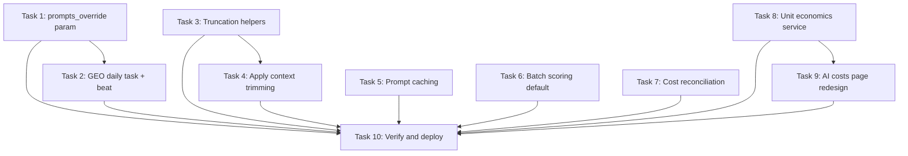

# Implementation Plan:

## Overview

AI Cost Optimization Phase 2 — 10 tasks implementing 6 components: GEO daily smoothing, AI costs page redesign, context trimming, Anthropic prompt caching, batch scoring default change, and cost reconciliation task. No migrations needed. All changes backward-compatible.

## Tasks

- [x] 1. Add `prompts_override` parameter to `run_geo_batch_for_client()` in `app/services/geo_query_runner.py`. If provided, query only those prompt IDs; else use existing all-prompts query.
  - **Requirements:** 1.4, 1.5
  - **Files:** `app/services/geo_query_runner.py`

- [x] 2. Create `run_geo_monitoring_daily()` task in `app/tasks/geo_monitoring.py`. Compute `weekday_index = datetime.now(UTC).weekday()`, query clients with GEO enabled, filter prompts by `p.id.int % 7 == weekday_index`, call `run_geo_batch_for_client()` with `prompts_override`. Replace beat schedule entry from `day_of_week="tuesday,friday"` to daily `crontab(hour=9, minute=30)` in `beat_app.py`. Keep old task for manual triggers.
  - **Requirements:** 1.1, 1.2, 1.3, 1.6, 1.7, 1.8, 1.9
  - **Files:** `app/tasks/geo_monitoring.py`, `app/tasks/beat_app.py`
  - **Depends on:** Task 1

- [x] 3. Add `_truncate_at_word_boundary(text, max_chars)` and `_trim_comments(comments_json, max_comments, max_chars_each)` helper functions to `app/services/generation.py`. Truncation at last word boundary + "...". Comments parsing: JSON parse → sort by score → top N → truncate each; fallback: split by "---".
  - **Requirements:** 3.6, 3.7, 3.8
  - **Files:** `app/services/generation.py`

- [x] 4. Apply context trimming in `generate_comment()`. Add `generation_max_body_chars` (500) and `generation_max_voice_chars` (500) to DEFAULT_SETTINGS. Truncate post_body, parse+trim comments_json to top 3, truncate voice_profile_md, limit few-shot examples to 3. Preserve system prompt, strategy, placement instructions untouched.
  - **Requirements:** 3.1, 3.2, 3.3, 3.4, 3.5
  - **Files:** `app/services/generation.py`, `app/services/settings.py`
  - **Depends on:** Task 3

- [x] 5. Inject `cache_control: {"type": "ephemeral"}` in `call_llm()` for Anthropic models. Use `copy.deepcopy(messages)` to avoid mutating caller state. Add `_is_cache_control_error()` helper. On cache error: single retry without cache_control + warning log. Log cache metrics (cache_creation_input_tokens, cache_read_input_tokens, hit_ratio) when available.
  - **Requirements:** 4.1, 4.2, 4.3, 4.4, 4.5, 4.6, 4.7
  - **Files:** `app/services/ai.py`

- [x] 6. Change `scoring_batch_size` default from "10" to "5" in DEFAULT_SETTINGS. Verify `score_threads_batch()` reads batch_size from settings when None is passed. Verify BatchScoringOutput schema and log_ai_usage call exist.
  - **Requirements:** 5.1, 5.8
  - **Files:** `app/services/settings.py`, `app/services/scoring.py`

- [x] 7. Create `app/tasks/cost_reconciliation.py` with task `run_cost_reconciliation`. Compute 24h window (01:00 yesterday to 01:00 today). Query ai_usage_log GROUP BY model. For each model: skip if <$0.01 or not in MODEL_COSTS; compute expected from tokens×rates; alert via notify_ops if delta >5%. Register in worker.py includes + beat_app.py at crontab(hour=1, minute=5).
  - **Requirements:** 6.1, 6.2, 6.3, 6.4, 6.5, 6.6, 6.7, 6.8, 6.9
  - **Files:** `app/tasks/cost_reconciliation.py` (new), `app/tasks/worker.py`, `app/tasks/beat_app.py`

- [x] 8. Create `app/services/unit_economics.py` with functions: `get_unit_economics(db)` (trailing 30d cost/client/avatar/draft), `get_provider_budget_status(db)` (per-provider spent vs budget with amber/red thresholds), `get_client_forecast(db, targets)` (projected costs at N clients), `get_daily_burn_data(db, days)` (daily cost by operation type + has_geo flag).
  - **Requirements:** 2.3, 2.4, 2.5, 2.8, 2.9
  - **Files:** `app/services/unit_economics.py` (new)

- [x] 9. Redesign `admin_ai_costs.html` template. Add unit_economics/budgets/forecast/burn_data to route context in `admin.py`. Hero: 3 provider budget bars with conditional amber/red. Unit Economics card ($/client, $/avatar, $/draft). Forecast table (5/10/25/50 clients). Chart.js stacked area burn chart (30 days). Collapse existing tables into `<details>`.
  - **Requirements:** 2.1, 2.2, 2.3, 2.5, 2.6, 2.7
  - **Files:** `app/templates/admin_ai_costs.html`, `app/routes/admin.py`
  - **Depends on:** Task 8

- [x] 10. Pre-flight verification: py_compile all changed files, import checks, alembic single head, template validation. Test GEO daily task filters correctly. Verify generation input_tokens decreased. Prepare deploy plan.
  - **Requirements:** All
  - **Files:** All modified files
  - **Depends on:** Tasks 1-9

## Task Dependency Graph

```json
{
  "waves": [
    {
      "name": "Wave 1 — Independent Components",
      "tasks": [1, 3, 5, 6, 7, 8]
    },
    {
      "name": "Wave 2 — Dependent Components",
      "tasks": [2, 4, 9]
    },
    {
      "name": "Wave 3 — Verification",
      "tasks": [10]
    }
  ]
}
```



## Notes

- Tasks 1-2 (GEO), 3-4 (Context), 5 (Caching), 6 (Batch), 7 (Reconciliation), and 8-9 (Costs page) are independent workstreams that can be implemented in parallel.
- No database migrations required — all new settings auto-created via DEFAULT_SETTINGS on app startup.
- Expected total savings: ~$8/mo per avatar after all components deployed.
- Rollback: each component can be individually reverted without affecting others.
