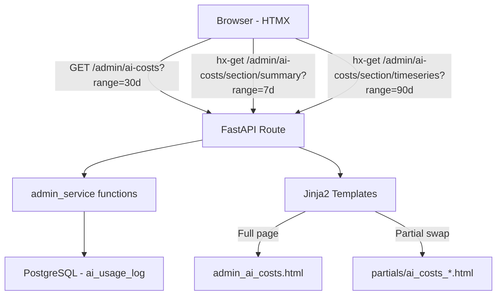

# Design Document: AI Usage Analytics

## Overview

This design enhances the existing `/admin/ai-costs` page into a full-featured AI Usage Analytics dashboard. The current implementation provides static summary cards and unfiltered tables. The enhanced version adds time-range filtering, time-series breakdowns with smart auto-aggregation, efficiency metrics, budget visualization, and model configuration visibility.

**Key design principles:**
- **Native feel over years of data**: Auto-aggregate from daily → weekly → monthly based on selected range. Limit displayed rows to prevent overwhelming the UI.
- **Query efficiency**: All queries use `created_at` date filtering with `LIMIT` clauses. No full table scans.
- **HTMX partial swaps**: Each dashboard section is independently updatable via HTMX without full page reloads.
- **Pure CSS visualization**: Cost trend bars use Tailwind width percentages — no JavaScript charting libraries.
- **No schema changes**: All data comes from the existing `ai_usage_log` table.

## Architecture

The feature follows the existing admin panel architecture:



**Request flow:**
1. Initial page load: full template render with default "Last 30 Days" filter
2. Filter change: HTMX sends `hx-get` to section-specific endpoints, swaps only the changed `<div>` targets
3. Each section endpoint checks `HX-Request` header — returns partial template for HTMX, full page for direct navigation

## Components and Interfaces

### Route Layer (`app/routes/admin.py`)

**Main route (enhanced):**
```python
@router.get("/ai-costs")
def admin_ai_costs(
    request: Request,
    range: str = "30d",  # today, 7d, 30d, 90d, all
    current_user: User = Depends(require_superuser),
    db: Session = Depends(get_db),
) -> TemplateResponse
```

**Section endpoints (new — for HTMX partial swaps):**
```python
@router.get("/ai-costs/section/{section_name}")
def admin_ai_costs_section(
    request: Request,
    section_name: str,  # summary, timeseries, by_client, by_operation, by_model
    range: str = "30d",
    current_user: User = Depends(require_superuser),
    db: Session = Depends(get_db),
) -> TemplateResponse
```

### Service Layer (`app/services/admin.py`)

New/enhanced functions:

| Function | Purpose |
|----------|---------|
| `resolve_date_range(range_key: str) -> tuple[datetime \| None, datetime]` | Convert range key to (start, end) datetime pair |
| `get_ai_cost_summary(db, start, end)` | Summary cards with efficiency metrics |
| `get_ai_costs_by_client(db, start, end, limit=20)` | Per-client breakdown with % of total |
| `get_ai_costs_by_operation(db, start, end)` | Per-operation with avg latency |
| `get_ai_costs_by_model(db, start, end)` | Per-model with cost/1K tokens |
| `get_ai_cost_timeseries(db, start, end)` | Time-series with auto-aggregation |
| `get_today_vs_average(db)` | Today's cost vs 30-day daily average |
| `get_budget_progress(db)` | Current month spend vs budget |
| `get_model_config(db)` | Active models + pricing from MODEL_COSTS |

### Smart Auto-Aggregation Logic

The time-series function automatically selects granularity based on the date range span:

| Range Span | Granularity | Max Rows |
|------------|-------------|----------|
| ≤ 7 days | Daily | 7 |
| 8–60 days | Daily | 60 |
| 61–365 days | Weekly | 52 |
| > 365 days | Monthly | 36 (3 years) |

This ensures the UI never shows hundreds of rows regardless of how much data accumulates.

```python
def _determine_granularity(start: datetime, end: datetime) -> tuple[str, int]:
    """Return (granularity, max_rows) based on date span."""
    span_days = (end - start).days
    if span_days <= 7:
        return "daily", 7
    elif span_days <= 60:
        return "daily", 60
    elif span_days <= 365:
        return "weekly", 52
    else:
        return "monthly", 36
```

### Template Layer

| Template | Purpose |
|----------|---------|
| `admin_ai_costs.html` | Full page layout (extends admin_base.html) |
| `partials/ai_costs_summary.html` | Summary cards + efficiency metrics |
| `partials/ai_costs_budget.html` | Budget progress bar |
| `partials/ai_costs_today.html` | Today vs average indicator |
| `partials/ai_costs_timeseries.html` | Time-series table with trend bars |
| `partials/ai_costs_by_client.html` | Client breakdown table |
| `partials/ai_costs_by_operation.html` | Operation breakdown table |
| `partials/ai_costs_by_model.html` | Model breakdown table |
| `partials/ai_costs_config.html` | Model configuration panel |

### HTMX Interaction Pattern

```html
<!-- Date Range Filter -->
<div class="flex gap-2" id="range-filter">
  
  <button
    hx-get="/admin/ai-costs?range={{ key }}"
    hx-target="#ai-costs-content"
    hx-swap="innerHTML"
    hx-push-url="true"
    class="px-3 py-1.5 rounded text-sm {{ 'bg-indigo-600 text-white' if current_range == key else 'bg-slate-700 text-gray-400 hover:text-white' }}">
    {{ label }}
  </button>
  
</div>
```

When a filter button is clicked, the entire content area below the filter is swapped. This is simpler than swapping each section individually and avoids multiple parallel requests.

## Data Models

No new database models or schema changes required. All queries target the existing `ai_usage_log` table:

```python
class AIUsageLog(Base):
    __tablename__ = "ai_usage_log"
    id: UUID (PK)
    client_id: UUID (FK → clients.id, nullable)
    operation: str  # scoring | persona_select | generation | editing
    model: str
    input_tokens: int
    output_tokens: int
    cost_usd: Decimal(10, 6)
    duration_ms: int
    created_at: datetime (server_default=now())
```

### Query Patterns

**Time-series daily aggregation:**
```sql
SELECT DATE(created_at) as day,
       SUM(cost_usd) as cost,
       COUNT(*) as calls
FROM ai_usage_log
WHERE created_at >= :start AND created_at < :end
GROUP BY DATE(created_at)
ORDER BY day DESC
LIMIT :max_rows
```

**Time-series weekly aggregation:**
```sql
SELECT DATE_TRUNC('week', created_at) as week_start,
       SUM(cost_usd) as cost,
       COUNT(*) as calls
FROM ai_usage_log
WHERE created_at >= :start AND created_at < :end
GROUP BY DATE_TRUNC('week', created_at)
ORDER BY week_start DESC
LIMIT :max_rows
```

**Time-series monthly aggregation:**
```sql
SELECT DATE_TRUNC('month', created_at) as month_start,
       SUM(cost_usd) as cost,
       COUNT(*) as calls
FROM ai_usage_log
WHERE created_at >= :start AND created_at < :end
GROUP BY DATE_TRUNC('month', created_at)
ORDER BY month_start DESC
LIMIT :max_rows
```

**Performance note:** The `created_at` column should have an index for efficient range queries. If not already indexed, a `CREATE INDEX idx_ai_usage_log_created_at ON ai_usage_log(created_at)` should be added. All queries use bounded `LIMIT` to prevent runaway result sets.

### Data Structures (Service Return Types)

```python
# Summary with efficiency metrics
{
    "total_cost": float,
    "total_calls": int,
    "total_input_tokens": int,
    "total_output_tokens": int,
    "avg_cost_per_call": float,
    "avg_latency_ms": float,
    "cost_per_1k_output_tokens": float,
}

# Time-series entry
{
    "period": str,          # "2025-01-15" or "2025-W03" or "2025-01"
    "period_label": str,    # "Jan 15" or "Week 3, Jan" or "January 2025"
    "cost": float,
    "calls": int,
    "pct_of_total": float,  # percentage of total in range
    "bar_width_pct": float, # relative to max in range (for CSS bar)
}

# Budget progress
{
    "current_month_cost": float,
    "budget": float,
    "pct_used": float,
    "remaining": float,
    "color": str,  # "green" | "amber" | "red"
}

# Today vs average
{
    "today_cost": float,
    "avg_daily_cost": float,
    "pct_diff": float,
    "direction": str,  # "up" | "down" | "neutral"
}

# Model config entry
{
    "role": str,           # "scoring" | "generation"
    "model_name": str,
    "input_cost_per_1m": float,
    "output_cost_per_1m": float,
}
```


## Correctness Properties

*A property is a characteristic or behavior that should hold true across all valid executions of a system — essentially, a formal statement about what the system should do. Properties serve as the bridge between human-readable specifications and machine-verifiable correctness guarantees.*

### Property 1: Summary computation correctness

*For any* non-empty set of AIUsageLog entries within a date range, the summary function SHALL return: `total_cost` equal to the sum of all `cost_usd` values, `total_calls` equal to the count of entries, `avg_cost_per_call` equal to `total_cost / total_calls`, `avg_latency_ms` equal to the mean of all `duration_ms` values, and `cost_per_1k_output_tokens` equal to `(total_cost / total_output_tokens) * 1000`.

**Validates: Requirements 3.1, 3.2, 3.3, 3.4, 3.5**

### Property 2: Time-series aggregation correctness

*For any* set of AIUsageLog entries and a given date range, the time-series function SHALL produce period entries where each period's `cost` equals the sum of `cost_usd` for all entries whose `created_at` falls within that period, and each period's `calls` equals the count of entries in that period.

**Validates: Requirements 2.1**

### Property 3: Auto-granularity selection

*For any* date range, the granularity selection function SHALL return "daily" when the span is ≤ 60 days, "weekly" when the span is 61–365 days, and "monthly" when the span exceeds 365 days. The returned max_rows SHALL always cap the output size.

**Validates: Requirements 2.3**

### Property 4: Time-series percentages sum to 100%

*For any* non-empty time-series result, the sum of all `pct_of_total` values SHALL equal 100% (within floating-point tolerance of ±0.01%), and each entry's `pct_of_total` SHALL equal `(entry_cost / total_range_cost) * 100`.

**Validates: Requirements 2.5**

### Property 5: Bar width proportionality

*For any* non-empty list of cost values used to compute bar widths, the entry with the maximum cost SHALL have `bar_width_pct` equal to 100, and every other entry SHALL have `bar_width_pct` equal to `(entry_cost / max_cost) * 100`.

**Validates: Requirements 2.2, 5.3, 6.3, 7.4**

### Property 6: Results sorted by cost descending

*For any* breakdown result (by client, by operation, or by model), the entries SHALL be ordered such that each entry's `cost` is greater than or equal to the next entry's `cost`.

**Validates: Requirements 2.4, 5.2, 6.2, 7.2**

### Property 7: Budget color thresholds

*For any* budget percentage value, the color assignment SHALL be "green" when percentage < 60, "amber" when 60 ≤ percentage ≤ 80, and "red" when percentage > 80.

**Validates: Requirements 4.3, 4.4, 4.5**

### Property 8: Budget computation correctness

*For any* positive budget value and non-negative current month cost, the budget progress function SHALL return `pct_used` equal to `(cost / budget) * 100` and `remaining` equal to `budget - cost`.

**Validates: Requirements 4.1, 4.6**

### Property 9: Today vs average direction classification

*For any* pair of (today_cost, avg_daily_cost) where avg_daily_cost > 0, the direction SHALL be "up" when today_cost > avg * 1.5, "down" when today_cost < avg * 0.75, and "neutral" otherwise.

**Validates: Requirements 9.2, 9.3, 9.4**

### Property 10: Model config pricing lookup

*For any* model name present in the MODEL_COSTS dictionary, the model config function SHALL return `input_cost_per_1m` and `output_cost_per_1m` values that exactly match the dictionary entry for that model.

**Validates: Requirements 8.1, 8.2**

### Property 11: Grouped aggregation correctness

*For any* set of AIUsageLog entries grouped by a dimension (client_id, operation, or model), each group's `cost` SHALL equal the sum of `cost_usd` for entries in that group, each group's `calls` SHALL equal the count of entries in that group, and the sum of all groups' costs SHALL equal the overall total cost for the range.

**Validates: Requirements 5.1, 6.1, 7.1**

## Error Handling

| Scenario | Handling |
|----------|----------|
| No data in selected range | Display "No data for this period" message in each section. Summary cards show $0.00 / 0 calls. |
| Division by zero (0 calls, 0 tokens) | Return 0.0 for avg_cost_per_call, cost_per_1k_output_tokens, avg_latency. Guard with `if total > 0` checks. |
| Invalid range parameter | Default to "30d" if range key is not in allowed set `{"today", "7d", "30d", "90d", "all"}`. |
| Budget = 0 or not configured | Show "No budget configured" instead of progress bar. Avoid division by zero. |
| Model not in MODEL_COSTS dict | Display model name with "Pricing unknown" label. Return 0.0 for costs. |
| avg_daily_cost = 0 (no history) | Show "Insufficient data" for today vs average indicator. Direction = "neutral". |
| Database timeout on large queries | All queries use `LIMIT` clauses. If query still times out, return empty results with error flag for UI to display "Data loading failed, try a shorter range." |

## Testing Strategy

### Property-Based Tests (Hypothesis)

The project already uses Hypothesis (`.hypothesis/` directory exists). Each correctness property maps to a property-based test:

- **Library**: `hypothesis` (already installed)
- **Minimum iterations**: 100 per property
- **Tag format**: `# Feature: ai-usage-analytics, Property {N}: {title}`

Property tests will target the pure computation functions in `services/admin.py`:
- `resolve_date_range()` — Property 3
- `_compute_summary()` — Property 1
- `_compute_timeseries()` — Properties 2, 4
- `_compute_bar_widths()` — Property 5
- `_sort_by_cost_desc()` — Property 6
- `_budget_color()` — Property 7
- `_budget_progress()` — Property 8
- `_today_vs_avg_direction()` — Property 9
- `_get_model_pricing()` — Property 10
- `_compute_grouped_aggregation()` — Property 11

### Unit Tests (pytest)

Example-based tests for:
- Route returns 200 with correct template context (existing pattern from `test_admin_panel.py`)
- Default range is "30d" on initial load
- HTMX partial response returns correct partial template
- Empty dataset renders gracefully
- Model config panel shows correct role assignments

### Integration Tests

- Full page load with seeded data returns all sections
- Filter change via simulated HTMX request returns filtered partial
- Budget warning appears at correct thresholds with real DB data

### Test File Structure

```
tests/
├── test_ai_analytics_properties.py   # Property-based tests (11 properties)
├── test_ai_analytics_unit.py         # Example-based unit tests
└── test_admin_panel.py               # Existing (add integration cases)
```
