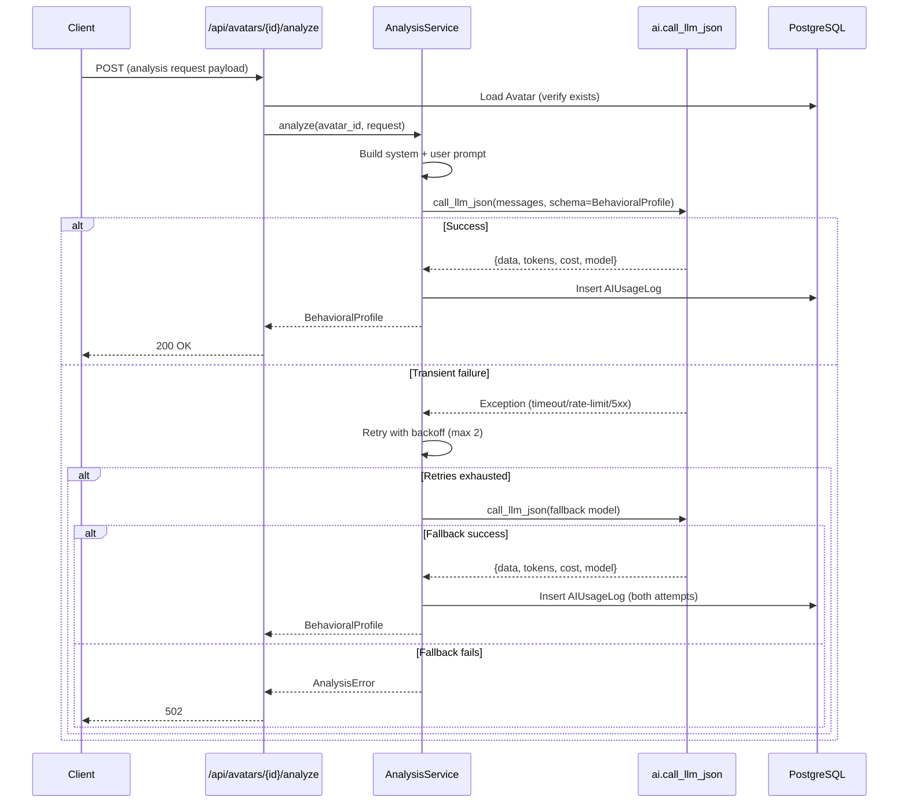

# Design Document: Avatar Analysis

## Overview

Avatar Analysis automates behavioral profiling of Reddit avatars by sending structured avatar data (comments, posts, metrics, voice profile) to an LLM and returning a structured Behavioral Profile JSON. The feature is delivered in two phases:

- **Phase 1 (Sprint 1, blocks pilot):** Core analysis pipeline — accept input, call LLM with retry/fallback, validate output against Pydantic schema, log costs, return structured profile via REST endpoint.
- **Phase 2 (Sprint 2, additive):** Learning loop — store human edits to profiles, inject past corrections as few-shot examples into subsequent analyses, reducing repeated LLM mistakes.

Phase 1 is fully self-contained. Phase 2 is additive and does not modify the Phase 1 contract.

### Key Design Decisions

1. **Reuse existing `call_llm_json` from `app/services/ai.py`** — already handles JSON parsing, model routing, API key resolution, and cost calculation. We add retry/fallback logic on top.
2. **Pydantic schema validation** — `call_llm_json` already supports a `schema` parameter. We define a `BehavioralProfile` Pydantic model and pass it through.
3. **Synchronous endpoint** — analysis takes 3-8 seconds (LLM latency). For the pilot scale (~50 avatars), synchronous is acceptable. If latency becomes an issue, we can move to SQS-based async later.
4. **Few-shot injection is prompt-level only** — Phase 2 modifies the prompt construction, not the LLM call mechanics. The `Analysis_Service` checks for edit records before building the prompt.

## Architecture

```mermaid
flowchart TD
    subgraph Phase 1
        A[POST /api/avatars/{id}/analyze] --> B[AnalysisService.analyze]
        B --> C{Build Prompt}
        C --> D[call_llm_json with retry]
        D -->|Success| E[Validate BehavioralProfile]
        D -->|Transient Failure| F[Retry up to 2x with backoff]
        F -->|All retries fail| G[Fallback to alt model]
        G -->|Fallback fails| H[Return 502 error]
        E -->|Valid| I[Log to AIUsageLog]
        E -->|Invalid schema| F
        I --> J[Return 200 + BehavioralProfile]
    end

    subgraph Phase 2
        K[POST /api/avatars/{id}/analysis-edits] --> L[LearningLoopService.store_edit]
        L --> M[Compute diff_summary]
        M --> N[Store EditRecord in DB]
        
        C -.->|Check for edits| O[Load recent EditRecords]
        O -.->|Inject few-shot| C
    end
```

### Component Interaction (Phase 1)



## Components and Interfaces

### Phase 1 Components

#### 1. `app/services/avatar_analysis.py` — AnalysisService

The core orchestrator. Responsibilities:
- Build the analysis prompt from input data
- Call LLM with retry and fallback logic
- Validate output against `BehavioralProfile` schema
- Log usage to `AIUsageLog`

```python
# Public interface
async def analyze_avatar(
    db: Session,
    avatar_id: uuid.UUID,
    request: AvatarAnalysisRequest,
) -> BehavioralProfile:
    """Run LLM-based behavioral analysis. Raises AnalysisError on total failure."""
    ...
```

#### 2. `app/schemas/avatar_analysis.py` — Pydantic Schemas

Request/response models:

```python
class ProfileAnalyticsInput(BaseModel):
    recent_comments: list[dict]
    recent_posts: list[dict]
    subreddits: list[str]
    account_age_days: int
    total_karma: int

class AvatarAnalysisRequest(BaseModel):
    reddit_username: str
    active: bool
    voice_profile_md: str = ""
    profile_analytics: ProfileAnalyticsInput

    @model_validator(mode="after")
    def check_sufficient_data(self) -> Self:
        """Reject if both comments and posts are empty."""
        ...

class BasicInfo(BaseModel):
    username: str
    account_age_days: int
    total_karma: int
    is_mod: bool

class BehaviorMetrics(BaseModel):
    total_comments: int
    days_since_last_activity: int
    uses_emoji: bool
    avg_comment_length: int

class Topics(BaseModel):
    top_subreddits: list[str]
    key_themes: list[str]

class SpeechPatterns(BaseModel):
    frequent_terms: list[str]
    pattern_description: str

class BehavioralProfile(BaseModel):
    basic: BasicInfo
    behavior: BehaviorMetrics
    topics: Topics
    speech: SpeechPatterns
    mismatches: list[str]
    summary: str  # 30-50 words

class AnalysisErrorResponse(BaseModel):
    error: str
    attempts: int
    last_failure_reason: str
```

#### 3. `app/routes/avatar_analysis.py` — REST Endpoint

Thin route handler:

```python
router = APIRouter(prefix="/api/avatars")

@router.post("/{avatar_id}/analyze", response_model=BehavioralProfile)
def analyze_avatar_endpoint(
    avatar_id: UUID,
    request: AvatarAnalysisRequest,
    db: Session = Depends(get_db),
    current_user: User = Depends(require_superuser),
) -> BehavioralProfile:
    ...
```

#### 4. Retry/Fallback Logic (inside AnalysisService)

```python
RETRY_CONFIG = {
    "max_retries": 2,
    "base_delay_seconds": 2,  # exponential: 2s, 4s
    "retryable_errors": (Timeout, RateLimitError, ServiceUnavailableError),
}
```

Strategy:
1. Attempt with configured primary model
2. On transient failure → retry up to 2x with exponential backoff (2s, 4s)
3. On schema validation failure → retry (LLM may produce valid output on next attempt)
4. If all retries exhausted → attempt once with fallback model
5. If fallback fails → raise `AnalysisError`

Each failed attempt is logged to `AIUsageLog` with `cost_usd=0` and the error in a separate field.

### Phase 2 Components

#### 5. `app/models/analysis_edit.py` — EditRecord Model

```python
class AnalysisEditRecord(Base):
    __tablename__ = "analysis_edit_records"

    id: Mapped[uuid.UUID]  # PK
    avatar_id: Mapped[uuid.UUID]  # FK → avatars.id, indexed
    llm_output: Mapped[dict]  # JSONB — original BehavioralProfile
    human_edited: Mapped[dict]  # JSONB — corrected BehavioralProfile
    diff_summary: Mapped[str]  # Text — human-readable diff
    created_at: Mapped[datetime]  # timestamp with tz
```

#### 6. `app/services/learning_loop.py` — LearningLoopService

```python
def store_edit(
    db: Session,
    avatar_id: uuid.UUID,
    llm_output: dict,
    human_edited: dict,
) -> AnalysisEditRecord:
    """Compute diff, store edit record. Raises ValueError if no changes."""
    ...

def get_recent_edits(
    db: Session,
    avatar_id: uuid.UUID,
    limit: int = 3,
) -> list[AnalysisEditRecord]:
    """Retrieve most recent N edit records for few-shot injection."""
    ...
```

#### 7. `app/routes/avatar_analysis.py` — Edit Submission Endpoint (Phase 2 addition)

```python
@router.post("/{avatar_id}/analysis-edits", status_code=201)
def submit_analysis_edit(
    avatar_id: UUID,
    edit: AnalysisEditSubmission,
    db: Session = Depends(get_db),
    current_user: User = Depends(require_superuser),
) -> dict:
    ...
```

#### 8. Few-Shot Injection (Phase 2 modification to prompt builder)

When `get_recent_edits` returns records, the prompt builder inserts them as examples:

```
Here are corrections made to previous analyses of this avatar. 
Learn from these to avoid repeating the same mistakes:

Example 1:
Original: {llm_output_json}
Corrected: {human_edited_json}
What changed: {diff_summary}
...
```

The injection is additive — if no edits exist, the prompt is identical to Phase 1.

## Data Models

### Existing Models Used

- **Avatar** (`app/models/avatar.py`) — source of `avatar_id`, `reddit_username`, `voice_profile_md`
- **AIUsageLog** (`app/models/ai_usage.py`) — cost tracking with `operation="avatar_analysis"`, `avatar_id` FK already exists

### New Model: AnalysisEditRecord (Phase 2)

| Column | Type | Constraints | Notes |
|--------|------|-------------|-------|
| id | UUID | PK, default uuid4 | |
| avatar_id | UUID | FK → avatars.id, NOT NULL | Indexed for fast retrieval |
| llm_output | JSONB | NOT NULL | Original BehavioralProfile from LLM |
| human_edited | JSONB | NOT NULL | Human-corrected version |
| diff_summary | TEXT | NOT NULL | Auto-computed description of changes |
| created_at | TIMESTAMP WITH TZ | server_default=now() | |

**Indexes:**
- `ix_analysis_edit_records_avatar_created` on `(avatar_id, created_at DESC)` — supports "most recent 3 edits" query

### Configuration (SystemSettings table)

| Key | Default | Description |
|-----|---------|-------------|
| `avatar_analysis_primary_model` | `openai/gpt-4o-mini` | Primary LLM for analysis |
| `avatar_analysis_fallback_model` | `anthropic/claude-sonnet-4-20250514` | Fallback LLM |
| `avatar_analysis_max_retries` | `2` | Max retry attempts |
| `avatar_analysis_few_shot_limit` | `3` | Max edit records to inject |

### Prompt Template

The system prompt instructs the LLM to analyze the avatar data and return a structured JSON matching the `BehavioralProfile` schema. Key sections:

1. **Role**: "You are a behavioral analyst for Reddit accounts."
2. **Input context**: Username, active status, voice profile (legend), profile analytics (comments, posts, subreddits, karma, account age)
3. **Output schema**: Exact JSON structure with field descriptions and constraints (summary must be 30-50 words)
4. **Mismatch detection**: Compare voice_profile_md (intended persona) against actual behavior patterns
5. **Few-shot examples** (Phase 2 only): Past corrections for this avatar

## Correctness Properties

*A property is a characteristic or behavior that should hold true across all valid executions of a system — essentially, a formal statement about what the system should do. Properties serve as the bridge between human-readable specifications and machine-verifiable correctness guarantees.*

### Property 1: Valid input always produces schema-valid output

*For any* valid `AvatarAnalysisRequest` (non-empty username, non-empty comments or posts in profile_analytics), when the LLM returns parseable JSON, the `AnalysisService` SHALL return a response that passes `BehavioralProfile.model_validate()` without error.

**Validates: Requirements 1.1, 2.1, 2.3, 6.2**

### Property 2: Invalid input always rejected with field descriptions

*For any* request payload missing `reddit_username` or `profile_analytics`, or where both `recent_comments` and `recent_posts` are empty, the service SHALL return a validation error whose message references the specific missing/invalid fields.

**Validates: Requirements 1.2, 1.3, 6.3**

### Property 3: Transient failures trigger retry with exponential backoff

*For any* valid analysis request, when the LLM call fails with a transient error (timeout, rate limit, 5xx), the service SHALL retry up to 2 additional times with delays of `base_delay * 2^attempt` seconds before attempting fallback.

**Validates: Requirements 2.2, 5.1**

### Property 4: Exhausted retries trigger exactly one fallback attempt

*For any* valid analysis request where all primary model attempts (initial + 2 retries) fail, the service SHALL make exactly one call to the configured fallback model before reporting failure.

**Validates: Requirements 3.2, 5.2**

### Property 5: Total failure returns structured error with correct attempt count

*For any* valid analysis request where all attempts (primary retries + fallback) fail, the returned error response SHALL contain the total number of attempts made (initial + retries + fallback = 4) and the last failure reason.

**Validates: Requirements 5.3, 6.4**

### Property 6: Every LLM attempt produces an AIUsageLog entry

*For any* analysis execution (regardless of outcome), each LLM call attempt SHALL produce exactly one `AIUsageLog` entry with `operation="avatar_analysis"`, the correct `avatar_id`, `model` name, and `duration_ms > 0`.

**Validates: Requirements 4.1, 4.2, 4.3, 5.4**

### Property 7: Storing an edit produces a record with auto-computed diff

*For any* pair of distinct `BehavioralProfile` JSON objects (original ≠ edited), calling `store_edit` SHALL create an `AnalysisEditRecord` where `diff_summary` is a non-empty string describing the differences, and `llm_output` and `human_edited` match the inputs.

**Validates: Requirements 7.1, 9.2**

### Property 8: Identical edits are rejected

*For any* `BehavioralProfile` JSON object submitted as both `llm_output` and `human_edited`, the `store_edit` function SHALL raise a validation error (no record created).

**Validates: Requirements 9.3**

### Property 9: Few-shot injection retrieves exactly the N most recent edits

*For any* avatar with K edit records (K ≥ 0) and a configured limit of N, the prompt builder SHALL inject exactly `min(K, N)` edit records, and those records SHALL be the N most recently created by timestamp.

**Validates: Requirements 8.1, 8.2**

## Error Handling

### Transient LLM Errors (Phase 1)

| Error Type | Action | Max Attempts |
|-----------|--------|-------------|
| Timeout (>60s) | Retry with backoff | 3 (1 initial + 2 retries) |
| Rate limit (429) | Retry with backoff | 3 |
| Server error (5xx) | Retry with backoff | 3 |
| Schema validation failure | Retry (LLM may self-correct) | 3 |
| Auth error (401/403) | Fallback immediately (no retry) | 1 fallback |
| JSON parse error | Retry | 3 |

### Permanent Errors

| Error Type | Action | HTTP Response |
|-----------|--------|--------------|
| Avatar not found | Return 404 | 404 |
| Missing required fields | Return validation error | 422 |
| Insufficient data (empty comments+posts) | Return validation error | 422 |
| All attempts exhausted | Return structured error | 502 |
| Identical edit submitted | Return "no changes" | 422 |

### Error Response Format

```json
{
  "error": "All analysis attempts failed",
  "attempts": 4,
  "last_failure_reason": "Timeout after 60s on fallback model anthropic/claude-sonnet-4-20250514"
}
```

### Logging Strategy

Every failed attempt is logged before retry:
```
AVATAR_ANALYSIS | action=retry | avatar_id=xxx | attempt=2/3 | error=RateLimitError | duration_ms=1200 | model=openai/gpt-4o-mini
```

Successful completion:
```
AVATAR_ANALYSIS | action=success | avatar_id=xxx | model=openai/gpt-4o-mini | input_tokens=3200 | output_tokens=800 | cost_usd=0.0012 | duration_ms=4500
```

## Testing Strategy

### Property-Based Tests (Hypothesis)

The project already uses Hypothesis (`.hypothesis/` directory exists). Each correctness property maps to a property-based test with minimum 100 iterations.

**Library:** `hypothesis` (already installed)

**Test file:** `tests/test_avatar_analysis_properties.py`

| Property | Test Strategy | Generators |
|----------|--------------|------------|
| P1: Valid input → valid output | Generate random `AvatarAnalysisRequest`, mock LLM with valid JSON, verify `BehavioralProfile` validation passes | `st.builds(AvatarAnalysisRequest, ...)` |
| P2: Invalid input → rejection | Generate requests with missing fields or empty data | `st.builds()` with `st.none()` for required fields |
| P3: Retry on transient failure | Generate valid requests, mock N failures (0-3), verify retry count | `st.integers(min_value=0, max_value=3)` for failure count |
| P4: Fallback after retries | Generate valid requests, mock 3 primary failures, verify 1 fallback call | Same as P3 with fixed failure count |
| P5: Total failure error structure | Generate valid requests, mock all failures, verify error fields | `st.text()` for error messages |
| P6: AIUsageLog entries | Generate valid requests, run analysis, count log entries | `st.builds(AvatarAnalysisRequest, ...)` |
| P7: Edit storage with diff | Generate pairs of distinct BehavioralProfile dicts | `st.fixed_dictionaries()` for profile fields |
| P8: Identical edit rejection | Generate single BehavioralProfile, submit as both | `st.builds(BehavioralProfile, ...)` |
| P9: Few-shot retrieval | Generate K edit records, verify min(K, N) retrieved in order | `st.lists()` of edit records, `st.integers()` for K |

**Tag format:** Each test is tagged with:
```python
# Feature: avatar-analysis, Property 1: Valid input always produces schema-valid output
```

**Configuration:**
```python
from hypothesis import settings, given

@settings(max_examples=100)
@given(request=valid_analysis_requests())
def test_property_1_valid_input_produces_valid_output(request):
    ...
```

### Unit Tests (pytest)

Focused on specific examples and integration points:

- Prompt construction with known inputs → verify expected prompt structure
- Model configuration reading from SystemSettings
- JWT auth enforcement on both endpoints
- HTTP status codes for each error scenario
- Diff summary computation for known edit pairs
- Few-shot prompt formatting with known edit records

### Integration Tests

- End-to-end analysis with real (mocked) LLM response
- Database round-trip for AnalysisEditRecord
- AIUsageLog creation with correct foreign keys
- Phase 1 works without Phase 2 tables (graceful degradation)

