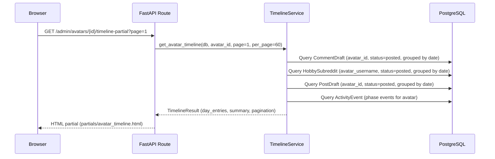
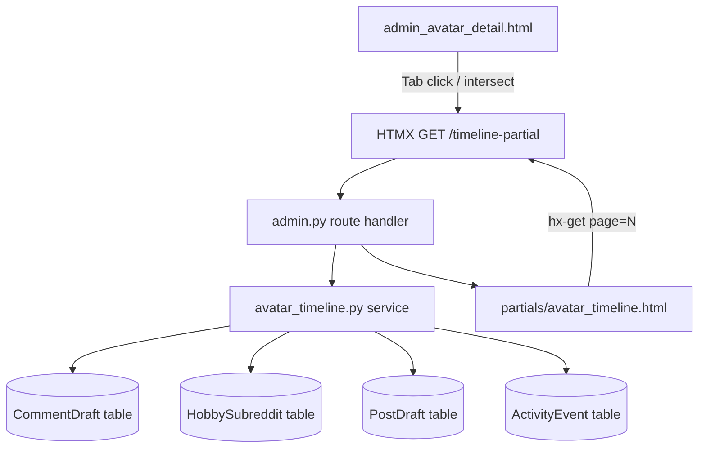

# Design Document: Avatar Daily Timeline

## Overview

The Avatar Daily Timeline feature adds a "Timeline" tab to the avatar detail page that displays a complete day-by-day history of an avatar's activity from creation to today. It replaces the limited 30-day karma history with a full-lifetime view showing professional comments, hobby comments, posts, karma earned, and phase transition events.

The design follows the existing HTMX lazy-loading pattern (used by Analytics and Presence tabs) to avoid blocking the avatar detail page load. Data is aggregated server-side by a dedicated `TimelineService` and rendered as a paginated table with 60 entries per page.

### Key Design Decisions

1. **Dedicated service layer** — `app/services/avatar_timeline.py` encapsulates all aggregation logic, keeping the route handler thin.
2. **Server-side pagination** — 60 days per page with HTMX-driven next/previous navigation. Avoids loading potentially 3650 rows at once.
3. **Three aggregation queries + one event query** — separate queries for CommentDraft, HobbySubreddit, PostDraft, and ActivityEvent, merged in Python. This avoids complex multi-table JOINs and leverages existing indexes.
4. **UTC day boundaries** — all date grouping uses `DATE(column AT TIME ZONE 'UTC')` for consistency.
5. **No new database tables or migrations** — the feature reads from existing tables only.

## Architecture



### Component Interaction



## Components and Interfaces

### 1. Timeline Service (`app/services/avatar_timeline.py`)

The service exposes a single public function:

```python
def get_avatar_timeline(
    db: Session,
    avatar_id: uuid.UUID,
    avatar_username: str,
    avatar_created_at: datetime,
    page: int = 1,
    per_page: int = 60,
) -> TimelineResult:
```

**Internal steps:**

1. Calculate the full date range: `max(avatar_created_at, today - 3650 days)` to today.
2. Determine the page slice (reverse chronological — page 1 = most recent 60 days).
3. Run three aggregation queries scoped to the page's date range.
4. Run one query for phase events within the full date range.
5. Merge results into `DayEntry` objects, filling gaps with zero-value entries.
6. Compute summary statistics (totals, avatar age, current phase).
7. Return `TimelineResult` with entries, summary, pagination metadata, and phase events.

### 2. Route Handler (addition to `app/routes/admin.py`)

```python
@router.get("/avatars/{avatar_id}/timeline-partial", response_class=HTMLResponse)
def admin_avatar_timeline_partial(
    request: Request,
    avatar_id: uuid.UUID,
    page: int = 1,
    current_user: User = Depends(require_superuser),
    db: Session = Depends(get_db),
) -> HTMLResponse:
```

Returns the rendered `partials/avatar_timeline.html` template.

### 3. Template: Tab Button (modification to `admin_avatar_detail.html`)

A new tab button inserted after "Performance":

```html
<button type="button" data-avatar-detail-tab="timeline"
        class="avatar-detail-tab px-3 py-1.5 rounded-md text-sm font-medium text-gray-400 hover:text-white">
    Timeline
</button>
```

### 4. Template: Tab Panel (addition to `admin_avatar_detail.html`)

```html
<div data-avatar-detail-panel="timeline" class="avatar-detail-panel hidden">
    <div id="timeline-panel-content"
         hx-get="/admin/avatars/{{ avatar.id }}/timeline-partial"
         hx-trigger="intersect once"
         hx-swap="innerHTML">
        <!-- Loading indicator -->
        <div class="flex items-center justify-center py-12">
            <svg class="animate-spin h-6 w-6 text-gray-400" ...></svg>
            <span class="ml-2 text-gray-400">Loading timeline...</span>
        </div>
    </div>
</div>
```

### 5. Template: Timeline Partial (`app/templates/partials/avatar_timeline.html`)

Renders:
- Summary header (avatar age, current phase, lifetime totals)
- Phase event markers (icons inline with day rows)
- Paginated day-entry table (60 rows per page)
- Pagination controls (previous/next buttons via HTMX)
- Error/empty states

## Data Models

### Dataclasses (in `app/services/avatar_timeline.py`)

```python
@dataclass
class DayEntry:
    """A single day in the avatar timeline."""
    date: str                    # YYYY-MM-DD
    professional_comments: int   # CommentDraft posted count
    hobby_comments: int          # HobbySubreddit posted count
    posts: int                   # PostDraft posted count
    comment_karma: int           # Sum of reddit_score from CommentDraft
    post_karma: int              # Sum of reddit_score from PostDraft
    phase_events: list[PhaseEvent]  # Phase transitions on this day

    @property
    def total_karma(self) -> int:
        return self.comment_karma + self.post_karma

    @property
    def has_activity(self) -> bool:
        return (self.professional_comments + self.hobby_comments + self.posts) > 0


@dataclass
class PhaseEvent:
    """A phase transition event."""
    event_type: str       # phase_promotion | auto_downgrade | phase_override
    previous_phase: int   # 1-3
    new_phase: int        # 1-3
    reason: str | None    # trigger_reason or reason from metadata
    timestamp: datetime


@dataclass
class TimelineSummary:
    """Summary statistics for the timeline header."""
    avatar_age_days: int
    current_phase: int
    phase_changed_at: str          # YYYY-MM-DD
    total_professional_comments: int
    total_hobby_comments: int
    total_posts: int
    total_karma: int


@dataclass
class PaginationMeta:
    """Pagination state."""
    current_page: int
    total_pages: int
    total_days: int
    per_page: int
    has_next: bool
    has_previous: bool


@dataclass
class TimelineResult:
    """Complete response from the timeline service."""
    entries: list[DayEntry]
    summary: TimelineSummary
    pagination: PaginationMeta
    phase_events: list[PhaseEvent]  # All events (for icon rendering)
```

### Query Strategy

**CommentDraft aggregation** (uses existing index `ix_comment_drafts_avatar_status`):
```sql
SELECT DATE(posted_at AT TIME ZONE 'UTC') AS day,
       COUNT(*) AS count,
       COALESCE(SUM(reddit_score), 0) AS karma
FROM comment_drafts
WHERE avatar_id = :avatar_id
  AND status = 'posted'
  AND posted_at >= :start_date
  AND posted_at < :end_date
GROUP BY DATE(posted_at AT TIME ZONE 'UTC')
```

**HobbySubreddit aggregation** (needs index on `avatar_username` + `status`):
```sql
SELECT DATE(created_at AT TIME ZONE 'UTC') AS day,
       COUNT(*) AS count
FROM hobby_subreddits
WHERE avatar_username = :username
  AND status = 'posted'
  AND created_at >= :start_date
  AND created_at < :end_date
GROUP BY DATE(created_at AT TIME ZONE 'UTC')
```

**PostDraft aggregation** (uses existing index `ix_post_drafts_avatar_status`):
```sql
SELECT DATE(posted_at AT TIME ZONE 'UTC') AS day,
       COUNT(*) AS count,
       COALESCE(SUM(reddit_score), 0) AS karma
FROM post_drafts
WHERE avatar_id = :avatar_id
  AND status = 'posted'
  AND posted_at >= :start_date
  AND posted_at < :end_date
GROUP BY DATE(posted_at AT TIME ZONE 'UTC')
```

**Phase events** (uses existing index `ix_activity_events_type_created`):
```sql
SELECT id, event_type, metadata, created_at
FROM activity_events
WHERE event_type IN ('phase_promotion', 'auto_downgrade', 'phase_override')
  AND (metadata->>'avatar_id' = :avatar_id_str
       OR message ILIKE '%' || :username || '%')
ORDER BY created_at ASC
```

### Index Recommendation

One new index for HobbySubreddit to support efficient timeline queries:

```sql
CREATE INDEX ix_hobby_subreddits_avatar_status
ON hobby_subreddits (avatar_username, status);
```

This is optional for the initial implementation (the table is small) but recommended before scaling past 10,000 hobby comment records.


## Correctness Properties

*A property is a characteristic or behavior that should hold true across all valid executions of a system — essentially, a formal statement about what the system should do. Properties serve as the bridge between human-readable specifications and machine-verifiable correctness guarantees.*

### Property 1: Day Coverage Completeness

*For any* avatar with a `created_at` date and the current date, the timeline service SHALL return exactly one `DayEntry` per calendar day (UTC) in the range `[max(created_at, today - 3650), today]` with no gaps and no duplicates. Days without activity SHALL have zero values for all count and karma fields.

**Validates: Requirements 1.1, 1.7, 1.8**

### Property 2: Activity Aggregation Correctness

*For any* set of CommentDraft, HobbySubreddit, and PostDraft records associated with an avatar, the timeline service SHALL produce day entries where each day's counts and karma sums exactly match the records whose timestamp (posted_at for CommentDraft/PostDraft, created_at for HobbySubreddit) falls within that UTC day. NULL `reddit_score` values SHALL be treated as 0 in karma sums. HobbySubreddit records SHALL be matched by `avatar_username` and only those with `status = "posted"` and non-NULL `created_at` SHALL be counted.

**Validates: Requirements 1.2, 1.3, 1.4, 1.5, 1.6, 6.1, 6.2, 6.3**

### Property 3: Phase Event Extraction

*For any* set of ActivityEvent records in the database, the timeline service SHALL return only those with `event_type` in (`phase_promotion`, `auto_downgrade`, `phase_override`) whose `event_metadata->>'avatar_id'` matches the target avatar, ordered by `created_at` ascending. Each returned PhaseEvent SHALL contain the correct event_type, previous_phase, new_phase, and reason (from `trigger_reason` or `reason` in metadata, or None if absent/empty).

**Validates: Requirements 2.1, 2.2, 2.4, 2.5**

### Property 4: Summary Totals Consistency

*For any* timeline result, the summary's `total_professional_comments` SHALL equal the sum of `professional_comments` across all day entries in the full timeline (not just the current page), and likewise for `total_hobby_comments`, `total_posts`, and `total_karma`. When all counts are zero, totals SHALL be zero.

**Validates: Requirements 3.3, 3.4, 3.5**

### Property 5: Reverse Chronological Ordering

*For any* timeline result, the `entries` list SHALL be sorted in strictly descending date order (most recent first). For any two adjacent entries `entries[i]` and `entries[i+1]`, `entries[i].date > entries[i+1].date`.

**Validates: Requirements 4.2**

### Property 6: Pagination Correctness

*For any* total number of days `N` and per_page value of 60, the pagination metadata SHALL satisfy: `total_pages = ceil(N / 60)`, `has_next = (current_page < total_pages)`, `has_previous = (current_page > 1)`, and each page SHALL contain exactly `min(60, N - (page-1)*60)` entries.

**Validates: Requirements 4.5**

### Property 7: Avatar Age Calculation

*For any* avatar `created_at` timestamp and current date, the `avatar_age_days` SHALL equal the whole number of days between `created_at.date()` and `today` (i.e., `(today - created_at.date()).days`).

**Validates: Requirements 3.1**

## Error Handling

### Service Layer Errors

| Scenario | Handling | User Impact |
|----------|----------|-------------|
| Avatar not found | Return 404 HTML response | "Avatar not found" message |
| Database query timeout | Catch `OperationalError`, return empty result with error flag | Template shows timeout message + retry button |
| Invalid page number (< 1) | Clamp to page 1 | Shows first page |
| Page exceeds total pages | Clamp to last page | Shows last page |

### Template Error States

The partial template handles three error states:

1. **Loading** — spinner shown while HTMX request is in flight (default content before swap)
2. **Error/Timeout** — displayed when the service returns an error flag or HTMX request fails:
   ```html
   <div class="text-center py-8">
       <p class="text-red-400">Failed to load timeline data.</p>
       <button hx-get="/admin/avatars/{{ avatar.id }}/timeline-partial"
               hx-target="#timeline-panel-content"
               class="mt-2 px-3 py-1.5 rounded text-sm bg-indigo-600 text-white">
           Retry
       </button>
   </div>
   ```
3. **Empty state** — displayed when timeline has zero entries (avatar created today):
   ```html
   <div class="text-center py-8 text-gray-400">
       No timeline data available yet. Activity will appear here as the avatar operates.
   </div>
   ```

### HTMX Timeout Configuration

The HTMX request uses a 5-second timeout via `hx-request='{"timeout": 5000}'`. On timeout, HTMX triggers the `htmx:timeout` event which swaps in the error/retry template.

## Testing Strategy

### Property-Based Tests (Hypothesis)

The project already uses Hypothesis (`.hypothesis/` directory exists). Each correctness property maps to a property-based test in `tests/test_avatar_timeline_properties.py`.

**Configuration:**
- Library: `hypothesis` (already installed)
- Minimum iterations: 100 per property (`@settings(max_examples=100)`)
- Tag format: `# Feature: avatar-daily-timeline, Property N: <title>`

**Test structure:**
- Generate random avatar creation dates (1 day to 3650 days ago)
- Generate random sets of CommentDraft, HobbySubreddit, PostDraft records with various timestamps
- Generate random ActivityEvent records with phase event types
- Call the service function with an in-memory SQLite or mocked query results
- Assert properties hold

**Key generators:**
- `st.dates()` for avatar creation dates
- `st.lists(st.builds(MockCommentDraft, ...))` for activity records
- `st.integers(min_value=1, max_value=61)` for page numbers

### Unit Tests (Example-Based)

Located in `tests/test_avatar_timeline.py`:

1. **Empty avatar** — created today, no records → returns 1 day entry with zeros
2. **Single day activity** — 3 comments, 2 hobby, 1 post on same day → correct counts
3. **NULL karma handling** — records with NULL reddit_score → treated as 0
4. **10-year cap** — avatar created 15 years ago → only 3650 days returned
5. **Phase event rendering** — events with/without reasons → correct PhaseEvent objects
6. **Pagination boundary** — exactly 60 days → 1 page, 61 days → 2 pages
7. **HobbySubreddit NULL created_at** — excluded from count
8. **Multiple phase events same day** — all returned and associated with correct day

### Integration Tests

Located in `tests/test_avatar_timeline_integration.py`:

1. **Route returns 200** — GET `/admin/avatars/{id}/timeline-partial` with valid avatar
2. **Route returns 404** — GET with non-existent avatar ID
3. **Pagination navigation** — page=2 returns correct slice
4. **Performance** — 365 days of data returns within 2 seconds (with realistic record count)

### Test Dependencies

- `pytest` + `hypothesis` (both already in project)
- Test database with seeded avatar + activity records for integration tests
- No new test dependencies required
