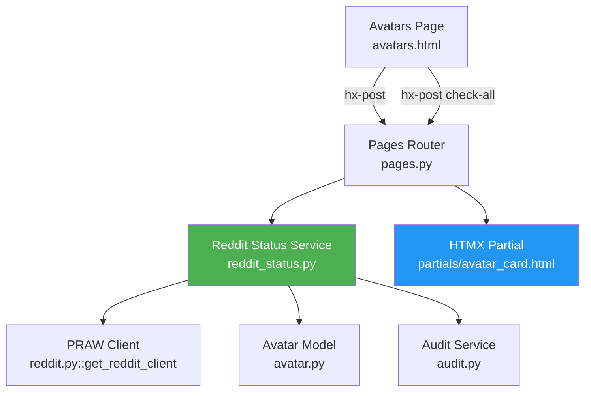
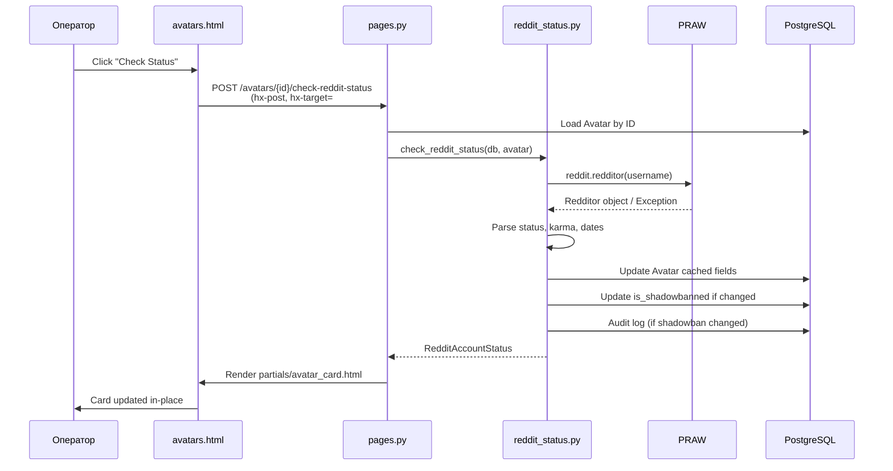
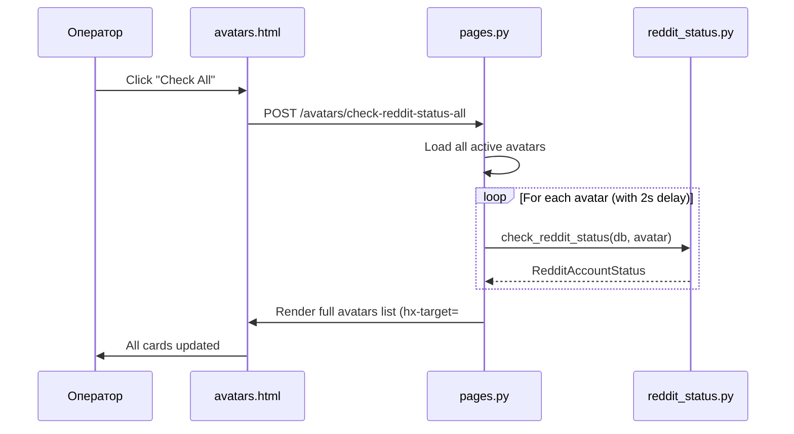

# Design Document: Avatar Reddit Status

## Overview

Фича добавляет проверку реального статуса Reddit-аккаунтов аватаров через PRAW API и отображение этой информации на странице `/avatars-page`. Оператор сможет видеть актуальное состояние каждого аватара: жив ли аккаунт, не забанен ли, какая у него реальная карма, и когда последний раз проверялся статус.

### Ключевые решения

1. **Новый сервис `reddit_status.py`** — отдельный модуль в `services/`, изолированный от существующего `reddit.py` (который занимается скрейпингом). Это соответствует принципу single responsibility и не затрагивает работающий код скрейпинга.

2. **Кэширование в модели Avatar** — новые поля прямо в таблице `avatars`, без отдельной таблицы. Статус проверяется редко (по запросу оператора), данных мало (6 полей), и это избавляет от JOIN при отображении страницы.

3. **HTMX partial для карточки аватара** — каждая карточка оборачивается в `div` с уникальным `id`, кнопка "Check Status" делает `hx-post` и заменяет содержимое карточки. Паттерн уже используется в проекте (review approve/reject, keyword rows).

4. **Rate limiting через `time.sleep`** — при "Check All" между запросами к Reddit API вставляется задержка 2 секунды. Для MVP это достаточно; Celery-задача для фоновой проверки — будущая оптимизация.

## Architecture

### Компонентная диаграмма



### Поток данных: проверка одного аватара



### Поток данных: проверка всех аватаров



## Components and Interfaces

### 1. Reddit Status Service (`app/services/reddit_status.py`)

Новый сервисный модуль. Использует существующий `get_reddit_client()` из `reddit.py`.

```python
@dataclass
class RedditAccountStatus:
    """Result of a Reddit account status check."""
    exists: bool
    is_suspended: bool
    comment_karma: int
    post_karma: int
    account_created: datetime | None
    icon_url: str | None
    error: str | None  # None if successful, error message otherwise

def check_reddit_status(db: Session, avatar: Avatar) -> RedditAccountStatus:
    """
    Fetch Reddit account status via PRAW and update cached fields on Avatar.
    
    - Fetches redditor by avatar.reddit_username
    - Handles NotFound (account deleted), Forbidden (suspended), network errors
    - Updates avatar.reddit_status, reddit_karma_*, reddit_account_created, etc.
    - Updates avatar.is_shadowbanned if suspension status changed
    - Logs audit event on shadowban status change
    - Returns RedditAccountStatus dataclass
    """

def check_all_reddit_statuses(
    db: Session, 
    avatars: list[Avatar], 
    delay_seconds: float = 2.0
) -> list[dict]:
    """
    Check Reddit status for multiple avatars with rate limiting.
    
    - Iterates through avatars with time.sleep(delay_seconds) between calls
    - Continues on individual failures (logs error, marks avatar as error)
    - Returns list of {avatar_id, username, status, error} dicts
    """
```

### 2. Расширение Avatar Model (`app/models/avatar.py`)

Новые поля для кэширования Reddit-статуса:

```python
# Reddit status cache (new fields)
reddit_status: Mapped[str] = mapped_column(String(20), default="unknown")
reddit_karma_comment: Mapped[int] = mapped_column(Integer, default=0)
reddit_karma_post: Mapped[int] = mapped_column(Integer, default=0)
reddit_account_created: Mapped[datetime | None] = mapped_column(DateTime(timezone=True), nullable=True)
reddit_icon_url: Mapped[str | None] = mapped_column(String(500), nullable=True)
reddit_status_checked_at: Mapped[datetime | None] = mapped_column(DateTime(timezone=True), nullable=True)
```

### 3. Новые роуты в `pages.py`

```python
@router.post("/avatars/{avatar_id}/check-reddit-status", response_class=HTMLResponse)
def check_avatar_reddit_status(avatar_id: UUID, request: Request, db: Session):
    """Single avatar status check. Returns HTMX partial."""

@router.post("/avatars/check-reddit-status-all", response_class=HTMLResponse)
def check_all_avatars_reddit_status(request: Request, db: Session):
    """Bulk status check. Returns updated avatars grid."""
```

Роуты размещаются в `pages.py` (а не в `avatars.py`), потому что они возвращают HTML-partial для HTMX, а не JSON. Это соответствует существующему паттерну: `pages.py` содержит все HTMX-эндпоинты для пользовательских страниц (approve/reject comment, edit comment и т.д.).

### 4. HTMX Partial (`app/templates/partials/avatar_card.html`)

Шаблон одной карточки аватара, используемый как для полной страницы, так и для HTMX-замены. Страница `avatars.html` будет включать этот partial через ``.

### 5. Обновление `avatars.html`

- Кнопка "Check All" в шапке страницы
- Каждая карточка обёрнута в `div#avatar-card-{id}` для HTMX-таргетинга
- Кнопка "Check Status" на каждой карточке
- Новые поля: Reddit Status Badge, реальная карма, возраст аккаунта, индикатор расхождения кармы, индикатор устаревших данных

### 6. Обновление `get_avatar_health()` в `safety.py`

Добавление Reddit-статусных полей в возвращаемый dict, чтобы шаблон имел доступ к кэшированным данным:

```python
# New fields in get_avatar_health() return dict:
"reddit_status": avatar.reddit_status,
"reddit_karma_comment": avatar.reddit_karma_comment,
"reddit_karma_post": avatar.reddit_karma_post,
"reddit_account_created": avatar.reddit_account_created,
"reddit_icon_url": avatar.reddit_icon_url,
"reddit_status_checked_at": avatar.reddit_status_checked_at,
"reddit_status_stale": is_stale,  # True if checked_at > 24h ago
"karma_discrepancy": has_discrepancy,  # True if diff > 10%
```

## Data Models

### Изменения в таблице `avatars`

| Поле | Тип | Default | Описание |
|------|-----|---------|----------|
| `reddit_status` | `VARCHAR(20)` | `"unknown"` | Статус: `active`, `suspended`, `not_found`, `unknown` |
| `reddit_karma_comment` | `INTEGER` | `0` | Реальная comment karma из Reddit |
| `reddit_karma_post` | `INTEGER` | `0` | Реальная post karma из Reddit |
| `reddit_account_created` | `TIMESTAMP WITH TZ` | `NULL` | Дата создания Reddit-аккаунта |
| `reddit_icon_url` | `VARCHAR(500)` | `NULL` | URL иконки Reddit-аккаунта |
| `reddit_status_checked_at` | `TIMESTAMP WITH TZ` | `NULL` | Время последней проверки статуса |

### Alembic Migration

Новая миграция добавляет 6 колонок в таблицу `avatars`. Все поля nullable или имеют default, поэтому миграция безопасна для существующих данных.

```python
def upgrade() -> None:
    op.add_column("avatars", sa.Column("reddit_status", sa.String(20), server_default="unknown", nullable=False))
    op.add_column("avatars", sa.Column("reddit_karma_comment", sa.Integer(), server_default="0", nullable=False))
    op.add_column("avatars", sa.Column("reddit_karma_post", sa.Integer(), server_default="0", nullable=False))
    op.add_column("avatars", sa.Column("reddit_account_created", sa.DateTime(timezone=True), nullable=True))
    op.add_column("avatars", sa.Column("reddit_icon_url", sa.String(500), nullable=True))
    op.add_column("avatars", sa.Column("reddit_status_checked_at", sa.DateTime(timezone=True), nullable=True))
```

### RedditAccountStatus (dataclass, не ORM)

```python
@dataclass
class RedditAccountStatus:
    exists: bool                      # True если аккаунт найден
    is_suspended: bool                # True если suspended/banned
    comment_karma: int                # Реальная comment karma
    post_karma: int                   # Реальная post karma
    account_created: datetime | None  # Дата создания аккаунта
    icon_url: str | None              # URL аватарки
    error: str | None                 # Сообщение об ошибке (None = успех)
```

### Audit Log Events

При изменении `is_shadowbanned` создаётся запись в `audit_log`:

```python
AuditLog(
    action="reddit_status_shadowban_changed",
    entity_type="avatar",
    entity_id=avatar.id,
    details={
        "username": avatar.reddit_username,
        "previous_shadowbanned": old_value,
        "new_shadowbanned": new_value,
        "reddit_status": new_status,
    }
)
```

