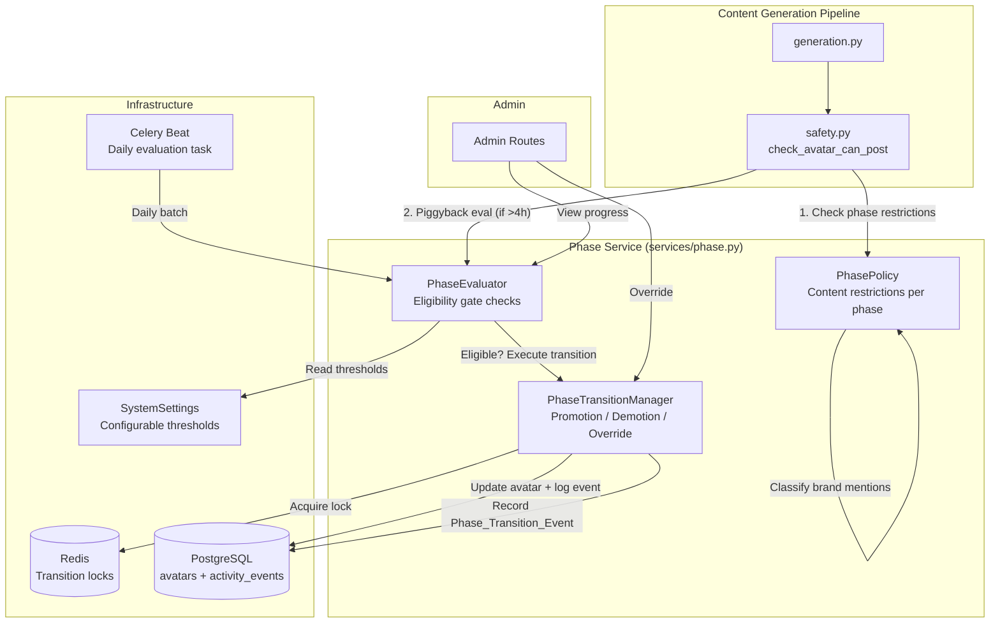

# Design Document: Avatar Warming Phases

## Overview

This design replaces the existing binary 14-day warmup check (`WARMUP_DAYS` constant in `safety.py`) with a formal 3-phase progression model. Each avatar progresses through:

- **Phase 1** — Credibility Building (hobby only, zero brand)
- **Phase 2** — Content Seeding (professional allowed, no explicit brand)
- **Phase 3** — Brand Integration (full brand with ratio limits + ramp-up)

Phase transitions are governed by measurable eligibility gates (age, karma, activity count, comment survival rate, average comment score). The system supports automatic promotion/demotion, on-demand eligibility checks with a 4-hour cooldown, admin overrides, and a 7-day ramp-up period after Phase 3 promotion.

### Key Design Decisions

| Decision | Choice | Rationale |
|----------|--------|-----------|
| Transition lock | Redis SETNX (same pattern as `ScrapeDistributedLock`) | Already proven in codebase; per-avatar key with 30s TTL prevents race conditions between daily batch and on-demand checks |
| Service structure | Three classes in single `services/phase.py` | Maintains separation of concerns while avoiding import complexity; follows existing service file patterns |
| Safety integration | PhasePolicy called first in `check_avatar_can_post()` | Replaces `WARMUP_DAYS` check at same position; callers unchanged |
| Survival rate / avg score | Computed on-the-fly from `comment_drafts` table | Avoids denormalization; queries are bounded by time window (7-90 days); can add materialized view later if needed |
| Brand classification | Deterministic checks first (URL match, string match), AI fallback for `inferred_brand` | Fast path for obvious cases; AI only called when deterministic checks pass |
| Migration strategy | Single Alembic migration with conditional UPDATE | Phase 1 for accounts < 60 days, Phase 2 for >= 60 days; Phase 3 only achievable post-migration |

## Architecture



### Data Flow

1. **Comment generation** → `check_avatar_can_post()` is called
2. **Safety service** invokes `PhasePolicy.check_comment_allowed()` with avatar, comment type, subreddit, text
3. **PhasePolicy** classifies brand mentions, checks phase-specific rules, returns allow/block/requires_review
4. If blocked → `SafetyCheckResult(allowed=False)` + `policy_block` ActivityEvent
5. If allowed → existing rate limit checks continue as before
6. **Piggyback**: if `last_phase_evaluated_at` > 4 hours ago, `PhaseEvaluator.evaluate()` runs
7. If eligible → `PhaseTransitionManager.promote()` acquires lock, updates avatar, logs event

## Components and Interfaces

### PhasePolicy

Determines what content is allowed for an avatar's current phase.

```python
class PhasePolicy:
    """Content restriction rules per warming phase."""

    def check_comment_allowed(
        self,
        db: Session,
        avatar: Avatar,
        comment_type: str,          # "professional" | "hobby"
        target_subreddit: str,
        comment_text: str,
        client: Client,
        thread_tag: str | None = None,  # "engage" | "monitor" | "skip"
    ) -> PolicyResult:
        """Determine if a comment is allowed under phase restrictions.

        Returns:
            PolicyResult with status (allowed/blocked/requires_review),
            reason string, and detected brand_mention_level.
        """
        ...

    def classify_brand_mention(
        self,
        comment_text: str,
        client: Client,
    ) -> BrandMentionLevel | None:
        """Classify the highest-severity brand mention in comment text.

        Priority: explicit_brand_link > explicit_brand_name > inferred_brand > None
        """
        ...

    def get_daily_comment_count(
        self,
        db: Session,
        avatar: Avatar,
    ) -> int:
        """Count today's approved/posted comments for rate limiting."""
        ...

    def get_brand_ratio(
        self,
        db: Session,
        avatar: Avatar,
        window_days: int = 7,
    ) -> float:
        """Calculate brand comment ratio over the given window."""
        ...

    def get_ramp_up_stage(
        self,
        avatar: Avatar,
    ) -> RampUpStage:
        """Determine ramp-up stage based on time since phase_changed_at.

        Returns: EARLY (0-72h), MID (72h-7d), or COMPLETE (>7d)
        """
        ...
```

### PhaseEvaluator

Evaluates whether an avatar meets eligibility criteria for the next phase, and checks demotion triggers.

```python
class PhaseEvaluator:
    """Eligibility gate checks for phase transitions."""

    def evaluate(
        self,
        db: Session,
        avatar: Avatar,
    ) -> EvaluationResult:
        """Evaluate promotion eligibility and demotion triggers.

        Updates last_phase_evaluated_at on the avatar.

        Returns:
            EvaluationResult with action (promote/demote/none),
            target_phase, criteria_values dict, and trigger_reason.
        """
        ...

    def check_promotion_eligibility(
        self,
        db: Session,
        avatar: Avatar,
    ) -> tuple[bool, dict]:
        """Check if avatar meets all criteria for next phase.

        Returns:
            (eligible: bool, criteria_values: dict with current vs required)
        """
        ...

    def check_demotion_triggers(
        self,
        db: Session,
        avatar: Avatar,
    ) -> tuple[bool, str | None]:
        """Check if any demotion trigger is active.

        Triggers:
        - Shadowban detected → demote to Phase 1
        - Survival rate < 70% (7-day window) → demote by 1
        - Karma velocity drop > 50% (7-day vs prior 7-day) → demote by 1

        Returns:
            (should_demote: bool, trigger_reason: str | None)
        """
        ...

    def get_thresholds(
        self,
        db: Session,
        current_phase: int,
    ) -> dict:
        """Load eligibility thresholds from SystemSettings with fallback to defaults."""
        ...

    def compute_comment_survival_rate(
        self,
        db: Session,
        avatar: Avatar,
        window_days: int,
    ) -> float:
        """Calculate (total_posted - deleted) / total_posted over window."""
        ...

    def compute_avg_comment_score(
        self,
        db: Session,
        avatar: Avatar,
        window_days: int,
    ) -> float:
        """Calculate mean upvote score over window."""
        ...

    def should_piggyback(self, avatar: Avatar) -> bool:
        """Return True if last_phase_evaluated_at is > 4 hours ago or None."""
        ...
```

### PhaseTransitionManager

Executes phase transitions with locking and event recording.

```python
class PhaseTransitionManager:
    """Executes phase transitions (promotions, demotions, overrides)."""

    def promote(
        self,
        db: Session,
        avatar: Avatar,
        criteria_values: dict,
    ) -> bool:
        """Promote avatar to next phase.

        Acquires transition lock, updates warming_phase and phase_changed_at,
        records Phase_Transition_Event.

        Returns:
            True if promotion succeeded, False if lock not acquired.
        """
        ...

    def demote(
        self,
        db: Session,
        avatar: Avatar,
        target_phase: int,
        trigger_reason: str,
    ) -> bool:
        """Demote avatar to target phase.

        Acquires transition lock, updates fields, records event.
        If avatar already in Phase 1, logs but does not demote.

        Returns:
            True if demotion succeeded, False if lock not acquired.
        """
        ...

    def admin_override(
        self,
        db: Session,
        avatar: Avatar,
        target_phase: int,
        admin_user_id: str,
        reason: str,
    ) -> bool:
        """Admin override to set avatar to specific phase.

        Validates target_phase is 1, 2, or 3.
        Acquires lock, updates fields, records phase_override event.

        Returns:
            True if override succeeded.
        Raises:
            ValueError if target_phase not in {1, 2, 3}.
        """
        ...

    def _acquire_lock(self, avatar_id: str, timeout: int = 5) -> bool:
        """Acquire per-avatar Redis lock with timeout."""
        ...

    def _release_lock(self, avatar_id: str) -> None:
        """Release per-avatar Redis lock."""
        ...

    def _record_event(
        self,
        db: Session,
        avatar: Avatar,
        event_type: str,
        previous_phase: int,
        new_phase: int,
        metadata: dict,
    ) -> None:
        """Record a Phase_Transition_Event as an ActivityEvent."""
        ...
```

### Supporting Types

```python
from enum import Enum
from dataclasses import dataclass


class BrandMentionLevel(str, Enum):
    EXPLICIT_BRAND_LINK = "explicit_brand_link"
    EXPLICIT_BRAND_NAME = "explicit_brand_name"
    INFERRED_BRAND = "inferred_brand"


class PolicyStatus(str, Enum):
    ALLOWED = "allowed"
    BLOCKED = "blocked"
    REQUIRES_REVIEW = "requires_review"


class RampUpStage(str, Enum):
    EARLY = "early"       # 0-72 hours: max 1 brand comment
    MID = "mid"           # 72h-7d: max 10% brand ratio
    COMPLETE = "complete" # >7d: standard 30% ratio


@dataclass
class PolicyResult:
    status: PolicyStatus
    reason: str
    brand_mention_level: BrandMentionLevel | None = None


@dataclass
class EvaluationResult:
    action: str  # "promote" | "demote" | "none"
    target_phase: int | None = None
    criteria_values: dict | None = None
    trigger_reason: str | None = None
```

### Transition Lock

Follows the existing `ScrapeDistributedLock` pattern:

```python
class PhaseTransitionLock:
    """Per-avatar distributed lock for phase transitions."""

    KEY_PREFIX = "phase_lock:"
    DEFAULT_TTL = 30  # 30 seconds — transitions are fast

    def __init__(self, redis_client: redis.Redis) -> None:
        self.redis = redis_client
        self._release_script = self.redis.register_script(_RELEASE_SCRIPT)
        self._owned_values: dict[str, str] = {}

    def acquire(self, avatar_id: str, timeout: int = 5) -> bool:
        """Try to acquire lock with polling timeout.

        Polls every 0.5s up to `timeout` seconds.
        Returns True if acquired, False if timeout exceeded.
        """
        ...

    def release(self, avatar_id: str) -> None:
        """Release lock using atomic Lua script."""
        ...
```

## Data Models

### Avatar Model Changes

New fields added to `app/models/avatar.py`:

```python
# Warming phase fields
warming_phase: Mapped[int] = mapped_column(Integer, default=1, server_default="1")
phase_changed_at: Mapped[datetime] = mapped_column(
    DateTime(timezone=True), server_default=func.now()
)
last_phase_evaluated_at: Mapped[datetime | None] = mapped_column(
    DateTime(timezone=True), nullable=True
)
```

### Client Model — Brand Domain

New field on `app/models/client.py` for URL-based brand detection:

```python
brand_domain: Mapped[str | None] = mapped_column(String(255), nullable=True)
# e.g., "xmcyber.com" — used by PhasePolicy to detect explicit_brand_link
```

### CommentDraft Model — Tracking Deletions and Scores

New fields on `app/models/comment_draft.py` for survival rate and score tracking:

```python
# Reddit feedback (populated by health check / status sync)
is_deleted: Mapped[bool] = mapped_column(Boolean, default=False, server_default="false")
reddit_score: Mapped[int | None] = mapped_column(Integer, nullable=True)
deleted_detected_at: Mapped[datetime | None] = mapped_column(
    DateTime(timezone=True), nullable=True
)
```

### SystemSettings Keys

Phase gate thresholds stored in `system_settings` table:

| Key | Default | Description |
|-----|---------|-------------|
| `phase_gate_p1_min_age_days` | 60 | Min Reddit account age for Phase 2 |
| `phase_gate_p1_min_karma` | 100 | Min combined karma for Phase 2 |
| `phase_gate_p1_min_activity` | 20 | Min comments (60-day window) for Phase 2 |
| `phase_gate_p1_min_survival_rate` | 80 | Min survival % (60-day window) for Phase 2 |
| `phase_gate_p2_min_age_days` | 150 | Min Reddit account age for Phase 3 |
| `phase_gate_p2_min_karma` | 500 | Min combined karma for Phase 3 |
| `phase_gate_p2_min_activity` | 50 | Min comments (90-day window) for Phase 3 |
| `phase_gate_p2_min_survival_rate` | 85 | Min survival % (90-day window) for Phase 3 |
| `phase_gate_p2_min_avg_score` | 2.0 | Min avg comment score (90-day window) for Phase 3 |
| `phase_demotion_min_survival_rate` | 70 | Survival % below which demotion triggers (7-day) |
| `phase_demotion_karma_velocity_drop` | 50 | Karma velocity drop % triggering demotion |
| `phase_ramp_up_days` | 7 | Ramp-up period duration in days |

### Alembic Migration

```python
"""Add warming phase fields to avatars, brand tracking to comments, brand_domain to clients."""

def upgrade():
    # Avatar phase fields
    op.add_column('avatars', sa.Column('warming_phase', sa.Integer(), server_default='1', nullable=False))
    op.add_column('avatars', sa.Column('phase_changed_at', sa.DateTime(timezone=True), server_default=sa.func.now(), nullable=False))
    op.add_column('avatars', sa.Column('last_phase_evaluated_at', sa.DateTime(timezone=True), nullable=True))

    # Comment tracking fields
    op.add_column('comment_drafts', sa.Column('is_deleted', sa.Boolean(), server_default='false', nullable=False))
    op.add_column('comment_drafts', sa.Column('reddit_score', sa.Integer(), nullable=True))
    op.add_column('comment_drafts', sa.Column('deleted_detected_at', sa.DateTime(timezone=True), nullable=True))

    # Client brand domain
    op.add_column('clients', sa.Column('brand_domain', sa.String(255), nullable=True))

    # Conditional phase assignment for existing avatars
    # Phase 2 for accounts >= 60 days old, Phase 1 for the rest
    op.execute("""
        UPDATE avatars
        SET warming_phase = 2,
            phase_changed_at = NOW()
        WHERE reddit_account_created IS NOT NULL
          AND reddit_account_created < NOW() - INTERVAL '60 days'
    """)

def downgrade():
    op.drop_column('avatars', 'warming_phase')
    op.drop_column('avatars', 'phase_changed_at')
    op.drop_column('avatars', 'last_phase_evaluated_at')
    op.drop_column('comment_drafts', 'is_deleted')
    op.drop_column('comment_drafts', 'reddit_score')
    op.drop_column('comment_drafts', 'deleted_detected_at')
    op.drop_column('clients', 'brand_domain')
```

### ActivityEvent Usage

Phase transitions and policy blocks are recorded as `ActivityEvent` records:

| event_type | message | metadata |
|------------|---------|----------|
| `phase_promotion` | "Avatar {username} promoted from Phase {old} to Phase {new}" | `{avatar_id, previous_phase, new_phase, criteria_values}` |
| `auto_downgrade` | "Avatar {username} demoted from Phase {old} to Phase {new}: {reason}" | `{avatar_id, previous_phase, new_phase, trigger_reason}` |
| `phase_override` | "Admin override: {username} set to Phase {new} by {admin}" | `{avatar_id, previous_phase, new_phase, admin_user_id, reason}` |
| `policy_block` | "Phase {phase} blocked {type} comment for {username}" | `{avatar_id, phase, comment_type, subreddit, brand_mention_level, restriction_rule}` |

## Correctness Properties

*A property is a characteristic or behavior that should hold true across all valid executions of a system — essentially, a formal statement about what the system should do. Properties serve as the bridge between human-readable specifications and machine-verifiable correctness guarantees.*

### Property 1: Phase 1 Policy Correctness

*For any* avatar in Phase 1 and any comment (with type, target subreddit, and text), the PhasePolicy SHALL allow the comment if and only if: (a) the comment type is "hobby", (b) the target subreddit is in the avatar's `hobby_subreddits`, (c) the brand mention level is None, and (d) the avatar's daily comment count is below 3.

**Validates: Requirements 2.1, 2.2, 2.3, 2.4, 2.5**

### Property 2: Phase 2 Policy Correctness

*For any* avatar in Phase 2 and any comment, the PhasePolicy SHALL: (a) block if brand mention level is `explicit_brand_link` or `explicit_brand_name`, (b) return `requires_review` if brand mention level is `inferred_brand`, (c) allow if comment type is "hobby" or "professional" with no explicit brand mentions and target subreddit is in `hobby_subreddits` or `business_subreddits`, and (d) block if daily comment count >= MAX_COMMENTS_PER_DAY.

**Validates: Requirements 3.1, 3.2, 3.3, 3.4, 3.5, 3.6, 3.7**

### Property 3: Phase 3 Policy with Ramp-Up Correctness

*For any* avatar in Phase 3 and any comment with a brand mention, the PhasePolicy SHALL enforce ramp-up constraints based on time since `phase_changed_at`: (a) during the first 72 hours, at most 1 brand comment total is allowed, (b) during days 4-7, brand ratio must be ≤ 10%, (c) after 7 days, standard MAX_BRAND_RATIO (30%) applies, and (d) brand links are only allowed when the thread is tagged "engage".

**Validates: Requirements 4.1, 4.2, 4.3, 4.4, 4.5, 13.1, 13.2, 13.3, 13.4, 13.5, 13.6**

### Property 4: Eligibility Evaluation Correctness

*For any* avatar, the PhaseEvaluator SHALL report the avatar as eligible for the next phase if and only if ALL criteria for that transition are simultaneously met (Phase 1→2: age≥60, karma≥100, activity≥20, survival≥80%; Phase 2→3: age≥150, karma≥500, activity≥50, survival≥85%, avg_score≥2.0). If any single criterion is not met, the avatar remains in its current phase.

**Validates: Requirements 5.1, 5.2, 5.3**

### Property 5: Promotion Execution Invariants

*For any* successful phase promotion, the avatar's `warming_phase` SHALL equal the previous phase + 1, `phase_changed_at` SHALL be updated to the current UTC time, and a `phase_promotion` ActivityEvent SHALL be recorded containing the avatar ID, previous phase, new phase, and criteria values.

**Validates: Requirements 6.1, 6.2, 6.3**

### Property 6: Piggyback Evaluation Cooldown

*For any* PhasePolicy invocation, a piggyback eligibility check SHALL occur if and only if the avatar's `last_phase_evaluated_at` is either NULL or more than 4 hours before the current time. After evaluation, `last_phase_evaluated_at` SHALL be updated to the current time.

**Validates: Requirements 6.7, 15.2, 15.3**

### Property 7: Admin Override Execution

*For any* admin override with a valid target phase (1, 2, or 3), the avatar's `warming_phase` SHALL be set to the target value, `phase_changed_at` SHALL be updated, and a `phase_override` ActivityEvent SHALL be recorded containing the admin user ID, previous phase, new phase, and reason.

**Validates: Requirements 7.1, 7.2, 7.3**

### Property 8: Policy Block Logging

*For any* comment blocked by the PhasePolicy, the Safety Service SHALL return `SafetyCheckResult(allowed=False)` with a descriptive reason AND log a `policy_block` ActivityEvent containing the avatar ID, phase, comment type, target subreddit, detected brand mention level, and the specific restriction rule.

**Validates: Requirements 8.2, 8.6**

### Property 9: Health Endpoint Phase Fields

*For any* avatar, `get_avatar_health()` SHALL return a dictionary containing `warming_phase` (integer 1-3), `phase_label` (correct string mapping), `phase_progress` (dictionary with current values and thresholds for all next-phase criteria), and `phase_eligible_for_next` (boolean matching actual eligibility evaluation).

**Validates: Requirements 10.1, 10.2, 10.3, 10.4**

### Property 10: Shadowban Demotion

*For any* avatar in Phase 2 or Phase 3 that becomes shadowbanned, the PhaseTransitionManager SHALL demote it to Phase 1, update `phase_changed_at`, and record an `auto_downgrade` ActivityEvent with trigger reason "shadowban_detected".

**Validates: Requirements 11.1, 11.4, 11.5**

### Property 11: Quality Degradation Demotion

*For any* avatar in Phase 2 or Phase 3, if the Comment_Survival_Rate over a rolling 7-day window drops below 70% OR the Combined_Karma velocity drops by more than 50% compared to the previous 7-day period, the PhaseTransitionManager SHALL demote the avatar by exactly one phase. If the avatar is already in Phase 1, no demotion occurs but the trigger event is logged.

**Validates: Requirements 11.2, 11.3, 11.4, 11.5, 11.7**

### Property 12: Brand Mention Classification Priority

*For any* comment text and client configuration, the brand classifier SHALL return the highest-severity level present using priority order: `explicit_brand_link` > `explicit_brand_name` > `inferred_brand` > None. A comment containing both a brand URL and brand name SHALL be classified as `explicit_brand_link`.

**Validates: Requirements 12.1, 12.2, 12.3, 12.5, 12.6**

### Property 13: New Avatar Phase Defaults

*For any* newly created avatar, the system SHALL assign `warming_phase` = 1 and `phase_changed_at` = current UTC time, regardless of other avatar attributes.

**Validates: Requirements 1.3**

### Property 14: Inactive Avatar Evaluation Skip

*For any* avatar that is inactive (`active=False`) or shadowbanned (`is_shadowbanned=True`), the PhaseEvaluator SHALL skip phase evaluation entirely during both daily batch and on-demand checks.

**Validates: Requirements 6.5**

## Error Handling

| Scenario | Handling |
|----------|----------|
| Transition lock timeout (>5s) | Skip transition, log warning, return False. Avatar will be picked up on next evaluation cycle. |
| Redis unavailable | Fall back to no-lock behavior with DB-level optimistic locking (check phase hasn't changed before UPDATE). Log error. |
| SystemSetting missing | Use hardcoded defaults. Log info-level message on first access. |
| Brand classification AI failure | Treat as `inferred_brand` (conservative — triggers `requires_review` in Phase 2, counts toward ratio in Phase 3). Log error. |
| Invalid phase value in admin override | Return 422 validation error before acquiring lock. |
| Avatar has no `reddit_account_created` | Use `created_at` as fallback for age calculation. Log warning. |
| Comment survival rate division by zero (no posted comments) | Return 100% survival rate (no evidence of deletion). |
| Concurrent promotion + demotion | Lock ensures only one executes. Second attempt skips. If demotion trigger fires after promotion, next evaluation cycle will catch it. |
| Daily batch fails mid-execution | Each avatar is evaluated independently. Failures are logged per-avatar; other avatars continue. |

## Testing Strategy

### Property-Based Testing

This feature is well-suited for property-based testing because:
- The PhasePolicy is a pure decision function (avatar state + comment attributes → allow/block/review)
- The PhaseEvaluator is a pure eligibility check (avatar metrics → eligible/not eligible)
- Brand classification is deterministic for explicit checks (URL/string matching)
- The input space is large (combinations of phases, comment types, subreddits, brand levels, time windows)

**Library**: [Hypothesis](https://hypothesis.readthedocs.io/) (already in use — `.hypothesis/` directory exists in project)

**Configuration**: Minimum 100 examples per property test (`@settings(max_examples=100)`)

**Tag format**: Each test tagged with `# Feature: avatar-warming-phases, Property {N}: {title}`

### Unit Tests (Example-Based)

- Migration logic: verify phase assignment for avatars with various ages
- Admin override with invalid phase value → 422
- Lock timeout behavior (mock Redis with delay)
- Piggyback trigger after exactly 4 hours
- Ramp-up stage boundaries (72h, 7d)
- `get_avatar_health()` output structure validation
- Safety service integration: verify PhasePolicy is called before rate limits

### Integration Tests

- Celery beat schedule includes `evaluate_all_avatar_phases` task
- Full promotion flow: create avatar → accumulate metrics → evaluate → verify phase change
- Admin override via HTTP endpoint with auth
- Policy block → ActivityEvent creation in database
- Redis lock acquire/release lifecycle

### Test Organization

```
tests/
├── test_phase_policy.py          # Property tests for PhasePolicy
├── test_phase_evaluator.py       # Property tests for PhaseEvaluator
├── test_phase_transitions.py     # Property tests for PhaseTransitionManager
├── test_brand_classification.py  # Property tests for brand mention classifier
├── test_phase_integration.py     # Integration tests (safety service, Celery)
└── test_phase_admin.py           # Admin override endpoint tests
```
