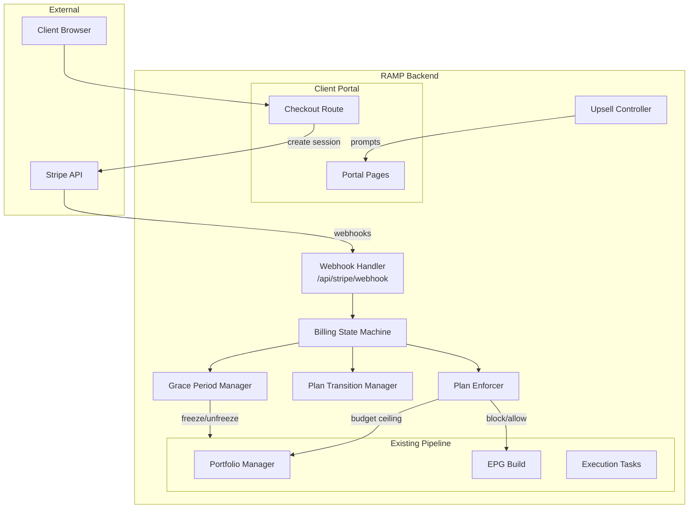
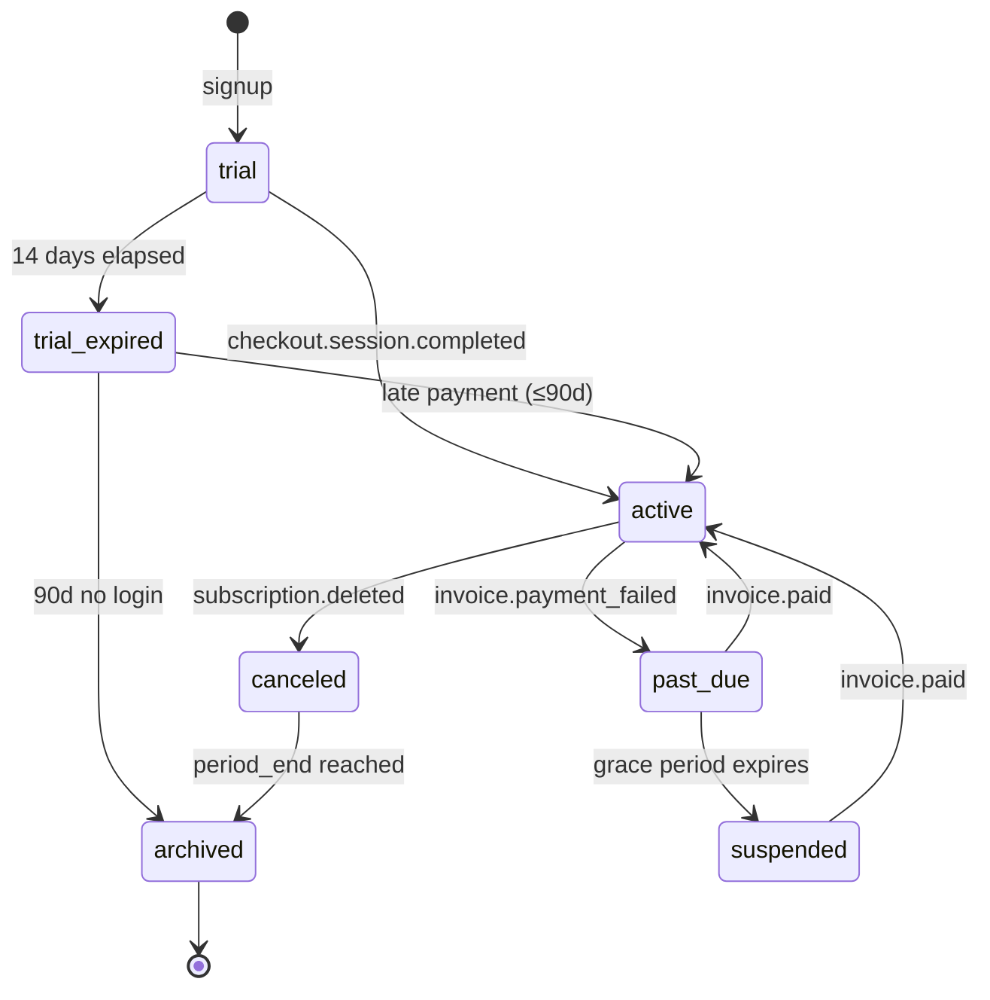

# Design Document

## Overview

This design implements the Billing Plan Enforcement system for RAMP — a layered architecture that separates billing state management from Stripe integration, enabling full testability while maintaining Stripe as the financial source of truth.

The system adds 5 new services, 4 new DB models, 1 new route file, and integrates at 6 existing pipeline touchpoints. Total new code: ~2,500 lines. No existing service is significantly rewritten — integration is via hooks and guards.

## Components and Interfaces

## Architecture

### System Context



### State Machine



Valid transitions enforced by `BillingStateMachine.transition()`:
- `trial → active`
- `trial → trial_expired`
- `trial_expired → active`
- `trial_expired → archived`
- `active → past_due`
- `active → canceled`
- `past_due → active`
- `past_due → suspended`
- `suspended → active`
- `canceled → archived`

Any other transition is rejected with logged error.

## Data Models

### New Tables

#### `plan_definitions`

Source of truth for all plan limits. Replaces hardcoded `PLAN_LIMITS` dict.

```python
class PlanDefinition(Base):
    __tablename__ = "plan_definitions"

    id: Mapped[uuid.UUID] = mapped_column(UUID, primary_key=True, default=uuid.uuid4)
    plan_type: Mapped[str] = mapped_column(String(20), unique=True, nullable=False)  # trial/seed/starter/growth/scale/agency
    label: Mapped[str] = mapped_column(String(50), nullable=False)
    price_usd: Mapped[int] = mapped_column(Integer, nullable=False)  # monthly price in cents
    stripe_price_id: Mapped[str | None] = mapped_column(String(100), nullable=True)  # Stripe Price object ID
    
    # Limits
    max_actions_per_month: Mapped[int] = mapped_column(Integer, nullable=False)
    max_avatars: Mapped[int] = mapped_column(Integer, nullable=False)
    max_subreddits: Mapped[int] = mapped_column(Integer, nullable=False)
    max_professional_subreddits: Mapped[int] = mapped_column(Integer, nullable=False)
    max_posts_per_month: Mapped[int] = mapped_column(Integer, nullable=False)  # Post_Sub_Limit
    max_keywords: Mapped[int] = mapped_column(Integer, nullable=False)
    geo_monitoring_enabled: Mapped[bool] = mapped_column(Boolean, nullable=False)
    geo_prompts_limit: Mapped[int] = mapped_column(Integer, nullable=False)
    
    # Metadata
    is_self_serve: Mapped[bool] = mapped_column(Boolean, default=True)  # shows in checkout UI
    tier_order: Mapped[int] = mapped_column(Integer, nullable=False)  # 0=trial, 1=seed, ..., 5=agency
    created_at: Mapped[datetime] = mapped_column(DateTime(timezone=True), server_default=func.now())
    updated_at: Mapped[datetime] = mapped_column(DateTime(timezone=True), server_default=func.now(), onupdate=func.now())
```

#### `client_subscriptions`

Mirrors Stripe subscription state per client.

```python
class ClientSubscription(Base):
    __tablename__ = "client_subscriptions"

    id: Mapped[uuid.UUID] = mapped_column(UUID, primary_key=True, default=uuid.uuid4)
    client_id: Mapped[uuid.UUID] = mapped_column(UUID, ForeignKey("clients.id"), nullable=False, index=True)
    
    # Stripe identifiers
    stripe_customer_id: Mapped[str | None] = mapped_column(String(100), nullable=True)
    stripe_subscription_id: Mapped[str | None] = mapped_column(String(100), nullable=True, unique=True)
    
    # State
    status: Mapped[str] = mapped_column(String(20), nullable=False, default="trial")
    # trial | active | past_due | suspended | canceled | archived
    
    # Billing period (mirrored from Stripe)
    billing_period_start: Mapped[datetime | None] = mapped_column(DateTime(timezone=True), nullable=True)
    billing_period_end: Mapped[datetime | None] = mapped_column(DateTime(timezone=True), nullable=True)
    
    # Action counter
    monthly_action_counter: Mapped[int] = mapped_column(Integer, default=0, server_default="0")
    monthly_post_counter: Mapped[int] = mapped_column(Integer, default=0, server_default="0")
    last_notified_threshold: Mapped[int] = mapped_column(Integer, default=0, server_default="0")
    # 0=none, 80=warned at 80%, 90=warned at 90%, 100=warned at 100%
    
    # Grace period
    grace_period_start: Mapped[datetime | None] = mapped_column(DateTime(timezone=True), nullable=True)
    grace_period_days: Mapped[int] = mapped_column(Integer, default=7, server_default="7")
    previous_grace_ended_at: Mapped[datetime | None] = mapped_column(DateTime(timezone=True), nullable=True)
    
    # Pending transitions
    pending_downgrade_plan: Mapped[str | None] = mapped_column(String(20), nullable=True)
    pending_downgrade_effective_at: Mapped[datetime | None] = mapped_column(DateTime(timezone=True), nullable=True)
    
    # Cancellation
    cancel_at_period_end: Mapped[bool] = mapped_column(Boolean, default=False, server_default="false")
    
    created_at: Mapped[datetime] = mapped_column(DateTime(timezone=True), server_default=func.now())
    updated_at: Mapped[datetime] = mapped_column(DateTime(timezone=True), server_default=func.now(), onupdate=func.now())
    
    # Relationships
    client = relationship("Client", backref="subscription")
```

#### `webhook_events`

Audit log for all Stripe webhook events.

```python
class WebhookEvent(Base):
    __tablename__ = "webhook_events"

    id: Mapped[uuid.UUID] = mapped_column(UUID, primary_key=True, default=uuid.uuid4)
    stripe_event_id: Mapped[str] = mapped_column(String(100), unique=True, nullable=False)
    event_type: Mapped[str] = mapped_column(String(100), nullable=False)
    client_id: Mapped[uuid.UUID | None] = mapped_column(UUID, nullable=True, index=True)
    stripe_timestamp: Mapped[datetime] = mapped_column(DateTime(timezone=True), nullable=False)
    processing_result: Mapped[str] = mapped_column(String(50), nullable=False)
    # processed | skipped_duplicate | skipped_out_of_order | skipped_unhandled | error
    error_detail: Mapped[str | None] = mapped_column(Text, nullable=True)
    raw_payload: Mapped[dict | None] = mapped_column(JSONB, nullable=True)
    processed_at: Mapped[datetime] = mapped_column(DateTime(timezone=True), server_default=func.now())
```

#### `billing_period_history`

Archive of completed billing periods for analytics and reconciliation.

```python
class BillingPeriodHistory(Base):
    __tablename__ = "billing_period_history"

    id: Mapped[uuid.UUID] = mapped_column(UUID, primary_key=True, default=uuid.uuid4)
    client_id: Mapped[uuid.UUID] = mapped_column(UUID, ForeignKey("clients.id"), nullable=False, index=True)
    period_start: Mapped[datetime] = mapped_column(DateTime(timezone=True), nullable=False)
    period_end: Mapped[datetime] = mapped_column(DateTime(timezone=True), nullable=False)
    plan_type: Mapped[str] = mapped_column(String(20), nullable=False)
    actions_used: Mapped[int] = mapped_column(Integer, nullable=False)
    posts_used: Mapped[int] = mapped_column(Integer, nullable=False)
    actions_limit: Mapped[int] = mapped_column(Integer, nullable=False)
    created_at: Mapped[datetime] = mapped_column(DateTime(timezone=True), server_default=func.now())
```

#### `upsell_events`

Tracks upsell prompt impressions and conversions.

```python
class UpsellEvent(Base):
    __tablename__ = "upsell_events"

    id: Mapped[uuid.UUID] = mapped_column(UUID, primary_key=True, default=uuid.uuid4)
    client_id: Mapped[uuid.UUID] = mapped_column(UUID, ForeignKey("clients.id"), nullable=False, index=True)
    prompt_type: Mapped[str] = mapped_column(String(30), nullable=False)
    # usage_limit | avatar_limit | subreddit_limit | trial_conversion | trial_first_post
    event_type: Mapped[str] = mapped_column(String(20), nullable=False)  # impression | click | dismiss
    clicked_plan: Mapped[str | None] = mapped_column(String(20), nullable=True)
    created_at: Mapped[datetime] = mapped_column(DateTime(timezone=True), server_default=func.now())
```

### Modified Tables

#### `clients` — New Columns

```python
# Add to existing Client model:
subscription_status: Mapped[str] = mapped_column(String(20), default="trial", server_default="trial")
# trial | active | past_due | suspended | canceled | archived

billing_period_start: Mapped[datetime | None] = mapped_column(DateTime(timezone=True), nullable=True)
billing_period_end: Mapped[datetime | None] = mapped_column(DateTime(timezone=True), nullable=True)
```

**Note:** `subscription_status` is denormalized from `client_subscriptions.status` for fast access in pipeline queries (avoids JOIN on every EPG build). Updated atomically by Billing State Machine.

## Service Architecture

### Service 1: `app/services/billing/state_machine.py`

Core FSM. Pure logic, no Stripe SDK dependency.

```python
class BillingStateMachine:
    """Deterministic billing state transitions. No external API calls."""
    
    VALID_TRANSITIONS = {
        "trial": ["active", "trial_expired"],
        "trial_expired": ["active", "archived"],
        "active": ["past_due", "canceled"],
        "past_due": ["active", "suspended"],
        "suspended": ["active"],
        "canceled": ["archived"],
    }
    
    def transition(self, db: Session, client_id: UUID, event: BillingEvent) -> TransitionResult:
        """Process a billing event and transition client state.
        
        Returns TransitionResult with: success, from_state, to_state, side_effects[]
        Idempotent: same event_id processed twice = no change.
        """
        ...
    
    def get_valid_transitions(self, current_state: str) -> list[str]:
        """Return valid target states from current state."""
        ...
```

### Service 2: `app/services/billing/plan_enforcer.py`

Runtime limit checking. Called by EPG build and draft approval flow.

```python
class PlanEnforcer:
    """Runtime plan limit checks. Fast, stateless per-call."""
    
    def get_remaining_budget(self, db: Session, client_id: UUID) -> BudgetStatus:
        """Returns remaining actions, posts, and whether generation is allowed.
        
        BudgetStatus:
            actions_remaining: int
            posts_remaining: int
            generation_allowed: bool
            reason: str | None  # if not allowed
        """
        ...
    
    def increment_counter(self, db: Session, client_id: UUID, is_post: bool = False) -> None:
        """Increment monthly counter. Called when draft→posted. Emits notifications at thresholds."""
        ...
    
    def check_avatar_limit(self, db: Session, client_id: UUID) -> tuple[bool, str]:
        """Check if client can add another avatar."""
        ...
    
    def get_effective_limit(self, db: Session, client_id: UUID, limit_key: str) -> int:
        """Get effective limit: Per_Client_Override > plan_definitions."""
        ...
    
    def reconcile_counter(self, db: Session, client_id: UUID) -> None:
        """Daily reconciliation: recompute counter from posted drafts."""
        ...
```

### Service 3: `app/services/billing/grace_period_manager.py`

Grace period lifecycle management.

```python
class GracePeriodManager:
    """Manages payment failure → degradation → suspension lifecycle."""
    
    def start_grace_period(self, db: Session, client_id: UUID) -> None:
        """Initiate grace period. Checks for repeat offender (3d vs 7d)."""
        ...
    
    def check_grace_status(self, db: Session, client_id: UUID) -> GraceStatus:
        """Returns current grace day, budget_multiplier (1.0 or 0.5), and days_remaining."""
        ...
    
    def expire_grace_periods(self, db: Session) -> list[UUID]:
        """Celery task: find expired grace periods → suspend clients. Returns suspended client_ids."""
        ...
    
    def recover_from_suspension(self, db: Session, client_id: UUID) -> None:
        """Payment recovered. Unfreeze avatars, restore limits."""
        ...
```

### Service 4: `app/services/billing/plan_transition_manager.py`

Upgrade/downgrade orchestration.

```python
class PlanTransitionManager:
    """Orchestrates plan changes and their cascading effects."""
    
    def execute_upgrade(self, db: Session, client_id: UUID, new_plan: str) -> UpgradeResult:
        """Immediate: raise limits, unfreeze excess avatars, EPG rebuild."""
        ...
    
    def schedule_downgrade(self, db: Session, client_id: UUID, new_plan: str) -> None:
        """Schedule downgrade for end of billing period."""
        ...
    
    def execute_pending_downgrades(self, db: Session) -> list[UUID]:
        """Celery task: apply downgrades whose effective_at has passed."""
        ...
    
    def cancel_pending_downgrade(self, db: Session, client_id: UUID) -> bool:
        """Client cancels pending downgrade before effective date."""
        ...
```

### Service 5: `app/services/billing/upsell_controller.py`

Upsell trigger detection and prompt management.

```python
class UpsellController:
    """Detects upsell conditions and manages prompt delivery/suppression."""
    
    def get_active_prompts(self, db: Session, client_id: UUID) -> list[UpsellPrompt]:
        """Get prompts to display for this client (respects 72h cooldown)."""
        ...
    
    def record_impression(self, db: Session, client_id: UUID, prompt_type: str) -> None:
        ...
    
    def record_click(self, db: Session, client_id: UUID, prompt_type: str, plan: str) -> None:
        ...
    
    def record_dismiss(self, db: Session, client_id: UUID, prompt_type: str) -> None:
        ...
    
    def check_trial_conversion_triggers(self, db: Session, client_id: UUID) -> list[str]:
        """Check if trial triggers are met (day 10, first post). Returns trigger types."""
        ...
```

## Route: `app/routes/billing.py`

```python
# Stripe webhook endpoint
@router.post("/api/stripe/webhook")
async def stripe_webhook(request: Request, db: Session = Depends(get_db)):
    """Receive and process Stripe webhook events.
    
    1. Verify signature
    2. Check idempotency (webhook_events table)
    3. Route to appropriate handler
    4. Log result
    """

# Checkout initiation
@router.post("/api/billing/checkout")
async def create_checkout_session(plan: str, db: Session = Depends(get_db), user=Depends(require_client_access)):
    """Create Stripe Checkout Session for trial→paid or upgrade."""

# Client billing portal
@router.get("/api/billing/portal-session")  
async def create_portal_session(db: Session = Depends(get_db), user=Depends(require_client_access)):
    """Create Stripe Customer Portal session for managing subscription."""

# Admin plan management
@router.post("/admin/clients/{client_id}/plan")
async def admin_change_plan(client_id: UUID, new_plan: str, db: Session = Depends(get_db), _=Depends(require_superuser)):
    """Admin-initiated plan change (calls Stripe API + local transition)."""

# Usage endpoint (for portal UI)
@router.get("/api/billing/usage")
async def get_usage(db: Session = Depends(get_db), user=Depends(require_client_access)):
    """Returns current period usage vs limits."""
```

## Pipeline Integration Points

### Integration 1: EPG Build — Budget Ceiling

**File:** `app/services/portfolio_manager.py` → `build_portfolio()`

**Change:** Before calling `AttentionBudget.from_avatar()`, query PlanEnforcer for remaining budget. Cap total daily allocation across all avatars at `remaining_actions / days_remaining`.

```python
# In build_portfolio(), after getting budget from phase:
from app.services.billing.plan_enforcer import PlanEnforcer

enforcer = PlanEnforcer()
budget_status = enforcer.get_remaining_budget(db, client_id)

if not budget_status.generation_allowed:
    return "plan_limit_reached"

# Apply monthly cap using existing apply_monthly_cap()
budget = budget.apply_monthly_cap(
    remaining_monthly=budget_status.actions_remaining,
    days_remaining=budget_status.days_remaining,
)
```

### Integration 2: Draft Posted — Counter Increment

**File:** `app/tasks/posting.py` (after successful post) + `app/services/draft_reconciliation.py` (after reconciliation)

**Change:** After `draft.status = "posted"`, call `plan_enforcer.increment_counter()`.

```python
# After draft marked as posted:
from app.services.billing.plan_enforcer import PlanEnforcer

PlanEnforcer().increment_counter(db, client_id, is_post=(draft.draft_type == "post"))
```

### Integration 3: Draft Approval — Hard Gate

**File:** `app/services/plan_enforcement.py` (existing, refactored)

**Change:** Replace current `check_monthly_comment_limit()` with call to new `PlanEnforcer.get_remaining_budget()`. The existing function signature stays the same for backward compatibility.

### Integration 4: Grace Period — EPG Budget Reduction

**File:** `app/services/portfolio_manager.py` → `build_portfolio()`

**Change:** If client is in grace period days 4-7, multiply effective budget by 0.5.

```python
grace_status = GracePeriodManager().check_grace_status(db, client_id)
if grace_status.budget_multiplier < 1.0:
    budget = budget.apply_grace_reduction(grace_status.budget_multiplier)
```

### Integration 5: Portal UI — Upsell Prompts

**File:** `app/routes/portal.py` (in `_get_sidebar_context()` or equivalent)

**Change:** Query `UpsellController.get_active_prompts()` and pass to template context. Template renders prompts in header bar.

### Integration 6: Grace Period Expiry — Celery Beat Task

**File:** `app/tasks/beat_app.py` + new `app/tasks/billing.py`

**New tasks:**
- `check_grace_period_expiry` — every hour, find expired grace periods → suspend
- `execute_pending_downgrades` — daily at 00:15 UTC, apply scheduled downgrades
- `reconcile_billing_counters` — daily at 01:30 UTC, drift check
- `check_trial_expiry` — daily at 02:00 UTC (replaces trial_guard in pipeline tasks)
- `send_dunning_emails` — daily at 09:00 UTC, send dunning for active grace periods
- `archive_inactive_trials` — weekly Sun 03:00, mark 90-day-inactive trials as archived

## Webhook Event Routing

```python
EVENT_HANDLERS = {
    "checkout.session.completed": handle_checkout_completed,
    "customer.subscription.updated": handle_subscription_updated,
    "customer.subscription.deleted": handle_subscription_deleted,
    "invoice.payment_failed": handle_payment_failed,
    "invoice.paid": handle_invoice_paid,
}

async def stripe_webhook(request: Request, db: Session):
    # 1. Verify signature
    payload = await request.body()
    sig = request.headers.get("stripe-signature")
    event = stripe.Webhook.construct_event(payload, sig, WEBHOOK_SECRET)
    
    # 2. Idempotency check
    existing = db.query(WebhookEvent).filter_by(stripe_event_id=event.id).first()
    if existing:
        return Response(status_code=200)
    
    # 3. Out-of-order check
    # (compare event.created vs latest processed event of same type for same subscription)
    
    # 4. Route to handler
    handler = EVENT_HANDLERS.get(event.type)
    if handler:
        try:
            result = handler(db, event)
        except TransientError:
            return Response(status_code=500)  # Stripe will retry
        except PermanentError as e:
            log_webhook(db, event, "error", str(e))
            notify_ops(...)
            return Response(status_code=200)  # Don't retry
    else:
        result = "unhandled"
    
    # 5. Log
    log_webhook(db, event, result)
    return Response(status_code=200)
```

## Client-to-Stripe Mapping

Stripe identifies subscriptions by `subscription_id`. RAMP maps via:

```
Stripe checkout → metadata: { "ramp_client_id": "uuid" }
                → on success: store customer_id + subscription_id on ClientSubscription

Webhook arrives → extract subscription_id from event
              → lookup ClientSubscription by stripe_subscription_id
              → get client_id from ClientSubscription.client_id
```

For trial clients (no Stripe yet): `ClientSubscription` exists with `status="trial"` and NULL Stripe fields.

## Migration Strategy

### Alembic Migration: `bill01_billing_tables`

1. Create `plan_definitions` table
2. Create `client_subscriptions` table
3. Create `webhook_events` table
4. Create `billing_period_history` table
5. Create `upsell_events` table
6. Add `subscription_status` + `billing_period_start` + `billing_period_end` to `clients`
7. Seed `plan_definitions` from existing `PLAN_LIMITS` dict values
8. Create `client_subscriptions` row for each existing client (status from `client.plan_type`, counter=0)

### Data Migration (existing clients)

- All existing paying clients: `subscription_status = "active"`, `billing_period_start = NOW()`, counter = count of posted drafts this calendar month
- All existing trial clients: `subscription_status = "trial"` 
- No Stripe IDs populated (they'll be set when Stripe is configured)

## Configuration

### Environment Variables (new)

```
STRIPE_SECRET_KEY=sk_live_...
STRIPE_WEBHOOK_SECRET=whsec_...
STRIPE_PUBLISHABLE_KEY=pk_live_...
```

### System Settings (new, in `system_settings` table)

```
billing_enabled=false          # Master kill switch — when false, all enforcement is bypassed
grace_period_default_days=7    # Standard grace period
grace_period_repeat_days=3     # Repeat offender grace period  
grace_period_agency_days=14    # Agency tier grace period
```

## Testability Design (Req 9)

The architecture separates into testable layers:

```
Layer 1: BillingStateMachine (pure FSM, no DB, no Stripe)
    → Unit tests with mock events
    → Property-based tests: arbitrary event sequences → always valid state
    
Layer 2: PlanEnforcer / GracePeriodManager / PlanTransitionManager (DB, no Stripe)
    → Integration tests with test DB
    → Given: client in state X with counter Y
    → When: event Z
    → Then: state transitions, counters update, notifications fire
    
Layer 3: Webhook Handler (parses Stripe events → calls Layer 2)
    → Integration tests with fixture JSON payloads
    → Signature verification test with known secret
    
Layer 4: Stripe API calls (checkout, portal, subscription update)
    → Mocked in all tests except dedicated Stripe sandbox E2E
```

### Key Test Scenarios

| Scenario | Input | Expected |
|----------|-------|----------|
| Counter at 79 → post | increment | counter=80, notification fired |
| Counter at 80 → post | increment | counter=81, no duplicate notification |
| Counter at limit → EPG build | get_remaining_budget | generation_allowed=false |
| Grace day 4 → EPG build | check_grace_status | budget_multiplier=0.5 |
| Upgrade mid-period | execute_upgrade | ceiling raised, counter preserved |
| Same event_id twice | transition | second call = no-op, HTTP 200 |
| Invalid transition (trial→suspended) | transition | rejected, state unchanged |
| Downgrade with 5 avatars → seed (max 1) | execute_downgrade | 4 newest frozen, 1 kept |

## Dependencies

### New Python Packages

```
stripe>=8.0.0    # Stripe SDK (webhook verification, Checkout, Portal)
```

### Existing Dependencies (reused)

- SQLAlchemy (models, queries)
- Celery (periodic tasks)
- Redis (no new usage — counters are in PostgreSQL for ACID)
- Brevo (dunning emails via existing `send_task_email`)
- SSE notifications (existing `notify_client` for prompts)

## File Structure (new files)

```
app/
├── models/
│   ├── plan_definition.py          # PlanDefinition model
│   ├── client_subscription.py      # ClientSubscription model
│   ├── webhook_event.py            # WebhookEvent model
│   ├── billing_period_history.py   # BillingPeriodHistory model
│   └── upsell_event.py             # UpsellEvent model
├── services/
│   └── billing/
│       ├── __init__.py
│       ├── state_machine.py        # BillingStateMachine (pure FSM)
│       ├── plan_enforcer.py        # PlanEnforcer (runtime checks)
│       ├── grace_period_manager.py # GracePeriodManager
│       ├── plan_transition_manager.py # PlanTransitionManager
│       ├── upsell_controller.py    # UpsellController
│       └── stripe_client.py        # Thin Stripe SDK wrapper (isolated)
├── routes/
│   └── billing.py                  # Webhook + checkout + portal + admin
├── tasks/
│   └── billing.py                  # Celery tasks (grace expiry, reconciliation, dunning)
└── templates/
    └── partials/
        ├── billing_upsell_banner.html  # Usage limit prompt
        ├── billing_grace_banner.html   # Payment failure banner
        └── billing_checkout.html       # Plan selection + Stripe redirect
```

## Security Considerations

1. **Webhook signature verification** — reject unsigned/invalid events (HTTP 400)
2. **Stripe secret in env** — never in code or DB
3. **No client-facing Stripe keys** — checkout redirect only (Stripe hosts payment form)
4. **Admin-only plan changes** — `require_superuser` on admin plan modification routes
5. **Counter manipulation** — counters are server-side only, not exposed in API for client modification
6. **Grace period abuse** — repeat offender detection (60-day lookback) prevents "strategically" failing payments

## Error Handling

| Error Type | Handling | Recovery |
|------------|----------|----------|
| Stripe webhook signature invalid | Return HTTP 400, log as security event | None — reject silently |
| Stripe webhook transient failure (DB timeout, lock) | Return HTTP 500 → Stripe retries (up to 72h) | Auto-recovery via retry |
| Stripe webhook permanent failure (unknown client) | Return HTTP 200, log error, emit operator alert | Manual investigation |
| Counter drift > 5% | Auto-reconcile from source-of-truth, log activity event | Self-healing (daily task) |
| Plan_definitions missing at startup | Refuse to start, log missing fields | Operator must fix DB seed |
| Stripe API call fails during upgrade | Retain old state, return error to UI, log failure | Client retries |
| Grace period expiry task fails | Next hourly run catches it (max 1h delay) | Idempotent re-execution |
| Double-increment counter (race condition) | PostgreSQL `UPDATE ... SET counter = counter + 1` is atomic | No race possible — single-row atomic update |

## Correctness Properties

### Property 1: Counter Monotonicity
Monthly_Action_Counter only increases within a period (never decremented except at period reset or reconciliation fix). Posted+deleted drafts still count.

**Validates: Requirements 1.5, 1.6**

### Property 2: State Machine Determinism
Given (current_state, event), the output state is always the same. No external randomness affects transitions.

**Validates: Requirements 9.1, 9.5**

### Property 3: Idempotent Event Processing
Same `event_id` processed N times produces same final state as processing it once. Guaranteed via `webhook_events.stripe_event_id` UNIQUE constraint + early return.

**Validates: Requirements 7.7, 9.3**

### Property 4: Period Boundary Atomicity
Counter reset + period history archival happen in single transaction. No window where counter=0 but history is missing.

**Validates: Requirements 1.6**

### Property 5: Client Isolation (P7)
All billing queries are scoped by `client_id`. JOIN paths never cross client boundaries. Matches existing P7 enforcement.

**Validates: Requirements 10.4**

### Property 6: Graceful Degradation Ordering
Grace period always progresses: full → reduced → suspended. Never jumps directly to suspended (except repeat offender: full → reduced → suspended in 3 days).

**Validates: Requirements 5.1, 5.2, 5.3, 5.4, 5.7**

### Property 7: Override Precedence
Per_Client_Override > plan_definitions. Always. Checked via `COALESCE(client.max_comments_per_month, plan_def.max_actions_per_month)`.

**Validates: Requirements 1.10, 8.8, 11.3**

## Testing Strategy

### Unit Tests (no DB, no network)

- `BillingStateMachine` — all valid/invalid transition paths
- Threshold notification logic (80/90/100% triggers)
- Grace period day calculation
- Budget reduction math (50% rounding)
- Tier comparison (is_upgrade / is_downgrade)

### Integration Tests (test DB, no Stripe)

- Full lifecycle: trial → active → usage → limit → period reset
- Grace period: payment_failed → days pass → suspension → recovery
- Downgrade: freeze excess avatars, mark over_limit subreddits
- Upgrade: raise ceiling, unfreeze avatars, trigger EPG
- Counter reconciliation: inject drift → verify correction
- Concurrent posting: 2 drafts posted simultaneously → counter accurate

### Property-Based Tests (hypothesis)

- Arbitrary sequence of valid billing events → state is always in VALID_TRANSITIONS.keys()
- Any state reachable via transitions can reach `archived` (eventual termination)
- Counter never exceeds limit + (in-flight approved drafts count at time of block)

### E2E Tests (Stripe test mode, staging only)

- Checkout flow → webhook → plan activated
- Failed payment → grace period → recovered
- Subscription update (upgrade/downgrade) via Stripe portal
- Annual billing period reset

## Performance Considerations

1. **Counter check is 1 query** — `SELECT monthly_action_counter FROM client_subscriptions WHERE client_id = :id`
2. **No Redis for counters** — PostgreSQL provides ACID (counter must be consistent with posted drafts)
3. **Plan_definitions cached** — read at app startup + on change signal. No per-request DB hit.
4. **Webhook processing** — async worker if processing time > 5s (webhook endpoint must respond fast)
5. **Upsell prompts** — computed at page render (1 additional query per portal request, cached 5 min in session)
