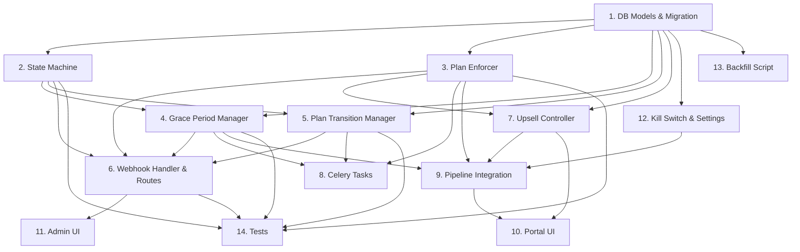

# Implementation Plan: Billing Plan Enforcement

## Overview

14 tasks implementing the full billing plan enforcement system — from DB models through Stripe integration to pipeline hooks. Tasks are ordered by dependency: models first, then core services, then integration, then UI, then testing. The `billing_enabled` kill switch (Task 12) ensures zero behavioral change until explicitly activated.

## Tasks

- [ ] 1. Create database models and Alembic migration (`bill01_billing_tables`): PlanDefinition (8 limit fields, tier_order, stripe_price_id), ClientSubscription (stripe IDs, status, billing_period, counters, grace fields, pending downgrade), WebhookEvent (stripe_event_id unique, event_type, processing_result), BillingPeriodHistory (period archive), UpsellEvent (prompt_type, event_type). Add subscription_status + billing_period_start/end to Client model. Migration seeds plan_definitions from existing PLAN_LIMITS values and creates ClientSubscription rows for existing clients. Import all models in `__init__.py`. Verify single Alembic head.
- [ ] 2. Implement BillingStateMachine service (`app/services/billing/state_machine.py`): VALID_TRANSITIONS dict, `transition(db, client_id, event)` with idempotency check (webhook_events table), invalid transition rejection with logging, BillingEvent/TransitionResult dataclasses. Updates both client.subscription_status and client_subscriptions.status atomically. Emits activity event with from/to/event_id on every successful transition.
- [ ] 3. Implement PlanEnforcer service (`app/services/billing/plan_enforcer.py`): `get_effective_limit()` respecting Per_Client_Override pattern, `get_remaining_budget()` returning BudgetStatus (generation_allowed, actions_remaining, posts_remaining, days_remaining), `increment_counter()` with atomic SQL UPDATE and threshold notification logic (80/90/100%), `check_avatar_limit()`, `reconcile_counter()` for daily drift detection. Agency tier: soft-enforcement (alert only, never block). Refactor existing `plan_enforcement.py` to delegate to PlanEnforcer when billing_enabled=true.
- [ ] 4. Implement GracePeriodManager service (`app/services/billing/grace_period_manager.py`): `start_grace_period()` with repeat offender detection (3d if previous grace within 60d, else 7d; agency 14d), `check_grace_status()` returning budget_multiplier (1.0 days 1-3, 0.5 days 4+), `expire_grace_periods()` for hourly Celery task (freeze avatars, transition to suspended), `recover_from_suspension()` (unfreeze, restore, transition to active). Ignore duplicate payment_failed events during active grace.
- [ ] 5. Implement PlanTransitionManager service (`app/services/billing/plan_transition_manager.py`): `execute_upgrade()` — raise limits immediately, counter preserved, unfreeze plan_downgrade_excess avatars, trigger EPG rebuild for Seed→Starter+ transitions, notify client admins. `schedule_downgrade()` — set pending fields (effective at period end). `execute_pending_downgrades()` — freeze excess avatars (most recently created), mark over_limit subreddits (lowest priority), cancel pending EPG/tasks for frozen avatars, emit events. `cancel_pending_downgrade()` — clear pending fields if not yet effective.
- [ ] 6. Implement Stripe webhook handler and billing routes (`app/routes/billing.py`): POST /api/stripe/webhook (signature verification, idempotency, out-of-order protection, event routing to 5 handlers, transient→500/permanent→200+alert). POST /api/billing/checkout (Stripe Checkout Session creation with metadata). GET /api/billing/portal-session (Stripe Customer Portal). POST /admin/clients/{id}/plan (admin plan change via Stripe API with correct proration_behavior). GET /api/billing/usage (counter + limits + percentage). Create `stripe_client.py` thin wrapper. Add `stripe>=8.0.0` to pyproject.toml. Add routes to main.py, auth whitelist, nginx config.
- [ ] 7. Implement UpsellController service (`app/services/billing/upsell_controller.py`): `get_active_prompts()` checking 5 trigger conditions (usage≥80%, avatar cap, subreddit cap, trial day 10, first post), respecting 72h dismiss cooldown via upsell_events query, skipping Scale tier for usage prompts. `record_impression/click/dismiss()` methods. `check_trial_conversion_triggers()` for email trigger detection. UpsellPrompt dataclass with next_plan and price_difference.
- [ ] 8. Create Celery billing tasks (`app/tasks/billing.py`) and add to Beat schedule: `check_grace_period_expiry` (hourly), `execute_pending_downgrades` (daily 00:15), `reconcile_billing_counters` (daily 01:30), `check_trial_expiry` (daily 02:00), `send_dunning_emails` (daily 09:00 — day 1/3/6 emails via Brevo), `archive_inactive_trials` (Sun 03:00). Add to beat_app.py schedule and worker.py includes.
- [ ] 9. Integrate billing enforcement into existing pipeline: portfolio_manager.py `build_portfolio()` — check billing_enabled setting, call get_remaining_budget() as ceiling, apply grace budget_multiplier. posting.py + draft_reconciliation.py — call increment_counter() after draft→posted. portal.py — pass upsell prompts + usage to template context. All guarded by `billing_enabled` setting (no-op when false).
- [ ] 10. Create portal billing UI templates: `billing_upsell_banner.html` (dismissable prompt with upgrade button), `billing_grace_banner.html` (yellow/red payment failure warning with "Update Payment" link), `billing_usage_bar.html` (progress bar green/amber/red), `billing_checkout.html` (plan comparison cards with Stripe redirect). Modify client_base.html to include grace banner, client/home.html to include usage bar + upsell banner. Add /clients/{id}/billing route and "Billing" sidebar link.
- [ ] 11. Create admin billing management UI: subscription section on admin_client_detail.html (plan, status, counter, period, Stripe links, grace status, pending downgrade). "Change Plan" dropdown. /admin/plan-definitions page (CRUD table with deletion protection). /admin/webhook-events page (paginated, filtered). Sidebar links under Operations. All pages show "Billing not configured" placeholder when billing_enabled=false.
- [ ] 12. Implement billing_enabled kill switch and system settings: add DEFAULT_SETTINGS entries (billing_enabled=false, grace_period_default/repeat/agency_days, stripe keys empty). All enforcement functions check billing_enabled first — when false: get_remaining_budget returns generation_allowed=True, increment_counter is no-op, grace tasks skip, upsell returns empty. Startup validation: if billing_enabled=true, verify all 6 plan tiers complete in plan_definitions (fail-open: log ERROR and force billing_enabled=false, don't crash).
- [ ] 13. Create data migration backfill script (`_backfill_billing.py`): creates ClientSubscription for each existing client (status mapping from plan_type), computes monthly_action_counter from actual posted drafts in current month, sets billing_period_start to 1st of current month (overwritten by first Stripe webhook). Idempotent (skips existing). Logs summary.
- [ ] 14. Create test suite: `test_billing_state_machine.py` (all valid/invalid transitions, idempotency, activity events), `test_plan_enforcer.py` (budget calculations, threshold notifications, reconciliation, override precedence, post sub-limit), `test_grace_period_manager.py` (start/check/expire/recover, repeat offender, agency extended), `test_plan_transition_manager.py` (upgrade/downgrade cascades, avatar freeze/unfreeze, subreddit over_limit), `test_webhook_handler.py` (signature verification, all 5 event handlers with fixture payloads, duplicate/out-of-order handling). All tests pass with `pytest tests/test_billing_*.py -v`.

## Task Dependency Graph

```json
{
  "waves": [
    { "name": "Foundation", "tasks": [1, 12] },
    { "name": "Core Services", "tasks": [2, 3, 4, 5] },
    { "name": "Integration", "tasks": [6, 7, 8, 9] },
    { "name": "UI & Data", "tasks": [10, 11, 13] },
    { "name": "Verification", "tasks": [14] }
  ]
}
```



## Notes

- **Kill switch first:** Task 12 (billing_enabled=false) should be deployed early. All other tasks are no-ops until billing is activated. This allows incremental deploy without risk.
- **Stripe keys not needed until Task 6:** Tasks 1-5 + 8-9 + 12-14 can be built and tested without any Stripe account or API keys.
- **Existing `plan_limits.py` preserved:** Not deleted — PlanEnforcer delegates to it when billing_enabled=false. Gradual migration.
- **Counter accuracy:** PostgreSQL atomic UPDATE (`counter = counter + 1`) prevents race conditions. Daily reconciliation catches any drift from edge cases.
- **Trial fix needed:** Current `plan_limits.py` has trial `max_comments_month=0`. Migration seeds plan_definitions with trial `max_actions_per_month=30` (matching project.md). The old dict value was a bug.
