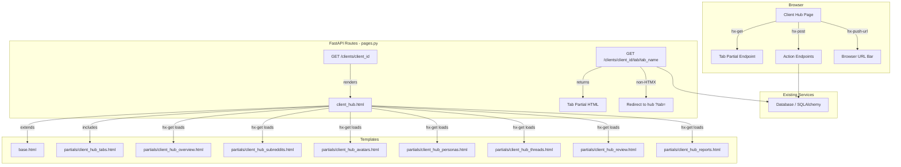

# Design Document: Client Hub Navigation

## Overview

This feature transforms the monolithic client detail page (`/clients/{id}`) into a tabbed **Client Hub** with seven sections: Overview, Subreddits, Avatars, Personas, Threads, Review, and Reports. Each tab loads its content via HTMX partial endpoints, keeping the page responsive and avoiding full reloads. The global navigation bar in `base.html` adapts for client-bound users, replacing cross-client links with hub-specific links.

The design follows the existing project patterns: thin route handlers in `pages.py`, Jinja2 templates extending `base.html`, HTMX `hx-get`/`hx-post` for partial updates, and Tailwind CSS (CDN) for styling. No new dependencies are introduced.

### Key Design Decisions

1. **Single route with tab dispatch** — The hub page at `/clients/{client_id}` renders the shell (header + tab bar) and eagerly loads the active tab's partial via `hx-get` on page load. This avoids duplicating the shell across 7 full-page templates.
2. **Dedicated partial endpoints** — Each tab has a `GET /clients/{client_id}/tab/{tab_name}` endpoint returning only the HTML fragment. Non-HTMX requests redirect to the full hub page with `?tab=` set.
3. **Tab bar as a reusable partial** — The tab bar is a Jinja2 include (`partials/client_hub_tabs.html`) so it can be rendered both in the hub page and potentially in the adapted nav bar.
4. **Navigation adaptation via template conditionals** — `base.html` checks `current_user_role == 'Client'` and `current_client_id` to swap global nav links for hub tab links. No middleware changes needed.
5. **URL state via `hx-push-url`** — Each tab click pushes `/clients/{id}?tab={name}` to the browser history, enabling bookmarking and back/forward navigation.

## Architecture



### Request Flow

1. User navigates to `/clients/{client_id}` (optionally with `?tab=threads`).
2. `pages.py::client_hub()` validates access, loads the client, and renders `client_hub.html` with the `active_tab` context variable (defaults to `"overview"`).
3. `client_hub.html` renders the header (client name, brand) and the tab bar. The content area has `hx-get="/clients/{id}/tab/{active_tab}" hx-trigger="load"` to eagerly fetch the default tab's partial.
4. When the user clicks a different tab, `hx-get` fetches the new partial, `hx-target="#tab-content"` swaps it in, and `hx-push-url` updates the browser URL.
5. Each tab partial endpoint (`client_hub_tab()`) checks if the request is HTMX. If yes, it returns the partial. If no, it redirects to the full hub page.

## Components and Interfaces

### 1. Route Handlers (pages.py)

#### `client_hub(client_id, request, tab, db)` — GET `/clients/{client_id}`
- **Purpose**: Render the full hub shell page.
- **Parameters**: `client_id: UUID`, `tab: str = "overview"` (query param).
- **Access control**: Client_Users can only access their own client; Admin_Users can access any.
- **Behavior**: Validates `tab` against the allowed set `{"overview", "subreddits", "avatars", "personas", "threads", "review", "reports"}`. Falls back to `"overview"` if invalid. Renders `client_hub.html` with `client`, `active_tab`, and user context.

#### `client_hub_tab(client_id, tab_name, request, db)` — GET `/clients/{client_id}/tab/{tab_name}`
- **Purpose**: Return a tab's HTML partial (HTMX) or redirect (non-HTMX).
- **Parameters**: `client_id: UUID`, `tab_name: str` (path param).
- **Access control**: Same as `client_hub`.
- **Behavior**: If `tab_name` not in allowed set → 404. If non-HTMX request → redirect to `/clients/{client_id}?tab={tab_name}`. Otherwise, dispatch to the appropriate tab data loader and render the corresponding partial template.

#### Tab Data Loaders (private functions)
Each tab has a private function that queries the database and returns a context dict:

| Function | Queries | Returns |
|---|---|---|
| `_tab_overview(client_id, db)` | Client, subreddits count, avatars count, threads count, engage count, pending comments count | Metric values |
| `_tab_subreddits(client_id, db)` | ClientSubreddit (active, for client) | List of subreddits with `last_scraped_at` |
| `_tab_avatars(client_id, db, is_admin)` | Avatar (filtered by client_ids), optionally unassigned | Client avatars, unassigned avatars (admin only) |
| `_tab_personas(client_id, db)` | Persona (for client) | List of personas |
| `_tab_threads(client_id, db, tag)` | RedditThread (for client, optional tag filter, limit 100) | List of threads |
| `_tab_review(client_id, db, status)` | CommentDraft (for client, by status, limit 50) + joined Thread/Avatar | Enriched drafts list |
| `_tab_reports(client_id, db)` | CommentDraft counts by status, AIUsageLog sum, thread counts by tag, active avatar count | Aggregated stats |

### 2. Templates

#### `client_hub.html` (new, extends `base.html`)
Replaces `client_detail.html` as the main client page. Contains:
- Client header (name, brand, back link for admins)
- Tab bar include
- Content area `<div id="tab-content">` with `hx-get` trigger on load

#### `partials/client_hub_tabs.html` (new)
Renders the horizontal tab bar. Receives `active_tab` and `client_id` as context. Each tab is an `<a>` with:
- `hx-get="/clients/{{ client_id }}/tab/{{ tab.slug }}"`
- `hx-target="#tab-content"`
- `hx-push-url="/clients/{{ client_id }}?tab={{ tab.slug }}"`
- Conditional Tailwind classes for active state (`border-b-2 border-blue-600 text-blue-600` vs `text-gray-500 hover:text-gray-700`)

#### Tab Partials (7 new files)
| Template | Key Elements |
|---|---|
| `partials/client_hub_overview.html` | Metric cards grid, collapsible company profile, pipeline buttons with `hx-post`, status area |
| `partials/client_hub_subreddits.html` | Subreddit list with freshness dots, inline add form with `hx-post` |
| `partials/client_hub_avatars.html` | Avatar cards with status badges, unassigned section (admin), assign buttons with `hx-post` |
| `partials/client_hub_personas.html` | Persona cards with truncated voice profile, click-to-expand |
| `partials/client_hub_threads.html` | Tag filter buttons with `hx-get`, thread table with external links |
| `partials/client_hub_review.html` | Status filter tabs with `hx-get`, draft cards with approve/reject `hx-post` |
| `partials/client_hub_reports.html` | Stats cards: drafts by status, threads by tag, AI cost, avatar count |

### 3. Navigation Adaptation (`base.html` modification)

The existing `base.html` nav section is modified with a conditional block:

```html

    <!-- Client-specific hub links -->
    <a href="/clients/{{ current_client_id }}?tab=overview">Overview</a>
    <a href="/clients/{{ current_client_id }}?tab=subreddits">Subreddits</a>
    <a href="/clients/{{ current_client_id }}?tab=avatars">Avatars</a>
    <a href="/clients/{{ current_client_id }}?tab=personas">Personas</a>
    <a href="/clients/{{ current_client_id }}?tab=threads">Threads</a>
    <a href="/clients/{{ current_client_id }}?tab=review">Review</a>
    <a href="/clients/{{ current_client_id }}?tab=reports">Reports</a>

    <!-- Existing global nav links (Dashboard, Review, Avatars, Personas, Admin, Settings) -->

```

The `_render()` helper in `pages.py` already injects `current_user_role` and `current_client_name`. It needs to additionally inject `current_client_id` (the UUID string) when the user is a Client_User.

### 4. Allowed Tabs Constant

A module-level constant in `pages.py`:

```python
ALLOWED_TABS = ("overview", "subreddits", "avatars", "personas", "threads", "review", "reports")
```

Used for validation in both `client_hub()` and `client_hub_tab()`.

## Data Models

No new database models or migrations are required. The feature reads from existing models:

| Model | Used By Tab(s) | Fields Used |
|---|---|---|
| `Client` | All (header), Overview | `id`, `client_name`, `brand_name`, `company_worldview`, `company_problem`, `competitive_landscape` |
| `ClientSubreddit` | Overview (count), Subreddits | `subreddit_name`, `type`, `is_active`, `last_scraped_at` |
| `Avatar` | Overview (count), Avatars | `reddit_username`, `karma_comment`, `karma_post`, `is_shadowbanned`, `reddit_status`, `client_ids`, `active` |
| `Persona` | Personas | `persona_name`, `platform`, `voice_profile`, `is_active` |
| `RedditThread` | Overview (count), Threads | `post_title`, `subreddit`, `tag`, `composite`, `url`, `created_at` |
| `CommentDraft` | Overview (count), Review | `status`, `ai_draft`, `edited_draft`, `engagement_mode`, `thread_id`, `avatar_id`, `created_at` |
| `AIUsageLog` | Reports | `cost_usd`, `client_id` |
| `User` | Access control, Nav | `is_superuser`, `client_id` |

### Context Variables Added to `_render()`

| Variable | Type | Description |
|---|---|---|
| `current_client_id` | `str \| None` | The string UUID of the client for Client_Users, `None` for admins. Already partially available via `current_client_name` logic — just needs the ID added. |

## Correctness Properties

*A property is a characteristic or behavior that should hold true across all valid executions of a system — essentially, a formal statement about what the system should do. Properties serve as the bridge between human-readable specifications and machine-verifiable correctness guarantees.*

### Property 1: Tab resolution falls back to overview for invalid input

*For any* string provided as the `tab` query parameter, the resolved active tab SHALL be the input string if it is a member of the allowed tabs set `{"overview", "subreddits", "avatars", "personas", "threads", "review", "reports"}`, and SHALL be `"overview"` otherwise.

**Validates: Requirements 2.2, 2.3**

### Property 2: Freshness indicator is determined by scrape recency

*For any* `last_scraped_at` datetime value (or None), the freshness indicator function SHALL return `"green"` if the timestamp is within 24 hours of now, `"yellow"` if within 72 hours, and `"red"` if older than 72 hours or None.

**Validates: Requirements 4.2**

### Property 3: Voice profile truncation preserves prefix

*For any* string used as a voice profile, the truncated output SHALL have length at most 200 characters and SHALL be a prefix of the original string.

**Validates: Requirements 6.2**

### Property 4: Thread tag filter returns only matching threads

*For any* set of threads with mixed tags and any selected tag filter from `{"engage", "monitor", "skip"}`, the filtered result SHALL contain only threads whose tag matches the selected filter. When the filter is `"all"` or `None`, all threads SHALL be returned.

**Validates: Requirements 7.2, 7.3**

### Property 5: HTMX tab requests return partial HTML fragments

*For any* valid tab name and valid client, an HTMX GET request to `/clients/{client_id}/tab/{tab_name}` SHALL return an HTML response that does not contain `<html>` or `<body>` tags (i.e., it is a fragment, not a full page).

**Validates: Requirements 10.2**

### Property 6: Non-HTMX tab requests redirect to the hub page

*For any* valid tab name and valid client, a non-HTMX GET request to `/clients/{client_id}/tab/{tab_name}` SHALL return an HTTP 303 redirect to `/clients/{client_id}?tab={tab_name}`.

**Validates: Requirements 10.3**

### Property 7: Invalid tab names return 404

*For any* string that is not a member of the allowed tabs set, a GET request to `/clients/{client_id}/tab/{that_string}` SHALL return an HTTP 404 response.

**Validates: Requirements 10.4**

### Property 8: Access control enforces client isolation

*For any* authenticated user and any client, the tab endpoint SHALL return the tab content if the user is an Admin_User OR if the user's `client_id` matches the requested client's ID. Otherwise, it SHALL return an HTTP 403 response.

**Validates: Requirements 12.1, 12.2**

## Error Handling

| Scenario | Behavior | HTTP Status |
|---|---|---|
| Client not found | Return 404 | 404 |
| Invalid tab name on hub page (`?tab=xxx`) | Fall back to Overview tab | 200 |
| Invalid tab name on partial endpoint (`/tab/xxx`) | Return 404 | 404 |
| Client_User accessing another client's hub | Return 403 | 403 |
| Client_User accessing another client's tab partial | Return 403 | 403 |
| Unauthenticated request | Redirect to `/login` (handled by AuthMiddleware) | 303 |
| Database query returns empty results for a tab | Render the tab partial with empty state messaging (e.g., "No subreddits yet") | 200 |
| Non-HTMX request to tab partial endpoint | Redirect to `/clients/{id}?tab={name}` | 303 |

Error handling follows existing patterns in `pages.py`: raise `HTTPException(status_code=...)` for 403/404, and let the error middleware handle rendering.

## Testing Strategy

### Property-Based Tests (Hypothesis)

The project uses Python/pytest. Property-based tests will use **Hypothesis** (`hypothesis` library) with a minimum of 100 iterations per property.

Each property test will be tagged with a comment referencing the design property:
```python
# Feature: client-hub-navigation, Property 1: Tab resolution falls back to overview for invalid input
```

**Properties to implement as PBT:**

1. **Tab resolution** (Property 1) — Generate arbitrary strings; verify resolved tab is correct. Pure function, no DB needed.
2. **Freshness indicator** (Property 2) — Generate arbitrary datetimes and None; verify color output. Pure function.
3. **Voice profile truncation** (Property 3) — Generate arbitrary strings; verify length ≤ 200 and prefix. Pure function.
4. **Thread tag filtering** (Property 4) — Generate lists of thread-like objects with random tags and a random filter; verify all results match. Pure function on in-memory data.
5. **Invalid tab 404** (Property 7) — Generate arbitrary strings not in ALLOWED_TABS; verify 404. Requires test client but is fast.
6. **Access control** (Property 8) — Generate combinations of user roles and client IDs; verify correct access decision. Pure function on the access check logic.

**Properties requiring integration test approach (not PBT):**

- Properties 5 and 6 (HTMX vs non-HTMX dispatch) — These require a running FastAPI test client with database fixtures. Better suited as example-based integration tests covering each tab, since the behavior is uniform and the tab set is small (7 items). Running 100+ iterations with DB fixtures is not cost-effective.

### Unit Tests (Example-Based)

| Test | Validates |
|---|---|
| Hub page returns 200 with default tab | Req 2.1 |
| Hub page returns 200 with each valid tab | Req 2.2 |
| Overview tab partial returns metric keys | Req 3.1, 3.2 |
| Subreddits tab partial returns subreddit list | Req 4.1 |
| Avatars tab partial includes unassigned for admin | Req 5.3 |
| Avatars tab partial excludes unassigned for client user | Req 5.3 |
| Personas tab partial returns persona fields | Req 6.1 |
| Threads tab partial respects limit of 100 | Req 7.1 |
| Review tab partial filters by client_id | Req 8.1 |
| Review tab partial respects limit of 50 | Req 8.5 |
| Reports tab partial returns all stat categories | Req 9.1–9.4 |
| HTMX request to valid tab returns partial | Req 10.2 |
| Non-HTMX request to valid tab redirects | Req 10.3 |
| Non-existent client returns 404 | Req 12.4 |
| Unauthenticated request redirects to login | Req 12.3 |
| Nav bar shows hub links for client user | Req 11.1–11.3 |
| Nav bar shows global links for admin user | Req 11.4 |
| `current_client_id` injected for client users | Req 11.1 |
| Browser URL includes tab param (template check) | Req 13.1 |

### Test Configuration

- **PBT library**: Hypothesis
- **Min iterations**: 100 per property (`@settings(max_examples=100)`)
- **Test location**: `tests/test_client_hub_navigation.py`
- **Fixtures**: Use FastAPI `TestClient` with SQLAlchemy test session for integration tests. Pure function tests need no fixtures.

