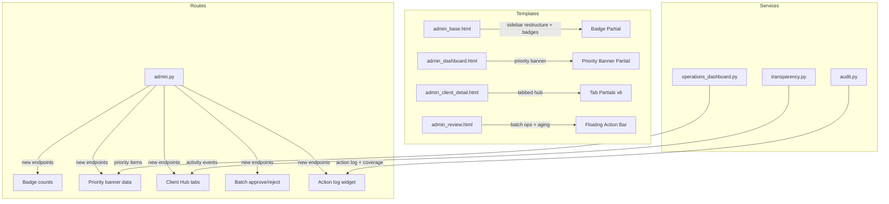

# Design Document: Client Manager Workflow UX

## Overview

This design covers 10 interconnected improvements to the Reddit Marketing SaaS admin panel, all focused on making the daily operator workflow faster and more client-centric. The changes span template restructuring, new HTMX partial endpoints, a batch operations API, and audit log coverage expansion.

**Key design decisions:**
- All new UI is server-rendered Jinja2 + HTMX (no SPA framework, consistent with existing stack)
- New endpoints return HTML partials for HTMX consumption; no new JSON APIs needed except the batch operation endpoint
- No database migrations required — all features use existing models (AuditLog, CommentDraft, PostDraft, ActivityEvent, Avatar, Subreddit)
- Badge polling and priority banner use `hx-trigger="every 60s"` for near-real-time updates without WebSockets
- Batch operations use a single POST endpoint with JSON body (list of IDs + action)

## Architecture

The feature touches three layers:



**Request flow for badge polling:**
1. `admin_base.html` renders with `hx-get="/admin/partials/nav-badges"` and `hx-trigger="load, every 60s"`
2. Endpoint queries pending draft count + stale subreddit count
3. Returns a small HTML fragment with badge elements (or empty if counts are 0)
4. HTMX swaps the badge container in-place

**Request flow for batch operations:**
1. JavaScript tracks selected checkboxes, shows floating action bar with count
2. User clicks "Approve Selected" or "Reject Selected"
3. JS collects checked IDs, POSTs to `/admin/review/batch` with `{action: "approve"|"reject", ids: [...]}`
4. Backend iterates IDs, transitions each pending draft, creates audit + activity entries
5. Returns summary HTML partial (success count, skipped IDs)
6. HTMX refreshes the draft list

## Components and Interfaces

### 1. Sidebar Navigation (Template-Only Change)

**File:** `app/templates/admin_base.html`

Restructure the existing sidebar groups from (Operations, Content, Monitoring, Settings) to:

| Group | Links |
|-------|-------|
| Daily Work | Dashboard, Review Queue, Activity |
| Clients & Content | Clients, Avatars, Subreddits, Threads, Keywords |
| Monitoring | System Health, Inspector, AI Costs, Audit Logs, Tasks, Scrape Queue |
| Settings | System Settings, Billing, Users |

The "Daily Work" group label gets `text-gray-300` (brighter than other groups' `text-gray-500`) and a `border-l-2 border-indigo-500` accent on the group section div.

Badge containers are added inline to "Review Queue" and "Scrape Queue" links:
```html
<span id="badge-review" hx-get="/admin/partials/nav-badges" hx-trigger="load, every 60s" hx-target="#badge-review" hx-swap="innerHTML"></span>
```

### 2. Navigation Badges Endpoint

**New endpoint:** `GET /admin/partials/nav-badges`

```python
@router.get("/partials/nav-badges", response_class=HTMLResponse)
def nav_badges_partial(db: Session = Depends(get_db), current_user: User = Depends(require_superuser)):
    pending_count = get_pending_review_count(db)  # CommentDraft + PostDraft with status="pending"
    stale_count = get_stale_subreddit_count(db)   # last_scraped_at > threshold or NULL
    return templates.TemplateResponse("partials/nav_badges.html", {
        "pending_count": pending_count,
        "stale_count": stale_count,
    })
```

**Badge color logic (pure function):**
```python
def badge_color(count: int, red_threshold: int, amber_threshold: int = 1) -> str:
    if count > red_threshold:
        return "bg-red-500 text-white"
    elif count >= amber_threshold:
        return "bg-amber-500 text-white"
    return ""  # hidden
```

- Review Queue: `red_threshold=10`
- Scrape Queue: `red_threshold=5`

**Service functions (in `operations_dashboard.py`):**
```python
def get_pending_review_count(db: Session) -> int:
    """Count CommentDraft + PostDraft with status='pending'."""

def get_stale_subreddit_count(db: Session) -> int:
    """Count active subreddits where last_scraped_at > scrape_freshness_window_hours or NULL."""
```

### 3. Enhanced Client Hub (Tabbed Interface)

**Refactor:** `GET /admin/clients/{id}` → tabbed layout with HTMX-loaded tab content.

**Tab endpoints:**

| Tab | Endpoint | Data Source |
|-----|----------|-------------|
| Overview | `/admin/clients/{id}/tab/overview` | Client model + aggregate queries |
| Subreddits | `/admin/clients/{id}/tab/subreddits` | ClientSubredditAssignment + Subreddit |
| Avatars | `/admin/clients/{id}/tab/avatars` | Avatar (filtered by client_ids) |
| Review | `/admin/clients/{id}/tab/review` | CommentDraft + PostDraft (status=pending, client_id=id) |
| Activity | `/admin/clients/{id}/tab/activity` | ActivityEvent (client_id=id, limit=20, order desc) |
| Reports | `/admin/clients/{id}/tab/reports` | Pipeline stats from transparency service |

**Overview tab data structure:**
```python
{
    "client": Client,
    "stats": {
        "subreddit_count": int,
        "avatar_count": int,
        "pending_reviews": int,
        "threads_24h": int,
        "comments_24h": int,
    },
    "pipeline_buttons": ["scrape", "score", "generate", "full"],
}
```

**Subreddit freshness color function:**
```python
def freshness_color(last_scraped_at: datetime | None, now: datetime) -> str:
    if last_scraped_at is None:
        return "red"
    hours = (now - last_scraped_at).total_seconds() / 3600
    if hours <= 12:
        return "green"
    elif hours <= 24:
        return "amber"
    return "red"
```

**Tab switching:** Each tab link uses `hx-get` + `hx-target="#tab-content"` + `hx-push-url="false"`. The active tab is tracked via CSS class toggling in JavaScript.

### 4. Batch Operations

**New endpoint:** `POST /admin/review/batch`

```python
class BatchReviewRequest(BaseModel):
    action: Literal["approve", "reject"]
    ids: list[UUID]  # max 50

    @validator("ids")
    def validate_batch_size(cls, v):
        if len(v) > 50:
            raise ValueError("Maximum batch size is 50")
        return v
```

**Response structure:**
```python
{
    "success_count": int,
    "skipped": [{"id": str, "reason": str}],
    "total": int,
}
```

**Processing logic:**
1. Validate batch size (≤ 50)
2. Query all drafts by ID (both CommentDraft and PostDraft)
3. For each draft:
   - If status != "pending" → add to skipped list
   - Else → transition status, create audit log entry, record activity event, trigger learning capture
4. Commit transaction
5. Return summary + trigger HTMX refresh

**Frontend (JavaScript):**
- Checkbox state tracked in a `Set<string>` of draft IDs
- Floating action bar: `position: fixed; bottom: 1rem; left: 50%; transform: translateX(-50%)`
- Shows/hides based on selection count
- "Select All" checkbox in table header toggles all visible checkboxes

### 5. Aging Alerts

**Pure function for aging status:**
```python
def aging_status(created_at: datetime, now: datetime) -> dict | None:
    """Returns aging alert data or None if draft is fresh."""
    hours = int((now - created_at).total_seconds() / 3600)
    if hours >= 48:
        return {"level": "critical", "color": "red", "label": f"Stale — {hours}h"}
    elif hours >= 24:
        return {"level": "warning", "color": "amber", "label": f"Pending {hours}h"}
    return None
```

**Relative timestamp function:**
```python
def relative_time(created_at: datetime, now: datetime) -> str:
    hours = int((now - created_at).total_seconds() / 3600)
    if hours < 24:
        return f"{hours}h ago"
    days = hours // 24
    return f"{days}d ago"
```

**Default sort order change:** The review queue default sort changes from "score" to "oldest" (ascending `created_at`) to surface stale items first.

**Thread Locked badge:** For CommentDraft items, check `draft.thread.is_locked`. If true, render a "🔒 Thread Locked" badge. PostDraft items never show this badge (no thread relationship).

### 6. Client Filter (HTMX + hx-push-url)

**Enhancement to existing review queue.** The client filter already exists as a dropdown. Changes:

1. Add `hx-get="/admin/review"` + `hx-push-url="true"` + `hx-target="#review-content"` to the client select element
2. The existing `admin_review` handler already accepts `client_id` query param
3. Add `hx-include` to preserve other filter values (status, sort, subreddit, avatar, age)
4. Wrap the draft list + stats bar in a `<div id="review-content">` target

**Empty state:** When the filtered query returns 0 results, render an empty state partial with message "No drafts match the current filters."

### 7. Priority Banner

**New service function in `operations_dashboard.py`:**
```python
def get_priority_items(db: Session) -> list[dict]:
    """Returns urgent items sorted by fixed priority order."""
    items = []
    
    # Priority 1: Shadowbanned/suspended avatars
    unhealthy = db.query(func.count(Avatar.id)).filter(
        Avatar.active.is_(True),
        Avatar.health_status.in_(["shadowbanned", "suspended"])
    ).scalar()
    if unhealthy:
        items.append({"priority": 1, "type": "avatars", "count": unhealthy, ...})
    
    # Priority 2: Pipeline failures (last 24h)
    # Priority 3: Stale subreddits (>24h)
    # Priority 4: Drafts pending >24h
    
    return sorted(items, key=lambda x: x["priority"])
```

**New endpoint:** `GET /admin/partials/priority-banner`

**Template:** Renders as a horizontal bar with colored pills for each urgent category. Each pill is an `<a>` tag linking to the relevant page with pre-applied filters.

### 8. Action Log Widget

**New endpoint:** `GET /admin/clients/{id}/action-log`

```python
@router.get("/clients/{client_id}/action-log", response_class=HTMLResponse)
def client_action_log_partial(client_id: uuid.UUID, db: Session = Depends(get_db), ...):
    entries, _ = audit_service.query_audit_logs(db, client_id=client_id, per_page=20)
    # Join user names
    return templates.TemplateResponse("partials/client_action_log.html", {...})
```

**Entry rendering logic:**
- Timestamp: relative format if < 24h ("3 minutes ago"), absolute if older ("May 10, 14:32")
- User: join from User table, display "System" when user_id is NULL
- Summary: extract from `details` JSONB; fallback to `f"{action} {entity_type}"` when details is NULL/empty

**Auto-refresh:** The widget container has `hx-trigger="actionPerformed from:body"`. When a pipeline button is clicked or a draft is approved on the Client Hub, the response includes `HX-Trigger: actionPerformed` header to cause the widget to re-fetch.

### 9. Audit Log Coverage

**Three new audit calls added to existing endpoints:**

1. **Backup trigger** (`/admin/backup` POST handler):
   ```python
   audit_service.log_action(db, user_id=current_user.id, action="trigger_backup", entity_type="system", details={"outcome": "success"|"failure"})
   ```

2. **Audit log deletion** (`/admin/audit-logs/delete` handler):
   ```python
   # BEFORE deletion:
   audit_service.log_action(db, user_id=current_user.id, action="delete_audit_logs", entity_type="audit_log", details={"count": count, "filters": {...}})
   ```

3. **Pipeline trigger from dashboard/Client Hub** (existing pipeline trigger handlers):
   ```python
   audit_service.log_action(db, user_id=current_user.id, action="trigger_pipeline", entity_type="task", details={"pipeline_type": type, "target_entity_id": str(entity_id)})
   ```

4. **Batch operations** (new batch endpoint):
   ```python
   audit_service.log_action(db, user_id=current_user.id, action=f"batch_{action}", entity_type="comment_draft", details={"count": success_count, "ids": [str(id) for id in processed_ids]})
   ```

### 10. Post-Approval UX

**Change to approve response:** When a draft is approved via the review queue (individual or batch), the HTMX response replaces the draft card with a simple "✓ Approved" confirmation element. No "Mark as Posted" form is rendered.

**Approved tab enhancement:** The existing `status=approved` filter tab shows approved-but-not-posted drafts with:
- Thread title, subreddit, avatar username
- "Mark as Posted" button that expands an inline form via HTMX

**Mark as Posted form:**
```html
<form hx-post="/admin/review/mark-posted/{draft_id}" hx-target="closest .draft-card" hx-swap="outerHTML">
    <input type="url" name="reddit_url" placeholder="https://www.reddit.com/..." required>
    <button type="submit">Confirm Posted</button>
</form>
```

**URL validation (server-side):**
```python
def validate_reddit_url(url: str) -> str | None:
    """Returns error message or None if valid."""
    if not url or not url.strip():
        return "Reddit URL is required"
    if not (url.startswith("https://www.reddit.com/") or url.startswith("https://reddit.com/")):
        return "Must be a valid Reddit URL (https://www.reddit.com/... or https://reddit.com/...)"
    if len(url) > 2048:
        return "URL exceeds maximum length (2048 characters)"
    return None
```

## Data Models

No new database models or migrations are required. All features use existing models:

| Model | Usage in This Feature |
|-------|----------------------|
| `CommentDraft` | Badge counts, batch operations, aging alerts, client filter |
| `PostDraft` | Badge counts, batch operations, aging alerts |
| `AuditLog` | Action log widget, audit coverage expansion |
| `ActivityEvent` | Client Hub activity tab, priority banner (pipeline failures) |
| `Avatar` | Priority banner (health_status), Client Hub avatars tab |
| `Subreddit` | Badge counts (stale), Client Hub subreddits tab |
| `ClientSubredditAssignment` | Stale subreddit counting |
| `Client` | Client filter dropdown, Client Hub |
| `RedditThread` | Thread Locked badge (is_locked field) |

## Correctness Properties

*A property is a characteristic or behavior that should hold true across all valid executions of a system — essentially, a formal statement about what the system should do. Properties serve as the bridge between human-readable specifications and machine-verifiable correctness guarantees.*

### Property 1: Badge Count Accuracy

*For any* set of CommentDraft and PostDraft records in the database, the navigation badge count for "Review Queue" SHALL equal the total number of records where `status = 'pending'` across both tables, and the badge count for "Scrape Queue" SHALL equal the number of active subreddits whose `last_scraped_at` is NULL or older than the configured freshness window.

**Validates: Requirements 2.1, 2.2**

### Property 2: Badge Color Determination

*For any* positive integer count and a given red threshold, the badge color function SHALL return "red" when count exceeds the red threshold, "amber" when count is between 1 and the red threshold inclusive, and no badge (hidden) when count is 0. Specifically: Review Queue uses red_threshold=10, Scrape Queue uses red_threshold=5.

**Validates: Requirements 2.4, 2.5**

### Property 3: Subreddit Freshness Color

*For any* subreddit with a `last_scraped_at` timestamp and a reference time `now`, the freshness color function SHALL return "green" when the difference is ≤ 12 hours, "amber" when between 12 and 24 hours, and "red" when > 24 hours or when `last_scraped_at` is NULL.

**Validates: Requirements 3.4**

### Property 4: Activity Events Filtered and Ordered

*For any* client_id and a set of ActivityEvent records, the Client Hub activity tab query SHALL return only events where `client_id` matches the specified client, ordered by `created_at` descending, limited to 20 results.

**Validates: Requirements 3.7**

### Property 5: Batch Operation Correctness

*For any* list of draft IDs (1–50) submitted to the batch endpoint with a target action ("approve" or "reject"), every draft in the list whose current status is "pending" SHALL be transitioned to the target status, every draft whose status is NOT "pending" SHALL be skipped, and the response SHALL accurately report the count of successful transitions and the list of skipped IDs with reasons.

**Validates: Requirements 4.3, 4.4, 4.5**

### Property 6: Aging Status Determination

*For any* draft with a `created_at` timestamp and a reference time `now`, the aging status function SHALL return no alert when the difference is < 24 hours, an amber "Pending Xh" alert when the difference is between 24 and 48 hours, and a red "Stale — Xh" alert when the difference is ≥ 48 hours, where X is the whole number of hours.

**Validates: Requirements 5.1, 5.2**

### Property 7: Relative Timestamp Formatting

*For any* timestamp and a reference time `now`, the relative time function SHALL return "{X}h ago" when the difference is less than 24 hours (where X is whole hours), and "{X}d ago" when the difference is 24 hours or more (where X is whole days).

**Validates: Requirements 5.5**

### Property 8: Client Filter Correctness

*For any* client_id filter applied to the review queue, every draft in the filtered result set SHALL have `client_id` equal to the specified filter value, and no draft belonging to a different client SHALL appear in the results.

**Validates: Requirements 6.2**

### Property 9: Priority Banner Ordering and Structure

*For any* combination of urgent items across the four categories (shadowbanned/suspended avatars, pipeline failures, stale subreddits, pending drafts > 24h), the priority banner SHALL display items sorted by fixed priority order (avatars first, then failures, then stale subs, then pending drafts), and each item SHALL include a count > 0 and a link with query parameters that filter to the specific urgent subset.

**Validates: Requirements 7.1, 7.2, 7.5**

### Property 10: Action Log Widget Query Correctness

*For any* client_id and a set of AuditLog records, the action log widget SHALL return only entries where `client_id` matches the specified client, ordered by `created_at` descending, limited to 20 results, and each entry SHALL display a timestamp, user name (or "System" for NULL user_id), action type, entity type, and a summary derived from the details field (or fallback to "{action} {entity_type}" when details is NULL/empty).

**Validates: Requirements 8.1, 8.2, 8.3**

### Property 11: Operator Audit Entries Include User ID

*For any* audit log entry created by an operator-initiated action (backup trigger, audit log deletion, pipeline trigger, batch operation), the `user_id` field SHALL NOT be NULL and SHALL match the authenticated operator's ID.

**Validates: Requirements 9.5**

### Property 12: Reddit URL Validation

*For any* string submitted as a Reddit URL in the "Mark as Posted" form, the validation function SHALL accept the URL if and only if it starts with "https://www.reddit.com/" or "https://reddit.com/" AND has a total length ≤ 2048 characters AND is non-empty. All other inputs SHALL be rejected with an appropriate error message.

**Validates: Requirements 10.4, 10.5, 10.6**

## Error Handling

| Scenario | Handling |
|----------|----------|
| Badge endpoint timeout (>5s) | HTMX retains previous badge values (no swap on error) |
| Priority banner fetch failure | Retain last loaded content, show subtle error indicator |
| Client Hub tab load failure | Show error message in tab content area with retry button |
| Batch operation partial failure | Process all possible, return summary with skipped IDs |
| Batch size > 50 | Reject entire request with 422 and error message |
| Non-existent client_id in URL | Return HTTP 404 with "Client not found" message |
| Audit log creation failure | Log warning, do not block the primary action |
| Invalid Reddit URL on mark-posted | Return inline validation error, do not transition status |
| Race condition (draft approved by another user during batch) | Skip that draft, include in skipped list with reason "already approved" |

**Error handling philosophy:** Audit logging and activity events are best-effort — failures are logged but never block the primary user action. Badge/banner polling failures are silent (retain stale data). Batch operations are atomic per-draft (each draft succeeds or fails independently).

## Testing Strategy

**Property-based testing library:** [Hypothesis](https://hypothesis.readthedocs.io/) (Python)

**Dual testing approach:**
- **Unit tests (example-based):** Template rendering, HTMX attributes, UI states, edge cases
- **Property tests (Hypothesis):** Universal properties across generated inputs (minimum 100 iterations each)

**Property test configuration:**
- Minimum 100 iterations per property test
- Each property test references its design document property
- Tag format: `# Feature: client-manager-workflow-ux, Property {number}: {title}`

**Test breakdown by component:**

| Component | Property Tests | Unit Tests |
|-----------|---------------|------------|
| Badge counts | P1 (count accuracy) | Zero-count hidden, error retention |
| Badge colors | P2 (color thresholds) | — |
| Freshness color | P3 (color function) | NULL timestamp edge case |
| Activity query | P4 (filter + order) | Empty result set |
| Batch operations | P5 (correctness) | Size limit rejection, empty batch |
| Aging alerts | P6 (status determination) | Exact boundary (24h, 48h) |
| Relative time | P7 (formatting) | Zero hours, boundary at 24h |
| Client filter | P8 (filter correctness) | "All" option, invalid client_id |
| Priority banner | P9 (ordering + structure) | All-clear state, single category |
| Action log widget | P10 (query correctness) | Empty state, NULL details fallback |
| Audit coverage | P11 (user_id present) | Failure outcome update |
| URL validation | P12 (Reddit URL) | Empty string, exact prefix match |

**Integration tests (example-based, not PBT):**
- Pipeline trigger from Client Hub dispatches Celery task
- Batch approve creates audit log entries (verify DB state)
- HTMX partial endpoints return valid HTML fragments
- Tab switching preserves active_nav context

**What is NOT property-tested:**
- Template rendering (visual/structural — use snapshot or manual review)
- HTMX trigger configuration (declarative — verify via template inspection)
- JavaScript checkbox behavior (browser-side — manual QA)
- CSS styling (visual — manual review)
