# Design Document: Client Portal Settings

## Overview

Minimal settings page for ongoing campaign refinement. Single-column card layout (no sub-nav). Four active sections: Keywords (with subreddit tooltip), Subreddits (view + request only), Brand Guardrails (tag input + textareas), Voice Feedback (textarea + history). Three deferred sections as placeholders.

Key difference from previous design: no profile editing (belongs to onboarding), no direct subreddit add/remove (request-based only), keywords show which subreddits monitor them on hover.

## Architecture

```mermaid
graph TD
    Browser[Browser / HTMX] -->|GET /clients/id/settings| SettingsRoute[portal.py: portal_settings]
    Browser -->|POST .../keywords/add| KeywordsAddAPI[settings_keywords_add]
    Browser -->|POST .../keywords/remove| KeywordsRemoveAPI[settings_keywords_remove]
    Browser -->|POST .../subreddits/request| SubredditRequestAPI[settings_subreddit_request]
    Browser -->|POST .../guardrails| GuardrailsAPI[settings_guardrails_update]
    Browser -->|POST .../voice-feedback| FeedbackAPI[settings_voice_feedback]

    SettingsRoute --> ClientModel[Client model]
    SettingsRoute --> SubredditModel[ClientSubredditAssignment]
    SettingsRoute --> FeedbackModel[VoiceFeedback model]

    KeywordsAddAPI --> ClientModel
    KeywordsRemoveAPI --> ClientModel
    SubredditRequestAPI --> SubredditRequestModel[SubredditRequest model]
    GuardrailsAPI --> ClientModel
    FeedbackAPI --> FeedbackModel

    SettingsRoute -->|renders| SettingsTemplate[settings.html]
    KeywordsAddAPI -->|returns partial| KeywordsPartial[partials/client/settings_keywords.html]
    SubredditRequestAPI -->|returns partial| SubRequestPartial[partials/client/settings_subreddit_request.html]
    GuardrailsAPI -->|returns partial| GuardrailsPartial[partials/client/settings_guardrails.html]
    FeedbackAPI -->|returns partial| FeedbackPartial[partials/client/settings_voice_feedback.html]
```



## Components and Interfaces

### Component 1: Settings Page Route (portal.py)

**Purpose**: Serve the settings page and handle all section CRUD via HTMX.

**Interface**:
```python
# GET — Full page render
@router.get("/clients/{client_id}/settings")
def portal_settings(request, client_id, user, db) -> HTMLResponse: ...

# POST — Add keyword
@router.post("/clients/{client_id}/settings/keywords/add")
def settings_keywords_add(request, client_id, keyword: str, priority: str, user, db) -> HTMLResponse: ...

# POST — Remove keyword
@router.post("/clients/{client_id}/settings/keywords/remove")
def settings_keywords_remove(request, client_id, keyword: str, priority: str, user, db) -> HTMLResponse: ...

# POST — Request subreddit (not direct add)
@router.post("/clients/{client_id}/settings/subreddits/request")
def settings_subreddit_request(request, client_id, subreddit_name: str, note: str, user, db) -> HTMLResponse: ...

# POST — Update brand guardrails
@router.post("/clients/{client_id}/settings/guardrails")
def settings_guardrails_update(request, client_id, never_associate: str, restricted_claims: str, style_inspiration: str, user, db) -> HTMLResponse: ...

# POST — Submit voice feedback
@router.post("/clients/{client_id}/settings/voice-feedback")
def settings_voice_feedback(request, client_id, feedback_text: str, user, db) -> HTMLResponse: ...
```

### Component 2: VoiceFeedback Model

```python
class VoiceFeedback(Base):
    __tablename__ = "voice_feedback"
    id: Mapped[uuid.UUID] = mapped_column(UUID(as_uuid=True), primary_key=True, default=uuid.uuid4)
    client_id: Mapped[uuid.UUID] = mapped_column(UUID(as_uuid=True), ForeignKey("clients.id"), nullable=False)
    user_id: Mapped[uuid.UUID] = mapped_column(UUID(as_uuid=True), ForeignKey("users.id"), nullable=False)
    feedback_text: Mapped[str] = mapped_column(Text, nullable=False)
    created_at: Mapped[datetime] = mapped_column(DateTime(timezone=True), server_default=func.now())
```

### Component 3: SubredditRequest Model

```python
class SubredditRequest(Base):
    __tablename__ = "subreddit_requests"
    id: Mapped[uuid.UUID] = mapped_column(UUID(as_uuid=True), primary_key=True, default=uuid.uuid4)
    client_id: Mapped[uuid.UUID] = mapped_column(UUID(as_uuid=True), ForeignKey("clients.id"), nullable=False)
    user_id: Mapped[uuid.UUID] = mapped_column(UUID(as_uuid=True), ForeignKey("users.id"), nullable=False)
    subreddit_name: Mapped[str] = mapped_column(String(100), nullable=False)
    note: Mapped[str | None] = mapped_column(Text, nullable=True)
    status: Mapped[str] = mapped_column(String(20), default="pending")  # pending/approved/rejected
    created_at: Mapped[datetime] = mapped_column(DateTime(timezone=True), server_default=func.now())
    resolved_at: Mapped[datetime | None] = mapped_column(DateTime(timezone=True), nullable=True)
```

### Component 4: Client Model Extension

```python
# New JSONB field on Client model
brand_guardrails: Mapped[dict | None] = mapped_column(JSONB, nullable=True)
# Structure: {"never_associate": ["topic1", ...], "restricted_claims": "...", "style_inspiration": "..."}
```

### Component 5: Settings Template Layout

```
┌────────────────────────────────────────────────────┐
│ Settings                                            │
├────────────────────────────────────────────────────┤
│                                                     │
│ ┌─── Keywords ───────────────────────────────────┐ │
│ │ [high] kw1 × | kw2 ×   [med] kw3 × | kw4 ×   │ │
│ │ [low] kw5 ×                                     │ │
│ │ [+ Add keyword ▾priority ]                      │ │
│ │ Hover tooltip: "Monitored in: r/sub1, r/sub2"  │ │
│ └────────────────────────────────────────────────┘ │
│                                                     │
│ ┌─── Subreddits ─────────────────────────────────┐ │
│ │ r/cybersecurity  professional  active           │ │
│ │ r/netsec         professional  active           │ │
│ │ r/homelab        hobby         active           │ │
│ │ [Request to add subreddit]                      │ │
│ └────────────────────────────────────────────────┘ │
│                                                     │
│ ┌─── Brand Guardrails ───────────────────────────┐ │
│ │ Never associate: [tag1] [tag2] [+ add]          │ │
│ │ Restricted claims: [textarea]                   │ │
│ │ Style inspiration: [textarea]                   │ │
│ │ [Save guardrails]                               │ │
│ └────────────────────────────────────────────────┘ │
│                                                     │
│ ┌─── Voice Feedback ─────────────────────────────┐ │
│ │ "Our recent comments didn't feel right..."      │ │
│ │ [textarea 500 chars]            128/500         │ │
│ │ [Submit feedback]                               │ │
│ │ ── History ──                                   │ │
│ │ "Too formal for r/startup" — Jun 14, 2026      │ │
│ │ "Needs more tech depth" — Jun 10, 2026         │ │
│ └────────────────────────────────────────────────┘ │
│                                                     │
│ ┌─── Notifications 🔒 Coming soon ──────────────┐ │
│ ┌─── Team 🔒 Coming soon ───────────────────────┐ │
│ ┌─── Plan & Billing 🔒 Coming soon ─────────────┐ │
│                                                     │
└────────────────────────────────────────────────────┘
```

### Component 6: Keyword Tooltip (subreddit monitoring info)

For each keyword, compute which subreddits are assigned to the client AND have that keyword in their monitoring scope. Display as hover tooltip on the chip.

Implementation: In the GET route, build a map `keyword → [subreddit_names]` by cross-referencing `client.keywords` with `ClientSubredditAssignment` records. Pass to template context.

## Error Handling

| Scenario | Response | Recovery |
|----------|----------|----------|
| Duplicate keyword | Inline error "Already exists" | User enters different keyword |
| Empty input | Silently reject | N/A |
| Plan limit (subreddit request) | Amber upsell tooltip | Contact account manager |
| DB write failure | Error toast | User retries |
| Unauthorized (viewer) | 403, controls not rendered | N/A |

## Correctness Properties

### Property 1: Keyword deduplication
For any keyword, adding it when it already exists in any priority level SHALL be rejected.

### Property 2: Subreddit request-only (no direct mutation)
The settings page SHALL never directly create or delete ClientSubredditAssignment records. Only SubredditRequest records are created.

### Property 3: Voice feedback length enforcement
Any string exceeding 500 characters SHALL be rejected.

### Property 4: RBAC enforcement
All POST endpoints SHALL return 403 for client_viewer users.

### Property 5: Guardrails persistence
Saving guardrails and reloading the page SHALL show the same values.
