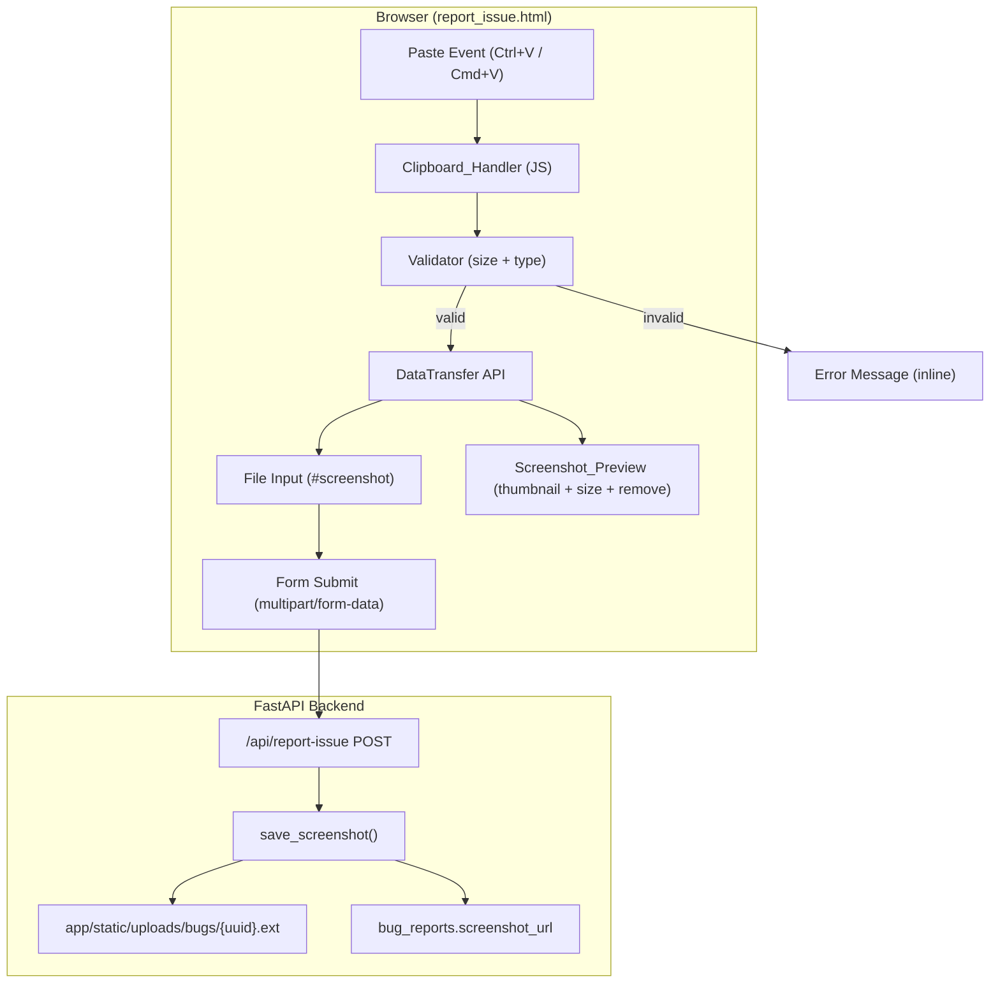

# Design Document: Clipboard Screenshot Paste

## Overview

This design formalizes the clipboard paste-to-upload flow for the `/report-issue` form. The paste functionality is already partially implemented in `report_issue.html` — this design closes the gap by adding client-side size validation (10 MB limit), improving the preview UX, and ensuring seamless integration with the existing `save_screenshot()` backend. No new backend routes or models are required; changes are confined to the template's JavaScript and minor HTML additions.

## Architecture



### Key Decisions

1. **No backend changes for validation** — The 10 MB limit is enforced client-side before the blob reaches the file input. The backend `save_screenshot()` already accepts any valid image; adding a server-side size check is a defense-in-depth improvement but not required for this feature (existing infra has nginx body size limits).

2. **DataTransfer API for file input assignment** — The existing implementation uses `new DataTransfer()` to programmatically set `input.files`. This is well-supported in modern browsers (Chrome 62+, Firefox 52+, Safari 14.1+, Edge 79+) and is the correct approach.

3. **Single image constraint** — At most one screenshot per submission. Paste replaces any existing file selection, and file picker replaces any pasted image. No array of files to manage.

4. **No framework dependencies** — All JS is vanilla, consistent with the project's "Jinja2 + vanilla JS" convention.

## Components and Interfaces

### 1. Clipboard_Handler (JavaScript module in template)

Intercepts `paste` events on the document, extracts image blobs, validates them, and assigns to the file input.

```javascript
// Pseudocode — actual implementation in report_issue.html <script>
document.addEventListener('paste', function(e) {
    const items = e.clipboardData?.items;
    if (!items) return;

    for (const item of items) {
        if (!item.type.startsWith('image/')) continue;

        const blob = item.getAsFile();
        if (!blob) continue;

        // Validate size (10 MB = 10 * 1024 * 1024)
        if (blob.size > 10 * 1024 * 1024) {
            showPasteError('Image too large. Maximum size is 10 MB.');
            e.preventDefault();
            return;
        }

        // Validate MIME type
        const allowedTypes = ['image/png', 'image/jpeg', 'image/gif', 'image/webp'];
        if (!allowedTypes.includes(blob.type)) continue;

        // Assign to file input via DataTransfer
        const dt = new DataTransfer();
        dt.items.add(blob);
        document.getElementById('screenshot').files = dt.files;

        // Show preview
        showPastePreview(blob);
        e.preventDefault();
        break;
    }
});
```

### 2. Screenshot_Preview (HTML + JS)

Shows a thumbnail, file size, and remove button when an image is pasted or selected.

```html
<div id="paste-preview" class="hidden" role="status" aria-live="polite">
    <div class="flex items-center gap-3 p-3 bg-gray-50 rounded-md border border-gray-200">
        
        <div class="flex-1">
            <p class="text-sm text-gray-700">Pasted image</p>
            <p id="paste-preview-size" class="text-xs text-gray-400"></p>
        </div>
        <button type="button" id="paste-remove-btn"
                class="text-red-500 hover:text-red-700 text-sm font-medium"
                aria-label="Remove pasted screenshot">
            Remove
        </button>
    </div>
</div>
```

### 3. Paste Error Display (HTML + JS)

Inline error message for validation failures (size, type).

```javascript
function showPasteError(message) {
    const errorEl = document.getElementById('paste-error');
    errorEl.textContent = message;
    errorEl.classList.remove('hidden');
    // Auto-hide after 5 seconds
    setTimeout(() => errorEl.classList.add('hidden'), 5000);
}
```

```html
<p id="paste-error" class="hidden mt-1 text-xs text-red-600" role="alert" aria-live="assertive"></p>
```

### 4. File Input Change Handler (JavaScript)

Listens for manual file selection to hide the paste preview (coexistence behavior).

```javascript
document.getElementById('screenshot').addEventListener('change', function() {
    if (this.files.length > 0) {
        // Hide paste preview — user chose a file via picker
        document.getElementById('paste-preview').classList.add('hidden');
    }
});
```

### 5. save_screenshot() (Backend — existing, no changes needed)

The existing service function at `app/services/engineering_memory.py`:
- Accepts a FastAPI `UploadFile`
- Validates extension (`.png`, `.jpg`, `.jpeg`, `.gif`, `.webp`), defaults to `.png`
- Saves to `app/static/uploads/bugs/{uuid12}.ext`
- Returns URL path string

No modifications required. Pasted images arrive as standard `multipart/form-data` file uploads because we assign the blob to the file input element.

## Data Models

No new database models or migrations required. The existing `BugReport.screenshot_url` field (String 500, nullable) stores the resulting path regardless of whether the image was pasted or selected via file picker.

**Relevant existing field:**
```python
# app/models/bug_report.py
screenshot_url: Mapped[str | None] = mapped_column(String(500), nullable=True)
```

**File storage path:** `/static/uploads/bugs/{uuid_hex_12_chars}.{ext}`

## Correctness Properties

*A property is a characteristic or behavior that should hold true across all valid executions of a system — essentially, a formal statement about what the system should do. Properties serve as the bridge between human-readable specifications and machine-verifiable correctness guarantees.*

### Property 1: Size validation rejects oversized images

*For any* image blob with size greater than 10 MB (10,485,760 bytes), the Clipboard_Handler SHALL NOT assign it to the File_Input and SHALL display an error message.

**Validates: Requirements 5.1**

### Property 2: Valid paste assigns blob to file input

*For any* image blob with an allowed MIME type (`image/png`, `image/jpeg`, `image/gif`, `image/webp`) and size ≤ 10 MB, pasting it SHALL result in the File_Input's files containing exactly that blob.

**Validates: Requirements 1.1, 1.2, 1.4**

### Property 3: Non-image clipboard content is ignored

*For any* clipboard paste event containing no items with a MIME type starting with `image/`, the Clipboard_Handler SHALL take no action and the File_Input SHALL remain unchanged.

**Validates: Requirements 1.3, 5.2**

### Property 4: Paste replaces existing file selection

*For any* state where the File_Input already contains a file (from picker or previous paste), pasting a new valid image SHALL replace the existing file such that `File_Input.files.length === 1` and the file is the newly pasted blob.

**Validates: Requirements 4.1, 4.3**

### Property 5: Upload round-trip preserves image data

*For any* valid image blob assigned to the File_Input via paste, submitting the form SHALL result in `save_screenshot()` receiving identical binary content, and the stored file SHALL be readable at the returned URL path.

**Validates: Requirements 3.1, 3.2, 3.4**

## Error Handling

| Scenario | Behavior | User Feedback |
|----------|----------|---------------|
| Pasted image > 10 MB | Blob rejected, File_Input unchanged | Inline error: "Image too large. Maximum size is 10 MB." (auto-hides 5s) |
| Non-image paste (text, files) | Ignored, default paste behavior | None — paste proceeds normally |
| Browser lacks DataTransfer API | Paste handler fails silently | File picker still works as fallback |
| Clipboard read blocked (permissions) | `clipboardData` is null, handler returns early | None — user can use file picker |
| Backend save fails (disk full, IO error) | `save_screenshot()` returns None | Server-side: form succeeds without screenshot, bug is still recorded |
| Form submitted without image | `screenshot` field is empty | Normal — screenshot is optional |

## Testing Strategy

### Unit Tests (pytest + httpx)

Test the backend integration point — form submission with file upload:

1. **POST /api/report-issue with file** — verify screenshot saves and URL stored in DB
2. **POST /api/report-issue without file** — verify form succeeds, `screenshot_url` is None
3. **POST /api/report-issue with invalid extension** — verify fallback to `.png`

These are example-based tests using the existing httpx AsyncClient pattern from `tests/`.

### Property-Based Testing Assessment

PBT is **not appropriate** for this feature because:
- The core logic is client-side JavaScript (paste handling, DataTransfer API, DOM manipulation) which cannot be tested with Python PBT
- The backend `save_screenshot()` is a thin I/O function (read bytes → write to disk) with no meaningful input variation beyond file content
- The validation logic (size check, MIME check) is a simple boundary comparison, not a function with a rich input space

The correctness properties above serve as formal specifications for manual/integration testing and any future browser-based test automation (e.g., Playwright), not PBT targets.

### Manual Testing Checklist

- [ ] Paste PNG screenshot → preview appears, form submits, screenshot saved
- [ ] Paste JPEG screenshot → same behavior
- [ ] Paste 11 MB image → error message shown, file input empty
- [ ] Paste text → no action, text goes into focused textarea
- [ ] Paste image then click Remove → preview hidden, file input cleared
- [ ] Select file via picker, then paste → pasted image replaces file
- [ ] Paste image, then select file via picker → file picker selection used, preview hidden
- [ ] Submit form with pasted image → bug report created with screenshot_url
