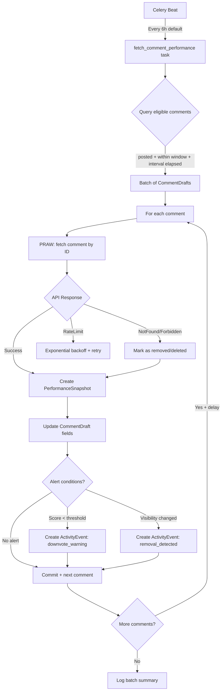
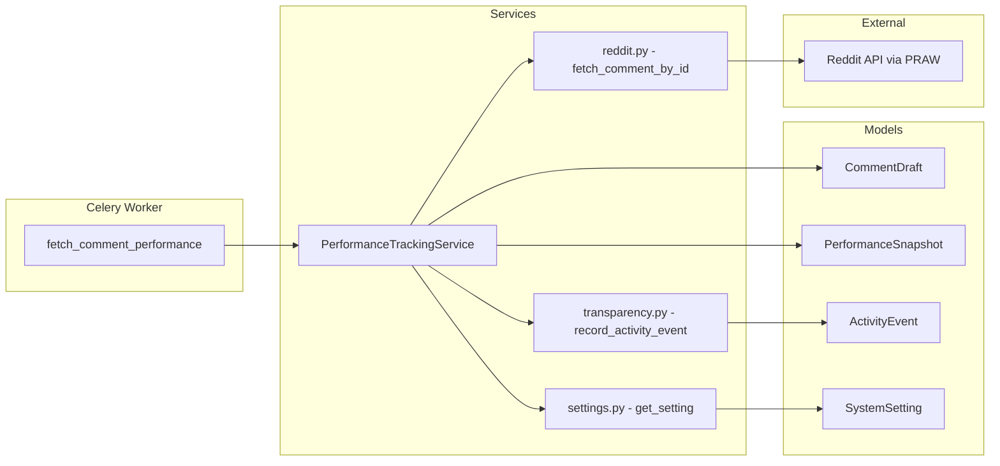

# Design Document: Comment Performance Tracking

## Overview

Comment Performance Tracking adds a periodic monitoring layer that fetches real-world Reddit metrics for posted comments and stores time-series snapshots. The system operates as a Celery beat task that:

1. Identifies all `CommentDraft` records with status "posted" within a configurable tracking window
2. Fetches current score, reply count, and visibility status from Reddit via PRAW
3. Stores each measurement as a `PerformanceSnapshot` record
4. Updates the existing `CommentDraft.reddit_score` and `is_deleted` fields with latest values
5. Triggers `ActivityEvent` alerts for downvoted or removed comments
6. Provides aggregation functions for phase evaluation and effectiveness analysis

The design integrates with existing infrastructure: Celery beat scheduling, PRAW Reddit client, SystemSettings for configuration, ActivityEvent for alerts, and PhaseEvaluator for warming phase decisions.

### Data Flow



## Architecture

### Component Diagram



### Key Design Decisions

1. **New `PerformanceSnapshot` table** rather than overwriting `CommentDraft` fields — preserves time-series history for trajectory analysis while still updating the denormalized fields on `CommentDraft` for backward compatibility with `PhaseEvaluator`.

2. **Per-comment commit** — each snapshot is committed individually so a failure mid-batch doesn't lose prior work. Matches the pattern in `scraping.py`.

3. **Service layer separation** — `PerformanceTrackingService` encapsulates all business logic (eligibility, fetching, alerting, aggregation). The Celery task is a thin orchestrator.

4. **Configurable via SystemSettings** — tracking window, interval, alert threshold, and inter-request delay are all DB-configurable without restart.

5. **Alert deduplication via metadata check** — before emitting an alert, query `ActivityEvent` to see if one already exists for this comment + condition combination.

## Components and Interfaces

### 1. PerformanceTrackingService (`app/services/performance_tracking.py`)

```python
class PerformanceTrackingService:
    """Core service for comment performance tracking."""

    def get_trackable_comments(self, db: Session) -> list[CommentDraft]:
        """Return posted comments within tracking window that need a new snapshot."""

    def fetch_comment_metrics(self, reddit_comment_id: str) -> CommentMetrics | None:
        """Fetch score, reply_count, visibility from Reddit via PRAW."""

    def create_snapshot(
        self, db: Session, comment: CommentDraft, metrics: CommentMetrics
    ) -> PerformanceSnapshot:
        """Create snapshot record and update CommentDraft denormalized fields."""

    def check_and_emit_alerts(
        self, db: Session, comment: CommentDraft, snapshot: PerformanceSnapshot
    ) -> list[ActivityEvent]:
        """Check alert conditions and emit ActivityEvents if needed."""

    def get_effectiveness_by_engagement_mode(
        self, db: Session, client_id: uuid.UUID, window_days: int
    ) -> list[dict]:
        """Aggregate metrics grouped by engagement_mode."""

    def get_effectiveness_by_comment_approach(
        self, db: Session, client_id: uuid.UUID, window_days: int
    ) -> list[dict]:
        """Aggregate metrics grouped by comment_approach."""
```

### 2. Reddit Comment Fetcher (addition to `app/services/reddit.py`)

```python
@dataclass
class CommentMetrics:
    score: int
    reply_count: int
    visibility_status: str  # "visible" | "removed" | "deleted"

def fetch_comment_by_id(comment_id: str) -> CommentMetrics | None:
    """Fetch a single comment's metrics from Reddit.
    
    Returns None if rate-limited (caller should retry).
    Raises NotFound/Forbidden mapped to visibility_status.
    """
```

### 3. Celery Task (`app/tasks/performance.py`)

```python
@celery_app.task(name="fetch_comment_performance")
def fetch_comment_performance() -> dict:
    """Periodic task: fetch performance metrics for all trackable comments.
    
    Returns summary dict: {checked, snapshots_created, alerts_triggered, errors}
    """
```

### 4. SystemSettings Keys

| Key | Default | Description |
|-----|---------|-------------|
| `perf_tracking_window_days` | `7` | Days after posting to track a comment |
| `perf_snapshot_interval_hours` | `6` | Minimum hours between snapshots for same comment |
| `perf_alert_score_threshold` | `-2` | Score below which downvote alert fires |
| `perf_batch_delay_seconds` | `2` | Delay between Reddit API calls in batch |

## Data Models

### PerformanceSnapshot Table

```python
class PerformanceSnapshot(Base):
    __tablename__ = "performance_snapshots"

    id: Mapped[uuid.UUID] = mapped_column(
        UUID(as_uuid=True), primary_key=True, default=uuid.uuid4
    )
    comment_draft_id: Mapped[uuid.UUID] = mapped_column(
        UUID(as_uuid=True), ForeignKey("comment_drafts.id"), nullable=False, index=True
    )
    avatar_id: Mapped[uuid.UUID] = mapped_column(
        UUID(as_uuid=True), ForeignKey("avatars.id"), nullable=False, index=True
    )
    client_id: Mapped[uuid.UUID] = mapped_column(
        UUID(as_uuid=True), ForeignKey("clients.id"), nullable=False, index=True
    )
    
    # Metrics at time of measurement
    score: Mapped[int] = mapped_column(Integer, nullable=False)
    reply_count: Mapped[int] = mapped_column(Integer, nullable=False, default=0)
    visibility_status: Mapped[str] = mapped_column(
        String(20), nullable=False, default="visible"
    )  # visible | removed | deleted
    
    # Timestamp
    measured_at: Mapped[datetime] = mapped_column(
        DateTime(timezone=True), server_default=func.now(), nullable=False
    )

    # Relationships
    comment_draft = relationship("CommentDraft")
    avatar = relationship("Avatar")
```

### Indexes

- `ix_performance_snapshots_comment_draft_id` — fast lookup of all snapshots for a comment
- `ix_performance_snapshots_avatar_id` — phase evaluation queries
- `ix_performance_snapshots_client_id` — client-scoped aggregation queries
- Composite index on `(comment_draft_id, measured_at DESC)` — efficient "latest snapshot" lookup

### Alembic Migration

New migration file: `add_performance_snapshots_table.py`
- Creates `performance_snapshots` table with all columns and indexes
- No changes to existing tables (CommentDraft fields already exist)

### CommentMetrics Dataclass

```python
@dataclass
class CommentMetrics:
    score: int
    reply_count: int
    visibility_status: str  # "visible" | "removed" | "deleted"
```

## Correctness Properties

*A property is a characteristic or behavior that should hold true across all valid executions of a system — essentially, a formal statement about what the system should do. Properties serve as the bridge between human-readable specifications and machine-verifiable correctness guarantees.*

### Property 1: Comment eligibility filtering

*For any* set of CommentDraft records with varying statuses, posted_at timestamps, and last snapshot timestamps, `get_trackable_comments` SHALL return exactly those comments where: status equals "posted", AND `now - posted_at` is less than or equal to `tracking_window_days`, AND either no snapshot exists OR the most recent snapshot's `measured_at` is at least `snapshot_interval_hours` ago.

**Validates: Requirements 1.1, 1.2, 1.3, 8.2**

### Property 2: Snapshot creation preserves all metrics

*For any* valid CommentMetrics (score as any integer, reply_count as any non-negative integer, visibility_status in {"visible", "removed", "deleted"}), creating a PerformanceSnapshot SHALL produce a record where `snapshot.score == metrics.score`, `snapshot.reply_count == metrics.reply_count`, `snapshot.visibility_status == metrics.visibility_status`, and `snapshot.avatar_id` and `snapshot.client_id` are populated from the source CommentDraft.

**Validates: Requirements 2.1, 6.1**

### Property 3: Snapshot history accumulation

*For any* CommentDraft and any sequence of N metric measurements (N >= 1), creating N snapshots SHALL result in exactly N PerformanceSnapshot records for that comment, each with a distinct `measured_at` timestamp.

**Validates: Requirements 2.2**

### Property 4: CommentDraft field synchronization

*For any* PerformanceSnapshot creation with score S and visibility_status V, after the operation: `CommentDraft.reddit_score` SHALL equal S, AND if V is in {"removed", "deleted"} then `CommentDraft.is_deleted` SHALL be True and `CommentDraft.deleted_detected_at` SHALL be non-null, AND if V is "visible" then `CommentDraft.is_deleted` SHALL remain unchanged.

**Validates: Requirements 2.3, 2.4**

### Property 5: Downvote alert triggering

*For any* integer score and integer alert_threshold, when a PerformanceSnapshot is created: if `score < alert_threshold` then an ActivityEvent with event_type "comment_alert" SHALL be created containing avatar_id, comment_id, subreddit, and score in its metadata; if `score >= alert_threshold` then no downvote alert SHALL be created.

**Validates: Requirements 4.1, 4.3**

### Property 6: Visibility change alert triggering

*For any* comment whose previous visibility_status was "visible", when a new PerformanceSnapshot has visibility_status in {"removed", "deleted"}, an ActivityEvent with event_type "comment_alert" SHALL be created describing the removal. When the previous status was already non-visible, no removal alert SHALL be created.

**Validates: Requirements 4.2**

### Property 7: Alert deduplication (idempotence)

*For any* comment and alert condition (downvote or removal), processing the same comment multiple times with the same alert-triggering condition SHALL result in at most one ActivityEvent for that comment and condition combination. Formally: `count(alerts for comment_id + condition) <= 1`.

**Validates: Requirements 4.4**

### Property 8: Aggregation correctness

*For any* set of PerformanceSnapshot records with associated CommentDraft engagement_mode and comment_approach values, the aggregation functions SHALL return: `avg_score` equal to the arithmetic mean of scores in each group, `avg_reply_count` equal to the arithmetic mean of reply_counts in each group, and `removal_rate` equal to the count of non-visible snapshots divided by total snapshots in each group.

**Validates: Requirements 6.2, 6.3**

### Property 9: Comment metrics extraction

*For any* PRAW comment object with integer score, a list of replies, and body text: `fetch_comment_by_id` SHALL return a CommentMetrics where `score` equals the comment's score, `reply_count` equals the number of direct replies, and `visibility_status` is "removed" if body is "[removed]", "deleted" if body is "[deleted]", and "visible" otherwise.

**Validates: Requirements 7.2**

## Error Handling

### Reddit API Errors

| Exception | Handling | Recovery |
|-----------|----------|----------|
| `TooManyRequests` | Log rate limit event, exponential backoff (2^attempt seconds, max 5 attempts) | Skip remaining batch, retry on next cycle |
| `NotFound` | Map to visibility_status="deleted", set deleted_detected_at | Continue batch |
| `Forbidden` | Map to visibility_status="removed", set deleted_detected_at | Continue batch |
| `ServerError` / `RequestException` | Log error, increment error counter | Skip comment, continue batch |
| Unexpected exceptions | Log with traceback, increment error counter | Skip comment, continue batch |

### Database Errors

- **Per-comment commit failure**: Log error, rollback that comment's transaction, continue with next comment
- **Bulk query failure** (get_trackable_comments): Log error, abort entire batch run, rely on next scheduled execution

### Alert Emission Errors

- Alert creation failures are logged but never crash the batch (same pattern as `scraping.py`)
- Wrapped in try/except to ensure performance tracking continues even if alerting fails

### Configuration Errors

- Missing SystemSettings: Fall back to hardcoded defaults (7 days, 6 hours, -2 threshold, 2s delay)
- Invalid setting values (non-numeric): Log warning, use default

## Testing Strategy

### Property-Based Tests (Hypothesis)

The project already uses `hypothesis>=6.100.0` (in pyproject.toml dev dependencies). Each correctness property maps to a single Hypothesis test with minimum 100 iterations.

**Test file**: `reddit_saas/tests/test_performance_tracking_properties.py`

| Property | Test Function | Strategy |
|----------|--------------|----------|
| 1: Eligibility | `test_eligibility_filtering` | Generate lists of CommentDraft-like objects with random status, posted_at, last_snapshot_at |
| 2: Snapshot preserves metrics | `test_snapshot_preserves_metrics` | Generate random (score, reply_count, visibility_status) tuples |
| 3: History accumulation | `test_snapshot_accumulation` | Generate random N (1-20), create N snapshots, verify count |
| 4: Field sync | `test_comment_draft_field_sync` | Generate random score + visibility_status, verify CommentDraft updates |
| 5: Downvote alert | `test_downvote_alert_triggering` | Generate random (score, threshold) integer pairs |
| 6: Visibility alert | `test_visibility_change_alert` | Generate random (prev_status, new_status) from {"visible", "removed", "deleted"} |
| 7: Alert dedup | `test_alert_deduplication` | Generate random repetition count (2-10), verify single alert |
| 8: Aggregation | `test_aggregation_correctness` | Generate random lists of (engagement_mode, score, reply_count, visibility_status) |
| 9: Metrics extraction | `test_metrics_extraction` | Generate random (score, reply_list_length, body_text) |

**Configuration**: Each test decorated with `@settings(max_examples=100)`.

**Tag format**: Each test includes a docstring comment:
```python
# Feature: comment-performance-tracking, Property 1: Comment eligibility filtering
```

### Unit Tests (Example-Based)

**Test file**: `reddit_saas/tests/test_performance_tracking.py`

- Configuration defaults (3.1, 3.2, 3.3)
- Dynamic config reload (3.4)
- Rate limit retry with exponential backoff (1.5)
- NotFound → deleted mapping (1.6)
- Forbidden → removed mapping (7.3)
- Structured logging format (7.4)
- Batch delay between API calls (8.1)
- Per-comment commit behavior (8.3)
- Batch summary logging (8.4)

### Integration Tests

- Phase evaluation with snapshot data (5.1, 5.2, 5.3): Create snapshots, run PhaseEvaluator, verify correct scores/survival rates
- Celery task registration (1.4): Verify task in beat_schedule
- End-to-end batch run with mocked PRAW: Full task execution with DB assertions

