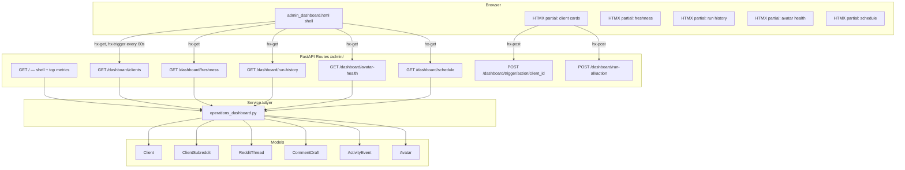

# Design Document: Daily Operations Dashboard

## Overview

The Daily Operations Dashboard replaces the existing lightweight admin dashboard at `/admin/` with a unified, single-page operational view. It consolidates client pipeline status, manual triggers, review queue counts, scrape freshness, run history, schedule visibility, and avatar health into one actionable page.

The page follows a **shell + HTMX partials** architecture: the main layout renders synchronously with top-level metrics, while individual panels (client cards, freshness, run history, avatar health, schedule) load asynchronously via HTMX `hx-get` calls. This enables per-section auto-refresh (every 60s for client cards) without full page reloads.

### Key Design Decisions

1. **Server-side rendering with HTMX** — No client-side JS framework. All interactivity is handled via HTMX attributes (`hx-get`, `hx-post`, `hx-target`, `hx-swap`, `hx-trigger`). This is consistent with the existing admin panel.
2. **Service layer aggregation** — A dedicated `services/operations_dashboard.py` module (already exists) encapsulates all DB queries. Route handlers remain thin.
3. **Celery Beat schedule introspection** — Schedule display is computed from a static list of `crontab` entries mirroring `tasks/worker.py`, using `remaining_estimate()` to calculate time-until-next-run.
4. **No new database tables** — All data is sourced from existing models: `Client`, `ClientSubreddit`, `RedditThread`, `CommentDraft`, `ActivityEvent`, `Avatar`.

## Architecture



### Request Flow

1. Browser requests `GET /admin/` → route renders `admin_dashboard.html` with top metrics (pending reviews, total clients, total avatars, next run time) computed synchronously.
2. On page load, HTMX fires `hx-get` for each panel partial → each returns an HTML fragment swapped into the corresponding `<div>`.
3. Client cards section has `hx-trigger="every 60s"` for auto-refresh.
4. Pipeline trigger buttons use `hx-post` → route dispatches Celery task → returns toast partial swapped into a notification area.

## Components and Interfaces

### Route Endpoints (in `routes/admin.py`)

| Method | Path | Purpose | Response |
|--------|------|---------|----------|
| GET | `/admin/` | Dashboard shell + top metrics | Full HTML page |
| GET | `/admin/dashboard/clients` | Client status cards partial | HTML fragment |
| GET | `/admin/dashboard/freshness` | Scrape freshness panel partial | HTML fragment |
| GET | `/admin/dashboard/run-history?client_id=` | Run history partial (optional filter) | HTML fragment |
| GET | `/admin/dashboard/avatar-health` | Avatar health summary partial | HTML fragment |
| GET | `/admin/dashboard/schedule` | Schedule display partial | HTML fragment |
| POST | `/admin/dashboard/trigger/{action}/{client_id}` | Per-client pipeline trigger | Toast HTML fragment |
| POST | `/admin/dashboard/run-all/{action}` | Bulk pipeline trigger | Toast HTML fragment |

### Service Functions (`services/operations_dashboard.py`)

| Function | Input | Output |
|----------|-------|--------|
| `get_top_metrics(db)` | Session | `{pending_reviews, total_clients, total_avatars, next_run_label, next_run_in}` |
| `get_client_status_cards(db)` | Session | `list[{client_id, client_name, threads_24h, scored_24h, generated_24h, pending, is_idle}]` |
| `list_active_clients(db)` | Session | `list[Client]` |
| `get_scrape_freshness_grouped(db, stale_hours=24)` | Session, int | `list[{client_id, client_name, subreddits: [...], stale_count, total}]` |
| `get_run_history(db, client_id=None, limit=20)` | Session, UUID?, int | `list[{id, client_id, client_name, event_type, message, created_at, since_human}]` |
| `get_avatar_health_summary(db)` | Session | `{status_counts, phase_counts, total_active, eligible_for_promotion}` |
| `get_schedule_display(now=None)` | datetime? | `list[{key, label, next_at, in_human, is_next}]` |

### Templates

| Template | Type | Description |
|----------|------|-------------|
| `admin_dashboard.html` | Full page | Dashboard shell with top metrics bar, grid layout, HTMX loading targets |
| `partials/dashboard_client_cards.html` | Partial | Client status cards with pipeline buttons |
| `partials/dashboard_freshness.html` | Partial | Scrape freshness grouped by client |
| `partials/dashboard_run_history.html` | Partial | Recent pipeline events list |
| `partials/dashboard_avatar_health.html` | Partial | Avatar status/phase summary |
| `partials/dashboard_schedule.html` | Partial | Next scheduled runs |
| `partials/dashboard_toast.html` | Partial | Success/error notification |

### Page Layout Structure

```
┌─────────────────────────────────────────────────────────────┐
│  TOP METRICS BAR                                            │
│  [Pending Reviews: 12] [Clients: 3] [Avatars: 8] [Next: 2h]│
├─────────────────────────────────────────────────────────────┤
│  RUN ALL CONTROLS                                           │
│  [Scrape All] [Score All] [Generate All] [Full Pipeline All]│
├───────────────────────────────────────┬─────────────────────┤
│  CLIENT CARDS (2/3 width)             │ SIDE PANELS (1/3)   │
│                                       │                     │
│  ┌─────────────────────────────────┐  │ ┌─────────────────┐ │
│  │ Client: NeuroYoga               │  │ │ SCHEDULE        │ │
│  │ Scraped: 15 | Scored: 12 |      │  │ │ Morning: in 3h  │ │
│  │ Generated: 5 | Pending: 3       │  │ │ Hobby: in 5h    │ │
│  │ [Scrape][Score][Generate][Full]  │  │ │ Afternoon: 8h   │ │
│  └─────────────────────────────────┘  │ └─────────────────┘ │
│                                       │                     │
│  ┌─────────────────────────────────┐  │ ┌─────────────────┐ │
│  │ Client: XM Cyber                │  │ │ AVATAR HEALTH   │ │
│  │ ⚠️ No activity in 24h           │  │ │ Active: 6       │ │
│  │ ...                             │  │ │ Shadowbanned: 1 │ │
│  └─────────────────────────────────┘  │ │ Phase promo: 2  │ │
│                                       │ └─────────────────┘ │
├───────────────────────────────────────┤                     │
│  RUN HISTORY                          │ ┌─────────────────┐ │
│  • NeuroYoga | scrape | 2h ago |      │ │ SCRAPE FRESH.   │ │
│    "Scraped 15 posts from r/yoga"     │ │ NeuroYoga:      │ │
│  • XM Cyber | score | 4h ago | ...    │ │  r/yoga — 2h    │ │
│                                       │ │  r/cyber — 26h ❌│ │
└───────────────────────────────────────┴─────────────────────┘
```

## Data Models

No new database models are required. The dashboard reads from existing tables:

### Existing Models Used

| Model | Table | Fields Used |
|-------|-------|-------------|
| `Client` | `clients` | `id`, `client_name`, `is_active` |
| `ClientSubreddit` | `client_subreddits` | `client_id`, `subreddit_name`, `is_active`, `last_scraped_at` |
| `RedditThread` | `reddit_threads` | `client_id`, `created_at`, `tag` |
| `CommentDraft` | `comment_drafts` | `client_id`, `status`, `created_at` |
| `ActivityEvent` | `activity_events` | `client_id`, `event_type`, `message`, `created_at` |
| `Avatar` | `avatars` | `active`, `reddit_status`, `warming_phase`, `last_phase_evaluated_at` |

### Service Return Shapes (TypedDict-style)

```python
# Top metrics
TopMetrics = {
    "pending_reviews": int,
    "total_clients": int,
    "total_avatars": int,
    "next_run_label": str | None,
    "next_run_in": str | None,
}

# Client status card
ClientCard = {
    "client_id": str,
    "client_name": str,
    "threads_24h": int,
    "scored_24h": int,
    "generated_24h": int,
    "pending": int,
    "is_idle": bool,  # True when all 24h counts are 0
}

# Scrape freshness entry
FreshnessEntry = {
    "subreddit_name": str,
    "last_scraped_at": datetime | None,
    "since_human": str,
    "is_stale": bool,
    "is_never": bool,
}

# Freshness group (per client)
FreshnessGroup = {
    "client_id": str,
    "client_name": str,
    "subreddits": list[FreshnessEntry],
    "stale_count": int,
    "total": int,
}

# Run history entry
RunHistoryEntry = {
    "id": str,
    "client_id": str | None,
    "client_name": str,
    "event_type": str,
    "message": str,
    "created_at": datetime,
    "since_human": str,
}

# Avatar health summary
AvatarHealthSummary = {
    "status_counts": {"active": int, "shadowbanned": int, "suspended": int, "unknown": int},
    "phase_counts": {"phase_1": int, "phase_2": int, "phase_3": int},
    "total_active": int,
    "eligible_for_promotion": int,
}

# Schedule entry
ScheduleEntry = {
    "key": str,
    "label": str,
    "next_at": datetime,
    "in_human": str,
    "is_next": bool,
}
```


## Correctness Properties

*A property is a characteristic or behavior that should hold true across all valid executions of a system — essentially, a formal statement about what the system should do. Properties serve as the bridge between human-readable specifications and machine-verifiable correctness guarantees.*

### Property 1: Client status cards reflect active clients with correct 24h counts

*For any* set of clients (some active, some inactive) and any set of RedditThread and CommentDraft records with varying `created_at` timestamps, `get_client_status_cards` SHALL return exactly one card per active client where:
- `threads_24h` equals the count of threads for that client with `created_at` within the last 24 hours
- `scored_24h` equals the count of threads for that client with `created_at` within the last 24h AND `tag` is not None
- `generated_24h` equals the count of comment drafts for that client with `created_at` within the last 24h
- `pending` equals the count of comment drafts for that client with `status == "pending"`
- `is_idle` is True if and only if `threads_24h + scored_24h + generated_24h == 0`

**Validates: Requirements 1.1, 1.2, 1.3**

### Property 2: Pending reviews count equals total pending drafts

*For any* set of CommentDraft records with varying statuses across multiple clients, `get_top_metrics` SHALL return `pending_reviews` equal to the total count of drafts where `status == "pending"`.

**Validates: Requirements 3.1, 3.2**

### Property 3: Scrape freshness staleness classification

*For any* set of active subreddits with varying `last_scraped_at` timestamps (including None), `get_scrape_freshness_grouped` SHALL mark a subreddit as `is_stale == True` if and only if `last_scraped_at` is None or `last_scraped_at` is more than 24 hours before the current time, and `is_never == True` if and only if `last_scraped_at` is None.

**Validates: Requirements 4.1, 4.2, 4.3**

### Property 4: Scrape freshness sorting invariant

*For any* client group returned by `get_scrape_freshness_grouped`, all stale subreddits SHALL appear before all fresh subreddits within that group's subreddit list.

**Validates: Requirements 4.4**

### Property 5: Run history filters to pipeline event types only

*For any* set of ActivityEvent records with varying `event_type` values (including non-pipeline types like "review", "system"), `get_run_history` SHALL return only events where `event_type` is one of ("scrape", "score", "generate").

**Validates: Requirements 5.1, 5.2**

### Property 6: Run history ordering and limit

*For any* set of pipeline ActivityEvent records, `get_run_history(limit=20)` SHALL return at most 20 entries ordered by `created_at` descending (each entry's `created_at` >= the next entry's `created_at`).

**Validates: Requirements 5.3, 5.4**

### Property 7: Schedule display correctness

*For any* datetime `now`, `get_schedule_display(now)` SHALL return exactly one entry per configured schedule where:
- `next_at >= now` (next run is in the future or now)
- `in_human` is a non-empty string
- Exactly one entry has `is_next == True`, and that entry has the minimum `next_at` among all entries

**Validates: Requirements 6.1, 6.2, 6.3**

### Property 8: Avatar health aggregation correctness

*For any* set of active avatars with varying `reddit_status` and `warming_phase` values, `get_avatar_health_summary` SHALL return:
- `status_counts` where each status count equals the number of active avatars with that `reddit_status`
- `phase_counts` where each phase count equals the number of active avatars with that `warming_phase`
- `total_active` equals the sum of all status counts
- `eligible_for_promotion` equals the count of active avatars where `warming_phase < 3` AND (`last_phase_evaluated_at` is None OR older than 30 days)

**Validates: Requirements 7.1, 7.3, 7.4**

### Property 9: Human delta formatting produces valid output

*For any* non-negative timedelta, `_human_delta` SHALL return a non-empty string that:
- Contains at least one digit
- Uses only the units: s, m, h, d (or the word "now" for negative deltas)
- Is monotonically non-decreasing in numeric value as the input timedelta increases (e.g., "5m" < "2h" < "3d" in implied duration)

**Validates: Requirements 5.3, 6.2**

## Error Handling

### Pipeline Trigger Errors

| Scenario | Handling |
|----------|----------|
| Unknown action (not in scrape/score/generate/full-pipeline) | Return 400 with error toast partial |
| Celery task dispatch failure (broker down) | Catch exception, return 500 with error message in toast |
| Client not found | Return 404 (FastAPI default for invalid UUID path param) |
| Run-All partial failures | Return success toast with count + list of failed clients (max 3 shown) |

### Data Query Errors

| Scenario | Handling |
|----------|----------|
| Empty database (no clients) | Dashboard renders with empty state — "No active clients" message |
| No activity events | Run history shows "No recent pipeline activity" |
| All subreddits fresh | Freshness panel shows all green indicators |
| Schedule computation error | Fallback to timedelta(0), display "now" |

### HTMX Partial Load Failures

If an HTMX partial endpoint returns a 5xx error, the browser will display the error response in the target div. The partials should include a generic error message template that HTMX can swap in. The auto-refresh will retry on the next 60s cycle.

## Testing Strategy

### Property-Based Tests (Hypothesis)

The service layer functions in `operations_dashboard.py` are well-suited for property-based testing because they perform pure data aggregation and computation over varying inputs. The project already uses Hypothesis (evidenced by `.hypothesis/` directory).

**Configuration:**
- Library: `hypothesis` (already in project)
- Minimum iterations: 100 per property (`@settings(max_examples=100)`)
- Each test tagged with: `# Feature: daily-ops-dashboard, Property N: <title>`

**Properties to implement:**
1. Client status cards correctness (Property 1)
2. Pending reviews count (Property 2)
3. Staleness classification (Property 3)
4. Freshness sorting invariant (Property 4)
5. Run history event type filtering (Property 5)
6. Run history ordering and limit (Property 6)
7. Schedule display correctness (Property 7)
8. Avatar health aggregation (Property 8)
9. Human delta formatting (Property 9)

**Test approach:** Use an in-memory SQLite or test PostgreSQL database with Hypothesis-generated model instances. For `get_schedule_display`, test the pure function directly with generated `now` values.

### Unit Tests (pytest)

- Pipeline trigger endpoint returns correct toast for each action
- Pipeline trigger endpoint returns error toast on exception
- Run-All fans out to all active clients
- Template rendering includes required HTMX attributes
- Edge cases: empty client list, NULL last_scraped_at, zero pending reviews

### Integration Tests

- Full page load at `/admin/` returns 200 with correct template
- Each HTMX partial endpoint returns valid HTML fragments
- Pipeline trigger with mocked Celery dispatches correct task
- Auto-refresh attribute present on client cards container

### Test File Structure

```
tests/
├── test_operations_dashboard_properties.py   # Property-based tests (Properties 1-9)
├── test_operations_dashboard_service.py      # Unit tests for service functions
└── test_admin_dashboard_routes.py            # Integration tests for endpoints
```
