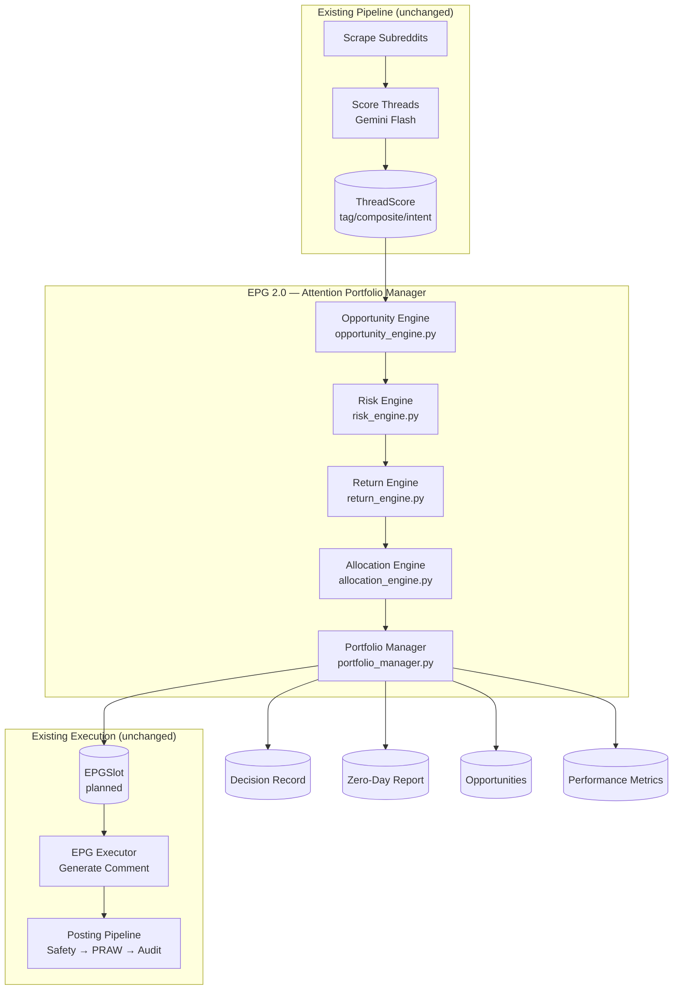
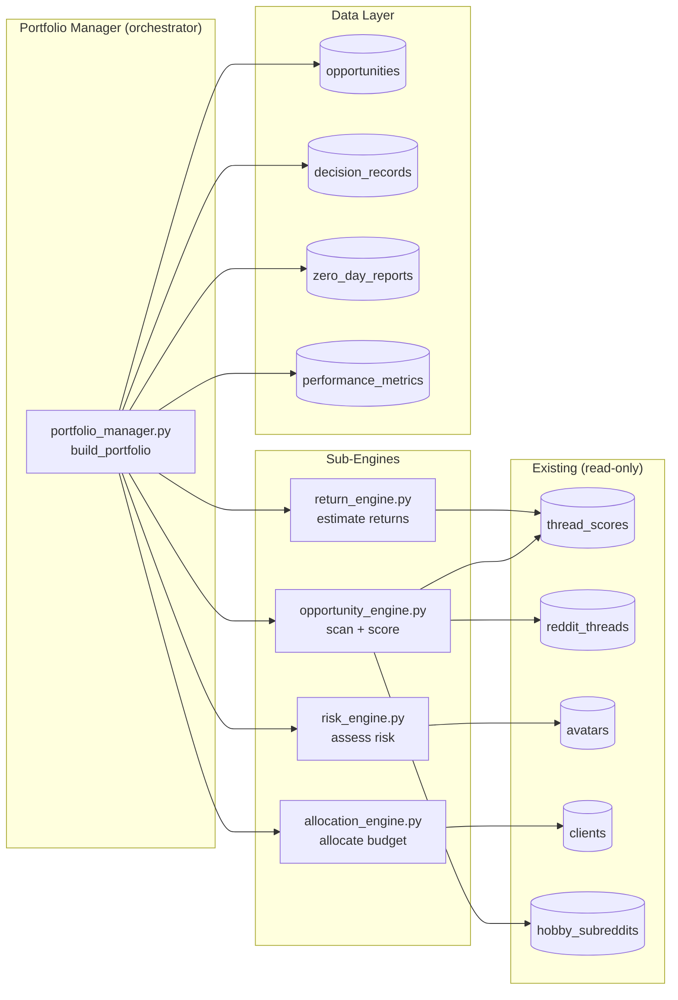

# Design Document: EPG 2.0 — Attention Portfolio Manager

## Overview

EPG 2.0 replaces the thread-selection logic inside `build_daily_epg()` with a multi-stage investment decision engine. The system reframes each avatar's daily publishing program as portfolio allocation: Reddit is the attention market, each avatar is an investment fund, and each publication is an investment decision.

**Key architectural principle**: EPG 2.0 is a *decision layer* that sits between the existing scoring pipeline (ThreadScore) and the existing execution pipeline (EPGSlot → epg_executor → posting). It consumes ThreadScores as raw market data and produces EPGSlots as action instructions. Nothing downstream changes.

**Design decisions**:
- All computation is synchronous within a single Celery task per avatar (no LLM calls in the allocation pipeline itself — LLM scoring is already done upstream)
- The system uses deterministic scoring algorithms (weighted formulas, not LLM) for opportunity evaluation, risk assessment, and return estimation
- Portfolio allocation is a constrained optimization solved greedily (sort by risk-adjusted return, fill categories within budget)
- Zero-day reports are first-class outputs, not error states



## Architecture

### System Context

EPG 2.0 operates within the existing Celery Beat schedule. The `build_and_generate_epg_all_avatars` task at 08:15 (and optionally 14:00) calls the new `portfolio_manager.build_portfolio()` instead of the old `build_daily_epg()`. The output interface remains identical: EPGSlot records + EPGResult.

### Component Architecture



### Integration Points

| Integration Point | Direction | Description |
|---|---|---|
| `ThreadScore` | Input | Pre-scored threads from Gemini Flash scoring pipeline |
| `RedditThread` | Input | Thread metadata (age, ups, comments, subreddit) |
| `Avatar` | Input | State (phase, karma, health, last_posted_at, warming_phase) |
| `Client` | Input | Strategy (keywords, return weights, brand config) |
| `HobbySubreddit` | Input | Hobby threads for Phase 1 avatars |
| `EPGSlot` | Output | Planned slots for execution pipeline |
| `EPGResult` | Output | Summary for API/UI consumers |
| `timing_engine` | Used | Time slot generation with jitter |
| `posting_safety` | Respected | All 9 safety gates remain in force downstream |

## Components and Interfaces

### 1. `portfolio_manager.py` — Orchestrator

The main entry point replacing `build_daily_epg()` thread selection logic.

```python
from dataclasses import dataclass
from datetime import date
from typing import Optional
import uuid

from sqlalchemy.orm import Session

from app.models.avatar import Avatar
from app.models.client import Client
from app.services.epg import EPGResult


@dataclass
class PortfolioConfig:
    """Configuration for a single portfolio allocation run."""
    avatar: Avatar
    client: Optional[Client]
    plan_date: date
    budget: "AttentionBudget"
    allocation: "PortfolioAllocation"
    return_weights: "ReturnWeights"


@dataclass
class AttentionBudget:
    """Daily attention budget for an avatar."""
    max_comments: int
    max_posts: int
    max_total_actions: int
    acceptable_risk_level: int  # 0-100 threshold

    @classmethod
    def from_avatar(cls, avatar: Avatar, client: Optional[Client] = None) -> "AttentionBudget":
        """Derive budget from avatar phase + optional client plan caps."""
        ...

    def apply_monthly_cap(self, remaining_monthly: int, days_remaining: int) -> "AttentionBudget":
        """Reduce daily budget if monthly plan cap is approaching."""
        ...


@dataclass
class ReturnWeights:
    """Configurable weights for Expected Return computation."""
    karma: int = 20
    trust: int = 25
    visibility: int = 20
    influence: int = 15
    strategic_value: int = 20

    @classmethod
    def from_client(cls, client: Optional[Client]) -> "ReturnWeights":
        """Load custom weights from client config or use defaults."""
        ...

    @property
    def normalized(self) -> dict[str, float]:
        """Return weights normalized to sum to 1.0."""
        ...


@dataclass
class PortfolioAllocation:
    """Topic category distribution for the daily budget."""
    categories: dict[str, int]  # category_name → percentage (sum=100)
    preset: str = "balanced"  # balanced | aggressive_growth | conservative | custom

    @classmethod
    def from_avatar_profile(cls, avatar: Avatar, client: Optional[Client]) -> "PortfolioAllocation":
        """Derive allocation from avatar niche profile and client strategy."""
        ...

    def validate(self) -> bool:
        """Ensure percentages sum to 100."""
        ...


def build_portfolio(
    db: Session,
    avatar: Avatar,
    client: Optional[Client] = None,
) -> EPGResult:
    """Build the daily attention portfolio for an avatar.

    Replaces build_daily_epg() thread selection. Produces the same
    output interface (EPGResult with EPGSlot records).

    Pipeline:
    1. Compute AttentionBudget (phase + health + client plan)
    2. Run Opportunity Engine (scan + score)
    3. Run Risk Engine (filter by risk threshold)
    4. Run Return Engine (estimate returns)
    5. Run Allocation Engine (portfolio optimization)
    6. Persist: Opportunities, Decision Record, EPGSlots
    7. If zero actions: generate Zero-Day Report

    Returns:
        EPGResult compatible with existing consumers.
    """
    ...
```

### 2. `opportunity_engine.py` — Market Scanner

```python
from dataclasses import dataclass
from datetime import datetime
import uuid


@dataclass
class OpportunityScore:
    """Six-dimensional score for an opportunity."""
    visibility: int        # 0-100
    competition: int       # 0-100
    trust_potential: int   # 0-100
    karma_potential: int   # 0-100
    risk: int              # 0-100
    strategic_alignment: int  # 0-100
    composite: int         # 0-100 (weighted average)


@dataclass
class Opportunity:
    """A scored engagement opportunity."""
    id: uuid.UUID
    thread_id: uuid.UUID | None
    hobby_post_id: uuid.UUID | None
    subreddit: str
    opportunity_type: str  # comment | post | reply
    thread_title: str
    thread_ups: int
    thread_age_hours: float
    comment_count: int
    score: OpportunityScore
    thread_score: "ThreadScore | None"  # Original ThreadScore if available


def scan_opportunities(
    db: Session,
    avatar: Avatar,
    client: Client | None,
    plan_date: date,
) -> list[Opportunity]:
    """Scan all assigned subreddits and produce scored opportunities.

    Sources:
    - ThreadScore records tagged "engage" or "monitor" (pre-scored)
    - HobbySubreddit posts (for Phase 1 / hobby allocation)

    Deduplication:
    - Excludes threads where avatar already has a draft/posted comment
    - Excludes threads in today's existing non-planned slots

    Scoring:
    - Visibility: computed from thread_age, ups, comment_count, sub size
    - Competition: comment count + quality of existing top comments
    - Trust_Potential: topic alignment + expertise opportunity
    - Karma_Potential: historical avg karma + engagement velocity
    - Risk: delegated to Risk Engine (set to 0 here, filled later)
    - Strategic_Alignment: from ThreadScore.strategic + client goals

    Returns:
        10-50 scored Opportunity objects, sorted by composite score desc.
    """
    ...


def compute_visibility(thread: "RedditThread", sub_size: int) -> int:
    """Compute visibility score (0-100).

    Factors: thread age (fresher=higher), moderate ups (sweet spot),
    low comment count (more room for new replies), sub size.
    """
    ...


def compute_competition(thread: "RedditThread") -> int:
    """Compute competition score (0-100, higher = LESS competition).

    Factors: fewer comments = higher score, no top-comment domination.
    """
    ...


def compute_trust_potential(
    thread: "RedditThread",
    avatar: Avatar,
    thread_score: "ThreadScore | None",
) -> int:
    """Compute trust potential score (0-100).

    Factors: topic alignment with avatar niche, expertise opportunity
    (help_seeking intent scores highest), discussion depth potential.
    """
    ...


def compute_karma_potential(
    thread: "RedditThread",
    avatar: Avatar,
    subreddit_karma_avg: float,
) -> int:
    """Compute karma potential score (0-100).

    Factors: historical avg karma in this sub, thread engagement velocity,
    comment position (early = higher).
    """
    ...


def compute_strategic_alignment(
    thread: "RedditThread",
    thread_score: "ThreadScore | None",
    client: "Client | None",
    avatar: Avatar,
) -> int:
    """Compute strategic alignment score (0-100).

    Factors: ThreadScore.strategic, client keyword match,
    avatar niche relevance, phase appropriateness.
    """
    ...
```

### 3. `risk_engine.py` — Risk Assessment

```python
@dataclass
class RiskAssessment:
    """Detailed risk breakdown for an opportunity."""
    base_score: int             # 0-100 before modifiers
    account_age_factor: int     # risk from young account
    karma_factor: int           # risk from low karma
    frequency_factor: int       # risk from high posting frequency
    moderation_factor: int      # risk from sub moderation sensitivity
    content_type_factor: int    # risk from brand content
    health_modifier: int        # +20 if warned/suspicious
    phase_multiplier: float     # 2.0 for Phase 1, 1.0 for Phase 3
    final_score: int            # 0-100 after all modifiers
    flags: list[str]            # high_risk, critical_risk


def assess_risk(
    opportunity: Opportunity,
    avatar: Avatar,
    community_state: "CommunityState",
) -> RiskAssessment:
    """Compute risk score for an opportunity.

    Considers:
    - Avatar account age (newer = riskier)
    - Avatar karma level (lower = less tolerance)
    - Posting frequency last 24h (higher = more detectable)
    - Subreddit moderation sensitivity (historical removal rate)
    - Content type (brand > expertise > hobby)
    - Avatar health modifier (+20 for warned/suspicious)
    - Phase multiplier (Phase 1 = 2x weight on sensitivity+frequency)
    """
    ...


def compute_historical_removal_rate(
    db: Session,
    avatar_id: uuid.UUID,
    subreddit: str,
    window_days: int = 90,
) -> float:
    """Compute ratio of removed posts to total posts for avatar-subreddit pair."""
    ...


def filter_by_risk(
    opportunities: list[Opportunity],
    risk_assessments: dict[uuid.UUID, RiskAssessment],
    acceptable_risk_level: int,
) -> tuple[list[Opportunity], list[tuple[Opportunity, str]]]:
    """Partition opportunities into viable and rejected based on risk threshold.

    Returns:
        (viable_opportunities, rejected_with_reasons)
    """
    ...
```

### 4. `return_engine.py` — Expected Return Estimation

```python
@dataclass
class ExpectedReturn:
    """Multi-dimensional return estimate."""
    karma: int                # expected karma gain
    trust: int                # 0-100
    visibility: int           # 0-100
    influence: int            # 0-100
    strategic_value: int      # 0-100
    composite: int            # 0-100 weighted sum


def estimate_returns(
    opportunity: Opportunity,
    avatar: Avatar,
    client: Client | None,
    weights: ReturnWeights,
    subreddit_karma_multiplier: float = 1.0,
) -> ExpectedReturn:
    """Estimate expected multi-dimensional return for an opportunity.

    Karma: regression from historical avg + velocity + position
    Trust: expertise demonstration + helping + dialogue potential
    Visibility: sub size + thread position + cross-post potential
    Influence: discussion provocation + authority proximity
    Strategic Value: entity linking support + phase strategy fit

    The subreddit_karma_multiplier adjusts predictions based on
    model_correction_events (±10% when consistently over/under-performing).
    """
    ...


def compute_expected_karma(
    opportunity: Opportunity,
    avatar: Avatar,
    subreddit_avg_karma: float,
    karma_multiplier: float,
) -> int:
    """Predict karma gain using simple regression model.

    Inputs: historical avg in sub, thread velocity, timing, avatar trajectory.
    """
    ...


def get_subreddit_karma_multiplier(
    db: Session,
    avatar_id: uuid.UUID,
    subreddit: str,
) -> float:
    """Get karma prediction multiplier adjusted by correction events.

    Starts at 1.0. Increases by 10% for consistent over-performance,
    decreases by 10% for consistent under-performance.
    Clamped to [0.5, 2.0].
    """
    ...
```

### 5. `allocation_engine.py` — Portfolio Optimizer

```python
@dataclass
class AllocationResult:
    """Result of portfolio allocation."""
    selected: list["SelectedAction"]
    rejected: list[tuple[Opportunity, str]]  # opp + rejection reason
    budget_consumed: dict[str, int]  # category → count
    budget_remaining: dict[str, int]
    diversification_score: float  # Shannon entropy
    reallocation_log: list[str]  # explanations of budget moves


@dataclass
class SelectedAction:
    """A selected opportunity with its assigned time slot."""
    opportunity: Opportunity
    risk_assessment: RiskAssessment
    expected_return: ExpectedReturn
    category: str
    scheduled_at: datetime | None
    slot_type: str  # hobby | professional


def allocate_portfolio(
    opportunities: list[Opportunity],
    risk_assessments: dict[uuid.UUID, RiskAssessment],
    expected_returns: dict[uuid.UUID, ExpectedReturn],
    budget: AttentionBudget,
    allocation: PortfolioAllocation,
    avatar: Avatar,
) -> AllocationResult:
    """Allocate budget across categories using greedy optimization.

    Algorithm:
    1. Assign each opportunity to its best-matching category
    2. For each category (by allocation %), pick top opportunities
       by risk-adjusted return (composite / risk_score)
    3. Enforce diversification: no single subreddit > 40% of actions
    4. Reallocate empty categories proportionally to others
    5. Apply timing via timing_engine
    6. Compute Shannon entropy diversification metric

    Returns:
        AllocationResult with selected actions and full audit trail.
    """
    ...


def compute_diversification(actions: list[SelectedAction]) -> float:
    """Compute Shannon entropy of distribution across subreddits.

    Higher entropy = better diversification.
    Returns 0.0 if 0-1 actions, max depends on subreddit count.
    """
    ...


def enforce_subreddit_cap(
    selected: list[SelectedAction],
    max_share: float = 0.4,
) -> list[SelectedAction]:
    """Enforce no single subreddit receives > 40% of actions.

    If violated, drops lowest-return actions from that subreddit.
    """
    ...
```

## Data Models

### New PostgreSQL Tables

#### `opportunities`

Stores scored engagement opportunities for each daily run.

```sql
CREATE TABLE opportunities (
    id UUID PRIMARY KEY DEFAULT gen_random_uuid(),
    avatar_id UUID NOT NULL REFERENCES avatars(id),
    decision_date DATE NOT NULL,
    thread_id UUID REFERENCES reddit_threads(id),
    hobby_post_id UUID,
    subreddit VARCHAR(255) NOT NULL,
    opportunity_type VARCHAR(20) NOT NULL DEFAULT 'comment',  -- comment | post | reply
    -- Six-dimensional scoring
    visibility_score INTEGER NOT NULL CHECK (visibility_score BETWEEN 0 AND 100),
    competition_score INTEGER NOT NULL CHECK (competition_score BETWEEN 0 AND 100),
    trust_potential_score INTEGER NOT NULL CHECK (trust_potential_score BETWEEN 0 AND 100),
    karma_potential_score INTEGER NOT NULL CHECK (karma_potential_score BETWEEN 0 AND 100),
    risk_score INTEGER NOT NULL CHECK (risk_score BETWEEN 0 AND 100),
    strategic_alignment_score INTEGER NOT NULL CHECK (strategic_alignment_score BETWEEN 0 AND 100),
    composite_score INTEGER NOT NULL CHECK (composite_score BETWEEN 0 AND 100),
    -- Expected return (filled by Return Engine)
    expected_return JSONB,  -- {karma, trust, visibility, influence, strategic_value, composite}
    -- Lifecycle
    status VARCHAR(20) NOT NULL DEFAULT 'evaluated',  -- evaluated | selected | rejected | executed
    rejection_reason TEXT,
    -- Outcome tracking (filled by karma feedback loop)
    actual_karma INTEGER,
    actual_removal BOOLEAN DEFAULT FALSE,
    outcome_checked_at TIMESTAMPTZ,
    -- Metadata
    created_at TIMESTAMPTZ NOT NULL DEFAULT NOW()
);

CREATE INDEX ix_opportunities_avatar_date ON opportunities(avatar_id, decision_date);
CREATE INDEX ix_opportunities_status ON opportunities(status);
CREATE INDEX ix_opportunities_avatar_date_status ON opportunities(avatar_id, decision_date, status);
```

#### `decision_records`

Immutable log of each daily allocation decision per avatar.

```sql
CREATE TABLE decision_records (
    id UUID PRIMARY KEY DEFAULT gen_random_uuid(),
    avatar_id UUID NOT NULL REFERENCES avatars(id),
    decision_date DATE NOT NULL,
    -- State snapshots at decision time
    avatar_state JSONB NOT NULL,       -- {karma, phase, health, days_since_post, posts_today, risk_tolerance}
    community_states JSONB NOT NULL,   -- {subreddit: {activity_24h, topic_saturation, last_mod_action, trending}}
    market_state JSONB NOT NULL,       -- {trending_topics, avg_competition, temperature: hot|warm|cold}
    client_state JSONB,                -- {goals, phase_focus, brand_mentions_remaining, target_niches}
    -- Allocation details
    portfolio_allocation JSONB NOT NULL,  -- {categories: {name: percentage}}
    budget_available JSONB NOT NULL,      -- {max_comments, max_posts, max_total, risk_level}
    budget_consumed JSONB NOT NULL,       -- {comments, posts, total}
    -- Results
    metrics JSONB NOT NULL,              -- {diversification, risk_adjusted_return, opportunities_scanned}
    zero_day BOOLEAN NOT NULL DEFAULT FALSE,
    -- Timestamps
    created_at TIMESTAMPTZ NOT NULL DEFAULT NOW(),
    -- Constraints
    CONSTRAINT uq_decision_avatar_date UNIQUE (avatar_id, decision_date)
);

CREATE INDEX ix_decision_records_avatar_date ON decision_records(avatar_id, decision_date);
```

#### `zero_day_reports`

Structured reports for days with zero actions.

```sql
CREATE TABLE zero_day_reports (
    id UUID PRIMARY KEY DEFAULT gen_random_uuid(),
    avatar_id UUID NOT NULL REFERENCES avatars(id),
    report_date DATE NOT NULL,
    reason_code VARCHAR(50) NOT NULL,  -- market_cold | risk_too_high | return_too_low | market_scarcity | avatar_state_unfavorable
    report_content JSONB NOT NULL,     -- {summary, opportunities_scanned, avg_risk, highest_return, top_rejections[]}
    recommendations JSONB NOT NULL,    -- [{type, description, suggested_value?}]
    created_at TIMESTAMPTZ NOT NULL DEFAULT NOW()
);

CREATE INDEX ix_zero_day_reports_avatar_date ON zero_day_reports(avatar_id, report_date);
```

#### `performance_metrics`

Daily per-avatar performance tracking for model correction.

```sql
CREATE TABLE performance_metrics (
    id UUID PRIMARY KEY DEFAULT gen_random_uuid(),
    avatar_id UUID NOT NULL REFERENCES avatars(id),
    metric_date DATE NOT NULL,
    -- Core metrics
    return_on_attention FLOAT,       -- karma_gained / actions_taken
    risk_adjusted_return FLOAT,      -- ROA / avg_risk_score
    portfolio_diversification FLOAT, -- Shannon entropy
    decision_accuracy FLOAT,         -- % actions with positive karma
    opportunity_cost FLOAT,          -- best_rejected - avg_selected return
    zero_day_rate FLOAT,             -- % zero-day in last 30 days
    -- Counts
    actions_taken INTEGER NOT NULL DEFAULT 0,
    karma_gained INTEGER NOT NULL DEFAULT 0,
    -- Timestamps
    created_at TIMESTAMPTZ NOT NULL DEFAULT NOW(),
    -- Constraints
    CONSTRAINT uq_metrics_avatar_date UNIQUE (avatar_id, metric_date)
);

CREATE INDEX ix_performance_metrics_avatar_date ON performance_metrics(avatar_id, metric_date);
```

### Client Model Extension

Add to `clients` table:

```sql
ALTER TABLE clients ADD COLUMN return_weights JSONB DEFAULT '{"karma": 20, "trust": 25, "visibility": 20, "influence": 15, "strategic_value": 20}';
ALTER TABLE clients ADD COLUMN brand_mention_cap INTEGER;
ALTER TABLE clients ADD COLUMN max_comments_per_month INTEGER;
```

### SQLAlchemy Models

```python
# app/models/opportunity.py
class Opportunity(Base):
    __tablename__ = "opportunities"

    id: Mapped[uuid.UUID] = mapped_column(UUID(as_uuid=True), primary_key=True, default=uuid.uuid4)
    avatar_id: Mapped[uuid.UUID] = mapped_column(UUID(as_uuid=True), ForeignKey("avatars.id"), nullable=False)
    decision_date: Mapped[date] = mapped_column(Date, nullable=False)
    thread_id: Mapped[uuid.UUID | None] = mapped_column(UUID(as_uuid=True), ForeignKey("reddit_threads.id"), nullable=True)
    hobby_post_id: Mapped[uuid.UUID | None] = mapped_column(UUID(as_uuid=True), nullable=True)
    subreddit: Mapped[str] = mapped_column(String(255), nullable=False)
    opportunity_type: Mapped[str] = mapped_column(String(20), nullable=False, server_default="comment")

    # Six-dimensional scoring
    visibility_score: Mapped[int] = mapped_column(Integer, nullable=False)
    competition_score: Mapped[int] = mapped_column(Integer, nullable=False)
    trust_potential_score: Mapped[int] = mapped_column(Integer, nullable=False)
    karma_potential_score: Mapped[int] = mapped_column(Integer, nullable=False)
    risk_score: Mapped[int] = mapped_column(Integer, nullable=False)
    strategic_alignment_score: Mapped[int] = mapped_column(Integer, nullable=False)
    composite_score: Mapped[int] = mapped_column(Integer, nullable=False)

    expected_return: Mapped[dict | None] = mapped_column(JSONB, nullable=True)
    status: Mapped[str] = mapped_column(String(20), nullable=False, server_default="evaluated")
    rejection_reason: Mapped[str | None] = mapped_column(Text, nullable=True)

    # Outcome tracking
    actual_karma: Mapped[int | None] = mapped_column(Integer, nullable=True)
    actual_removal: Mapped[bool] = mapped_column(Boolean, default=False, server_default="false")
    outcome_checked_at: Mapped[datetime | None] = mapped_column(DateTime(timezone=True), nullable=True)

    created_at: Mapped[datetime] = mapped_column(DateTime(timezone=True), server_default=func.now())

    __table_args__ = (
        Index("ix_opportunities_avatar_date", "avatar_id", "decision_date"),
        Index("ix_opportunities_status", "status"),
        Index("ix_opportunities_avatar_date_status", "avatar_id", "decision_date", "status"),
    )


# app/models/decision_record.py
class DecisionRecord(Base):
    __tablename__ = "decision_records"

    id: Mapped[uuid.UUID] = mapped_column(UUID(as_uuid=True), primary_key=True, default=uuid.uuid4)
    avatar_id: Mapped[uuid.UUID] = mapped_column(UUID(as_uuid=True), ForeignKey("avatars.id"), nullable=False)
    decision_date: Mapped[date] = mapped_column(Date, nullable=False)

    avatar_state: Mapped[dict] = mapped_column(JSONB, nullable=False)
    community_states: Mapped[dict] = mapped_column(JSONB, nullable=False)
    market_state: Mapped[dict] = mapped_column(JSONB, nullable=False)
    client_state: Mapped[dict | None] = mapped_column(JSONB, nullable=True)
    portfolio_allocation: Mapped[dict] = mapped_column(JSONB, nullable=False)
    budget_available: Mapped[dict] = mapped_column(JSONB, nullable=False)
    budget_consumed: Mapped[dict] = mapped_column(JSONB, nullable=False)
    metrics: Mapped[dict] = mapped_column(JSONB, nullable=False)
    zero_day: Mapped[bool] = mapped_column(Boolean, nullable=False, server_default="false")

    created_at: Mapped[datetime] = mapped_column(DateTime(timezone=True), server_default=func.now())

    __table_args__ = (
        UniqueConstraint("avatar_id", "decision_date", name="uq_decision_avatar_date"),
        Index("ix_decision_records_avatar_date", "avatar_id", "decision_date"),
    )


# app/models/zero_day_report.py
class ZeroDayReport(Base):
    __tablename__ = "zero_day_reports"

    id: Mapped[uuid.UUID] = mapped_column(UUID(as_uuid=True), primary_key=True, default=uuid.uuid4)
    avatar_id: Mapped[uuid.UUID] = mapped_column(UUID(as_uuid=True), ForeignKey("avatars.id"), nullable=False)
    report_date: Mapped[date] = mapped_column(Date, nullable=False)
    reason_code: Mapped[str] = mapped_column(String(50), nullable=False)
    report_content: Mapped[dict] = mapped_column(JSONB, nullable=False)
    recommendations: Mapped[dict] = mapped_column(JSONB, nullable=False)

    created_at: Mapped[datetime] = mapped_column(DateTime(timezone=True), server_default=func.now())

    __table_args__ = (
        Index("ix_zero_day_reports_avatar_date", "avatar_id", "report_date"),
    )


# app/models/performance_metric.py
class PerformanceMetric(Base):
    __tablename__ = "performance_metrics"

    id: Mapped[uuid.UUID] = mapped_column(UUID(as_uuid=True), primary_key=True, default=uuid.uuid4)
    avatar_id: Mapped[uuid.UUID] = mapped_column(UUID(as_uuid=True), ForeignKey("avatars.id"), nullable=False)
    metric_date: Mapped[date] = mapped_column(Date, nullable=False)

    return_on_attention: Mapped[float | None] = mapped_column(Float, nullable=True)
    risk_adjusted_return: Mapped[float | None] = mapped_column(Float, nullable=True)
    portfolio_diversification: Mapped[float | None] = mapped_column(Float, nullable=True)
    decision_accuracy: Mapped[float | None] = mapped_column(Float, nullable=True)
    opportunity_cost: Mapped[float | None] = mapped_column(Float, nullable=True)
    zero_day_rate: Mapped[float | None] = mapped_column(Float, nullable=True)

    actions_taken: Mapped[int] = mapped_column(Integer, nullable=False, server_default="0")
    karma_gained: Mapped[int] = mapped_column(Integer, nullable=False, server_default="0")

    created_at: Mapped[datetime] = mapped_column(DateTime(timezone=True), server_default=func.now())

    __table_args__ = (
        UniqueConstraint("avatar_id", "metric_date", name="uq_metrics_avatar_date"),
        Index("ix_performance_metrics_avatar_date", "avatar_id", "metric_date"),
    )
```

### Alembic Migration Plan

Single migration file: `epg2_01_attention_portfolio_tables.py`

```
Revision: epg2_01
Down revision: (latest head)
Description: Add EPG 2.0 Attention Portfolio tables

Operations:
1. CREATE TABLE opportunities (with indexes + check constraints)
2. CREATE TABLE decision_records (with unique constraint + indexes)
3. CREATE TABLE zero_day_reports (with indexes)
4. CREATE TABLE performance_metrics (with unique constraint + indexes)
5. ALTER TABLE clients ADD COLUMN return_weights JSONB
6. ALTER TABLE clients ADD COLUMN brand_mention_cap INTEGER
7. ALTER TABLE clients ADD COLUMN max_comments_per_month INTEGER
```

### Celery Task Modifications

The existing `build_and_generate_epg_all_avatars` task remains structurally the same. The change is internal:

```python
# BEFORE (in tasks/epg.py):
epg = build_daily_epg(db, avatar, client)

# AFTER:
from app.services.portfolio_manager import build_portfolio
epg = build_portfolio(db, avatar, client)
```

The `build_portfolio` function returns the same `EPGResult` object, so `generate_all_planned_slots()` and all downstream processing remains unchanged.

**New scheduled tasks:**

| Time | Task | Purpose |
|------|------|---------|
| existing 08:15 | `build_and_generate_epg_all_avatars` | Now calls `build_portfolio` internally |
| 04:00, 28:00 (4h, 28h post) | `check_karma_outcomes` | Check karma at 4h and 24h+ for model correction |
| 01:00 daily | `compute_daily_performance_metrics` | Aggregate yesterday's metrics |
| 01:30 daily | `archive_old_decision_records` | Prune records > 90 days |

### Admin UI Components (HTMX Partials)

| Template | Endpoint | Description |
|----------|----------|-------------|
| `partials/portfolio_summary.html` | `GET /admin/avatars/{id}/portfolio` | Today's allocation, budget, top opportunities |
| `partials/portfolio_decision.html` | `GET /admin/avatars/{id}/portfolio/decision/{date}` | Full decision record drill-down |
| `partials/portfolio_zero_day.html` | `GET /admin/avatars/{id}/portfolio/zero-day` | Zero-day report with recommendations |
| `partials/portfolio_health.html` | `GET /admin/dashboard/portfolio-health` | System-wide portfolio health panel |
| `partials/portfolio_metrics.html` | `GET /admin/avatars/{id}/portfolio/metrics` | Performance charts (7/14/30 day) |
| `partials/portfolio_override.html` | `POST /admin/avatars/{id}/portfolio/override` | Manual opportunity select/exclude |
| `partials/client_return_weights.html` | `GET /admin/clients/{id}/return-weights` | Return weight configuration form |

### Configuration

**System Settings (key-value in `system_settings` table):**

| Key | Default | Group | Description |
|-----|---------|-------|-------------|
| `epg2_enabled` | `true` | `epg` | Feature flag: use EPG 2.0 vs legacy |
| `epg2_min_opportunities` | `10` | `epg` | Minimum opportunities before market_scarcity |
| `epg2_max_opportunities` | `50` | `epg` | Max opportunities to evaluate per avatar |
| `epg2_min_return_threshold` | `20` | `epg` | Min Expected_Return_Score for viability |
| `epg2_subreddit_max_share` | `40` | `epg` | Max % of actions in single subreddit |
| `epg2_zero_day_alert_threshold` | `50` | `epg` | Zero-day rate % to trigger alert |
| `epg2_decision_retention_days` | `90` | `epg` | Days to retain full decision records |

**Per-Client Settings (on Client model):**

| Field | Type | Description |
|-------|------|-------------|
| `return_weights` | JSONB | Custom return dimension weights |
| `brand_mention_cap` | Integer | Monthly brand mention limit |
| `max_comments_per_month` | Integer | Plan-tier comment cap |


## Correctness Properties

*A property is a characteristic or behavior that should hold true across all valid executions of a system — essentially, a formal statement about what the system should do. Properties serve as the bridge between human-readable specifications and machine-verifiable correctness guarantees.*

### Property 1: Opportunity scores are bounded

*For any* valid thread metadata and avatar configuration, all six opportunity dimension scores (visibility, competition, trust_potential, karma_potential, risk, strategic_alignment) and the composite score SHALL be integers in the range [0, 100].

**Validates: Requirements 1.1, 1.2, 1.3, 1.4, 1.5, 1.6**

### Property 2: Opportunity list is bounded and sorted

*For any* avatar with assigned subreddits containing at least 10 scoreable threads, the Opportunity Engine SHALL produce between 10 and 50 opportunities sorted in descending order by composite score.

**Validates: Requirements 1.7**

### Property 3: Risk score is bounded and phase-weighted

*For any* opportunity and avatar, the computed Risk_Score SHALL be in [0, 100], and for identical opportunity/avatar pairs differing only in warming_phase, the Phase 1 risk score SHALL be greater than or equal to the Phase 3 risk score.

**Validates: Requirements 2.1, 2.2**

### Property 4: Health status adds fixed risk modifier

*For any* opportunity and avatar with health_status in ("warned", "suspicious"), the Risk_Score SHALL be exactly 20 points higher than the same computation with health_status "healthy" (clamped at 100).

**Validates: Requirements 2.3**

### Property 5: Risk threshold filtering is sound

*For any* set of opportunities and an acceptable_risk_level threshold, all opportunities in the viable set SHALL have Risk_Score <= threshold, and all opportunities in the rejected set SHALL have Risk_Score > threshold.

**Validates: Requirements 2.5, 2.6**

### Property 6: Expected Return dimensions are bounded and composite is weighted sum

*For any* opportunity, avatar, and return weights configuration, all five return dimensions (karma ≥ 0, trust ∈ [0,100], visibility ∈ [0,100], influence ∈ [0,100], strategic_value ∈ [0,100]) SHALL be in valid ranges, and the composite Expected_Return_Score SHALL equal the normalized weighted sum of the five dimensions, rounded to an integer in [0, 100].

**Validates: Requirements 3.1, 3.2, 3.3, 3.4, 3.5, 3.6**

### Property 7: Budget is a hard ceiling

*For any* allocation result, the count of selected actions SHALL NOT exceed AttentionBudget.max_total_actions, the count of comment-type actions SHALL NOT exceed max_comments, and the count of post-type actions SHALL NOT exceed max_posts.

**Validates: Requirements 4.4, 4.5**

### Property 8: Monthly cap reduces effective daily budget

*For any* avatar with a monthly plan cap, the effective daily budget SHALL equal min(phase_daily_budget, ceil(monthly_remaining / days_remaining_in_billing_period)).

**Validates: Requirements 4.6**

### Property 9: Portfolio allocation percentages sum to 100

*For any* PortfolioAllocation (default or custom), all category percentages SHALL be non-negative integers that sum to exactly 100.

**Validates: Requirements 5.1, 5.3**

### Property 10: Subreddit diversification cap enforced

*For any* allocation result containing actions across 2 or more subreddits, no single subreddit SHALL receive more than 40% of the total selected actions.

**Validates: Requirements 5.6**

### Property 11: Empty category budget is reallocated fully

*For any* allocation scenario where one or more categories have zero viable opportunities, the total number of selected actions SHALL equal min(total_budget, total_viable_opportunities_across_all_categories). No budget is wasted by empty categories.

**Validates: Requirements 5.5**

### Property 12: Zero-day report generated when no actions viable

*For any* allocation run that results in zero selected actions (due to risk, return threshold, or scarcity), a Zero_Day_Report SHALL be produced containing: a valid reason_code from the predefined set, between 2 and 5 recommendations from the predefined recommendation set, and the required report fields (opportunities_scanned, avg_risk, highest_return).

**Validates: Requirements 6.1, 6.2, 6.3**

### Property 13: Zero-day rate metric computed correctly

*For any* avatar with a known history of zero-day reports over the last 30 days, the zero_day_rate SHALL equal (count_of_zero_day_reports / 30) × 100, and an alert SHALL be generated if and only if the rate over the last 14 days exceeds 50%.

**Validates: Requirements 6.5, 6.6**

### Property 14: Phase 1 restricts to hobby and caps risk

*For any* Phase 1 avatar, all selected actions SHALL have slot_type "hobby" AND all opportunities SHALL have acceptable_risk_level capped at 40 regardless of any override.

**Validates: Requirements 8.1**

### Property 15: Moderation history increases risk

*For any* avatar-subreddit pair with 3 or more moderator removal actions in the last 30 days, the Risk_Score for all opportunities in that subreddit SHALL be at least 30 points higher than the same computation without removal history.

**Validates: Requirements 8.3**

### Property 16: Topic saturation reduces visibility

*For any* subreddit with more than 5 threads on the same topic within 24 hours, opportunities on that topic in that subreddit SHALL have their Visibility score reduced by 30 points (clamped at 0).

**Validates: Requirements 8.4**

### Property 17: Brand budget exhaustion excludes brand content

*For any* client whose brand mentions this month >= brand_mention_cap, no selected action SHALL be of content type requiring brand mentions.

**Validates: Requirements 8.5**

### Property 18: Model correction triggers on deviation threshold

*For any* posted action where |((actual_karma - expected_karma) / expected_karma) × 100| > 50%, a model_correction_event SHALL be logged, and after 5+ consistent over/under-performance events for a subreddit, the karma_multiplier SHALL be adjusted by ±10% (clamped to [0.5, 2.0]).

**Validates: Requirements 9.2, 9.3**

### Property 19: Performance metrics formulas are correct

*For any* set of outcome data, Decision_Accuracy SHALL equal (count of actions with actual_karma > 0) / (total actions with outcome data) × 100, Opportunity_Cost SHALL equal max(0, highest_rejected_return - average_selected_return), and Return_On_Attention SHALL equal total_karma_gained / total_actions_taken.

**Validates: Requirements 9.1, 13.3, 13.4, 13.5**

### Property 20: Output EPGSlots are interface-compatible

*For any* allocation run, every selected action SHALL produce an EPGSlot record with non-null avatar_id, plan_date, slot_type ∈ {"hobby", "professional"}, scheduled_at within active hours (08:00-23:00 local), and status = "planned", and the overall EPGResult SHALL contain all required fields (avatar_id, phase, daily_budget, used_today, remaining, hobby_slots, business_slots, status).

**Validates: Requirements 10.1, 10.5**

### Property 21: Shannon entropy is non-negative and maximal for uniform distribution

*For any* allocation result, the computed diversification_score (Shannon entropy) SHALL be non-negative, SHALL be 0 when all actions are in one subreddit, and SHALL be maximal when actions are uniformly distributed across all subreddits.

**Validates: Requirements 5.7**

### Property 22: Removal feedback increases risk weight

*For any* action that results in removal (actual_removal = true), the moderation sensitivity risk weight for that avatar-subreddit pair SHALL increase by 5% for all subsequent evaluations.

**Validates: Requirements 13.6**

## Error Handling

### Pipeline Errors

| Error Scenario | Handling | Recovery |
|---|---|---|
| ThreadScore data unavailable | Fall back to keyword-only scoring (like legacy EPG) | Log warning, proceed with available data |
| Opportunity Engine produces < 10 results | Log `market_scarcity` event, proceed with available | Generate Zero-Day Report if 0 results |
| Risk Engine computation error | Skip opportunity, log error | Continue with remaining opportunities |
| Return Engine computation error | Use 0 for failed dimension | Continue with partial return data |
| Allocation Engine fails | Fall back to legacy `build_daily_epg()` | Log error, generate EPGSlots via old path |
| Database write failure (opportunities) | Retry once, then proceed without persisting | EPGSlots still created (critical path) |
| Database write failure (decision_record) | Log error, proceed | Non-critical: audit trail gap |
| Performance exceeds 60s/avatar timeout | Return best partial result | Log timeout, complete what's possible |

### Graceful Degradation

The system implements layered fallback:

1. **Full EPG 2.0 path** → Portfolio Manager orchestrates all engines
2. **Partial degradation** → If any sub-engine fails, use defaults (risk=50, return=50) for that dimension
3. **Complete fallback** → If Portfolio Manager itself fails, call legacy `build_daily_epg()` directly
4. **Zero-day path** → If all opportunities rejected, generate report instead of forcing bad actions

### Feature Flag

The `epg2_enabled` system setting controls the switch:

```python
def build_and_generate_epg_all_avatars():
    # ...
    epg2_enabled = get_setting(db, "epg2_enabled")
    if epg2_enabled in ("true", "True", "1", True):
        epg = build_portfolio(db, avatar, client)
    else:
        epg = build_daily_epg(db, avatar, client)
```

This allows instant rollback without deployment.

## Testing Strategy

### Property-Based Tests (fast-check / Hypothesis)

The system uses **Hypothesis** (Python property-based testing library) for all correctness properties. Each property test runs a minimum of 100 iterations with generated random inputs.

**Test file**: `tests/test_epg2_properties.py`

Configuration:
```python
from hypothesis import given, settings, HealthCheck
from hypothesis import strategies as st

@settings(max_examples=100, suppress_health_check=[HealthCheck.too_slow])
```

Each test is tagged with:
```python
# Feature: epg-attention-portfolio, Property {N}: {property_text}
```

**Property test coverage:**

| Property # | Test Function | Key Generators |
|---|---|---|
| 1 | `test_opportunity_scores_bounded` | Random thread metadata, avatar configs |
| 2 | `test_opportunity_list_bounded_sorted` | Random thread pools (10-200 items) |
| 3 | `test_risk_score_bounded_phase_weighted` | Random opportunities × phases |
| 4 | `test_health_status_risk_modifier` | Random opportunities × health states |
| 5 | `test_risk_threshold_filtering` | Random scores × thresholds |
| 6 | `test_return_dimensions_bounded_composite_weighted` | Random returns × weights |
| 7 | `test_budget_hard_ceiling` | Random opportunities × budgets |
| 8 | `test_monthly_cap_reduces_budget` | Random caps × remaining days |
| 9 | `test_allocation_percentages_sum_100` | Random allocations |
| 10 | `test_subreddit_cap_enforced` | Random multi-subreddit allocations |
| 11 | `test_empty_category_reallocation` | Random categories with empties |
| 12 | `test_zero_day_report_generated` | All-rejected scenarios |
| 13 | `test_zero_day_rate_computation` | Random report histories |
| 14 | `test_phase1_hobby_only_risk_capped` | Phase 1 scenarios |
| 15 | `test_moderation_history_risk_increase` | Random removal histories |
| 16 | `test_topic_saturation_visibility_reduction` | Saturated subreddit scenarios |
| 17 | `test_brand_budget_exclusion` | Exhausted brand budget scenarios |
| 18 | `test_model_correction_triggers` | Random karma deviations |
| 19 | `test_performance_metrics_formulas` | Random outcome datasets |
| 20 | `test_output_epgslots_compatible` | Random allocation results |
| 21 | `test_shannon_entropy_properties` | Random action distributions |
| 22 | `test_removal_feedback_risk_increase` | Removal event scenarios |

### Unit Tests (Example-Based)

**Test file**: `tests/test_epg2_unit.py`

| Test | Validates |
|---|---|
| `test_default_budget_phase_1` | Phase 1 → max_comments=3, max_posts=0, risk=40 |
| `test_default_budget_phase_2` | Phase 2 → max_comments=7, max_posts=2, risk=60 |
| `test_default_budget_phase_3` | Phase 3 → max_comments=12, max_posts=3, risk=75 |
| `test_default_return_weights` | Default weights = 20/25/20/15/20 |
| `test_market_scarcity_flag` | < 10 threads → market_scarcity logged |
| `test_allocation_presets_valid` | balanced/aggressive/conservative all sum to 100 |
| `test_risk_flag_high` | Score 71 → high_risk flag |
| `test_risk_flag_critical` | Score 91 → critical_risk flag |
| `test_decision_record_schema` | All required fields present |
| `test_zero_day_reason_codes` | All reason codes in predefined set |

### Integration Tests

**Test file**: `tests/test_epg2_integration.py`

| Test | Validates |
|---|---|
| `test_full_pipeline_produces_epgslots` | End-to-end: ThreadScores → EPGSlots |
| `test_fallback_to_legacy_epg` | Feature flag off → legacy path works |
| `test_decision_record_persisted` | DB write and retrieval |
| `test_zero_day_report_persisted` | DB write and retrieval |
| `test_karma_outcome_check` | Outcome update flow |
| `test_timing_engine_integration` | scheduled_at values valid |
| `test_performance_within_60s` | Single avatar completes in 60s |

### Test Data Generators (Hypothesis Strategies)

```python
# Reusable generators for property tests
thread_metadata = st.fixed_dictionaries({
    "age_hours": st.floats(min_value=0.1, max_value=720),
    "ups": st.integers(min_value=0, max_value=50000),
    "comment_count": st.integers(min_value=0, max_value=5000),
    "sub_size": st.integers(min_value=100, max_value=10_000_000),
})

avatar_state = st.fixed_dictionaries({
    "warming_phase": st.sampled_from([1, 2, 3]),
    "karma_comment": st.integers(min_value=0, max_value=100000),
    "health_status": st.sampled_from(["healthy", "warned", "suspicious", "unknown"]),
    "account_age_days": st.integers(min_value=1, max_value=3650),
    "posts_last_24h": st.integers(min_value=0, max_value=20),
})

return_weights = st.fixed_dictionaries({
    "karma": st.integers(min_value=0, max_value=100),
    "trust": st.integers(min_value=0, max_value=100),
    "visibility": st.integers(min_value=0, max_value=100),
    "influence": st.integers(min_value=0, max_value=100),
    "strategic_value": st.integers(min_value=0, max_value=100),
}).filter(lambda w: sum(w.values()) > 0)  # at least one non-zero weight

budget = st.fixed_dictionaries({
    "max_comments": st.integers(min_value=1, max_value=20),
    "max_posts": st.integers(min_value=0, max_value=5),
    "max_total_actions": st.integers(min_value=1, max_value=25),
    "acceptable_risk_level": st.integers(min_value=10, max_value=100),
})
```
