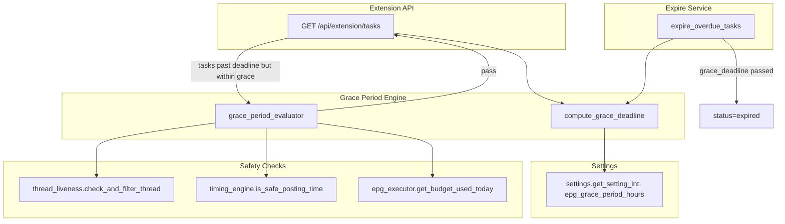

# Design Document — Extension Grace Period

## Overview

This design adds a configurable grace period to the Extension API, allowing overdue EPG tasks to remain available to executors for a window beyond the original deadline (default 3 hours). A new `grace_period_evaluator` service gates grace-period tasks through three safety checks (thread liveness, dangerous hours, daily budget) before exposing them. The expire service is updated to respect the extended deadline, and the API response is enriched with grace-period metadata and ordering.

## Architecture



### Key Decisions

1. **No new DB columns.** Grace deadline is computed at query time from `ExecutionTask.deadline` + system setting. This avoids a migration and keeps the setting dynamic.
2. **Safety checks only for grace-period tasks.** On-time tasks (before original deadline) are returned without additional checks, preserving current performance.
3. **Grace period evaluator is a pure service function** (not a class) — consistent with existing services like `timing_engine` and `thread_liveness`.
4. **Ordering is enforced in the SQL query**, not post-query sort, for efficiency.

## Components and Interfaces

### 1. `app/services/grace_period_evaluator.py` (NEW)

```python
"""Grace period evaluation for overdue EPG extension tasks.

Determines whether a task past its original deadline qualifies for
grace-period execution based on time window and safety conditions.
"""

import uuid
from datetime import datetime, timezone, timedelta

from sqlalchemy.orm import Session

from app.models.execution_task import ExecutionTask
from app.services.settings import get_setting_int
from app.services.timing_engine import is_safe_posting_time
from app.services.thread_liveness import check_and_filter_thread
from app.services.epg_executor import get_budget_used_today
from app.services.timing_engine import get_effective_daily_cap
from app.logging_config import get_logger

logger = get_logger(__name__)


def get_grace_period_hours(db: Session) -> int:
    """Read grace period duration from system settings.

    Returns:
        Integer hours (0 = disabled, default 3).
    """
    return get_setting_int(db, "epg_grace_period_hours", default=3)


def compute_grace_deadline(task: ExecutionTask, grace_hours: int) -> datetime:
    """Compute the grace deadline for a task.

    Args:
        task: The execution task with a deadline field.
        grace_hours: Hours to add beyond original deadline.

    Returns:
        datetime — original deadline + grace_hours.
    """
    return task.deadline + timedelta(hours=grace_hours)


def is_in_grace_period(task: ExecutionTask, grace_hours: int, now: datetime | None = None) -> bool:
    """Check if a task is within the grace period window.

    True when: original_deadline < now < grace_deadline.

    Args:
        task: The execution task.
        grace_hours: Configured grace period hours.
        now: Current time (defaults to utcnow).

    Returns:
        True if task is past deadline but within grace window.
    """
    if now is None:
        now = datetime.now(timezone.utc)
    if grace_hours <= 0:
        return False
    grace_deadline = compute_grace_deadline(task, grace_hours)
    return task.deadline < now < grace_deadline


def evaluate_safety_conditions(
    db: Session,
    task: ExecutionTask,
    now: datetime | None = None,
) -> tuple[bool, str | None]:
    """Run all three safety checks for a grace-period task.

    Checks:
        1. Thread liveness (not locked/removed/archived)
        2. Dangerous hours (current hour safe for subreddit)
        3. Daily budget (avatar not over cap)

    Args:
        db: Database session.
        task: The grace-period task to evaluate.
        now: Current time (for hour calculation).

    Returns:
        (passes, reason) — True if all pass, else (False, failure_reason).
    """
    if now is None:
        now = datetime.now(timezone.utc)

    # 1. Thread liveness
    if task.thread_id:
        from app.models.thread import RedditThread
        thread = db.query(RedditThread).filter(RedditThread.id == task.thread_id).first()
        if thread and not check_and_filter_thread(db, thread):
            return False, "thread_dead"
    
    # 2. Dangerous hours
    if task.subreddit:
        current_hour = now.hour
        if not is_safe_posting_time(task.subreddit, current_hour, db):
            return False, "dangerous_hours"

    # 3. Daily budget
    if task.avatar_id:
        from app.models.avatar import Avatar
        avatar = db.query(Avatar).filter(Avatar.id == task.avatar_id).first()
        if avatar:
            used_today = get_budget_used_today(db, task.avatar_id)
            effective_cap = get_effective_daily_cap(avatar)
            if used_today >= effective_cap:
                return False, "budget_exhausted"

    return True, None


def grace_period_remaining_minutes(task: ExecutionTask, grace_hours: int, now: datetime | None = None) -> int:
    """Compute remaining minutes in the grace period.

    Args:
        task: The execution task.
        grace_hours: Configured grace period hours.
        now: Current time.

    Returns:
        Remaining minutes (floored to integer, minimum 0).
    """
    if now is None:
        now = datetime.now(timezone.utc)
    grace_deadline = compute_grace_deadline(task, grace_hours)
    remaining = (grace_deadline - now).total_seconds() / 60
    return max(0, int(remaining))
```

### 2. Modifications to `app/routes/extension_api.py` — `get_tasks()`

The query filter changes from `ExecutionTask.deadline > now` to include tasks within the grace window. Grace-period tasks undergo safety evaluation before inclusion.

```python
# Key changes in get_tasks():

from app.services.grace_period_evaluator import (
    get_grace_period_hours,
    compute_grace_deadline,
    is_in_grace_period,
    evaluate_safety_conditions,
    grace_period_remaining_minutes,
)

# 1. Read grace period setting
grace_hours = get_grace_period_hours(db)
now = datetime.now(timezone.utc)

# 2. Expand deadline filter to include grace window
if grace_hours > 0:
    grace_cutoff = now - timedelta(hours=grace_hours)
    # Include tasks where: deadline > (now - grace_hours)
    # This captures both on-time AND grace-period tasks
    deadline_filter = sa.or_(
        ExecutionTask.deadline.is_(None),
        ExecutionTask.deadline > grace_cutoff,
    )
else:
    # Grace disabled — original behavior
    deadline_filter = sa.or_(
        ExecutionTask.deadline.is_(None),
        ExecutionTask.deadline > now,
    )

# 3. After query, filter grace-period tasks through safety checks
final_tasks = []
for task in tasks:
    if task.task_lifecycle_status == "ASSIGNED" and task.execution_node_id == node.id:
        # Already assigned to this node — skip re-evaluation
        final_tasks.append(task)
    elif task.deadline and task.deadline < now:
        # Past original deadline — this is a grace-period candidate
        if grace_hours <= 0:
            continue  # Grace disabled
        grace_deadline = compute_grace_deadline(task, grace_hours)
        if now >= grace_deadline:
            continue  # Past grace deadline
        passes, reason = evaluate_safety_conditions(db, task, now)
        if not passes:
            logger.debug("Grace task %s excluded: %s", task.task_code, reason)
            continue
        final_tasks.append(task)
    else:
        # On-time task — include directly
        final_tasks.append(task)

# 4. Order: on-time first, grace period second, diagnostic last
# (Applied via sort key in response building, not SQL for grace tasks)
```

### 3. Response Payload Enrichment

Each task in the response gains three new fields:

```python
{
    # ... existing fields ...
    "is_grace_period": bool,              # True if task is past original deadline
    "grace_period_remaining_minutes": int | None,  # Minutes until grace deadline (None if not in grace)
    "grace_deadline": str | None,         # ISO 8601 timestamp (None if not in grace)
}
```

### 4. Modifications to `app/services/execution_tasks.py` — `expire_overdue_tasks()`

```python
def expire_overdue_tasks(db: Session) -> int:
    """Transition overdue active tasks to expired.

    Respects grace period: tasks are not expired until grace_deadline passes.
    When epg_grace_period_hours = 0, original behavior preserved.
    """
    from app.services.grace_period_evaluator import get_grace_period_hours

    now = datetime.now(timezone.utc)
    grace_hours = get_grace_period_hours(db)
    active_statuses = ("generated", "emailed", "accepted")

    if grace_hours > 0:
        # Grace enabled: expire only tasks past grace deadline
        # grace_deadline = deadline + grace_hours
        # Task is expired when: deadline + grace_hours < now
        # i.e., deadline < now - grace_hours
        grace_cutoff = now - timedelta(hours=grace_hours)
        deadline_condition = ExecutionTask.deadline < grace_cutoff
    else:
        # Grace disabled: expire immediately after original deadline
        deadline_condition = ExecutionTask.deadline < now

    count = (
        db.query(ExecutionTask)
        .filter(
            ExecutionTask.status.in_(active_statuses),
            deadline_condition,
            ExecutionTask.submitted_url.is_(None),
        )
        .update(
            {
                "status": "expired",
                "status_changed_at": now,
            },
            synchronize_session="fetch",
        )
    )

    if count > 0:
        db.commit()
        logger.info("Expired %d overdue execution tasks (grace_hours=%d)", count, grace_hours)

    return count
```

### 5. System Setting Registration

Add to `DEFAULTS` in `app/services/settings.py`:

```python
"epg_grace_period_hours": {
    "value": "3",
    "secret": False,
    "desc": "Grace period hours added to EPG task deadline for extension. Tasks remain available this long past deadline if safety conditions pass. 0 = disabled.",
    "group": "email_tasks",
},
```

### 6. Response Ordering Logic

```python
def _task_sort_key(task: ExecutionTask, now: datetime, grace_hours: int) -> tuple:
    """Sort key: (order_bucket, scheduled_at).
    
    Buckets: 0=on-time content, 1=grace period content, 2=diagnostic
    """
    if task.priority == "diagnostic":
        return (2, task.scheduled_at or now)
    if task.deadline and task.deadline < now and grace_hours > 0:
        return (1, task.scheduled_at or now)
    return (0, task.scheduled_at or now)
```

## Data Models

No new database models or columns are required. The grace period is computed dynamically:

```
grace_deadline = ExecutionTask.deadline + timedelta(hours=epg_grace_period_hours)
```

### Existing Models Used

| Model | Fields Used | Purpose |
|-------|-------------|---------|
| `ExecutionTask` | `deadline`, `avatar_id`, `thread_id`, `subreddit`, `task_lifecycle_status`, `execution_node_id` | Task time window, safety check inputs |
| `SystemSetting` | `key="epg_grace_period_hours"` | Configurable grace window |
| `RedditThread` | `is_locked`, `reddit_native_id` | Thread liveness check |
| `SubredditRiskProfile` | `dangerous_hours` | Dangerous hours check |
| `Avatar` | `warming_phase` | Daily cap calculation |
| `EPGSlot` | via `get_budget_used_today` | Budget consumption count |

## Error Handling

| Failure | Behavior | Rationale |
|---------|----------|-----------|
| `epg_grace_period_hours` missing from DB | Default to 3 | Fail-open: grace period is beneficial to executors |
| Thread liveness API call fails (Reddit down) | Exclude task from grace response | Fail-closed for safety: if we can't verify, don't offer |
| `get_budget_used_today` raises exception | Exclude task from grace response | Fail-closed: protect against over-posting |
| `is_safe_posting_time` has no profile data | Pass (return True) | Existing fail-open behavior of timing_engine preserved |
| Grace period setting is negative | Treat as 0 (disabled) | Defensive: negative hours make no sense |
| Task has no `deadline` | Skip grace logic, include normally | Tasks without deadlines are not time-bounded |
| Task has no `thread_id` | Skip thread liveness check | CQS/diagnostic tasks may not have threads |
| Task has no `avatar_id` | Skip budget check | Should not happen in practice, defensive |

## Correctness Properties

*A property is a characteristic or behavior that should hold true across all valid executions of a system — essentially, a formal statement about what the system should do. Properties serve as the bridge between human-readable specifications and machine-verifiable correctness guarantees.*

### Property 1: Grace period inclusion requires safety pass

*For any* execution task where `original_deadline < now < grace_deadline` and all three safety conditions (thread alive, hour safe, budget available) evaluate to true, the task SHALL appear in the `get_tasks` response with `is_grace_period=true`.

**Validates: Requirements 2.1, 3.5**

### Property 2: Grace deadline is an absolute exclusion boundary

*For any* execution task where `now >= grace_deadline`, the task SHALL NOT appear in the `get_tasks` response, regardless of safety condition outcomes.

**Validates: Requirements 2.2**

### Property 3: Grace period flag correctness

*For any* task in the `get_tasks` response, `is_grace_period` SHALL be `true` if and only if `original_deadline < now < grace_deadline`. When `now <= original_deadline`, `is_grace_period` SHALL be `false`.

**Validates: Requirements 2.3, 2.4**

### Property 4: Thread liveness excludes grace tasks with dead threads

*For any* execution task in the grace period window where the associated thread is locked, removed, or archived, the task SHALL NOT appear in the `get_tasks` response.

**Validates: Requirements 3.1, 3.4**

### Property 5: Dangerous hours exclude grace tasks

*For any* execution task in the grace period window where the current UTC hour is in the `dangerous_hours` list for the task's subreddit, the task SHALL NOT appear in the `get_tasks` response.

**Validates: Requirements 3.2, 3.4**

### Property 6: Budget exhaustion excludes grace tasks

*For any* execution task in the grace period window where `get_budget_used_today(avatar_id) >= get_effective_daily_cap(avatar)`, the task SHALL NOT appear in the `get_tasks` response.

**Validates: Requirements 3.3, 3.4**

### Property 7: Expire service respects grace deadline

*For any* execution task in active status with `epg_grace_period_hours > 0`, the `expire_overdue_tasks` function SHALL transition the task to "expired" if and only if `now >= deadline + epg_grace_period_hours`. Tasks where `now < deadline + epg_grace_period_hours` SHALL NOT be expired.

**Validates: Requirements 4.1, 4.2, 4.3**

### Property 8: Grace metadata correctness

*For any* task in the response where `is_grace_period=true`, the field `grace_period_remaining_minutes` SHALL equal `floor((grace_deadline - now).total_seconds() / 60)` and `grace_deadline` SHALL equal `deadline + epg_grace_period_hours` formatted as ISO 8601.

**Validates: Requirements 5.1, 5.2**

### Property 9: Response ordering invariant

*For any* `get_tasks` response containing multiple tasks, all on-time content tasks (is_grace_period=false, priority≠diagnostic) SHALL appear before all grace-period tasks (is_grace_period=true), which SHALL appear before all diagnostic tasks (priority=diagnostic).

**Validates: Requirements 5.3**

## Testing Strategy

### Unit Tests (example-based)

| Test | Validates |
|------|-----------|
| `test_grace_setting_read_from_db` | 1.1 — configured value is used |
| `test_grace_setting_default_when_missing` | 1.2 — default 3 hours |
| `test_grace_disabled_when_zero` | 1.3 — tasks past deadline excluded |
| `test_assigned_task_skips_safety_recheck` | 6.2 — no re-evaluation once assigned |
| `test_lease_expiry_triggers_safety_recheck` | 6.3 — re-evaluation after lease expiry |
| `test_standard_lifecycle_after_accept` | 6.1 — normal transitions |

### Property Tests (100+ iterations each)

| Property | Generator Strategy |
|----------|-------------------|
| P1: Grace inclusion | Random tasks with deadline 1-180 min ago, grace_hours 1-6, all safety mocked True |
| P2: Grace deadline exclusion | Random tasks with grace deadline in the past (1 min to 24h ago) |
| P3: Flag correctness | Random tasks at various time offsets vs deadline, check flag matches window |
| P4: Thread liveness | Random tasks in grace window, thread locked=True → excluded |
| P5: Dangerous hours | Random subreddits with random dangerous_hours, current hour in list → excluded |
| P6: Budget exhaustion | Random avatars with budget_used >= cap → excluded |
| P7: Expire respects grace | Random tasks at various time offsets vs grace_deadline, verify expire behavior |
| P8: Metadata correctness | Random grace tasks, verify computed remaining_minutes and grace_deadline |
| P9: Ordering | Random mixed lists of on-time + grace + diagnostic tasks, verify sort order |

### Integration Tests

| Test | What it verifies |
|------|-----------------|
| `test_get_tasks_includes_grace_period_tasks` | Full endpoint flow with grace-period task returned |
| `test_get_tasks_excludes_past_grace` | Endpoint excludes tasks past grace deadline |
| `test_expire_job_respects_grace` | Celery-compatible expire function with grace setting |
