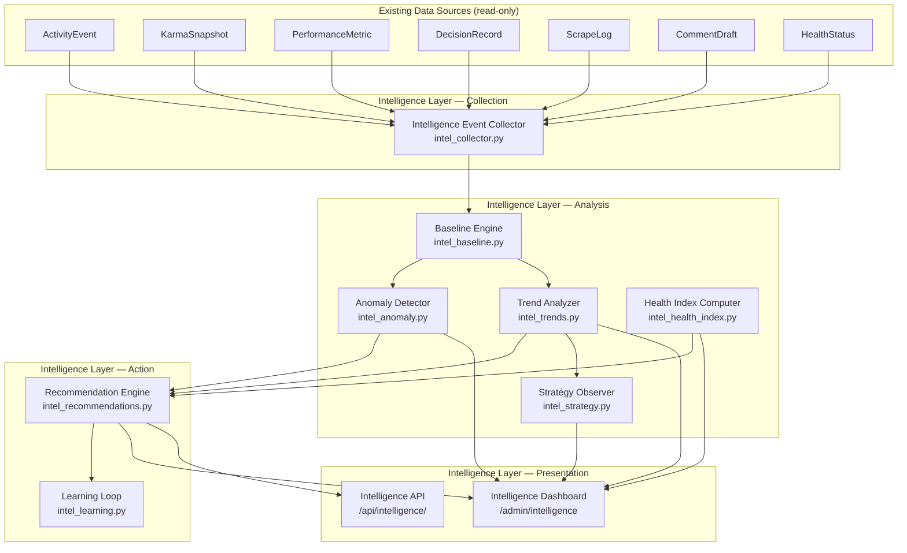

# Design Document: RAMP Intelligence Layer

## Overview

The Intelligence Layer is an analytical subsystem that aggregates data from existing RAMP systems (ActivityEvent, KarmaSnapshot, PerformanceMetric, DecisionRecord, ScrapeLog, etc.), computes statistical baselines, detects anomalies, identifies trends, generates strategic observations, and produces actionable recommendations with a self-improving learning loop.

**Key architectural principle**: The Intelligence Layer is a *read-heavy analytics layer* that sits on top of existing operational data. It does NOT modify upstream systems or interfere with pipeline execution. It consumes data produced by existing models and emits insights consumed by operators via a dashboard and API.

**Design decisions**:
- All intelligence computation runs in Celery tasks (async, non-blocking to main app)
- Anomaly detection uses statistical methods (z-scores), not LLM calls — keeps costs at zero
- Strategic observations use LLM summarization (Gemini Flash) only for the weekly synthesis — cheap and bounded
- The system uses existing ActivityEvent, KarmaSnapshot, and PerformanceMetric tables as data sources — no duplication
- Intelligence_Events extend the existing event model pattern with a dedicated table for richer payloads
- Recommendations are append-only with status transitions — never deleted, always auditable



## Architecture

### System Context

The Intelligence Layer integrates into the existing Celery Beat schedule. Intelligence tasks run during the early morning hours (03:00-04:30) when pipeline load is minimal. The anomaly detection task runs every 4 hours, aligned with the existing `snapshot_comment_outcomes` schedule.

All intelligence services follow the existing pattern: thin service modules in `app/services/intelligence/`, Celery tasks in `app/tasks/intelligence.py`, routes in `app/routes/intelligence.py`, and templates in `app/templates/admin_intelligence*.html`.

### Data Flow

```
Existing Systems → Intelligence Events → Baselines → Anomalies → Recommendations → Learning Loop
                                       → Trends    → Strategic Observations ↗
                                       → Health Index ↗
```

### Component Architecture

```mermaid
flowchart LR
    subgraph "Services (app/services/intelligence/)"
        COLL[intel_collector.py]
        BASE[intel_baseline.py]
        ANOM[intel_anomaly.py]
        TREND[intel_trends.py]
        STRAT[intel_strategy.py]
        HEALTH[intel_health_index.py]
        RECO[intel_recommendations.py]
        LEARN[intel_learning.py]
        QUERY[intel_query.py]
    end

    subgraph "Models (app/models/intelligence/)"
        M_EVT[IntelligenceEvent]
        M_BL[MetricBaseline]
        M_ANOM[IntelligenceAnomaly]
        M_TREND[MetricTrend]
        M_OBS[StrategicObservation]
        M_RECO[IntelligenceRecommendation]
        M_OUT[RecommendationOutcome]
        M_HI[AvatarHealthScore]
    end

    subgraph "Tasks (app/tasks/intelligence.py)"
        T_BL[compute_baselines]
        T_ANOM[detect_anomalies]
        T_TREND[analyze_trends]
        T_STRAT[generate_observations]
        T_LEARN[process_learning_loop]
        T_ARCH[archive_intelligence_data]
    end
end
```

## Database Schema

### New Tables

#### intelligence_events
```sql
CREATE TABLE intelligence_events (
    id UUID PRIMARY KEY DEFAULT gen_random_uuid(),
    client_id UUID REFERENCES clients(id),
    avatar_id UUID REFERENCES avatars(id),
    event_category VARCHAR(50) NOT NULL,  -- pipeline, review, karma, health, strategy
    event_type VARCHAR(100) NOT NULL,     -- scrape_completed, draft_approved, karma_observed, etc.
    payload JSONB NOT NULL DEFAULT '{}',
    created_at TIMESTAMPTZ NOT NULL DEFAULT now()
);

CREATE INDEX ix_intel_events_category_created ON intelligence_events(event_category, created_at);
CREATE INDEX ix_intel_events_client_created ON intelligence_events(client_id, created_at);
CREATE INDEX ix_intel_events_avatar_created ON intelligence_events(avatar_id, created_at);
```

#### metric_baselines
```sql
CREATE TABLE metric_baselines (
    id UUID PRIMARY KEY DEFAULT gen_random_uuid(),
    entity_type VARCHAR(30) NOT NULL,  -- avatar, client, platform
    entity_id UUID,                     -- NULL for platform-wide
    metric_name VARCHAR(100) NOT NULL,
    window_start DATE NOT NULL,
    window_end DATE NOT NULL,
    mean FLOAT NOT NULL,
    stddev FLOAT NOT NULL,
    trend_direction VARCHAR(20) NOT NULL,  -- improving, declining, stable
    trend_magnitude FLOAT NOT NULL DEFAULT 0.0,
    sample_count INTEGER NOT NULL,
    status VARCHAR(30) NOT NULL DEFAULT 'active',  -- active, insufficient_data
    computed_at TIMESTAMPTZ NOT NULL DEFAULT now()
);

CREATE UNIQUE INDEX uq_baseline_entity_metric ON metric_baselines(entity_type, entity_id, metric_name, window_end);
CREATE INDEX ix_baselines_entity ON metric_baselines(entity_type, entity_id);
```

#### intelligence_anomalies
```sql
CREATE TABLE intelligence_anomalies (
    id UUID PRIMARY KEY DEFAULT gen_random_uuid(),
    entity_type VARCHAR(30) NOT NULL,
    entity_id UUID NOT NULL,
    metric_name VARCHAR(100) NOT NULL,
    observed_value FLOAT NOT NULL,
    expected_mean FLOAT NOT NULL,
    expected_stddev FLOAT NOT NULL,
    deviation_sigma FLOAT NOT NULL,
    severity VARCHAR(20) NOT NULL,  -- warning, critical
    explanation TEXT NOT NULL,
    cluster_id UUID,
    consecutive_count INTEGER NOT NULL DEFAULT 1,
    detected_at TIMESTAMPTZ NOT NULL DEFAULT now(),
    resolved_at TIMESTAMPTZ
);

CREATE INDEX ix_anomalies_entity_detected ON intelligence_anomalies(entity_type, entity_id, detected_at);
CREATE INDEX ix_anomalies_severity ON intelligence_anomalies(severity, detected_at);
CREATE INDEX ix_anomalies_cluster ON intelligence_anomalies(cluster_id);
```

#### metric_trends
```sql
CREATE TABLE metric_trends (
    id UUID PRIMARY KEY DEFAULT gen_random_uuid(),
    entity_type VARCHAR(30) NOT NULL,
    entity_id UUID NOT NULL,
    metric_name VARCHAR(100) NOT NULL,
    window_days INTEGER NOT NULL,  -- 7 or 30
    direction VARCHAR(20) NOT NULL,  -- improving, declining, stable
    magnitude FLOAT NOT NULL,
    acceleration FLOAT NOT NULL DEFAULT 0.0,
    confidence FLOAT NOT NULL,
    classification VARCHAR(20) NOT NULL,  -- emerging, established, none
    consecutive_days INTEGER NOT NULL DEFAULT 0,
    threshold_warning JSONB,  -- {threshold_name, current_value, threshold_value, estimated_days_to_breach}
    computed_at TIMESTAMPTZ NOT NULL DEFAULT now()
);

CREATE UNIQUE INDEX uq_trend_entity_metric_window ON metric_trends(entity_type, entity_id, metric_name, window_days);
CREATE INDEX ix_trends_classification ON metric_trends(classification, computed_at);
```

#### strategic_observations
```sql
CREATE TABLE strategic_observations (
    id UUID PRIMARY KEY DEFAULT gen_random_uuid(),
    client_id UUID REFERENCES clients(id),
    observation_type VARCHAR(50) NOT NULL,  -- subreddit_comparison, approach_performance, avatar_fit, competitor_correlation, pain_point_ranking
    entity_scope JSONB NOT NULL,  -- {client_id, subreddit, avatar_id, etc.}
    finding TEXT NOT NULL,
    supporting_data JSONB NOT NULL DEFAULT '{}',
    confidence FLOAT NOT NULL,
    actionability_score FLOAT NOT NULL,
    generated_at TIMESTAMPTZ NOT NULL DEFAULT now()
);

CREATE INDEX ix_observations_client_type ON strategic_observations(client_id, observation_type);
CREATE INDEX ix_observations_generated ON strategic_observations(generated_at);
```

#### intelligence_recommendations
```sql
CREATE TABLE intelligence_recommendations (
    id UUID PRIMARY KEY DEFAULT gen_random_uuid(),
    client_id UUID REFERENCES clients(id),
    recommendation_type VARCHAR(50) NOT NULL,  -- respond, ignore, monitor, change_strategy, expand_monitoring, reduce_activity, adjust_targeting
    target_entity_type VARCHAR(30) NOT NULL,
    target_entity_id UUID NOT NULL,
    reasoning TEXT NOT NULL,
    confidence INTEGER NOT NULL CHECK (confidence BETWEEN 0 AND 100),
    expected_impact JSONB NOT NULL DEFAULT '{}',
    urgency VARCHAR(20) NOT NULL,  -- low, medium, high, critical
    status VARCHAR(20) NOT NULL DEFAULT 'pending',  -- pending, accepted, rejected, deferred, expired
    source_anomaly_id UUID REFERENCES intelligence_anomalies(id),
    source_trend_id UUID REFERENCES metric_trends(id),
    source_observation_id UUID REFERENCES strategic_observations(id),
    decided_at TIMESTAMPTZ,
    decided_by UUID REFERENCES users(id),
    operator_notes TEXT,
    created_at TIMESTAMPTZ NOT NULL DEFAULT now(),
    expires_at TIMESTAMPTZ
);

CREATE INDEX ix_recommendations_client_status ON intelligence_recommendations(client_id, status);
CREATE INDEX ix_recommendations_urgency ON intelligence_recommendations(urgency, created_at);
CREATE INDEX ix_recommendations_type ON intelligence_recommendations(recommendation_type, status);
```

#### recommendation_outcomes
```sql
CREATE TABLE recommendation_outcomes (
    id UUID PRIMARY KEY DEFAULT gen_random_uuid(),
    recommendation_id UUID NOT NULL REFERENCES intelligence_recommendations(id),
    observation_start TIMESTAMPTZ NOT NULL,
    observation_end TIMESTAMPTZ NOT NULL,
    expected_metrics JSONB NOT NULL DEFAULT '{}',
    actual_metrics JSONB NOT NULL DEFAULT '{}',
    outcome_score FLOAT,
    success BOOLEAN,
    computed_at TIMESTAMPTZ
);

CREATE UNIQUE INDEX uq_outcome_recommendation ON recommendation_outcomes(recommendation_id);
```

#### avatar_health_scores
```sql
CREATE TABLE avatar_health_scores (
    id UUID PRIMARY KEY DEFAULT gen_random_uuid(),
    avatar_id UUID NOT NULL REFERENCES avatars(id),
    score_date DATE NOT NULL,
    health_index INTEGER NOT NULL CHECK (health_index BETWEEN 0 AND 100),
    karma_component FLOAT NOT NULL,
    removal_component FLOAT NOT NULL,
    consistency_component FLOAT NOT NULL,
    compatibility_component FLOAT NOT NULL,
    age_component FLOAT NOT NULL,
    computed_at TIMESTAMPTZ NOT NULL DEFAULT now()
);

CREATE UNIQUE INDEX uq_health_avatar_date ON avatar_health_scores(avatar_id, score_date);
CREATE INDEX ix_health_score ON avatar_health_scores(health_index);
```

#### intelligence_event_summaries (archival)
```sql
CREATE TABLE intelligence_event_summaries (
    id UUID PRIMARY KEY DEFAULT gen_random_uuid(),
    summary_date DATE NOT NULL,
    client_id UUID REFERENCES clients(id),
    event_category VARCHAR(50) NOT NULL,
    event_count INTEGER NOT NULL,
    avg_payload_values JSONB NOT NULL DEFAULT '{}',
    created_at TIMESTAMPTZ NOT NULL DEFAULT now()
);

CREATE UNIQUE INDEX uq_summary_date_client_category ON intelligence_event_summaries(summary_date, client_id, event_category);
```

## Service Layer Design

### intel_collector.py — Event Collection

```python
# Core function signatures
def record_pipeline_event(db: Session, *, operation: str, avatar_id: UUID, client_id: UUID,
                          duration_ms: int, input_count: int, output_count: int, status: str) -> None
def record_review_event(db: Session, *, draft_id: UUID, decision: str, avatar_id: UUID,
                        client_id: UUID, latency_seconds: float, edit_distance: int | None) -> None
def record_karma_event(db: Session, *, snapshot: KarmaSnapshot, approach: str | None) -> None
def record_health_event(db: Session, *, avatar_id: UUID, client_id: UUID, old_state: str,
                        new_state: str, trigger: str, signals: dict) -> None
```

Integration points:
- Hook into `app/services/transparency.py::record_activity_event()` — add intelligence event alongside
- Hook into `app/routes/review.py` — record review decisions
- Hook into `app/tasks/snapshot_outcomes.py` — record karma observations
- Hook into `app/services/karma_feedback.py` — record health state changes

### intel_baseline.py — Baseline Computation

```python
def compute_baselines_for_entity(db: Session, entity_type: str, entity_id: UUID | None) -> list[MetricBaseline]
def compute_all_baselines(db: Session) -> dict[str, int]  # returns counts per entity_type
def get_baseline(db: Session, entity_type: str, entity_id: UUID | None, metric_name: str) -> MetricBaseline | None
```

Algorithm:
1. Query last 30 days of metric data from intelligence_events (aggregated per day)
2. Apply exponential decay: weight = exp(-lambda * days_ago), lambda = 0.1
3. Compute weighted mean and weighted standard deviation
4. Determine trend: linear regression on the 30-day series → slope sign = direction, |slope| = magnitude
5. If sample_count < 7: mark as insufficient_data

Tracked dimensions (from existing data):
- `karma_per_comment` — from KarmaSnapshot aggregated per avatar per day
- `removal_rate` — from CommentDraft.is_deleted aggregated per avatar per day
- `approval_rate` — from CommentDraft status transitions per client per day
- `engagement_velocity` — from KarmaSnapshot karma_delta / hours_since_posting
- `posting_frequency` — from PostingEvent count per avatar per day
- `subreddit_response_rate` — from opportunity selection vs available per subreddit
- `review_latency` — from CommentDraft (approved_at - created_at) per client per day

### intel_anomaly.py — Anomaly Detection

```python
def detect_anomalies(db: Session) -> list[IntelligenceAnomaly]
def check_metric_for_anomaly(db: Session, entity_type: str, entity_id: UUID,
                              metric_name: str, current_value: float) -> IntelligenceAnomaly | None
def cluster_anomalies(db: Session, new_anomalies: list[IntelligenceAnomaly]) -> None
def escalate_persistent_anomalies(db: Session) -> int
def resolve_anomaly(db: Session, anomaly_id: UUID) -> None
```

Algorithm:
1. For each entity+metric, get current baseline
2. Compute current metric value from recent data (last measurement period)
3. z-score = (observed - mean) / stddev
4. If |z-score| > 2: create warning anomaly
5. If |z-score| > 3: create critical anomaly
6. Group by (entity, 24h window) → assign cluster_id
7. For persisted anomalies: if same entity+metric exists unresolved for 3+ periods → escalate

### intel_trends.py — Trend Analysis

```python
def analyze_trends(db: Session) -> list[MetricTrend]
def compute_trend_vector(values: list[float], window_days: int) -> dict
def check_threshold_intersection(db: Session, trend: MetricTrend) -> dict | None
```

Algorithm:
1. For each entity+metric: get daily values for 7d and 30d windows
2. Compute direction: if last 5+ points move same direction → "emerging"; if 14+ days → "established"
3. Magnitude: (last_value - first_value) / first_value * 100
4. Acceleration: second derivative of the series (rate of change of rate)
5. Threshold check: extrapolate trend line → if intersects known threshold within 14 days → generate warning

### intel_health_index.py — Avatar Health Index

```python
def compute_health_index(db: Session, avatar: Avatar) -> AvatarHealthScore
def compute_all_health_indices(db: Session) -> list[AvatarHealthScore]
```

Components (each normalized to 0-100):
1. **Karma trajectory (25%)**: recent 14d avg karma per comment, normalized against platform average
2. **Removal rate (25%)**: inverse of (removed / total) in last 14 days, scaled 0-100
3. **Posting consistency (15%)**: coefficient of variation of daily post count (lower = more consistent = higher score)
4. **Subreddit compatibility (20%)**: weighted average of per-subreddit karma, weighted by activity frequency
5. **Account age signals (15%)**: combination of Reddit account age, total karma, and warming phase progress

Final score: sum of (component_score * weight) for each component, clamped to [0, 100]

### intel_recommendations.py — Recommendation Engine

```python
def generate_recommendations(db: Session) -> list[IntelligenceRecommendation]
def act_on_recommendation(db: Session, recommendation_id: UUID, user_id: UUID,
                           decision: str, notes: str | None) -> IntelligenceRecommendation
def expire_stale_recommendations(db: Session) -> int
def get_pending_count(db: Session, client_id: UUID) -> int
```

Recommendation generation rules:
- Anomaly (critical) → urgency=high, type varies by metric (removal_rate→reduce_activity, karma→change_strategy)
- Anomaly (warning, persisted) → urgency=medium, type=monitor
- Trend (declining, approaching threshold) → urgency=high, type=change_strategy or reduce_activity
- Health Index < 40 → urgency=medium, type=reduce_activity
- Health Index < 20 → urgency=critical, type=reduce_activity (freeze recommendation)
- Strategic observation (high actionability) → urgency=low, type=adjust_targeting or expand_monitoring

Cap enforcement: before inserting, check pending count for client. If >= 10, only insert if urgency >= existing minimum urgency (replace lowest priority).

### intel_learning.py — Learning Loop

```python
def start_outcome_tracking(db: Session, recommendation_id: UUID) -> RecommendationOutcome
def close_observation_windows(db: Session) -> int
def compute_recommendation_accuracy(db: Session, recommendation_type: str, window_days: int = 30) -> float
def adjust_confidence_multipliers(db: Session) -> dict[str, float]
```

Algorithm:
1. When recommendation is accepted: create outcome record with observation_start=now, observation_end=now+7d, expected_metrics from recommendation.expected_impact
2. Daily task checks for outcomes past observation_end that haven't been computed
3. For each: query actual metrics (karma, removal rate, engagement) during observation window
4. outcome_score = actual vs expected comparison (percentage achievement)
5. success = outcome_score >= 0.8 (80% of expected impact achieved)
6. Accuracy per type: count(success=True) / count(all outcomes) in last 30 days

### intel_strategy.py — Strategic Observations (LLM-assisted)

```python
def generate_weekly_observations(db: Session) -> list[StrategicObservation]
def compare_subreddit_performance(db: Session, client_id: UUID) -> StrategicObservation
def analyze_approach_effectiveness(db: Session, client_id: UUID) -> StrategicObservation
def analyze_avatar_subreddit_fit(db: Session, client_id: UUID) -> StrategicObservation
def correlate_competitor_presence(db: Session, client_id: UUID) -> StrategicObservation | None
def rank_pain_points(db: Session, client_id: UUID) -> StrategicObservation
```

Uses Gemini Flash for synthesis (low cost):
- Input: aggregated metrics data per subreddit/approach/avatar (structured JSON)
- Output: natural language finding + confidence + actionability score
- Prompt template: "Given this performance data for client X, summarize the key finding about [dimension]"
- Cost estimate: ~5 calls per client per week × $0.0003/call = negligible

### intel_query.py — Query Service

```python
def get_anomalies(db: Session, *, entity_type: str | None, entity_id: UUID | None,
                  severity: str | None, time_range: tuple[datetime, datetime] | None,
                  limit: int = 20, after_id: UUID | None = None) -> list[IntelligenceAnomaly]
def get_trends(db: Session, *, entity_type: str | None, entity_id: UUID | None,
               metric_name: str | None, limit: int = 20) -> list[MetricTrend]
def get_recommendations(db: Session, *, client_id: UUID | None, entity_type: str | None,
                        entity_id: UUID | None, status: str | None,
                        limit: int = 20, after_id: UUID | None = None) -> list[IntelligenceRecommendation]
def get_health_index(db: Session, avatar_id: UUID) -> AvatarHealthScore | None
def get_health_history(db: Session, avatar_id: UUID, days: int = 30) -> list[AvatarHealthScore]
def get_strategic_observations(db: Session, client_id: UUID, observation_type: str | None,
                               limit: int = 10) -> list[StrategicObservation]
def get_dashboard_summary(db: Session, client_id: UUID | None) -> dict
```

## Celery Beat Schedule Integration

New tasks added to the schedule:

| Time | Task | Purpose |
|------|------|---------|
| 03:00 | `compute_intelligence_baselines` | Recompute all metric baselines |
| 03:30 | `analyze_intelligence_trends` | Compute 7d and 30d trend vectors |
| every 4h at :50 | `detect_intelligence_anomalies` | Run anomaly detection + clustering |
| 04:00 Mon | `generate_strategic_observations` | Weekly strategic synthesis per client |
| 04:00 | `process_intelligence_learning` | Close observation windows + compute outcomes |
| 04:30 | `compute_avatar_health_indices` | Daily health index computation |
| 02:00 Sun | `archive_intelligence_data` | Weekly archival of old events |

## Route Design

### Admin Dashboard Route

```
GET /admin/intelligence                    → main intelligence dashboard page
GET /admin/intelligence/anomalies          → HTMX partial: anomaly list (filterable)
GET /admin/intelligence/trends             → HTMX partial: trend summary
GET /admin/intelligence/observations       → HTMX partial: strategic observations
GET /admin/intelligence/recommendations    → HTMX partial: recommendation list
GET /admin/intelligence/recommendations/{id} → HTMX partial: recommendation detail
POST /admin/intelligence/recommendations/{id}/decide → Accept/reject/defer action
GET /admin/intelligence/health             → HTMX partial: avatar health overview
GET /admin/intelligence/learning           → HTMX partial: learning loop stats
```

### API Routes

```
GET /api/intelligence/anomalies            → JSON: anomalies (paginated)
GET /api/intelligence/trends               → JSON: trends (paginated)
GET /api/intelligence/recommendations      → JSON: recommendations (paginated)
GET /api/intelligence/health/{avatar_id}   → JSON: avatar health index + history
GET /api/intelligence/observations         → JSON: strategic observations (paginated)
GET /api/intelligence/summary              → JSON: dashboard summary
```

## RBAC Integration

- Admin dashboard (`/admin/intelligence/*`): requires `require_platform_admin` (owner/partner only)
- API endpoints (`/api/intelligence/*`): requires authentication, scoped by `query_scope` (client users see only their own data)
- Recommendation decisions: requires `require_platform_admin` or `client_admin`

## File Structure

```
app/
├── models/intelligence/
│   ├── __init__.py
│   ├── intelligence_event.py
│   ├── metric_baseline.py
│   ├── intelligence_anomaly.py
│   ├── metric_trend.py
│   ├── strategic_observation.py
│   ├── intelligence_recommendation.py
│   ├── recommendation_outcome.py
│   ├── avatar_health_score.py
│   └── intelligence_event_summary.py
├── services/intelligence/
│   ├── __init__.py
│   ├── intel_collector.py
│   ├── intel_baseline.py
│   ├── intel_anomaly.py
│   ├── intel_trends.py
│   ├── intel_health_index.py
│   ├── intel_recommendations.py
│   ├── intel_learning.py
│   ├── intel_strategy.py
│   └── intel_query.py
├── tasks/
│   └── intelligence.py
├── routes/
│   └── intelligence.py
└── templates/
    ├── admin_intelligence.html
    └── partials/
        ├── intelligence_anomalies.html
        ├── intelligence_trends.html
        ├── intelligence_observations.html
        ├── intelligence_recommendations.html
        ├── intelligence_recommendation_detail.html
        ├── intelligence_health.html
        └── intelligence_learning.html
```

## Correctness Properties

### Property 1: Baseline Statistical Validity
For any set of metric values, the computed baseline mean and stddev SHALL satisfy: mean equals the weighted average of all values with exponential decay, and stddev equals the weighted standard deviation. Round-trip: applying the formula twice with the same data produces identical results.

### Property 2: Anomaly Detection Symmetry
For any metric value V and baseline (mean, stddev): if |V - mean| / stddev > 2, an anomaly is detected. The detection function is deterministic — same inputs always produce same severity classification.

### Property 3: Trend Direction Consistency
For any monotonically increasing sequence of 5+ values, the trend direction SHALL be "improving" (for positive metrics) or "declining" (for negative metrics like removal_rate). The classification is invariant to uniform scaling of the values.

### Property 4: Recommendation Cap Enforcement
For any client, the number of recommendations with status "pending" SHALL never exceed 10. If a new recommendation would breach the cap, the lowest-priority recommendation is expired.

### Property 5: Learning Loop Completeness
For any accepted recommendation: exactly one outcome record is created, observation_end equals observation_start + 7 days, and outcome_score is computed after observation_end passes.

### Property 6: Health Index Bounds
For any combination of component scores: the final Avatar_Health_Index is always in [0, 100]. Each component contributes exactly its specified weight percentage to the total.

### Property 7: Archival Data Preservation
For any day of intelligence events: after archival, the summary table contains the exact event count and correct aggregated averages for that day. No data loss in the aggregation.
