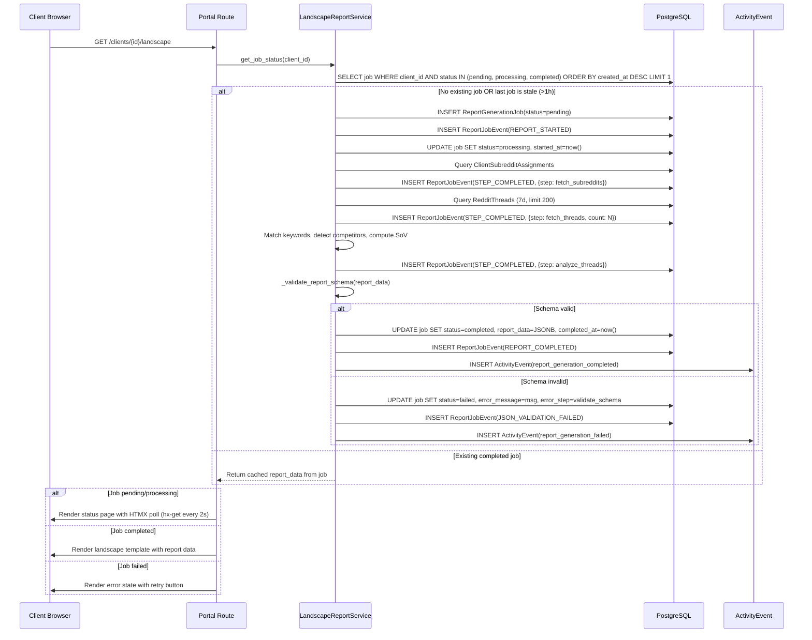
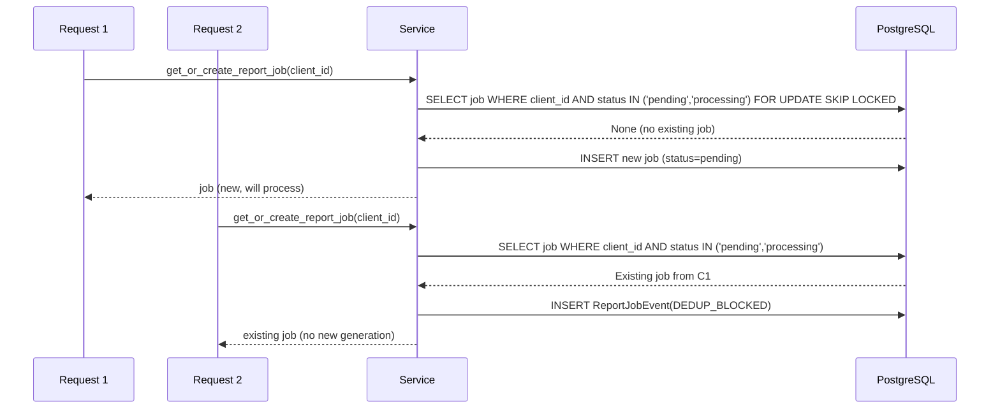

# Landscape Report Observability Bugfix Design

## Overview

The Landscape Report generation (`app/services/onboarding/landscape_report.py`) operates as a fire-and-forget synchronous call with zero observability. When called from the client portal (`/clients/{id}/landscape`) or during onboarding, failures are swallowed silently, generation duration is unknown, and clients see blank/broken pages on failure. This fix introduces a `ReportGenerationJob` entity with full lifecycle tracking, a `ReportJobEvent` model for audit logging, JSON schema validation before publish, deduplication logic, and client-facing status display via HTMX polling.

## Glossary

- **Bug_Condition (C)**: Report generation is initiated (via portal or onboarding) AND no tracking, cost logging, status display, validation, or deduplication exists
- **Property (P)**: Every report generation is tracked via a job entity, emits lifecycle events, validates output schema, displays status to client, and prevents duplicate concurrent jobs
- **Preservation**: Existing report generation logic (thread scanning, keyword matching, competitor detection, share-of-voice calculation) must produce identical output
- **`generate_landscape_report()`**: The function in `app/services/onboarding/landscape_report.py` that queries threads, matches keywords, and assembles the report dict
- **ReportGenerationJob**: New entity tracking the full lifecycle of a single report generation attempt
- **ReportJobEvent**: Append-only audit log of state transitions for a job

## Bug Details

### Bug Condition

The bug manifests when a Landscape Report generation is initiated from any trigger (portal page load, onboarding completion). The current implementation has no job entity, no lifecycle events, no AI cost hooks, no client-facing status, no JSON validation, and no deduplication.

**Formal Specification:**
```
FUNCTION isBugCondition(input)
  INPUT: input of type ReportGenerationRequest (client_id, trigger_source)
  OUTPUT: boolean
  
  RETURN report_generation_initiated(input.client_id)
         AND NOT job_entity_exists_for_generation(input.client_id)
         AND NOT lifecycle_events_emitted()
         AND NOT client_status_displayed()
END FUNCTION
```

### Examples

- Client navigates to `/clients/{id}/landscape` → report generates in 2-5 seconds → if DB query fails midway, client sees empty page with no error message
- During onboarding step 6 activation, landscape report is generated → if it hangs (slow DB, large dataset), onboarding appears stuck with no progress indicator
- Client refreshes landscape page 3 times rapidly → 3 parallel generations execute with no awareness of each other
- Report generates successfully but returns malformed data (e.g., missing `share_of_voice` key) → template renders partial/broken content

## Expected Behavior

### Preservation Requirements

**Unchanged Behaviors:**
- The report content structure MUST remain identical: `subreddits_monitored`, `threads_found`, `threads_relevant`, `competitor_mentions`, `high_intent_threads`, `brand_absent_threads`, `sample_drafts`, `share_of_voice`
- Keyword matching logic (high/medium/low tier extraction) must produce same results
- Competitor extraction from `competitive_landscape` text must produce same results
- Thread query (7-day window, ordered by ups DESC, limit 200) must produce same results
- Portal route `/clients/{id}/landscape` must continue to render the landscape template
- Empty/minimal report for clients with no subreddits or no threads must still return gracefully

**Scope:**
All inputs that do NOT involve report generation initiation are completely unaffected. This includes:
- Reading existing cached reports (when job is already `completed`)
- All other portal routes and onboarding steps
- ActivityEvent logging for other pipeline stages
- Client subreddit/keyword CRUD operations

## Hypothesized Root Cause

Based on the bug description, the architectural gaps are:

1. **No Job Entity**: `generate_landscape_report()` is a pure function that returns a dict. No database record tracks that a generation was attempted, is in progress, or failed.

2. **No Lifecycle Instrumentation**: The function has a single `logger.info()` at the end. No structured events for start, step completion, failure, or duration.

3. **No Client-Facing Status**: The portal route calls `generate_landscape_report()` synchronously and renders whatever comes back. No loading state, no error state, no retry mechanism.

4. **No Output Validation**: The returned dict is passed directly to the template. If any key is missing or has wrong type, the template breaks silently.

5. **No Deduplication**: Each page load triggers a fresh generation. No check for existing pending/processing jobs.

6. **No AI Cost Hooks**: The `sample_drafts` field is currently empty (phase 2 placeholder), but when LLM calls are added, there's no infrastructure to log costs via `call_llm()` + `log_ai_usage()`.

## Correctness Properties

Property 1: Bug Condition - Report Generation Creates Tracked Job

_For any_ report generation request where a client_id is valid and no pending/processing job exists, the fixed `generate_landscape_report()` SHALL create a `ReportGenerationJob` entity, record timestamps at each step, emit lifecycle events, validate the output JSON schema, and only mark the job `completed` after successful validation and persistence.

**Validates: Requirements 2.1, 2.4, 2.5**

Property 2: Preservation - Report Content Unchanged

_For any_ report generation request where the bug condition does NOT hold (job tracking already exists), the fixed code SHALL produce the same report data structure and content as the original function, preserving keyword matching, competitor detection, thread scoring, and share-of-voice calculation identically.

**Validates: Requirements 3.1, 3.2, 3.3, 3.4, 3.5**

## Fix Implementation

### Data Model

#### ReportGenerationJob

```python
class ReportGenerationJob(Base):
    __tablename__ = "report_generation_jobs"

    id: Mapped[uuid.UUID] = mapped_column(UUID(as_uuid=True), primary_key=True, default=uuid.uuid4)
    client_id: Mapped[uuid.UUID] = mapped_column(UUID(as_uuid=True), ForeignKey("clients.id", ondelete="CASCADE"), nullable=False)
    onboarding_id: Mapped[uuid.UUID | None] = mapped_column(UUID(as_uuid=True), nullable=True)  # NULL for portal-triggered

    # Status lifecycle: pending → processing → completed | failed
    status: Mapped[str] = mapped_column(String(30), nullable=False, default="pending")
    
    # Timing
    started_at: Mapped[datetime | None] = mapped_column(DateTime(timezone=True), nullable=True)
    completed_at: Mapped[datetime | None] = mapped_column(DateTime(timezone=True), nullable=True)

    # Error tracking
    error_message: Mapped[str | None] = mapped_column(Text, nullable=True)
    error_step: Mapped[str | None] = mapped_column(String(100), nullable=True)  # e.g., "fetch_threads", "match_keywords", "validate_schema"

    # AI cost tracking (for future sample_drafts LLM calls)
    tokens_input: Mapped[int] = mapped_column(Integer, nullable=False, default=0)
    tokens_output: Mapped[int] = mapped_column(Integer, nullable=False, default=0)
    ai_cost: Mapped[float] = mapped_column(Float, nullable=False, default=0.0)

    # Report data (immutable after completion)
    report_data: Mapped[dict | None] = mapped_column(JSONB, nullable=True)

    # Metadata
    triggered_by: Mapped[str] = mapped_column(String(50), nullable=False, default="portal")  # portal | onboarding | manual
    created_at: Mapped[datetime] = mapped_column(DateTime(timezone=True), server_default=func.now())
    updated_at: Mapped[datetime] = mapped_column(DateTime(timezone=True), server_default=func.now(), onupdate=func.now())

    # Indexes
    __table_args__ = (
        Index("ix_report_gen_jobs_client_status", "client_id", "status"),
        Index("ix_report_gen_jobs_created", "created_at"),
    )
```

#### ReportJobEvent

```python
class ReportJobEvent(Base):
    __tablename__ = "report_job_events"

    id: Mapped[uuid.UUID] = mapped_column(UUID(as_uuid=True), primary_key=True, default=uuid.uuid4)
    job_id: Mapped[uuid.UUID] = mapped_column(UUID(as_uuid=True), ForeignKey("report_generation_jobs.id", ondelete="CASCADE"), nullable=False)

    # Event classification
    event_type: Mapped[str] = mapped_column(String(50), nullable=False)
    # Types: REPORT_STARTED, STEP_COMPLETED, REPORT_COMPLETED, REPORT_FAILED, JSON_VALIDATION_FAILED, DEDUP_BLOCKED

    # Structured payload
    metadata: Mapped[dict | None] = mapped_column(JSONB, nullable=True)
    # Examples:
    #   STEP_COMPLETED: {"step": "fetch_threads", "duration_ms": 234, "threads_found": 147}
    #   REPORT_FAILED: {"step": "validate_schema", "error": "missing key: share_of_voice"}
    #   DEDUP_BLOCKED: {"existing_job_id": "...", "existing_status": "processing"}

    created_at: Mapped[datetime] = mapped_column(DateTime(timezone=True), server_default=func.now())

    __table_args__ = (
        Index("ix_report_job_events_job_id", "job_id"),
        Index("ix_report_job_events_type_created", "event_type", "created_at"),
    )
```

### Service Interfaces

```python
# app/services/onboarding/landscape_report.py — refactored

def get_or_create_report_job(db: Session, client_id: uuid.UUID, triggered_by: str = "portal", onboarding_id: uuid.UUID | None = None) -> ReportGenerationJob:
    """Deduplication: returns existing pending/processing job or creates new one."""
    ...

def generate_landscape_report_tracked(db: Session, client_id: uuid.UUID, triggered_by: str = "portal", onboarding_id: uuid.UUID | None = None) -> dict:
    """Main entry point — creates job, tracks steps, validates, emits events."""
    ...

def _emit_job_event(db: Session, job_id: uuid.UUID, event_type: str, metadata: dict | None = None) -> None:
    """Append event to job audit log."""
    ...

def _validate_report_schema(report_data: dict) -> tuple[bool, str | None]:
    """Validate report dict has all required keys with correct types. Returns (valid, error_msg)."""
    ...

def get_latest_report_for_client(db: Session, client_id: uuid.UUID) -> dict | None:
    """Return most recent completed report_data, or None."""
    ...

def get_job_status(db: Session, client_id: uuid.UUID) -> dict:
    """Return current job status for HTMX polling: {status, job_id, started_at, error_message, report_data}."""
    ...
```

### Sequence Diagram



### Deduplication Sequence



### Changes Required

Assuming our root cause analysis is correct:

**File**: `app/models/report_generation_job.py` (NEW)

**Changes**:
1. **Create ReportGenerationJob model** — with status enum, timing fields, error tracking, AI cost fields, report_data JSONB, triggered_by
2. **Create ReportJobEvent model** — append-only audit log with event_type and metadata JSONB

**File**: `app/services/onboarding/landscape_report.py`

**Function**: `generate_landscape_report()` → refactored to `generate_landscape_report_tracked()`

**Specific Changes**:
1. **Add deduplication check** — query for existing `pending`/`processing` job for client_id before creating new one. Use `FOR UPDATE SKIP LOCKED` for concurrency safety.
2. **Create job entity on start** — `ReportGenerationJob(status="pending")` before any processing. Immediately transition to `processing` with `started_at=now()`.
3. **Emit lifecycle events at each step** — `REPORT_STARTED` → `STEP_COMPLETED(fetch_subreddits)` → `STEP_COMPLETED(fetch_threads)` → `STEP_COMPLETED(analyze_threads)` → `REPORT_COMPLETED` or `REPORT_FAILED`.
4. **Add JSON schema validation** — before marking complete, validate all required keys exist with correct types. On failure, mark job `failed` with `error_step="validate_schema"`.
5. **Store report_data in job** — persist the validated report dict as JSONB in the job entity. Portal reads from job, not regenerates.
6. **AI cost hooks** — when `sample_drafts` LLM calls are added, use `call_llm()` + `log_ai_usage()` and accumulate `tokens_input`, `tokens_output`, `ai_cost` on the job.
7. **Error handling with step tracking** — wrap each major step in try/except, record `error_step` and `error_message` on failure.

**File**: `app/routes/portal.py`

**Function**: `portal_landscape()` (existing route)

**Specific Changes**:
1. **Replace synchronous generation** — instead of calling `generate_landscape_report()` directly, call `get_job_status()` first. If completed job exists and is fresh (<1h), serve cached. Otherwise trigger new generation.
2. **Add HTMX polling endpoint** — `GET /clients/{id}/landscape/status` returns partial HTML with current status (generating/complete/failed).
3. **Status-aware rendering** — template shows "Generating..." spinner when job is pending/processing, report when completed, error with retry when failed.

**File**: `alembic/versions/lro01_report_generation_job.py` (NEW)

**Changes**:
1. Create `report_generation_jobs` table
2. Create `report_job_events` table
3. Add indexes for client_id+status and created_at

### Error Handling Strategy

| Error Type | Step | Action |
|------------|------|--------|
| Client not found | Early | Return `{error: "Client not found"}`, no job created |
| DB query failure (subreddits) | fetch_subreddits | Mark job `failed`, `error_step="fetch_subreddits"`, emit `REPORT_FAILED` |
| DB query failure (threads) | fetch_threads | Mark job `failed`, `error_step="fetch_threads"`, emit `REPORT_FAILED` |
| Unexpected exception in analysis | analyze_threads | Mark job `failed`, `error_step="analyze_threads"`, emit `REPORT_FAILED` |
| Schema validation failure | validate_schema | Mark job `failed`, `error_step="validate_schema"`, emit `JSON_VALIDATION_FAILED` |
| LLM call failure (future) | sample_drafts | Mark job `failed`, `error_step="sample_drafts"`, log via `log_ai_usage()` |

All failures are recorded with full context in the job entity and are queryable by job_id for QA debugging.

### Migration Plan

1. **Migration `lro01`** — creates both tables. Non-destructive (ADD only). No data migration needed.
2. **Backward compatible** — existing code continues to work during rollout. Portal route checks for job, falls back to direct generation if table doesn't exist yet.
3. **Stale job threshold** — completed jobs older than 24 hours trigger fresh generation. Data refreshes daily via scraping, so 24h cache is appropriate.
4. **No downtime** — migration is additive. Route change is a behavioral enhancement, not a breaking change.

## Testing Strategy

### Validation Approach

The testing strategy follows a two-phase approach: first, surface counterexamples that demonstrate the bug on unfixed code, then verify the fix works correctly and preserves existing behavior.

### Exploratory Bug Condition Checking

**Goal**: Surface counterexamples that demonstrate the bug BEFORE implementing the fix. Confirm or refute the root cause analysis. If we refute, we will need to re-hypothesize.

**Test Plan**: Write tests that call `generate_landscape_report()` and verify that no job entity is created, no events are emitted, and no status is queryable. Run these tests on the UNFIXED code to observe the absence of tracking.

**Test Cases**:
1. **No Job Created Test**: Call `generate_landscape_report(db, client_id)` → query `report_generation_jobs` → expect 0 rows (will confirm bug on unfixed code)
2. **No Events Emitted Test**: Generate report → query `report_job_events` → expect 0 rows (will confirm bug)
3. **No Dedup Test**: Call `generate_landscape_report()` 3 times concurrently → all 3 execute independently (will confirm bug)
4. **Silent Failure Test**: Mock DB to raise during thread query → catch exception → verify no error record exists anywhere (will confirm bug)

**Expected Counterexamples**:
- Zero rows in tracking tables after generation
- Multiple parallel executions with no coordination
- Possible causes: no job entity, no event model, no dedup logic

### Fix Checking

**Goal**: Verify that for all inputs where the bug condition holds, the fixed function produces the expected behavior.

**Pseudocode:**
```
FOR ALL input WHERE isBugCondition(input) DO
  result := generate_landscape_report_tracked(input)
  ASSERT job_exists(input.client_id) AND job.status IN (completed, failed)
  ASSERT events_emitted(job.id) >= 2  # at minimum START + END
  ASSERT job.report_data IS NOT NULL OR job.error_message IS NOT NULL
END FOR
```

### Preservation Checking

**Goal**: Verify that for all inputs where the bug condition does NOT hold, the fixed function produces the same result as the original function.

**Pseudocode:**
```
FOR ALL input WHERE NOT isBugCondition(input) DO
  ASSERT generate_landscape_report_tracked(input).report_data == generate_landscape_report_original(input)
END FOR
```

**Testing Approach**: Property-based testing is recommended for preservation checking because:
- It generates many test cases automatically across the input domain
- It catches edge cases that manual unit tests might miss
- It provides strong guarantees that behavior is unchanged for all non-buggy inputs

**Test Plan**: Observe behavior on UNFIXED code first for report generation with various client configurations (empty keywords, no subreddits, many threads), then write property-based tests capturing that behavior.

**Test Cases**:
1. **Report Content Preservation**: Generate report with same client data using old function and new tracked function → assert report_data dicts are identical
2. **Empty Client Preservation**: Client with no subreddits → both functions return same empty/minimal report
3. **Keyword Matching Preservation**: Various keyword tier configurations → matching logic produces identical results
4. **Competitor Detection Preservation**: Various competitive_landscape text formats → same competitors extracted

### Unit Tests

- Test job creation and status transitions (pending → processing → completed)
- Test job creation and failure path (pending → processing → failed with error_step)
- Test deduplication (existing pending job blocks new creation)
- Test schema validation (valid report passes, malformed report fails)
- Test stale job detection (completed job >1h triggers fresh generation)
- Test event emission at each step
- Test AI cost accumulation on job entity (when LLM calls are added)

### Property-Based Tests

- Generate random client configurations (keywords, subreddits, threads) and verify tracked function produces same report content as original
- Generate random thread datasets and verify keyword matching is identical
- Generate random concurrent generation requests and verify deduplication holds (at most 1 active job per client)

### Integration Tests

- Test full portal flow: GET → status polling → completed report display
- Test portal flow with failure: GET → status polling → error state → retry
- Test onboarding trigger: step 6 activation → job created → report generated
- Test concurrent requests from same client → single job, no duplicates
