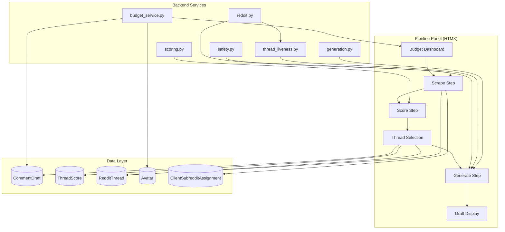
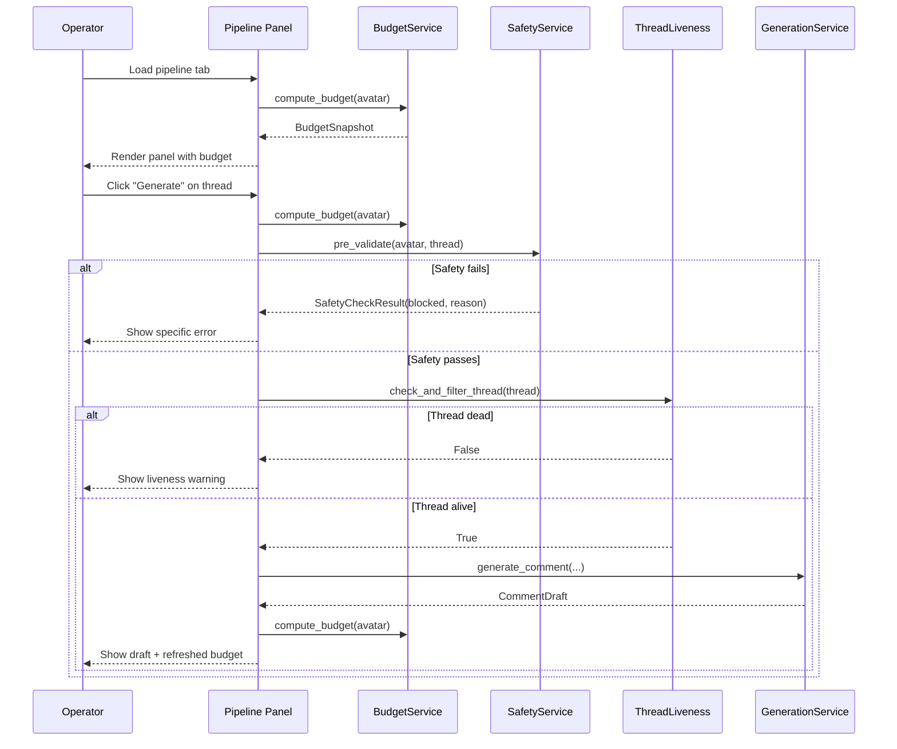

# Design Document: Manual Avatar Pipeline V2

## Overview

This design refactors and extends the existing manual avatar pipeline (`app/routes/avatar_pipeline.py`) to address five critical gaps: budget visibility, cross-avatar deduplication, thread freshness filtering, scoring cost awareness, and pre-generation safety validation. The existing 4-step flow (Scrape → Score → Select Thread → Generate) is preserved, but each step gains richer context and guardrails.

The implementation follows the existing architecture: FastAPI route handlers delegate to service functions, HTMX partials render inline results, and Tailwind CSS provides the dark-theme admin UI. No new infrastructure dependencies are introduced.

### Design Decisions

| Decision | Rationale |
|----------|-----------|
| Keep synchronous pipeline (no SQS) | Manual pipeline is operator-initiated, latency is acceptable (5-30s per step), and synchronous flow gives immediate feedback |
| Extract budget computation into a service function | Reusable across panel load, pre-generation validation, and post-generation refresh |
| Add `source` field to CommentDraft | Distinguishes manual_pipeline vs scheduler-generated drafts for activity summary |
| Use HTMX `hx-trigger` for budget refresh | After generation, trigger a re-fetch of the budget dashboard section without full page reload |
| Thread age computed from `scraped_at` | Reddit post time isn't stored separately; `scraped_at` is the closest proxy (threads are scraped within hours of posting) |

## Architecture



### Request Flow



## Components and Interfaces

### 1. BudgetService (`app/services/budget.py`) — NEW

Centralizes all budget/capacity computations for an avatar. Extracted from inline queries currently scattered across the route handler.

```python
@dataclass
class BudgetSnapshot:
    """Immutable snapshot of an avatar's current daily budget state."""
    total_today: int                    # approved + posted + pending count
    max_total: int                      # MAX_COMMENTS_PER_DAY (8)
    professional_today: int
    max_professional: int               # MAX_PROFESSIONAL_PER_DAY (5)
    hobby_today: int
    max_hobby: int                      # MAX_HOBBY_PER_DAY (5)
    minutes_until_next: int             # 0 if allowed now, else minutes remaining
    last_comment_at: datetime | None
    brand_ratio: float                  # current week's professional/total ratio
    max_brand_ratio: float              # MAX_BRAND_RATIO (0.3)
    brand_ratio_exceeded: bool
    per_subreddit: dict[str, int]       # {subreddit_name: count_today}
    max_per_subreddit: int              # MAX_COMMENTS_PER_SUBREDDIT_DAY (2)
    slots_remaining: int                # max_total - total_today
    can_generate: bool                  # True if slots_remaining > 0 and minutes_until_next == 0

    # Today's activity detail
    today_comments: list[dict]          # [{subreddit, status, source, created_at, type}]


def compute_budget(db: Session, avatar: Avatar) -> BudgetSnapshot:
    """Compute the full budget snapshot for an avatar.

    Queries CommentDraft for today's activity, computes all limits,
    and returns an immutable snapshot for template rendering.
    """
    ...
```

### 2. ThreadFilterService (`app/services/thread_filter.py`) — NEW

Encapsulates thread list filtering logic: cross-avatar deduplication, freshness, phase rules, and subreddit saturation marking.

```python
@dataclass
class FilteredThread:
    """A thread with its score and filter metadata."""
    thread: RedditThread
    score: ThreadScore
    age_display: str                    # "2h ago", "18h ago"
    age_hours: float
    is_aging: bool                      # True if 36-48h old
    subreddit_count_today: int          # How many times avatar posted here today
    subreddit_saturated: bool           # True if count >= MAX_PER_SUBREDDIT_DAY
    can_generate: bool                  # False if saturated


@dataclass
class ThreadFilterResult:
    """Result of filtering threads for display."""
    threads: list[FilteredThread]
    excluded_dedup_count: int           # Threads excluded by cross-avatar dedup
    excluded_dedup_details: list[dict]  # [{thread_id, avatar_username, status}]
    excluded_stale_count: int           # Threads excluded by 48h freshness
    phase: int
    phase_label: str


def filter_threads_for_avatar(
    db: Session,
    avatar: Avatar,
    client: Client,
    budget: BudgetSnapshot,
) -> ThreadFilterResult:
    """Apply all filters and return annotated thread list.

    Filters applied (in order):
    1. Phase-based subreddit restriction
    2. Thread freshness (exclude > 48h)
    3. Cross-avatar deduplication (exclude threads with drafts from same-client avatars)
    4. Exclude threads with drafts from this avatar
    5. Exclude locked threads
    6. Annotate with subreddit saturation
    7. Sort by alert desc, composite desc, scraped_at desc
    """
    ...


def format_thread_age(scraped_at: datetime) -> str:
    """Format thread age as human-readable string.

    Returns: "2m ago", "3h ago", "1d ago" etc.
    """
    ...


def classify_thread_freshness(scraped_at: datetime) -> tuple[bool, bool]:
    """Classify thread freshness.

    Returns: (is_stale: bool, is_aging: bool)
    - is_stale: True if > 48h old (should be excluded)
    - is_aging: True if 36-48h old (show warning indicator)
    """
    ...
```

### 3. PreValidationService (`app/services/pre_validation.py`) — NEW

Runs all safety checks before generation and returns structured, actionable error messages.

```python
@dataclass
class ValidationFailure:
    """A specific safety constraint that failed."""
    constraint: str                     # "daily_limit", "subreddit_limit", "time_gap", "phase_rule", "brand_ratio"
    message: str                        # Human-readable message
    current_value: str                  # e.g., "8/8", "2/2", "12 min"
    threshold: str                      # e.g., "8", "2", "15 min"
    time_remaining: int | None = None   # Minutes until constraint clears (for time_gap)


@dataclass
class PreValidationResult:
    """Result of pre-generation validation."""
    allowed: bool
    failures: list[ValidationFailure]


def pre_validate_generation(
    db: Session,
    avatar: Avatar,
    client: Client,
    thread: RedditThread,
    budget: BudgetSnapshot,
) -> PreValidationResult:
    """Validate all safety constraints before generation.

    Checks (in order):
    1. Daily comment limit (budget.slots_remaining > 0)
    2. Time gap (budget.minutes_until_next == 0)
    3. Subreddit daily limit (budget.per_subreddit[thread.subreddit] < max)
    4. Phase rules (thread subreddit allowed for avatar's phase)
    5. Brand ratio (budget.brand_ratio_exceeded == False for professional)
    6. Avatar active and not frozen

    Returns all failures (not just first) for comprehensive feedback.
    """
    ...
```

### 4. Refactored Route Handler (`app/routes/avatar_pipeline.py`)

The existing route file is refactored to use the new services:

```python
# Pipeline panel (GET) — uses BudgetService
@router.get("")
def pipeline_panel(...):
    budget = compute_budget(db, avatar)
    subreddits = _get_avatar_subreddits(db, avatar, client)
    # Pass budget + subreddit freshness info to template
    ...

# Thread list (GET) — uses ThreadFilterService
@router.get("/threads")
def pipeline_threads(...):
    budget = compute_budget(db, avatar)
    result = filter_threads_for_avatar(db, avatar, client, budget)
    # Pass FilteredThread list + exclusion counts to template
    ...

# Generate (POST) — uses PreValidationService + ThreadLiveness
@router.post("/generate/{thread_id}")
def pipeline_generate(...):
    budget = compute_budget(db, avatar)
    validation = pre_validate_generation(db, avatar, client, thread, budget)
    if not validation.allowed:
        return render_validation_errors(validation.failures)

    # Liveness check for threads > 12h old
    if is_thread_stale(thread):
        if not check_and_filter_thread(db, thread):
            return render_liveness_warning(thread)

    # Proceed with generation
    draft = generate_comment(...)
    draft.learning_metadata = {**(draft.learning_metadata or {}), "source": "manual_pipeline"}
    ...

# NEW: Inline edit endpoint
@router.post("/draft/{draft_id}/edit")
def pipeline_edit_draft(..., edited_text: str = Form(...)):
    draft.edited_draft = edited_text
    draft.learning_metadata = {
        **(draft.learning_metadata or {}),
        "inline_edit": True,
        "edited_at": datetime.now(timezone.utc).isoformat(),
    }
    db.commit()
    ...

# NEW: Retry generation (skips safety validation)
@router.post("/generate/{thread_id}/retry")
def pipeline_retry_generate(...):
    # Skip pre-validation, go straight to generation
    ...
```

### 5. Updated HTMX Templates

| Template | Changes |
|----------|---------|
| `avatar_pipeline_panel.html` | Add Budget Dashboard section with all 7 metrics from Req 1; add scrape freshness indicators per subreddit; conditional Scrape button disable |
| `avatar_pipeline_threads.html` | Add age display, aging indicator, subreddit saturation badges, dedup exclusion count, phase restriction label |
| `avatar_pipeline_draft.html` | Add inline edit textarea, retry button on error, HTMX trigger to refresh budget |
| `avatar_pipeline_budget.html` (NEW) | Standalone budget partial for HTMX refresh after generation |
| `avatar_pipeline_validation_error.html` (NEW) | Structured error display for pre-validation failures |
| `avatar_pipeline_activity.html` (NEW) | Today's activity list (comments with source/status/subreddit) |

## Data Models

### CommentDraft — Field Addition

```python
# No schema migration needed — use existing learning_metadata JSONB field
# Convention: learning_metadata["source"] = "manual_pipeline" | "scheduler" | "api"
# Convention: learning_metadata["inline_edit"] = True when edited in pipeline
# Convention: learning_metadata["edited_at"] = ISO timestamp of edit
```

The `source` field is stored in the existing `learning_metadata` JSONB column rather than adding a new column. This avoids a migration and keeps the schema stable. The query for today's activity filters on this field:

```python
# Query for source distinction
db.query(CommentDraft).filter(
    CommentDraft.avatar_id == avatar.id,
    CommentDraft.created_at >= today_start,
).all()

# Then in Python:
source = (draft.learning_metadata or {}).get("source", "scheduler")
```

### ThreadScore — No Changes

Existing fields are sufficient. The `composite`, `alert`, `tag`, `relevance`, `quality`, `strategic`, `intent` fields provide all data needed for the enhanced thread list display.

### RedditThread — No Changes

The `scraped_at` field serves as the proxy for post age. The `is_locked` field is already used for liveness filtering.

## Correctness Properties

*A property is a characteristic or behavior that should hold true across all valid executions of a system — essentially, a formal statement about what the system should do. Properties serve as the bridge between human-readable specifications and machine-verifiable correctness guarantees.*

### Property 1: Budget computation correctness

*For any* set of CommentDrafts belonging to an avatar with varying statuses (pending, approved, posted, rejected) and created_at timestamps, the `compute_budget` function SHALL return `total_today` equal to the count of drafts with status in {pending, approved, posted} and created_at >= today midnight UTC, `professional_today` equal to the count of those with type="professional", and `hobby_today` equal to the count with type="hobby".

**Validates: Requirements 1.1, 1.2, 1.3**

### Property 2: Time gap computation

*For any* avatar with a last comment timestamp T, the `minutes_until_next` field in BudgetSnapshot SHALL equal `max(0, 15 - floor((now - T).total_seconds() / 60))` where 15 is MIN_MINUTES_BETWEEN_COMMENTS.

**Validates: Requirements 1.4, 7.3**

### Property 3: Brand ratio threshold detection

*For any* avatar with N total comments and P professional comments in the past 7 days where N > 5, the `brand_ratio_exceeded` field SHALL be True if and only if P/N > 0.3.

**Validates: Requirements 1.6**

### Property 4: Per-subreddit saturation detection

*For any* avatar and any subreddit S, the `per_subreddit[S]` count in BudgetSnapshot SHALL equal the number of today's drafts (status in {approved, posted, pending}) targeting threads in subreddit S, and `subreddit_saturated` for a thread in S SHALL be True if and only if that count >= 2.

**Validates: Requirements 1.7, 6.1**

### Property 5: Cross-avatar deduplication

*For any* thread T and client C, if any avatar belonging to C has a CommentDraft for T with status in {pending, approved, posted}, then T SHALL NOT appear in the filtered thread list for any other avatar belonging to C.

**Validates: Requirements 2.1**

### Property 6: Thread freshness filtering

*For any* thread with `scraped_at` older than 48 hours from now, the thread SHALL be excluded from the filtered thread list. For any thread with `scraped_at` between 36 and 48 hours, the thread SHALL be included but marked with `is_aging=True`.

**Validates: Requirements 3.1, 3.4**

### Property 7: Thread age formatting

*For any* timestamp within the past 48 hours, the `format_thread_age` function SHALL return a string matching the pattern `\d+[mhd] ago` where the numeric value correctly represents the elapsed time in the appropriate unit (minutes if < 60m, hours if < 24h, days otherwise).

**Validates: Requirements 3.2**

### Property 8: Thread sort order invariant

*For any* two threads A and B in the filtered list where A.score.composite == B.score.composite and A.score.alert == B.score.alert, if A.scraped_at > B.scraped_at (A is newer), then A SHALL appear before B in the list.

**Validates: Requirements 3.3**

### Property 9: Phase-aware subreddit filtering

*For any* avatar in phase P and any thread T in the filtered list: if P=1, then T.subreddit must be in the avatar's hobby_subreddits; if P=2, then T.subreddit must be in the avatar's hobby_subreddits OR the client's assigned subreddits; if P=3, then T.subreddit must be in any subreddit assigned to the avatar or client.

**Validates: Requirements 5.1, 5.2, 5.3**

### Property 10: Safety error message specificity

*For any* failed pre-validation check, the resulting ValidationFailure SHALL contain a non-empty `constraint` identifier, a `current_value` string representing the actual state, and a `threshold` string representing the limit that was exceeded.

**Validates: Requirements 7.2**

### Property 11: Scrape freshness classification

*For any* subreddit with `last_scraped_at` timestamp T, the subreddit SHALL be classified as "fresh" (skip during scraping) if and only if (now - T).total_seconds() / 60 < 30.

**Validates: Requirements 8.2**

### Property 12: Draft persistence correctness

*For any* successful generation via the manual pipeline, the resulting CommentDraft SHALL have status="pending" and learning_metadata containing key "source" with value "manual_pipeline". For any inline edit, the draft's edited_draft field SHALL equal the submitted text and learning_metadata SHALL contain "inline_edit": True.

**Validates: Requirements 10.2, 10.3**

## Error Handling

| Error Scenario | Handling Strategy |
|----------------|-------------------|
| Avatar not found | Return 404 HTML partial with message |
| Client not assigned | Return 400 HTML partial explaining the avatar needs a client |
| Safety pre-validation fails | Return structured error partial listing all failures with current values and thresholds |
| Thread liveness check fails (locked/removed) | Update `is_locked` in DB, return warning partial, remove thread from list via HTMX OOB swap |
| Thread liveness check — Reddit API error | Log warning, proceed with generation (fail-open for API errors, fail-closed for confirmed locks) |
| LLM generation fails | Return error partial with "Retry" button that skips pre-validation |
| Scoring fails | Return error partial with error message and duration |
| Reddit scrape fails (rate limit) | Return per-subreddit error in results, continue with remaining subreddits |
| Database error during budget computation | Return degraded panel with "Budget unavailable" warning, disable Generate buttons |

### Error Message Format

All pre-validation errors follow a consistent structure for the template:

```python
# Example rendered output:
# ⚠️ Daily limit reached (8/8 comments today)
# ⚠️ Subreddit saturated: r/cybersecurity (2/2 today)
# ⚠️ Too soon: 7 minutes remaining (15 min minimum gap)
# ⚠️ Brand ratio exceeded: 35% professional (max 30%)
```

## Testing Strategy

### Property-Based Tests (Hypothesis)

The feature is well-suited for property-based testing because the core logic involves filtering, counting, and classification functions with clear input/output behavior and large input spaces.

**Library:** `hypothesis` (already in use — `.hypothesis/` directory exists in project root)

**Configuration:** Minimum 100 examples per property test, using `@settings(max_examples=100)`.

**Tag format:** `# Feature: manual-avatar-pipeline-v2, Property {N}: {title}`

Each correctness property (1-12) maps to a single property-based test:

| Property | Test File | What's Generated |
|----------|-----------|-----------------|
| 1: Budget computation | `tests/test_budget_properties.py` | Random CommentDraft sets with varying statuses, types, timestamps |
| 2: Time gap | `tests/test_budget_properties.py` | Random last-comment timestamps |
| 3: Brand ratio | `tests/test_budget_properties.py` | Random weekly comment sets with varying type distributions |
| 4: Subreddit saturation | `tests/test_budget_properties.py` | Random comments across multiple subreddits |
| 5: Cross-avatar dedup | `tests/test_thread_filter_properties.py` | Random threads + drafts from multiple avatars of same client |
| 6: Thread freshness | `tests/test_thread_filter_properties.py` | Random thread ages (0-72h range) |
| 7: Age formatting | `tests/test_thread_filter_properties.py` | Random timestamps within 48h |
| 8: Sort order | `tests/test_thread_filter_properties.py` | Random thread lists with same composite scores |
| 9: Phase filtering | `tests/test_thread_filter_properties.py` | Random threads + avatars at phases 1/2/3 |
| 10: Error specificity | `tests/test_pre_validation_properties.py` | Random safety check failure scenarios |
| 11: Scrape freshness | `tests/test_budget_properties.py` | Random last_scraped_at timestamps |
| 12: Draft persistence | `tests/test_generation_properties.py` | Random generation inputs |

### Unit Tests (Example-Based)

| Area | Tests |
|------|-------|
| Budget dashboard rendering | Verify HTML contains correct counts when budget is at various states |
| Scrape button disabled state | Verify button disabled when all subreddits fresh |
| Score button disabled state | Verify button disabled when unscored_count == 0 |
| Dedup detail display | Verify tooltip shows correct avatar username |
| Phase label display | Verify correct phase restriction text |
| Retry button behavior | Verify retry endpoint skips pre-validation |
| Inline edit persistence | Verify edited_draft and learning_metadata saved |
| Activity summary display | Verify scheduler vs manual distinction |

### Integration Tests

| Area | Tests |
|------|-------|
| Full generate flow | Mock LLM, verify draft created with correct metadata |
| Liveness check integration | Mock Reddit API, verify locked thread handling |
| Scrape with freshness skip | Verify fresh subreddits are skipped |
| HTMX budget refresh | Verify HX-Trigger header after generation |
