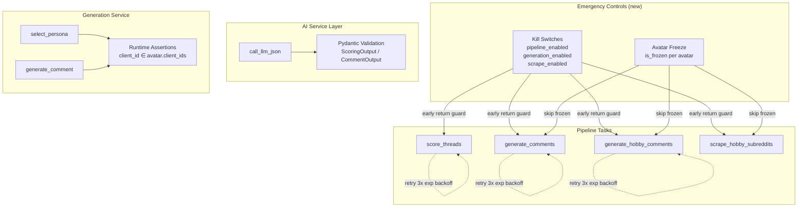

# Design Document: MVP Hardening Sprint 1

## Overview

This sprint addresses P0 operational safety blockers before the first paid pilot launch. The design covers eight workstreams that collectively provide: emergency stop controls (avatar freeze + global kill switches), reliability improvements (retry with backoff), data quality guarantees (structured LLM output validation), security hardening (context isolation assertions), and confidence tooling (E2E onboarding test).

All changes target the existing Python 3.11 / FastAPI / SQLAlchemy 2.0 / Celery stack. No new infrastructure is introduced — only new columns, settings, Pydantic models, task decorators, assertions, and test files.

**Priority order:** Operational safety → Context isolation → Reliability → AI quality → Observability.

## Architecture

The hardening changes layer onto the existing architecture without altering the data flow:



### Design Principles

1. **Fail-closed**: Kill switches default to enabled ("true"). When disabled, tasks return immediately — no partial execution.
2. **Defense in depth**: Frozen avatars are checked at both the task level (filter query) and the service level (assertion).
3. **Non-breaking**: All new columns have defaults. Existing data continues to work without migration backfill.
4. **Audit everything**: Every emergency control action produces an audit log entry.

## Components and Interfaces

### 1. Avatar Freeze (Model + Migration)

**File:** `app/models/avatar.py`

New columns on the `Avatar` model:

```python
# Avatar freeze fields
is_frozen: Mapped[bool] = mapped_column(Boolean, default=False, server_default="false")
freeze_reason: Mapped[str | None] = mapped_column(Text, nullable=True)
frozen_at: Mapped[datetime | None] = mapped_column(DateTime(timezone=True), nullable=True)
```

**File:** `alembic/versions/j0k1l2m3n4o5_add_avatar_freeze_fields.py`

```python
def upgrade():
    op.add_column('avatars', sa.Column('is_frozen', sa.Boolean(), server_default='false', nullable=False))
    op.add_column('avatars', sa.Column('freeze_reason', sa.Text(), nullable=True))
    op.add_column('avatars', sa.Column('frozen_at', sa.DateTime(timezone=True), nullable=True))

def downgrade():
    op.drop_column('avatars', 'frozen_at')
    op.drop_column('avatars', 'freeze_reason')
    op.drop_column('avatars', 'is_frozen')
```

### 2. Global Kill Switches (Settings)

**File:** `app/services/settings.py` — add to `DEFAULTS` dict:

```python
"pipeline_enabled": {
    "value": "true",
    "secret": False,
    "desc": "Master kill switch — disables all AI pipeline tasks (score, generate)",
    "group": "app",
},
"generation_enabled": {
    "value": "true",
    "secret": False,
    "desc": "Kill switch for comment generation only (score still runs)",
    "group": "app",
},
```

**Guard function** (new helper in `app/services/settings.py`):

```python
def is_pipeline_enabled(db: Session) -> bool:
    """Check if the pipeline master switch is on."""
    return get_setting(db, "pipeline_enabled").lower() == "true"

def is_generation_enabled(db: Session) -> bool:
    """Check if generation is enabled."""
    return get_setting(db, "generation_enabled").lower() == "true"

def is_scrape_enabled(db: Session) -> bool:
    """Check if scraping is enabled."""
    return get_setting(db, "scrape_enabled").lower() == "true"
```

### 3. Task Guards (AI Pipeline + Scraping)

**File:** `app/tasks/ai_pipeline.py`

Each AI task gets an early-return guard at the top of its body:

```python
@celery_app.task(name="score_threads", bind=True, max_retries=3)
def score_threads(self, client_id: str):
    db = SessionLocal()
    try:
        from app.services.settings import is_pipeline_enabled
        if not is_pipeline_enabled(db):
            logger.info("score_threads: pipeline_enabled=false, skipping")
            return 0
        # ... existing logic ...
    finally:
        db.close()
```

```python
@celery_app.task(name="generate_comments", bind=True, max_retries=3)
def generate_comments(self, client_id: str, max_comments: int = 15):
    db = SessionLocal()
    try:
        from app.services.settings import is_pipeline_enabled, is_generation_enabled
        if not is_pipeline_enabled(db):
            logger.info("generate_comments: pipeline_enabled=false, skipping")
            return 0
        if not is_generation_enabled(db):
            logger.info("generate_comments: generation_enabled=false, skipping")
            return 0
        # ... existing logic, plus filter frozen avatars ...
    finally:
        db.close()
```

**Frozen avatar filtering** in `generate_comments`:

```python
# After fetching avatars, filter out frozen ones
client_avatars = [
    a for a in avatars
    if a.client_ids and str(client.id) in a.client_ids
    and not a.is_frozen  # NEW: skip frozen avatars
]
```

**File:** `app/tasks/scraping.py` — `scrape_hobby_subreddits`:

```python
@celery_app.task(name="scrape_hobby_subreddits")
def scrape_hobby_subreddits(avatar_id: str):
    db = SessionLocal()
    try:
        from app.services.settings import is_scrape_enabled
        if not is_scrape_enabled(db):
            logger.info("scrape_hobby_subreddits: scrape_enabled=false, skipping")
            return 0

        avatar = db.query(Avatar).filter(Avatar.id == avatar_id).first()
        if not avatar:
            return 0
        if avatar.is_frozen:  # NEW: skip frozen avatars
            logger.info(f"scrape_hobby_subreddits: avatar {avatar.reddit_username} is frozen, skipping")
            return 0
        # ... existing logic ...
    finally:
        db.close()
```

### 4. Retry with Exponential Backoff

**File:** `app/tasks/ai_pipeline.py`

All four AI tasks get Celery's built-in retry mechanism:

```python
@celery_app.task(
    name="score_threads",
    bind=True,
    max_retries=3,
    autoretry_for=(Exception,),
    retry_backoff=60,       # base countdown = 60s
    retry_backoff_max=600,  # cap at 10 minutes
    retry_jitter=False,
)
def score_threads(self, client_id: str):
    ...
```

**Retry countdown formula:** `countdown = 60 * (2 ** self.request.retries)`

Since Celery's `retry_backoff` uses a multiplier pattern, we implement the exact formula using a custom `retry` call:

```python
@celery_app.task(name="score_threads", bind=True, max_retries=3)
def score_threads(self, client_id: str):
    db = SessionLocal()
    try:
        # ... guards and logic ...
    except Exception as exc:
        countdown = 60 * (2 ** self.request.retries)
        logger.warning(
            f"score_threads retry {self.request.retries + 1}/3 "
            f"for client {client_id}, countdown={countdown}s: {exc}"
        )
        raise self.retry(exc=exc, countdown=countdown)
    finally:
        db.close()
```

Applied to: `score_threads`, `generate_comments`, `generate_hobby_comments`, `generate_posts`.

**NOT applied to:** `scrape_hobby_subreddits`, `scrape_professional_subreddits`, `scrape_subreddit_shared` (naturally re-scheduled, idempotent).

### 5. Structured LLM Output Validation

**New file:** `app/schemas/llm_outputs.py`

```python
"""Pydantic models for validating structured LLM JSON responses."""

from typing import Literal
from pydantic import BaseModel, Field


class ScoringOutput(BaseModel):
    """Schema for thread scoring LLM response."""
    alert: bool
    tag: Literal["engage", "monitor", "skip"]
    relevance: int = Field(ge=0, le=3)
    quality: int = Field(ge=0, le=3)
    strategic: int = Field(ge=0, le=3)
    composite: int = Field(ge=0, le=9)
    intent: str
    reason: str


class CommentOutput(BaseModel):
    """Schema for comment generation LLM response."""
    comment: str
    comment_to: str
    location_depth: int = Field(ge=0)
    location_reasoning: str
    comment_approach: str
    strategic_angle: str
```

**File:** `app/services/ai.py` — updated `call_llm_json` signature:

```python
from pydantic import BaseModel, ValidationError

def call_llm_json(
    messages: list[dict],
    model: str | None = None,
    temperature: float = 0.3,
    max_tokens: int = 1024,
    schema: type[BaseModel] | None = None,  # NEW parameter
) -> dict:
    """Make an LLM call expecting JSON output. Optionally validates against schema.

    Args:
        ...
        schema: Optional Pydantic model class to validate the parsed JSON against.

    Returns:
        Dict with keys: data (parsed+validated JSON), input_tokens, output_tokens, ...

    Raises:
        ValidationError: If schema is provided and the LLM response fails validation.
    """
    result = call_llm(...)
    data = json.loads(result["content"])

    # NEW: Validate against schema if provided
    if schema is not None:
        validated = schema.model_validate(data)
        data = validated.model_dump()

    result["data"] = data
    return result
```

**Callers updated:**

- `scoring.py` → `call_llm_json(..., schema=ScoringOutput)`
- `generation.py` → `call_llm_json(..., schema=CommentOutput)` (in `generate_comment`)

### 6. Context Isolation Assertions

**File:** `app/services/generation.py` — `select_persona`:

```python
def select_persona(db, thread, client, avatars):
    # Runtime assertion: all candidate avatars must belong to this client
    for avatar in avatars:
        assert avatar.client_ids and str(client.id) in avatar.client_ids, (
            f"Context isolation violation: avatar {avatar.reddit_username} "
            f"does not belong to client {client.id}"
        )
    # ... existing logic ...
```

**File:** `app/services/generation.py` — `generate_comment`:

```python
def generate_comment(db, thread, client, avatar, persona_selection, previous_comments=None):
    # Runtime assertion: avatar must belong to this client
    assert avatar.client_ids and str(client.id) in avatar.client_ids, (
        f"Context isolation violation: avatar {avatar.reddit_username} "
        f"does not belong to client {client.id}"
    )
    # ... existing logic ...
```

### 7. Admin UI for Emergency Controls

**File:** `app/routes/admin.py` — new endpoints:

```python
@router.post("/avatars/{avatar_id}/freeze", response_class=HTMLResponse)
def admin_freeze_avatar(
    request: Request,
    avatar_id: uuid.UUID,
    freeze_reason: str = Form(...),
    current_user: User = Depends(require_superuser),
    db: Session = Depends(get_db),
):
    """Freeze an avatar — sets is_frozen=True, records reason and timestamp."""
    avatar = db.query(Avatar).filter(Avatar.id == avatar_id).first()
    if not avatar:
        return HTMLResponse("Avatar not found", status_code=404)

    avatar.is_frozen = True
    avatar.freeze_reason = freeze_reason
    avatar.frozen_at = datetime.now(timezone.utc)
    db.commit()

    audit_service.log_action(
        db=db,
        user_id=current_user.id,
        action="freeze",
        entity_type="avatar",
        entity_id=avatar_id,
        details={"reason": freeze_reason},
    )
    # Return updated partial or redirect
    ...


@router.post("/avatars/{avatar_id}/unfreeze", response_class=HTMLResponse)
def admin_unfreeze_avatar(
    request: Request,
    avatar_id: uuid.UUID,
    current_user: User = Depends(require_superuser),
    db: Session = Depends(get_db),
):
    """Unfreeze an avatar — clears frozen state."""
    avatar = db.query(Avatar).filter(Avatar.id == avatar_id).first()
    if not avatar:
        return HTMLResponse("Avatar not found", status_code=404)

    avatar.is_frozen = False
    avatar.freeze_reason = None
    avatar.frozen_at = None
    db.commit()

    audit_service.log_action(
        db=db,
        user_id=current_user.id,
        action="unfreeze",
        entity_type="avatar",
        entity_id=avatar_id,
    )
    ...


@router.post("/settings/pipeline-controls", response_class=HTMLResponse)
def admin_toggle_pipeline_control(
    request: Request,
    setting_key: str = Form(...),
    setting_value: str = Form(...),
    current_user: User = Depends(require_superuser),
    db: Session = Depends(get_db),
):
    """Toggle a pipeline control setting (pipeline_enabled, generation_enabled, scrape_enabled)."""
    allowed_keys = {"pipeline_enabled", "generation_enabled", "scrape_enabled"}
    if setting_key not in allowed_keys:
        return HTMLResponse("Invalid setting", status_code=400)

    from app.services.settings import set_setting
    set_setting(db, setting_key, setting_value, user_id=current_user.id)

    audit_service.log_action(
        db=db,
        user_id=current_user.id,
        action="toggle_kill_switch",
        entity_type="system_setting",
        details={"key": setting_key, "value": setting_value},
    )
    ...
```

**Templates:** Add freeze/unfreeze controls to the avatar detail template and a "Pipeline Controls" section to the admin dashboard.

### 8. E2E Onboarding Test

**File:** `tests/test_e2e_onboarding.py`

```python
"""End-to-end test: full onboarding → score → generate → review pipeline.

Uses mocked LLM responses. Requires only the test database (no Redis, no Reddit API).
"""

import uuid
from unittest.mock import patch

import pytest
from sqlalchemy.orm import Session

from app.models.client import Client
from app.models.avatar import Avatar
from app.models.subreddit import Subreddit, ClientSubredditAssignment
from app.models.thread import RedditThread
from app.models.thread_score import ThreadScore
from app.models.comment_draft import CommentDraft


MOCK_SCORING_RESPONSE = {
    "content": '{"alert": true, "tag": "engage", "relevance": 3, "quality": 3, '
               '"strategic": 3, "composite": 9, "intent": "help_seeking", "reason": "Direct hit"}',
    "input_tokens": 100, "output_tokens": 50, "cost_usd": 0.001,
    "duration_ms": 200, "model": "test-model",
}

MOCK_PERSONA_RESPONSE = {
    "content": '{"persona_username": "test_avatar", "mode": "helpful_peer", '
               '"audience": "developers", "thread_angle": "share experience", '
               '"pov_opportunity": "worldview fit", "selection_reasoning": "best fit"}',
    "input_tokens": 100, "output_tokens": 50, "cost_usd": 0.001,
    "duration_ms": 200, "model": "test-model",
}

MOCK_COMMENT_RESPONSE = {
    "content": '{"comment": "great point, been there", "comment_to": "post", '
               '"location_depth": 0, "location_reasoning": "top level", '
               '"comment_approach": "yeah_and", "strategic_angle": "karma_play"}',
    "input_tokens": 100, "output_tokens": 50, "cost_usd": 0.001,
    "duration_ms": 200, "model": "test-model",
}

MOCK_EDIT_RESPONSE = {
    "content": "great point, been there",
    "input_tokens": 50, "output_tokens": 30, "cost_usd": 0.0005,
    "duration_ms": 100, "model": "test-model",
}


def test_e2e_onboarding_pipeline(db: Session):
    """Full pipeline: create client → assign sub → insert thread → score → generate → review."""
    # 1. Create client
    client = Client(client_name="E2E Test Corp", brand_name="E2E Brand", is_active=True)
    db.add(client)
    db.flush()

    # 2. Create + assign subreddit
    subreddit = Subreddit(subreddit_name="test_subreddit")
    db.add(subreddit)
    db.flush()
    assignment = ClientSubredditAssignment(
        client_id=client.id, subreddit_id=subreddit.id, type="professional", is_active=True
    )
    db.add(assignment)
    db.flush()

    # 3. Insert mock thread
    thread = RedditThread(
        subreddit_id=subreddit.id, subreddit="test_subreddit",
        type="professional", reddit_native_id="t3_test123",
        post_title="How do you handle X?", post_body="Looking for advice...",
        url="https://reddit.com/r/test/123", author="someone",
    )
    db.add(thread)
    db.flush()

    # 4. Create avatar for this client
    avatar = Avatar(
        reddit_username="test_avatar", active=True,
        client_ids=[str(client.id)], voice_profile_md="Casual dev voice",
    )
    db.add(avatar)
    db.commit()

    # 5. Score (mocked LLM)
    with patch("app.services.ai.call_llm_json") as mock_llm_json, \
         patch("app.services.ai.call_llm") as mock_llm:
        mock_llm_json.return_value = {**MOCK_SCORING_RESPONSE, "data": {...}}
        # ... invoke scoring, assert ThreadScore created ...

    # 6. Generate (mocked LLM)
    # ... invoke generation, assert CommentDraft created ...

    # 7. Verify review queue visibility
    # ... query CommentDraft for this client, assert it appears ...
```

## Data Models

### Avatar Model (updated)

| Field | Type | Default | Description |
|-------|------|---------|-------------|
| `is_frozen` | Boolean | `false` | Whether the avatar is frozen |
| `freeze_reason` | Text | `null` | Operator-provided reason for freeze |
| `frozen_at` | DateTime(tz) | `null` | When the avatar was frozen |

### System Settings (new entries)

| Key | Default | Group | Description |
|-----|---------|-------|-------------|
| `pipeline_enabled` | `"true"` | app | Master kill switch for all AI tasks |
| `generation_enabled` | `"true"` | app | Kill switch for generation tasks only |

(`scrape_enabled` already exists in the "scraping" group.)

### Pydantic Schemas (new)

**ScoringOutput:**

| Field | Type | Constraints |
|-------|------|-------------|
| `alert` | bool | — |
| `tag` | Literal | "engage" \| "monitor" \| "skip" |
| `relevance` | int | 0–3 |
| `quality` | int | 0–3 |
| `strategic` | int | 0–3 |
| `composite` | int | 0–9 |
| `intent` | str | — |
| `reason` | str | — |

**CommentOutput:**

| Field | Type | Constraints |
|-------|------|-------------|
| `comment` | str | — |
| `comment_to` | str | — |
| `location_depth` | int | ≥ 0 |
| `location_reasoning` | str | — |
| `comment_approach` | str | — |
| `strategic_angle` | str | — |

## Correctness Properties

*A property is a characteristic or behavior that should hold true across all valid executions of a system — essentially, a formal statement about what the system should do. Properties serve as the bridge between human-readable specifications and machine-verifiable correctness guarantees.*

### Property 1: Frozen avatar exclusion

*For any* set of avatars where some are frozen and some are not, and *for any* client, the `generate_comments` task SHALL only pass non-frozen avatars to the persona selection step. No frozen avatar shall ever appear in the candidate list.

**Validates: Requirements 1.2, 1.3**

### Property 2: ScoringOutput round-trip serialization

*For any* valid `ScoringOutput` instance (with `tag` ∈ {"engage", "monitor", "skip"}, `relevance` ∈ [0,3], `quality` ∈ [0,3], `strategic` ∈ [0,3], `composite` ∈ [0,9]), serializing to JSON and parsing back through the `ScoringOutput` model SHALL produce an equivalent object.

**Validates: Requirements 6.7**

### Property 3: CommentOutput round-trip serialization

*For any* valid `CommentOutput` instance (with non-negative `location_depth` and non-empty string fields), serializing to JSON and parsing back through the `CommentOutput` model SHALL produce an equivalent object.

**Validates: Requirements 6.8**

### Property 4: Schema validation rejects invalid LLM output

*For any* JSON object that violates the `ScoringOutput` constraints (e.g., `relevance` > 3, `tag` not in allowed values, missing required fields), passing it through `call_llm_json` with `schema=ScoringOutput` SHALL raise a `ValidationError`.

**Validates: Requirements 6.3, 6.4**

### Property 5: Client isolation in persona selection

*For any* set of avatars and *for any* client, `select_persona` SHALL raise an `AssertionError` if any avatar in the candidate list does not have the client's ID in its `client_ids` array. Equivalently: all avatars passed to `select_persona` must belong to the requesting client.

**Validates: Requirements 7.1, 7.7**

## Error Handling

### Kill Switch Guards

- When a kill switch is disabled, tasks return `0` (integer) immediately — no exception, no retry.
- The early return is logged at INFO level for observability.
- Kill switch state is read from DB on every task invocation (no caching in tasks) to ensure immediate effect.

### Retry Behavior

- **Retryable failures:** Any `Exception` raised during task execution (LLM timeouts, DB connection errors, transient network issues).
- **Non-retryable:** Kill switch returns (not failures), avatar-not-found (returns 0).
- **Countdown formula:** `60 * (2 ** attempt)` → 60s, 120s, 240s.
- **After max retries:** Exception propagates to Celery's failure handler. Logged at ERROR level. Audit log entry created with error details.

### Validation Errors

- When `call_llm_json` receives invalid JSON from the LLM, it raises `ValidationError` (from Pydantic).
- The calling service (scoring/generation) catches this and either retries (via Celery retry) or logs and skips the thread.
- Invalid LLM responses are logged with the raw content for debugging.

### Context Isolation Violations

- `AssertionError` is raised immediately — this is a programming error, not a transient failure.
- The assertion message includes the avatar username and client ID for debugging.
- These assertions should NEVER fire in production if the task-level filtering is correct. They are defense-in-depth.

## Testing Strategy

### Unit Tests (example-based)

| Area | Test File | Key Scenarios |
|------|-----------|---------------|
| Kill switch guards | `tests/test_kill_switches.py` | Each task returns 0 when disabled |
| Avatar freeze | `tests/test_avatar_freeze.py` | Freeze/unfreeze sets correct fields |
| Retry config | `tests/test_retry_config.py` | Tasks have correct max_retries and countdown |
| Admin endpoints | `tests/test_admin_emergency.py` | Freeze/unfreeze/toggle endpoints work |
| Context isolation | `tests/test_context_isolation.py` | Assertions fire on wrong client |
| E2E pipeline | `tests/test_e2e_onboarding.py` | Full flow with mocked LLM |

### Property-Based Tests (Hypothesis)

The project already uses Hypothesis (`.hypothesis/` directory exists). Property tests will use the existing setup.

| Property | Test File | Iterations |
|----------|-----------|------------|
| Frozen avatar exclusion | `tests/test_props_freeze.py` | 100+ |
| ScoringOutput round-trip | `tests/test_props_schemas.py` | 100+ |
| CommentOutput round-trip | `tests/test_props_schemas.py` | 100+ |
| Schema validation rejects invalid | `tests/test_props_schemas.py` | 100+ |
| Client isolation assertion | `tests/test_props_isolation.py` | 100+ |

**PBT Library:** Hypothesis (already in project)

**Configuration:**
- Minimum 100 examples per property (`@settings(max_examples=100)`)
- Each test tagged with: `# Feature: mvp-hardening-sprint1, Property N: <title>`

### Integration Tests

- E2E onboarding test (`tests/test_e2e_onboarding.py`) — exercises full pipeline with mocked LLM
- No external services required (mocked LLM, test DB, no Redis/Reddit)

### What's NOT Tested via PBT

- Admin UI rendering (use example-based tests with TestClient)
- Alembic migration correctness (smoke test: apply + rollback)
- Retry timing (verify decorator config, not actual delays)
- Audit log creation (example-based: verify log entry exists after action)
