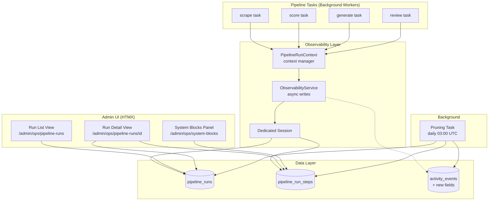

# Design Document: Pipeline Observability

## Overview

This feature adds a Pipeline Observability layer to the ThreddOps admin panel, providing operators with structured visibility into pipeline executions. The design extends the existing `transparency.py` service and `topology.py` patterns rather than replacing them.

**Core deliverables (demo-focused):**
1. **Pipeline Runs tracking** — structured records with lifecycle status for every pipeline execution
2. **Pipeline Run Steps** — per-step timing, retries, and error tracking within each run
3. **Pipeline Runs List View** — paginated, filterable HTMX page at `/admin/ops/pipeline-runs`
4. **Pipeline Run Detail View** — drill-down with step timeline at `/admin/ops/pipeline-runs/{run_id}`
5. **System Blocks Health Panel** — 11-block health grid at `/admin/ops/system-blocks`
6. **Data Retention** — daily pruning task (90 days runs, 30 days events)
7. **Observability Service** — non-blocking writes with context manager pattern

**Design principles:**
- Extend existing patterns (topology nodes, activity events, service-layer aggregation)
- HTMX-first with independently refreshable partials
- Non-blocking observability — pipeline tasks never wait on observability writes
- Demo-ready — focus on visual impact and clear data flow

## Architecture



**Key architectural decisions:**

1. **Dedicated session for writes** — Observability writes use `SessionLocal()` independent of the pipeline's transactional session. If the observability write fails, the pipeline continues unaffected.

2. **Fire-and-forget via threading** — Write operations are dispatched to a background thread (using `threading.Thread(daemon=True)`) to avoid blocking the calling task. This keeps observability writes decoupled from the pipeline worker's processing loop.

3. **Context manager pattern** — `PipelineRunContext` wraps task execution, automatically creating a `PipelineRun` on entry and finalizing status on exit. Steps are registered via `context.add_step()`.

4. **Health computation is query-time** — Block health is computed on each request from recent `pipeline_run_steps` data, not stored as a separate state. This avoids stale health data and extra write complexity.

## Components and Interfaces

### 1. ObservabilityService (`app/services/observability.py`)

The central service for all observability writes and reads.

```python
# --- Write API (non-blocking) ---

def create_run(
    pipeline_type: str,
    trigger_source: str,
    operator_id: uuid.UUID | None = None,
    steps_total: int = 0,
) -> uuid.UUID:
    """Create a new PipelineRun record. Returns run_id immediately.
    Actual DB write happens in background thread."""

def update_run_status(
    run_id: uuid.UUID,
    status: str,
    error_message: str | None = None,
    steps_completed: int | None = None,
) -> None:
    """Update run status. Non-blocking."""

def create_step(
    run_id: uuid.UUID,
    step_name: str,
    block_name: str,
    max_retries: int = 3,
    metadata: dict | None = None,
) -> uuid.UUID:
    """Create a new PipelineRunStep. Returns step_id immediately."""

def update_step_status(
    step_id: uuid.UUID,
    status: str,
    error_message: str | None = None,
    duration_ms: int | None = None,
) -> None:
    """Update step status. Non-blocking."""

# --- Read API (synchronous, used by routes) ---

def get_runs(
    db: Session,
    pipeline_type: str | None = None,
    status: str | None = None,
    trigger_source: str | None = None,
    date_from: datetime | None = None,
    date_to: datetime | None = None,
    page: int = 1,
    page_size: int = 20,
) -> tuple[list[PipelineRun], int]:
    """Paginated, filtered list of runs. Returns (runs, total_count)."""

def get_run_detail(db: Session, run_id: uuid.UUID) -> PipelineRun | None:
    """Single run with all steps eagerly loaded."""

def get_run_steps(db: Session, run_id: uuid.UUID) -> list[PipelineRunStep]:
    """Steps for a run, ordered by started_at (nulls last)."""

def compute_block_health(db: Session) -> list[BlockHealthStatus]:
    """Compute current health for all 11 system blocks based on recent steps."""
```

### 2. PipelineRunContext (`app/services/observability.py`)

Context manager for automatic run lifecycle tracking:

```python
class PipelineRunContext:
    """Context manager that wraps pipeline task execution.

    Usage:
        with PipelineRunContext("scrape", trigger_source="schedule") as ctx:
            for subreddit in subreddits:
                step = ctx.add_step(f"scrape_{subreddit.name}", block_name="scraper")
                try:
                    do_scrape(subreddit)
                    step.complete()
                except Exception as e:
                    step.fail(str(e))
    """

    def __init__(
        self,
        pipeline_type: str,
        trigger_source: str = "schedule",
        operator_id: uuid.UUID | None = None,
    ): ...

    def __enter__(self) -> "PipelineRunContext": ...
    def __exit__(self, exc_type, exc_val, exc_tb) -> bool: ...

    def add_step(self, step_name: str, block_name: str, max_retries: int = 3) -> StepHandle: ...

    @property
    def run_id(self) -> uuid.UUID: ...
```

### 3. Routes (`app/routes/ops.py`)

New router mounted at `/admin/ops/`:

```python
router = APIRouter(prefix="/admin/ops")

@router.get("/pipeline-runs", response_class=HTMLResponse)
def pipeline_runs_list(request, current_user, db, page, pipeline_type, status, trigger_source): ...

@router.get("/pipeline-runs/{run_id}", response_class=HTMLResponse)
def pipeline_run_detail(request, current_user, db, run_id): ...

@router.get("/system-blocks", response_class=HTMLResponse)
def system_blocks_panel(request, current_user, db): ...

# HTMX partials for polling
@router.get("/partials/pipeline-runs-table", response_class=HTMLResponse)
def pipeline_runs_table_partial(request, db, page, filters...): ...

@router.get("/partials/system-blocks-grid", response_class=HTMLResponse)
def system_blocks_grid_partial(request, db): ...
```

### 4. Pruning Task (`app/tasks/pruning.py`)

```python
def prune_observability_data():
    """Daily task (03:00 UTC via internal scheduler) — delete old pipeline_runs and activity_events.
    Triggered by the app's built-in scheduler (APScheduler / cron-like loop)."""
```

### 5. Templates

| Template | Purpose |
|----------|---------|
| `admin_pipeline_runs.html` | Full page: list view with filters + blocks summary widget |
| `admin_pipeline_run_detail.html` | Full page: run header + steps table |
| `admin_system_blocks.html` | Full page: 11-block health grid |
| `partials/pipeline_runs_table.html` | HTMX partial: table body (auto-refresh target) |
| `partials/system_blocks_grid.html` | HTMX partial: blocks grid (auto-refresh target) |

## Data Models

### PipelineRun

```python
class PipelineRun(Base):
    __tablename__ = "pipeline_runs"

    id: Mapped[uuid.UUID] = mapped_column(UUID(as_uuid=True), primary_key=True, default=uuid.uuid4)
    pipeline_type: Mapped[str] = mapped_column(String(50), nullable=False, index=True)
    status: Mapped[str] = mapped_column(String(20), nullable=False, default="queued")
    started_at: Mapped[datetime] = mapped_column(DateTime(timezone=True), server_default=func.now())
    completed_at: Mapped[datetime | None] = mapped_column(DateTime(timezone=True), nullable=True)
    trigger_source: Mapped[str] = mapped_column(String(20), nullable=False, default="schedule")
    operator_id: Mapped[uuid.UUID | None] = mapped_column(UUID(as_uuid=True), nullable=True)
    is_blocked: Mapped[bool] = mapped_column(Boolean, default=False)
    blocked_reason: Mapped[str | None] = mapped_column(Text, nullable=True)
    error_message: Mapped[str | None] = mapped_column(Text, nullable=True)
    steps_total: Mapped[int] = mapped_column(Integer, default=0)
    steps_completed: Mapped[int] = mapped_column(Integer, default=0)

    # Relationships
    steps: Mapped[list["PipelineRunStep"]] = relationship(back_populates="run", cascade="all, delete-orphan")

    __table_args__ = (
        Index("ix_pipeline_runs_status_started", "status", "started_at"),
        Index("ix_pipeline_runs_type_started", "pipeline_type", "started_at"),
    )
```

**Valid `pipeline_type` values:** `scrape`, `score`, `generate`, `review`, `hobby`, `health_check`, `phase_evaluation`

**Valid `status` values (Pipeline_Status):** `queued`, `running`, `completed`, `failed`, `partial`

**Valid `trigger_source` values:** `schedule`, `manual`, `webhook`, `retry`, `dependent`

### PipelineRunStep

```python
class PipelineRunStep(Base):
    __tablename__ = "pipeline_run_steps"

    id: Mapped[uuid.UUID] = mapped_column(UUID(as_uuid=True), primary_key=True, default=uuid.uuid4)
    run_id: Mapped[uuid.UUID] = mapped_column(UUID(as_uuid=True), ForeignKey("pipeline_runs.id", ondelete="CASCADE"), nullable=False)
    step_name: Mapped[str] = mapped_column(String(255), nullable=False)
    block_name: Mapped[str] = mapped_column(String(50), nullable=False, index=True)
    status: Mapped[str] = mapped_column(String(20), nullable=False, default="pending")
    started_at: Mapped[datetime | None] = mapped_column(DateTime(timezone=True), nullable=True)
    completed_at: Mapped[datetime | None] = mapped_column(DateTime(timezone=True), nullable=True)
    duration_ms: Mapped[int | None] = mapped_column(Integer, nullable=True)
    max_retries: Mapped[int] = mapped_column(Integer, default=3)
    remaining_retries: Mapped[int] = mapped_column(Integer, default=3)
    last_error_message: Mapped[str | None] = mapped_column(Text, nullable=True)
    metadata_json: Mapped[dict | None] = mapped_column("metadata", JSONB, nullable=True)

    # Relationships
    run: Mapped["PipelineRun"] = relationship(back_populates="steps")

    __table_args__ = (
        Index("ix_pipeline_run_steps_run_id", "run_id"),
        Index("ix_pipeline_run_steps_block_status", "block_name", "status", "completed_at"),
    )
```

**Valid `status` values (Step_Status):** `pending`, `running`, `completed`, `failed`, `skipped`, `retrying`

**Valid `block_name` values:** `scraper`, `scorer`, `generator`, `reviewer`, `reddit_api`, `llm_api`, `database`, `queue`, `cache`, `safety_checker`, `oauth_token_refresh`

### ActivityEvent Enhancement

Two new columns added to the existing `activity_events` table:

```python
# Added to existing ActivityEvent model
operator_action_required: Mapped[bool] = mapped_column(Boolean, default=False)
runbook_url: Mapped[str | None] = mapped_column(Text, nullable=True)
```

### Block Health Computation (not stored — computed at query time)

```python
@dataclass
class BlockHealthStatus:
    block_name: str
    label: str
    health: str  # "healthy" | "degraded" | "down" | "unknown"
    last_step_at: datetime | None
    recent_failures: int
    consecutive_failures: int
```

**Health priority rules (highest priority first):**
1. **down** — >10 consecutive failed steps for this block
2. **degraded** — >3 failed steps in last 30 minutes
3. **healthy** — at least 1 completed step in last 10 minutes
4. **unknown** — no steps in last 60 minutes (default/fallback)

## Correctness Properties

*A property is a characteristic or behavior that should hold true across all valid executions of a system — essentially, a formal statement about what the system should do. Properties serve as the bridge between human-readable specifications and machine-verifiable correctness guarantees.*

### Property 1: Creation defaults are correctly applied

*For any* valid pipeline_type and trigger_source, creating a PipelineRun SHALL result in status="queued" and started_at set to approximately the current UTC time. *For any* valid max_retries value, creating a PipelineRunStep SHALL result in status="pending" and remaining_retries equal to max_retries.

**Validates: Requirements 1.2, 2.2**

### Property 2: Step completion timing is consistent

*For any* PipelineRunStep that transitions from "running" to "completed", the recorded duration_ms SHALL equal the difference between completed_at and started_at in milliseconds (within a 10ms tolerance).

**Validates: Requirements 2.4**

### Property 3: Retry counter decrements correctly

*For any* PipelineRunStep with remaining_retries > 0, when the step fails, remaining_retries SHALL decrease by exactly 1 and status SHALL be "retrying". When remaining_retries equals 0 and the step fails, status SHALL be "failed".

**Validates: Requirements 2.5, 2.6**

### Property 4: Run status reflects aggregate step outcomes

*For any* PipelineRun with N steps (N ≥ 1): if all N steps reach "completed" status, the run status SHALL be "completed" and steps_completed SHALL equal N. If any step reaches "failed" status and the run cannot continue, the run status SHALL be "failed". The steps_completed counter SHALL always equal the count of steps with status "completed".

**Validates: Requirements 1.4, 1.5, 1.7**

### Property 5: Context manager lifecycle round-trip

*For any* pipeline_type and trigger_source, entering a PipelineRunContext SHALL create a PipelineRun with status "queued"→"running". If the block completes without exception, exiting the context SHALL set status to "completed". If the block raises an exception, exiting the context SHALL set status to "failed" with the exception message stored in error_message. In both cases, completed_at SHALL be set.

**Validates: Requirements 9.1, 9.3, 9.5**

### Property 6: Block health computation follows priority rules

*For any* system block and any set of recent PipelineRunSteps: if the block has >10 consecutive failed steps, health SHALL be "down" (regardless of other conditions). Otherwise, if the block has >3 failed steps in the last 30 minutes, health SHALL be "degraded". Otherwise, if the block has at least 1 completed step in the last 10 minutes, health SHALL be "healthy". Otherwise (no steps in 60 minutes), health SHALL be "unknown".

**Validates: Requirements 5.3, 5.4, 5.5, 5.6**

### Property 7: List query returns correct, ordered, paginated results

*For any* set of PipelineRuns and any combination of filters (pipeline_type, status, trigger_source, date range) with pagination (page, page_size=20): all returned runs SHALL match the applied filters, results SHALL be ordered by started_at descending, and the result count SHALL not exceed page_size.

**Validates: Requirements 3.1, 3.2, 3.3**

### Property 8: Data retention preserves only records within retention period

*For any* set of pipeline_runs and activity_events with various ages: after pruning, no pipeline_run older than 90 days SHALL remain. No activity_event older than 30 days SHALL remain unless its event_type is "critical_error" (retained for 365 days). All records within their retention period SHALL be preserved unchanged.

**Validates: Requirements 7.1, 7.2**

### Property 9: Write failure isolation

*For any* observability write operation that encounters a database error, the error SHALL be logged but SHALL NOT propagate as an exception to the calling pipeline task. The pipeline task SHALL continue execution unaffected.

**Validates: Requirements 8.1, 8.3**

## Error Handling

| Scenario | Behavior |
|----------|----------|
| Observability write fails (DB error) | Log warning, continue pipeline execution. No exception propagated. |
| Run creation fails | Generate UUID locally, log error. Pipeline proceeds without tracking. |
| Step update fails | Log warning. Run may show stale step counts. |
| Pruning task DB error | Log error, retry once after 5 minutes. If retry fails, log and skip until next day. |
| Invalid run_id in detail view | Return 404 page. |
| Block health query fails | Return all blocks as "unknown" with error banner. |
| HTMX partial load fails | HTMX shows swap error; user can manually refresh. |

**Error isolation principle:** The observability layer is strictly additive. A failure in observability NEVER affects pipeline execution. This is enforced by:
1. Dedicated DB session (not shared with pipeline transaction)
2. Background thread for writes (fire-and-forget)
3. Try/except wrapper around all write operations with logging

## Testing Strategy

### Property-Based Tests (Hypothesis)

The project already uses Hypothesis (`.hypothesis/` directory exists). Each correctness property maps to a property-based test with minimum 100 iterations.

**Library:** `hypothesis` (already installed)
**Tag format:** `# Feature: ops-console-pipeline-observability, Property {N}: {title}`

Properties to implement as PBT:
- Property 1: Creation defaults — generate random pipeline_type/trigger_source/max_retries
- Property 2: Step timing — generate random start/complete timestamps
- Property 3: Retry decrement — generate random remaining_retries values
- Property 4: Run status from steps — generate random step count and outcomes
- Property 5: Context manager lifecycle — generate random pipeline types with success/failure
- Property 6: Block health — generate random step histories per block
- Property 7: List query — generate random runs with filters
- Property 8: Data retention — generate random records with various ages
- Property 9: Write isolation — generate random DB errors

### Unit Tests (pytest)

Example-based tests for:
- Route responses (200 status, correct template rendered)
- HTMX attributes present in rendered HTML
- Specific UI elements (badges, colors, tooltips)
- Pruning task logging behavior
- ActivityEvent new fields default values

### Integration Tests

- Full context manager flow with real DB session
- Pruning task with seeded data
- Route → service → DB round-trip for list and detail views

### Test Configuration

```python
# Hypothesis settings for this feature
settings(max_examples=100, deadline=None)
```
