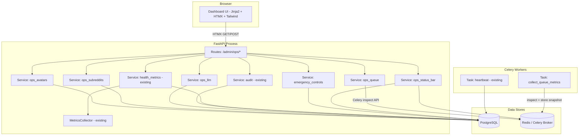

# Design Document: Ops Dashboard

## Overview

The Ops Dashboard extends the existing ThreddOps admin panel (`/admin/`) into a comprehensive operational control center. It consolidates queue monitoring, avatar health, subreddit collection tracking, Reddit API health, LLM cost visibility, audit logs, and emergency controls into a single unified interface.

The design builds on the existing architecture: FastAPI routes serve Jinja2 templates within `admin_base.html`, HTMX partials provide inline updates without full page reloads, and service-layer functions aggregate data from PostgreSQL (via SQLAlchemy) and Redis (via Celery inspection API).

### Design Principles

1. **Extend, don't replace** — The existing dashboard shell, operations_dashboard service, health_metrics service, and metrics_collector remain. New sections are additive.
2. **HTMX-first** — Each dashboard section is an independently refreshable partial with its own polling interval.
3. **Service-layer aggregation** — Route handlers stay thin; all business logic lives in `app/services/`.
4. **AWS-portable** — No local filesystem state. All data flows through PostgreSQL or Redis. Celery tasks handle background metric collection.
5. **Subreddit-centric** — Data is organized around subreddits and clients, not individual avatars.

## Architecture



### Data Flow

1. **Queue metrics**: The `ops_queue` service calls Celery's `inspect` API (active, reserved, scheduled) and queries Redis for failed/dead-letter task counts. Results are cached in Redis with a 15-second TTL to avoid hammering the broker on every poll.
2. **Avatar/Subreddit/LLM data**: Aggregated from PostgreSQL via SQLAlchemy queries in the respective service modules.
3. **Reddit API health**: Combines the existing `health_metrics.get_reddit_api_metrics()` (DB-based) with the in-memory `MetricsCollector` rate-limit snapshot.
4. **Emergency controls**: Read/write `SystemSetting` rows with well-known keys. All mutations create audit log entries.
5. **Auto-refresh**: Each HTMX partial includes `hx-trigger="every Xs"` for its configured polling interval. Error responses trigger a stale-data indicator via `hx-on::after-request` event handling.

## Components and Interfaces

### Route Layer: `app/routes/admin_ops.py`

New router mounted at `/admin/ops` (or integrated into existing `/admin/` router). Endpoints:

| Endpoint | Method | Returns | Polling |
|----------|--------|---------|---------|
| `/admin/ops/queues` | GET | Queue status partial | 30s |
| `/admin/ops/avatars` | GET | Avatar panel partial | — |
| `/admin/ops/subreddits` | GET | Subreddit tracker partial | — |
| `/admin/ops/reddit-health` | GET | Reddit API health partial | 60s |
| `/admin/ops/llm-usage` | GET | LLM usage partial | — |
| `/admin/ops/audit-log` | GET | Audit log partial | 60s |
| `/admin/ops/audit-log/export` | GET | CSV download | — |
| `/admin/ops/emergency` | GET | Emergency controls partial | — |
| `/admin/ops/emergency/{action}` | POST | Toast confirmation | — |
| `/admin/ops/status-bar` | GET | Global status bar partial | 30s |

All endpoints require `require_superuser` dependency.

### Service Layer

#### `app/services/ops_queue.py`

```python
def get_queue_status() -> QueueStatus:
    """Aggregate task counts by pipeline stage and state from Celery/Redis."""

def compute_stage_health(stage_counts: StageCounts) -> HealthIndicator:
    """Classify pipeline stage health: ok | warning | critical."""

def get_failed_tasks(stage: str | None, limit: int = 20) -> list[FailedTask]:
    """Retrieve recent failed tasks with error summaries."""
```

#### `app/services/ops_avatars.py`

```python
def get_avatar_panel_data(
    filters: AvatarFilters | None = None,
    sort_by: str = "username",
    sort_dir: str = "asc",
) -> list[AvatarPanelRow]:
    """Aggregate avatar data with health, rate limits, recent actions."""

def get_avatar_recent_actions(avatar_id: UUID, limit: int = 5) -> list[AvatarAction]:
    """Last N actions for a specific avatar."""

def get_avatar_error_counts_24h(db: Session) -> dict[UUID, int]:
    """Per-avatar Reddit API error counts in the last 24 hours."""
```

#### `app/services/ops_subreddits.py`

```python
def get_subreddit_tracker_data(
    filters: SubredditFilters | None = None,
) -> SubredditTrackerResult:
    """Per-subreddit scrape data with freshness, errors, scheduling."""

def compute_stale_status(last_scraped_at: datetime | None, threshold_hours: int = 24) -> bool:
    """Determine if a subreddit is stale based on last scrape time."""

def get_subreddit_aggregates(subreddits: list[SubredditRow]) -> SubredditAggregates:
    """Compute aggregate stats: total, stale, never-scraped, avg duration."""
```

#### `app/services/ops_llm.py`

```python
def get_llm_usage_data(
    time_window: TimeWindow,
    client_id: UUID | None = None,
) -> LLMUsageResult:
    """Aggregate LLM metrics for the given time window."""

def get_cost_breakdown(
    time_window: TimeWindow,
    dimension: str,  # "operation" | "client" | "model"
) -> list[CostBreakdownRow]:
    """Cost breakdown by the specified dimension."""

def check_budget_exceeded(db: Session) -> list[BudgetAlert]:
    """Check which clients have exceeded their daily LLM budget."""
```

#### `app/services/emergency_controls.py`

```python
# System setting keys for emergency states
EMERGENCY_KEYS = {
    "publishing_shutdown": "emergency.publishing_shutdown",
    "llm_generation_stop": "emergency.llm_generation_stop",
}

def get_emergency_states(db: Session) -> dict[str, EmergencyState]:
    """Read all emergency control states from system_settings."""

def activate_emergency(
    db: Session, control: str, user_id: UUID, reason: str
) -> None:
    """Activate an emergency control, record audit event."""

def deactivate_emergency(
    db: Session, control: str, user_id: UUID
) -> None:
    """Deactivate an emergency control, record audit event."""

def freeze_avatar(db: Session, avatar_id: UUID, reason: str, user_id: UUID) -> None:
    """Set avatar freeze_state with reason and audit trail."""

def blacklist_subreddit(db: Session, subreddit_id: UUID, reason: str, user_id: UUID) -> None:
    """Set subreddit blacklist status with reason and audit trail."""

def pause_client(db: Session, client_id: UUID, user_id: UUID) -> None:
    """Set client is_active=False with audit trail."""
```

#### `app/services/ops_status_bar.py`

```python
def get_status_bar_data(db: Session) -> StatusBarData:
    """Aggregate global status: emergency states, next run, pending reviews, critical badges."""

def get_nav_badges(db: Session) -> dict[str, int]:
    """Compute notification badge counts for each nav section."""
```

### Template Layer

```
templates/
├── admin_ops_dashboard.html          # Shell page with nav tabs + HTMX containers
├── partials/
│   ├── ops_status_bar.html           # Global status bar (emergency banners, next run)
│   ├── ops_queue_status.html         # Queue monitor section
│   ├── ops_avatar_panel.html         # Avatar status panel
│   ├── ops_subreddit_tracker.html    # Subreddit collection tracker
│   ├── ops_reddit_health.html        # Reddit API health
│   ├── ops_llm_usage.html            # LLM usage and costs
│   ├── ops_audit_log.html            # Audit log viewer
│   ├── ops_emergency_controls.html   # Emergency controls
│   └── ops_emergency_banner.html     # Persistent emergency state banner
```

Each partial is self-contained with its own `hx-trigger` for auto-refresh and includes a "last updated" timestamp footer.

## Data Models

### New Fields on Existing Models

#### `Avatar` model — add freeze fields:
```python
freeze_state: Mapped[bool] = mapped_column(Boolean, default=False)
freeze_reason: Mapped[str | None] = mapped_column(Text, nullable=True)
frozen_at: Mapped[datetime | None] = mapped_column(DateTime(timezone=True), nullable=True)
frozen_by: Mapped[uuid.UUID | None] = mapped_column(UUID(as_uuid=True), ForeignKey("users.id"), nullable=True)
```

#### `Subreddit` model — add blacklist fields:
```python
is_blacklisted: Mapped[bool] = mapped_column(Boolean, default=False)
blacklist_reason: Mapped[str | None] = mapped_column(Text, nullable=True)
blacklisted_at: Mapped[datetime | None] = mapped_column(DateTime(timezone=True), nullable=True)
blacklisted_by: Mapped[uuid.UUID | None] = mapped_column(UUID(as_uuid=True), ForeignKey("users.id"), nullable=True)
```

### New SystemSetting Keys

| Key | Type | Default | Description |
|-----|------|---------|-------------|
| `emergency.publishing_shutdown` | JSON | `{"active": false}` | Global publishing halt |
| `emergency.llm_generation_stop` | JSON | `{"active": false}` | Stop all AI task dispatch |
| `emergency.activated_by` | JSON | `{}` | Map of control → operator info |
| `budget.daily_limit_usd` | string | `"50.00"` | Default daily LLM budget per client |
| `budget.{client_id}.daily_limit_usd` | string | — | Per-client override |

### Service Data Classes

```python
@dataclass
class QueueStatus:
    stages: dict[str, StageCounts]  # scraping, scoring, generation, publishing
    overall_health: str  # ok | warning | critical

@dataclass
class StageCounts:
    pending: int
    running: int
    failed: int
    dead_letter: int
    health: str  # ok | warning | critical

@dataclass
class FailedTask:
    task_id: str
    stage: str
    failed_at: datetime
    error_summary: str
    args: dict | None

@dataclass
class AvatarPanelRow:
    id: UUID
    reddit_username: str
    active: bool
    warming_phase: int
    freeze_state: bool
    freeze_reason: str | None
    frozen_at: datetime | None
    karma_post: int
    karma_comment: int
    reddit_status: str
    last_health_check: datetime | None
    error_count_24h: int
    recent_actions: list[AvatarAction]
    client_names: list[str]

@dataclass
class SubredditTrackerRow:
    subreddit_id: UUID
    subreddit_name: str
    client_name: str
    client_id: UUID
    last_scraped_at: datetime | None
    posts_found: int
    posts_new: int
    errors: str | None
    is_stale: bool
    is_blacklisted: bool
    blacklist_reason: str | None
    duration_ms: int

@dataclass
class SubredditAggregates:
    total_active: int
    stale_count: int
    never_scraped_count: int
    avg_duration_ms: float

@dataclass
class LLMUsageResult:
    total_calls: int
    total_cost_usd: float
    avg_latency_ms: float
    error_count: int
    by_operation: list[CostBreakdownRow]
    by_client: list[CostBreakdownRow]
    by_model: list[CostBreakdownRow]
    budget_alerts: list[BudgetAlert]

@dataclass
class CostBreakdownRow:
    dimension_value: str  # operation name, client name, or model name
    call_count: int
    total_cost_usd: float

@dataclass
class BudgetAlert:
    client_id: UUID
    client_name: str
    daily_cost_usd: float
    daily_budget_usd: float

@dataclass
class EmergencyState:
    control: str
    active: bool
    activated_by: str | None  # operator email
    activated_at: datetime | None
    reason: str | None

@dataclass
class StatusBarData:
    emergency_states: list[EmergencyState]
    next_run_label: str | None
    next_run_in: str | None
    pending_reviews: int
    nav_badges: dict[str, int]
```

### Queue Metrics from Redis

Queue state is retrieved via Celery's inspection API:

```python
from app.tasks.worker import celery_app

def _inspect_queue_counts() -> dict:
    """Use Celery inspect to get active/reserved/scheduled tasks."""
    inspector = celery_app.control.inspect()
    active = inspector.active() or {}
    reserved = inspector.reserved() or {}
    scheduled = inspector.scheduled() or {}
    # Aggregate across all workers
    ...
```

Failed tasks are tracked via a Redis sorted set (`celery:failed:{stage}`) populated by a custom Celery signal handler on `task_failure`. Dead-letter tasks use a separate sorted set (`celery:dead_letter:{stage}`) populated when retry count is exhausted.

## Correctness Properties

*A property is a characteristic or behavior that should hold true across all valid executions of a system — essentially, a formal statement about what the system should do. Properties serve as the bridge between human-readable specifications and machine-verifiable correctness guarantees.*

### Property 1: Queue task counting preserves totals

*For any* set of tasks distributed across pipeline stages (scraping, scoring, generation, publishing) and states (pending, running, failed, dead-letter), the sum of all per-stage-per-state counts SHALL equal the total number of tasks in the input.

**Validates: Requirements 1.1, 1.2**

### Property 2: Queue health indicator classification

*For any* pipeline stage with a given count of failed tasks and dead-letter tasks, the health indicator SHALL be "critical" if dead_letter > 0, "warning" if failed > 5 and dead_letter == 0, and "ok" otherwise.

**Validates: Requirements 1.3, 1.4, 1.5**

### Property 3: Failed task display completeness

*For any* task in the failed state, the formatted output SHALL contain both a failure timestamp and a non-empty error summary string.

**Validates: Requirements 1.7**

### Property 4: Avatar panel data completeness

*For any* avatar record, the serialized panel row SHALL contain all required fields: reddit_username, active, warming_phase, freeze_state, freeze_reason (when frozen), karma_post, karma_comment, reddit_status, and last_health_check.

**Validates: Requirements 2.1, 2.2**

### Property 5: Per-avatar error count time-window correctness

*For any* set of error events with timestamps, the per-avatar 24-hour error count SHALL include only events whose timestamp falls within the last 24 hours and SHALL exclude all events outside that window.

**Validates: Requirements 2.3**

### Property 6: Avatar recent actions bounded retrieval

*For any* avatar with N actions in history (where N ≥ 0), the recent actions query SHALL return min(N, 5) items sorted by timestamp descending.

**Validates: Requirements 2.5**

### Property 7: Avatar filtering correctness

*For any* avatar collection and filter criteria (warming_phase, freeze_state, reddit_status, client_assignment), all returned avatars SHALL match every specified filter criterion, and no avatar matching all criteria SHALL be excluded from the result.

**Validates: Requirements 2.6**

### Property 8: Avatar sorting correctness

*For any* avatar collection and sort key (username, karma, last_health_check, warming_phase), the returned list SHALL be ordered according to the specified key and direction.

**Validates: Requirements 2.7**

### Property 9: Subreddit stale classification

*For any* subreddit with a last_scraped_at timestamp (or None), the stale classification SHALL return True if last_scraped_at is None or more than 24 hours ago, and False otherwise.

**Validates: Requirements 3.2**

### Property 10: Subreddit aggregate statistics correctness

*For any* collection of subreddit records, the aggregate function SHALL compute: total_active = len(collection), stale_count = count where is_stale is True, never_scraped_count = count where last_scraped_at is None, and avg_duration_ms = mean of all duration_ms values.

**Validates: Requirements 3.4, 3.5**

### Property 11: Subreddit filtering correctness

*For any* subreddit collection and filter criteria (client, stale status, blacklist status, error state), all returned subreddits SHALL match every specified filter criterion.

**Validates: Requirements 3.6**

### Property 12: Reddit API metrics aggregation

*For any* set of scrape log records within a time window, the aggregation function SHALL compute: total_calls = count of records, error_rate_pct = (error_count / total_calls) * 100, avg_response_ms = mean of duration_ms values, and p95_response_ms = 95th percentile of duration_ms values.

**Validates: Requirements 4.1**

### Property 13: Rate limit gauge color classification

*For any* usage percentage value (0–100 or None), the gauge_color function SHALL return "green" if < 60, "yellow" if 60–80, "red" if > 80, and "gray" if None.

**Validates: Requirements 4.2, 4.3**

### Property 14: Reddit error type classification

*For any* error message string, the classification function SHALL assign exactly one type from {rate_limited, forbidden, timeout, other} based on keyword matching, and the sum of all type counts SHALL equal the total error count.

**Validates: Requirements 4.4**

### Property 15: LLM aggregate metrics within time window

*For any* set of AIUsageLog records and a time window, the aggregation function SHALL include only records whose created_at falls within the window, and the computed total_calls, total_cost_usd, and avg_latency_ms SHALL reflect only those included records.

**Validates: Requirements 5.1, 5.7**

### Property 16: LLM cost breakdown dimensional consistency

*For any* set of AIUsageLog records grouped by a dimension (operation, client, or model), the sum of all per-group cost values SHALL equal the overall total cost, and the sum of all per-group call counts SHALL equal the overall total calls.

**Validates: Requirements 5.2, 5.3, 5.4**

### Property 17: Budget exceeded detection

*For any* client with a daily LLM cost and a configured daily budget, the budget alert SHALL be triggered if and only if daily_cost > daily_budget.

**Validates: Requirements 5.5**

### Property 18: Audit log filtering correctness

*For any* set of audit log entries and filter criteria (date_range, event_type, client_id, entity_type), all returned entries SHALL match every specified filter criterion, and no matching entry SHALL be excluded.

**Validates: Requirements 6.2**

### Property 19: Audit log text search

*For any* set of audit log entries and a search term, all returned entries SHALL contain the search term in either the message field or the serialized metadata field (case-insensitive).

**Validates: Requirements 6.3**

### Property 20: Audit log pagination and ordering

*For any* set of N audit log entries with page_size=50, the pagination SHALL produce ceil(N/50) pages, each page SHALL contain at most 50 entries, entries SHALL be in reverse chronological order, and the union of all pages SHALL equal the full result set.

**Validates: Requirements 6.4, 6.7**

### Property 21: Audit log CSV export round-trip

*For any* set of filtered audit log entries, the CSV export SHALL produce a parseable CSV file where the number of data rows equals the number of entries and all required columns (created_at, event_type, client_id, entity_type, entity_id, message) are present.

**Validates: Requirements 6.6**

### Property 22: Status bar data aggregation

*For any* system state (combination of emergency flags, scheduled runs, and pending review count), the status bar function SHALL return: the correct list of active emergency states, the next scheduled run label and time, and the accurate pending review count.

**Validates: Requirements 8.4**

### Property 23: Navigation badge detection

*For any* system state with critical conditions (circuit breaker open, dead-letter tasks > 0, shadowbanned avatars), the badge function SHALL return a non-zero badge count for the corresponding navigation section and zero for sections without critical conditions.

**Validates: Requirements 8.6**

## Error Handling

### Service Layer Errors

| Error Scenario | Handling Strategy |
|----------------|-------------------|
| Celery broker unreachable | Return cached queue data from Redis (15s TTL). Display stale indicator in UI. |
| Redis connection timeout | Catch `redis.ConnectionError`, return empty queue status with "unavailable" health. |
| Database query timeout | SQLAlchemy query timeout (30s). Return partial data with error message in response. |
| Celery inspect returns None | Treat as empty (no workers online). Display "No workers" warning in queue panel. |
| Emergency control activation fails | Roll back transaction, return error toast via HTMX partial. |
| CSV export with large result set | Stream response with `StreamingResponse`. Cap at 10,000 rows. |
| HTMX polling network failure | Client-side: `hx-on::after-request` detects non-2xx, shows stale indicator, retries in 10s. |

### Emergency Control Safety

- All emergency actions require a confirmation step (two-phase: GET renders confirmation modal, POST executes).
- Every activation/deactivation creates an `AuditLog` entry with `user_id`, `action`, and `details` (including reason).
- Emergency states are stored in `SystemSetting` with JSON values containing `active`, `activated_by`, `activated_at`, and `reason`.
- Pipeline tasks check emergency flags before execution: `is_publishing_allowed()`, `is_llm_generation_allowed()`.

### Graceful Degradation

- If a section's data source is unavailable, the partial renders with a "Data unavailable" message and a manual retry button.
- The dashboard shell always renders even if individual sections fail.
- Auto-refresh continues attempting even after failures (exponential backoff via HTMX `hx-trigger` with `retry` modifier is not native — instead, the partial itself returns a shorter polling interval on error).

## Testing Strategy

### Property-Based Tests (Hypothesis)

The project already uses Hypothesis (`.hypothesis/` directory present). Property tests will use `hypothesis` with `@given` decorators.

**Configuration:**
- Minimum 100 iterations per property test (`@settings(max_examples=100)`)
- Each test tagged with: `# Feature: ops-dashboard, Property {N}: {title}`
- Test file: `tests/test_ops_dashboard_properties.py`

**Properties to implement:**
- Properties 1–23 as defined in the Correctness Properties section above
- Focus on pure service-layer functions (no DB required for most properties)
- Use `@composite` strategies for generating complex domain objects (avatars, subreddits, tasks)

### Unit Tests (pytest)

- Emergency control activation/deactivation with audit trail verification
- HTMX partial rendering (verify correct `hx-trigger` attributes)
- Circuit breaker state transitions
- Budget threshold edge cases
- CSV export format validation
- Navigation badge logic for each critical condition type

### Integration Tests

- Full route tests with test database (existing pattern in `tests/`)
- Queue status endpoint with mocked Celery inspector
- Emergency control round-trip: activate → verify state → deactivate → verify restored
- Audit log filtering with real database queries
- LLM usage aggregation with seeded `ai_usage_log` records

### Test Organization

```
tests/
├── test_ops_dashboard_properties.py   # All 23 property-based tests
├── test_ops_queue_service.py          # Unit tests for queue service
├── test_ops_avatars_service.py        # Unit tests for avatar panel service
├── test_ops_subreddits_service.py     # Unit tests for subreddit tracker
├── test_ops_llm_service.py            # Unit tests for LLM usage service
├── test_emergency_controls.py         # Unit + integration for emergency controls
├── test_ops_audit_log.py              # Audit log filtering, search, export
└── test_ops_routes.py                 # Route integration tests
```
