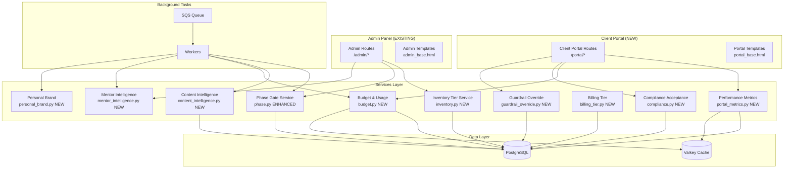

# Design Document: PRD Expansion — Tzvi Questions

## Overview

This design covers the formalization and implementation of 12 requirements identified during PRD review. The work spans three major domains:

1. **Avatar Lifecycle Engine** — Formal phase transition rules, inventory tier classification, and eligibility gating (Requirements 1–2)
2. **Client Compliance & Guardrails Framework** — Digital acceptance flows, override acknowledgment with audit trails, and liability transfer documentation (Requirements 3–4)
3. **Client Portal** — A new user-facing section providing performance dashboards, ROI indicators, usage tracking, and billing enforcement (Requirements 5–6, 11–12)
4. **Content Intelligence System** — Multi-input generation pipeline with quality scoring, tone fingerprinting, and output rules (Requirements 7–8)
5. **Phase 2 Modules** — Personal Brand Module and Competitor/Mentor Intelligence (Requirements 9–10)

The design integrates with the existing FastAPI/SQLAlchemy/HTMX stack, extending the current admin panel and adding a new Client Portal section accessible to client users (non-superuser accounts with `client_id` set).

## Architecture

### High-Level System Integration



### Design Decisions

| Decision | Choice | Rationale |
|----------|--------|-----------|
| Client Portal auth | Reuse existing JWT + `client_id` on User model | No new auth system needed; `is_superuser=False` + `client_id IS NOT NULL` = client user |
| Portal templates | New `portal_base.html` (light theme) | Distinct from admin; clients see a clean, branded interface |
| Compliance audit storage | Append-only table with no UPDATE/DELETE grants | Legal requirement for immutable records |
| Usage counters | Valkey atomic increments + PostgreSQL monthly snapshots | Real-time enforcement via Valkey; durable history in PG |
| Tone Fingerprint refresh | SQS scheduled task every 7 days | Matches Historical Intelligence refresh cadence |
| GCM scoring | Gemini Flash (cheap, fast) | Scoring is high-volume; Claude Sonnet too expensive for quality checks |
| Personal Brand Module | Phase 2 — separate routes/models | Distinct user type (individual vs. agency client) |

## Components and Interfaces

### New Route Modules

| Module | Path Prefix | Auth | Purpose |
|--------|-------------|------|---------|
| `routes/portal.py` | `/portal` | JWT + client_id required | Client Portal pages |
| `routes/portal_api.py` | `/api/portal` | JWT + client_id required | Portal HTMX endpoints |
| `routes/compliance.py` | `/portal/compliance` | JWT + client_id required | Compliance acceptance flow |
| `routes/personal_brand.py` | `/portal/brand` | JWT + client_id required | Personal Brand Module (Phase 2) |

### New Service Modules

| Module | Responsibility |
|--------|---------------|
| `services/inventory.py` | Tier classification, re-evaluation, assignment eligibility |
| `services/compliance.py` | Acceptance flow, version management, re-acceptance enforcement |
| `services/guardrail_override.py` | Override lifecycle (request → acknowledge → activate → expire/revoke) |
| `services/portal_metrics.py` | Per-avatar, per-subreddit, campaign-level metric aggregation |
| `services/roi_metrics.py` | Cost-per-engagement, quality score, brand visibility calculations |
| `services/content_intelligence.py` | Historical Intelligence, Tone Fingerprint, context assembly |
| `services/gcm_scoring.py` | Genuine Community Member Score evaluation |
| `services/budget.py` | Usage tracking, limit enforcement, alert generation |
| `services/billing_tier.py` | Resource limit validation, upgrade/downgrade logic |
| `services/personal_brand.py` | OAuth connection, suggestion generation, auto-publish |
| `services/mentor_intelligence.py` | Tracked avatar polling, digest generation, opportunity alerts |

### New Task Modules

| Module | Queue | Schedule |
|--------|-------|----------|
| `tasks/intelligence.py` | `intelligence-queue` | Every 7 days per subreddit |
| `tasks/usage_reset.py` | `maintenance-queue` | 00:00 UTC 1st of month |
| `tasks/override_expiry.py` | `maintenance-queue` | Every 60 seconds |
| `tasks/mentor_poll.py` | `intelligence-queue` | Every 6 hours |
| `tasks/personal_brand_scan.py` | `intelligence-queue` | Every 6 hours |
| `tasks/budget_alerts.py` | `maintenance-queue` | On usage increment (inline check) |

### Dependencies (New)

| Dependency | Purpose |
|------------|---------|
| `httpx` | Reddit OAuth for Personal Brand Module |

No new infrastructure dependencies — all new features run on existing EC2 + PostgreSQL + SQS + Valkey stack.

## Data Models

### New Models

#### `InventoryTier` (enum on Avatar model)

```python
# Added to app/models/avatar.py
class InventoryTierEnum(str, enum.Enum):
    unclassified = "unclassified"
    silver = "silver"
    gold = "gold"

# New fields on Avatar:
inventory_tier: Mapped[str] = mapped_column(String(20), default="unclassified")
tier_evaluated_at: Mapped[datetime | None] = mapped_column(DateTime(timezone=True), nullable=True)
avatar_type: Mapped[str] = mapped_column(String(20), default="managed")  # managed | tracked | personal
```

#### `ComplianceAcceptance` (NEW model)

```python
class ComplianceAcceptance(Base):
    __tablename__ = "compliance_acceptances"

    id: Mapped[uuid.UUID] = mapped_column(UUID(as_uuid=True), primary_key=True, default=uuid.uuid4)
    client_id: Mapped[uuid.UUID] = mapped_column(UUID(as_uuid=True), ForeignKey("clients.id"), nullable=False)
    user_id: Mapped[uuid.UUID] = mapped_column(UUID(as_uuid=True), ForeignKey("users.id"), nullable=False)
    document_version: Mapped[str] = mapped_column(String(50), nullable=False)
    accepted_at: Mapped[datetime] = mapped_column(DateTime(timezone=True), server_default=func.now())
    ip_address: Mapped[str] = mapped_column(String(45), nullable=False)  # IPv4/IPv6
    acknowledgment_items: Mapped[dict] = mapped_column(JSONB, nullable=False)  # {item_key: True}
    # NO updated_at — append-only
```

#### `GuardrailOverride` (NEW model)

```python
class GuardrailOverride(Base):
    __tablename__ = "guardrail_overrides"

    id: Mapped[uuid.UUID] = mapped_column(UUID(as_uuid=True), primary_key=True, default=uuid.uuid4)
    client_id: Mapped[uuid.UUID] = mapped_column(UUID(as_uuid=True), ForeignKey("clients.id"), nullable=False)
    override_type: Mapped[str] = mapped_column(String(100), nullable=False)
    previous_value: Mapped[str] = mapped_column(String(255), nullable=False)
    new_value: Mapped[str] = mapped_column(String(255), nullable=False)
    status: Mapped[str] = mapped_column(String(20), default="pending")  # pending | active | expired | revoked
    requested_at: Mapped[datetime] = mapped_column(DateTime(timezone=True), server_default=func.now())
    acknowledged_at: Mapped[datetime | None] = mapped_column(DateTime(timezone=True), nullable=True)
    acknowledged_by: Mapped[str | None] = mapped_column(String(255), nullable=True)  # typed name
    expires_at: Mapped[datetime | None] = mapped_column(DateTime(timezone=True), nullable=True)
    revoked_at: Mapped[datetime | None] = mapped_column(DateTime(timezone=True), nullable=True)
    revoked_by: Mapped[uuid.UUID | None] = mapped_column(UUID(as_uuid=True), nullable=True)
    risk_description: Mapped[str] = mapped_column(Text, nullable=False)
```

#### `SubredditIntelligence` (NEW model)

```python
class SubredditIntelligence(Base):
    __tablename__ = "subreddit_intelligence"

    id: Mapped[uuid.UUID] = mapped_column(UUID(as_uuid=True), primary_key=True, default=uuid.uuid4)
    subreddit_id: Mapped[uuid.UUID] = mapped_column(UUID(as_uuid=True), ForeignKey("subreddits.id"), nullable=False, unique=True)
    # Tone Fingerprint
    median_comment_length: Mapped[int | None] = mapped_column(Integer, nullable=True)
    formality_level: Mapped[int | None] = mapped_column(Integer, nullable=True)  # 1-5
    humor_frequency: Mapped[float | None] = mapped_column(Float, nullable=True)  # 0.0-1.0
    jargon_density: Mapped[float | None] = mapped_column(Float, nullable=True)  # 0.0-1.0
    citation_frequency: Mapped[float | None] = mapped_column(Float, nullable=True)  # 0.0-1.0
    median_karma: Mapped[float | None] = mapped_column(Float, nullable=True)
    # Historical Intelligence
    top_comments: Mapped[dict | None] = mapped_column(JSONB, nullable=True)  # [{text, karma, author, date}]
    topic_clusters: Mapped[dict | None] = mapped_column(JSONB, nullable=True)  # [{label, keywords, count}]
    argument_patterns: Mapped[dict | None] = mapped_column(JSONB, nullable=True)  # [{pattern, examples, avg_karma}]
    sample_count: Mapped[int] = mapped_column(Integer, default=0)
    last_refreshed_at: Mapped[datetime | None] = mapped_column(DateTime(timezone=True), nullable=True)
    created_at: Mapped[datetime] = mapped_column(DateTime(timezone=True), server_default=func.now())
```

#### `ClientUsage` (NEW model)

```python
class ClientUsage(Base):
    __tablename__ = "client_usage"

    id: Mapped[uuid.UUID] = mapped_column(UUID(as_uuid=True), primary_key=True, default=uuid.uuid4)
    client_id: Mapped[uuid.UUID] = mapped_column(UUID(as_uuid=True), ForeignKey("clients.id"), nullable=False)
    period_start: Mapped[datetime] = mapped_column(DateTime(timezone=True), nullable=False)
    period_end: Mapped[datetime] = mapped_column(DateTime(timezone=True), nullable=False)
    comments_generated: Mapped[int] = mapped_column(Integer, default=0)
    comments_posted: Mapped[int] = mapped_column(Integer, default=0)
    posts_created: Mapped[int] = mapped_column(Integer, default=0)
    llm_tokens_consumed: Mapped[int] = mapped_column(Integer, default=0)
    reddit_api_calls: Mapped[int] = mapped_column(Integer, default=0)
    is_paused: Mapped[bool] = mapped_column(Boolean, default=False)
    paused_at: Mapped[datetime | None] = mapped_column(DateTime(timezone=True), nullable=True)

    __table_args__ = (
        UniqueConstraint("client_id", "period_start", name="uq_client_usage_period"),
    )
```

#### `ExternalIntelligence` (NEW model)

```python
class ExternalIntelligence(Base):
    __tablename__ = "external_intelligence"

    id: Mapped[uuid.UUID] = mapped_column(UUID(as_uuid=True), primary_key=True, default=uuid.uuid4)
    client_id: Mapped[uuid.UUID] = mapped_column(UUID(as_uuid=True), ForeignKey("clients.id"), nullable=False)
    title: Mapped[str] = mapped_column(String(500), nullable=False)
    content: Mapped[str] = mapped_column(Text, nullable=False)
    source_url: Mapped[str | None] = mapped_column(String(1000), nullable=True)
    keywords: Mapped[dict | None] = mapped_column(JSONB, nullable=True)  # extracted topic keywords
    is_active: Mapped[bool] = mapped_column(Boolean, default=True)
    created_at: Mapped[datetime] = mapped_column(DateTime(timezone=True), server_default=func.now())
```

#### `TrackedAvatar` (NEW model)

```python
class TrackedAvatar(Base):
    __tablename__ = "tracked_avatars"

    id: Mapped[uuid.UUID] = mapped_column(UUID(as_uuid=True), primary_key=True, default=uuid.uuid4)
    client_id: Mapped[uuid.UUID] = mapped_column(UUID(as_uuid=True), ForeignKey("clients.id"), nullable=False)
    reddit_username: Mapped[str] = mapped_column(String(255), nullable=False)
    label: Mapped[str] = mapped_column(String(100), default="competitor")  # competitor | mentor
    is_active: Mapped[bool] = mapped_column(Boolean, default=True)
    last_polled_at: Mapped[datetime | None] = mapped_column(DateTime(timezone=True), nullable=True)
    last_activity_at: Mapped[datetime | None] = mapped_column(DateTime(timezone=True), nullable=True)
    inactive_since: Mapped[datetime | None] = mapped_column(DateTime(timezone=True), nullable=True)
    created_at: Mapped[datetime] = mapped_column(DateTime(timezone=True), server_default=func.now())

    __table_args__ = (
        UniqueConstraint("client_id", "reddit_username", name="uq_tracked_avatar_client_username"),
    )
```

#### `TrackedActivity` (NEW model)

```python
class TrackedActivity(Base):
    __tablename__ = "tracked_activities"

    id: Mapped[uuid.UUID] = mapped_column(UUID(as_uuid=True), primary_key=True, default=uuid.uuid4)
    tracked_avatar_id: Mapped[uuid.UUID] = mapped_column(UUID(as_uuid=True), ForeignKey("tracked_avatars.id"), nullable=False)
    activity_type: Mapped[str] = mapped_column(String(20), nullable=False)  # post | comment
    subreddit: Mapped[str] = mapped_column(String(255), nullable=False)
    thread_title: Mapped[str | None] = mapped_column(String(500), nullable=True)
    content_summary: Mapped[str] = mapped_column(String(300), nullable=False)
    karma: Mapped[int] = mapped_column(Integer, default=0)
    reddit_id: Mapped[str] = mapped_column(String(20), nullable=False)
    posted_at: Mapped[datetime] = mapped_column(DateTime(timezone=True), nullable=False)
    created_at: Mapped[datetime] = mapped_column(DateTime(timezone=True), server_default=func.now())
```

#### `PersonalBrandAccount` (NEW model — Phase 2)

```python
class PersonalBrandAccount(Base):
    __tablename__ = "personal_brand_accounts"

    id: Mapped[uuid.UUID] = mapped_column(UUID(as_uuid=True), primary_key=True, default=uuid.uuid4)
    user_id: Mapped[uuid.UUID] = mapped_column(UUID(as_uuid=True), ForeignKey("users.id"), nullable=False, unique=True)
    reddit_username: Mapped[str] = mapped_column(String(255), nullable=False)
    oauth_token_encrypted: Mapped[str | None] = mapped_column(Text, nullable=True)
    oauth_refresh_token_encrypted: Mapped[str | None] = mapped_column(Text, nullable=True)
    expertise_topics: Mapped[dict | None] = mapped_column(JSONB, nullable=True)  # ["topic1", ...]
    preferred_tone: Mapped[str | None] = mapped_column(String(50), nullable=True)
    target_subreddits: Mapped[dict | None] = mapped_column(JSONB, nullable=True)  # ["sub1", ...]
    mentor_accounts: Mapped[dict | None] = mapped_column(JSONB, nullable=True)  # ["user1", ...]
    auto_publish: Mapped[bool] = mapped_column(Boolean, default=False)
    auto_publish_confirmed_at: Mapped[datetime | None] = mapped_column(DateTime(timezone=True), nullable=True)
    daily_auto_publish_count: Mapped[int] = mapped_column(Integer, default=0)
    last_scan_at: Mapped[datetime | None] = mapped_column(DateTime(timezone=True), nullable=True)
    is_active: Mapped[bool] = mapped_column(Boolean, default=True)
    created_at: Mapped[datetime] = mapped_column(DateTime(timezone=True), server_default=func.now())
```

### Modified Models

#### `Client` — New Fields

```python
# Added to app/models/client.py
plan_tier: Mapped[str] = mapped_column(String(20), default="seed")  # seed | starter | growth | scale
monthly_fee: Mapped[float] = mapped_column(Float, default=149.0)
compliance_accepted: Mapped[bool] = mapped_column(Boolean, default=False)
compliance_version: Mapped[str | None] = mapped_column(String(50), nullable=True)
compliance_accepted_at: Mapped[datetime | None] = mapped_column(DateTime(timezone=True), nullable=True)
pipeline_suspended: Mapped[bool] = mapped_column(Boolean, default=False)
pipeline_suspended_reason: Mapped[str | None] = mapped_column(String(255), nullable=True)
```

#### `Avatar` — New Fields

```python
# Added to app/models/avatar.py (in addition to inventory_tier above)
brand_mention_ratio_7d: Mapped[float] = mapped_column(Float, default=0.0)  # cached, updated periodically
ratio_updated_at: Mapped[datetime | None] = mapped_column(DateTime(timezone=True), nullable=True)
```

### Plan Tier Limits (Configuration)

```python
PLAN_LIMITS = {
    "seed": {
        "avatars": 1,
        "subreddits": 1,
        "comments_per_month": 30,
        "posts_per_month": 0,
        "tracked_avatars": 0,
    },
    "starter": {
        "avatars": 3,
        "subreddits": 2,
        "comments_per_month": 60,
        "posts_per_month": 0,
        "tracked_avatars": 0,
    },
    "growth": {
        "avatars": 7,
        "subreddits": 5,
        "comments_per_month": 150,
        "posts_per_month": 10,
        "tracked_avatars": 10,
    },
    "scale": {
        "avatars": 15,
        "subreddits": 50,
        "comments_per_month": 400,
        "posts_per_month": 400,  # combined actions
        "tracked_avatars": 10,
    },
}
```

## Correctness Properties

*A property is a characteristic or behavior that should hold true across all valid executions of a system — essentially, a formal statement about what the system should do. Properties serve as the bridge between human-readable specifications and machine-verifiable correctness guarantees.*

### Property 1: Phase Policy Content Restrictions

*For any* avatar in a given warming phase, and *for any* comment text and target subreddit, the phase policy SHALL:
- Block all brand mentions and non-hobby subreddits in Phase 1
- Block explicit brand names and brand links in Phase 2
- Block brand mentions when Brand_Mention_Ratio >= 15% in Phase 3

**Validates: Requirements 1.1, 1.4, 1.5, 1.9**

### Property 2: Phase Gate Eligibility

*For any* avatar with given (karma, account_age, removal_rate) values, the phase gate eligibility function SHALL return True if and only if all thresholds for the target phase are met:
- Phase 1→2: karma >= 500 AND age >= 3 months
- Phase 2→3: karma >= 2000 AND age >= 6 months AND removal_rate < 5%

**Validates: Requirements 1.2, 1.3**

### Property 3: Inventory Tier Classification

*For any* avatar with given (combined_karma, account_age_months), the tier classification function SHALL deterministically assign:
- Gold when karma >= 2000 AND age >= 6 months
- Silver when karma in [500, 1999] AND age in [3, 5] months
- Unclassified otherwise

Re-classification after karma changes SHALL always produce the correct tier for the new values.

**Validates: Requirements 2.1, 2.2, 2.3, 2.5**

### Property 4: Compliance Gates Pipeline Activation

*For any* client, pipeline activation SHALL be blocked if and only if `compliance_accepted` is False or `compliance_version` does not match the current system compliance version.

**Validates: Requirements 3.3, 3.4**

### Property 5: Client Data Isolation

*For any* client portal query, the result set SHALL contain only records where `client_id` matches the authenticated user's `client_id`. No query from the portal layer SHALL return data belonging to a different client.

**Validates: Requirements 5.7**

### Property 6: Plan Limit Enforcement

*For any* (plan_tier, resource_type, current_count) tuple:
- Resource addition SHALL be rejected when current_count >= tier limit for that resource_type
- Comment generation SHALL be blocked when monthly usage >= tier's monthly action limit
- The correct limit SHALL be applied based on the tier lookup table

**Validates: Requirements 11.2, 11.4, 12.1, 12.2**

### Property 7: Genuine Community Member Score Calculation

*For any* five dimension scores (each 1–10), the overall GCM score SHALL equal the unweighted arithmetic mean of the five scores, and a comment SHALL be rejected if and only if this score is below 7.0.

**Validates: Requirements 7.5, 7.6**

### Property 8: Comment Length Calibration

*For any* generated comment and subreddit with a Tone_Fingerprint containing median_comment_length (with sample_count >= 10), the comment SHALL be accepted if and only if its word count is within ±20% of the median. If sample_count < 10, the acceptable range SHALL be 50–200 words.

**Validates: Requirements 8.1**

### Property 9: Tracked Avatar Read-Only Invariant

*For any* avatar with `avatar_type = "tracked"`, all post and comment operations SHALL be rejected. No code path SHALL permit content creation from a tracked avatar.

**Validates: Requirements 10.5**

### Property 10: Budget Alert Threshold

*For any* client with plan limit L and current usage U, a Budget_Alert SHALL be triggered when U crosses the 80% threshold (U >= 0.8 * L) and SHALL NOT be triggered when U < 0.8 * L.

**Validates: Requirements 11.3**

### Property 11: Usage Counter Month Reset

*For any* client, when the current date crosses a calendar month boundary (from last day of month M to first day of month M+1), all usage counters SHALL reset to zero and any active pause SHALL be lifted.

**Validates: Requirements 11.1, 11.7**

### Property 12: Override Time Validation

*For any* guardrail override request:
- The expiration date SHALL be rejected if it exceeds 90 days from activation
- A pending (unacknowledged) request SHALL be expired if 30 minutes elapse without acknowledgment

**Validates: Requirements 4.2, 4.4**

### Property 13: Keyword Opportunity Alert Generation

*For any* tracked avatar activity in a thread, an opportunity alert SHALL be generated if and only if at least one of the client's configured keywords appears in the thread title or body.

**Validates: Requirements 10.4**

### Property 14: Brand Ratio Calculation

*For any* avatar with a set of comments in the trailing 7-day window, the Brand_Mention_Ratio SHALL equal (count of comments containing brand mentions) / (total comments in window). When total comments is zero, the ratio SHALL be 0.0.

**Validates: Requirements 1.5, 1.9**

## Error Handling

### Service-Level Error Strategy

| Service | Error Type | Handling |
|---------|-----------|----------|
| Phase Gate | DB query failure | Log error, skip evaluation, retry next cycle |
| Inventory Tier | Calculation error | Retain current tier, log warning |
| Compliance | Acceptance storage failure | Return 500, do NOT mark as accepted |
| Guardrail Override | Expiry task failure | Retry via SQS DLQ, override remains active until successful revert |
| Portal Metrics | Aggregation timeout | Return cached data from Valkey (stale but available) |
| Content Intelligence | LLM failure during scoring | Skip GCM scoring, flag for manual review |
| Budget | Counter increment failure | Allow action (fail-open for UX), log overage |
| Billing Tier | Limit check failure | Block action (fail-closed for safety) |
| Personal Brand | OAuth token expired | Mark account inactive, prompt re-auth |
| Mentor Intelligence | PRAW rate limit | Backoff, retry next poll cycle |

### Critical Invariants

1. **Compliance acceptance is never lost** — append-only table, no UPDATE/DELETE
2. **Budget enforcement is eventually consistent** — Valkey for real-time, PG for durability
3. **Phase transitions are atomic** — distributed lock via Valkey prevents concurrent transitions
4. **Override revert is guaranteed** — SQS DLQ ensures expiry task eventually executes
5. **Client isolation is enforced at query level** — all portal queries include `client_id` filter

### Graceful Degradation

- If Valkey is unavailable: usage checks fall back to PostgreSQL (slower but correct)
- If LLM is unavailable: GCM scoring skipped, comments flagged for manual review
- If Reddit API rate-limited: mentor polling deferred, no data loss
- If SQS is unavailable: scheduled tasks queue locally, retry on reconnection

## Testing Strategy

### Property-Based Testing (Hypothesis)

The following properties are suitable for property-based testing and will use the `hypothesis` library (already in the project):

| Property | Test File | Min Iterations |
|----------|-----------|----------------|
| Phase Policy Restrictions | `tests/properties/test_phase_policy_props.py` | 200 |
| Phase Gate Eligibility | `tests/properties/test_phase_gate_props.py` | 200 |
| Inventory Tier Classification | `tests/properties/test_inventory_tier_props.py` | 200 |
| Plan Limit Enforcement | `tests/properties/test_plan_limits_props.py` | 200 |
| GCM Score Calculation | `tests/properties/test_gcm_score_props.py` | 100 |
| Comment Length Calibration | `tests/properties/test_length_calibration_props.py` | 100 |
| Budget Alert Threshold | `tests/properties/test_budget_alert_props.py` | 100 |
| Override Time Validation | `tests/properties/test_override_time_props.py` | 100 |
| Brand Ratio Calculation | `tests/properties/test_brand_ratio_props.py` | 200 |
| Client Data Isolation | `tests/properties/test_data_isolation_props.py` | 100 |

**Configuration:**
- Library: `hypothesis` (already installed)
- Each test tagged with: `# Feature: prd-expansion-tzvi-questions, Property N: <title>`
- Minimum 100 iterations per property (Hypothesis default is 100, some bumped to 200)

### Unit Tests (Example-Based)

| Area | Test File | Coverage |
|------|-----------|----------|
| Compliance acceptance flow | `tests/test_compliance.py` | Happy path, missing items, re-acceptance |
| Guardrail override lifecycle | `tests/test_guardrail_override.py` | Request → acknowledge → expire/revoke |
| Portal metrics aggregation | `tests/test_portal_metrics.py` | Known data → expected metrics |
| ROI calculations | `tests/test_roi_metrics.py` | Edge cases (zero engagements, etc.) |
| Tracked avatar CRUD | `tests/test_tracked_avatar.py` | Create, poll, deactivate |
| Personal Brand OAuth | `tests/test_personal_brand.py` | Success, failure, retry |
| Content intelligence assembly | `tests/test_content_intelligence.py` | All layers present, partial layers |

### Integration Tests

| Area | Test File | What's Tested |
|------|-----------|---------------|
| Pipeline with budget limits | `tests/integration/test_budget_pipeline.py` | Generation blocked at limit |
| Compliance → pipeline gate | `tests/integration/test_compliance_gate.py` | Pipeline blocked without acceptance |
| Override expiry task | `tests/integration/test_override_expiry.py` | SQS task reverts override |
| Mentor polling | `tests/integration/test_mentor_poll.py` | PRAW mock → activity recorded |
| Month boundary reset | `tests/integration/test_month_reset.py` | Counters reset, pause lifted |
