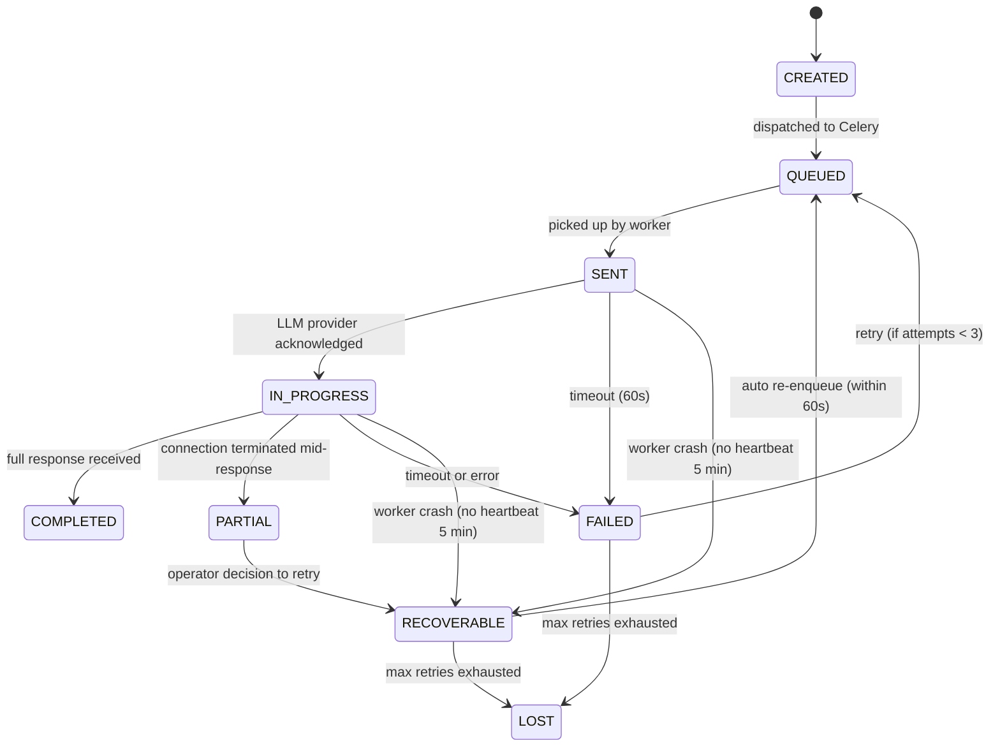

# Design Document: Production Readiness Audit

## Overview

The Production Readiness Audit system is an automated audit engine that executes structured checks across 8 audit blocks (Data Leakage, Credit Integrity, Rate Limit Coverage, LLM Reliability, Flow Completeness, Spec Coverage, Technical Debt, Bypass Detection), collects findings into a PostgreSQL-backed store, surfaces them on a unified HTMX admin dashboard with traffic-light GO/NO-GO indicators, and generates a Markdown report document.

The system integrates into the existing RAMP platform as:
- A new service layer (app/services/audit/) containing 8 audit block runners + orchestrator
- New SQLAlchemy models for findings and audit runs
- A new admin route at /admin/production-readiness
- A Celery task for background audit execution
- A report generator producing AUDIT_REPORT_{date}.md

### Design Decisions

1. **Modular audit blocks**: Each of the 8 audit concerns is an independent runner implementing a common AuditBlock interface. This allows running blocks independently, adding new blocks later, and isolating failures.
2. **Database-backed findings**: Findings persist in PostgreSQL rather than ephemeral memory so the dashboard can query/filter them without re-running audits.
3. **Async execution via Celery**: Full audits may take minutes (code scanning, DB queries). Celery tasks run each block in parallel where possible.
4. **HTMX partial updates**: The dashboard uses the same HTMX pattern as other admin pages -- partial re-renders on state change without full page reloads.
5. **Static + runtime analysis**: Some blocks (Rate Limit, Bypass, Debt) perform AST/grep-based static analysis of the codebase. Others (Credit Integrity, LLM Reliability, Flow Completeness) query runtime data from the database.
6. **No LLM dependency**: The audit engine itself does NOT call LLMs. All checks are deterministic code analysis or database queries.

## Architecture

### System Architecture Diagram

```mermaid
graph TB
    subgraph Trigger Layer
        ADMIN[Admin UI: Run Audit Button]
        CELERY_BEAT[Celery Beat: Scheduled Audit]
        API[API: POST /api/admin/audit/run]
    end

    subgraph Orchestrator
        ENGINE[AuditEngine Orchestrator]
    end

    subgraph Audit Blocks
        B1[DataPathAnalyzer]
        B2[CreditIntegrityChecker]
        B3[RateLimitAuditor]
        B4[LLMReliabilityMonitor]
        B5[FlowCompletenessScanner]
        B6[SpecCoverageTracker]
        B7[DebtRadar]
        B8[BypassDetector]
    end

    subgraph Data Sources
        DB[(PostgreSQL)]
        REDIS[(Redis)]
        FS[Filesystem: app/]
        AST[Python AST Parser]
    end

    subgraph Output Layer
        FINDINGS[(audit_findings table)]
        DASHBOARD[Production Dashboard UI]
        REPORT[AUDIT_REPORT_{date}.md]
    end

    ADMIN --> ENGINE
    CELERY_BEAT --> ENGINE
    API --> ENGINE

    ENGINE --> B1
    ENGINE --> B2
    ENGINE --> B3
    ENGINE --> B4
    ENGINE --> B5
    ENGINE --> B6
    ENGINE --> B7
    ENGINE --> B8

    B1 --> DB
    B1 --> REDIS
    B1 --> FS
    B2 --> DB
    B3 --> FS
    B3 --> AST
    B4 --> DB
    B5 --> DB
    B5 --> FS
    B6 --> FS
    B6 --> AST
    B7 --> FS
    B7 --> AST
    B7 --> DB
    B8 --> FS
    B8 --> AST
    B8 --> DB

    B1 --> FINDINGS
    B2 --> FINDINGS
    B3 --> FINDINGS
    B4 --> FINDINGS
    B5 --> FINDINGS
    B6 --> FINDINGS
    B7 --> FINDINGS
    B8 --> FINDINGS

    FINDINGS --> DASHBOARD
    FINDINGS --> REPORT
```

### Execution Flow

1. Operator triggers audit (UI button, API call, or Celery Beat schedule)
2. AuditEngine creates an AuditRun record (status=running)
3. Engine dispatches each block as a Celery subtask (group)
4. Each block:
   a. Performs its specific analysis (static code scan, DB queries, Redis inspection)
   b. Creates AuditFinding records for each issue detected
   c. Updates its block status (completed/failed)
5. When all blocks complete, Engine:
   a. Updates AuditRun status to completed
   b. Triggers report generation
   c. Emits ActivityEvent for audit completion

### File Structure

```
app/
  services/
    audit/
      __init__.py              # AuditEngine orchestrator
      base.py                  # AuditBlock ABC + shared types
      data_path_analyzer.py    # Req 1: External data leakage
      credit_integrity.py      # Req 2: Usage accounting
      rate_limit_auditor.py    # Req 3: Rate limit coverage
      llm_reliability.py       # Req 4: LLM response delivery
      flow_completeness.py     # Req 5: Flow terminal states
      spec_coverage.py         # Req 6: Spec mapping
      debt_radar.py            # Req 7: Technical debt scan
      bypass_detector.py       # Req 8: Bypass path detection
      report_generator.py      # Req 10: Markdown report
      observability_rules.py   # Req 11: Observability enforcement
  models/
    audit_finding.py           # AuditFinding + AuditRun models
  routes/
    admin_audit.py             # /admin/production-readiness routes
  tasks/
    audit.py                   # Celery tasks for audit execution
  templates/
    admin_production_readiness.html    # Dashboard page
    partials/
      audit_findings_table.html       # HTMX partial for findings
      audit_summary_header.html       # HTMX partial for summary
      audit_block_status.html         # HTMX partial per block
```

## Components and Interfaces

### AuditBlock Interface (Abstract Base Class)

```python
from abc import ABC, abstractmethod
from dataclasses import dataclass
from datetime import datetime
from enum import Enum
from typing import Optional
from uuid import UUID


class Severity(str, Enum):
    RED = "red"
    YELLOW = "yellow"
    GREEN = "green"


class Decision(str, Enum):
    FIX_BEFORE_RELEASE = "fix_before_release"
    DEFER_TO_POST_RELEASE = "defer_to_post_release"
    ACCEPT = "accept"


class FixEffort(str, Enum):
    S = "S"   # 1-4 hours
    M = "M"   # 4-16 hours
    L = "L"   # 16-40 hours
    XL = "XL" # 40+ hours


class AuditBlockName(str, Enum):
    DATA_LEAKAGE = "data_leakage"
    CREDIT_INTEGRITY = "credit_integrity"
    RATE_LIMIT_COVERAGE = "rate_limit_coverage"
    LLM_RELIABILITY = "llm_reliability"
    FLOW_COMPLETENESS = "flow_completeness"
    SPEC_COVERAGE = "spec_coverage"
    TECHNICAL_DEBT = "technical_debt"
    BYPASS_DETECTION = "bypass_detection"


class BlockStatus(str, Enum):
    PENDING = "pending"
    RUNNING = "running"
    COMPLETED = "completed"
    FAILED = "failed"


@dataclass
class FindingInput:
    """Data required to create a finding."""
    title: str                         # max 120 chars
    severity: Severity
    block: AuditBlockName
    category: str                      # e.g. "reliability", "security"
    risk_description: str              # max 500 chars
    owner: str                         # assigned person/team
    effort: FixEffort
    risk_if_unresolved: str            # max 200 chars
    requirement_ref: str               # e.g. "1.2", "7.3"
    data_path: Optional[str] = None    # where violation occurred
    eta: Optional[str] = None          # YYYY-MM-DD or None


class AuditBlock(ABC):
    """Interface all audit blocks must implement."""

    @property
    @abstractmethod
    def name(self) -> AuditBlockName:
        ...

    @abstractmethod
    async def run(self, run_id: UUID, db_session) -> list[FindingInput]:
        """Execute the audit block and return findings.

        Args:
            run_id: The parent AuditRun ID
            db_session: SQLAlchemy async session

        Returns:
            List of findings to persist
        """
        ...
```

### AuditEngine Orchestrator

```python
class AuditEngine:
    """Orchestrates audit block execution and finding persistence."""

    def __init__(self, db_session, blocks: list[AuditBlock]):
        self.db = db_session
        self.blocks = blocks

    async def run_full_audit(self) -> UUID:
        """Create AuditRun, execute all blocks, persist findings, generate report."""
        ...

    async def run_single_block(self, block_name: AuditBlockName) -> UUID:
        """Run a single audit block (for re-checks after fixes)."""
        ...

    def calculate_go_no_go(self, findings: list) -> bool:
        """True = GO, False = NO-GO.
        Any RED finding without accepted exemption = NO-GO.
        """
        ...

    def calculate_incident_probability(self, findings: list) -> int:
        """min(100, red_count * 15 + yellow_count * 5)"""
        ...
```

### Report Generator

```python
class ReportGenerator:
    """Generates AUDIT_REPORT_{date}.md from persisted findings."""

    def generate(self, run_id: UUID, db_session) -> str:
        """Produce Markdown report content.

        Sections:
        1. Executive Summary (GO/NO-GO + rationale)
        2. Production Blockers (RED findings)
        3. Required Fixes Before Release (decision=fix_before_release)
        4. Deferred to Post-Release (decision=defer_to_post_release)
        5. Incident Probability Estimate
        6. Flow Inventory Table
        7. Integration Map Table
        8. Rate Limit Coverage Table
        9. State Transition Diagram (Mermaid)
        10. Bypass Path Inventory
        11. Partial Audit Warning (if any block failed)
        """
        ...
```

### Admin Route Handlers

```python
# app/routes/admin_audit.py
router = APIRouter(prefix="/admin/production-readiness", tags=["audit"])

@router.get("/")                    # Main dashboard page
@router.post("/run")                # Trigger full audit
@router.post("/run/{block_name}")   # Trigger single block
@router.get("/findings")            # HTMX partial: findings table (filterable)
@router.get("/summary")             # HTMX partial: summary header
@router.put("/findings/{id}")       # Update finding (decision, severity, owner, ETA)
@router.post("/findings/{id}/accept")  # Accept RED finding (requires exemption)
@router.get("/report/{run_id}")     # Download generated report
```

All routes use  dependency consistent with other admin routes.

## Data Models

### AuditRun

Tracks a single audit execution session (all blocks run together).

```python
class AuditRun(Base):
    __tablename__ = "audit_runs"

    id: Mapped[uuid.UUID] = mapped_column(UUID(as_uuid=True), primary_key=True, default=uuid.uuid4)
    status: Mapped[str] = mapped_column(String(20), nullable=False, default="pending")
        # pending | running | completed | failed
    triggered_by: Mapped[str] = mapped_column(String(100), nullable=False)
        # "manual:{user_id}" | "scheduled" | "api:{user_id}"
    started_at: Mapped[datetime] = mapped_column(DateTime(timezone=True), server_default=func.now())
    completed_at: Mapped[datetime | None] = mapped_column(DateTime(timezone=True), nullable=True)
    go_no_go: Mapped[bool | None] = mapped_column(Boolean, nullable=True)
        # True=GO, False=NO-GO, None=not yet calculated
    incident_probability: Mapped[int | None] = mapped_column(Integer, nullable=True)
        # 0-100 percentage
    block_statuses: Mapped[dict] = mapped_column(JSONB, nullable=False, default=dict)
        # {"data_leakage": "completed", "credit_integrity": "running", ...}
    report_path: Mapped[str | None] = mapped_column(String(500), nullable=True)
        # e.g. "AUDIT_REPORT_2026-06-20.md"
```

### AuditFinding

Individual finding produced by an audit block.

```python
class AuditFinding(Base):
    __tablename__ = "audit_findings"

    id: Mapped[uuid.UUID] = mapped_column(UUID(as_uuid=True), primary_key=True, default=uuid.uuid4)
    run_id: Mapped[uuid.UUID] = mapped_column(UUID(as_uuid=True), ForeignKey("audit_runs.id"), nullable=False)
    block: Mapped[str] = mapped_column(String(50), nullable=False, index=True)
        # AuditBlockName value
    title: Mapped[str] = mapped_column(String(120), nullable=False)
    severity: Mapped[str] = mapped_column(String(10), nullable=False, index=True)
        # red | yellow | green
    category: Mapped[str] = mapped_column(String(50), nullable=False)
        # reliability | performance | security | product | data_leakage | ...
    risk_description: Mapped[str] = mapped_column(String(500), nullable=False)
    owner: Mapped[str] = mapped_column(String(100), nullable=False)
    effort: Mapped[str] = mapped_column(String(5), nullable=False)
        # S | M | L | XL
    risk_if_unresolved: Mapped[str] = mapped_column(String(200), nullable=False)
    decision: Mapped[str] = mapped_column(String(30), nullable=False, default="fix_before_release")
        # fix_before_release | defer_to_post_release | accept
    requirement_ref: Mapped[str] = mapped_column(String(20), nullable=False)
        # "1.2", "7.3" etc.
    data_path: Mapped[str | None] = mapped_column(Text, nullable=True)
        # Where the violation was found
    eta: Mapped[str | None] = mapped_column(String(10), nullable=True)
        # YYYY-MM-DD or None
    exemption_reason: Mapped[str | None] = mapped_column(Text, nullable=True)
        # Required when decision=accept and severity=red (min 10 chars)
    exemption_granted_by: Mapped[uuid.UUID | None] = mapped_column(
        UUID(as_uuid=True), ForeignKey("users.id"), nullable=True
    )
    created_at: Mapped[datetime] = mapped_column(DateTime(timezone=True), server_default=func.now())
    updated_at: Mapped[datetime] = mapped_column(
        DateTime(timezone=True), server_default=func.now(), onupdate=func.now()
    )

    __table_args__ = (
        Index("ix_audit_findings_run_block", "run_id", "block"),
        Index("ix_audit_findings_severity", "severity"),
        CheckConstraint(
            "NOT (severity = 'red' AND decision != 'fix_before_release' "
            "AND exemption_reason IS NULL)",
            name="ck_red_requires_exemption_or_fix"
        ),
    )
```

### LLMTaskRecord (for Requirement 4)

Tracks LLM task lifecycle states.

```python
class LLMTaskRecord(Base):
    __tablename__ = "llm_task_records"

    id: Mapped[uuid.UUID] = mapped_column(UUID(as_uuid=True), primary_key=True, default=uuid.uuid4)
    celery_task_id: Mapped[str] = mapped_column(String(255), unique=True, nullable=False)
    client_id: Mapped[uuid.UUID] = mapped_column(UUID(as_uuid=True), ForeignKey("clients.id"))
    avatar_id: Mapped[uuid.UUID | None] = mapped_column(UUID(as_uuid=True), ForeignKey("avatars.id"), nullable=True)
    operation: Mapped[str] = mapped_column(String(50), nullable=False)
        # scoring | generation | persona_select | editing | hobby_comment
    state: Mapped[str] = mapped_column(String(20), nullable=False, default="created")
        # CREATED | QUEUED | SENT | IN_PROGRESS | PARTIAL | COMPLETED | FAILED | RECOVERABLE | LOST
    previous_state: Mapped[str | None] = mapped_column(String(20), nullable=True)
    attempt_count: Mapped[int] = mapped_column(Integer, default=0)
    max_attempts: Mapped[int] = mapped_column(Integer, default=3)
    partial_content: Mapped[str | None] = mapped_column(Text, nullable=True)
    failure_history: Mapped[dict | None] = mapped_column(JSONB, nullable=True)
        # [{"attempt": 1, "reason": "timeout", "at": "..."}, ...]
    last_heartbeat_at: Mapped[datetime | None] = mapped_column(DateTime(timezone=True), nullable=True)
    created_at: Mapped[datetime] = mapped_column(DateTime(timezone=True), server_default=func.now())
    completed_at: Mapped[datetime | None] = mapped_column(DateTime(timezone=True), nullable=True)

    __table_args__ = (
        Index("ix_llm_task_records_state", "state"),
        Index("ix_llm_task_records_client_created", "client_id", "created_at"),
    )
```

### State Transition Diagram (LLM Task Lifecycle)



## Audit Block Designs

### Block 1: DataPathAnalyzer (Req 1)

**Analysis type**: Mixed (static code scan + DB queries + Redis inspection)

**Approach**:
1. Build integration registry by scanning `app/services/` for external HTTP calls (httpx, PRAW, LiteLLM)
2. For each integration, trace data flow: fetch → queue → process → store → output
3. Query `reddit_threads` table for records older than 90 days with body > 500 chars
4. Scan log configurations and activity_events free-text fields for PII patterns (regex: emails, IPs, tokens)
5. Inspect Redis keys matching external data patterns, check TTL <= 24h
6. Scan route handlers for responses containing UUID patterns in non-admin contexts
7. Sample LLM prompt assembly code for multi-client data inclusion

**Output**: Integration map table + findings for each violation

### Block 2: CreditIntegrityChecker (Req 2)

**Analysis type**: Runtime data (DB queries on AIUsageLog + Celery task results)

**Approach**:
1. Query all Celery tasks that invoke LLM calls (from task registry)
2. For each completed task, verify matching AIUsageLog entry within 5s window
3. Detect duplicates: same (client_id, avatar_id, thread_id, operation) within 60s
4. Verify failed calls (output_tokens=0) have cost_usd=0
5. Identify orphaned executions: tasks with no corresponding usage entry
6. Count retry sequences, verify only successful attempt recorded

**Output**: Reconciliation report + findings

### Block 3: RateLimitAuditor (Req 3)

**Analysis type**: Static code analysis (AST parsing)

**Approach**:
1. Parse all files in `app/services/`, `app/tasks/`, `app/routes/`
2. Identify call sites to external APIs (PRAW, httpx, LiteLLM)
3. For each call site, check if `is_allowed()` or rate limiter invocation precedes it in the AST
4. Scan for local rate limiting patterns (time.sleep with counters, custom throttling) outside `rate_limiter.py`
5. Cross-reference with exemption registry (SystemSetting keys with `rate_limit_exemption:` prefix)
6. Produce coverage table with one row per auditable path

**Output**: Coverage report table + findings for bypasses

### Block 4: LLMReliabilityMonitor (Req 4)

**Analysis type**: Runtime data (DB queries on LLMTaskRecord)

**Approach**:
1. Query LLMTaskRecord for tasks in non-terminal states (SENT, IN_PROGRESS) older than 5 min
2. Calculate Lost Response Rate over rolling 7 days
3. Verify state transition integrity (no invalid transitions)
4. Check for duplicate completions (same task_id completed twice)
5. Verify all transitions have corresponding ActivityEvent

**Output**: Reliability metrics + findings

### Block 5: FlowCompletenessScanner (Req 5)

**Analysis type**: Mixed (template analysis + DB queries)

**Approach**:
1. Inventory user flows by scanning route handlers for multi-step patterns (wizard, forms)
2. For each flow, check templates for success indicators (confirmation messages, redirects)
3. Check for error recovery paths (try/except blocks with user-facing responses)
4. Query activity_events for system flows, verify terminal status records exist
5. Cross-reference Celery Beat schedule with last successful ActivityEvent per flow

**Output**: Flow Inventory table + findings

### Block 6: SpecCoverageTracker (Req 6)

**Analysis type**: Static (filesystem + code analysis)

**Approach**:
1. List all directories under `.kiro/specs/` with `requirements.md`
2. For each spec, extract acceptance criteria (parse Markdown numbered lists)
3. Search `app/services/`, `app/routes/`, `app/tasks/` for references matching spec feature name
4. Determine implementation level (not_read → tested) based on reference depth
5. Scan for orphan specs (no code references), dead features (no imports), hidden flags, unreachable templates

**Output**: Coverage matrix + findings

### Block 7: DebtRadar (Req 7)

**Analysis type**: Static code analysis + DB queries

**Approach**:
1. **Reliability**: Scan for external calls without try/except/retry, state changes without ActivityEvent
2. **Performance**: Parse SQLAlchemy queries for missing indexes (compare model columns in WHERE/ORDER with table indexes), detect N+1 patterns
3. **Security**: Check route handlers for missing auth dependencies, scan for hardcoded secrets (regex for API key patterns)
4. **Product**: Scan templates for missing error messages, check routes for 404 responses without guidance

**Output**: Debt inventory + findings with severity classification

### Block 8: BypassDetector (Req 8)

**Analysis type**: Static code analysis + DB queries

**Approach**:
1. Identify Celery Beat tasks that modify CommentDraft/PostDraft/PostingEvent
2. Verify each invokes all 9 posting safety gates from `posting_safety.py`
3. Scan routes for missing `require_superuser`/`require_platform_admin` dependencies
4. Check `_*.py` scripts in project root for direct DB writes without Pydantic validation
5. Verify admin CRUD routes produce AuditLog entries
6. Check feature flags for valid description + boolean value
7. Scan Alembic scripts for UPDATE/DELETE without downgrade functions

**Output**: Bypass inventory + findings

## Production Dashboard UI

### Route: `/admin/production-readiness`

**Template**: `admin_production_readiness.html` (extends `admin_base.html`)

**Layout**:
```
+----------------------------------------------------------+
| PRODUCTION READINESS AUDIT                                |
| Status: [GO] or [NO-GO]  |  Incident Prob: 45%          |
| RED: 3  |  YELLOW: 7  |  GREEN: 22                       |
+----------------------------------------------------------+
| Filters: [All] [RED] [YELLOW] [GREEN]                    |
|          Block: [All] [Data Leakage] [Credit] [...]      |
+----------------------------------------------------------+
| Block: Data Leakage                          [GREEN]     |
|   No findings                                            |
+----------------------------------------------------------+
| Block: Credit Integrity                      [RED]       |
|   [ ] Orphaned LLM execution (no usage log)   RED  Max  |
|       Risk: Client charged without record               |
|       Decision: [fix_before_release]  ETA: 2026-06-25   |
|   [ ] Duplicate scoring entry for client X   YELLOW Frd  |
|       Risk: Over-billing by $0.003/day                  |
|       Decision: [defer_to_post_release]                  |
+----------------------------------------------------------+
| Block: Technical Debt                        [YELLOW]    |
|   [ ] Missing retry on PRAW scrape call      YELLOW Max  |
|       ...                                                |
+----------------------------------------------------------+
```

**HTMX Interactions**:
- Filter buttons trigger `hx-get="/admin/production-readiness/findings?severity=red&block=credit_integrity"`
- Decision dropdowns trigger `hx-put="/admin/production-readiness/findings/{id}"` with partial re-render
- "Accept RED" button opens modal requiring exemption_reason (min 10 chars) + confirms exemption_granted_by
- "Run Audit" button triggers `hx-post="/admin/production-readiness/run"` with loading indicator
- Summary header auto-refreshes via `hx-trigger="every 5s"` during active audit run

**Styling**: Dark theme (admin_base.html), traffic-light colors:
- RED: `bg-red-900/30 border-red-500 text-red-400`
- YELLOW: `bg-yellow-900/30 border-yellow-500 text-yellow-400`
- GREEN: `bg-green-900/30 border-green-500 text-green-400`

## Correctness Properties

*A property is a characteristic or behavior that should hold true across all valid executions of a system -- essentially, a formal statement about what the system should do. Properties serve as the bridge between human-readable specifications and machine-verifiable correctness guarantees.*

### Property 1: Data retention violation detection

*For any* Reddit thread record with `created_at` older than 90 days and `body` length exceeding 500 characters, the DataPathAnalyzer SHALL flag it as a retention violation.

**Validates: Requirements 1.2**

### Property 2: PII detection in log entries

*For any* log entry string containing an email address (regex `[a-zA-Z0-9._%+-]+@[a-zA-Z0-9.-]+\.[a-zA-Z]{2,}`), IPv4 address, OAuth token pattern, or password field, the DataPathAnalyzer PII scanner SHALL detect and flag it.

**Validates: Requirements 1.4**

### Property 3: Content sanitization removes prohibited patterns

*For any* text string containing Reddit usernames (u/...), URLs (http/https), or Markdown formatting (**, ##, [](), etc.), the sanitization check SHALL verify that the sanitized output contains none of these patterns.

**Validates: Requirements 1.5**

### Property 4: LLM prompt context isolation

*For any* LLM prompt assembly, if the prompt contains data tagged with more than one distinct client_id, the isolation checker SHALL flag it as a cross-client leakage violation.

**Validates: Requirements 1.8**

### Property 5: Violation severity classification

*For any* data leakage violation, the severity SHALL be: critical if it involves credential exposure, high if it involves cross-client data leakage, and medium if it involves retention policy violations.

**Validates: Requirements 1.10**

### Property 6: Accounting sequence validity

*For any* AI operation, the accounting events SHALL follow the sequence (Dispatched, Started, Completed, Recorded) with no step skipped or reordered. Any sequence missing a step or with steps out of order SHALL be flagged as invalid.

**Validates: Requirements 2.1**

### Property 7: Duplicate usage detection within time window

*For any* pair of AIUsageLog entries sharing the same (client_id, avatar_id, thread_id, operation) with created_at timestamps within 60 seconds of each other, the CreditIntegrityChecker SHALL flag exactly one as a duplicate.

**Validates: Requirements 2.2**

### Property 8: Task-to-usage reconciliation

*For any* completed Celery LLM task, there SHALL exist exactly one matching AIUsageLog entry with the same client_id, avatar_id, and operation, whose created_at is within 5 seconds of the task completion time. Missing entries SHALL be flagged.

**Validates: Requirements 2.3**

### Property 9: Failed calls produce zero cost

*For any* AIUsageLog entry where output_tokens equals 0 or the associated LLM call returned an error, cost_usd SHALL equal 0.

**Validates: Requirements 2.4**

### Property 10: Retry deduplication

*For any* retry sequence of LLM calls for the same operation, exactly one AIUsageLog entry SHALL exist corresponding to the successful attempt. Failed retry attempts with zero tokens SHALL not be counted toward client cost.

**Validates: Requirements 2.6**

### Property 11: Task ID deduplication

*For any* unique Celery task_id, at most one AIUsageLog entry SHALL exist, regardless of how many times the task message was delivered.

**Validates: Requirements 2.8**

### Property 12: Bypass path flagging

*For any* code path that invokes an external API or resource-consuming operation without calling the unified rate limit engine and without an entry in the exemption registry, the RateLimitAuditor SHALL flag it as a bypass.

**Validates: Requirements 3.12**

### Property 13: LLM task state machine validity

*For any* LLM task state transition, only transitions defined in the state diagram SHALL be accepted. Invalid transitions (e.g., COMPLETED -> CREATED) SHALL be rejected.

**Validates: Requirements 4.1**

### Property 14: Task persistence ordering

*For any* accepted LLM task, the persist timestamp SHALL precede the send-to-provider timestamp.

**Validates: Requirements 4.2**

### Property 15: Timeout retry with exponential backoff

*For any* LLM task that times out, the retry delay SHALL equal 60 * 2^attempt seconds, and the task SHALL transition to FAILED. After 3 total attempts, it SHALL transition to LOST.

**Validates: Requirements 4.3, 4.11**

### Property 16: Duplicate completion idempotence

*For any* LLM task receiving a duplicate completion (same task_id completed twice), only the first completion SHALL be retained and the duplicate SHALL be discarded with a logged event.

**Validates: Requirements 4.6**

### Property 17: State transition observability

*For any* LLM task state transition, an ActivityEvent SHALL be emitted containing the previous state, new state, transition reason, and timestamp.

**Validates: Requirements 4.9**

### Property 18: System flow observability invariant

*For any* system flow execution (pipeline, EPG, posting, health check, scraping, feedback loop, discovery, karma snapshot), an ActivityEvent with terminal status (completed or failed) SHALL be written. If missing, the flow SHALL be classified as severity RED.

**Validates: Requirements 5.5, 5.6**

### Property 19: Stale flow detection

*For any* system flow scheduled in Celery Beat that has no ActivityEvent with status "completed" within the last 48 hours, the FlowCompletenessScanner SHALL flag it as stale.

**Validates: Requirements 5.7**

### Property 20: Spec categorization correctness

*For any* specification directory under .kiro/specs/ with a requirements.md file, the SpecCoverageTracker SHALL assign exactly one of the 6 categories (not_read, read, partially_implemented, implemented, tested, outdated) based on the defined criteria: implementation percentage and code reference presence.

**Validates: Requirements 6.1**

### Property 21: Spec risk level calculation

*For any* specification, risk level SHALL be: high if implementation_percent < 30 and spec is referenced by an active route, medium if implementation_percent is between 30 and 79, low if 80 or above.

**Validates: Requirements 6.2**

### Property 22: Debt severity assignment

*For any* technical debt item, severity SHALL be RED if it can cause data loss, security breach, or complete workflow failure; YELLOW if it degrades UX or efficiency without blocking core workflows; GREEN if it has no user-visible impact and no security/data risk.

**Validates: Requirements 7.5**

### Property 23: Debt item field completeness

*For any* identified debt item, the recorded entry SHALL contain all required fields: description (max 200 chars), category, severity, owner, effort (S/M/L/XL), risk_if_unresolved (max 200 chars), and decision.

**Validates: Requirements 7.6**

### Property 24: RED severity decision constraint

*For any* finding with severity RED, the decision SHALL be fix_before_release. The system SHALL reject decisions of defer_to_post_release or accept unless an exemption_reason (min 10 chars) and exemption_granted_by are provided.

**Validates: Requirements 7.7, 9.10**

### Property 25: Feature flag validity invariant

*For any* SystemSetting entry where group equals "app" and key contains "enabled" or "disabled", it SHALL have a non-empty description field and a value of exactly "true" or "false".

**Validates: Requirements 8.5**

### Property 26: Bypass without exemption is RED

*For any* identified bypass path that does not have a corresponding SystemSetting entry with key pattern `bypass_exemption:{path_identifier}` and a non-empty description, the classification SHALL be RED.

**Validates: Requirements 8.9, 11.3**

### Property 27: GO/NO-GO calculation correctness

*For any* set of audit findings, the GO/NO-GO result SHALL be NO-GO if any finding has severity=RED and decision != accept (or if decision=accept but exemption_reason is null or < 10 chars or exemption_granted_by is null). Otherwise the result SHALL be GO.

**Validates: Requirements 9.4**

### Property 28: Incident probability formula

*For any* set of findings with red_count RED findings and yellow_count YELLOW findings, the incident probability SHALL equal min(100, red_count * 15 + yellow_count * 5).

**Validates: Requirements 9.8**

### Property 29: RED acceptance validation

*For any* attempt to set a RED finding's decision to "accept", the system SHALL reject the operation if exemption_reason has fewer than 10 characters or if exemption_granted_by is not provided.

**Validates: Requirements 9.10**

### Property 30: CUD operation audit trail

*For any* create, update, or delete operation on a database-persisted entity via an API route, an AuditLog entry SHALL be produced containing action, entity_type, entity_id, and user_id.

**Validates: Requirements 8.4, 11.5**

### Property 31: Observability enforcement -- no silent execution

*For any* Celery task or API request handler that completes execution, at least one observability signal (ActivityEvent, structured log at INFO+, or metric increment) SHALL exist. Executions without any signal SHALL be classified as RED.

**Validates: Requirements 11.1**

### Property 32: Terminal outcome timeout

*For any* Celery task or API request handler, if no terminal outcome record exists within 300 seconds of invocation, the execution SHALL be classified as incomplete with severity RED.

**Validates: Requirements 11.2**

### Property 33: RED violation event emission

*For any* finding classified as severity RED by the audit engine, an ActivityEvent with event_type "audit_violation_detected" SHALL be emitted containing the violation category, affected task/endpoint name, and detection timestamp.

**Validates: Requirements 11.6**

## Error Handling

### Audit Block Failures

- If an audit block raises an unhandled exception, the orchestrator catches it, sets block status to `failed`, records the exception message in `block_statuses` JSONB, and continues with remaining blocks.
- A failed block does NOT prevent other blocks from running (fail-open per block, fail-closed for overall GO/NO-GO).
- If a block fails, the report includes a "Partial Audit Warning" section identifying which block failed and why.

### Database Connection Errors

- All DB-dependent blocks use the standard SQLAlchemy session with retry on connection pool exhaustion (3 retries, 2s backoff).
- If the database is completely unreachable, the entire audit run transitions to `failed` status.

### Filesystem Access Errors

- Static analysis blocks (DebtRadar, SpecCoverageTracker, BypassDetector) read source files. If a file cannot be read (permission denied, encoding error), the block logs a warning and skips that file, recording it in findings as a "scan_incomplete" note.
- The audit never writes to source files -- only reads.

### Redis Connection Errors

- DataPathAnalyzer inspects Redis TTLs. If Redis is unreachable, the block logs the failure and produces a finding: "Redis inspection skipped -- connection unavailable" (severity YELLOW).

### Celery Task Errors

- The audit Celery task uses `bind=True, max_retries=1, countdown=60` -- if the initial run fails entirely (e.g., OOM), one retry is attempted after 60s.
- Individual block Celery subtasks do NOT retry -- the block's internal error handling captures failures.

### Concurrent Audit Runs

- Only one audit run may be active at a time. If a new audit is triggered while one is running, the API returns 409 Conflict with message "Audit already in progress".
- Enforced via Redis distributed lock (`audit:run_lock`, TTL=30 minutes).

### Finding Update Validation

- Severity can only be downgraded (RED -> YELLOW -> GREEN), never upgraded via manual edit (only a new audit run can escalate).
- Decision changes on RED findings require exemption_reason (min 10 chars) + exemption_granted_by (must be owner or partner role).
- Invalid updates return 422 with specific validation error message.

## Testing Strategy

### Dual Testing Approach

This feature uses both unit tests and property-based tests for comprehensive coverage.

**Unit tests** cover:
- Integration-level checks (actual codebase scanning, Redis inspection, DB queries against test data)
- Output format verification (report sections, table structure, Markdown syntax)
- HTMX partial rendering (dashboard elements, filter behavior)
- Error handling paths (block failures, connection errors, concurrent runs)
- Edge cases (empty blocks show GREEN, partial audit warnings)

**Property-based tests** cover:
- Core computation logic (GO/NO-GO calculation, severity assignment, incident probability)
- Data validation rules (duplicate detection windows, sequence validity, field constraints)
- State machine correctness (LLM task transitions, accounting sequence)
- Classification logic (spec categorization, risk levels, bypass flagging)

### Property-Based Testing Configuration

- **Library**: Hypothesis (Python)
- **Minimum iterations**: 100 per property test
- **Tag format**: `# Feature: production-readiness-audit, Property {N}: {title}`

### Test Organization

```
tests/
  test_audit/
    __init__.py
    test_engine.py                    # Orchestrator integration tests
    test_data_path_analyzer.py        # Block 1 unit + integration tests
    test_credit_integrity.py          # Block 2 unit + integration tests
    test_rate_limit_auditor.py        # Block 3 unit + integration tests
    test_llm_reliability.py           # Block 4 unit + integration tests
    test_flow_completeness.py         # Block 5 unit + integration tests
    test_spec_coverage.py             # Block 6 unit + integration tests
    test_debt_radar.py                # Block 7 unit + integration tests
    test_bypass_detector.py           # Block 8 unit + integration tests
    test_report_generator.py          # Report generation tests
    test_dashboard.py                 # Dashboard route + HTMX tests
    test_properties.py                # All property-based tests (33 properties)
```

### Property Test Implementation Notes

Each property test uses Hypothesis strategies to generate:
- Random finding sets with varying severities/decisions (Properties 24, 27, 28, 29)
- Random AIUsageLog entries with varying timestamps (Properties 7, 8, 9, 10, 11)
- Random state transition sequences (Properties 6, 13)
- Random log entries with embedded PII (Property 2)
- Random text with prohibited patterns (Property 3)
- Random spec configurations (Properties 20, 21)
- Random debt items with risk characteristics (Properties 22, 23)
- Random bypass paths with/without exemptions (Properties 12, 26)

### Integration Test Requirements

- Tests use a real PostgreSQL test database (same schema as production)
- Redis tests use a separate test Redis database (db=1)
- Static analysis tests operate on a fixture directory with known code patterns
- Celery tests use `celery.contrib.pytest` with in-memory broker
- Dashboard tests use FastAPI TestClient with authenticated superuser session
