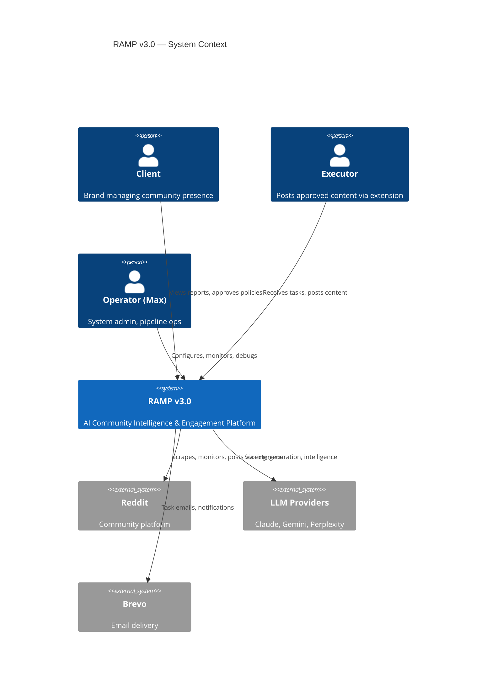
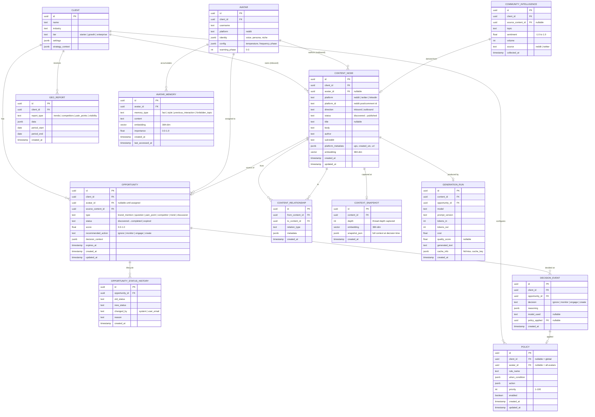
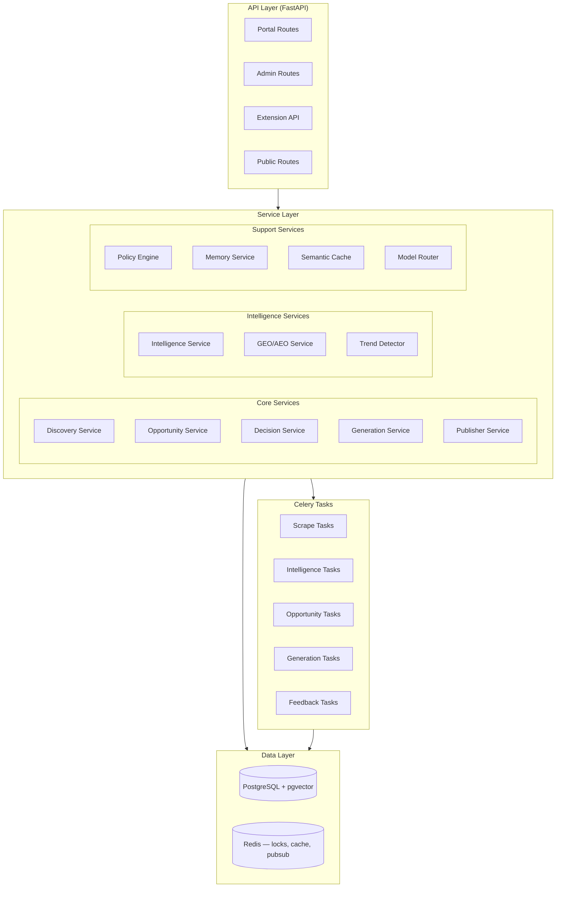
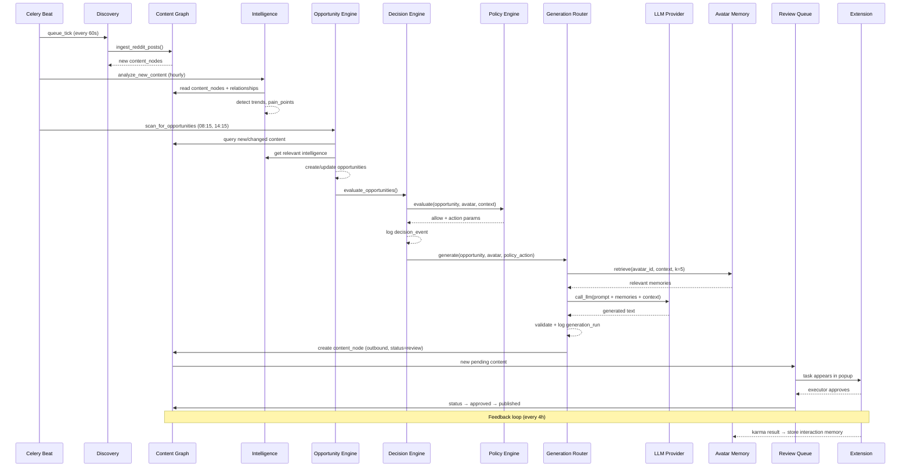
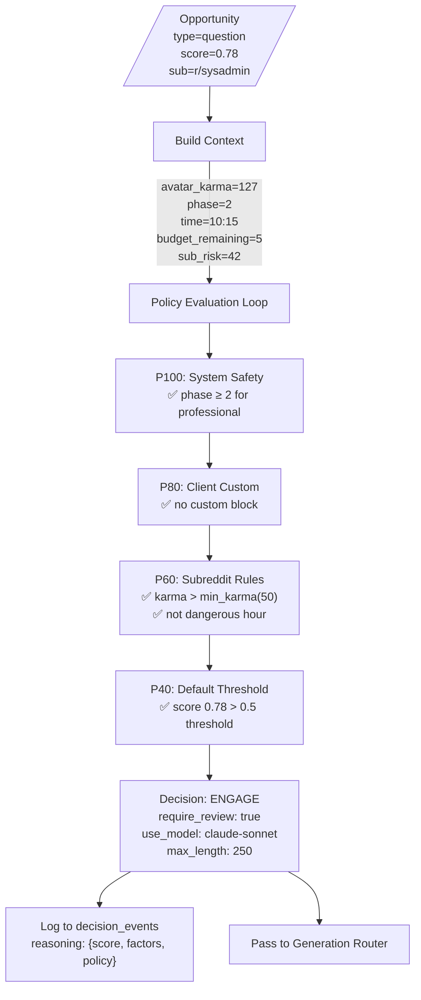
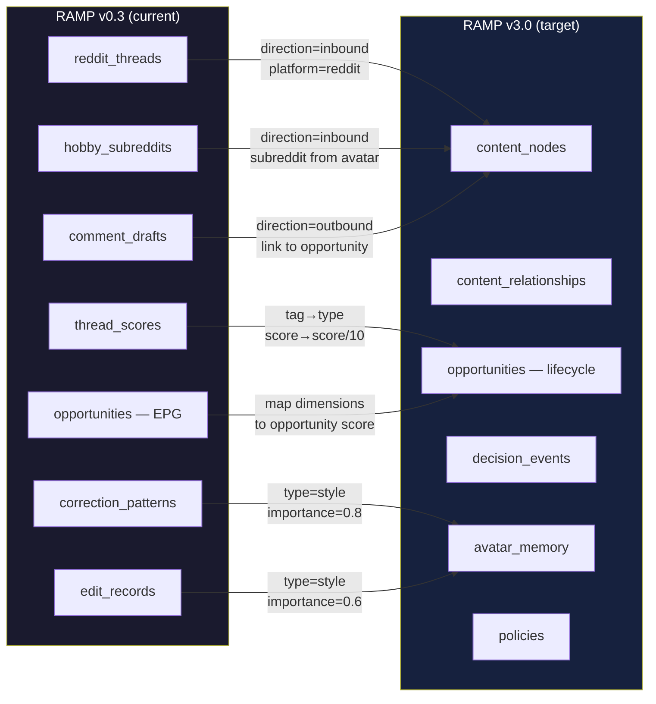
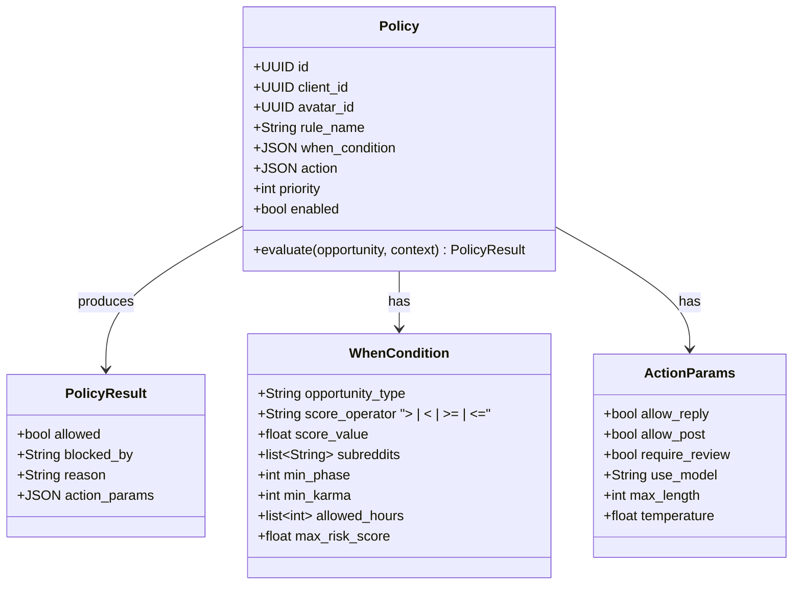

# RAMP v3.0 Enterprise — Design Document

## System Architecture



---

## Data Model (Complete)



---

## Service Architecture



---

## Key Service Interfaces

### Discovery Service

```python
class DiscoveryService:
    """Ingests content from platforms into Content Graph."""
    
    async def ingest_reddit_posts(self, subreddit: str, limit: int = 25) -> list[ContentNode]:
        """Scrape subreddit, create content_nodes, build relationships."""
        
    async def ingest_reddit_thread(self, thread_id: str, depth: int = 5) -> ContentNode:
        """Deep-scrape a thread, build reply_to relationships."""
        
    async def detect_changes(self, content_id: UUID) -> list[ContentChange]:
        """Check if existing content has new replies, score changes, etc."""
```

### Opportunity Service

```python
class OpportunityService:
    """Identifies and manages engagement opportunities."""
    
    async def scan_for_opportunities(self, client_id: UUID) -> list[Opportunity]:
        """Scan new content_nodes → create opportunities based on rules."""
        
    async def score_opportunity(self, opp_id: UUID) -> float:
        """Multi-dimensional scoring: relevance, timing, risk, potential."""
        
    async def expire_stale(self) -> int:
        """Mark expired opportunities (TTL exceeded, thread locked)."""
        
    async def reassess(self, opp_id: UUID) -> Opportunity:
        """Re-score when context changes (new comments, sentiment shift)."""
```

### Decision Service

```python
class DecisionService:
    """Makes and logs engagement decisions."""
    
    async def decide(self, opportunity: Opportunity, avatar: Avatar) -> DecisionEvent:
        """Apply policies → decide action → log reasoning → return decision."""
        
    async def get_decision_history(self, client_id: UUID, limit: int = 50) -> list[DecisionEvent]:
        """Audit trail for client."""
```

### Policy Engine

```python
class PolicyEngine:
    """Evaluates declarative policies against opportunities."""
    
    def evaluate(self, opportunity: Opportunity, avatar: Avatar, context: dict) -> PolicyResult:
        """Evaluate all active policies in priority order. First match wins."""
        
    def validate_policy(self, policy: Policy) -> list[str]:
        """Validate policy JSON structure before save."""
        
    def get_system_policies(self) -> list[Policy]:
        """Immutable system safety policies (phase gates, brand blocks)."""
```

### Memory Service

```python
class MemoryService:
    """Manages avatar persistent memory with semantic retrieval."""
    
    async def retrieve(self, avatar_id: UUID, context: str, k: int = 5) -> list[AvatarMemory]:
        """Top-K memories by embedding similarity to context."""
        
    async def store(self, avatar_id: UUID, memory_type: str, content: str, importance: float):
        """Create memory with embedding. Dedup if similar exists."""
        
    async def decay(self) -> int:
        """Reduce importance of old, unused memories. Evict if > 200 per avatar."""
```

### Generation Router

```python
class GenerationRouter:
    """Selects model and parameters based on task characteristics."""
    
    def route(self, opportunity: Opportunity, avatar: Avatar, policy_action: dict) -> GenerationConfig:
        """Returns: model, temperature, max_tokens, require_review."""
        
    async def check_cache(self, context_embedding: list[float], intent: str) -> Optional[str]:
        """Semantic cache lookup. Returns cached generation if fresh + similar."""
```

---

## Pipeline Flow (v3.0)



---

## Decision Engine Detail



---

## Migration Strategy



### Migration Phases:

1. **Phase A (non-destructive):** Create v3 tables alongside existing. Dual-write new content to both.
2. **Phase B (backfill):** Migrate historical data from old tables → new tables. Verify counts match.
3. **Phase C (switch):** Point pipeline services at new tables. Old tables become read-only archive.
4. **Phase D (cleanup):** After 90 days, drop old tables (or keep for analytics).

---

## Semantic Cache Design

```mermaid
flowchart TD
    REQ[Generation Request<br/>context + intent + subreddit]
    
    REQ --> EMBED[Compute embedding<br/>of context+intent]
    EMBED --> SEARCH[pgvector similarity search<br/>in generation_runs<br/>WHERE subreddit matches<br/>AND created_at > 7d ago]
    
    SEARCH -->|similarity > 0.92<br/>+ same intent| HIT[Cache HIT]
    SEARCH -->|no match| MISS[Cache MISS]
    
    HIT --> ADAPT[Adapt cached text<br/>with lightweight model<br/>Gemini Flash Lite]
    MISS --> FULL[Full generation<br/>Claude Sonnet / Gemini Flash]
    
    ADAPT --> SAVE[Save to generation_runs<br/>cache_info: {hit: true, source_id}]
    FULL --> SAVE
    
    SAVE --> OUTPUT[Return generated text]
```

**Cache eviction:** Entries older than 30 days or with quality_score < 3.0 are excluded from search.

**Expected savings:** 30-40% reduction in full LLM calls after 30 days of operation per client.

---

## Policy Engine Schema



### Built-in System Policies (immutable, priority 100):

| Rule | Condition | Action |
|------|-----------|--------|
| `phase_0_safe_only` | phase=0 AND subreddit NOT IN safe_list | block |
| `phase_1_no_brand` | phase≤1 AND opportunity.type=brand_mention | block |
| `phase_2_no_direct_link` | phase≤2 AND content contains brand URL | block |
| `frozen_avatar_block` | avatar.is_frozen=true | block |
| `budget_exhausted` | daily_budget_remaining=0 | block |
| `dangerous_hours` | time_of_day IN subreddit.dangerous_hours AND karma<200 | block |

These replace current hardcoded safety gates (`safety_blocks.py`, `fitness_gate.py`, `posting_safety.py`) with declarative equivalents.

---

## Technology Decisions

| Component | Choice | Rationale |
|-----------|--------|-----------|
| Content Graph storage | PostgreSQL + JSONB + pgvector | Already in stack, no new infra. Graph queries via recursive CTEs. |
| Embedding model | `text-embedding-004` (384-dim) | Already used. Free tier on Google. |
| Vector similarity | pgvector (cosine) | In-process, no external service. <200ms for 10K vectors. |
| Semantic cache | Same PG table (generation_runs + embedding) | No Redis needed — cache is persistent, not ephemeral. |
| Policy evaluation | In-memory Python (loaded from DB on startup, refreshed every 60s) | < 1ms evaluation, no DB round-trip per decision. |
| Analytics store | PostgreSQL (for now), ClickHouse when > 1M events | YAGNI — PG handles current scale. |
| Task queue | Celery + Redis (unchanged) | Working, tested, no migration needed. |
| Multi-platform | Abstraction layer in Discovery Service | Platform-specific adapters (Reddit, Twitter, LinkedIn). |
