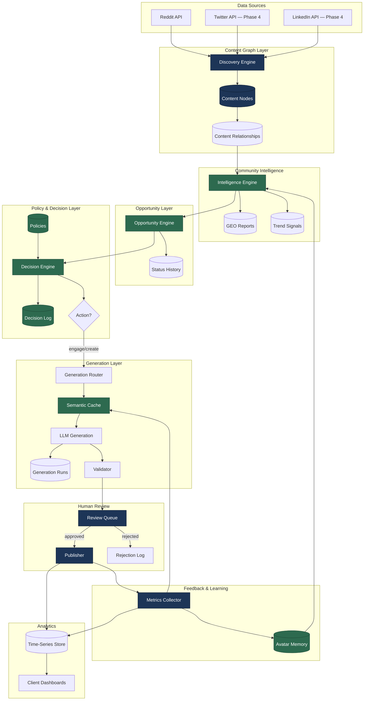
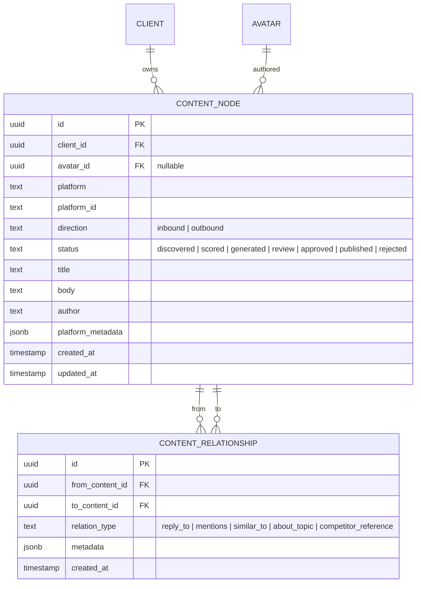
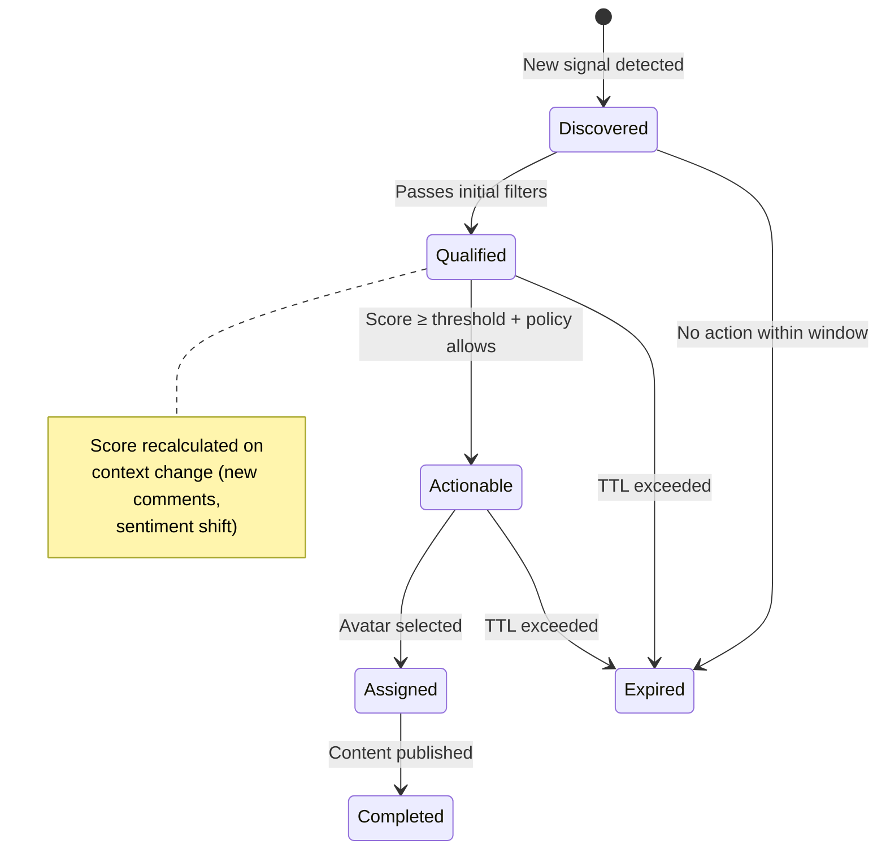
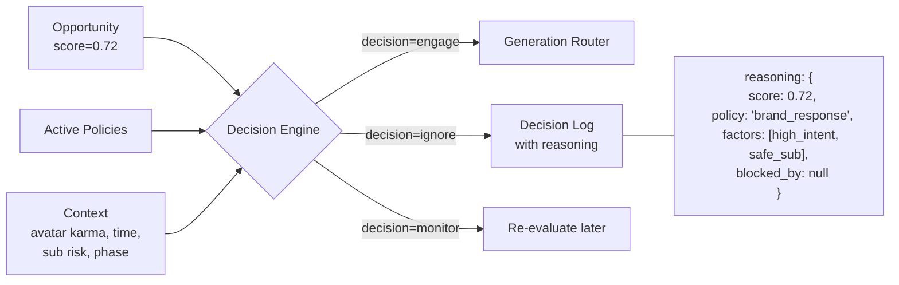
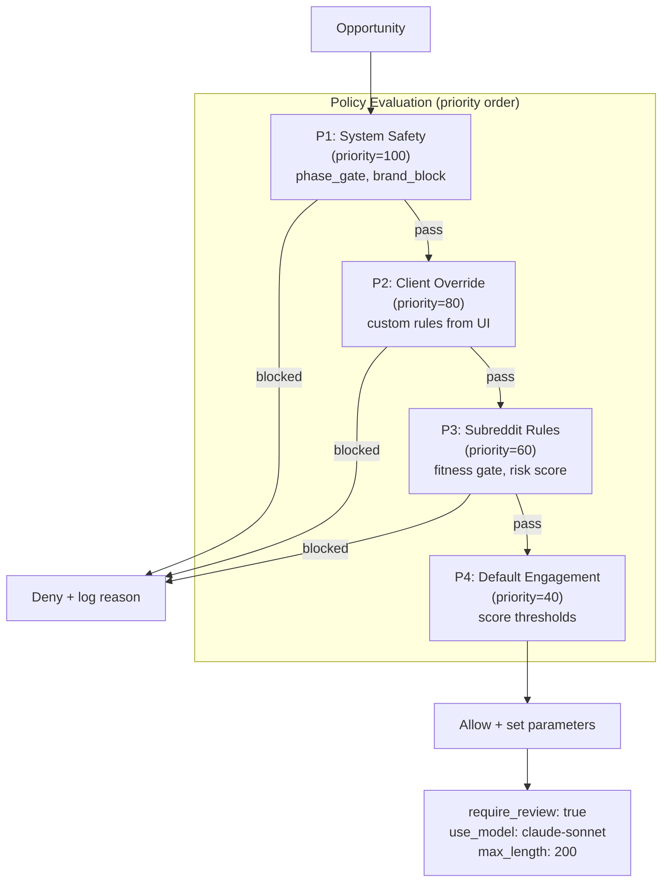
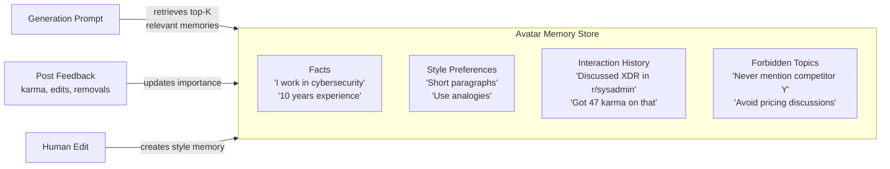
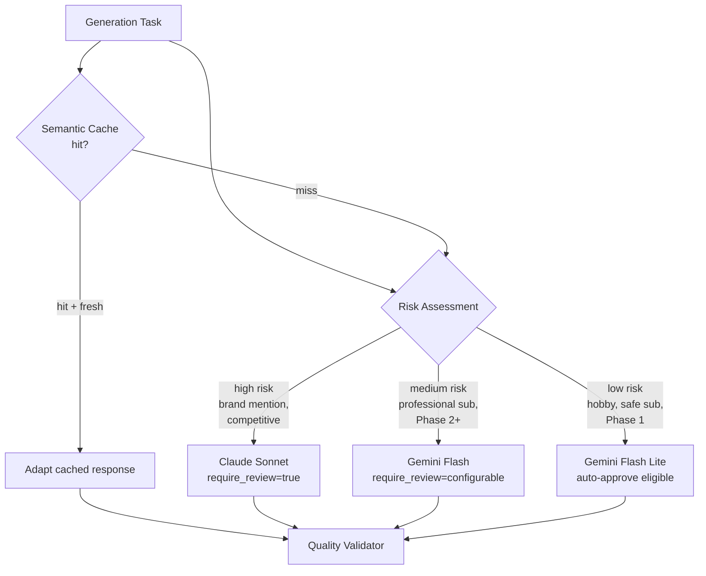
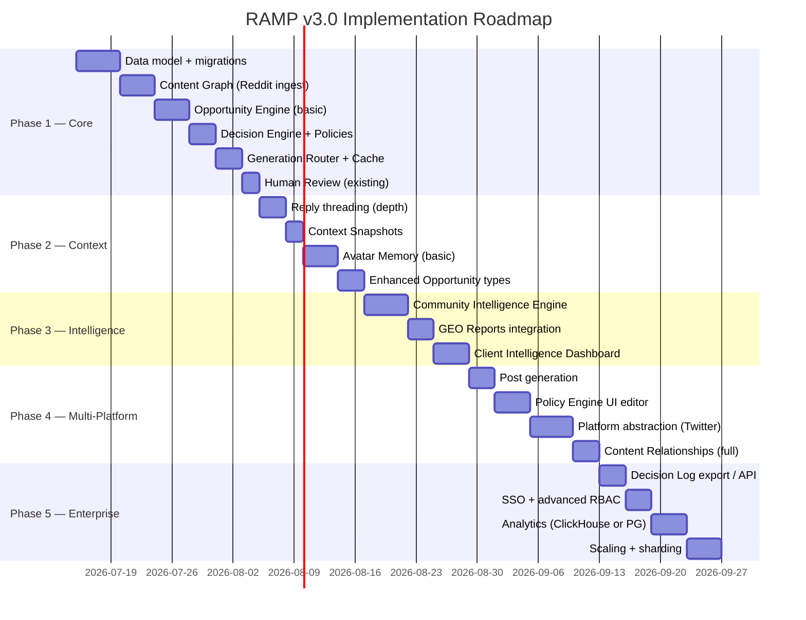

# RAMP v3.0 Enterprise — Requirements

## Overview

RAMP v3.0 transforms the platform from a linear content pipeline (scrape→score→generate→post) into a **decision intelligence platform** for brand community engagement. The system shifts from "generate comments" to "make engagement decisions" — where the decision itself is the product.

## Architecture Vision

## Core Entities

### R1: Content Graph

**Requirement:** Replace flat `reddit_threads` + `hobby_subreddits` tables with a unified Content Graph model.

**Acceptance criteria:**
- [ ] All scraped Reddit posts/comments stored as `content_nodes` with `direction=inbound`
- [ ] Generated content stored as `content_nodes` with `direction=outbound`
- [ ] Reply chains modeled via `content_relationships` (type=`reply_to`)
- [ ] Thread context reconstructable from graph traversal (max depth 5)
- [ ] Existing `reddit_threads` and `hobby_subreddits` data migrated to content_nodes
- [ ] Status workflow: discovered → scored → generated → review → approved → published

### R2: Opportunity Engine (First-Class Object)

**Requirement:** Opportunities are explicit, trackable entities with lifecycle — not implicit results of scoring.

**Acceptance criteria:**
- [ ] `opportunities` table with type enum: brand_mention, question, pain_point, competitor, trend, discussion
- [ ] Status lifecycle: discovered → qualified → actionable → assigned → completed/expired
- [ ] Score (0.0–1.0) recalculated when source content changes
- [ ] Expiration (TTL per type, configurable)
- [ ] Full status history in `opportunity_status_history` table
- [ ] Every status transition has `changed_by` (system/user) and `reason`
- [ ] Opportunity links back to source `content_node`

### R3: Decision Engine + Decision Log

**Requirement:** Every engagement decision is explicit, reasoned, and auditable.

**Acceptance criteria:**
- [ ] `decision_events` table stores every decision (engage/ignore/monitor/create)
- [ ] Each decision has `reasoning` JSONB with: score, factors, policy_applied, blocked_by
- [ ] Decision Engine applies policies in priority order (higher priority = evaluated first)
- [ ] Context includes: avatar phase, karma, subreddit risk, time_of_day, daily budget remaining
- [ ] "Monitor" decisions re-enter evaluation after configurable interval
- [ ] Client can view decision history for their opportunities (audit trail)
- [ ] No content is generated without a prior decision_event record (structural invariant)

### R4: Declarative Policy Engine

**Requirement:** Engagement rules expressed as declarative JSON policies, configurable per client and per avatar.

**Acceptance criteria:**
- [ ] `policies` table: client_id, avatar_id (nullable=global), rule_name, when_condition JSONB, action JSONB, priority, enabled
- [ ] Conditions support: opportunity.type, score, subreddit, phase, avatar.karma, time_of_day, daily_budget_remaining
- [ ] Actions support: allow_reply, require_review, allow_post, use_model, max_length, temperature
- [ ] Policies evaluated in priority order (highest first), first match wins
- [ ] System safety policies (phase gates, brand blocks) immutable by clients — priority ≥ 100
- [ ] Client-configurable policies editable via admin UI (priority 1-80)
- [ ] Policy change logged in audit trail
- [ ] Existing safety gates (fitness_gate, safety_blocks, phase policy) expressed as policies

### R5: Avatar Memory

**Requirement:** Each avatar accumulates persistent memory that improves responses over time.

**Acceptance criteria:**
- [ ] `avatar_memory` table: avatar_id, memory_type (fact/style/previous_interaction/forbidden_topic), content, embedding VECTOR(384), importance (0-1)
- [ ] Memories retrieved via semantic search (embedding similarity) during generation
- [ ] Top-K memories (K=5-10) injected into generation prompt
- [ ] Successful interactions (karma ≥ 5) create `previous_interaction` memories
- [ ] Human edits create `style` memories (replaces current `CorrectionPattern` table)
- [ ] Importance score decays over time (recent > old), high-karma memories resist decay
- [ ] Memory deduplication (similarity > 0.95 → merge, keep higher importance)
- [ ] Maximum 200 memories per avatar (LRU eviction on importance)

### R6: Community Intelligence Layer

**Requirement:** Community knowledge (trends, pain points, competitor moves) as a separate, valuable layer — not just a scoring input.

**Acceptance criteria:**
- [ ] `community_intelligence` table: client_id, source_content_id, topic, sentiment, volume, source, collected_at
- [ ] Trend detection: topics with volume increase > 2x in 7 days flagged
- [ ] Pain point extraction: questions/complaints clustered by topic
- [ ] Competitor mention tracking: what competitors are cited for, in what context
- [ ] `geo_reports` table: structured JSONB reports (trends, competitors, pain_points) per period
- [ ] Intelligence feeds into Opportunity scoring (trending topics = higher opportunity score)
- [ ] Client-facing intelligence dashboard (separate from engagement metrics)

### R7: Generation Router (Model Selection)

**Requirement:** Model selection is dynamic, based on task complexity, risk level, and client tier.

**Acceptance criteria:**
- [ ] Generation Router selects model based on: opportunity risk, subreddit risk_score, avatar phase, client tier, content type
- [ ] Semantic cache: content_node embedding + intent → check for similar prior generations
- [ ] Cache hit: adapt existing response (cheaper model call for adaptation vs full generation)
- [ ] Quality validator: checks length, tone match, brand safety before passing to review
- [ ] Cost tracked per generation in `generation_runs` table (model, tokens_in, tokens_out, cost)
- [ ] Routing rules configurable via Policy Engine (policy action `use_model`)

### R8: Context Snapshots

**Requirement:** At decision/generation time, the full context is captured immutably — enabling post-hoc analysis and model improvement.

**Acceptance criteria:**
- [ ] `context_snapshots` table: content_id, depth (thread depth captured), embedding, snapshot_json (full thread context)
- [ ] Created at generation time — captures exactly what the LLM saw
- [ ] Snapshot includes: thread title, parent chain (up to depth 5), avatar identity, policy that allowed, opportunity that triggered
- [ ] Enables: "why did we generate this?" debugging months later
- [ ] Enables: training data extraction for fine-tuning (future)

---

## Non-Functional Requirements

### NF1: Migration Path
- Current RAMP v0.3 data MUST be migratable to v3.0 schema
- `reddit_threads` → `content_nodes` (direction=inbound)
- `comment_drafts` → `content_nodes` (direction=outbound) + link to opportunity
- `thread_scores` → `opportunities` (type=discussion, score mapped from tag)
- Migration must be reversible (keep old tables as archive for 90 days)

### NF2: Performance
- Opportunity scoring: < 100ms per opportunity (excluding LLM calls)
- Decision Engine: < 50ms per decision (policy evaluation is in-memory)
- Memory retrieval: < 200ms for top-K semantic search (pgvector)
- Content Graph traversal: < 500ms for depth-5 thread reconstruction

### NF3: Cost Boundaries
- Target cost per avatar per month: ≤ $5.20 (as specified in economics section)
- Generation Router must prefer cheaper models when quality allows
- Semantic cache should reduce LLM calls by ≥ 30% after 30 days of operation

### NF4: Backward Compatibility
- Existing API endpoints (extension, portal, admin) continue working during migration
- Phase system, safety gates, and SBM properties preserved as policies
- Existing self-learning loop (EditRecord, CorrectionPattern) data migrated to Avatar Memory

---

## Implementation Phases

---

## Relationship to Current RAMP (v0.3)

| Current Component | v3.0 Equivalent | Migration Strategy |
|---|---|---|
| `reddit_threads` + `hobby_subreddits` | `content_nodes` (inbound) | Migrate + keep archive 90d |
| `comment_drafts` | `content_nodes` (outbound) | Migrate, link to opportunities |
| `thread_scores` | `opportunities` | Map score→opportunity, tag→type |
| `EPG Portfolio Manager` | `Opportunity Engine` + `Decision Engine` | Refactor into separate services |
| `fitness_gate` + `safety_blocks` | `policies` (system safety, priority 100) | Express as declarative rules |
| `CorrectionPattern` + `EditRecord` | `avatar_memory` (type=style) | Migrate patterns to memories |
| `ai_usage_log` | `generation_runs` (superset) | Extend, don't replace |
| `GeoExecution` + `GeoQueryResult` | `community_intelligence` + `geo_reports` | Keep existing, add intelligence layer on top |

---

## Pricing Tiers (v3.0)

| Tier | Price | Avatars | Communities | Features |
|------|-------|---------|-------------|----------|
| **Starter** | $499/mo | 1 | 3 | Basic engagement, human review, weekly reports |
| **Growth** | $1,999/mo | 3 | 10 | Opportunity Intelligence, dashboards, Policy Engine |
| **Enterprise** | $5,000+/mo | Unlimited | Unlimited | Full audit, API, custom policies, dedicated manager |

---

## Unit Economics (per avatar/month)

| Component | Cost |
|-----------|------|
| LLM (generation + routing + scoring) | ~$4.00 |
| Embeddings (cache, memory, opportunity) | ~$0.15 |
| Database + vector store | ~$0.50 |
| Scraping + queues | ~$0.30 |
| Monitoring + logs + audit | ~$0.25 |
| **Total** | **~$5.20** |

At 100+ avatars: infrastructure costs amortize to ~$3.00/avatar.

**Margin at scale:**
- 50 Growth clients × $1,999 = $100K/mo revenue
- 150 avatars × $5.20 = $780/mo AI/infra cost
- Margin: **>99%** (LLM costs negligible vs revenue at Growth tier pricing)
