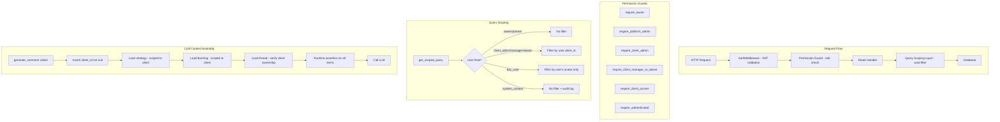

# Design Document: RBAC & Client Data Isolation

## Overview

This feature implements full Role-Based Access Control (RBAC) and client data isolation across the Reddit Marketing SaaS platform. The system transitions from the current `is_superuser` flag + single `client_id` FK model to a granular permission system with 6 roles, automatic query scoping, and LLM context isolation guarantees.

The implementation is structured in 4 layers:
1. **Data Layer** — New models (UserClientAssignment, AvatarRental) + schema extensions (Client, Avatar, User)
2. **Permission Layer** — FastAPI dependencies that enforce role-based access on every route
3. **Query Scoping Layer** — Automatic client_id filtering on all tenant-owned entity queries
4. **LLM Isolation Layer** — Runtime assertions ensuring no cross-client data enters AI prompts

### Design Principles

- **Deny by default** — Any role-resource combination not explicitly allowed is denied
- **Zero additional queries for permission checks** — Role is on the User record, client_id is on the User record; no joins needed
- **Backward compatible** — Existing `is_superuser=True` users map to `owner` role; existing `client_id` FK continues to work
- **System context for background tasks** — Celery workers use an explicit `system_context()` marker that bypasses user-based scoping
- **Fail-closed** — If scoping is accidentally omitted, queries return empty results (production) or raise errors (development)

## Architecture



## Components and Interfaces

### 1. UserClientAssignment Model (`app/models/user_client_assignment.py`)

Many-to-many relationship for `partner` users who manage multiple clients. Client-scoped users (`client_admin`, `client_manager`, `client_viewer`) continue to use the existing `User.client_id` FK for single-company scoping.

### 2. AvatarRental Model (`app/models/avatar_rental.py`)

Links platform farm avatars to B2B clients for rental periods. Enables clients to use pre-warmed avatars without owning them.

### 3. Permission Guards (`app/dependencies/permissions.py`)

Reusable FastAPI dependencies that validate role + client scope before route execution. Replaces the current `require_superuser` dependency with granular guards.

### 4. Query Scoping Service (`app/services/query_scope.py`)

Provides `get_scoped_query()` and `system_context()` functions that enforce automatic client_id filtering on all tenant-owned entity queries.

### 5. UserRole Enum Extension (`app/models/user_role.py`)

Adds `client_admin` role and new permission properties.

### 6. Client Model Extensions (`app/models/client.py`)

Adds `max_avatars`, `plan_type`, `draft_approval_enabled` columns.

### 7. Avatar Model Extensions (`app/models/avatar.py`)

Adds `is_farm_avatar`, `rent_price` columns.

### 8. LLM Context Isolation (`app/services/generation.py`)

Strengthened runtime assertions + scoped data loading in context assembly.

### 9. Permission Matrix Document (`docs/permission_matrix.md`)

Structured reference of all role-resource-action combinations.

## Data Models

### UserClientAssignment Table

```sql
CREATE TABLE user_client_assignments (
    id UUID PRIMARY KEY DEFAULT gen_random_uuid(),
    user_id UUID NOT NULL REFERENCES users(id) ON DELETE CASCADE,
    client_id UUID NOT NULL REFERENCES clients(id) ON DELETE CASCADE,
    role VARCHAR(20) NOT NULL,
    is_active BOOLEAN NOT NULL DEFAULT TRUE,
    created_at TIMESTAMPTZ NOT NULL DEFAULT NOW(),

    CONSTRAINT uq_user_client_assignment UNIQUE (user_id, client_id)
);

CREATE INDEX ix_user_client_assignments_user_id ON user_client_assignments(user_id);
CREATE INDEX ix_user_client_assignments_client_id ON user_client_assignments(client_id);
```

### AvatarRental Table

```sql
CREATE TABLE avatar_rentals (
    id UUID PRIMARY KEY DEFAULT gen_random_uuid(),
    avatar_id UUID NOT NULL REFERENCES avatars(id) ON DELETE CASCADE,
    client_id UUID NOT NULL REFERENCES clients(id) ON DELETE CASCADE,
    is_active BOOLEAN NOT NULL DEFAULT TRUE,
    rented_at TIMESTAMPTZ NOT NULL DEFAULT NOW(),
    expires_at TIMESTAMPTZ,
    price NUMERIC(10, 2),

    CONSTRAINT uq_avatar_rental UNIQUE (avatar_id, client_id)
);

CREATE INDEX ix_avatar_rentals_client_id ON avatar_rentals(client_id);
CREATE INDEX ix_avatar_rentals_avatar_id ON avatar_rentals(avatar_id);
CREATE INDEX ix_avatar_rentals_active ON avatar_rentals(client_id)
    WHERE is_active = TRUE AND (expires_at IS NULL OR expires_at > NOW());
```

### Client Table Extensions

```sql
ALTER TABLE clients
    ADD COLUMN max_avatars INTEGER NOT NULL DEFAULT 3,
    ADD COLUMN plan_type VARCHAR(20) NOT NULL DEFAULT 'starter',
    ADD COLUMN draft_approval_enabled BOOLEAN NOT NULL DEFAULT FALSE;
```

### Avatar Table Extensions

```sql
ALTER TABLE avatars
    ADD COLUMN is_farm_avatar BOOLEAN NOT NULL DEFAULT FALSE,
    ADD COLUMN rent_price NUMERIC(10, 2);
```

### User Table Extension

```sql
CREATE INDEX ix_users_role ON users(role);
```

### SQLAlchemy Models

```python
# app/models/user_client_assignment.py
class UserClientAssignment(Base):
    __tablename__ = "user_client_assignments"

    id: Mapped[uuid.UUID] = mapped_column(UUID(as_uuid=True), primary_key=True, default=uuid.uuid4)
    user_id: Mapped[uuid.UUID] = mapped_column(UUID(as_uuid=True), ForeignKey("users.id", ondelete="CASCADE"), nullable=False)
    client_id: Mapped[uuid.UUID] = mapped_column(UUID(as_uuid=True), ForeignKey("clients.id", ondelete="CASCADE"), nullable=False)
    role: Mapped[str] = mapped_column(String(20), nullable=False)
    is_active: Mapped[bool] = mapped_column(Boolean, default=True, server_default="true")
    created_at: Mapped[datetime] = mapped_column(DateTime(timezone=True), server_default=func.now())

    __table_args__ = (
        UniqueConstraint("user_id", "client_id", name="uq_user_client_assignment"),
    )
```

```python
# app/models/avatar_rental.py
class AvatarRental(Base):
    __tablename__ = "avatar_rentals"

    id: Mapped[uuid.UUID] = mapped_column(UUID(as_uuid=True), primary_key=True, default=uuid.uuid4)
    avatar_id: Mapped[uuid.UUID] = mapped_column(UUID(as_uuid=True), ForeignKey("avatars.id", ondelete="CASCADE"), nullable=False)
    client_id: Mapped[uuid.UUID] = mapped_column(UUID(as_uuid=True), ForeignKey("clients.id", ondelete="CASCADE"), nullable=False)
    is_active: Mapped[bool] = mapped_column(Boolean, default=True, server_default="true")
    rented_at: Mapped[datetime] = mapped_column(DateTime(timezone=True), server_default=func.now())
    expires_at: Mapped[datetime | None] = mapped_column(DateTime(timezone=True), nullable=True)
    price: Mapped[float | None] = mapped_column(Numeric(10, 2), nullable=True)

    __table_args__ = (
        UniqueConstraint("avatar_id", "client_id", name="uq_avatar_rental"),
    )
```

## Permission Guards Design

### Guard Hierarchy

```python
# app/dependencies/permissions.py

async def get_current_user(request: Request, db: Session = Depends(get_db)) -> User:
    """Base dependency: loads authenticated, active user from JWT.
    Raises 303 redirect to /login if unauthenticated or inactive."""

async def require_authenticated(user: User = Depends(get_current_user)) -> User:
    """Any active, authenticated user."""

async def require_owner(user: User = Depends(get_current_user)) -> User:
    """Only owner role. Raises 403 otherwise."""

async def require_partner(user: User = Depends(get_current_user)) -> User:
    """Only partner role. Raises 403 otherwise."""

async def require_platform_admin(user: User = Depends(get_current_user)) -> User:
    """Owner or partner. Raises 403 otherwise."""

async def require_client_admin(user: User = Depends(get_current_user)) -> User:
    """Only client_admin role (within own company). Raises 403 otherwise."""

async def require_client_manager_or_above(user: User = Depends(get_current_user)) -> User:
    """client_admin or client_manager (within own company). Raises 403 otherwise."""

def require_client_access(client_id: uuid.UUID):
    """Factory: returns a dependency that verifies the user can access the specified client.
    - owner/partner: always allowed
    - client_admin/client_manager/client_viewer: only if client_id matches user.client_id
    - b2c_user: only if client_id matches user.client_id
    Raises 403 otherwise."""
```

### Guard Implementation Pattern

```python
async def require_platform_admin(user: User = Depends(get_current_user)) -> User:
    if user.user_role not in (UserRole.owner, UserRole.partner):
        raise HTTPException(status_code=403, detail="Access Denied")
    return user
```

Key design decisions:
- **No extra DB queries** — role is on the User record, loaded once by `get_current_user`
- **Composable** — guards can be combined (e.g., `require_client_access` + `require_client_manager_or_above`)
- **Legacy compatible** — `require_superuser` continues to work (delegates to `require_platform_admin` internally)

## Query Scoping Layer Design

### Core Interface

```python
# app/services/query_scope.py

class QueryScope:
    """Provides automatic client_id filtering for tenant-owned entities."""

    def __init__(self, user: User | None = None, system: bool = False):
        self.user = user
        self.system = system

    def scope_query(self, query: Query, model: type[Base]) -> Query:
        """Apply client_id filter to a query based on user's authorized clients.

        - owner/partner: no filter (full access)
        - client_admin/manager/viewer: filter by user.client_id
        - b2c_user: filter by user.client_id
        - system context: no filter (background tasks)

        For Avatar model: uses client_ids ARRAY overlap + avatar_rentals join.
        For other models: uses direct client_id column filter.
        """

    def get_authorized_client_ids(self) -> list[uuid.UUID] | None:
        """Returns list of client_ids the user can access, or None for full access."""

    def assert_write_access(self, client_id: uuid.UUID) -> None:
        """Raises SecurityError if user cannot write to the specified client_id."""


def system_context() -> QueryScope:
    """Create a system-level scope for background tasks (Celery workers).
    Bypasses user-based scoping. Logs caller in audit trail."""

def get_query_scope(user: User) -> QueryScope:
    """Create a user-level scope from the authenticated user."""
```

### Scoped Entity List

The following models are tenant-owned and require automatic scoping:

| Model | Scope Column | Notes |
|-------|-------------|-------|
| Client | `id` | Direct match |
| Avatar | `client_ids` (ARRAY) | ARRAY overlap + avatar_rentals join |
| ClientSubreddit | `client_id` | Direct FK |
| ClientSubredditAssignment | `client_id` | Direct FK |
| CommentDraft | `client_id` | Direct FK |
| PostDraft | `client_id` | Direct FK |
| RedditThread | via ThreadScore.client_id | Indirect (thread shared, scores per-client) |
| ThreadScore | `client_id` | Direct FK |
| ActivityEvent | `client_id` | Direct FK |
| EditRecord | `client_id` | Direct FK |
| CorrectionPattern | `client_id` | Direct FK |
| StrategyDocument | via Avatar.client_ids | Indirect (strategy per-avatar) |

### Avatar Scoping (Special Case)

Avatars use a JSONB array `client_ids` for ownership. With rentals, a client can access:
1. Owned avatars: `client_ids @> ARRAY[str(client_id)]`
2. Rented avatars: `avatar_rentals.client_id = client_id AND is_active = true AND (expires_at IS NULL OR expires_at > now())`

```python
def scope_avatar_query(self, query: Query, client_id: uuid.UUID) -> Query:
    """Filter avatars to owned + actively rented."""
    from app.models.avatar_rental import AvatarRental

    owned = Avatar.client_ids.any(str(client_id))
    rented = Avatar.id.in_(
        select(AvatarRental.avatar_id).where(
            AvatarRental.client_id == client_id,
            AvatarRental.is_active == True,
            or_(
                AvatarRental.expires_at == None,
                AvatarRental.expires_at > func.now()
            )
        )
    )
    return query.filter(or_(owned, rented))
```

### Development vs Production Behavior

```python
def scope_query(self, query, model):
    if self.system:
        return query  # System context — no filter

    if self.user is None:
        # No user context — fail-closed
        if settings.environment == "development":
            raise RuntimeError(
                f"Query on {model.__tablename__} without user context. "
                "Use system_context() for background tasks."
            )
        else:
            logger.warning(
                "SECURITY: Query on %s without user context — returning empty",
                model.__tablename__,
            )
            return query.filter(False)  # Return empty result

    if self.user.user_role in (UserRole.owner, UserRole.partner):
        return query  # Full access

    # Client-scoped user
    client_id = self.user.client_id
    if client_id is None:
        logger.warning("SECURITY: User %s has no client_id", self.user.id)
        return query.filter(False)

    return self._apply_client_filter(query, model, client_id)
```

## LLM Context Isolation Design

### Strengthened Assertions

The existing runtime assertions in `select_persona` and `generate_comment` are preserved and extended:

```python
def generate_comment(db, thread, client, avatar, persona_selection, ...):
    # 1. Validate client_id is not null
    if not client or not client.id:
        raise ValueError("LLM context assembly requires a valid client_id")

    # 2. Assert avatar belongs to client (owned or rented)
    if not _avatar_accessible_by_client(db, avatar, client):
        raise SecurityError(
            f"Context isolation violation: avatar {avatar.reddit_username} "
            f"not accessible by client {client.id}"
        )

    # 3. Load strategy — scoped to client's avatars only
    # 4. Load learning — scoped to client_id
    # 5. Final assertion: every context item belongs to target client
```

### Avatar Accessibility Check

```python
def _avatar_accessible_by_client(db: Session, avatar: Avatar, client: Client) -> bool:
    """Check if avatar is owned by or rented to the client."""
    # Owned
    if avatar.client_ids and str(client.id) in avatar.client_ids:
        return True
    # Rented
    from app.models.avatar_rental import AvatarRental
    rental = db.query(AvatarRental).filter(
        AvatarRental.avatar_id == avatar.id,
        AvatarRental.client_id == client.id,
        AvatarRental.is_active == True,
        or_(AvatarRental.expires_at == None, AvatarRental.expires_at > func.now())
    ).first()
    return rental is not None
```

## Route Migration Plan

### Admin Routes (`/admin/*`)

Current: All use `require_superuser` (owner + partner).
After: Split into:
- System settings / kill switches: `require_owner`
- Client management / user management: `require_platform_admin`
- All other admin routes: `require_platform_admin`

### Client-Facing Routes (future)

New routes under `/hub/*` for client-scoped users:
- `/hub/dashboard` — `require_authenticated` + query scoping
- `/hub/avatars` — `require_client_manager_or_above` + query scoping
- `/hub/drafts` — `require_authenticated` + query scoping (viewer can read, manager can approve)
- `/hub/activity` — `require_authenticated` + query scoping

### B2C Routes (future)

New routes under `/my/*` for B2C users:
- `/my/dashboard` — `require_authenticated` (b2c_user)
- `/my/avatar` — `require_authenticated` (single avatar view)
- `/my/drafts` — `require_authenticated` (single avatar drafts)

## Correctness Properties

### Property 1: Permission guard denies unauthorized access

*For any* user with role R and endpoint requiring permission P where R does not satisfy P, the Permission_Guard SHALL return HTTP 403 with body containing "Access Denied".

**Validates: Requirements 2.1, 2.2, 2.3, 2.4, 2.5, 3.1, 3.2, 3.3**

### Property 2: Query scoping returns only authorized data

*For any* user with role `client_admin`, `client_manager`, or `client_viewer` and client_id C, every query through the Query_Scoping_Layer SHALL return only records where the record's client_id equals C (or for avatars, where client_ids contains C or an active rental exists).

**Validates: Requirements 4.1, 4.2, 4.3, 4.4, 4.5**

### Property 3: Owner and partner bypass scoping

*For any* user with role `owner` or `partner`, the Query_Scoping_Layer SHALL apply no client_id filter, returning all records regardless of client ownership.

**Validates: Requirements 4.2, 6.1, 6.3**

### Property 4: System context bypasses scoping

*For any* background task using `system_context()`, the Query_Scoping_Layer SHALL apply no client_id filter and SHALL log the caller identity.

**Validates: Requirements 4.8**

### Property 5: Write operations enforce client boundary

*For any* write operation (INSERT/UPDATE) on a tenant-owned entity, if the target client_id is not in the user's authorized set, the Query_Scoping_Layer SHALL reject the operation.

**Validates: Requirements 4.9**

### Property 6: LLM context contains only target client data

*For any* call to `generate_comment` with client_id C, every item in the assembled context (strategy documents, edit records, correction patterns, few-shot examples) SHALL have client_id equal to C.

**Validates: Requirements 5.1, 5.2, 5.3, 5.4, 5.5, 5.6**

### Property 7: Avatar rental expiry hides avatar

*For any* avatar rental where `expires_at < now()` or `is_active = false`, the avatar SHALL NOT appear in the client's avatar list.

**Validates: Requirements 7.9**

### Property 8: B2C user single avatar limit

*For any* user with role `b2c_user`, attempting to create a second avatar SHALL be denied with HTTP 403.

**Validates: Requirements 8.9**

### Property 9: Client deactivation denies access

*For any* client with `is_active = false`, all users scoped to that client SHALL be denied access to client-scoped resources.

**Validates: Requirements 1.8, 7.13**

### Property 10: Permission matrix completeness

*For any* role-resource-action combination not explicitly listed as "allowed" in the Permission_Matrix, the system SHALL deny access.

**Validates: Requirements 11.7**

### Property 11: Cross-client isolation

*For any* two clients A and B, a user scoped to client A SHALL never receive data belonging to client B through any API endpoint or LLM context assembly.

**Validates: Requirements 9.1, 9.2, 9.3, 9.4, 9.5, 9.6**

## Error Handling

| Scenario | Handling | Impact |
|----------|----------|--------|
| User has no client_id but role requires it | Return 403 "Access Denied" | User cannot access any client-scoped resource |
| Client is deactivated | Return 403 "Access Denied" | All client users blocked immediately |
| Avatar rental expired | Avatar hidden from client list | No error, just filtered out |
| Query without user context (dev) | Raise RuntimeError | Developer sees the bug immediately |
| Query without user context (prod) | Return empty + log WARNING | Fail-closed, no data leak |
| LLM context isolation assertion fails | Abort generation + log ERROR | Draft not created, security event logged |
| Migration on existing data | Preserve all records, seed assignments | Zero downtime, backward compatible |
| Invalid client_id in URL | Return 403 "Access Denied" | No information leakage about other clients |

## Testing Strategy

### Property-Based Tests (Hypothesis)

| Property | Test File | What's Generated |
|----------|-----------|-----------------|
| 1 | `tests/test_permission_guards_props.py` | Random user roles × endpoint permissions |
| 2, 3 | `tests/test_query_scoping_props.py` | Random users × random records with varying client_ids |
| 5 | `tests/test_write_isolation_props.py` | Random write operations with mismatched client_ids |
| 6 | `tests/test_llm_isolation_props.py` | Random context assembly with multi-client data |
| 7 | `tests/test_avatar_rental_props.py` | Random rental states (active, expired, inactive) |
| 8 | `tests/test_b2c_limits_props.py` | B2C user avatar creation attempts |
| 11 | `tests/test_cross_client_isolation_props.py` | Two-client scenarios with all resource types |

### Integration Tests

- End-to-end: Create two clients with users → verify complete isolation across all endpoints
- Rental lifecycle: Create rental → verify access → expire → verify hidden
- Migration: Run migration on existing data → verify all users retain access
- Background tasks: Verify Celery workers use system_context correctly
- LLM isolation: Generate comment for client A → assert no client B data in prompt

### Unit Tests

- Each permission guard: test allowed roles pass, denied roles get 403
- Query scoping: test each model type with various user roles
- Avatar scoping: test owned + rented + expired combinations
- Client deactivation: test cascade behavior
- B2C limits: test single avatar enforcement

## Migration Strategy

### Phase 1: Schema + Models (non-breaking)

1. Add new tables (user_client_assignments, avatar_rentals)
2. Add new columns to clients (max_avatars, plan_type, draft_approval_enabled)
3. Add new columns to avatars (is_farm_avatar, rent_price)
4. Add index on users.role
5. Add `client_admin` to UserRole enum
6. Seed UserClientAssignment records for existing users with client_id

### Phase 2: Permission Guards (additive)

1. Create new permission dependencies in `app/dependencies/permissions.py`
2. Keep `require_superuser` working (delegates to `require_platform_admin`)
3. Add new guards to new routes only (no existing route changes yet)

### Phase 3: Query Scoping (gradual)

1. Implement QueryScope service
2. Add scoping to new client-facing routes first
3. Gradually migrate admin routes to use scoping
4. Add development-mode assertions for unscoped queries

### Phase 4: Route Migration (breaking for admin)

1. Split admin routes by permission level
2. Add client hub routes (`/hub/*`)
3. Update auth middleware to handle new role-based redirects

This phased approach ensures zero downtime and backward compatibility throughout the migration.
