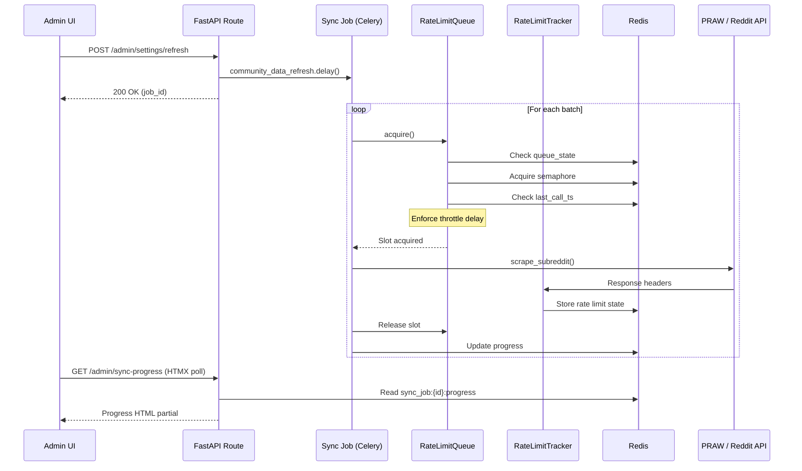

# Design Document: Reddit Data Sync

## Overview

This design describes a centralized, rate-limit-aware Reddit data synchronization system for the Reddit Marketing SaaS platform. The system introduces three core infrastructure components — a **Rate Limit Tracker**, a **Rate-Limited Request Queue**, and a **Sync Job Executor** — that sit between all existing Reddit API consumers (Celery scraping tasks, status checks) and the Reddit API itself.

The current architecture calls the Reddit API directly from individual Celery tasks via PRAW, with no coordination between concurrent workers. As the platform scales to multiple clients with dozens of subreddits each, uncoordinated API calls risk exceeding Reddit's OAuth rate limit (100 requests/minute per token), leading to 429 errors or temporary bans.

### Key Design Decisions

1. **Redis as the coordination layer**: All rate limit state, queue semaphores, and job progress are stored in Redis. This is a natural fit since Redis is already the Celery broker and provides atomic operations needed for distributed locking.

2. **Decorator-based queue integration**: Existing scraping tasks acquire queue slots via a context manager (`with rate_limit_queue.acquire():`), minimizing changes to existing task code.

3. **PRAW response header extraction**: Rather than building a custom HTTP client, we hook into PRAW's response cycle to extract `X-Ratelimit-*` headers after each API call.

4. **Settings-driven configuration**: All tunable parameters (throttle rate, batch size, queue state) are stored in the existing `SystemSetting` key-value store, allowing runtime changes without worker restarts.

5. **HTMX-based dashboard**: The rate limit dashboard and sync progress UI use HTMX polling (consistent with the existing admin panel patterns) rather than WebSockets, keeping the stack simple.

## Architecture

```mermaid
graph TB
    subgraph "Admin Panel (FastAPI + HTMX)"
        A[Settings Page<br/>Refresh Button + Controls]
        B[Rate Limit Dashboard<br/>HTMX auto-refresh]
    end

    subgraph "Celery Workers"
        C[scrape_professional_subreddits]
        D[scrape_hobby_subreddits]
        E[fetch_reddit_status]
        F[community_data_refresh<br/>Sync Job]
    end

    subgraph "Redis Coordination Layer"
        G[Rate Limit Tracker<br/>ratelimit:reddit:state]
        H[Rate Limit Queue<br/>Semaphore + FIFO]
        I[Queue State<br/>ratelimit:reddit:queue_state]
        J[Sync Job Progress<br/>sync_job:{id}:progress]
    end

    K[Reddit API<br/>OAuth 100 req/min]

    A -->|POST /admin/settings/refresh| F
    A -->|POST /admin/settings/queue-state| I
    B -->|GET /admin/rate-limit-status| G
    B -->|GET /admin/sync-progress| J

    C -->|acquire slot| H
    D -->|acquire slot| H
    E -->|acquire slot| H
    F -->|dispatch batches| H

    H -->|check state| I
    H -->|enforce delay| G
    H -->|release slot + update| G

    H -->|throttled call| K
    K -->|X-Ratelimit-* headers| G
```

### Request Flow

1. A Celery task (scraping, status check, or sync job) calls `rate_limit_queue.acquire()`.
2. The queue checks `Queue_State` in Redis. If paused, the caller blocks. If draining, a `QueueDrainingError` is raised.
3. The queue acquires a Redis semaphore (max concurrency = 1) with a 60-second timeout.
4. The queue enforces a minimum delay of `60 / throttle_rate` seconds since the last API call.
5. If the Rate Limit Tracker shows `remaining_requests < 10`, the delay is increased to spread remaining capacity.
6. The caller makes the Reddit API call via PRAW.
7. After the call, the Rate Limit Tracker extracts and stores `X-Ratelimit-*` headers from the PRAW response.
8. The semaphore is released.

## Components and Interfaces

### 1. RateLimitTracker (`app/services/rate_limit_tracker.py`)

Reads Reddit API response headers and maintains rate limit state in Redis.

```python
class RateLimitTracker:
    """Tracks Reddit API rate limit state in Redis."""

    REDIS_KEY = "ratelimit:reddit:state"
    TTL_SECONDS = 120

    def __init__(self, redis_client: redis.Redis):
        self.redis = redis_client

    def update_from_headers(self, headers: dict) -> None:
        """Extract X-Ratelimit-* headers and store in Redis.

        Args:
            headers: Response headers dict from Reddit API call.
        """
        ...

    def get_state(self) -> RateLimitState:
        """Return current rate limit state from Redis.

        Returns:
            RateLimitState with remaining, used, reset_timestamp,
            last_updated_at, total_requests_today, seconds_until_reset.
        """
        ...

    def increment_daily_counter(self) -> None:
        """Increment the total_requests_today counter."""
        ...
```

**Data stored in Redis** (hash at `ratelimit:reddit:state`):
- `remaining_requests`: float (from `X-Ratelimit-Remaining`)
- `used_requests`: int (from `X-Ratelimit-Used`)
- `reset_timestamp`: float (UTC epoch, from `X-Ratelimit-Reset`)
- `last_updated_at`: float (UTC epoch, set on each update)
- `total_requests_today`: int (daily counter, reset at midnight UTC)

### 2. RateLimitQueue (`app/services/rate_limit_queue.py`)

Serializes all Reddit API calls through a single throttled gateway.

```python
class QueueTimeoutError(Exception):
    """Raised when a task cannot acquire a queue slot within the timeout."""
    pass

class QueueDrainingError(Exception):
    """Raised when the queue is draining and rejects new requests."""
    pass

class RateLimitQueue:
    """Redis-backed rate-limited request queue."""

    SEMAPHORE_KEY = "ratelimit:reddit:semaphore"
    QUEUE_STATE_KEY = "ratelimit:reddit:queue_state"
    LAST_CALL_KEY = "ratelimit:reddit:last_call_ts"
    QUEUE_DEPTH_KEY = "ratelimit:reddit:queue_depth"

    def __init__(
        self,
        redis_client: redis.Redis,
        tracker: RateLimitTracker,
        settings_getter: Callable[[], dict],
    ):
        self.redis = redis_client
        self.tracker = tracker
        self._get_settings = settings_getter

    @contextmanager
    def acquire(self, timeout: float = 60.0) -> Generator[None, None, None]:
        """Context manager to acquire a queue slot.

        Blocks until a slot is available or timeout is reached.
        Enforces throttle delay between consecutive calls.

        Raises:
            QueueTimeoutError: If slot not acquired within timeout.
            QueueDrainingError: If queue is in draining state.
        """
        ...

    def get_queue_state(self) -> str:
        """Return current queue state: 'active', 'paused', or 'draining'."""
        ...

    def set_queue_state(self, state: str) -> None:
        """Set queue state. Persisted in Redis."""
        ...

    def queue_depth(self) -> int:
        """Return number of tasks currently waiting for a slot."""
        ...

    def _calculate_delay(self) -> float:
        """Calculate delay before next API call.

        Normal: 60 / throttle_rate seconds.
        Low remaining: seconds_until_reset / remaining_requests.
        """
        ...
```

### 3. SyncJobExecutor (`app/tasks/sync_job.py`)

Celery task that orchestrates a community data refresh across all active clients.

```python
@celery_app.task(name="community_data_refresh", bind=True)
def community_data_refresh(self, triggered_by: str, job_id: str | None = None) -> dict:
    """Execute a community data refresh for all active clients.

    Args:
        triggered_by: Email of the admin who triggered the refresh.
        job_id: Optional pre-generated job ID for tracking.

    Returns:
        Summary dict with total_subreddits, new_posts, duration, errors.
    """
    ...
```

**Progress stored in Redis** (hash at `sync_job:{job_id}:progress`):
- `status`: str (queued, running, completed, failed, cancelled)
- `total_subreddits`: int
- `completed_subreddits`: int
- `total_new_posts`: int
- `current_batch`: int
- `total_batches`: int
- `started_at`: float (UTC epoch)
- `estimated_time_remaining`: float (seconds)
- `error_count`: int
- `cancelled`: bool (cancellation flag)

### 4. Admin Routes Extension (`app/routes/admin.py`)

New endpoints added to the existing admin router:

```python
# Community Data Refresh
@router.post("/settings/refresh", response_class=HTMLResponse)
def admin_trigger_refresh(request, current_user, db): ...

# Queue State Control
@router.post("/settings/queue-state", response_class=HTMLResponse)
def admin_set_queue_state(request, state: str, current_user, db): ...

# Rate Limit Dashboard (HTMX partial)
@router.get("/rate-limit-status", response_class=HTMLResponse)
def admin_rate_limit_status(request, current_user, db): ...

# Sync Job Progress (HTMX partial)
@router.get("/sync-progress", response_class=HTMLResponse)
def admin_sync_progress(request, current_user, db): ...

# Cancel Sync Job
@router.post("/sync-cancel", response_class=HTMLResponse)
def admin_cancel_sync(request, current_user, db): ...
```

### 5. Settings Extension (`app/services/settings.py`)

New default settings added to the existing `DEFAULTS` dict:

```python
# Reddit API Rate Limiting
"reddit_throttle_rate": {"value": "60", "secret": False, "desc": "Maximum Reddit API requests per minute (1-100)"},
"reddit_batch_size": {"value": "10", "secret": False, "desc": "Subreddits per sync batch (1-50)"},
"reddit_max_age_hours": {"value": "24", "secret": False, "desc": "Default max age in hours for fetched posts (1-168)"},
"reddit_queue_state": {"value": "active", "secret": False, "desc": "Reddit API queue state: active, paused, draining"},
```

### 6. HTMX Templates

| Template | Purpose | Refresh |
|----------|---------|---------|
| `partials/rate_limit_status.html` | Rate limit gauges + queue state | 10s poll |
| `partials/sync_progress.html` | Sync job progress bar + stats | 5s poll |
| `admin_settings.html` (extended) | Refresh button + sync config controls | — |
| `admin_health.html` (extended) | Rate limit dashboard section | — |

### Component Interaction Diagram



## Data Models

### Redis Data Structures

No new PostgreSQL models are needed. All new state is stored in Redis for performance and atomicity:

#### Rate Limit State (`ratelimit:reddit:state`)
```
Type: Hash
TTL: 120 seconds
Fields:
  remaining_requests: "85.0"
  used_requests: "15"
  reset_timestamp: "1719849600.0"
  last_updated_at: "1719849540.123"
  total_requests_today: "342"
```

#### Queue State (`ratelimit:reddit:queue_state`)
```
Type: String
Value: "active" | "paused" | "draining"
TTL: None (persistent)
```

#### Queue Semaphore (`ratelimit:reddit:semaphore`)
```
Type: String (used as a distributed lock)
Value: Lock holder identifier
TTL: 30 seconds (auto-release safety)
```

#### Last API Call Timestamp (`ratelimit:reddit:last_call_ts`)
```
Type: String
Value: UTC epoch float (e.g., "1719849540.123")
TTL: 120 seconds
```

#### Queue Depth Counter (`ratelimit:reddit:queue_depth`)
```
Type: String (atomic counter)
Value: Integer count of waiting tasks
TTL: None
```

#### Sync Job Progress (`sync_job:{job_id}:progress`)
```
Type: Hash
TTL: 3600 seconds (1 hour after completion)
Fields:
  status: "running"
  total_subreddits: "45"
  completed_subreddits: "12"
  total_new_posts: "87"
  current_batch: "2"
  total_batches: "5"
  started_at: "1719849540.0"
  estimated_time_remaining: "180.5"
  error_count: "1"
  triggered_by: "admin@example.com"
```

#### Sync Job Cancellation Flag (`sync_job:{job_id}:cancel`)
```
Type: String
Value: "1" (present = cancelled)
TTL: 3600 seconds
```

#### Active Sync Job Pointer (`sync_job:active`)
```
Type: String
Value: Job ID of the currently running sync job
TTL: 7200 seconds (safety expiry)
```

### In-Memory Fallback Rate Limiter

When Redis is unavailable, the system falls back to a conservative in-memory token bucket:

```python
@dataclass
class InMemoryRateLimiter:
    max_requests_per_minute: int = 30  # Conservative fallback
    tokens: float = 30.0
    last_refill: float = field(default_factory=time.time)
```

### Existing Models — No Schema Changes

The design intentionally avoids new database tables or migrations. All coordination state lives in Redis. The existing models used by this feature:

- **`SystemSetting`** — stores `reddit_throttle_rate`, `reddit_batch_size`, `reddit_max_age_hours`, `reddit_queue_state`
- **`ClientSubreddit`** — `last_scraped_at` field used for incremental sync
- **`ScrapeLog`** — records per-subreddit scrape results (existing)
- **`ActivityEvent`** — records sync events with `event_type="sync"` or `"system"` (existing)
- **`AuditLog`** — records admin actions like `trigger_community_refresh`, `queue_state_change`, `sync_setting_change` (existing)

### Data Type: RateLimitState

```python
@dataclass
class RateLimitState:
    remaining_requests: float
    used_requests: int
    reset_timestamp: float
    last_updated_at: float
    total_requests_today: int
    seconds_until_reset: float  # Computed: max(0, reset_timestamp - time.time())

    @property
    def is_low(self) -> bool:
        return self.remaining_requests < 10

    @property
    def is_warning(self) -> bool:
        return 10 <= self.remaining_requests <= 30

    @property
    def color(self) -> str:
        if self.remaining_requests > 30:
            return "green"
        elif self.remaining_requests >= 10:
            return "amber"
        return "red"
```

### Data Type: SyncJobSummary

```python
@dataclass
class SyncJobSummary:
    job_id: str
    status: str  # queued, running, completed, failed, cancelled
    total_subreddits: int
    completed_subreddits: int
    total_new_posts: int
    current_batch: int
    total_batches: int
    started_at: datetime | None
    estimated_time_remaining: float | None
    error_count: int
    triggered_by: str
```


## Correctness Properties

*A property is a characteristic or behavior that should hold true across all valid executions of a system — essentially, a formal statement about what the system should do. Properties serve as the bridge between human-readable specifications and machine-verifiable correctness guarantees.*

### Property 1: Rate limit state round-trip

*For any* valid Reddit API response headers containing `X-Ratelimit-Remaining` (float 0–100), `X-Ratelimit-Used` (int 0–100), and `X-Ratelimit-Reset` (positive float), calling `update_from_headers` followed by `get_state` should return a `RateLimitState` where `remaining_requests`, `used_requests`, and `reset_timestamp` match the input header values, and `last_updated_at` is set to a recent timestamp, and `total_requests_today` is incremented by 1.

**Validates: Requirements 1.1, 1.2**

### Property 2: seconds_until_reset computation

*For any* `reset_timestamp` (UTC epoch float) and any current time, `get_state().seconds_until_reset` should equal `max(0, reset_timestamp - current_time)`. When `reset_timestamp` is in the past, `seconds_until_reset` should be 0. When `reset_timestamp` is in the future, `seconds_until_reset` should be a positive value equal to the difference.

**Validates: Requirements 1.3**

### Property 3: Missing headers preserve state

*For any* existing rate limit state in Redis, calling `update_from_headers` with a headers dict that does not contain any `X-Ratelimit-*` keys should leave `remaining_requests`, `used_requests`, and `reset_timestamp` unchanged from their previous values.

**Validates: Requirements 1.4**

### Property 4: Throttle delay calculation

*For any* `throttle_rate` in the range [1, 100] and *for any* `RateLimitState`:
- If `remaining_requests >= 10`, the calculated delay should equal `60.0 / throttle_rate` seconds.
- If `remaining_requests < 10` and `remaining_requests > 0`, the calculated delay should equal `seconds_until_reset / remaining_requests` seconds.
- If `remaining_requests == 0`, the delay should be at least `seconds_until_reset` seconds (full block until reset).

In all cases, the delay should be non-negative.

**Validates: Requirements 2.3, 2.4, 12.5**

### Property 5: Queue state validation

*For any* string value, `set_queue_state` should accept the value if and only if it is one of `"active"`, `"paused"`, or `"draining"`. For any invalid value, it should raise a `ValueError`. After a successful `set_queue_state(s)`, `get_queue_state()` should return `s`.

**Validates: Requirements 3.1**

### Property 6: Draining state rejects new requests

*For any* `RateLimitQueue` instance where `get_queue_state()` returns `"draining"`, calling `acquire()` should raise `QueueDrainingError` without blocking or modifying the queue depth counter.

**Validates: Requirements 3.4**

### Property 7: Batch partitioning preserves all subreddits

*For any* list of subreddits (length 0 to 200) and *for any* `batch_size` in the range [1, 50], partitioning the list into batches should produce:
- `ceil(len(subreddits) / batch_size)` batches (or 0 batches if the list is empty),
- each batch of length `<= batch_size`,
- the concatenation of all batches equals the original list (preserving order),
- no subreddit appears in more than one batch.

**Validates: Requirements 5.1**

### Property 8: Incremental sync age computation

*For any* `ClientSubreddit` with a `last_scraped_at` timestamp and *for any* `max_age_hours_default` setting:
- If `last_scraped_at` is not null, the computed `max_age_hours` for the scrape call should equal the number of hours since `last_scraped_at` (rounded up), capped at `max_age_hours_default`.
- If `last_scraped_at` is null, the computed `max_age_hours` should equal `max_age_hours_default`.

In all cases, the result should be a positive integer.

**Validates: Requirements 5.3**

### Property 9: Rate limit color thresholds

*For any* `remaining_requests` value (float >= 0):
- If `remaining_requests > 30`, the color should be `"green"`.
- If `10 <= remaining_requests <= 30`, the color should be `"amber"`.
- If `remaining_requests < 10`, the color should be `"red"`.

The three ranges are exhaustive and mutually exclusive for all non-negative floats.

**Validates: Requirements 6.4, 6.5, 6.6**

### Property 10: Settings validation ranges

*For any* integer value:
- `validate_throttle_rate(value)` should return `True` if and only if `1 <= value <= 100`.
- `validate_batch_size(value)` should return `True` if and only if `1 <= value <= 50`.
- `validate_max_age_hours(value)` should return `True` if and only if `1 <= value <= 168`.

For values outside the valid range, the validation should return `False` (or raise a `ValueError`).

**Validates: Requirements 7.6**

### Property 11: 429 pause duration

*For any* HTTP 429 response, the pause duration should equal:
- The value of the `Retry-After` header (in seconds) if the header is present and is a positive number.
- 60 seconds if the `Retry-After` header is absent, empty, or not a valid positive number.

In all cases, the pause duration should be a positive number.

**Validates: Requirements 12.1**

## Error Handling

### Reddit API Errors

| Error | Response | Recovery |
|-------|----------|----------|
| HTTP 429 (Too Many Requests) | Pause all outbound requests for `Retry-After` seconds (default 60s) | Auto-resume after pause duration. Log warning ActivityEvent. |
| HTTP 5xx (Server Error) | Retry up to 3 times with exponential backoff (2s, 4s, 8s) | After 3 failures, mark request as failed. Log error. Continue with next item. |
| HTTP 403 (Forbidden) | Do not retry. Log error with subreddit name. | Skip subreddit, continue batch. Record in ScrapeLog. |
| HTTP 404 (Not Found) | Do not retry. Log warning. | Skip subreddit, continue batch. Record in ScrapeLog. |
| Network timeout | Treat as 5xx — retry with backoff. | Same as 5xx handling. |

### Redis Failures

| Scenario | Fallback | Recovery |
|----------|----------|----------|
| Redis connection lost | Switch to in-memory rate limiter (30 req/min) | Log warning ActivityEvent. Periodically attempt Redis reconnection. |
| Redis key expired (TTL) | Return empty/default state | Normal behavior — stale data auto-cleans. |
| Semaphore stuck (holder crashed) | Auto-release via 30-second TTL on lock | Next acquire() succeeds after TTL expiry. |

### Sync Job Resilience

| Scenario | Behavior |
|----------|----------|
| Single subreddit scrape fails | Log error, record ScrapeLog with error, continue to next subreddit. |
| 10+ consecutive failures | Pause sync job for 120 seconds, then resume. Log warning ActivityEvent. |
| Sync job cancelled by admin | Check cancellation flag before each batch. Stop processing, set status to "cancelled". |
| Worker crashes mid-sync | Job status remains "running" in Redis. TTL on progress hash (1 hour) ensures stale data expires. Admin can trigger a new refresh. |
| Duplicate refresh trigger | Reject with "Refresh already in progress" if active sync job exists. |

### Queue State Edge Cases

| Scenario | Behavior |
|----------|----------|
| Queue paused while tasks are waiting | Waiting tasks continue to block until queue is resumed or timeout is reached. |
| Queue set to draining | In-flight requests complete. New `acquire()` calls raise `QueueDrainingError`. |
| Queue state changed during batch | Next `acquire()` call sees the new state. Current in-flight call completes normally. |
| Settings changed during batch | Next `acquire()` call reads fresh settings. No worker restart needed. |

## Testing Strategy

### Property-Based Testing

This feature is well-suited for property-based testing because it contains several pure functions with clear input/output behavior: throttle delay calculation, batch partitioning, color threshold logic, settings validation, and rate limit state management.

**Library**: [Hypothesis](https://hypothesis.readthedocs.io/) (Python)

**Configuration**: Minimum 100 iterations per property test (`@settings(max_examples=100)`).

**Tag format**: Each property test is tagged with a comment referencing the design property:
```python
# Feature: reddit-data-sync, Property 1: Rate limit state round-trip
```

**Property tests to implement** (one test per correctness property):

| Property | Test Function | Key Generators |
|----------|--------------|----------------|
| P1: Rate limit state round-trip | `test_rate_limit_state_roundtrip` | `st.floats(0, 100)`, `st.integers(0, 100)`, `st.floats(min_value=time.time())` |
| P2: seconds_until_reset computation | `test_seconds_until_reset` | `st.floats(min_value=0)` for reset_timestamp |
| P3: Missing headers preserve state | `test_missing_headers_preserve_state` | Random initial state + empty headers dict |
| P4: Throttle delay calculation | `test_throttle_delay_calculation` | `st.integers(1, 100)` for rate, `st.floats(0, 100)` for remaining, `st.floats(0, 600)` for seconds_until_reset |
| P5: Queue state validation | `test_queue_state_validation` | `st.text()` for arbitrary strings + known valid states |
| P6: Draining rejects new requests | `test_draining_rejects_acquire` | Various queue configurations |
| P7: Batch partitioning | `test_batch_partitioning` | `st.lists(st.text(), max_size=200)`, `st.integers(1, 50)` |
| P8: Incremental sync age | `test_incremental_sync_age` | `st.datetimes()` for last_scraped_at, `st.integers(1, 168)` for default |
| P9: Color thresholds | `test_rate_limit_color` | `st.floats(min_value=0, max_value=100)` |
| P10: Settings validation | `test_settings_validation_ranges` | `st.integers(-1000, 1000)` |
| P11: 429 pause duration | `test_429_pause_duration` | `st.one_of(st.none(), st.text(), st.integers(1, 600))` for Retry-After |

### Unit Tests (Example-Based)

Unit tests cover specific scenarios, edge cases, and integration points that are not well-suited for property-based testing:

**Rate Limit Tracker**:
- TTL is set to 120 seconds after update (smoke)
- No-data state returns sensible defaults

**Rate Limit Queue**:
- Timeout raises `QueueTimeoutError` after 60 seconds (edge case)
- Paused queue blocks `acquire()` calls
- Pause → resume processes queued requests in FIFO order
- Queue depth counter increments/decrements correctly
- Queue state persists across new instances (smoke)
- Queue state change creates ActivityEvent

**Sync Job**:
- Single subreddit failure doesn't abort the job
- Job completion creates ActivityEvent with summary
- Cancellation flag stops processing and sets status to "cancelled"
- 10+ consecutive failures trigger 120-second pause
- Duplicate refresh is rejected when job is already running

**Admin Endpoints**:
- `POST /admin/settings/refresh` requires superuser (403 for regular users)
- Refresh creates Celery task and returns job ID
- Refresh creates AuditLog with "trigger_community_refresh"
- Queue state change creates AuditLog with "queue_state_change"
- Settings change creates AuditLog with "sync_setting_change"

**Dashboard Rendering**:
- Rate limit status partial renders all fields
- "No recent API activity" shown when tracker has no data
- Progress section shown only when sync job is running
- Cancel button visible only when sync job is running
- HTMX polling attributes present (10s for rate limit, 5s for progress)

### Integration Tests

**Existing Task Integration**:
- `scrape_professional_subreddits` acquires queue slot before each API call
- `scrape_hobby_subreddits` acquires queue slot before each API call
- `fetch_reddit_status` acquires queue slot before calling Reddit API
- Paused queue blocks scheduled scraping tasks

**Error Handling**:
- HTTP 429 pauses queue for Retry-After duration
- HTTP 5xx retries 3 times with exponential backoff
- Redis connection loss triggers in-memory fallback

**Settings**:
- `init_defaults` creates new settings in DB
- Runtime throttle rate change applies on next request cycle

### Test Organization

```
tests/
├── test_rate_limit_tracker.py      # P1, P2, P3 + unit tests
├── test_rate_limit_queue.py        # P4, P5, P6 + unit tests
├── test_sync_job.py                # P7, P8 + unit tests
├── test_rate_limit_dashboard.py    # P9 + rendering tests
├── test_sync_settings.py           # P10, P11 + validation tests
├── test_admin_refresh.py           # Admin endpoint tests
└── test_queue_integration.py       # Integration tests
```
