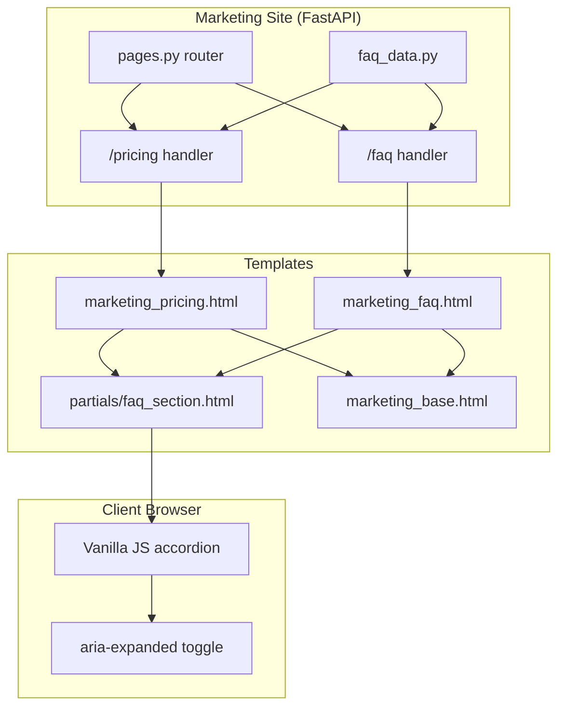

# Design Document: Sales FAQ Page

## Overview

This design describes a reusable FAQ accordion component for the RAMP marketing site. The FAQ section serves two purposes:

1. **Embedded on `/pricing`** — replaces the existing "COMMON QUESTIONS" section with a richer, compliance-vetted accordion that handles common sales objections.
2. **Standalone `/faq` route** — a dedicated page rendering the same FAQ content for linking from emails, decks, and follow-ups.

Both views share a single source of truth for FAQ content: a Python list of dictionaries defined in a dedicated data module. The template renders this data dynamically via Jinja2 context, ensuring content parity and simplifying future edits.

The FAQ content is crafted to handle pre-demo and post-demo objections while strictly adhering to RAMP's compliance language rules (no prohibited terms, no operational mechanics exposure).

## Architecture



**Key architectural decisions:**

1. **Single data source** — FAQ content lives in `app/data/faq_data.py` as a `list[dict]` (not in the template). Both route handlers import and pass it to their templates. This prevents content drift between the two pages.

2. **Shared partial** — The accordion UI is a Jinja2 `` partial (`partials/faq_section.html`). Both the pricing page and the standalone FAQ page include it, receiving the same `faq_items` context variable.

3. **No new dependencies** — Uses existing stack: FastAPI route, Jinja2 template, Tailwind CDN classes, vanilla JS.

## Components and Interfaces

### 1. FAQ Data Module (`app/data/faq_data.py`)

Holds the structured FAQ content as a Python module:

```python
FAQ_ITEMS: list[dict[str, str]] = [
    {
        "question": "...",
        "answer": "...",
    },
    # ... 7-10 entries total
]
```

Each dict has exactly two keys: `question` (str) and `answer` (str). The answer may contain inline HTML for formatting (bold, lists) but no structural elements that would break the accordion.

**Design rationale:** A Python module (not JSON file, not DB) because:
- Content changes are infrequent and reviewed (compliance-sensitive)
- No runtime I/O needed
- Type-checkable imports
- Versioned in git

### 2. Route Handlers (in `app/routes/pages.py`)

**`/pricing` handler (modified):**
```python
from app.data.faq_data import FAQ_ITEMS

@router.get("/pricing", response_class=HTMLResponse)
async def pricing(request: Request) -> HTMLResponse:
    return templates.TemplateResponse(
        request=request,
        name="marketing_pricing.html",
        context={"faq_items": FAQ_ITEMS},
    )
```

**`/faq` handler (new):**
```python
@router.get("/faq", response_class=HTMLResponse)
async def faq(request: Request) -> HTMLResponse:
    return templates.TemplateResponse(
        request=request,
        name="marketing_faq.html",
        context={"faq_items": FAQ_ITEMS},
    )
```

### 3. FAQ Section Partial (`app/templates/partials/faq_section.html`)

A Jinja2 partial that iterates over `faq_items` and renders accordion items:

```html
<div class="space-y-3" id="faq-accordion">
  
  <div class="border border-white/10 rounded-xl overflow-hidden">
    <button
      class="faq-toggle w-full flex items-center gap-4 px-6 py-5 bg-ramp-card hover:bg-ramp-card/80 transition text-left"
      aria-expanded="false"
      aria-controls="faq-answer-{{ loop.index }}"
      onclick="toggleFaq(this)"
    >
      <span class="flex-1 text-white font-semibold text-sm sm:text-base">{{ item.question }}</span>
      <svg class="faq-chevron w-5 h-5 text-gray-400 flex-shrink-0 transition-transform duration-200" ...>...</svg>
    </button>
    <div
      id="faq-answer-{{ loop.index }}"
      class="faq-content"
      role="region"
      aria-labelledby="faq-question-{{ loop.index }}"
    >
      <div class="px-6 py-4 text-gray-400 text-sm leading-relaxed">
        {{ item.answer | safe }}
      </div>
    </div>
  </div>
  
</div>
```

**Accessibility features:**
- `aria-expanded` on button (toggled by JS)
- `aria-controls` linking button to answer panel
- `role="region"` on answer panel
- Keyboard: buttons natively focusable via Tab; Enter/Space activate via native button behavior
- Touch targets: `py-5 px-6` provides ≥44px height

### 4. Accordion JavaScript

```javascript
function toggleFaq(btn) {
  const expanded = btn.getAttribute('aria-expanded') === 'true';
  btn.setAttribute('aria-expanded', String(!expanded));
  const content = btn.nextElementSibling;
  if (expanded) {
    content.classList.remove('open');
  } else {
    content.classList.add('open');
  }
}
```

CSS for the transition:
```css
.faq-content { max-height: 0; overflow: hidden; transition: max-height 0.3s ease; }
.faq-content.open { max-height: 1000px; }
.faq-chevron { transition: transform 0.2s; }
.faq-toggle[aria-expanded="true"] .faq-chevron { transform: rotate(180deg); }
```

This matches the existing `togglePhase` pattern on the roadmap page. Multiple items can be open simultaneously (no mutual exclusion logic).

### 5. Standalone FAQ Page Template (`app/templates/marketing_faq.html`)

```html

FAQ — RAMP Community Engagement
Frequently asked questions about RAMP's community engagement management platform, pricing, and services.


<section class="max-w-4xl mx-auto px-4 sm:px-6 lg:px-8 py-20">
  <div class="text-center mb-10">
    <h1 class="text-xl font-bold text-white uppercase">FREQUENTLY ASKED QUESTIONS</h1>
    <p class="mt-2 text-gray-400 text-sm">Everything you need to know before getting started.</p>
  </div>
  
  
  
  <!-- CTA -->
  <div class="mt-12 text-center">
    <a href="/onboard/trial" class="inline-block px-8 py-4 bg-ramp-electric hover:bg-ramp-blue text-white font-semibold rounded-lg transition-colors">
      Start Your Free Trial →
    </a>
  </div>
</section>

```

### 6. Pricing Page Modification

Replace the existing hardcoded "COMMON QUESTIONS" section in `marketing_pricing.html` with:

```html
<!-- FAQ -->
<section class="max-w-4xl mx-auto px-4 sm:px-6 lg:px-8 py-20">
  <div class="text-center mb-10">
    <h2 class="text-xl font-bold text-white uppercase">FREQUENTLY ASKED QUESTIONS</h2>
    <p class="mt-2 text-gray-400 text-sm">Before you book a call.</p>
  </div>
  
</section>
```

This replaces the static Q&A divs with the dynamic accordion, positioned between the Agency Plans section and the Bottom CTA — same location as current.

## Data Models

### FAQ Item Structure

```python
# app/data/faq_data.py

FAQ_ITEMS: list[dict[str, str]] = [
    {
        "question": str,  # Plain text question (no HTML)
        "answer": str,    # May contain safe inline HTML (<strong>, <br>, <ul>/<li>)
    },
]
```

**Constraints:**
- `len(FAQ_ITEMS)` must be ≥ 3 and ≤ 10
- All text must pass compliance validation (no prohibited terms)
- Each answer must contain at least one approved RAMP descriptor phrase

No database models are needed — this is static content served from a Python module.

### FAQ Content Entries (7 items)

| # | Question Topic | Requirement |
|---|---------------|-------------|
| 1 | Voice protection / restriction remedy | Req 3 |
| 2 | How RAMP differs from automated tools | Req 4 |
| 3 | Expected results / timeline | Req 5 |
| 4 | Existing account audit | Req 6 |
| 5 | Content authorship | Req 7 |
| 6 | Plan inclusions | Req 8 |
| 7 | Cancellation policy | Req 9 |

## Correctness Properties

*A property is a characteristic or behavior that should hold true across all valid executions of a system — essentially, a formal statement about what the system should do. Properties serve as the bridge between human-readable specifications and machine-verifiable correctness guarantees.*

### Property 1: Compliance Prohibited Terms Exclusion

*For any* FAQ item in the FAQ_ITEMS list, neither the question text nor the answer text shall contain any of the following prohibited terms (case-insensitive, whole-word match): "fake accounts", "fake account", "bot", "bots", "automated posting", "evading detection", "avatar", "avatars", "VPN", "multi-IP", "karma farming", "karma farm", "account warming", "account warm-up", "proxy", "residential IP", "rotating IP", "terms of service", "ToS", "Reddit rules", "platform rules", "rule violation", "policy violation", "against the rules", "ban", "shadowban", "suspended".

**Validates: Requirements 3.3, 3.4, 4.4, 6.4, 7.4, 7.5, 8.6, 11.1, 11.2, 11.3, 11.5**

### Property 2: Approved Phrase Inclusion

*For any* FAQ item in the FAQ_ITEMS list, the answer text shall contain at least one of the following approved descriptor phrases (case-insensitive): "community engagement management", "persona-driven content strategy", or "human-in-the-loop".

**Validates: Requirements 4.5, 11.4**

### Property 3: No Numerical Performance Guarantees

*For any* FAQ item in the FAQ_ITEMS list, the answer text shall not contain specific numerical performance metrics such as karma score targets, follower count promises, upvote targets, or conversion percentage guarantees. Specifically, patterns like "X karma", "X followers", "X% conversion", or "guaranteed Y results" shall not appear.

**Validates: Requirements 5.4**

### Property 4: Content Parity Between Routes

*For any* FAQ content data source, the set of questions and answers rendered on the `/pricing` page FAQ section shall be identical (same items, same order, same text) to those rendered on the `/faq` standalone page.

**Validates: Requirements 2.2**

### Property 5: FAQ Item Count Bounds

*For any* valid FAQ_ITEMS configuration, the list length shall be ≥ 3 and ≤ 10.

**Validates: Requirements 1.2**

## Error Handling

| Scenario | Handling |
|----------|----------|
| `/faq` template fails to render (e.g., missing variable) | FastAPI's default error handler returns 500. The `marketing_base.html` error page structure applies. No internal details exposed. |
| `faq_data.py` import fails | App startup fails (fail-fast). This is a deployment issue, not a runtime concern. |
| Empty `FAQ_ITEMS` list | Template renders section with no items (graceful degradation). Caught by Property 5 in tests. |
| Answer contains XSS-dangerous HTML | Answers use `| safe` filter, so content must be trusted. Since content is committed to git (not user-generated), this is acceptable. |

## Testing Strategy

### Unit Tests (pytest + httpx AsyncClient)

Following the workspace testing policy, tests will be written for:

1. **Route tests** — `GET /faq` returns 200, correct title/meta, contains FAQ content. `GET /pricing` returns 200 and contains FAQ accordion.
2. **Data validation tests** — Verify `FAQ_ITEMS` meets structural requirements (count bounds, required keys).
3. **Compliance content tests** — Verify FAQ content passes all prohibited term checks and includes required phrases.

### Property-Based Tests (Hypothesis)

PBT is applicable here for compliance validation — the prohibited terms rules are universal properties that must hold regardless of what FAQ content is authored. The property tests will:

- Generate random FAQ content structures and validate compliance rules catch violations
- Verify the compliance checker correctly rejects prohibited terms while allowing compound words (e.g., "robot" is OK, "bot" alone is not)

**Configuration:**
- Library: `hypothesis` (already in the project's test dependencies)
- Minimum 100 iterations per property test
- Tag format: **Feature: sales-faq-page, Property {N}: {title}**

### Test File

`tests/test_marketing_faq.py` — contains both route tests and compliance property tests.

**Key tests:**
| Test | Type | What it validates |
|------|------|-------------------|
| `test_faq_route_returns_200` | Route | GET /faq → 200 + correct content |
| `test_pricing_has_faq_section` | Route | GET /pricing → contains FAQ accordion |
| `test_faq_items_count_bounds` | Unit | 3 ≤ len(FAQ_ITEMS) ≤ 10 |
| `test_faq_items_have_required_keys` | Unit | Each item has "question" and "answer" |
| `test_compliance_no_prohibited_terms` | Property | Property 1 |
| `test_compliance_approved_phrases` | Property | Property 2 |
| `test_compliance_no_numerical_guarantees` | Property | Property 3 |
| `test_faq_content_parity` | Unit | Property 4 (same data source used) |
| `test_compound_words_not_flagged` | Edge case | "robot", "chatbot" are allowed |
