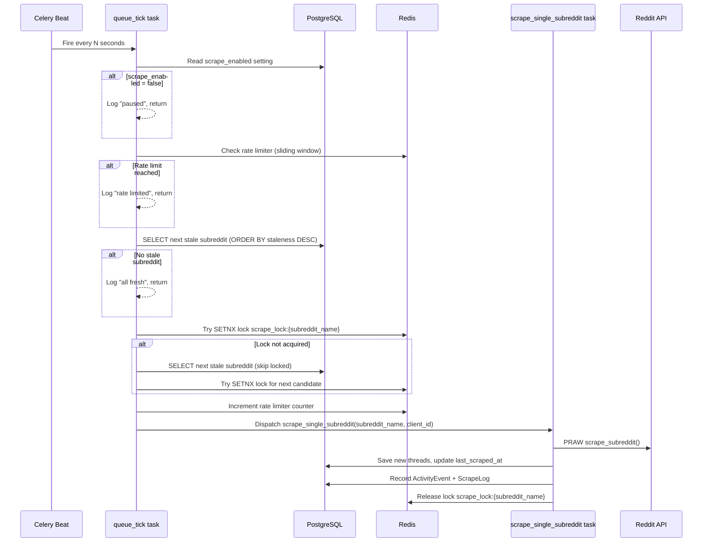

# Design Document: Scheduled Scraping Queue

## Overview

This design replaces the current batch-oriented Celery Beat crontab scraping (8:00 and 14:00 UTC burst-fire) with a continuous, priority-based scraping queue. The system introduces a **Queue Ticker** — a periodic Celery Beat task that fires every N seconds, selects the single most-stale subreddit, checks a global Redis-based rate limiter, acquires a distributed lock, and dispatches a scrape worker. This spreads Reddit API load evenly over time, eliminates burst patterns, and provides real-time admin visibility via a queue dashboard.

### Key Design Decisions

1. **Database-as-queue**: The request queue is not a separate data structure — it is a SQL query over `client_subreddits` joined with `clients`, ordered by staleness. This avoids synchronization issues between a separate queue and the source-of-truth DB.
2. **Redis for ephemeral state only**: Rate limiter counters, distributed locks, and rate-limit backoff flags live in Redis. All durable state stays in PostgreSQL.
3. **Single-dispatch-per-tick**: Each tick dispatches at most one scrape. This keeps the system simple, predictable, and easy to reason about. Throughput is controlled by tick interval + rate limit.
4. **Settings hot-reload**: All configuration (tick interval, freshness window, rate limit, enabled flag) is read from `system_settings` on every tick — no worker restart needed.

## Architecture

### System Flow Diagram



### Component Overview

```mermaid
graph TB
    subgraph "Celery Beat"
        BT[queue_tick<br/>every N sec]
    end

    subgraph "Queue Ticker Logic"
        EN[Check scrape_enabled]
        RL[Check Rate Limiter]
        QR[Query Next Stale Subreddit]
        LK[Acquire Distributed Lock]
        DP[Dispatch Worker]
    end

    subgraph "Redis"
        RLC[rate_limiter:scrape<br/>sliding window counter]
        DL[scrape_lock:{sub}<br/>per-subreddit lock]
        BO[rate_limiter:backoff<br/>429 backoff flag]
    end

    subgraph "PostgreSQL"
        SS[system_settings]
        CS[client_subreddits]
        AE[activity_events]
        SL[scrape_log]
    end

    subgraph "Scrape Worker"
        SW[scrape_single_subreddit]
        RD[Reddit API via PRAW]
    end

    subgraph "Admin UI"
        QD[Queue Dashboard<br/>/admin/scrape-queue]
    end

    BT --> EN
    EN --> RL
    RL --> QR
    QR --> LK
    LK --> DP
    DP --> SW
    SW --> RD

    EN -.-> SS
    RL -.-> RLC
    RL -.-> BO
    QR -.-> CS
    LK -.-> DL
    SW -.-> AE
    SW -.-> SL
    QD -.-> CS
    QD -.-> AE
    QD -.-> RLC
    QD -.-> DL
```

## Components and Interfaces

### 1. Queue Ticker (`app/tasks/queue_ticker.py`)

A new Celery task registered with Celery Beat. Responsible for the dispatch loop.

```python
@celery_app.task(name="queue_tick")
def queue_tick() -> dict:
    """Single tick of the scrape queue. Returns status dict for logging."""
    ...
```

**Returns** a status dict: `{"status": "dispatched"|"paused"|"rate_limited"|"all_fresh"|"error", "subreddit": str|None}`

**Internal flow:**
1. Read `scrape_enabled` from DB → if `"false"`, return `{"status": "paused"}`
2. Call `rate_limiter.is_allowed()` → if False, return `{"status": "rate_limited"}`
3. Query next stale subreddit (see Data Models section for query)
4. Try to acquire distributed lock → if fails, try next candidate (up to 3 attempts)
5. Increment rate limiter counter
6. Dispatch `scrape_single_subreddit.delay(subreddit_name, client_id)`
7. Return `{"status": "dispatched", "subreddit": subreddit_name}`

### 2. Rate Limiter Service (`app/services/rate_limiter.py`)

Redis sliding window rate limiter. Shared across all Celery workers.

```python
class ScrapeRateLimiter:
    """Global Reddit API rate limiter using Redis sliding window."""

    REDIS_KEY = "rate_limiter:scrape"
    BACKOFF_KEY = "rate_limiter:backoff"
    WINDOW_SECONDS = 60

    def __init__(self, redis_client: redis.Redis):
        self.redis = redis_client

    def is_allowed(self, max_rpm: int) -> bool:
        """Check if a request is allowed under the current rate limit."""
        ...

    def record_request(self) -> None:
        """Record that a request was made (increment counter)."""
        ...

    def get_utilization(self, max_rpm: int) -> dict:
        """Return current utilization stats for dashboard."""
        ...

    def activate_backoff(self, duration_seconds: int = 300) -> None:
        """Reduce effective rate limit by 50% for duration (on 429)."""
        ...

    def is_in_backoff(self) -> bool:
        """Check if backoff mode is active."""
        ...
```

**Redis key pattern — sliding window:**
- Key: `rate_limiter:scrape` — Redis sorted set
- Members: request timestamps (as score and value)
- On `is_allowed()`: ZREMRANGEBYSCORE to remove entries older than 60s, then ZCARD to count
- On `record_request()`: ZADD with current timestamp
- TTL: Auto-expire members via ZREMRANGEBYSCORE on each check

**Backoff key:**
- Key: `rate_limiter:backoff` — simple string with TTL
- Set on HTTP 429 with 300s TTL
- When active, `is_allowed()` uses `max_rpm // 2` as effective limit

### 3. Distributed Lock Service (`app/services/distributed_lock.py`)

Per-subreddit Redis lock to prevent concurrent scraping.

```python
class ScrapeDistributedLock:
    """Per-subreddit distributed lock using Redis SETNX."""

    KEY_PREFIX = "scrape_lock:"
    DEFAULT_TTL = 300  # 5 minutes

    def __init__(self, redis_client: redis.Redis):
        self.redis = redis_client

    def acquire(self, subreddit_name: str, ttl: int = DEFAULT_TTL) -> bool:
        """Try to acquire lock. Returns True if acquired."""
        ...

    def release(self, subreddit_name: str) -> None:
        """Release lock for subreddit."""
        ...

    def is_locked(self, subreddit_name: str) -> bool:
        """Check if subreddit is currently locked."""
        ...

    def get_all_locks(self) -> list[str]:
        """Return list of currently locked subreddit names (for dashboard)."""
        ...
```

**Redis key pattern:**
- Key: `scrape_lock:{subreddit_name}` (e.g., `scrape_lock:cybersecurity`)
- Value: worker hostname + timestamp (for debugging)
- TTL: 300 seconds (configurable)
- Acquire: `SET key value NX EX 300`
- Release: `DEL key` (only if value matches — use Lua script for atomicity)

### 4. Scrape Worker (`app/tasks/queue_ticker.py`)

A new Celery task that scrapes a single subreddit. Replaces the per-client batch approach for queue-driven scraping.

```python
@celery_app.task(name="scrape_single_subreddit", bind=True, max_retries=0)
def scrape_single_subreddit(self, subreddit_name: str, client_id: str) -> dict:
    """Scrape one subreddit for one client. Called by queue_tick."""
    ...
```

**Flow:**
1. Record start ActivityEvent (`event_type="scrape"`)
2. Call existing `scrape_subreddit()` from `services/reddit.py`
3. Deduplicate and save new threads
4. Update `client_subreddits.last_scraped_at`
5. Record ScrapeLog entry
6. Record completion ActivityEvent with stats
7. Release distributed lock
8. On error: record error ActivityEvent, release lock, do NOT update `last_scraped_at`
9. On HTTP 429: additionally call `rate_limiter.activate_backoff()`

### 5. Queue Dashboard Service (`app/services/scrape_queue.py`)

Service layer for queue dashboard data.

```python
def get_queue_status(db: Session, redis_client: redis.Redis) -> dict:
    """Build complete queue status for dashboard."""
    ...

def get_waiting_list(db: Session, redis_client: redis.Redis, freshness_hours: int) -> list[dict]:
    """Get sorted list of subreddits waiting to be scraped."""
    ...

def get_processing_speed(db: Session, window_minutes: int = 5) -> float:
    """Calculate current processing speed from recent ActivityEvents."""
    ...
```

### 6. Queue Dashboard Routes (`app/routes/admin.py`)

New admin routes for the queue dashboard page.

| Method | Path | Description |
|--------|------|-------------|
| GET | `/admin/scrape-queue` | Full queue dashboard page |
| GET | `/admin/scrape-queue/status` | HTMX partial — queue stats cards |
| GET | `/admin/scrape-queue/waiting-list` | HTMX partial — waiting subreddits table |
| POST | `/admin/scrape-queue/toggle` | Toggle scrape_enabled on/off |
| POST | `/admin/scrape-queue/settings` | Update tick interval, freshness window, rate limit |

### 7. Settings Integration

New keys added to `services/settings.py` DEFAULTS registry:

| Key | Default | Group | Description |
|-----|---------|-------|-------------|
| `scrape_enabled` | `"true"` | `scraping` | Master on/off toggle |
| `scrape_tick_interval_seconds` | `"60"` | `scraping` | Tick interval (30–300) |
| `scrape_freshness_window_hours` | `"12"` | `scraping` | Freshness window (1–168) |
| `scrape_rate_limit_rpm` | `"30"` | `scraping` | Max requests/minute (1–60) |

Validation is performed in the route handler before calling `set_setting()`.

## Data Models

### Existing Models — No Schema Changes Required

The design intentionally avoids new database tables or columns. All queue state is derived from existing data:

- **`client_subreddits.last_scraped_at`** — already exists, used for staleness calculation
- **`client_subreddits.is_active`** — already exists, filters active subreddits
- **`clients.is_active`** — already exists, filters active clients
- **`system_settings`** — already exists, stores all new config keys
- **`activity_events`** — already exists, stores scrape transparency events
- **`scrape_log`** — already exists, stores per-scrape metrics

### Queue Query (Virtual Queue)

The "request queue" is a SQL query, not a separate table:

```sql
SELECT
    cs.subreddit_name,
    cs.client_id,
    c.client_name,
    cs.last_scraped_at,
    EXTRACT(EPOCH FROM (NOW() - cs.last_scraped_at)) AS staleness_score
FROM client_subreddits cs
JOIN clients c ON c.id = cs.client_id
WHERE cs.is_active = TRUE
  AND c.is_active = TRUE
ORDER BY
    -- NULL last_scraped_at gets maximum priority
    cs.last_scraped_at ASC NULLS FIRST,
    -- Tiebreaker: alphabetical by subreddit name
    cs.subreddit_name ASC
LIMIT 5;  -- Fetch a few candidates in case some are locked
```

In SQLAlchemy:

```python
from sqlalchemy import func, case

candidates = (
    db.query(
        ClientSubreddit.subreddit_name,
        ClientSubreddit.client_id,
        Client.client_name,
        ClientSubreddit.last_scraped_at,
    )
    .join(Client, Client.id == ClientSubreddit.client_id)
    .filter(
        ClientSubreddit.is_active.is_(True),
        Client.is_active.is_(True),
    )
    .order_by(
        ClientSubreddit.last_scraped_at.asc().nulls_first(),
        ClientSubreddit.subreddit_name.asc(),
    )
    .limit(5)
    .all()
)
```

### Redis Key Patterns Summary

| Key | Type | TTL | Purpose |
|-----|------|-----|---------|
| `rate_limiter:scrape` | Sorted Set | Members auto-cleaned | Sliding window request counter |
| `rate_limiter:backoff` | String | 300s | 429 backoff flag |
| `scrape_lock:{subreddit_name}` | String | 300s | Per-subreddit distributed lock |

### Celery Beat Schedule Addition

```python
# Added to worker.py beat_schedule
"scrape-queue-tick": {
    "task": "queue_tick",
    "schedule": 60.0,  # Default; actual interval read from DB each tick
},
```

Note: The Beat schedule fires at a fixed interval (60s). The ticker itself reads `scrape_tick_interval_seconds` from DB and may skip execution if called more frequently than configured. This allows hot-reloading the interval without restarting Beat.

**Implementation detail**: The ticker stores the last execution timestamp in Redis (`queue_tick:last_run`). On each Beat fire, it checks if enough time has passed since the last run according to the DB setting. If not, it returns early. This decouples the Beat schedule from the configurable interval.


## Correctness Properties

*A property is a characteristic or behavior that should hold true across all valid executions of a system — essentially, a formal statement about what the system should do. Properties serve as the bridge between human-readable specifications and machine-verifiable correctness guarantees.*

### Property 1: Queue filtering and depth

*For any* set of clients and subreddits with varying `is_active` states, the queue query SHALL return exactly those subreddits where both `client_subreddits.is_active = True` AND `clients.is_active = True`, and the queue depth count SHALL equal the number of such subreddits.

**Validates: Requirements 1.1, 6.1**

### Property 2: Staleness score computation

*For any* subreddit with a `last_scraped_at` timestamp (including NULL), the computed staleness score SHALL equal `NOW() - last_scraped_at` in seconds, and subreddits with `last_scraped_at = NULL` SHALL have a staleness score greater than any subreddit with a non-NULL timestamp.

**Validates: Requirements 1.2, 1.3**

### Property 3: Queue ordering and waiting list completeness

*For any* set of active subreddits with varying `last_scraped_at` values and a given freshness window, the waiting list SHALL be sorted by staleness descending (NULL first, then oldest), with alphabetical tiebreaking on equal timestamps, and each entry SHALL contain subreddit name, client name, `last_scraped_at`, and staleness score. All stale subreddits SHALL appear before all fresh subreddits.

**Validates: Requirements 1.4, 1.5, 1.7, 6.4**

### Property 4: Settings range validation

*For any* integer value and setting with a defined valid range (`scrape_tick_interval_seconds`: 30–300, `scrape_freshness_window_hours`: 1–168, `scrape_rate_limit_rpm`: 1–60), values outside the valid range SHALL be rejected with a descriptive error, and values inside the range SHALL be accepted.

**Validates: Requirements 2.8, 2.9, 3.7**

### Property 5: Rate limiter enforcement

*For any* configured `max_rpm` value, after recording exactly `max_rpm` requests within a 60-second window, the rate limiter's `is_allowed()` SHALL return False. After the window slides past the oldest request, `is_allowed()` SHALL return True again.

**Validates: Requirements 3.1**

### Property 6: Scrape completion event metadata

*For any* scrape result with `posts_found`, `posts_new`, `duration_ms`, and `subreddit_name` values, the completion ActivityEvent's metadata SHALL contain all four fields with matching values.

**Validates: Requirements 5.3**

### Property 7: Stale subreddit count

*For any* set of active subreddits with varying `last_scraped_at` timestamps and a given freshness window in hours, the stale count SHALL equal the number of subreddits whose `last_scraped_at` is NULL or older than `NOW() - freshness_window`.

**Validates: Requirements 6.2**

### Property 8: Processing speed calculation

*For any* set of ActivityEvents with `event_type = "scrape"` and varying `created_at` timestamps, the processing speed SHALL equal the count of events within the last 5 minutes divided by 5 (requests per minute).

**Validates: Requirements 6.3**

### Property 9: ETA calculation

*For any* non-negative queue depth and positive processing speed (requests per minute), the estimated time to empty SHALL equal `queue_depth / processing_speed` in minutes. When processing speed is zero, ETA SHALL be reported as infinity or N/A.

**Validates: Requirements 6.6**

### Property 10: Rate limiter utilization

*For any* current request count within the sliding window and configured `max_rpm`, the utilization percentage SHALL equal `(current_count / max_rpm) * 100`, clamped to [0, 100].

**Validates: Requirements 6.7**

### Property 11: Backoff halves effective rate limit

*For any* configured `max_rpm` value, when the rate limiter is in backoff mode (after a 429 response), the effective rate limit SHALL be `max_rpm // 2`. When backoff expires, the effective rate limit SHALL return to `max_rpm`.

**Validates: Requirements 8.5**

## Error Handling

### Queue Ticker Error Handling

The `queue_tick` task wraps its entire body in a try/except to ensure the Celery worker never crashes:

```python
@celery_app.task(name="queue_tick")
def queue_tick() -> dict:
    try:
        # ... main logic ...
    except redis.ConnectionError:
        logger.warning("queue_tick: Redis unavailable, skipping tick")
        return {"status": "error", "reason": "redis_unavailable"}
    except sqlalchemy.exc.OperationalError:
        logger.warning("queue_tick: Database unavailable, skipping tick")
        return {"status": "error", "reason": "db_unavailable"}
    except Exception as e:
        logger.exception("queue_tick: Unexpected error: %s", e)
        return {"status": "error", "reason": str(e)}
```

### Scrape Worker Error Handling

The `scrape_single_subreddit` task uses a try/finally to guarantee lock release:

```python
@celery_app.task(name="scrape_single_subreddit", bind=True, max_retries=0)
def scrape_single_subreddit(self, subreddit_name: str, client_id: str) -> dict:
    lock = ScrapeDistributedLock(get_redis_client())
    try:
        # ... scrape logic ...
    except TooManyRequests as e:
        # Record 429 event, activate backoff, do NOT update last_scraped_at
        rate_limiter.activate_backoff(duration_seconds=300)
        record_activity_event(db, "system", f"Reddit 429 for r/{subreddit_name}", ...)
        return {"status": "rate_limited", "subreddit": subreddit_name}
    except Exception as e:
        # Record error event, do NOT update last_scraped_at
        record_activity_event(db, "system", f"Scrape failed for r/{subreddit_name}: {e}", ...)
        return {"status": "error", "subreddit": subreddit_name, "error": str(e)}
    finally:
        lock.release(subreddit_name)
        db.close()
```

### Error Scenarios Summary

| Scenario | Behavior | Retry? |
|----------|----------|--------|
| Redis down during rate limit check | Skip tick, log warning | Next tick |
| DB down during queue query | Skip tick, log warning | Next tick |
| Lock already held | Skip subreddit, try next candidate | Same tick (next candidate) |
| Reddit API 429 | Record event, activate 50% backoff for 5 min, release lock | Next tick (with reduced rate) |
| Reddit API error (other) | Record error event, release lock | Next tick |
| Worker crash mid-scrape | Lock expires after 300s TTL | After TTL expiry |
| Scrape returns 0 posts | Normal completion, update last_scraped_at | N/A (success) |

### Distributed Lock Safety

The lock release uses a Lua script to ensure atomicity — only the worker that acquired the lock can release it:

```lua
-- Release lock only if value matches (prevents releasing someone else's lock)
if redis.call("GET", KEYS[1]) == ARGV[1] then
    return redis.call("DEL", KEYS[1])
else
    return 0
end
```

## Testing Strategy

### Property-Based Tests (Hypothesis)

The project already uses Hypothesis (`.hypothesis/` directory exists). Each correctness property maps to one property-based test with minimum 100 iterations.

**Library**: `hypothesis` (already in project)
**Location**: `reddit_saas/tests/test_scrape_queue_properties.py`

Each test is tagged with:
```python
# Feature: scheduled-scraping, Property {N}: {property_text}
```

**Properties to implement as PBT:**

| Property | Test Function | Key Generators |
|----------|--------------|----------------|
| P1: Queue filtering | `test_queue_returns_only_active` | Random active/inactive client+subreddit combos |
| P2: Staleness score | `test_staleness_score_computation` | Random timestamps including None |
| P3: Queue ordering | `test_queue_ordering_by_staleness` | Random timestamps with duplicates |
| P4: Range validation | `test_settings_range_validation` | Random integers, parameterized by setting ranges |
| P5: Rate limiter | `test_rate_limiter_enforcement` | Random max_rpm (1–60) |
| P6: Event metadata | `test_completion_event_metadata` | Random posts_found, posts_new, duration values |
| P7: Stale count | `test_stale_subreddit_count` | Random timestamps + freshness windows |
| P8: Processing speed | `test_processing_speed_calculation` | Random event timestamps |
| P9: ETA calculation | `test_eta_calculation` | Random depth + speed values |
| P10: Utilization | `test_utilization_percentage` | Random count + max_rpm |
| P11: Backoff | `test_backoff_halves_rate_limit` | Random max_rpm values |

### Unit Tests (pytest)

**Location**: `reddit_saas/tests/test_scrape_queue.py`

Example-based tests for specific scenarios and edge cases:

- **Ticker paused**: `scrape_enabled=false` → no dispatch, correct log
- **Ticker rate limited**: rate limiter returns False → skip, correct log
- **Ticker all fresh**: no stale subreddits → skip, correct status
- **Lock fallback**: first candidate locked → selects second
- **Lock release on success**: scrape completes → lock released
- **Lock release on error**: scrape fails → lock released
- **429 handling**: TooManyRequests → backoff activated, lock released, no timestamp update
- **Redis down**: ConnectionError → graceful skip
- **DB down**: OperationalError → graceful skip
- **Default settings**: all 4 new settings have correct defaults
- **Dashboard toggle**: POST toggle flips scrape_enabled
- **Dashboard empty queue**: all fresh → "all fresh" message

### Integration Tests

**Location**: `reddit_saas/tests/test_scrape_queue_integration.py`

Tests requiring real Redis (or fakeredis):

- Sliding window counter behavior over time
- Lock acquire/release/TTL expiry cycle
- Lock atomicity (Lua script correctness)
- Backoff flag TTL expiry
- Dashboard lock detection via Redis SCAN

### Test Configuration

```python
# conftest.py additions
@pytest.fixture
def fake_redis():
    """In-memory Redis for unit tests."""
    import fakeredis
    return fakeredis.FakeRedis()

@pytest.fixture
def rate_limiter(fake_redis):
    return ScrapeRateLimiter(fake_redis)

@pytest.fixture
def distributed_lock(fake_redis):
    return ScrapeDistributedLock(fake_redis)
```
