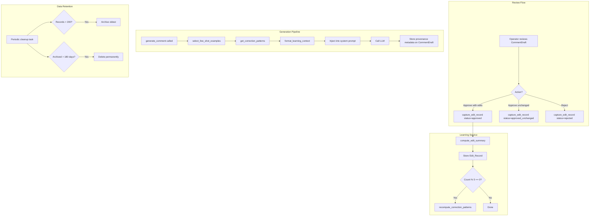

# Design Document: Self-Learning Loop

## Overview

The Self-Learning Loop captures human edits to AI-generated comment drafts and feeds those corrections back into the generation pipeline as few-shot examples and distilled correction patterns. This creates a flywheel where each avatar's voice improves with every human review action.

The system operates in three phases:
1. **Capture** — On every review action (approve/reject), store the original draft, the human edit, and a computed diff summary
2. **Learn** — Extract recurring correction patterns from accumulated edits; select relevant examples for future generations
3. **Inject** — Augment the generation prompt with learned examples and patterns, placed between voice profile and thread content

### Design Principles

- **Zero degradation** — If no edit history exists, the pipeline behaves exactly as before
- **Deterministic diffs** — Edit summaries use algorithmic diffing, not LLM calls (predictable, free, fast)
- **Bounded storage** — Hard cap of 200 active records per avatar-client pair with TTL-based cleanup
- **Minimal token overhead** — Few-shot examples add ~800-1200 tokens; correction patterns add ~200 tokens

## Architecture



## Components and Interfaces

### 1. Edit Record Model (`app/models/edit_record.py`)

New SQLAlchemy model storing each human edit with full context.

### 2. Correction Pattern Model (`app/models/correction_pattern.py`)

Stores distilled patterns extracted from accumulated edits.

### 3. Learning Service (`app/services/learning.py`)

Core service with these public methods:

```python
class LearningService:
    def capture_edit_record(
        self, db: Session, draft: CommentDraft, thread: RedditThread, status: str
    ) -> EditRecord:
        """Called on every review action. Computes diff, stores record, triggers pattern recomputation if needed."""

    def compute_edit_summary(self, ai_draft: str, edited_draft: str) -> str | None:
        """Deterministic diff algorithm. Returns semicolon-separated change description or None if identical."""

    def select_few_shot_examples(
        self, db: Session, avatar_id: UUID, client_id: UUID, subreddit: str, engagement_mode: str
    ) -> list[EditRecord]:
        """Returns up to 3 relevant examples (max 1 negative) from the 50 most recent non-archived records."""

    def get_correction_patterns(
        self, db: Session, avatar_id: UUID, client_id: UUID
    ) -> list[CorrectionPattern]:
        """Returns top 3 patterns by frequency. Empty list if fewer than 5 qualifying edit records."""

    def format_learning_context(
        self, examples: list[EditRecord], patterns: list[CorrectionPattern]
    ) -> str:
        """Formats examples and patterns into prompt-ready text."""

    def enforce_retention_limits(self, db: Session, avatar_id: UUID, client_id: UUID) -> int:
        """Archives records beyond 200, deletes archived records older than 180 days. Returns count of actions taken."""
```

### 4. Generation Pipeline Integration

Modification to `app/services/generation.py` — the `generate_comment` function gains a learning context injection step between voice profile and thread content.

### 5. Review Route Hook

Modification to `app/routes/review.py` — the `update_comment` endpoint calls `capture_edit_record` after status transitions.

### 6. Admin API Endpoints

New endpoints in `app/routes/admin.py`:

| Endpoint | Method | Purpose |
|----------|--------|---------|
| `/admin/avatars/{id}/learning-panel` | GET | HTMX partial for avatar learning stats |
| `/admin/comments/{id}/debug-view` | GET | HTMX partial for generation provenance |

### 7. Templates

| Template | Purpose |
|----------|---------|
| `partials/avatar_learning_panel.html` | Learning stats block on avatar detail page |
| `partials/comment_debug_view.html` | Expandable provenance section in review UI |

## Data Models

### Edit Record Table

```sql
CREATE TABLE edit_records (
    id UUID PRIMARY KEY DEFAULT gen_random_uuid(),
    comment_draft_id UUID NOT NULL REFERENCES comment_drafts(id),
    avatar_id UUID NOT NULL REFERENCES avatars(id),
    client_id UUID NOT NULL REFERENCES clients(id),

    -- Content
    ai_draft TEXT NOT NULL,
    edited_draft TEXT,                    -- NULL for rejected drafts
    edit_summary VARCHAR(500),            -- NULL if unchanged or rejected

    -- Context
    subreddit VARCHAR(255) NOT NULL,
    engagement_mode VARCHAR(100),
    post_title TEXT NOT NULL,
    post_body VARCHAR(500),               -- Truncated to 500 chars
    final_status VARCHAR(50) NOT NULL,    -- approved | approved_unchanged | rejected

    -- Lifecycle
    is_archived BOOLEAN NOT NULL DEFAULT FALSE,
    created_at TIMESTAMPTZ NOT NULL DEFAULT NOW(),

    -- Indexes
    CONSTRAINT chk_final_status CHECK (final_status IN ('approved', 'approved_unchanged', 'rejected'))
);

CREATE INDEX ix_edit_records_avatar_client ON edit_records(avatar_id, client_id);
CREATE INDEX ix_edit_records_avatar_client_created ON edit_records(avatar_id, client_id, created_at DESC);
CREATE INDEX ix_edit_records_subreddit ON edit_records(avatar_id, client_id, subreddit);
CREATE INDEX ix_edit_records_not_archived ON edit_records(avatar_id, client_id)
    WHERE is_archived = FALSE;
```

### Correction Pattern Table

```sql
CREATE TABLE correction_patterns (
    id UUID PRIMARY KEY DEFAULT gen_random_uuid(),
    avatar_id UUID NOT NULL REFERENCES avatars(id),
    client_id UUID NOT NULL REFERENCES clients(id),

    -- Pattern data
    pattern_type VARCHAR(50) NOT NULL,    -- length_adjustment | tone_shift | vocabulary_change | structure_change | content_removal | content_addition
    rule_text VARCHAR(100) NOT NULL,      -- Imperative rule for prompt injection
    frequency INTEGER NOT NULL DEFAULT 1,
    last_seen_at TIMESTAMPTZ NOT NULL,

    -- Lifecycle
    created_at TIMESTAMPTZ NOT NULL DEFAULT NOW(),
    updated_at TIMESTAMPTZ NOT NULL DEFAULT NOW(),

    CONSTRAINT chk_pattern_type CHECK (pattern_type IN (
        'length_adjustment', 'tone_shift', 'vocabulary_change',
        'structure_change', 'content_removal', 'content_addition'
    ))
);

CREATE UNIQUE INDEX ix_correction_patterns_avatar_client_rule
    ON correction_patterns(avatar_id, client_id, rule_text);
CREATE INDEX ix_correction_patterns_frequency
    ON correction_patterns(avatar_id, client_id, frequency DESC);
```

### CommentDraft Metadata Extension

Add a JSONB column to `comment_drafts` for generation provenance:

```sql
ALTER TABLE comment_drafts
    ADD COLUMN learning_metadata JSONB;
```

Structure of `learning_metadata`:
```json
{
    "edit_record_ids": ["uuid1", "uuid2", "uuid3"],
    "correction_patterns": ["Keep under 50 words", "Never use em-dashes"],
    "learning_token_count": 847
}
```

### SQLAlchemy Models

```python
# app/models/edit_record.py
class EditRecord(Base):
    __tablename__ = "edit_records"

    id: Mapped[uuid.UUID] = mapped_column(UUID(as_uuid=True), primary_key=True, default=uuid.uuid4)
    comment_draft_id: Mapped[uuid.UUID] = mapped_column(UUID(as_uuid=True), ForeignKey("comment_drafts.id"), nullable=False)
    avatar_id: Mapped[uuid.UUID] = mapped_column(UUID(as_uuid=True), ForeignKey("avatars.id"), nullable=False)
    client_id: Mapped[uuid.UUID] = mapped_column(UUID(as_uuid=True), ForeignKey("clients.id"), nullable=False)

    ai_draft: Mapped[str] = mapped_column(Text, nullable=False)
    edited_draft: Mapped[str | None] = mapped_column(Text, nullable=True)
    edit_summary: Mapped[str | None] = mapped_column(String(500), nullable=True)

    subreddit: Mapped[str] = mapped_column(String(255), nullable=False)
    engagement_mode: Mapped[str | None] = mapped_column(String(100), nullable=True)
    post_title: Mapped[str] = mapped_column(Text, nullable=False)
    post_body: Mapped[str | None] = mapped_column(String(500), nullable=True)
    final_status: Mapped[str] = mapped_column(String(50), nullable=False)

    is_archived: Mapped[bool] = mapped_column(Boolean, default=False, server_default="false")
    created_at: Mapped[datetime] = mapped_column(DateTime(timezone=True), server_default=func.now())
```

```python
# app/models/correction_pattern.py
class CorrectionPattern(Base):
    __tablename__ = "correction_patterns"

    id: Mapped[uuid.UUID] = mapped_column(UUID(as_uuid=True), primary_key=True, default=uuid.uuid4)
    avatar_id: Mapped[uuid.UUID] = mapped_column(UUID(as_uuid=True), ForeignKey("avatars.id"), nullable=False)
    client_id: Mapped[uuid.UUID] = mapped_column(UUID(as_uuid=True), ForeignKey("clients.id"), nullable=False)

    pattern_type: Mapped[str] = mapped_column(String(50), nullable=False)
    rule_text: Mapped[str] = mapped_column(String(100), nullable=False)
    frequency: Mapped[int] = mapped_column(Integer, default=1, nullable=False)
    last_seen_at: Mapped[datetime] = mapped_column(DateTime(timezone=True), nullable=False)

    created_at: Mapped[datetime] = mapped_column(DateTime(timezone=True), server_default=func.now())
    updated_at: Mapped[datetime] = mapped_column(DateTime(timezone=True), server_default=func.now(), onupdate=func.now())
```

### Edit Summary Algorithm

The `compute_edit_summary` function uses a deterministic word-level diff:

```python
def compute_edit_summary(ai_draft: str, edited_draft: str) -> str | None:
    """Compute a human-readable summary of changes between two texts.

    Returns None if texts are identical.
    Returns semicolon-separated change descriptions, max 500 chars.
    """
    if ai_draft == edited_draft:
        return None

    ai_words = ai_draft.split()
    edited_words = edited_draft.split()

    changes: list[str] = []

    # Word count change
    if len(ai_words) != len(edited_words):
        changes.append(f"{'shortened' if len(edited_words) < len(ai_words) else 'lengthened'} {len(ai_words)}→{len(edited_words)} words")

    # Removed words (in ai but not in edited)
    removed = set(ai_words) - set(edited_words)
    if removed:
        sample = sorted(removed)[:3]
        changes.append(f"removed '{'; '.join(sample)}'")

    # Added words (in edited but not in ai)
    added = set(edited_words) - set(ai_words)
    if added:
        sample = sorted(added)[:3]
        changes.append(f"added '{'; '.join(sample)}'")

    # Structural changes
    ai_sentences = ai_draft.count('.') + ai_draft.count('!') + ai_draft.count('?')
    edited_sentences = edited_draft.count('.') + edited_draft.count('!') + edited_draft.count('?')
    if ai_sentences != edited_sentences:
        changes.append(f"restructured {ai_sentences}→{edited_sentences} sentences")

    summary = "; ".join(changes)
    return summary[:500] if summary else None
```

### Few-Shot Example Selection Algorithm

Priority-based selection from the 50 most recent non-archived records:

```python
def select_few_shot_examples(
    self, db: Session, avatar_id: UUID, client_id: UUID,
    subreddit: str, engagement_mode: str
) -> list[EditRecord]:
    """Select up to 3 examples (max 1 negative) using priority scoring."""

    # Query the 50 most recent non-archived records for this avatar-client
    candidates = (
        db.query(EditRecord)
        .filter(
            EditRecord.avatar_id == avatar_id,
            EditRecord.client_id == client_id,
            EditRecord.is_archived == False,
        )
        .order_by(EditRecord.created_at.desc())
        .limit(50)
        .all()
    )

    # Score each candidate by relevance
    def relevance_score(record: EditRecord) -> tuple[int, int, datetime]:
        sub_match = 2 if record.subreddit == subreddit else 0
        mode_match = 1 if record.engagement_mode == engagement_mode else 0
        return (sub_match, mode_match, record.created_at)

    # Separate positive and negative examples
    positives = [r for r in candidates if r.final_status == "approved"]
    negatives = [r for r in candidates if r.final_status == "rejected"]

    # Sort by relevance
    positives.sort(key=relevance_score, reverse=True)
    negatives.sort(key=relevance_score, reverse=True)

    # Select: up to 2 positives + up to 1 negative, total max 3
    results = positives[:2]
    if negatives:
        results.append(negatives[0])
    elif len(positives) > 2:
        results.append(positives[2])

    return results[:3]
```

### Prompt Injection Format

The learning context is injected into the system prompt between voice profile and thread content:

```
## Voice Profile
{voice_profile}

## Learned Corrections from Past Reviews
### Correction Rules
- Keep comments under 50 words
- Never use em-dashes
- Use casual tone, avoid formal language

### Examples of Past Corrections
**Example 1 (approved edit):**
BEFORE: "The landscape of cybersecurity is shifting — organizations need to rethink their approach to exposure management."
AFTER: "honestly most orgs are still running vuln scanners and calling it exposure management. wild."

**Example 2 (rejected draft — avoid this style):**
BEFORE: "I'd argue that the ecosystem of threat detection tools has fundamentally evolved."
(This was rejected by the reviewer)

## Thread Content
{thread_content}
```

## Correctness Properties

*A property is a characteristic or behavior that should hold true across all valid executions of a system — essentially, a formal statement about what the system should do. Properties serve as the bridge between human-readable specifications and machine-verifiable correctness guarantees.*

### Property 1: Edit capture produces correct record structure

*For any* CommentDraft and review action (approve-with-edits, approve-unchanged, reject), calling `capture_edit_record` SHALL produce an EditRecord where: (a) final_status matches the action type, (b) ai_draft is always non-null, (c) edited_draft is null iff status is "rejected", (d) edit_summary is null iff status is "rejected" or "approved_unchanged", (e) created_at is non-null, and (f) post_body length is ≤ 500 characters.

**Validates: Requirements 1.1, 1.2, 1.3, 1.5, 1.6**

### Property 2: Edit summary determinism

*For any* two strings (ai_draft, edited_draft), calling `compute_edit_summary` multiple times with the same inputs SHALL always produce the same output.

**Validates: Requirements 7.1**

### Property 3: Edit summary format invariants

*For any* two distinct strings (ai_draft, edited_draft) where ai_draft ≠ edited_draft, the resulting Edit_Summary SHALL be a non-empty semicolon-separated string with length ≤ 500 characters.

**Validates: Requirements 7.2, 7.3**

### Property 4: Edit summary null on identity

*For any* string s, `compute_edit_summary(s, s)` SHALL return None.

**Validates: Requirements 7.4**

### Property 5: Example selection bounds and priority

*For any* avatar-client pair with N edit records (N ≥ 0), `select_few_shot_examples` SHALL return at most 3 examples total, with at most 1 having final_status="rejected". When a same-subreddit example exists, it SHALL appear before a different-subreddit example in the result.

**Validates: Requirements 2.1, 2.2, 2.3**

### Property 6: Prompt formatting contains required sections

*For any* non-empty list of Few_Shot_Examples, `format_learning_context` SHALL produce output containing the label "Learned corrections from past reviews" and for each example, both the BEFORE and AFTER text (or rejection indicator).

**Validates: Requirements 2.4**

### Property 7: Pattern computation threshold and limit

*For any* avatar-client pair, `get_correction_patterns` SHALL return an empty list when fewer than 5 qualifying edit records exist, and at most 3 patterns when 5 or more exist.

**Validates: Requirements 2.5, 3.1**

### Property 8: Pattern rule length constraint

*For any* CorrectionPattern, the rule_text field SHALL have length ≤ 100 characters.

**Validates: Requirements 3.5**

### Property 9: Retention limit enforcement

*For any* avatar-client pair, after calling `enforce_retention_limits`, the count of non-archived EditRecords SHALL be ≤ 200, and any archived record older than 180 days SHALL be deleted.

**Validates: Requirements 6.1, 6.2, 6.5**

### Property 10: Example selection window

*For any* avatar-client pair with more than 50 non-archived records, `select_few_shot_examples` SHALL only return records from the 50 most recent non-archived records.

**Validates: Requirements 6.3**

### Property 11: Generation provenance storage

*For any* generation that uses learning context, the resulting CommentDraft's `learning_metadata` SHALL contain the IDs of all used EditRecords and the text of all applied CorrectionPatterns.

**Validates: Requirements 5.1**

## Error Handling

| Scenario | Handling | Impact |
|----------|----------|--------|
| `compute_edit_summary` fails (unexpected text format) | Log warning, store Edit_Record with null summary | Learning continues, pattern computation may miss this record |
| DB error saving Edit_Record | Log error, do NOT fail the review action | Review workflow unaffected; edit lost for learning |
| `select_few_shot_examples` returns empty (no records) | Skip learning context injection | Generation proceeds normally (zero degradation) |
| Pattern recomputation fails | Log error, keep existing patterns | Stale patterns used until next successful recomputation |
| `learning_metadata` storage fails | Log warning, draft saved without metadata | Debug view shows "metadata unavailable" |
| Retention cleanup fails mid-batch | Log error, partial cleanup is fine | Next run will catch remaining records |

### Key Principle: Learning is Non-Critical

The learning loop MUST NEVER block or fail the review workflow or generation pipeline. All learning operations are wrapped in try/except with logging. If learning fails, the system degrades gracefully to its pre-learning behavior.

## Testing Strategy

### Property-Based Tests (Hypothesis)

The feature is well-suited for property-based testing because the core logic involves pure functions (diff computation, example selection, pattern extraction) with clear input/output behavior and universal properties.

**Library:** [Hypothesis](https://hypothesis.readthedocs.io/) (already in use — `.hypothesis/` directory exists in project)

**Configuration:** Minimum 100 iterations per property test.

**Tag format:** `# Feature: self-learning-loop, Property {N}: {property_text}`

Each correctness property (1-11) maps to a single property-based test:

| Property | Test File | What's Generated |
|----------|-----------|-----------------|
| 1 | `tests/test_learning_capture_props.py` | Random CommentDrafts with varying ai_draft/edited_draft/status |
| 2-4 | `tests/test_edit_summary_props.py` | Random string pairs (varying lengths, content, whitespace) |
| 5, 10 | `tests/test_example_selection_props.py` | Random EditRecord sets with varying subreddits, modes, statuses |
| 6 | `tests/test_prompt_format_props.py` | Random EditRecords and CorrectionPatterns |
| 7 | `tests/test_pattern_computation_props.py` | Random EditRecord sets of varying sizes |
| 8 | `tests/test_pattern_constraints_props.py` | Random pattern generation |
| 9 | `tests/test_retention_props.py` | Random EditRecord sets with varying ages and archive states |
| 11 | `tests/test_provenance_props.py` | Random generation contexts with learning data |

### Unit Tests (pytest)

- Review route integration: verify `capture_edit_record` is called on approve/reject
- Admin panel endpoint: verify correct stats are returned
- Debug view endpoint: verify metadata is rendered correctly
- Empty state handling: verify graceful behavior with zero records
- Pattern recomputation trigger: verify fires at count multiples of 5

### Integration Tests

- End-to-end: approve a draft with edits → verify Edit_Record created → generate new comment → verify learning context in prompt
- Retention cleanup: create 210 records → run cleanup → verify 200 remain active
- Pattern extraction: create 5+ records with similar edits → verify patterns are extracted

### Test Data Generators (Hypothesis strategies)

```python
from hypothesis import strategies as st

# Generate realistic comment drafts
draft_text = st.text(min_size=10, max_size=500, alphabet=st.characters(whitelist_categories=('L', 'N', 'P', 'Z')))

# Generate EditRecord-like data
edit_record_data = st.fixed_dictionaries({
    "ai_draft": draft_text,
    "edited_draft": st.one_of(draft_text, st.none()),
    "subreddit": st.sampled_from(["cybersecurity", "netsec", "sysadmin", "devops", "programming"]),
    "engagement_mode": st.sampled_from(["bullseye", "helpful_peer", "karma_only"]),
    "final_status": st.sampled_from(["approved", "approved_unchanged", "rejected"]),
})
```
