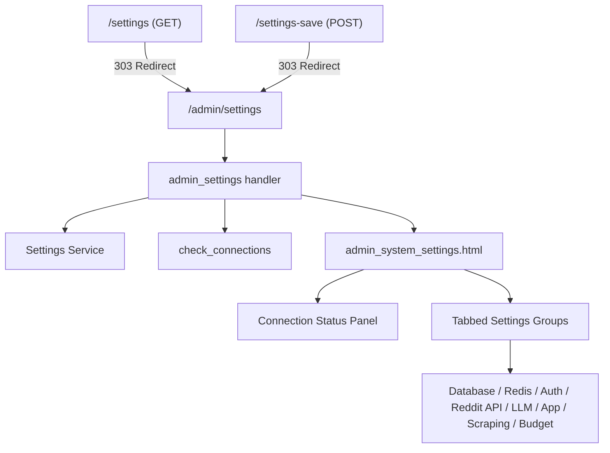

# Design Document: Settings Consolidation

## Overview

This feature consolidates two separate settings pages — `/admin/settings` (admin panel, dark theme) and `/settings` (user-facing, light theme) — into a single unified settings page at `/admin/settings`. The old `/settings` route becomes a redirect, dead code is removed, a Connection Status Panel is added, and the Scraping group tab is surfaced in the tab navigation.

### Design Rationale

In the current agency model, Max is both admin and user. Maintaining two settings pages with different themes, different save mechanisms, and overlapping functionality creates confusion and maintenance burden. The admin settings page already has superior UX (tabbed groups, inline edit, HTMX, bulk save, connection tests), so it becomes the single source of truth.

## Architecture



### Change Summary

| Layer | Action | Details |
|-------|--------|---------|
| Routes (pages.py) | Replace | `settings_page` → redirect; remove `settings_save`, `settings_save_async` |
| Routes (admin.py) | Keep | All existing admin settings endpoints unchanged |
| Template | Delete | `settings.html` |
| Template | Modify | `admin_system_settings.html` — add Connection Status Panel, add Scraping tab |
| Template | Modify | `base.html` — remove `/settings` link, add `/admin/settings` for admins |
| Service | Keep | `check_connections()` remains; used by Connection Status Panel |
| Service | Modify | `admin_settings` handler calls `check_connections()` and passes result to template |

## Components and Interfaces

### 1. Route Changes (pages.py)

**Remove:**
- `settings_save()` — POST /settings handler
- `settings_save_async()` — POST /settings-save handler

**Replace:**
- `settings_page()` → simple redirect function returning `RedirectResponse(url="/admin/settings", status_code=303)`
- Add redirect for POST /settings-save → `/admin/settings` (303)

```python
@router.get("/settings")
def settings_page(request: Request):
    return RedirectResponse(url="/admin/settings", status_code=303)

@router.post("/settings-save")
async def settings_save_redirect(request: Request):
    return RedirectResponse(url="/admin/settings", status_code=303)
```

### 2. Admin Settings Route Enhancement (admin.py)

The existing `admin_settings` handler is modified to also call `check_connections()` and pass the result to the template context:

```python
@router.get("/settings", response_class=HTMLResponse)
def admin_settings(request, current_user, db):
    # ... existing logic ...
    connections = check_connections(db)
    
    return templates.TemplateResponse(
        name="admin_system_settings.html",
        context={
            "request": request,
            "active_nav": "settings",
            "grouped_settings": grouped,
            "connections": connections,  # NEW
        },
    )
```

### 3. Connection Status Panel (Template Component)

A new section at the top of `admin_system_settings.html`, above the tabs. Renders four service indicators using data from `check_connections()`:

| Service | Status Source | Green | Gray | Red |
|---------|--------------|-------|------|-----|
| Reddit API | `connections.reddit.configured` + `.status` | "connected" | not configured | error |
| LLM | `connections.llm.configured` | configured=True | configured=False | — |
| Database | `connections.database.status` | "connected" | — | — |
| Redis | `connections.redis.status` | "connected" | — | — |

Each indicator is a small card with a colored dot, service name, and status label.

### 4. Scraping Tab Addition (Template)

Update `group_order` and `group_labels` in `admin_system_settings.html`:

```python
# Before:
group_order = ['database', 'redis', 'auth', 'reddit_api', 'llm', 'app', 'budget']

# After:
group_order = ['database', 'redis', 'auth', 'reddit_api', 'llm', 'app', 'scraping', 'budget']
```

Add label and icon for the scraping group. The scraping settings (`scrape_enabled`, `scrape_tick_interval_seconds`, `scrape_freshness_window_hours`, `scrape_rate_limit_rpm`) already exist in the DEFAULTS dict with `group: "scraping"`, so they will automatically appear once the tab is added.

### 5. Navigation Updates

**base.html:**
- Remove: `<a href="/settings" ...>⚙️ Settings</a>`
- Add (inside `` block): `<a href="/admin/settings" ...>⚙️ Settings</a>`

**admin_base.html:**
- No changes needed — the "System Settings" link to `/admin/settings` already exists in the sidebar.

### 6. Files to Delete

- `reddit_saas/app/templates/settings.html`

## Data Models

No data model changes required. The existing `SystemSetting` model and `DEFAULTS` registry already support all needed groups including "scraping". The `check_connections()` function already returns the connection status dict in the correct format.

### Existing Model (unchanged)

```python
class SystemSetting(Base):
    __tablename__ = "system_settings"
    id: UUID
    key: str          # unique, indexed
    value: str
    is_secret: bool
    description: str | None
    group: str        # "database", "redis", "auth", "reddit_api", "llm", "app", "scraping", "budget"
    updated_at: datetime
```

### check_connections() Return Shape (unchanged)

```python
{
    "reddit": {"configured": bool, "status": str},
    "llm": {"configured": bool, "provider": str},
    "database": {"configured": True, "status": "connected"},
    "redis": {"configured": True, "status": "connected"},
}
```

## Correctness Properties

*A property is a characteristic or behavior that should hold true across all valid executions of a system — essentially, a formal statement about what the system should do. Properties serve as the bridge between human-readable specifications and machine-verifiable correctness guarantees.*

### Property 1: Bulk save round-trip

*For any* valid subset of setting keys from the DEFAULTS registry and any non-empty string values, calling `bulk_save_settings(db, updates, user_id)` followed by `get_setting(db, key)` for each key in the update set SHALL return the value that was saved.

**Validates: Requirements 4.3**

### Property 2: Audit logging with user attribution

*For any* valid setting key, any string value, and any valid user_id, calling `set_setting(db, key, value, user_id)` SHALL produce an audit log entry where `action="update"`, `entity_type="system_setting"`, the details contain the setting key, and the `user_id` matches the caller's user_id.

**Validates: Requirements 6.1, 6.3**

### Property 3: Secret redaction in audit logs

*For any* setting key where `DEFAULTS[key]["secret"] == True` and any string value, calling `set_setting(db, key, value, user_id)` SHALL produce an audit log entry where the details value field contains `"[REDACTED]"` and does NOT contain the actual secret value.

**Validates: Requirements 6.2**

## Error Handling

| Scenario | Handling |
|----------|----------|
| `/settings` accessed by unauthenticated user | Redirect to `/admin/settings` regardless; admin auth middleware will then redirect to `/login` |
| `check_connections()` raises exception | Catch in route handler, render panel with "Unknown" status for all services |
| Reddit/LLM test connection timeout | Existing handlers already return error message within 100 chars |
| Bulk save with invalid key (not in DEFAULTS) | `bulk_save_settings` creates a new row with group="app" — existing behavior, no change |
| Template rendering with missing `connections` context | Add `` guard in template |

## Testing Strategy

### Property-Based Tests (Hypothesis)

The project already uses Hypothesis (`.hypothesis/` directory exists). Each property test runs minimum 100 iterations.

- **Library:** `hypothesis` (already installed)
- **Configuration:** `@settings(max_examples=100)`
- **Tag format:** `# Feature: settings-consolidation, Property N: <description>`

Property tests target the `Settings_Service` layer:
1. Generate random subsets of DEFAULTS keys + random string values → bulk save → verify round-trip
2. Generate random setting keys + values + user_ids → set_setting → verify audit entry
3. Generate random secret keys + values → set_setting → verify redaction

### Unit Tests (pytest)

- **Redirect tests:** GET /settings → 303 to /admin/settings; POST /settings-save → 303
- **Connection Status Panel:** Mock `check_connections()` with various states, verify correct indicators rendered
- **Scraping tab presence:** Verify group_order includes "scraping" between "app" and "budget"
- **Navigation:** Verify base.html no longer links to /settings; verify /admin/settings link present for admins
- **Dead code removal:** Verify `settings_save` and `settings_save_async` functions no longer exist in pages.py
- **Secret masking:** Verify template renders masked values for is_secret=True settings

### Integration Tests

- **Full page load:** GET /admin/settings as authenticated superuser → 200, contains all 8 group tabs
- **Inline edit:** POST /admin/settings/{key} → updates value, returns HTML partial
- **Bulk save:** POST /admin/settings/bulk-save with form data → persists all values
- **Test connection buttons:** POST /admin/settings/test/reddit and /test/llm → return status HTML
