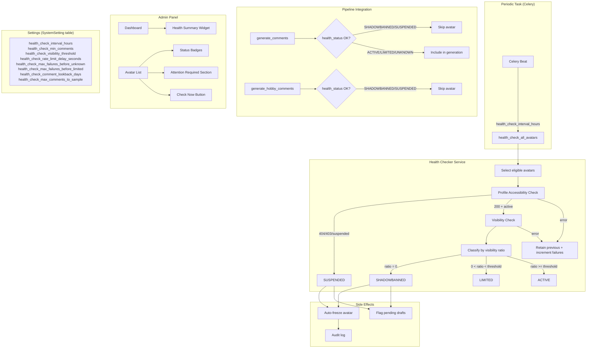

# Design Document: Shadowban Detection

## Overview

This feature adds visibility-based shadowban detection to the Reddit avatar management system. The existing `reddit_status.py` service detects account-level suspension (403/404/is_suspended) but cannot detect shadowbans — where the account appears normal to the owner but content is invisible to others.

The solution introduces a **Health Checker** service that:
1. Checks avatar profile accessibility (reuses existing PRAW patterns)
2. Performs **visibility checks** by fetching the avatar's recent comments from an unauthenticated session and comparing what's visible vs. what was posted
3. Classifies avatars into a 5-state health model: ACTIVE, LIMITED, SHADOWBANNED, SUSPENDED, UNKNOWN
4. Runs as a periodic Celery task with configurable intervals
5. Integrates with the pipeline to skip unhealthy avatars (saving ~$0.04/comment in wasted LLM tokens)
6. Auto-freezes shadowbanned/suspended avatars to protect the pre-warmed inventory

All configurable parameters are stored in the `SystemSetting` table and managed via the admin Settings page — no hardcoded config values.

## Architecture



## Components and Interfaces

### 1. Health Status Enum

```python
# app/models/health_status.py
import enum

class HealthStatus(str, enum.Enum):
    ACTIVE = "active"
    LIMITED = "limited"
    SHADOWBANNED = "shadowbanned"
    SUSPENDED = "suspended"
    UNKNOWN = "unknown"
```

### 2. Avatar Model Extensions

New fields added to `app/models/avatar.py`:

```python
# New fields on Avatar model
health_status: Mapped[str] = mapped_column(
    String(20), default="unknown", server_default="unknown"
)
health_status_changed_at: Mapped[datetime | None] = mapped_column(
    DateTime(timezone=True), nullable=True
)
health_check_details: Mapped[dict | None] = mapped_column(JSONB, nullable=True)
consecutive_check_failures: Mapped[int] = mapped_column(
    Integer, default=0, server_default="0"
)
```

### 3. Health Checker Service

**File:** `app/services/health_checker.py`

```python
@dataclass
class HealthCheckResult:
    """Result of a single avatar health check."""
    avatar_id: uuid.UUID
    username: str
    previous_status: str
    new_status: str
    detection_method: str  # "profile_check" | "visibility_check" | "api_error"
    visibility_ratio: float | None
    comments_sampled: int
    comments_visible: int
    details: dict
    error: str | None = None

    @property
    def status_changed(self) -> bool:
        return self.previous_status != self.new_status


def check_avatar_health(db: Session, avatar: Avatar) -> HealthCheckResult:
    """Perform a full health check on a single avatar.
    
    Algorithm:
    1. Profile accessibility check (PRAW redditor lookup)
    2. If profile inaccessible → SUSPENDED
    3. If profile accessible → visibility check (fetch recent comments unauthenticated)
    4. Classify based on visibility ratio
    5. Handle consecutive failures threshold
    6. Persist results and trigger side effects
    """
    ...


def check_profile_accessibility(username: str) -> tuple[str | None, str]:
    """Check if avatar's profile is accessible.
    
    Returns:
        (status, detection_method) — status is None if profile is accessible
        and visibility check should proceed. Otherwise returns the determined
        status ("suspended") and the detection method.
    """
    ...


def check_comment_visibility(
    username: str,
    max_comments: int,
    lookback_days: int,
) -> tuple[int, int]:
    """Fetch avatar's recent comments and check visibility.
    
    Uses an unauthenticated Reddit client to see which comments
    are visible to the public.
    
    Returns:
        (total_sampled, visible_count)
    """
    ...


def classify_health_status(
    visibility_ratio: float,
    threshold: float,
) -> str:
    """Classify health status based on visibility ratio.
    
    - ratio == 0 → SHADOWBANNED
    - 0 < ratio < threshold → LIMITED
    - ratio >= threshold → ACTIVE
    """
    ...


def run_health_check_batch(db: Session) -> dict:
    """Run health checks for all eligible avatars.
    
    Eligible: active=True, is_frozen=False, last_health_check older than interval or null.
    
    Returns:
        Summary dict with counts: checked, changed, errors, duration_ms
    """
    ...
```

### 4. Pipeline Integration

**Modified files:**
- `app/tasks/ai_pipeline.py` — add `health_status` filter to avatar queries
- `app/services/generation.py` — no changes needed (filtering happens at task level)

```python
# In generate_comments task — updated avatar filter
client_avatars = [
    a for a in avatars
    if a.client_ids and str(client.id) in a.client_ids
    and not a.is_frozen
    and a.health_status not in ("shadowbanned", "suspended")
]

# In generate_hobby_comments task — updated check
if avatar.health_status in ("shadowbanned", "suspended"):
    logger.warning(
        "generate_hobby_comments: avatar %s health_status=%s, skipping",
        avatar.reddit_username, avatar.health_status,
    )
    return 0
```

### 5. Admin Panel Routes

**New/modified routes in `app/routes/admin.py`:**

```python
@router.post("/avatars/{avatar_id}/health-check", response_class=HTMLResponse)
def admin_avatar_health_check(
    request: Request,
    avatar_id: uuid.UUID,
    current_user: User = Depends(require_superuser),
    db: Session = Depends(get_db),
) -> HTMLResponse:
    """Trigger manual health check for a single avatar (HTMX endpoint)."""
    ...
```

### 6. Settings Registration

**Added to `app/services/settings.py` DEFAULTS dict:**

```python
# Health Check settings (group: "health_check")
"health_check_interval_hours": {
    "value": "12",
    "secret": False,
    "desc": "How often the periodic health check task runs (hours)",
    "group": "health_check",
},
"health_check_min_comments": {
    "value": "3",
    "secret": False,
    "desc": "Minimum recent comments required for visibility classification",
    "group": "health_check",
},
"health_check_visibility_threshold": {
    "value": "0.5",
    "secret": False,
    "desc": "Visibility ratio above which avatar is classified ACTIVE (0.0-1.0)",
    "group": "health_check",
},
"health_check_rate_limit_delay_seconds": {
    "value": "2",
    "secret": False,
    "desc": "Delay between individual avatar checks in a batch (seconds)",
    "group": "health_check",
},
"health_check_max_failures_before_unknown": {
    "value": "5",
    "secret": False,
    "desc": "Consecutive failures before status becomes UNKNOWN",
    "group": "health_check",
},
"health_check_max_failures_before_limited": {
    "value": "3",
    "secret": False,
    "desc": "Consecutive failures before emitting LIMITED warning",
    "group": "health_check",
},
"health_check_comment_lookback_days": {
    "value": "7",
    "secret": False,
    "desc": "How far back to look for avatar comments (days)",
    "group": "health_check",
},
"health_check_max_comments_to_sample": {
    "value": "10",
    "secret": False,
    "desc": "Maximum comments to fetch per avatar for visibility check",
    "group": "health_check",
},
```

### 7. Celery Task

**File:** `app/tasks/health_check.py`

```python
@celery_app.task(name="health_check_all_avatars", bind=True, max_retries=1)
def health_check_all_avatars(self):
    """Periodic task: run health checks for all eligible avatars."""
    ...
```

Registered in Celery Beat schedule using `schedule_avatar_health_hours` setting (already exists as `"0,12"` default).

## Data Models

### Avatar Model — New Fields

| Field | Type | Default | Description |
|-------|------|---------|-------------|
| `health_status` | String(20) | "unknown" | Current health classification |
| `health_status_changed_at` | DateTime(tz) | null | When status last changed |
| `health_check_details` | JSONB | null | Raw results of last check (max 10KB) |
| `consecutive_check_failures` | Integer | 0 | Sequential check failures |

### health_check_details JSON Schema

```json
{
  "checked_at": "2026-05-10T12:00:00Z",
  "profile_accessible": true,
  "comments_sampled": 8,
  "comments_visible": 6,
  "visibility_ratio": 0.75,
  "classification": "active",
  "detection_method": "visibility_check",
  "duration_ms": 1250,
  "error": null
}
```

### SystemSetting Keys (health_check group)

| Key | Type | Default | Validation |
|-----|------|---------|------------|
| `health_check_interval_hours` | int | 12 | >= 1 |
| `health_check_min_comments` | int | 3 | >= 1 |
| `health_check_visibility_threshold` | float | 0.5 | 0.0 - 1.0 |
| `health_check_rate_limit_delay_seconds` | int | 2 | >= 0 |
| `health_check_max_failures_before_unknown` | int | 5 | >= 1 |
| `health_check_max_failures_before_limited` | int | 3 | >= 1 |
| `health_check_comment_lookback_days` | int | 7 | >= 1 |
| `health_check_max_comments_to_sample` | int | 10 | >= 1 |

### Alembic Migration

New migration adds 4 columns to `avatars` table:
- `health_status` VARCHAR(20) DEFAULT 'unknown'
- `health_status_changed_at` TIMESTAMPTZ NULL
- `health_check_details` JSONB NULL
- `consecutive_check_failures` INTEGER DEFAULT 0

## Correctness Properties

*A property is a characteristic or behavior that should hold true across all valid executions of a system — essentially, a formal statement about what the system should do. Properties serve as the bridge between human-readable specifications and machine-verifiable correctness guarantees.*

### Property 1: Visibility ratio classification is correct and exhaustive

*For any* visibility ratio (a float between 0.0 and 1.0 inclusive) and any valid threshold (0.0 < threshold <= 1.0), the `classify_health_status` function shall return:
- "shadowbanned" when ratio == 0
- "limited" when 0 < ratio < threshold
- "active" when ratio >= threshold

**Validates: Requirements 2.4, 2.5, 2.6**

### Property 2: Profile inaccessibility yields SUSPENDED classification

*For any* avatar, when the profile accessibility check returns a 404 response, a 403 response, or a 200 response with `is_suspended=true`, the health checker shall classify the avatar as SUSPENDED and shall not perform a visibility check.

**Validates: Requirements 3.2, 3.3, 3.4**

### Property 3: API errors preserve previous status and increment failures

*For any* avatar with any previous health_status and any consecutive_check_failures count, when a Reddit API error occurs during either the profile check or visibility check, the avatar's health_status shall remain unchanged and consecutive_check_failures shall be incremented by exactly 1.

**Validates: Requirements 2.7, 3.6**

### Property 4: Consecutive failure thresholds trigger correct transitions

*For any* avatar, when `consecutive_check_failures` reaches `health_check_max_failures_before_limited`, the health_status shall transition to LIMITED. When it reaches `health_check_max_failures_before_unknown`, the health_status shall transition to UNKNOWN.

**Validates: Requirements 1.7, 2.8**

### Property 5: Successful check resets failure counter

*For any* avatar with consecutive_check_failures > 0, when a health check completes successfully (produces a determined status without error), consecutive_check_failures shall be reset to 0.

**Validates: Requirements 1.6**

### Property 6: Insufficient comments preserves previous status

*For any* avatar that has posted fewer than `health_check_min_comments` comments within the lookback period, the health checker shall retain the avatar's previous health_status unchanged, regardless of what the visibility check would have found.

**Validates: Requirements 2.3**

### Property 7: Unhealthy avatars are excluded from all pipeline activities

*For any* avatar with health_status SHADOWBANNED or SUSPENDED, the pipeline shall exclude that avatar from persona selection (professional comments), hobby comment generation, and all warming phase activities (Phase 1, 2, and 3).

**Validates: Requirements 5.1, 5.2, 5.3, 9.1, 9.2, 9.3**

### Property 8: Status transition triggers freeze and audit log

*For any* avatar whose health_status transitions to SHADOWBANNED or SUSPENDED, the system shall: (a) set is_frozen=true with freeze_reason equal to the new status and frozen_at set to current UTC time, and (b) create an audit log entry containing the previous status, new status, reddit_username, and detection method.

**Validates: Requirements 7.1, 7.4, 9.4**

### Property 9: Batch fault isolation

*For any* batch of N avatars being health-checked, if avatar at position K fails with an error, all avatars at positions K+1 through N shall still be checked (the batch continues processing).

**Validates: Requirements 4.4**

### Property 10: Eligible avatar selection respects all filters

*For any* set of avatars in the database, the periodic health check shall select only those where: active=True AND is_frozen=False AND (last_health_check is NULL OR last_health_check is older than health_check_interval_hours).

**Validates: Requirements 4.2**

### Property 11: Health summary counts are consistent

*For any* set of avatars, the health summary widget counts shall satisfy: count(ACTIVE) + count(LIMITED) + count(SHADOWBANNED) + count(SUSPENDED) + count(UNKNOWN) == total active avatars.

**Validates: Requirements 6.2**

### Property 12: Setting validation rejects out-of-range values

*For any* health check parameter update, values outside the allowed range (e.g., interval_hours < 1, visibility_threshold > 1.0 or < 0.0) shall be rejected, and the previous value shall remain unchanged.

**Validates: Requirements 8.4**

## Error Handling

| Error Scenario | Behavior | Recovery |
|---|---|---|
| Reddit API timeout during profile check | Retain previous status, increment `consecutive_check_failures` | Next scheduled check retries |
| Reddit API 429 (rate limited) | Log warning, skip remaining avatars in batch | Next scheduled batch retries all |
| Reddit API 5xx | Retain previous status, increment failures | Automatic retry on next cycle |
| PRAW connection error | Same as timeout | Same |
| Audit log write failure | Log to app logger, continue health check | Non-blocking; check completes |
| Database write failure on status update | Rollback avatar update, log error, continue batch | Next cycle retries |
| Invalid health_check_details JSON (>10KB) | Truncate to fit, store truncated version | Informational only |
| All avatars fail in batch | Log batch summary with 100% error rate | Alert via activity event |
| Setting missing from DB | Use hardcoded default from DEFAULTS registry | Self-healing on next `init_defaults()` |

### Graceful Degradation

- If the health checker cannot reach Reddit at all (network down), all avatars retain their previous status. No avatars are incorrectly marked as unhealthy.
- If a single avatar's check fails, it does not affect other avatars in the batch.
- Audit logging failures never interrupt the health check operation.
- The pipeline continues to function even if health checks haven't run — avatars default to UNKNOWN status which is treated as eligible.

## Testing Strategy

### Property-Based Tests (Hypothesis)

The core classification and state machine logic is well-suited for property-based testing:

- **classify_health_status** — pure function, clear input/output, universal properties
- **Avatar state transitions** — state machine with well-defined rules
- **Pipeline filtering** — set membership based on status
- **Setting validation** — range checking across parameter space
- **Batch fault isolation** — error injection at random positions

**Library:** Hypothesis (already in use — `.hypothesis/` directory exists)
**Minimum iterations:** 100 per property
**Tag format:** `Feature: shadowban-detection, Property {N}: {description}`

### Unit Tests (pytest)

- Profile accessibility check with mocked PRAW responses (404, 403, 200+suspended, 200+active)
- Visibility check with mocked comment data
- Audit log creation with correct fields
- Settings DEFAULTS registration and validation
- Admin endpoint responses (HTMX partials)
- "Check Now" button success and failure paths
- Batch summary logging format

### Integration Tests

- Full health check cycle with mocked Reddit API
- Celery task registration and scheduling
- Pipeline exclusion end-to-end (generate_comments skips unhealthy avatar)
- Settings page renders health_check group
- Database migration applies cleanly

### Test Doubles

- **Reddit API:** Mock PRAW `reddit.redditor()` and comment fetching
- **Database:** Use test SQLAlchemy session with rollback
- **Celery:** Use `celery_app.conf.task_always_eager = True` for synchronous execution
- **Time:** Freeze time with `freezegun` for timestamp assertions
