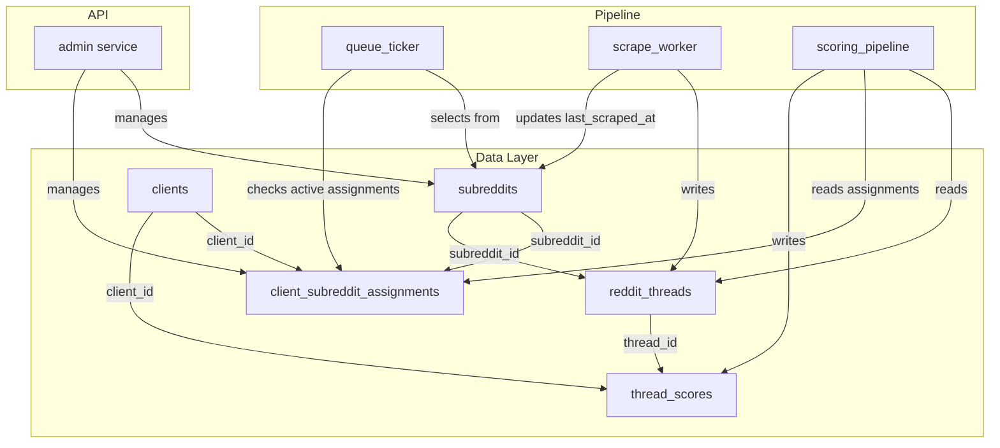
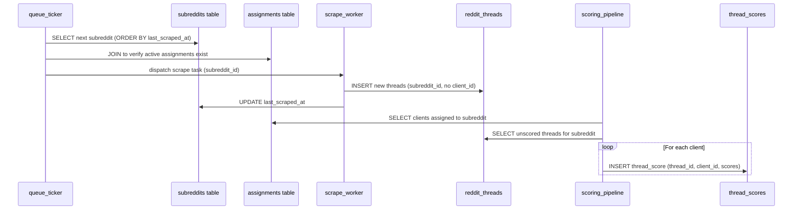
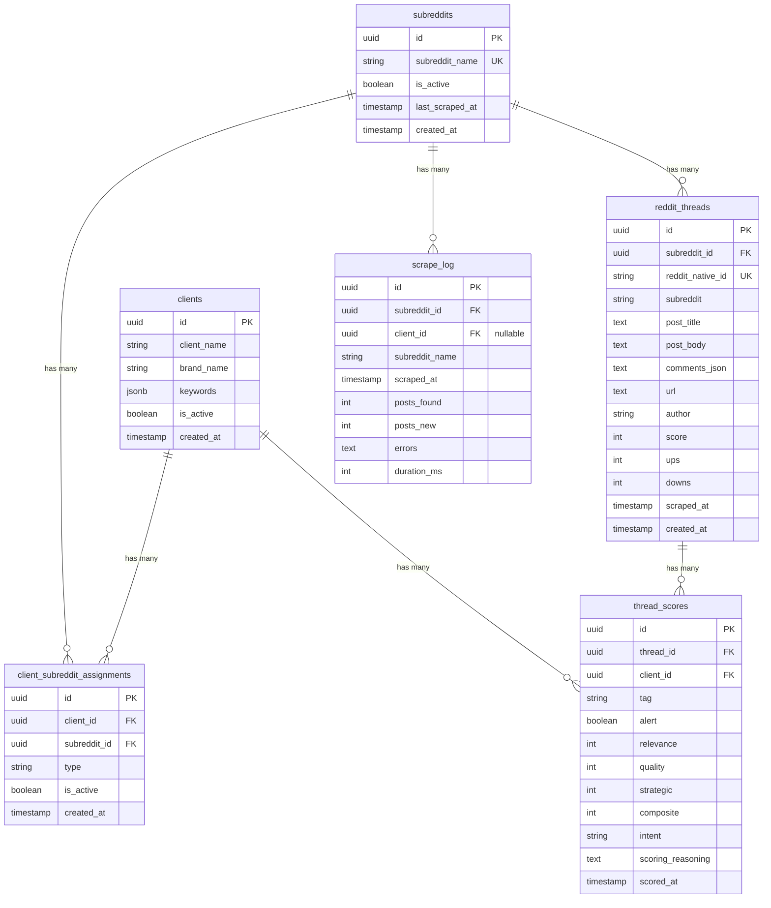

# Design Document: Shared Subreddit Registry

## Overview

This feature refactors the subreddit data model from a single-client ownership pattern (`ClientSubreddit` with `client_id` FK) to a shared registry with many-to-many assignments. The core change: subreddits become independent entities scraped once, with per-client scoring stored separately.

**Key architectural changes:**
1. New `subreddits` table — the canonical registry of Reddit communities
2. New `client_subreddit_assignments` table — many-to-many link between clients and subreddits
3. New `thread_scores` table — per-client scoring extracted from `RedditThread`
4. `RedditThread.client_id` replaced with `subreddit_id` FK
5. Scraping becomes subreddit-centric (scrape once, share data)
6. Scoring pipeline creates per-client score records

**Benefits:**
- Eliminates duplicate scraping when multiple clients monitor the same subreddit
- Reduces Reddit API rate limit consumption proportionally
- Enables future features like cross-client analytics and subreddit popularity metrics

## Architecture



### Component Interaction Flow



## Components and Interfaces

### 1. Models (SQLAlchemy)

#### `Subreddit` (new)

```python
class Subreddit(Base):
    __tablename__ = "subreddits"

    id: Mapped[uuid.UUID] = mapped_column(UUID(as_uuid=True), primary_key=True, default=uuid.uuid4)
    subreddit_name: Mapped[str] = mapped_column(String(255), nullable=False)
    is_active: Mapped[bool] = mapped_column(Boolean, default=True)
    created_at: Mapped[datetime] = mapped_column(DateTime(timezone=True), server_default=func.now())
    last_scraped_at: Mapped[datetime | None] = mapped_column(DateTime(timezone=True), nullable=True)

    # Relationships
    assignments = relationship("ClientSubredditAssignment", back_populates="subreddit")
    threads = relationship("RedditThread", back_populates="subreddit_rel")

    __table_args__ = (
        Index("uq_subreddits_name", func.lower(subreddit_name), unique=True),
    )
```

#### `ClientSubredditAssignment` (new)

```python
class ClientSubredditAssignment(Base):
    __tablename__ = "client_subreddit_assignments"

    id: Mapped[uuid.UUID] = mapped_column(UUID(as_uuid=True), primary_key=True, default=uuid.uuid4)
    client_id: Mapped[uuid.UUID] = mapped_column(UUID(as_uuid=True), ForeignKey("clients.id"), nullable=False)
    subreddit_id: Mapped[uuid.UUID] = mapped_column(UUID(as_uuid=True), ForeignKey("subreddits.id"), nullable=False)
    type: Mapped[str] = mapped_column(String(50), default="professional")
    is_active: Mapped[bool] = mapped_column(Boolean, default=True)
    created_at: Mapped[datetime] = mapped_column(DateTime(timezone=True), server_default=func.now())

    # Relationships
    client = relationship("Client", back_populates="subreddit_assignments")
    subreddit = relationship("Subreddit", back_populates="assignments")

    __table_args__ = (
        UniqueConstraint("client_id", "subreddit_id", name="uq_client_subreddit_assignment"),
    )
```

#### `ThreadScore` (new)

```python
class ThreadScore(Base):
    __tablename__ = "thread_scores"

    id: Mapped[uuid.UUID] = mapped_column(UUID(as_uuid=True), primary_key=True, default=uuid.uuid4)
    thread_id: Mapped[uuid.UUID] = mapped_column(UUID(as_uuid=True), ForeignKey("reddit_threads.id"), nullable=False)
    client_id: Mapped[uuid.UUID] = mapped_column(UUID(as_uuid=True), ForeignKey("clients.id"), nullable=False)

    # Scoring fields (moved from RedditThread)
    tag: Mapped[str | None] = mapped_column(String(50), nullable=True)
    alert: Mapped[bool] = mapped_column(Boolean, default=False)
    relevance: Mapped[int | None] = mapped_column(Integer, nullable=True)
    quality: Mapped[int | None] = mapped_column(Integer, nullable=True)
    strategic: Mapped[int | None] = mapped_column(Integer, nullable=True)
    composite: Mapped[int | None] = mapped_column(Integer, nullable=True)
    intent: Mapped[str | None] = mapped_column(String(100), nullable=True)
    scoring_reasoning: Mapped[str | None] = mapped_column(Text, nullable=True)
    scored_at: Mapped[datetime] = mapped_column(DateTime(timezone=True), server_default=func.now())

    # Relationships
    thread = relationship("RedditThread", back_populates="scores")
    client = relationship("Client")

    __table_args__ = (
        UniqueConstraint("thread_id", "client_id", name="uq_thread_client_score"),
        Index("ix_thread_scores_client_tag", "client_id", "tag"),
    )
```

#### `RedditThread` (modified)

```python
class RedditThread(Base):
    __tablename__ = "reddit_threads"

    id: Mapped[uuid.UUID] = mapped_column(UUID(as_uuid=True), primary_key=True, default=uuid.uuid4)
    subreddit_id: Mapped[uuid.UUID] = mapped_column(UUID(as_uuid=True), ForeignKey("subreddits.id"), nullable=False)
    type: Mapped[str] = mapped_column(String(50), default="professional")

    # Reddit data (unchanged)
    reddit_native_id: Mapped[str] = mapped_column(String(255), unique=True, nullable=False)
    subreddit: Mapped[str] = mapped_column(String(255), nullable=False)  # denormalized display
    post_title: Mapped[str] = mapped_column(Text, nullable=False)
    post_body: Mapped[str | None] = mapped_column(Text, nullable=True)
    comments_json: Mapped[str | None] = mapped_column(Text, nullable=True)
    url: Mapped[str | None] = mapped_column(Text, nullable=True)
    author: Mapped[str | None] = mapped_column(String(255), nullable=True)
    score: Mapped[int] = mapped_column(Integer, default=0)
    ups: Mapped[int] = mapped_column(Integer, default=0)
    downs: Mapped[int] = mapped_column(Integer, default=0)

    # REMOVED: client_id, tag, alert, relevance, quality, strategic, composite, intent, scoring_reasoning

    scraped_at: Mapped[datetime] = mapped_column(DateTime(timezone=True), server_default=func.now())
    created_at: Mapped[datetime] = mapped_column(DateTime(timezone=True), server_default=func.now())

    # Relationships
    subreddit_rel = relationship("Subreddit", back_populates="threads")
    scores = relationship("ThreadScore", back_populates="thread")
```

#### `ScrapeLog` (modified)

```python
class ScrapeLog(Base):
    __tablename__ = "scrape_log"

    id: Mapped[uuid.UUID] = mapped_column(UUID(as_uuid=True), primary_key=True, default=uuid.uuid4)
    subreddit_id: Mapped[uuid.UUID] = mapped_column(UUID(as_uuid=True), ForeignKey("subreddits.id"), nullable=False)
    client_id: Mapped[uuid.UUID | None] = mapped_column(UUID(as_uuid=True), ForeignKey("clients.id"), nullable=True)  # nullable now
    subreddit_name: Mapped[str] = mapped_column(String(255), nullable=False)  # denormalized
    scraped_at: Mapped[datetime] = mapped_column(DateTime(timezone=True), server_default=func.now())
    posts_found: Mapped[int] = mapped_column(Integer, nullable=False)
    posts_new: Mapped[int] = mapped_column(Integer, nullable=False)
    errors: Mapped[str | None] = mapped_column(Text, nullable=True)
    duration_ms: Mapped[int] = mapped_column(Integer, nullable=False)
```

### 2. Service Layer

#### `services/admin.py` — Updated Functions

```python
def add_subreddit(
    db: Session,
    client_id: uuid.UUID,
    name: str,
    type: str,
    current_user_id: uuid.UUID | None,
) -> ClientSubredditAssignment:
    """Add a subreddit to a client. Creates Subreddit record if needed.

    No longer enforces global uniqueness — multiple clients can share.
    """
    ...

def remove_subreddit(
    db: Session,
    assignment_id: uuid.UUID,
    current_user_id: uuid.UUID,
) -> None:
    """Soft-delete by setting is_active=False on the assignment only."""
    ...

def list_client_subreddits(
    db: Session,
    client_id: uuid.UUID,
) -> list[dict]:
    """Return subreddits assigned to a client with assignment metadata."""
    ...
```

#### `services/scoring.py` — Updated Functions

```python
def score_thread_for_client(
    db: Session,
    thread: RedditThread,
    client: Client,
) -> ThreadScore:
    """Score a thread for a specific client. Creates ThreadScore record."""
    ...

def score_unscored_threads_for_client(
    db: Session,
    client: Client,
) -> int:
    """Score all threads in client's assigned subreddits that lack a ThreadScore."""
    ...

def get_client_threads_with_scores(
    db: Session,
    client_id: uuid.UUID,
    tag: str | None = None,
) -> list[tuple[RedditThread, ThreadScore]]:
    """Return threads with their per-client scores for display."""
    ...
```

#### `tasks/scraping.py` — Updated Functions

```python
@celery_app.task(name="scrape_subreddit_shared")
def scrape_subreddit_shared(subreddit_id: str):
    """Scrape a single subreddit. No client_id — subreddit-centric.

    1. Load Subreddit record
    2. Scrape posts from Reddit
    3. Deduplicate globally by reddit_native_id
    4. Insert new RedditThread records with subreddit_id
    5. Update Subreddit.last_scraped_at
    6. Record ScrapeLog
    """
    ...
```

#### `tasks/queue_ticker.py` — Updated Logic

```python
@celery_app.task(name="queue_tick")
def queue_tick():
    """Select next subreddit to scrape based on staleness.

    Query: SELECT from subreddits
           JOIN client_subreddit_assignments (at least one active)
           JOIN clients (client is active)
           WHERE subreddits.is_active = true
           ORDER BY last_scraped_at ASC NULLS FIRST
           LIMIT 1
    
    Dispatch: scrape_subreddit_shared(subreddit_id)
    """
    ...
```

### 3. Client Relationship Update

```python
# In Client model
class Client(Base):
    ...
    subreddit_assignments = relationship("ClientSubredditAssignment", back_populates="client")
```

## Data Models

### Entity Relationship Diagram



### Migration Strategy (Alembic)

The migration will be a single Alembic revision with these steps:

**Step 1: Create new tables**
```sql
CREATE TABLE subreddits (
    id UUID PRIMARY KEY DEFAULT gen_random_uuid(),
    subreddit_name VARCHAR(255) NOT NULL,
    is_active BOOLEAN DEFAULT true,
    created_at TIMESTAMPTZ DEFAULT now(),
    last_scraped_at TIMESTAMPTZ
);
CREATE UNIQUE INDEX uq_subreddits_lower_name ON subreddits (lower(subreddit_name));

CREATE TABLE client_subreddit_assignments (
    id UUID PRIMARY KEY DEFAULT gen_random_uuid(),
    client_id UUID NOT NULL REFERENCES clients(id),
    subreddit_id UUID NOT NULL REFERENCES subreddits(id),
    type VARCHAR(50) DEFAULT 'professional',
    is_active BOOLEAN DEFAULT true,
    created_at TIMESTAMPTZ DEFAULT now(),
    CONSTRAINT uq_client_subreddit_assignment UNIQUE (client_id, subreddit_id)
);

CREATE TABLE thread_scores (
    id UUID PRIMARY KEY DEFAULT gen_random_uuid(),
    thread_id UUID NOT NULL REFERENCES reddit_threads(id),
    client_id UUID NOT NULL REFERENCES clients(id),
    tag VARCHAR(50),
    alert BOOLEAN DEFAULT false,
    relevance INTEGER,
    quality INTEGER,
    strategic INTEGER,
    composite INTEGER,
    intent VARCHAR(100),
    scoring_reasoning TEXT,
    scored_at TIMESTAMPTZ DEFAULT now(),
    CONSTRAINT uq_thread_client_score UNIQUE (thread_id, client_id)
);
CREATE INDEX ix_thread_scores_client_tag ON thread_scores (client_id, tag);
```

**Step 2: Populate subreddits from existing data**
```sql
INSERT INTO subreddits (id, subreddit_name, is_active, created_at, last_scraped_at)
SELECT gen_random_uuid(), sub_name, bool_or(is_active), min(created_at), max(last_scraped_at)
FROM (
    SELECT DISTINCT ON (lower(subreddit_name))
        subreddit_name AS sub_name, is_active, created_at, last_scraped_at
    FROM client_subreddits
    ORDER BY lower(subreddit_name), is_active DESC, created_at ASC
) deduped
GROUP BY sub_name;
```

**Step 3: Populate assignments from existing client_subreddits**
```sql
INSERT INTO client_subreddit_assignments (id, client_id, subreddit_id, type, is_active, created_at)
SELECT gen_random_uuid(), cs.client_id, s.id, cs.type, cs.is_active, cs.created_at
FROM client_subreddits cs
JOIN subreddits s ON lower(s.subreddit_name) = lower(cs.subreddit_name);
```

**Step 4: Add subreddit_id to reddit_threads and populate**
```sql
ALTER TABLE reddit_threads ADD COLUMN subreddit_id UUID REFERENCES subreddits(id);

UPDATE reddit_threads rt
SET subreddit_id = s.id
FROM subreddits s
WHERE lower(s.subreddit_name) = lower(rt.subreddit);

-- Create missing subreddit records for threads with no match
INSERT INTO subreddits (id, subreddit_name, is_active, created_at)
SELECT gen_random_uuid(), rt.subreddit, false, now()
FROM reddit_threads rt
WHERE rt.subreddit_id IS NULL
AND NOT EXISTS (SELECT 1 FROM subreddits s WHERE lower(s.subreddit_name) = lower(rt.subreddit))
GROUP BY rt.subreddit;

-- Re-run the update for newly created records
UPDATE reddit_threads rt
SET subreddit_id = s.id
FROM subreddits s
WHERE lower(s.subreddit_name) = lower(rt.subreddit)
AND rt.subreddit_id IS NULL;

ALTER TABLE reddit_threads ALTER COLUMN subreddit_id SET NOT NULL;
```

**Step 5: Migrate scoring data to thread_scores**
```sql
INSERT INTO thread_scores (id, thread_id, client_id, tag, alert, relevance, quality, strategic, composite, intent, scoring_reasoning, scored_at)
SELECT gen_random_uuid(), rt.id, rt.client_id, rt.tag, rt.alert, rt.relevance, rt.quality, rt.strategic, rt.composite, rt.intent, rt.scoring_reasoning, rt.created_at
FROM reddit_threads rt
WHERE rt.tag IS NOT NULL;
```

**Step 6: Drop old columns and constraints**
```sql
ALTER TABLE reddit_threads DROP COLUMN client_id;
ALTER TABLE reddit_threads DROP COLUMN tag;
ALTER TABLE reddit_threads DROP COLUMN alert;
ALTER TABLE reddit_threads DROP COLUMN relevance;
ALTER TABLE reddit_threads DROP COLUMN quality;
ALTER TABLE reddit_threads DROP COLUMN strategic;
ALTER TABLE reddit_threads DROP COLUMN composite;
ALTER TABLE reddit_threads DROP COLUMN intent;
ALTER TABLE reddit_threads DROP COLUMN scoring_reasoning;

DROP INDEX IF EXISTS uq_client_subreddits_active_name;

-- Keep client_subreddits table temporarily for rollback safety, drop in a follow-up migration
ALTER TABLE scrape_log ALTER COLUMN client_id DROP NOT NULL;
ALTER TABLE scrape_log ADD COLUMN subreddit_id UUID REFERENCES subreddits(id);
```


## Correctness Properties

*A property is a characteristic or behavior that should hold true across all valid executions of a system — essentially, a formal statement about what the system should do. Properties serve as the bridge between human-readable specifications and machine-verifiable correctness guarantees.*

### Property 1: Subreddit name case-insensitive uniqueness

*For any* two subreddit names that differ only in casing (e.g., "Python" and "python"), the system SHALL store at most one Subreddit record, and lookups by either casing SHALL resolve to the same record while preserving the original casing of the first insertion.

**Validates: Requirements 1.2, 1.3**

### Property 2: Assignment uniqueness per client-subreddit pair

*For any* client and subreddit, attempting to create a second active assignment for the same (client_id, subreddit_id) pair SHALL be rejected, ensuring exactly one assignment record per pair.

**Validates: Requirements 2.2**

### Property 3: Get-or-create subreddit with multi-client sharing

*For any* sequence of `add_subreddit` calls with the same subreddit name but different client_ids, the system SHALL create exactly one Subreddit record and one ClientSubredditAssignment per client, with all assignments referencing the same Subreddit.

**Validates: Requirements 2.3, 7.1**

### Property 4: Assignment deactivation isolation

*For any* subreddit shared by N clients (N ≥ 2), deactivating one client's assignment SHALL leave the remaining N-1 assignments unchanged (is_active=true) and SHALL NOT modify the Subreddit record's is_active or last_scraped_at fields.

**Validates: Requirements 2.4, 7.4**

### Property 5: Scrape selection by staleness with active filtering

*For any* set of subreddits with varying last_scraped_at values, the scrape queue SHALL select subreddits ordered by last_scraped_at ASC (NULLS FIRST), and SHALL only include subreddits that have at least one active assignment where the corresponding client is also active.

**Validates: Requirements 3.1, 3.4, 8.1, 8.2**

### Property 6: Per-client scoring completeness

*For any* newly scraped thread in a subreddit with K active client assignments, the scoring pipeline SHALL produce exactly K ThreadScore records — one per client — each referencing the thread_id and the respective client_id.

**Validates: Requirements 4.1, 4.2**

### Property 7: Client subreddit listing isolation

*For any* client, listing their subreddits SHALL return exactly the set of subreddits where a ClientSubredditAssignment exists for that client_id, and SHALL NOT include subreddits assigned only to other clients.

**Validates: Requirements 7.2**

### Property 8: Global thread deduplication

*For any* set of scraped posts, if a post's reddit_native_id already exists in the reddit_threads table, the scraper SHALL skip insertion regardless of which subreddit or client triggered the scrape. After scraping, no two rows in reddit_threads SHALL share the same reddit_native_id.

**Validates: Requirements 5.4, 9.1, 9.2**

### Property 9: Migration subreddit registry completeness

*For any* pre-migration database state, after migration every distinct `lower(subreddit_name)` from both `client_subreddits` and `reddit_threads` SHALL have exactly one corresponding record in the `subreddits` table, and every `reddit_threads.subreddit_id` SHALL be non-null and reference a valid Subreddit.

**Validates: Requirements 6.1, 6.3, 6.5**

### Property 10: Migration assignment preservation

*For any* pre-migration `client_subreddits` row, after migration there SHALL exist a `client_subreddit_assignments` record with matching client_id, type, and is_active values, referencing the correct Subreddit record.

**Validates: Requirements 6.2**

### Property 11: Migration scoring data preservation

*For any* pre-migration `reddit_threads` row that has a non-null `tag` field, after migration there SHALL exist a `thread_scores` record with identical values for tag, alert, relevance, quality, strategic, composite, intent, and scoring_reasoning, referencing the original thread_id and client_id.

**Validates: Requirements 5.3, 6.4**

## Error Handling

### Database Constraint Violations

| Scenario | Constraint | Handling |
|----------|-----------|----------|
| Duplicate subreddit name (case-insensitive) | `uq_subreddits_lower_name` | `add_subreddit` catches IntegrityError, performs SELECT to get existing record |
| Duplicate assignment (client + subreddit) | `uq_client_subreddit_assignment` | Return existing assignment or raise ValueError with descriptive message |
| Duplicate thread (reddit_native_id) | `reddit_native_id` unique | Dedup check before INSERT; on race condition, catch IntegrityError and skip |
| Duplicate score (thread + client) | `uq_thread_client_score` | Upsert pattern — UPDATE existing score if re-scoring |

### Scraping Errors

- **Subreddit not found on Reddit**: Log error in ScrapeLog, do NOT deactivate the Subreddit record (may be temporary Reddit issue)
- **Rate limit hit**: Exponential backoff via Celery retry mechanism (existing pattern)
- **Partial scrape failure**: Commit successfully scraped threads, log error for failed ones

### Migration Errors

- **Orphaned threads** (subreddit name not in client_subreddits): Create Subreddit record with `is_active=false`
- **Threads with NULL client_id** (shouldn't exist but defensive): Skip scoring migration for those rows, log warning
- **Duplicate subreddit names in client_subreddits** (same name, different clients): Handled by GROUP BY in migration — one Subreddit record, multiple assignments

### Scoring Pipeline Errors

- **LLM call failure**: Log error, skip thread, continue with next (existing pattern preserved)
- **Client deactivated mid-scoring**: Check client.is_active before creating ThreadScore; skip if inactive
- **Thread deleted mid-scoring**: Catch ForeignKey violation, skip

## Testing Strategy

### Property-Based Tests (Hypothesis)

The project already uses Hypothesis (`.hypothesis/` directory exists). Each correctness property maps to one property-based test with minimum 100 iterations.

**Library**: `hypothesis` (already installed)
**Configuration**: `@settings(max_examples=100)`
**Tag format**: `# Feature: shared-subreddit-registry, Property {N}: {title}`

**Test file**: `reddit_saas/tests/test_shared_subreddit_properties.py`

Properties to implement:
1. Subreddit name case-insensitive uniqueness — generate random names with case variations
2. Assignment uniqueness — generate random (client, subreddit) pairs, attempt duplicates
3. Get-or-create + multi-client sharing — generate sequences of add_subreddit calls
4. Deactivation isolation — generate N clients sharing a subreddit, deactivate one
5. Scrape selection ordering — generate subreddits with random timestamps
6. Per-client scoring completeness — generate threads with K client assignments
7. Client listing isolation — generate multi-client assignment sets
8. Global deduplication — generate posts with overlapping reddit_native_ids
9. Migration registry completeness — generate pre-migration data states
10. Migration assignment preservation — generate client_subreddits rows
11. Migration scoring preservation — generate scored threads

### Unit Tests (pytest)

**Test file**: `reddit_saas/tests/test_shared_subreddit_unit.py`

- `test_add_subreddit_creates_registry_entry` — verify Subreddit record created
- `test_add_subreddit_reactivates_inactive_assignment` — verify reactivation path
- `test_remove_subreddit_soft_deletes_assignment` — verify is_active=false
- `test_scrape_log_nullable_client_id` — verify ScrapeLog works without client_id
- `test_score_thread_creates_thread_score` — verify ThreadScore creation
- `test_list_subreddits_filters_by_client` — verify client isolation
- `test_queue_tick_skips_no_assignment_subreddits` — verify filtering

### Integration Tests

**Test file**: `reddit_saas/tests/test_shared_subreddit_integration.py`

- Full pipeline flow: add subreddit → scrape → score → verify per-client scores
- Migration dry-run: seed old-schema data, run migration, verify new schema
- Admin API: add same subreddit to two clients, verify both can access

### Migration Testing

- Run migration against a test database seeded with representative data
- Verify row counts: `count(subreddits)` = `count(distinct lower(subreddit_name))` from old data
- Verify no NULL subreddit_id in reddit_threads after migration
- Verify all scored threads have corresponding thread_scores records
