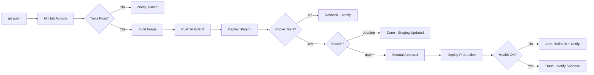
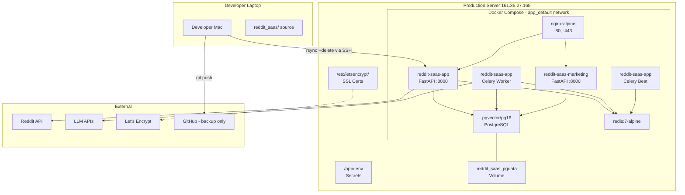
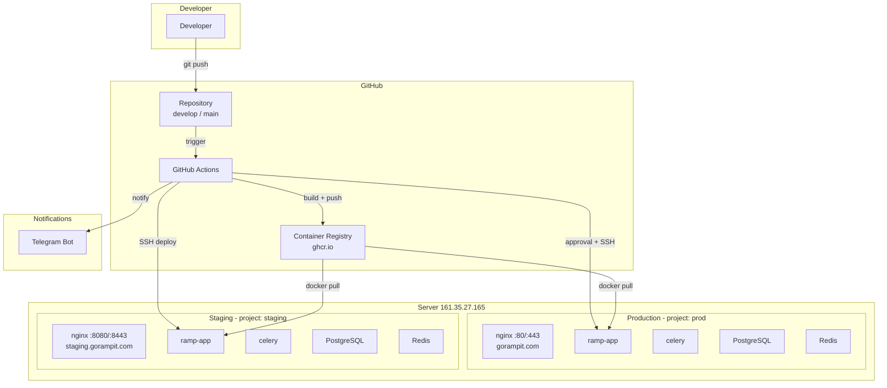

# Design Document: Staging & CI/CD Infrastructure

## Overview

This design document provides a complete technical blueprint for transitioning RAMP from manual rsync-based deployment to a Git-driven CI/CD pipeline with a dedicated staging environment. The deliverable is infrastructure documentation — actionable enough for a DevOps engineer to implement without independent research.

The document covers six parts:
1. **AS-IS State** — Current deployment process, repository structure, Docker audit
2. **State Audit** — Persistent vs ephemeral data inventory
3. **Reliability Check** — Reproducibility, backup, recovery procedures
4. **TO-BE Architecture** — CI/CD pipeline design with staging
5. **Staging Environment Design** — Isolation, resources, data strategy
6. **Migration Artifacts** — Diagrams, risks, estimation, blockers

### Key Design Decisions

| Decision | Choice | Rationale |
|----------|--------|-----------|
| Container Registry | GitHub Container Registry (GHCR) | Free, native GitHub Actions integration, zero extra credential setup |
| CI System | GitHub Actions | Already using GitHub for code; native integration with GHCR and Environments |
| Staging Location | Same server, separate Docker Compose project | Zero additional cost; sufficient isolation for current scale |
| Staging Domain | staging.gorampit.com (same IP, different port) | Free subdomain, separate SSL cert, clear separation |
| Deploy Strategy | Pull-based recreate (not blue-green/rolling) | Single server with 4 GB RAM — cannot afford double resources |
| Branch Strategy | develop → staging, main → production | Simple, clear mapping; PR + approval required for production |
| Notification Channel | Telegram bot | Team already uses Telegram for communication |
| Migration Approach | Entrypoint-based (existing behavior) | Simple, proven, appropriate for single-instance deployment |

---

## Architecture

### Current Architecture (AS-IS)

**Deployment Model:** Developer laptop → rsync over SSH → docker compose build/up on production server.

**Server:** Single DigitalOcean droplet (2 vCPU, 4 GB RAM, 60 GB SSD, Ubuntu 24.04, Frankfurt FRA1, IP: 161.35.27.165).

**Services:** 7 Docker containers on a single host — nginx, app (FastAPI), celery worker, celery-beat, marketing (FastAPI), db (PostgreSQL 16 + pgvector), redis.

### Target Architecture (TO-BE)

**Deployment Model:** Git push → GitHub Actions CI → Build & test → Push to GHCR → Deploy to staging → Smoke tests → Manual approval → Deploy to production.

**Environments:** Staging (same droplet, isolated Docker Compose project) + Production (existing droplet).

---

## Components and Interfaces

### Part 1: AS-IS Deployment Process Documentation

#### 1.1 Full Deployment Sequence

The current deployment is performed manually from the developer's local Mac. There is no CI/CD system, no automated testing before deploy, and no staging environment.

**Step-by-step deployment process:**

```bash
# Step 0: (Optional) Pre-deploy database backup
ssh root@161.35.27.165 "cd /app && docker compose exec -T db pg_dump \
  -U reddit_saas_user -d reddit_saas --no-owner --format=custom \
  -f /tmp/backup_pre_deploy.custom"

# Step 1: Navigate to project source
cd /Volumes/2SSD/Projects/ReddirSaaS/reddit_saas

# Step 2: Rsync code to production server
rsync -avz \
  --exclude='.venv/' --exclude='__pycache__/' --exclude='.hypothesis/' \
  --exclude='.git/' --exclude='*.pyc' --exclude='.DS_Store' --exclude='logs/' \
  --exclude='.env' --exclude='.claude/' --exclude='.kiro/' --exclude='.vscode/' \
  --exclude='tests/' --delete \
  ./ root@161.35.27.165:/app/

# Step 3: Rebuild and restart Docker containers
ssh root@161.35.27.165 "cd /app && \
  docker compose -f docker-compose.yml -f docker-compose.prod.yml build && \
  docker compose -f docker-compose.yml -f docker-compose.prod.yml up -d"

# Step 4: Wait for containers to initialize
sleep 10

# Step 5: Health check
ssh root@161.35.27.165 "curl -s http://localhost/health"

# Step 6: Verify logs (manual inspection)
ssh root@161.35.27.165 "cd /app && docker compose -f docker-compose.yml \
  -f docker-compose.prod.yml logs --tail=20 app"
```

**Marketing site deployment (separate path):**

```bash
cd /Volumes/2SSD/Projects/ReddirSaaS/marketing_site
rsync -avz \
  --exclude='.venv/' --exclude='__pycache__/' --exclude='.git/' \
  --exclude='*.pyc' --exclude='.DS_Store' --exclude='.env' \
  --delete \
  ./ root@161.35.27.165:/marketing_site/

ssh root@161.35.27.165 "cd /app && \
  docker compose -f docker-compose.yml -f docker-compose.prod.yml \
  build --no-cache marketing && \
  docker compose -f docker-compose.yml -f docker-compose.prod.yml up -d marketing"
```

**Key observations:**
- No automated tests run before deployment
- No rollback mechanism beyond DO weekly snapshots
- Deployment source is a developer laptop (single point of failure)
- `--delete` flag removes any file on server that doesn't exist locally (dangerous for server-only state)
- The `.env` file on server is preserved (excluded from rsync) but could be accidentally overwritten if exclude list changes
- Build happens on the production server (consumes prod CPU/RAM during deploy)

#### 1.2 Rsync Exclude Patterns and --delete Behavior

**Exclude list (files NOT sent to server):**

| Pattern | Purpose | Risk if Missing |
|---------|---------|-----------------|
| `.venv/` | Python virtual environment | Would overwrite server's venv (not used in Docker) |
| `__pycache__/` | Python bytecode cache | Harmless but wastes bandwidth |
| `.hypothesis/` | Property-based test database | Test artifact, not needed on server |
| `.git/` | Git repository data | Would expose full git history on server |
| `*.pyc` | Compiled Python files | Redundant with __pycache__ exclude |
| `.DS_Store` | macOS Finder metadata | Harmless clutter |
| `logs/` | Local log files | Would overwrite server logs |
| `.env` | Environment variables/secrets | **CRITICAL** — server .env has production secrets |
| `.claude/` | Claude AI workspace config | Development tool artifact |
| `.kiro/` | Kiro workspace config | Development tool artifact |
| `.vscode/` | VS Code settings | IDE artifact |
| `tests/` | Test suite | Not needed on production server |

**`--delete` flag behavior:**
- Removes files on the server (`/app/`) that do NOT exist in the local source directory
- This is intentional: ensures server code matches local exactly (no orphaned files)
- **Risk:** If a file exists only on server (e.g., manually created config, uploaded content), it gets deleted
- **Protected:** `.env` is safe because it's in the exclude list (rsync ignores it entirely)
- **NOT protected:** Any file created on server inside `/app/` that isn't in the local source will be deleted

**What `--delete` removes on each deploy:**
- Stale Python modules that were renamed/moved locally
- Old template files that were deleted from the project
- Any manually created files on the server within `/app/`
- Docker build context files that may have been manually patched on server

#### 1.3 Repository Structure

**Git hosting:** GitHub (private repository)

**Branch strategy (current — minimal):**
- `main` branch — primary development branch, direct commits
- No protected branches configured
- No pull request requirement
- No branch-to-environment mapping
- Deployments triggered manually, not tied to any branch

**Release flow (current):**
1. Developer commits to `main` locally
2. Developer pushes to GitHub (for backup/history only)
3. Developer runs rsync from local machine to server
4. No versioned releases, no git tags for deploys
5. VERSION file (`reddit_saas/VERSION`) tracks version manually (currently `0.3.0`)

**Repository layout:**
```
ReddirSaaS/                    (git root)
├── reddit_saas/               (main app — rsync source for /app/)
│   ├── app/                   (FastAPI application)
│   ├── alembic/               (DB migrations)
│   ├── docker-compose.yml     (base compose)
│   ├── docker-compose.prod.yml (production overrides)
│   ├── Dockerfile             (app image)
│   ├── nginx/                 (nginx config)
│   ├── entrypoint.sh          (container startup)
│   ├── pyproject.toml         (dependencies)
│   ├── Makefile               (dev commands)
│   └── VERSION                (0.3.0)
├── marketing_site/            (marketing app — rsync source for /marketing_site/)
│   ├── Dockerfile
│   ├── entrypoint.sh
│   └── pyproject.toml
├── tests/                     (excluded from deploy)
├── .kiro/                     (excluded from deploy)
└── .env                       (excluded from deploy)
```

#### 1.4 Docker Audit

##### 1.4.1 Compose Files

Two compose files used together in production:
- `docker-compose.yml` — base service definitions, volumes, networks, healthchecks
- `docker-compose.prod.yml` — production overrides (memory limits, reduced concurrency, logging limits, restart:always)

**Invocation:** `docker compose -f docker-compose.yml -f docker-compose.prod.yml up -d`

##### 1.4.2 Container Definitions

**Expected output of `docker ps` on production:**

```
CONTAINER ID   IMAGE                         COMMAND                  STATUS          PORTS                    NAMES
xxxxxxxxxxxx   nginx:alpine                  "/docker-entrypoint.…"   Up X days       0.0.0.0:80->80, :443->443   app-nginx-1
xxxxxxxxxxxx   reddit-saas-app:latest        "/app/entrypoint.sh"     Up X days       8000/tcp                 app-app-1
xxxxxxxxxxxx   reddit-saas-app:latest        "sh -c '...celery…'"     Up X days                                app-celery-1
xxxxxxxxxxxx   reddit-saas-app:latest        "sh -c '...beat…'"       Up X days                                app-celery-beat-1
xxxxxxxxxxxx   reddit-saas-marketing:latest  "/app/entrypoint.sh"     Up X days       8000/tcp                 app-marketing-1
xxxxxxxxxxxx   pgvector/pgvector:pg16        "docker-entrypoint.s…"   Up X days       5432/tcp                 app-db-1
xxxxxxxxxxxx   redis:7-alpine                "docker-entrypoint.s…"   Up X days       6379/tcp                 app-redis-1
```

##### 1.4.3 Service Detail Matrix

| Service | Image | Build? | Exposed Ports | Memory Limit (Prod) | Restart | Health Check | Depends On |
|---------|-------|--------|---------------|---------------------|---------|--------------|------------|
| nginx | `nginx:alpine` | No (pulled) | 80, 443 (host) | 64M | always | — | app, marketing |
| app | `reddit-saas-app:latest` | Yes (`./Dockerfile`) | 8000 (internal) | 512M | always | — | db (healthy), redis (healthy) |
| celery | `reddit-saas-app:latest` | No (reuses app image) | — | 768M | always | — | app (started), db (healthy), redis (healthy) |
| celery-beat | `reddit-saas-app:latest` | No (reuses app image) | — | 256M | always | — | app (started), db (healthy), redis (healthy) |
| marketing | `reddit-saas-marketing:latest` | Yes (`../marketing_site/Dockerfile`) | 8000 (internal) | 256M | always | — | db (healthy) |
| db | `pgvector/pgvector:pg16` | No (pulled) | 5432 (internal) | 512M | always | `pg_isready` every 5s | — |
| redis | `redis:7-alpine` | No (pulled) | 6379 (internal) | 192M | always | `redis-cli ping` every 5s | — |

**Total memory allocation:** 64 + 512 + 768 + 256 + 256 + 512 + 192 = **2,560 MB** (fits in 4 GB RAM droplet)

##### 1.4.4 Image Sources

| Image | Source | Tag Policy | Update Strategy |
|-------|--------|-----------|-----------------|
| `nginx:alpine` | Docker Hub | `alpine` (floating) | Manual pull on rebuild |
| `pgvector/pgvector:pg16` | Docker Hub | `pg16` (floating) | Manual pull on rebuild |
| `redis:7-alpine` | Docker Hub | `7-alpine` (floating) | Manual pull on rebuild |
| `reddit-saas-app:latest` | Built locally on server | `latest` only | Built each deploy |
| `reddit-saas-marketing:latest` | Built locally on server | `latest` only | Built each deploy |

**Risk:** Floating tags (`alpine`, `pg16`, `7-alpine`) mean upstream changes can break production on rebuild without code changes.

##### 1.4.5 Network Topology

**Expected output of `docker network ls` (production):**

```
NETWORK ID     NAME          DRIVER    SCOPE
xxxxxxxxxxxx   app_default   bridge    local
xxxxxxxxxxxx   bridge        bridge    local
xxxxxxxxxxxx   host          host      local
xxxxxxxxxxxx   none          null      local
```

Docker Compose creates a single default bridge network (`app_default`). All 7 containers are connected to it and resolve each other by service name (DNS via Docker embedded DNS at `127.0.0.11`).

**Inter-service communication map:**

```
nginx ──→ app:8000 (proxy_pass)
nginx ──→ marketing:8000 (proxy_pass)
app ──→ db:5432 (PostgreSQL)
app ──→ redis:6379 (cache, locks, rate limits, PubSub)
celery ──→ db:5432 (PostgreSQL)
celery ──→ redis:6379 (broker + result backend)
celery-beat ──→ redis:6379 (broker)
marketing ──→ db:5432 (PostgreSQL, shared database)
```

**External connections (outbound from containers):**
- `app` → Reddit API (via PRAW), LLM APIs (OpenRouter/Anthropic/Google), httpx (website scraping)
- `celery` → Reddit API, LLM APIs (same as app)
- `nginx` → Let's Encrypt ACME (certbot runs on host, not in container)

##### 1.4.6 Named Volumes

**Expected output of `docker volume ls` (production):**

```
DRIVER    VOLUME NAME
local     reddit_saas_pgdata
local     reddit_saas_backups
```

| Volume Name | Mount Point (container) | Contents | Size (est.) |
|-------------|------------------------|----------|-------------|
| `reddit_saas_pgdata` | `/var/lib/postgresql/data` (db) | PostgreSQL data directory — all tables, indexes, WAL | ~2-5 GB |
| `reddit_saas_backups` | `/app/backups` (app) | Database dump files from in-container backups | ~500 MB |

##### 1.4.7 Environment Variables

**Source:** `/app/.env` on server (excluded from rsync, persists across deploys)

**Key variables (from code analysis):**

| Variable | Service | Purpose |
|----------|---------|---------|
| `DATABASE_URL` | app, celery, celery-beat | PostgreSQL connection string |
| `REDIS_URL` | app, celery, celery-beat | Redis connection string |
| `REDIS_PASSWORD` | redis, app, celery | Redis authentication |
| `POSTGRES_PASSWORD` | db, marketing | PostgreSQL password |
| `SECRET_KEY` | app | JWT signing key |
| `ENCRYPTION_KEY` | app | Fernet field encryption key |
| `REDDIT_CLIENT_ID` | app, celery | Reddit API OAuth |
| `REDDIT_CLIENT_SECRET` | app, celery | Reddit API OAuth |
| `REDDIT_USERNAME` | app, celery | Reddit API (script app) |
| `REDDIT_PASSWORD` | app, celery | Reddit API (script app) |
| `OPENROUTER_API_KEY` | app, celery | LLM API access |
| `POSTING_DISABLED` | app, celery | Kill switch for automated posting |
| `TZ` | all | Timezone (`Asia/Jerusalem`) |

##### 1.4.8 Restart Policies and Health Checks

**Production:** All services have `restart: always`

**Health checks defined in compose:**
- `db`: `pg_isready -U reddit_saas_user -d reddit_saas` every 5s (10 retries, 10s start period)
- `redis`: `redis-cli -a $REDIS_PASSWORD ping` every 5s (10 retries, 5s start period)
- `app`, `celery`, `celery-beat`, `nginx`, `marketing`: No compose-level health check (rely on restart policy)

**Dependency chain:**
1. `db` and `redis` start first (no dependencies)
2. `app` starts after db+redis are healthy
3. `celery` and `celery-beat` start after app is started (ensures image is built)
4. `marketing` starts after db is healthy
5. `nginx` starts after app and marketing are started

##### 1.4.9 Logging Configuration (Production)

All services use `json-file` driver with rotation:

| Service | Max Size | Max Files | Total Retained |
|---------|----------|-----------|----------------|
| nginx | 5 MB | 3 | 15 MB |
| app | 10 MB | 3 | 30 MB |
| celery | 10 MB | 3 | 30 MB |
| celery-beat | 5 MB | 2 | 10 MB |
| db | 5 MB | 2 | 10 MB |
| redis | 5 MB | 2 | 10 MB |

**Total maximum log storage:** ~105 MB

##### 1.4.10 Expected Docker Images on Server

**Expected output of `docker images` (production):**

```
REPOSITORY              TAG       IMAGE ID       SIZE
reddit-saas-app         latest    xxxxxxxxxxxx   ~850 MB
reddit-saas-marketing   latest    xxxxxxxxxxxx   ~400 MB
nginx                   alpine    xxxxxxxxxxxx   ~45 MB
pgvector/pgvector       pg16      xxxxxxxxxxxx   ~400 MB
redis                   7-alpine  xxxxxxxxxxxx   ~35 MB
python                  3.11-slim xxxxxxxxxxxx   ~150 MB
```

**Estimated total image storage:** ~1.9 GB (plus build cache layers)

##### 1.4.11 Nginx Reverse Proxy and SSL Configuration

**SSL:** Let's Encrypt certificates for `gorampit.com` and `www.gorampit.com`
- Certificate path: `/etc/letsencrypt/live/gorampit.com/fullchain.pem`
- Key path: `/etc/letsencrypt/live/gorampit.com/privkey.pem`
- Protocols: TLSv1.2, TLSv1.3
- Mounted read-only from host: `/etc/letsencrypt:/etc/letsencrypt:ro`

**Routing strategy — Path-based split between app and marketing:**

| Path Pattern | Backend | Notes |
|--------------|---------|-------|
| `/admin`, `/auth`, `/login`, `/register`, `/logout` | app:8000 | Admin/auth routes |
| `/api/*`, `/review`, `/threads`, `/clients`, `/avatars` | app:8000 | Application routes |
| `/pipeline`, `/docs`, `/export`, `/dry-run`, `/health` | app:8000 | Operational routes |
| `/settings`, `/onboard`, `/guide`, `/home` | app:8000 | User pages |
| `/api/sse` | app:8000 | SSE (proxy_buffering off, 3600s timeout) |
| `/static` | app:8000 | App static files |
| `/mkt/static` | marketing:8000 | Marketing static files |
| `/waitlist`, `/api/analytics`, `/api/ab` | marketing:8000 | Marketing API |
| `/` (catch-all) | marketing:8000 | Landing pages |

**Security headers applied:**
- `X-Frame-Options: SAMEORIGIN`
- `X-Content-Type-Options: nosniff`
- `X-XSS-Protection: 1; mode=block`
- `Referrer-Policy: strict-origin-when-cross-origin`
- `Strict-Transport-Security: max-age=31536000; includeSubDomains` (HTTPS only)

**Other nginx settings:**
- HTTP→HTTPS redirect for gorampit.com
- HTTP fallback on port 80 for direct IP access (no SSL)
- `client_max_body_size: 10M`
- Gzip enabled (text, JSON, JS, CSS, XML, SVG)
- Custom maintenance page on 502/503/504
- Docker DNS resolver: `127.0.0.11 valid=10s ipv6=off`

**Let's Encrypt renewal:**
- Certbot installed on Ubuntu host
- Systemd timer runs `certbot renew` periodically
- Certificate stored at `/etc/letsencrypt/live/gorampit.com/`
- Nginx container mounts `/etc/letsencrypt` read-only
- **Gap:** No certbot deploy hook for automatic nginx reload after renewal

---

### Part 2: State Audit — Data Inventory

#### 2.1 Persistent Data (Survives container recreation)

##### 2.1.1 PostgreSQL Database (`reddit_saas_pgdata` volume)

**Database:** `reddit_saas` | **User:** `reddit_saas_user` | **Engine:** PostgreSQL 16 + pgvector

**Major tables (47 models total):**

| Table | Purpose | Criticality | Est. Size |
|-------|---------|-------------|-----------|
| `clients` | Client accounts, keywords JSONB, config | Critical | Small |
| `users` | User accounts, roles, auth | Critical | Small |
| `user_client_assignments` | RBAC user↔client mapping | Critical | Small |
| `avatars` | Avatar config, voice, phase, credentials (encrypted) | Critical | Small |
| `reddit_threads` | Scraped threads from Reddit | Important | Large (~50K+ rows) |
| `comment_drafts` | AI-generated comments, status workflow | Critical | Medium |
| `posting_events` | Audit trail for all posting attempts | Critical | Medium |
| `karma_snapshots` | Time-series karma tracking (4h/24h/48h/7d) | Important | Large (growing) |
| `epg_slots` | Daily avatar publishing schedule | Important | Medium |
| `activity_events` | Pipeline transparency/activity log | Important | Large |
| `audit_logs` | System audit trail | Critical | Medium |
| `system_settings` | Kill switches, feature flags | Critical | Small |
| `alembic_version` | Migration state tracking | Critical | Tiny |
| `thread_scores` | Per-client thread scoring results | Important | Large |
| `opportunities` | EPG 2.0 scored opportunities | Important | Large |
| `decision_records` | Portfolio state snapshots (pruned >90d) | Important | Large |
| `correction_patterns`, `edit_records` | Self-learning loop | Important | Small |
| `reddit_apps` | OAuth app credentials (encrypted) | Critical | Tiny |
| `notifications` | Client notification feed | Disposable | Medium |
| `scrape_logs` | Scrape metrics per run | Disposable | Large |

**Shared database:** The `marketing` service also connects to `reddit_saas` database (waitlist data).

##### 2.1.2 Backup Volume (`reddit_saas_backups`)

- Mount: `/app/backups` inside app container
- Contents: Database dump files created by entrypoint or manual backup
- Criticality: Important (redundant copy of DB state)
- Size: ~500 MB

##### 2.1.3 SSL Certificates (Host filesystem, NOT Docker volume)

- Path: `/etc/letsencrypt/` on the host
- Criticality: Critical (HTTPS unavailable without valid SSL)
- Managed by: certbot on host OS
- Covered by: DO droplet snapshots only

##### 2.1.4 Environment File (Host filesystem)

- Path: `/app/.env`
- Contents: All production secrets (DB passwords, API keys, encryption keys, JWT secrets)
- Criticality: **CRITICAL** — loss of `ENCRYPTION_KEY` means encrypted data is permanently unreadable
- Backup: DO weekly snapshots only (no off-server backup)

##### 2.1.5 Host Configuration

- Docker daemon: default config
- SSH keys: `~/.ssh/authorized_keys`
- Swap: 4 GB swap file
- Firewall: UFW (ports 22, 80, 443)
- Certbot account: `/etc/letsencrypt/accounts/`

#### 2.2 Ephemeral Data (Safely disposable)

| Data | Location | Recreated From |
|------|----------|---------------|
| Running container state | Docker runtime | `docker compose up` |
| Python bytecode (`__pycache__/`) | Inside containers | Regenerated on import |
| pip install cache | Build layer cache | Dockerfile `pip install` |
| Docker build cache | `/var/lib/docker/` | Rebuild from Dockerfile |
| Application logs (rotated) | Container json-file driver | Generated at runtime |
| Redis cache data | Redis container memory | Regenerated by application |
| Celery task results | Redis (TTL-based) | Regenerated on task execution |
| Temp files in containers | Container filesystem | Generated at runtime |

#### 2.3 Redis Data Classification

| Data Type | Key Pattern | Persistent? | Loss Impact |
|-----------|-------------|-------------|-------------|
| Celery broker messages | `celery-task-*` | No (in-flight) | Tasks lost, re-scheduled by Beat |
| Celery task results | `celery-task-meta-*` | No (5 min TTL) | No visible impact |
| Distributed locks | `lock:*` | No (60-300s TTL) | Locks release, brief double-execute possible |
| Rate limiter state | `ratelimit:*` | No (sliding window) | Rate limits reset, brief burst allowed |
| SSE PubSub channels | `notifications:*` | No (ephemeral) | Clients reconnect, no data loss |
| Queue tick gating | `queue_tick:*` | No (short TTL) | Scrape scheduling resets |

**Conclusion:** Redis data is entirely ephemeral. Redis restart causes no permanent data loss.

#### 2.4 Impact of Destructive Operations

| Operation | What's Lost | What Survives | Recovery |
|-----------|-------------|---------------|----------|
| `rsync --delete` | Server-only files in `/app/` | `.env`, Docker volumes, host files | Re-deploy from local |
| `docker compose down` | Running containers | Volumes, images, `.env` | `docker compose up -d` |
| `docker compose down -v` | **ALL VOLUMES** (pgdata, backups) | Images, `.env`, host files | Restore from DO snapshot |
| `docker system prune` | Stopped containers, unused images, build cache | Running containers, volumes | Rebuild images |
| `docker system prune -a --volumes` | **EVERYTHING** (images, volumes, containers) | `.env`, host files | Full rebuild + restore |

---

### Part 3: Reliability Check

#### 3.1 Production Reproducibility Assessment

**Can production be rebuilt from code + backups alone?**

| Component | Reproducible? | Source |
|-----------|---------------|--------|
| Application code | ✅ Yes | Git repository |
| Docker images | ✅ Yes | Rebuilt from Dockerfiles |
| Database schema | ✅ Yes | Alembic migrations |
| Database data | ⚠️ Partial | DO weekly snapshots (up to 7 days stale) |
| Environment secrets | ❌ No off-server backup | Only on server `.env` + DO snapshots |
| SSL certificates | ✅ Yes | Re-issued by certbot |
| Redis state | ✅ (ephemeral) | Regenerated at runtime |
| Docker host config | ⚠️ Partial | Must be manually reconfigured |

#### 3.2 Implicit State (exists only on server)

| Item | Location | Risk |
|------|----------|------|
| `.env` with `ENCRYPTION_KEY` | `/app/.env` | **If lost → encrypted avatar credentials permanently unreadable** |
| `SECRET_KEY` (JWT) | `/app/.env` | If lost → all sessions invalidated (users re-login) |
| SSH authorized_keys | `/root/.ssh/` | If lost → locked out of server |
| Certbot account key | `/etc/letsencrypt/accounts/` | If lost → must re-register with LE |
| Swap config | `/swapfile` + fstab | Must recreate manually |
| UFW rules | `/etc/ufw/` | Must recreate manually |

#### 3.3 Current Backup Strategy

| Method | Frequency | Retention | Covers | Gaps |
|--------|-----------|-----------|--------|------|
| DO droplet snapshots | Weekly | ~4 snapshots | Full disk | RPO = up to 7 days data loss |
| Pre-deploy pg_dump (manual) | Per deploy | Temporary (`/tmp/`) | Database at deploy time | Not automated, not off-server |
| Git repository | Every push | Unlimited | Source code only | No data, no secrets |

**Current RPO:** 7 days (worst case)
**Current RTO:** 30-60 minutes (restore DO snapshot)

#### 3.4 Disaster Recovery Scenarios

##### Scenario 1: Deployment Failed Mid-Build

**System state:** Indeterminate — old containers may still run if `up -d` wasn't reached.

**Recovery:**
1. SSH to server, check: `docker compose ps`
2. If old containers running: service operational, fix build issue, re-deploy
3. If containers down: `docker compose -f docker-compose.yml -f docker-compose.prod.yml up -d`

**Recovery time:** 5-15 minutes

##### Scenario 2: Server Completely Lost

**Recovery:**
1. Create new droplet from latest DO weekly snapshot (10-15 min)
2. Update DNS if IP changed
3. SSH to new server, verify containers start
4. Check `.env` is present (from snapshot)
5. Verify: `curl http://NEW_IP/health`

**Recovery time:** 30-60 minutes + DNS propagation
**Data loss:** Up to 7 days

##### Scenario 3: Database Migration Failed

**Recovery:**
1. Check `alembic_version` in database
2. Option A: Fix migration code, re-deploy
3. Option B: `pg_restore` from pre-deploy backup
4. Option C: `alembic stamp <previous_revision>`, fix forward

**Recovery time:** 15-45 minutes
**Note:** `entrypoint.sh` fallback stamps head if tables exist — may mask issues.

##### Scenario 4: Docker Volume Accidentally Deleted

**Recovery:**
1. If dump exists on server (`/tmp/backup_*.custom`): restore into fresh volume
2. If no dump: restore from DO snapshot (up to 7 days data loss)

**Recovery time:** 10-60 minutes depending on backup availability

##### Scenario 5: SSL Certificate Expired

**Recovery:**
1. `certbot renew --force-renewal`
2. `docker compose exec nginx nginx -s reload`

**Recovery time:** 5 minutes

#### 3.5 Backup Matrix

| Data Asset | Backup Method | Frequency | Retention | Recovery Procedure | Verified? |
|-----------|---------------|-----------|-----------|-------------------|-----------|
| Full server disk | DO snapshot | Weekly | ~4 weeks | Restore snapshot → new droplet | Unknown |
| PostgreSQL data | Pre-deploy pg_dump | Per deploy | Until /tmp cleared | pg_restore into fresh volume | Per deploy |
| Source code | Git (GitHub) | Per commit | Unlimited | git clone + rebuild | Always |
| SSL certificates | DO snapshot | Weekly | ~4 weeks | certbot re-issue | Unknown |
| `.env` secrets | DO snapshot only | Weekly | ~4 weeks | Restore from snapshot | Unknown |
| ENCRYPTION_KEY | DO snapshot only | Weekly | ~4 weeks | **UNRECOVERABLE if lost** | **Never** |

#### 3.6 No-Recovery Scenarios

| Scenario | Impact | Required Mitigation |
|----------|--------|---------------------|
| ENCRYPTION_KEY lost + no snapshot | Encrypted fields permanently unreadable | **Store off-server immediately** |
| DO snapshot AND server lost | Full data loss | Implement off-server backup |
| 7+ days between snapshots | Transactions/karma data lost | Increase backup frequency |

---

### Part 4: TO-BE CI/CD Pipeline Architecture

#### 4.1 Pipeline Sequence



**Pipeline steps:**
1. Developer pushes to `develop` or `main`
2. GitHub Actions triggers CI workflow
3. Run linting (`ruff check`), formatting (`ruff format --check`)
4. Run tests (`pytest` with service containers for PostgreSQL + Redis)
5. Run security scan (`pip-audit`)
6. Build Docker image (multi-stage, layer caching)
7. Push to GHCR with commit SHA tag
8. Deploy to staging (SSH → pull → recreate)
9. Run smoke tests (health endpoint, status code checks)
10. If `main`: require manual approval via GitHub Environment
11. Deploy to production (SSH → pull → recreate)
12. Post-deploy health check (poll /health for 60s)
13. Notify via Telegram

**Total pipeline duration:** ~10-15 minutes (develop→staging), +3-5 minutes for production.

#### 4.2 Git Branch Strategy

| Branch | Auto-Deploy To | Merge Rules |
|--------|----------------|-------------|
| `develop` | Staging | Direct push allowed |
| `main` | Production (after approval) | PR only, require CI pass |
| `feature/*` | — (CI tests only) | Merge into `develop` via PR |
| `hotfix/*` | Staging (fast-track) | Merge into `main` + `develop` |

#### 4.3 CI Checks

| Check | Tool | Duration | Blocks Deploy? |
|-------|------|----------|----------------|
| Linting | `ruff check` | ~30s | Yes |
| Formatting | `ruff format --check` | ~10s | Yes |
| Unit tests | `pytest` (with PG + Redis services) | ~2-5 min | Yes |
| Security scan | `pip-audit` | ~30s | Yes (on high severity) |
| Docker build | `docker build` | ~3-5 min | Yes |

#### 4.4 Container Registry

**Choice: GitHub Container Registry (GHCR)**

- Free for the repository's GitHub plan
- Native `GITHUB_TOKEN` authentication in Actions (zero extra setup)
- Private images supported
- Pull from Frankfurt droplet: adequate speed (images pulled once per deploy)

**Image tags:**
- `ghcr.io/OWNER/ramp-app:sha-<commit>` — immutable per-commit
- `ghcr.io/OWNER/ramp-app:develop` — latest staging
- `ghcr.io/OWNER/ramp-app:latest` — latest production
- `ghcr.io/OWNER/ramp-marketing:sha-<commit>` — marketing image

#### 4.5 Deployment Strategy

**Pull-based recreate (simple, reliable for single server):**

1. CI pushes image to GHCR
2. CI SSHs to server
3. CI sets `IMAGE_TAG` environment variable
4. CI runs: `docker compose pull app && docker compose up -d app celery celery-beat`
5. Docker stops old container, starts new (with new image)
6. Health check verifies response

**Downtime:** <5 seconds per service (container stop → start)

**Why not blue-green:** 4 GB RAM cannot run two full stacks. Simple recreate is appropriate.

#### 4.6 Rollback Strategy

**Automatic triggers:**
- Health check fails 5 times over 60s after deploy
- Smoke tests return non-200

**Rollback procedure:**
```bash
# Automated (in CI failure handler):
export IMAGE_TAG=sha-<previous_commit>
docker compose pull app celery celery-beat
docker compose up -d app celery celery-beat
```

**Maximum rollback time:** < 3 minutes (image already cached from previous deploy)

**Database migrations:** NOT auto-rolled back. If migration caused the failure, manual `alembic downgrade` + previous image needed.

#### 4.7 Pipeline Monitoring and Notifications

**Notification events:**

| Event | Channel | Priority |
|-------|---------|----------|
| CI build failed | Telegram | High |
| Deploy to staging succeeded | Telegram | Low |
| Smoke tests failed | Telegram | High |
| Rollback triggered | Telegram | Critical |
| Deploy to production succeeded | Telegram | Medium |
| Production health check failed | Telegram | Critical |

**Alerting thresholds:**
- Pipeline duration > 15 minutes → alert
- Staging unhealthy > 5 minutes after deploy → auto-rollback
- Production health poll: every 60s for 10 minutes post-deploy

#### 4.8 Secrets Management

**CI secrets (GitHub Actions Secrets):**

| Secret | Used By | Scope |
|--------|---------|-------|
| `SSH_PRIVATE_KEY` | Deploy jobs | SSH to server |
| `SERVER_HOST` | Deploy jobs | Server IP (161.35.27.165) |
| `TELEGRAM_BOT_TOKEN` | Notification step | Telegram alerts |
| `TELEGRAM_CHAT_ID` | Notification step | Telegram alerts |

**GHCR authentication:** Uses `GITHUB_TOKEN` (auto-provided) — no separate secret needed.

**Server pull authentication:** Docker credential store on server with fine-grained PAT (package:read scope, 90-day expiry).

**Staging vs Production separation:**
- Staging `.env`: `/staging/.env` (different passwords, different encryption key)
- Production `.env`: `/app/.env` (unchanged)
- GitHub Environments enforce gate: `production` requires manual approval

**Secret rotation (no code changes required):**
1. Generate new value
2. Update server `.env` via SSH
3. Update GitHub Secret if CI uses it
4. Restart affected containers

#### 4.9 Database Migration Strategy

**When:** Migrations run as part of `entrypoint.sh` on container start (existing behavior, unchanged).

**Pipeline integration:**
- CI test job: runs migrations in test DB (verifies they apply cleanly)
- Staging deploy: entrypoint runs `alembic upgrade head`
- Production deploy: entrypoint runs `alembic upgrade head`
- Pre-production: CI takes pg_dump backup before restarting production containers

**Failure handling:**
1. Migration fails → container crash-loops → health check fails → auto-rollback
2. Notification sent to Telegram
3. Manual investigation: check `alembic_version`, decide on fix-forward or downgrade

**Backward compatibility rule:** All migrations must be backward-compatible with the currently running version (add columns with defaults, never rename/drop in same release).

**Irreversible migrations:** If a migration has no `downgrade()` body, CI flags it and requires manual approval via GitHub Environment.

**Staging vs Production:**
- Staging: always `alembic upgrade head`, may be reset periodically
- Production: only runs migrations that passed on staging first

#### 4.10 SSL Certificate Management

**Production:** Keep existing certbot + deploy hook:
```bash
# /etc/letsencrypt/renewal-hooks/deploy/reload-nginx.sh
#!/bin/bash
docker compose -f /app/docker-compose.yml -f /app/docker-compose.prod.yml exec nginx nginx -s reload
```

**Staging:** Separate Let's Encrypt certificate for `staging.gorampit.com`:
```bash
certbot certonly --standalone -d staging.gorampit.com
```

**No wildcard needed** — separate certs are simpler and free.

---

### Part 5: Staging Environment Design

#### 5.1 Deployment Model

**Decision: Shared-host isolation (separate Docker Compose project on same server)**

| Factor | Separate Droplet | Shared Host (chosen) |
|--------|-----------------|---------------------|
| Cost | +$12-24/mo | $0 additional |
| Isolation | Full | Container-level |
| Complexity | Higher | Lower |
| Risk to production | Zero | Low (memory limited) |

**Upgrade trigger:** Move to separate droplet when production load > 60% of resources.

#### 5.2 Directory Layout

```
/app/                              ← Production
├── docker-compose.yml
├── docker-compose.prod.yml
├── .env                           ← Production secrets
└── (source files)

/staging/                          ← Staging
├── docker-compose.yml
├── docker-compose.staging.yml
├── .env                           ← Staging secrets (different values)
└── (pulled from registry, no source)
```

**Docker project isolation:**
- Production: `docker compose --project-name prod ...`
- Staging: `docker compose --project-name staging ...`
- Separate networks, container names, and volumes automatically

#### 5.3 Resource Allocation

| Service | Production | Staging | Combined |
|---------|-----------|---------|----------|
| nginx | 64 MB | 32 MB | 96 MB |
| app | 512 MB | 256 MB | 768 MB |
| celery | 768 MB | 384 MB | 1,152 MB |
| celery-beat | 256 MB | 128 MB | 384 MB |
| marketing | 256 MB | 128 MB | 384 MB |
| db | 512 MB | 256 MB | 768 MB |
| redis | 192 MB | 96 MB | 288 MB |
| **Total** | **2,560 MB** | **1,280 MB** | **3,840 MB** |

Fits within 4 GB RAM + 4 GB swap. If memory pressure occurs: reduce staging celery concurrency to 1.

#### 5.4 Isolation Matrix

| Resource | Production | Staging |
|----------|-----------|---------|
| Volumes | `reddit_saas_pgdata` | `staging_pgdata` |
| Network | `prod_default` | `staging_default` |
| Ports | 80/443 | 8080/8443 |
| Domain | gorampit.com | staging.gorampit.com |
| SSL cert | LE cert for gorampit.com | LE cert for staging.gorampit.com |
| DB password | (prod value) | (different) |
| Redis password | (prod value) | (different) |
| SECRET_KEY | (prod value) | (different) |
| ENCRYPTION_KEY | (prod value) | (different) |
| POSTING_DISABLED | `true` | `true` (always) |
| ENVIRONMENT | `production` | `staging` |

#### 5.5 Staging Data Strategy

**Approach:** Empty database + migrations + seed data (default)

**Setup:**
1. Staging starts with empty PostgreSQL volume
2. `alembic upgrade head` creates schema
3. `seed.py` creates base data (NeuroYoga test client, admin user)
4. Additional test data created manually or via script

**Optional: Production snapshot refresh**
- Manual trigger for debugging production issues
- Sanitization required: replace passwords, mask emails, clear encrypted fields
- Truncate large tables (reddit_threads, activity_events, scrape_logs)

#### 5.6 Staging Celery Beat Configuration

**Decision needed (Blocker B3):**

**Recommended: Disable Reddit-calling tasks on staging**

Staging `docker-compose.staging.yml` overrides celery-beat command to use a staging-specific Beat schedule:
- ✅ Keep: `system_heartbeat`, `queue_tick` (for pipeline testing)
- ❌ Disable: All Reddit API tasks (`scrape_*`, `health_check_*`, `hobby_*`)
- ❌ Disable: All LLM API tasks (to avoid costs on staging)
- ❌ Disable: `execute_pending_posts` (POSTING_DISABLED=true as backup)

This is controlled by checking `ENVIRONMENT=staging` in task code, or by using a separate Beat schedule config.

#### 5.7 Branch-to-Environment Mapping

```
feature/* ─── CI tests only (no deploy)
    │
    ▼ (merge to develop)
develop ───── Auto-deploy to Staging (immediate, no approval)
    │
    ▼ (PR to main, approval)
main ──────── Deploy to Production (after manual approval)
```

---

### Part 6: Migration Artifacts

#### 6.1 AS-IS Architecture Diagram



#### 6.2 TO-BE Architecture Diagram



#### 6.3 Change Summary

| Component | Status |
|-----------|--------|
| Production server, volumes, .env | **Unchanged** |
| Production nginx/SSL | **Unchanged** |
| Production Docker services | **Modified** (pull from GHCR instead of local build) |
| GitHub repository | **Modified** (branch strategy, Actions workflow) |
| Container Registry (GHCR) | **NEW** |
| GitHub Actions CI | **NEW** |
| Staging environment | **NEW** |
| DNS (staging.gorampit.com) | **NEW** |
| SSL cert (staging) | **NEW** |
| Telegram notifications | **NEW** |
| Deploy SSH key | **NEW** |
| Developer rsync deploy | **REMOVED** |

#### 6.4 Risk Registry

| # | Risk | Probability | Impact | Mitigation |
|---|------|-------------|--------|------------|
| R1 | Staging OOMs production | Medium | High | Strict memory limits; `docker stats` monitoring |
| R2 | GitHub Actions IP blocked by UFW | Low | Medium | Allow GitHub IP ranges or use self-hosted runner |
| R3 | SSH deploy key compromised | Low | Critical | Scoped key + quarterly rotation |
| R4 | Staging DB connects to prod data | Low | Critical | Triple isolation: different password, volume, URL |
| R5 | Concurrent deploys cause contention | Medium | Medium | GitHub Actions concurrency groups |
| R6 | CI passes but staging broken | Medium | Medium | Expand smoke tests iteratively |
| R7 | Direct push to main bypasses staging | Low | Medium | Branch protection rules |
| R8 | Secrets leaked in CI logs | Low | Critical | GitHub secret masking; never echo env vars |
| R9 | Migration passes staging, fails prod | Low | High | Pre-deploy backup; test with prod data snapshot |
| R10 | Transition confusion (rsync vs CI) | Medium | Low | Clear communication; disable rsync after verification |
| R11 | Floating base image tags break build | Low | Medium | Pin base images to specific versions in CI |
| R12 | GHCR storage limit exceeded | Low | Low | Prune old images with retention policy |

#### 6.5 Blockers Requiring Decisions

| # | Blocker | Options | Recommendation |
|---|---------|---------|----------------|
| B1 | DNS for staging | Add `staging.gorampit.com` A record | Do it — free, reversible |
| B2 | GitHub plan for GHCR | Free (500 MB) vs Pro ($4/mo, 2 GB) | Start with Free, upgrade if needed |
| B3 | Staging Celery Beat: run Reddit tasks? | Disable all external API tasks on staging | Safest — avoids costs and side effects |
| B4 | SSH access: root or deploy user? | Create `deploy` user with docker group | More secure, small setup cost |
| B5 | Notification channel | Telegram (team uses it) | Telegram — path of least resistance |
| B6 | Docker login on server | Fine-grained PAT (90-day, package:read) | More secure than broad PAT |
| B7 | ENCRYPTION_KEY backup | Store in 1Password or team vault | **Do immediately, before anything else** |

#### 6.6 Migration Plan

| # | Step | Dependencies | Downtime | Size | Hours |
|---|------|-------------|----------|------|-------|
| 1 | Back up ENCRYPTION_KEY and .env off-server | — | No | S | 0.5 |
| 2 | Set up GitHub branch protection on `main` | — | No | S | 1 |
| 3 | Create `develop` branch from `main` | #2 | No | S | 0.5 |
| 4 | Write GitHub Actions CI workflow (lint, test, build) | #3 | No | M | 4-6 |
| 5 | Configure GHCR image push in workflow | #4 | No | S | 1-2 |
| 6 | Create deploy SSH key, add to server + GitHub Secrets | — | No | S | 1 |
| 7 | Parameterize docker-compose to pull from GHCR | #5 | No | M | 4 |
| 8 | Add DNS A record: staging.gorampit.com | B1 | No | S | 0.5 |
| 9 | Create /staging/ directory with compose + .env | #7 | No | M | 4-6 |
| 10 | Issue SSL cert for staging.gorampit.com | #8 | No | S | 0.5 |
| 11 | Deploy staging environment | #9, #10 | No | S | 1-2 |
| 12 | Add staging deploy job to Actions | #6, #11 | No | M | 4 |
| 13 | Add smoke test job | #12 | No | S | 2 |
| 14 | Add production deploy job (approval gate) | #12 | No | M | 4 |
| 15 | Configure Telegram notifications | B5 | No | S | 2 |
| 16 | Add pre-deploy backup step to CI | #14 | No | S | 1-2 |
| 17 | Test full pipeline end-to-end | All | No | M | 4-8 |
| 18 | Disable rsync deploy (remove key) | #17 verified | No | S | 1 |
| 19 | Add certbot deploy hook for nginx reload | — | No | S | 0.5 |
| 20 | Write runbook (deploy, rollback, recovery) | #17 | No | M | 4 |

**Total: 40-56 hours (L-XL sizing)**

**Critical path:** 1 → 4 → 5 → 7 → 9 → 12 → 14 → 17

**Parallel tracks:**
- Steps 1, 2, 3, 6, 8 — all independent, do first
- Steps 15, 19 — independent of main flow
- Step 20 — start after step 14

#### 6.7 Steps Requiring Maintenance Window

**None.** All steps can be performed without production downtime. The transition is additive — staging is built alongside production, and production switches from rsync to CI only after full verification (Step 17).

#### 6.8 Post-Migration Verification Checklist

- [ ] Push to `develop` deploys to staging within 15 minutes
- [ ] Push to `main` waits for approval before production deploy
- [ ] Health endpoint on staging returns correct version
- [ ] Health endpoint on production returns correct version
- [ ] Rollback works (staging and production)
- [ ] Telegram notifications received (success and failure)
- [ ] Staging database is isolated from production
- [ ] Staging cannot post to Reddit (`POSTING_DISABLED=true`)
- [ ] ENCRYPTION_KEY stored off-server
- [ ] rsync deploy from laptop disabled
- [ ] Direct push to `main` blocked (branch protection)

---

## Data Models

This is a documentation feature. No new data models are introduced. The design references existing models and infrastructure state as documented in Parts 1-3.

---

## Correctness Properties

This feature produces infrastructure documentation and CI/CD configuration, not application logic. Property-based testing does not apply.

**Why PBT is not appropriate:** The deliverable is Markdown documentation describing deployment architecture and a migration plan. There are no pure functions, parsers, serializers, or algorithmic logic with varying inputs. Document correctness is validated through server state verification, cross-reference consistency checks, and DevOps peer review — not automated test execution.

No executable correctness properties are defined for this specification.

---


## Error Handling

Error handling applies to the CI/CD pipeline design:

| Error | Detection | Response |
|-------|-----------|----------|
| CI build failure | GitHub Actions job failure | Pipeline stops, Telegram notification |
| SSH connection timeout | CI step timeout (60s) | Retry once, then fail + notify |
| Image pull failure | Non-zero exit from `docker compose pull` | Retry 3x, then fail + notify |
| Health check failure post-deploy | HTTP non-200 from /health (5 attempts) | Auto-rollback to previous image |
| Migration failure | Container crash-loop detected via health | Auto-rollback + manual investigation |
| Disk full | Docker build failure | Alert on >80% disk usage (separate monitor) |
| Concurrent deploy conflict | GitHub Actions concurrency group | Queue or cancel duplicate runs |

---

## Testing Strategy

**PBT applicability:** NOT APPLICABLE. This is an infrastructure/documentation feature — the output is configuration files and runbook documentation, not application logic with testable properties.

**Appropriate testing:**

| Type | What | When |
|------|------|------|
| Smoke tests | `/health` returns 200 + correct version | After every deploy (automated in CI) |
| Integration test | Full pipeline flow: push → staging → approval → production | Step 17 (manual) |
| Config validation | `docker compose config` (syntax check) | In CI before deploy |
| YAML lint | GitHub Actions workflow syntax | On PR (GitHub validates automatically) |
| Runbook drill | Manual walkthrough of rollback + recovery | Quarterly |

**No unit tests or property-based tests are needed for this feature.**
