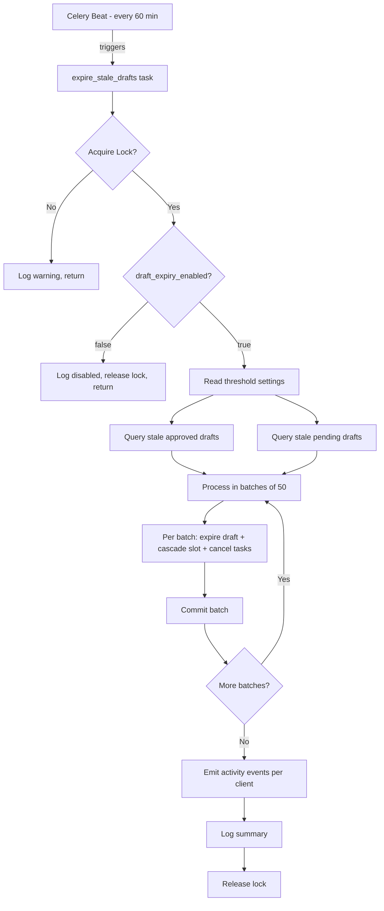

# Design Document: Stale Draft Expiry

## Overview

This feature implements an automated expiry mechanism for stale `CommentDraft` records in the RAMP system. A Celery Beat scheduled task runs every 60 minutes, identifies drafts that have exceeded their age threshold, and transitions them (along with associated EPGSlot and ExecutionTask records) to terminal states. The service emits activity events for operator visibility and provides structured logging for monitoring.

The design leverages existing infrastructure:
- `DistributedLock` for concurrency control
- `get_setting()` for runtime-configurable thresholds
- `record_activity_event()` for transparency
- Celery Beat + worker for scheduling and execution

No database migration is required — the `status` column on `CommentDraft` is already `VARCHAR(50)`, so `'expired'` is a valid value without schema changes.

## Architecture



## Components and Interfaces

### New Service: `app/services/draft_expiry.py`

The core service containing all expiry logic.

```python
class DraftExpiryService:
    """Identifies and expires stale CommentDraft records with full cascade."""

    def run(self, db: Session) -> DraftExpiryResult:
        """Main entry point. Returns summary of actions taken."""

    def _query_stale_approved(self, db: Session, threshold_hours: int, cap: int) -> list[CommentDraft]:
        """Query approved drafts older than threshold, excluding execution-window-protected."""

    def _query_stale_pending(self, db: Session, threshold_hours: int, cap: int) -> list[CommentDraft]:
        """Query pending drafts older than threshold."""

    def _process_batch(self, db: Session, drafts: list[CommentDraft]) -> BatchResult:
        """Process a batch of up to 50 drafts atomically."""

    def _expire_draft(self, db: Session, draft: CommentDraft) -> DraftExpiry:
        """Expire single draft + cascade to slot + tasks. No commit."""

    def _cascade_epg_slot(self, db: Session, draft_id: uuid.UUID) -> EPGSlot | None:
        """Transition associated EPGSlot to expired if non-terminal."""

    def _cancel_execution_tasks(self, db: Session, slot_id: uuid.UUID) -> int:
        """Cancel associated ExecutionTasks if non-terminal. Returns count."""

    def _emit_activity_events(self, db: Session, result: DraftExpiryResult) -> None:
        """Emit one ActivityEvent per affected client."""
```

### New Celery Task: `app/tasks/draft_expiry.py`

```python
@celery_app.task(name="expire_stale_drafts", bind=True)
def expire_stale_drafts(self) -> None:
    """Scheduled task: acquire lock, check kill switch, run expiry service."""
```

### Data Classes

```python
@dataclass
class DraftExpiry:
    draft_id: uuid.UUID
    avatar_id: uuid.UUID
    client_id: uuid.UUID
    original_status: str  # 'approved' | 'pending'
    age_hours: int
    slot_expired: bool
    tasks_cancelled: int

@dataclass
class BatchResult:
    expired: list[DraftExpiry]
    errors: list[str]

@dataclass
class DraftExpiryResult:
    total_expired: int
    approved_expired: int
    pending_expired: int
    tasks_cancelled: int
    per_client: dict[uuid.UUID, list[DraftExpiry]]
    batch_errors: list[str]
    duration_ms: int
```

### Integration Points

| Component | File | Change |
|-----------|------|--------|
| Celery worker | `app/tasks/worker.py` | Add `"app.tasks.draft_expiry"` to `include`, add beat entry |
| System settings | `app/services/settings.py` | Add 3 settings to `DEFAULTS` dict |
| Admin review template | `app/templates/admin_review.html` | Add amber badge for expired status |
| Portal review template | `app/templates/client/review.html` | Add amber badge for expired status |
| Admin filter | `app/routes/admin.py` | Add 'expired' to status filter dropdown |

## Data Models

No new models or migrations required. The feature operates on existing tables:

### CommentDraft (existing)
- `status`: VARCHAR(50) — adds `'expired'` as a valid runtime value
- `learning_metadata`: JSONB — stores expiry metadata (`{"expiry_reason": "stale_approved", "stale_age_hours": 52, "expired_at": "2026-07-05T14:15:00Z"}`)

### EPGSlot (existing)
- `status`: VARCHAR(50) — `'expired'` already a valid value
- `skip_reason`: VARCHAR(255) — set to `'draft_stale_expired'`

### ExecutionTask (existing)
- `status`: VARCHAR(50) — `'cancelled'` already valid
- `cancel_reason`: VARCHAR(500) — set to `'draft_stale_expired'`
- `task_lifecycle_status`: VARCHAR(50) — set to `'CANCELLED'` when currently `'ASSIGNED'`

### Query Design

**Stale approved drafts query:**
```sql
SELECT cd.* FROM comment_drafts cd
LEFT JOIN epg_slots es ON es.draft_id = cd.id
WHERE cd.status = 'approved'
  AND cd.updated_at < NOW() - INTERVAL '{threshold} hours'
  AND (es.id IS NULL OR es.scheduled_at IS NULL OR es.scheduled_at > NOW() + INTERVAL '2 hours')
ORDER BY cd.updated_at ASC
LIMIT 500
```

**Stale pending drafts query:**
```sql
SELECT cd.* FROM comment_drafts cd
WHERE cd.status = 'pending'
  AND cd.created_at < NOW() - INTERVAL '{threshold} hours'
ORDER BY cd.created_at ASC
LIMIT 500
```

Note: Pending drafts do not have execution window protection — they have no associated EPGSlot (slots are created at generation time, pending drafts haven't reached that stage).

### Indexes Used

- `ix_comment_drafts_status` — filter by status
- `ix_comment_drafts_created_at` — order pending by age
- `ix_epg_slots_draft_id` — join EPGSlot to draft

No new indexes required. The existing `ix_comment_drafts_status` index supports the query efficiently (approved/pending drafts are a small fraction of total rows).

## Correctness Properties

*A property is a characteristic or behavior that should hold true across all valid executions of a system — essentially, a formal statement about what the system should do. Properties serve as the bridge between human-readable specifications and machine-verifiable correctness guarantees.*

### Property 1: Candidate Selection Correctness

*For any* collection of CommentDraft records, the expiry candidate query SHALL return only drafts where: (a) status matches the target ('approved' or 'pending'), (b) age exceeds the configured threshold (using `updated_at` for approved, `created_at` for pending), (c) count does not exceed 500, and (d) for approved drafts, no associated EPGSlot has `scheduled_at` within the next 2 hours.

**Validates: Requirements 1.1, 1.2, 2.1**

### Property 2: Status Transition Integrity

*For any* stale draft identified by the candidate query, after expiry processing completes, the draft's status SHALL be `'expired'` and its `learning_metadata` SHALL contain `stale_age_hours` (integer, equal to the actual age in whole hours at the time of expiry).

**Validates: Requirements 1.3, 2.2, 8.4**

### Property 3: Cascade Atomicity

*For any* expired draft, if its associated EPGSlot has a non-terminal status (`'generated'` or `'approved'`), then within the same database commit: the slot status SHALL be `'expired'` with `skip_reason = 'draft_stale_expired'`, AND all associated ExecutionTasks with non-terminal status SHALL have `status = 'cancelled'`, `cancel_reason = 'draft_stale_expired'`, and (if `task_lifecycle_status = 'ASSIGNED'`) `task_lifecycle_status = 'CANCELLED'`.

**Validates: Requirements 3.2, 4.2, 4.5**

### Property 4: Terminal State Preservation

*For any* EPGSlot in a terminal status (`'posted'`, `'skipped'`, `'expired'`) or ExecutionTask in a terminal status (`'submitted'`, `'verified'`, `'expired'`, `'cancelled'`), the expiry process SHALL NOT modify the record regardless of its association with an expired draft.

**Validates: Requirements 3.3, 4.3**

### Property 5: Batch Independence and Error Isolation

*For any* set of N stale drafts processed in ceil(N/50) batches, if batch K fails with a database error, then: (a) batches 1 through K-1 remain committed, (b) batch K is fully rolled back, and (c) batches K+1 through ceil(N/50) are still attempted and can succeed independently.

**Validates: Requirements 1.4, 1.6, 2.3, 2.5**

### Property 6: Activity Event Per-Client Grouping

*For any* expiry run that expires drafts for C distinct clients, exactly C ActivityEvent records SHALL be emitted, each with: `event_type = 'system'`, correct `client_id`, `metadata.action = 'stale_draft_expiry'`, integer counts (`drafts_expired_count`, `approved_expired_count`, `pending_expired_count`, `tasks_cancelled_count`), a list of distinct avatar UUID strings, and a message matching the pattern `"Expired {N} stale draft(s) for {M} avatar(s)"`.

**Validates: Requirements 5.1, 5.2, 5.3, 5.5**

### Property 7: Execution Window Protection

*For any* approved draft with an associated EPGSlot whose `scheduled_at` is within the next 2 hours from the current time, the draft SHALL NOT appear in the expiry candidate set regardless of its age.

**Validates: Requirements 1.2**

## Error Handling

| Error Scenario | Handling | Impact |
|----------------|----------|--------|
| Lock acquisition fails | Log WARNING, return immediately | No processing — previous run still active |
| Database error in batch | Rollback batch, log ERROR with batch details, continue | Affected batch retried next hourly run |
| `record_activity_event` raises | Log ERROR, continue — do NOT revert already-committed batches | Events may be missing for that run; drafts already expired |
| Setting read fails (non-integer value) | Use default via `get_setting_int()` with fallback | System uses safe defaults (48h/72h) |
| Draft has no `client_id` | Skip draft, log WARNING | Orphaned draft not expired (rare edge case) |
| Unexpected exception in task | Caught at task level, lock released in `finally`, logged | Full run aborted but lock freed for next attempt |

### Error Escalation

- Single batch failure: log ERROR, metric incremented, processing continues
- >3 batch failures in single run: log CRITICAL (signals systemic issue)
- Lock held past TTL (1800s): auto-expires in Redis, next run proceeds

## Testing Strategy

### Property-Based Tests (fast-check via Hypothesis)

The feature is well-suited for property-based testing because:
- Core logic is pure query + state transition (clear input/output)
- Input space is large (timestamps, statuses, associations, batch sizes)
- Universal properties hold across all valid inputs
- Cost-effective (in-memory DB or mocks, no external services)

**Library:** `hypothesis` (already in project dev dependencies)
**Minimum iterations:** 100 per property test
**Tag format:** `Feature: stale-draft-expiry, Property {N}: {title}`

Each correctness property (1–7) maps to a single property-based test that generates random draft/slot/task configurations and verifies the invariant holds.

### Unit Tests (example-based)

| Test | Validates |
|------|-----------|
| No stale drafts → zero expired, INFO log | Req 1.5, 2.4, 9.4 |
| Lock not acquired → early return with WARNING | Req 6.4 |
| Kill switch disabled → early return | Req 6.5, 7.4 |
| Activity event failure → drafts remain expired | Req 5.4 |
| >50 expired → WARNING log | Req 9.2 |
| Per-draft DEBUG log with required fields | Req 9.3 |
| Beat schedule entry present | Req 6.1, 6.2 |
| Settings registered in pipeline group | Req 7.1, 7.2, 7.3, 7.5 |
| Expired draft excluded from approval queue | Req 8.5 |

### Integration Tests

| Test | Validates |
|------|-----------|
| Full end-to-end: create drafts + slots + tasks → run expiry → verify all cascaded | Req 1–5 combined |
| Concurrent lock test: two tasks running, second should skip | Req 6.3 |

### UI Tests (manual)

- Expired draft shows amber badge in admin review queue
- Expired draft shows amber badge in client portal review page
- Status filter dropdown includes 'expired' option
- Expired draft displays stale age from metadata
