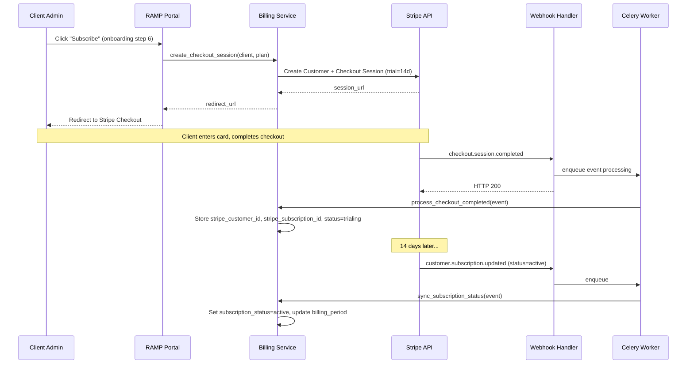
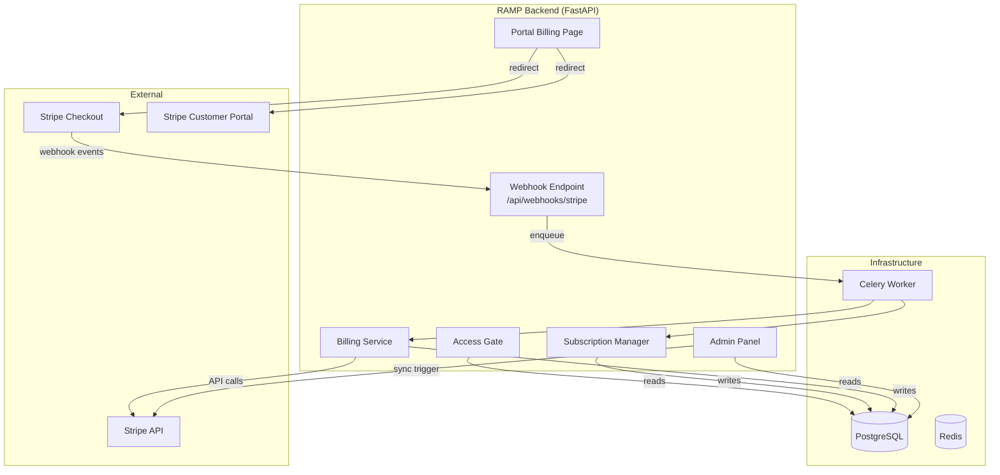
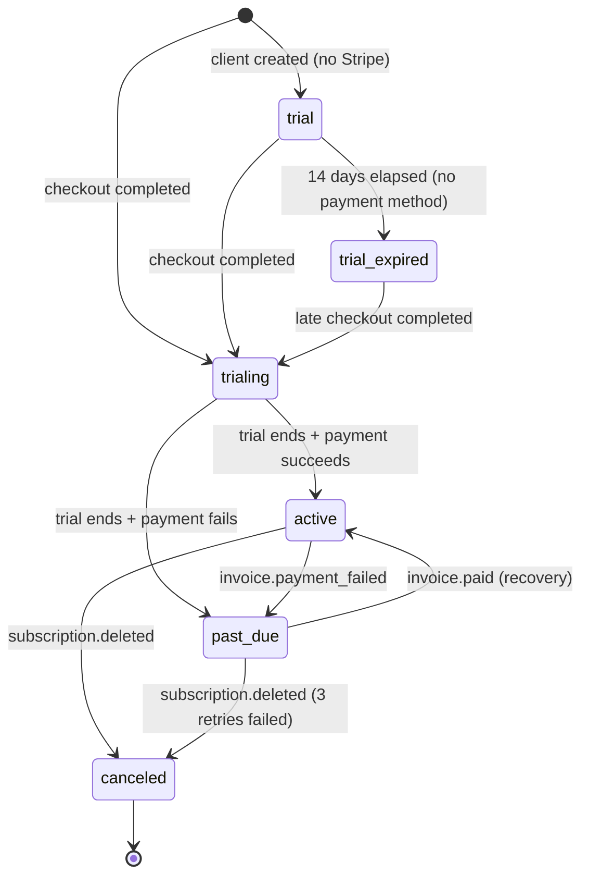

# Design Document: Stripe Billing Integration

## Overview

This design integrates Stripe as the billing engine for RAMP, replacing the placeholder billing page and static `plan_type` field with a real subscription lifecycle. The system follows an event-driven architecture where Stripe is the source of truth for payment state, and RAMP synchronizes that state locally via webhooks to gate platform access.

Key design decisions:
- **Stripe as authority** — subscription state lives in Stripe; RAMP caches it for fast access gating
- **Webhook-driven sync** — no polling; Stripe pushes events, RAMP processes idempotently
- **Async processing** — webhook endpoint returns 200 immediately, heavy work delegated to Celery
- **Graceful degradation** — if Stripe env vars are missing, billing features are disabled but the app runs normally
- **Additive schema changes** — new columns and tables only, no destructive migrations



## Architecture

### System Components



### Layer Responsibilities

| Layer | Responsibility | Key Files |
|-------|---------------|-----------|
| **Route Layer** | Webhook endpoint, portal billing page, admin billing views | `routes/webhooks.py`, `routes/portal.py` |
| **Service Layer** | Stripe API calls, subscription state sync, access gating logic | `services/billing.py`, `services/subscription_manager.py`, `services/access_gate.py` |
| **Task Layer** | Async webhook processing, notification dispatch | `tasks/billing.py` |
| **Model Layer** | Billing state persistence, event audit log, invoice cache | `models/client.py` (extended), `models/billing_event.py`, `models/client_invoice.py` |

### Integration Points with Existing Systems

| System | Integration | Direction |
|--------|------------|-----------|
| `trial_guard.py` | Replaced by `access_gate.py` for pipeline gating | access_gate supersedes trial_guard |
| `business_metrics.py` | MRR computed from Stripe subscription amounts instead of static `PLAN_PRICES` | access_gate feeds metrics |
| `client_emails.py` | New email types: trial_ending, payment_failed, subscription_activated | billing triggers emails |
| `transparency.py` | Activity events for billing state changes | billing emits events |
| `onboarding.py` | Step 6 redirects to Stripe Checkout instead of just activating trial | checkout replaces direct activation |
| `portal.py` (billing page) | Real plan data, invoice history, Stripe portal links | billing service feeds portal |
| `admin.py` | Billing badges, sync button, coupon management | billing service feeds admin |

## Components and Interfaces

### 1. Billing Service (`app/services/billing.py`)

Core service for Stripe API interactions.

```python
from dataclasses import dataclass
from uuid import UUID

@dataclass
class CheckoutResult:
    session_url: str
    session_id: str

@dataclass  
class PortalResult:
    portal_url: str

class BillingService:
    """Manages Stripe API interactions for customer and subscription lifecycle."""

    def __init__(self, db: Session):
        self.db = db
        self._stripe = self._get_stripe_client()

    def _get_stripe_client(self):
        """Initialize stripe module with secret key from env. Returns None if unconfigured."""
        ...

    def is_configured(self) -> bool:
        """Check if Stripe env vars are present and valid."""
        ...

    def ensure_products_exist(self) -> None:
        """Create Stripe Products + Prices for each plan tier if not already present.
        Called at app startup (idempotent).
        Plan tiers: Seed $149, Starter $399, Growth $799, Scale $1,499.
        Stores stripe_price_id in system_settings for each plan.
        """
        ...

    def create_checkout_session(
        self, 
        client_id: UUID, 
        plan_tier: str, 
        success_url: str, 
        cancel_url: str,
        coupon_id: str | None = None,
    ) -> CheckoutResult:
        """Create Stripe Checkout session with 14-day trial.
        - Creates Stripe Customer if not exists (brand_name + admin email)
        - Configures subscription with trial_period_days=14
        - Applies coupon if provided
        Returns redirect URL.
        """
        ...

    def create_plan_change_session(
        self,
        client_id: UUID,
        new_plan_tier: str,
        success_url: str,
        cancel_url: str,
    ) -> CheckoutResult:
        """Create Checkout session for plan upgrade/downgrade with prorated billing."""
        ...

    def create_portal_session(self, client_id: UUID, return_url: str) -> PortalResult:
        """Create Stripe Customer Portal session for self-service management."""
        ...

    def get_recent_invoices(self, client_id: UUID, limit: int = 12) -> list[dict]:
        """Fetch recent invoices from Stripe API and cache locally."""
        ...

    def sync_subscription_from_stripe(self, client_id: UUID) -> None:
        """Admin "Sync from Stripe" — fetches latest subscription state and updates local DB."""
        ...

    def create_coupon(
        self,
        name: str,
        percent_off: int | None = None,
        amount_off: int | None = None,
        duration_in_months: int = 3,
        max_redemptions: int | None = None,
    ) -> str:
        """Create Stripe Coupon and store locally. Returns coupon code."""
        ...
```

### 2. Subscription Manager (`app/services/subscription_manager.py`)

Processes webhook events and updates local billing state.

```python
class SubscriptionManager:
    """Processes Stripe webhook events and synchronizes local billing state."""

    def __init__(self, db: Session):
        self.db = db

    def handle_subscription_updated(self, event_data: dict) -> None:
        """Process customer.subscription.updated event.
        Maps Stripe status → local subscription_status.
        Updates plan_type, billing_period_start/end, max_avatars.
        Emits activity events.
        """
        ...

    def handle_subscription_deleted(self, event_data: dict) -> None:
        """Process customer.subscription.deleted event.
        Sets subscription_status=canceled, is_active=False.
        Emits subscription_canceled activity event.
        """
        ...

    def handle_invoice_paid(self, event_data: dict) -> None:
        """Process invoice.paid event.
        If previously past_due → restore to active.
        Cache invoice data locally.
        """
        ...

    def handle_invoice_payment_failed(self, event_data: dict) -> None:
        """Process invoice.payment_failed event.
        Set subscription_status=past_due.
        Send payment failure email to client admin.
        """
        ...

    def handle_trial_will_end(self, event_data: dict) -> None:
        """Process customer.subscription.trial_will_end (3 days before end).
        Send notification email to client admin.
        Emit trial_ending_soon activity event.
        """
        ...

    def handle_checkout_completed(self, event_data: dict) -> None:
        """Process checkout.session.completed event.
        Store stripe_customer_id, stripe_subscription_id on Client.
        Set subscription_status=trialing.
        """
        ...

    def _resolve_client_from_event(self, event_data: dict) -> Client | None:
        """Find Client by stripe_customer_id from webhook event."""
        ...

    def _map_plan_from_price(self, stripe_price_id: str) -> tuple[str, int]:
        """Map Stripe Price ID → (plan_type, max_avatars).
        Returns (plan_type, max_avatars) based on price metadata.
        """
        ...
```

### 3. Access Gate (`app/services/access_gate.py`)

Replaces and extends `trial_guard.py` for subscription-aware access control.

```python
class AccessGate:
    """Gates platform features based on subscription status.
    
    Replaces trial_guard.py with full subscription-aware gating.
    """

    # Statuses that block pipeline execution
    PIPELINE_BLOCKED = {"past_due", "canceled", "trial_expired"}
    
    # Statuses that allow full access
    FULL_ACCESS = {"active", "trialing"}
    
    # Statuses that allow read-only portal access (30 day grace)
    READ_ONLY_GRACE = {"past_due", "canceled"}
    GRACE_PERIOD_DAYS = 30

    @staticmethod
    def can_execute_pipeline(client: Client) -> bool:
        """Check if client's subscription allows pipeline execution.
        Used by EPG, scoring, generation tasks.
        Returns True for active/trialing, False for past_due/canceled/trial_expired.
        """
        ...

    @staticmethod
    def can_access_portal(client: Client) -> bool:
        """Check if client can access portal (read-only allowed during grace period)."""
        ...

    @staticmethod
    def is_read_only(client: Client) -> bool:
        """Check if client is in read-only grace period (can view but not trigger actions)."""
        ...

    @staticmethod
    def check_trial_expiry(client: Client) -> bool:
        """For legacy trials (no Stripe checkout), check 14-day expiry.
        Sets subscription_status=trial_expired if expired.
        Returns True if expired.
        """
        ...
```

### 4. Webhook Handler (`app/routes/webhooks.py`)

Public endpoint for Stripe webhook delivery.

```python
@router.post("/api/webhooks/stripe")
async def stripe_webhook(request: Request, db: Session = Depends(get_db)):
    """Receive and process Stripe webhook events.
    
    Flow:
    1. Read raw body
    2. Verify signature using STRIPE_WEBHOOK_SECRET
    3. Check idempotency (billing_events table)
    4. If simple event → process inline
    5. If complex event → enqueue to Celery, return 200 immediately
    6. Log to billing_events audit table
    
    Returns:
        200 for all valid signatures (processed or unhandled)
        400 for invalid signature
    """
    ...
```

### 5. Billing Celery Tasks (`app/tasks/billing.py`)

Async processing for webhook events that require database operations or notifications.

```python
@celery_app.task(name="process_billing_event", bind=True, max_retries=3)
def process_billing_event(self, event_id: str, event_type: str, event_data: dict):
    """Process a Stripe webhook event asynchronously.
    
    Handles:
    - customer.subscription.updated
    - customer.subscription.deleted
    - customer.subscription.trial_will_end
    - invoice.paid
    - invoice.payment_failed
    - checkout.session.completed
    """
    ...

@celery_app.task(name="sync_stripe_products")
def sync_stripe_products():
    """Ensure Stripe Products and Prices exist for all plan tiers.
    Called at app startup via lifespan event.
    """
    ...
```

### 6. Configuration Layer

```python
# Environment variables (read from .env, NEVER from DB)
STRIPE_SECRET_KEY: str          # sk_test_... or sk_live_...
STRIPE_WEBHOOK_SECRET: str      # whsec_...
STRIPE_PUBLISHABLE_KEY: str     # pk_test_... or pk_live_...

# DB system_settings (set by BillingService.ensure_products_exist)
stripe_price_id_seed: str       # price_... for Seed plan
stripe_price_id_starter: str    # price_... for Starter plan
stripe_price_id_growth: str     # price_... for Growth plan
stripe_price_id_scale: str      # price_... for Scale plan
```

## Data Models

### Extended Client Model (new columns on existing `clients` table)

```python
# Already exists (confirmed from codebase):
subscription_status: Mapped[str]           # trial | trialing | active | past_due | canceled | trial_expired
billing_period_start: Mapped[datetime | None]
billing_period_end: Mapped[datetime | None]

# NEW columns to add:
stripe_customer_id: Mapped[str | None] = mapped_column(String(255), unique=True, nullable=True)
stripe_subscription_id: Mapped[str | None] = mapped_column(String(255), unique=True, nullable=True)
stripe_price_id: Mapped[str | None] = mapped_column(String(255), nullable=True)
subscription_canceled_at: Mapped[datetime | None] = mapped_column(DateTime(timezone=True), nullable=True)
```

### BillingEvent Model (`app/models/billing_event.py`)

```python
class BillingEvent(Base):
    __tablename__ = "billing_events"

    id: Mapped[uuid.UUID] = mapped_column(UUID(as_uuid=True), primary_key=True, default=uuid.uuid4)
    stripe_event_id: Mapped[str] = mapped_column(String(255), unique=True, nullable=False)
    event_type: Mapped[str] = mapped_column(String(100), nullable=False)
    client_id: Mapped[uuid.UUID | None] = mapped_column(UUID(as_uuid=True), ForeignKey("clients.id"), nullable=True)
    payload: Mapped[dict] = mapped_column(JSONB, nullable=False)
    processing_status: Mapped[str] = mapped_column(String(20), default="pending")
    # pending | processed | failed | skipped (duplicate)
    processed_at: Mapped[datetime | None] = mapped_column(DateTime(timezone=True), nullable=True)
    error_message: Mapped[str | None] = mapped_column(Text, nullable=True)
    created_at: Mapped[datetime] = mapped_column(DateTime(timezone=True), server_default=func.now())

    __table_args__ = (
        Index("ix_billing_events_client_created", "client_id", "created_at"),
        Index("ix_billing_events_type", "event_type"),
    )
```

### ClientInvoice Model (`app/models/client_invoice.py`)

```python
class ClientInvoice(Base):
    __tablename__ = "client_invoices"

    id: Mapped[uuid.UUID] = mapped_column(UUID(as_uuid=True), primary_key=True, default=uuid.uuid4)
    client_id: Mapped[uuid.UUID] = mapped_column(UUID(as_uuid=True), ForeignKey("clients.id"), nullable=False)
    stripe_invoice_id: Mapped[str] = mapped_column(String(255), unique=True, nullable=False)
    amount_cents: Mapped[int] = mapped_column(Integer, nullable=False)
    currency: Mapped[str] = mapped_column(String(3), default="usd")
    status: Mapped[str] = mapped_column(String(20), nullable=False)  # paid | open | void | uncollectible
    period_start: Mapped[datetime] = mapped_column(DateTime(timezone=True), nullable=False)
    period_end: Mapped[datetime] = mapped_column(DateTime(timezone=True), nullable=False)
    invoice_pdf_url: Mapped[str | None] = mapped_column(Text, nullable=True)
    hosted_invoice_url: Mapped[str | None] = mapped_column(Text, nullable=True)
    created_at: Mapped[datetime] = mapped_column(DateTime(timezone=True), server_default=func.now())

    __table_args__ = (
        Index("ix_client_invoices_client_created", "client_id", "created_at"),
    )
```

### BillingCoupon Model (`app/models/billing_coupon.py`)

```python
class BillingCoupon(Base):
    __tablename__ = "billing_coupons"

    id: Mapped[uuid.UUID] = mapped_column(UUID(as_uuid=True), primary_key=True, default=uuid.uuid4)
    stripe_coupon_id: Mapped[str] = mapped_column(String(255), unique=True, nullable=False)
    code: Mapped[str] = mapped_column(String(50), unique=True, nullable=False)
    name: Mapped[str] = mapped_column(String(255), nullable=False)
    percent_off: Mapped[int | None] = mapped_column(Integer, nullable=True)
    amount_off_cents: Mapped[int | None] = mapped_column(Integer, nullable=True)
    duration_in_months: Mapped[int] = mapped_column(Integer, nullable=False)
    max_redemptions: Mapped[int | None] = mapped_column(Integer, nullable=True)
    times_redeemed: Mapped[int] = mapped_column(Integer, default=0)
    is_active: Mapped[bool] = mapped_column(Boolean, default=True)
    created_at: Mapped[datetime] = mapped_column(DateTime(timezone=True), server_default=func.now())
```

### Subscription Status State Machine



### Plan Tier → Limits Mapping

| Plan | Price/mo | max_avatars | stripe_price_id setting |
|------|---------|-------------|------------------------|
| Seed | $149 | 1 | `stripe_price_id_seed` |
| Starter | $399 | 3 | `stripe_price_id_starter` |
| Growth | $799 | 7 | `stripe_price_id_growth` |
| Scale | $1,499 | 15 | `stripe_price_id_scale` |


## Correctness Properties

*A property is a characteristic or behavior that should hold true across all valid executions of a system — essentially, a formal statement about what the system should do. Properties serve as the bridge between human-readable specifications and machine-verifiable correctness guarantees.*

### Property 1: Webhook Status Synchronization

*For any* valid Stripe webhook event (subscription.updated, subscription.deleted, invoice.paid, invoice.payment_failed), the resulting local `subscription_status` on the Client record SHALL correctly reflect the Stripe-side subscription state according to the mapping: Stripe `active` → local `active`, Stripe `past_due` → local `past_due`, Stripe `trialing` → local `trialing`, subscription deleted → local `canceled` with `is_active=False`, invoice.paid on past_due client → local `active` with `is_active=True`.

**Validates: Requirements 2.1, 2.2, 2.3, 2.5, 2.6, 8.1, 8.2**

### Property 2: Checkout State Persistence

*For any* valid `checkout.session.completed` event containing a `customer` ID and `subscription` ID, the corresponding Client record SHALL have `stripe_customer_id`, `stripe_subscription_id` stored and `subscription_status` set to `"trialing"`.

**Validates: Requirements 1.2**

### Property 3: Access Gate Classification

*For any* Client with a given `subscription_status`, the Access Gate SHALL classify access as: full access for `{"active", "trialing"}`, pipeline-blocked for `{"past_due", "canceled", "trial_expired"}`, and read-only portal access for `{"past_due", "canceled"}` when `subscription_canceled_at` is within the last 30 days.

**Validates: Requirements 3.1, 3.2, 3.5**

### Property 4: Webhook Signature Verification

*For any* incoming request to `/api/webhooks/stripe`, if the `Stripe-Signature` header does not validate against the configured webhook secret and the raw request body, the endpoint SHALL return HTTP 400 and SHALL NOT process the event or modify any database state.

**Validates: Requirements 2.7**

### Property 5: Webhook Idempotency

*For any* Stripe webhook event, processing it N times (N ≥ 1) SHALL produce the same final database state as processing it exactly once. The `billing_events` table SHALL contain exactly one record per unique `stripe_event_id`, with duplicates returning HTTP 200 without re-processing.

**Validates: Requirements 2.8**

### Property 6: Plan Tier Mapping

*For any* Stripe `price_id` that maps to a known plan tier, the Subscription Manager SHALL set `plan_type` and `max_avatars` on the Client record to the defined values: Seed → (seed, 1), Starter → (starter, 3), Growth → (growth, 7), Scale → (scale, 15).

**Validates: Requirements 4.4**

### Property 7: Webhook Audit Logging

*For any* webhook request that passes signature verification (valid or unhandled event type), a record SHALL be created in the `billing_events` table with the `stripe_event_id`, `event_type`, `payload`, and `processing_status`.

**Validates: Requirements 6.4, 9.2**

### Property 8: Unhandled Event Pass-Through

*For any* Stripe webhook event whose `event_type` is not in the set of explicitly handled types, the Webhook Handler SHALL return HTTP 200 and SHALL NOT modify any Client, subscription, or invoice state.

**Validates: Requirements 6.6**

### Property 9: MRR Computation

*For any* set of Client records in the database, the computed MRR SHALL equal the sum of plan prices for all clients where `subscription_status` is in `{"active", "trialing"}`, using the plan price mapping (seed=149, starter=399, growth=799, scale=1499).

**Validates: Requirements 7.2**

### Property 10: Graceful Degradation on Missing Configuration

*For any* combination of missing Stripe environment variables (`STRIPE_SECRET_KEY`, `STRIPE_WEBHOOK_SECRET`, `STRIPE_PUBLISHABLE_KEY`), the application SHALL start successfully without crashing, and `BillingService.is_configured()` SHALL return `False`, disabling all billing functionality.

**Validates: Requirements 10.4**

### Property 11: Invoice Cache Consistency

*For any* `invoice.paid` webhook event containing invoice data (amount, currency, period, PDF URL), a corresponding `ClientInvoice` record SHALL be created with fields matching the Stripe invoice data. If a record with the same `stripe_invoice_id` already exists, no duplicate SHALL be created.

**Validates: Requirements 9.3**

## Error Handling

### Webhook Processing Errors

| Error Type | Handling | Recovery |
|-----------|----------|----------|
| Invalid signature | Return HTTP 400, do not process | Stripe will not retry (our endpoint is rejecting, not failing) |
| Duplicate event (idempotency) | Return HTTP 200, skip processing | No action needed — already processed |
| Client not found for stripe_customer_id | Log warning, store in billing_events with status=failed | Admin investigates orphaned Stripe customer |
| DB error during processing | Return HTTP 500, rely on Stripe retry (up to 3 days) | Stripe retries with exponential backoff |
| Celery task failure | Task retries 3× with 60s×2^attempt backoff | After 3 retries, billing_event marked "failed" for manual investigation |
| Stripe API timeout (outgoing calls) | Retry once with 10s timeout, then fail gracefully | User sees error, can retry action |

### Stripe API Call Errors

| Error | Service Response | User Experience |
|-------|-----------------|----------------|
| Stripe `stripe.error.AuthenticationError` | Log critical, disable billing | Admin notified — key invalid |
| Stripe `stripe.error.RateLimitError` | Retry after 1s, max 2 attempts | Slight delay in checkout redirect |
| Stripe `stripe.error.InvalidRequestError` | Log error, return user-friendly message | "Unable to process. Contact support." |
| Stripe `stripe.error.APIConnectionError` | Retry once, then fail | "Stripe is temporarily unavailable. Try again." |
| Network timeout to Stripe | 30s timeout, retry once | Same as connection error |

### Billing State Inconsistency

If local state diverges from Stripe (e.g., missed webhook):
- **Detection**: Admin "Sync from Stripe" button fetches live state
- **Auto-healing**: Periodic reconciliation task (future — not in MVP)
- **Manual fix**: Admin panel shows Stripe dashboard link for each client

### Graceful Degradation Matrix

| Component Failure | Impact | Mitigation |
|------------------|--------|-----------|
| Stripe env vars missing | All billing features disabled | App runs normally, billing page shows "not configured" |
| Stripe API down | Checkout/portal redirects fail | User sees "try again later", existing subscriptions unaffected |
| Webhook delivery delayed | Local state temporarily stale | Stripe retries for up to 3 days; admin can force-sync |
| Redis down | Celery tasks not enqueued | Webhook returns 500 → Stripe retries later |
| PostgreSQL down | Can't store billing events | Webhook returns 500 → Stripe retries later |

## Testing Strategy

### Property-Based Testing (PBT)

This feature is well-suited for PBT because it contains:
- Pure functions with clear input/output (access gate classification, plan tier mapping, MRR computation)
- State machines with defined transitions (subscription status lifecycle)
- Idempotency requirements (webhook processing)
- Input validation (signature verification, event type filtering)

**Library**: `hypothesis` (already in project dependencies for RBAC property tests)

**Configuration**: Minimum 100 iterations per property test.

**Tag format**: `Feature: stripe-billing-integration, Property {N}: {property_text}`

Each correctness property above will be implemented as a single property-based test in `tests/test_billing_properties.py`.

### Unit Tests (Example-Based)

| Test File | Coverage |
|-----------|----------|
| `tests/test_billing_service.py` | Checkout session creation, portal session, coupon creation, product sync |
| `tests/test_subscription_manager.py` | Each webhook event type processing (specific examples) |
| `tests/test_access_gate.py` | Edge cases: grace period boundary (day 30 exactly), legacy trial expiry |
| `tests/test_webhook_handler.py` | Signature validation, response codes, async enqueue verification |
| `tests/test_billing_models.py` | Model creation, unique constraints, FK relationships |

### Integration Tests

| Test | Scope | Mocking |
|------|-------|---------|
| Full checkout flow | Onboarding → Checkout → Webhook → Client state | Stripe API mocked |
| Payment failure + recovery | active → past_due → invoice.paid → active | Stripe API mocked |
| Plan change flow | Starter → Growth → webhook → updated limits | Stripe API mocked |
| Admin sync | Trigger sync → Stripe API → local update | Stripe API mocked |

### Test Isolation

- All Stripe API calls mocked via `unittest.mock.patch` on `stripe` module
- Database tests use transaction rollback fixtures (existing `conftest.py` pattern)
- No real Stripe API calls in CI
- Webhook signature tests use known test signing secrets

### Key Test Principles

- **No real Stripe calls** in any test — always mock
- **Property tests cover the logic layer** (access gate, status mapping, MRR)
- **Unit tests cover specific webhook examples** (concrete event payloads)
- **Integration tests cover end-to-end flows** (checkout → webhook → state change)
- Minimum 100 iterations for property tests (due to randomization)
- Tests must pass in <30 seconds total (webhook processing is fast with mocked Stripe)
