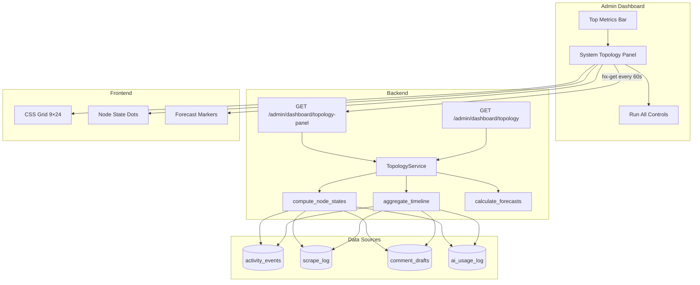

# Design Document: System Topology Timeline

## Overview

The System Topology Timeline is a real-time operational intelligence panel embedded in the Admin Dashboard (`/admin/`). It visualizes the health and activity of all 9 pipeline nodes as a connected system, providing:

1. **Current state** for each node (idle/running/success/warning/error/stale)
2. **24-hour activity heatmap** — a CSS grid with 9 rows × 24 columns showing event density per hour
3. **Forecast points** — when each node is expected to fire next

The panel is positioned between the Top Metrics Bar and Run All Controls. It uses pure CSS grid + Tailwind (no external JS charting libraries), auto-refreshes every 60 seconds via HTMX, and all database queries must complete within 100ms.

### Design Decisions

| Decision | Rationale |
|----------|-----------|
| Single SQL query for timeline | Avoids N+1 per-node queries; leverages `ix_activity_events_type_created` index |
| Pure CSS grid heatmap | No JS dependency, consistent with project's HTMX+Tailwind approach |
| HTMX partial endpoint | Matches existing dashboard patterns (client cards, freshness panel) |
| Forecast from schedule config | Deterministic calculation, no additional DB state needed |
| No caching layer | 60s refresh interval + <100ms query budget makes caching unnecessary |
| Collapsible with localStorage | Respects user preference without server-side state |

## Architecture



### Request Flow

1. Dashboard loads → HTMX fires `hx-get="/admin/dashboard/topology-panel"`
2. FastAPI route calls `TopologyService.get_topology_data(db)`
3. Service executes batched queries (single round-trip where possible)
4. Service computes node states, timeline buckets, and forecast points
5. Route renders Jinja2 partial template with topology data
6. HTMX swaps innerHTML of the panel container
7. Every 60s, HTMX re-fetches the partial

## Components and Interfaces

### 1. TopologyService (`app/services/topology.py`)

```python
from dataclasses import dataclass
from datetime import datetime
from enum import Enum

class NodeState(str, Enum):
    IDLE = "idle"
    RUNNING = "running"
    SUCCESS = "success"
    WARNING = "warning"
    ERROR = "error"
    STALE = "stale"

@dataclass
class HourBucket:
    hour: int          # 0-23
    event_count: int
    error_count: int

@dataclass
class NodeStatus:
    node_id: str
    label: str
    state: NodeState
    last_run_at: datetime | None
    last_duration_ms: int | None
    last_error: str | None
    forecast_point: str | None        # ISO 8601 or descriptive label
    forecast_relative: str | None     # "in 45 min", "overdue", etc.
    is_overdue: bool
    timeline: list[HourBucket]        # 24 items

@dataclass
class TopologyData:
    nodes: list[NodeStatus]
    current_hour: int
    generated_at: datetime


def get_topology_data(db: Session) -> TopologyData:
    """Main entry point. Computes all topology data in batched queries."""
    ...

def compute_node_states(db: Session) -> dict[str, NodeState]:
    """Compute current state for all 9 nodes."""
    ...

def aggregate_timeline(db: Session, hours: int = 24) -> dict[str, list[HourBucket]]:
    """Single SQL query aggregating events per node per hour."""
    ...

def calculate_forecasts(db: Session) -> dict[str, tuple[str | None, str | None, bool]]:
    """Calculate next expected execution for each node."""
    ...
```

### 2. Topology API Routes (`app/routes/admin.py` additions)

```python
@router.get("/dashboard/topology-panel")
def topology_panel(
    request: Request,
    db: Session = Depends(get_db),
    current_user: User = Depends(require_superuser),
):
    """Returns HTMX partial for the topology timeline panel."""
    ...

@router.get("/dashboard/topology")
def topology_json(
    db: Session = Depends(get_db),
    current_user: User = Depends(require_superuser),
):
    """Returns topology data as JSON for programmatic access."""
    ...
```

### 3. Jinja2 Template (`app/templates/partials/topology_panel.html`)

Renders the CSS grid heatmap with:
- Left column: node labels + state indicator dots
- 24 columns: hour cells with color intensity based on event count
- Forecast markers: pulsing indicators at projected hour
- Current hour highlight: distinct vertical border
- Collapse toggle with localStorage persistence

### 4. Dashboard Template Integration

The main `admin_dashboard.html` gets a new section between Top Metrics Bar and Run All Controls:

```html
<!-- System Topology Timeline -->
<div id="topology-container" class="bg-dark-steel rounded-lg border border-slate-700 mb-6">
    <div id="topology-panel"
         hx-get="/admin/dashboard/topology-panel"
         hx-trigger="load, every 60s"
         hx-swap="innerHTML">
        <p class="text-gray-500 text-xs p-4">Loading topology…</p>
    </div>
</div>
```

## Data Models

No new database tables are required. The feature reads from existing models:

### Existing Models Used

| Model | Table | Fields Used | Purpose |
|-------|-------|-------------|---------|
| `ActivityEvent` | `activity_events` | `event_type`, `created_at`, `event_metadata` | Timeline for score/generate/safety/heartbeat nodes |
| `ScrapeLog` | `scrape_log` | `scraped_at`, `errors`, `duration_ms` | Timeline + state for Scraping node |
| `AIUsageLog` | `ai_usage_log` | `created_at`, `operation`, `duration_ms` | Timeline + state for LLM API node |
| `CommentDraft` | `comment_drafts` | `status`, `created_at` | Timeline + state for Review Queue node |

### Existing Indexes Leveraged

| Index | Table | Columns | Used For |
|-------|-------|---------|----------|
| `ix_activity_events_type_created` | `activity_events` | `(event_type, created_at)` | Timeline aggregation GROUP BY |
| `ix_scrape_log_client_sub_time` | `scrape_log` | `(client_id, subreddit_name, scraped_at)` | Scrape freshness/state |
| `ix_comment_drafts_status` | `comment_drafts` | `(status)` | Review Queue pending count |
| `ix_comment_drafts_created_at` | `comment_drafts` | `(created_at)` | Review Queue timeline |

### Timeline Aggregation Query (Core)

The primary timeline query uses a single SQL statement:

```sql
SELECT
    event_type,
    date_trunc('hour', created_at) AS hour_bucket,
    COUNT(*) AS event_count,
    COUNT(*) FILTER (WHERE metadata->>'error' IS NOT NULL) AS error_count
FROM activity_events
WHERE created_at >= NOW() - INTERVAL '24 hours'
GROUP BY event_type, date_trunc('hour', created_at)
ORDER BY event_type, hour_bucket;
```

This is supplemented by:
- `scrape_log` aggregation for the Scraping node (grouped by `date_trunc('hour', scraped_at)`)
- `ai_usage_log` aggregation for the LLM API node (grouped by `date_trunc('hour', created_at)`)
- `comment_drafts` aggregation for the Review Queue node (grouped by `date_trunc('hour', created_at)`)

### Node-to-Data-Source Mapping

| Node | State Source | Timeline Source | Forecast Source |
|------|-------------|-----------------|-----------------|
| Scraping | `scrape_log` latest + `scrape_interval_hours` | `scrape_log` by hour | `queue_tick` interval + earliest due subreddit |
| Scoring | `activity_events` type='score' | `activity_events` type='score' | Next AI pipeline (08:00/14:00 UTC) |
| Generation | `activity_events` type='generate' | `activity_events` type='generate' | Next AI pipeline + offset |
| Review Queue | `comment_drafts` pending count/age | `comment_drafts` by hour | "human-driven" label |
| Reddit API | `activity_events` + `scrape_log` errors | `activity_events` type='scrape' errors | Continuous (next queue_tick) |
| LLM API | `ai_usage_log` error rate | `ai_usage_log` by hour | Next AI pipeline |
| Database | `SELECT 1` health check | N/A (always available or error) | N/A |
| Task Queue | `activity_events` type='heartbeat' | `activity_events` type='heartbeat' | Heartbeat interval (60s) |
| Safety | `activity_events` type='safety' | `activity_events` type='safety' | "event-driven" label |

### Schedule Configuration (Static)

Forecast calculations use the Celery Beat schedule defined in `app/tasks/worker.py`:

```python
SCHEDULE_CONFIG = {
    "scrape": {"type": "interval", "seconds": 60},
    "score": {"type": "cron", "hours": [8, 14], "minutes": 0},
    "generate": {"type": "cron", "hours": [8, 14], "minutes": 0, "offset_minutes": 15},
    "review": {"type": "human", "label": "human-driven"},
    "reddit_api": {"type": "interval", "seconds": 60},
    "llm_api": {"type": "cron", "hours": [8, 14], "minutes": 0},
    "database": {"type": "always", "label": "always available"},
    "queue": {"type": "interval", "seconds": 60},
    "safety": {"type": "event", "label": "event-driven"},
}
```


## Correctness Properties

*A property is a characteristic or behavior that should hold true across all valid executions of a system — essentially, a formal statement about what the system should do. Properties serve as the bridge between human-readable specifications and machine-verifiable correctness guarantees.*

### Property 1: Staleness threshold determines node state

*For any* pipeline node with a time-based staleness threshold (Scraping/6h, Scoring/2h after scrape, Generation/4h after scoring, Task Queue/5min heartbeat), and *for any* last_activity timestamp, the computed node state SHALL be "stale" if and only if `now - last_activity > threshold`, and "idle" if the node completed successfully within its threshold.

**Validates: Requirements 1.2, 1.3, 1.4, 1.9, 1.11**

### Property 2: Error rate threshold determines error state

*For any* node with an error rate threshold (Reddit API/5%, LLM API/10%), and *for any* combination of total_events and error_events in a 15-minute window where total_events > 0, the computed node state SHALL be "error" if and only if `error_events / total_events > threshold`.

**Validates: Requirements 1.6, 1.7**

### Property 3: Review Queue warning threshold

*For any* pending_count (0–200) and oldest_draft_age (0–72h), the Review Queue node state SHALL be "warning" if and only if `pending_count > 50 OR oldest_draft_age > 24 hours`.

**Validates: Requirements 1.5**

### Property 4: Timeline aggregation produces correct hour buckets

*For any* set of events with known timestamps within the last 24 hours, the timeline aggregation SHALL produce exactly 24 HourBuckets per node where: (a) each bucket's `hour` is in [0, 23], (b) `event_count` equals the number of events whose `date_trunc('hour', timestamp)` matches that bucket's hour, (c) `error_count <= event_count`, and (d) the sum of all `event_count` values equals the total number of input events for that node.

**Validates: Requirements 2.1, 2.2, 2.3, 2.4, 2.5, 2.6, 2.7, 2.8**

### Property 5: Cron-based forecast returns next scheduled occurrence

*For any* current UTC timestamp, the cron-based forecast for Scoring/Generation nodes SHALL return the next occurrence of 08:00 or 14:00 UTC that is strictly in the future. The result SHALL always satisfy `forecast > now` and `forecast - now <= 12 hours`.

**Validates: Requirements 3.3, 3.4**

### Property 6: Interval-based forecast returns last_run + interval

*For any* node with an interval-based schedule (Scraping/60s, Task Queue/60s) and *for any* last_run timestamp, the forecast SHALL equal `last_run + interval`. If `forecast < now`, the node SHALL be marked as overdue.

**Validates: Requirements 3.2, 3.6**

### Property 7: Forecast output format invariant

*For any* generated TopologyData, each node's `forecast_point` SHALL be either a valid ISO 8601 timestamp string or one of the descriptive labels: "human-driven", "event-driven", "always available".

**Validates: Requirements 3.8**

### Property 8: Node state to CSS class mapping is total and correct

*For any* valid NodeState enum value, the state indicator rendering function SHALL produce exactly one CSS class from the defined mapping: idle→"bg-gray-500", running→"bg-blue-500 animate-pulse", success→"bg-emerald-500", warning→"bg-amber-500", error→"bg-red-500", stale→"bg-gray-600 opacity-50".

**Validates: Requirements 7.1, 7.2, 7.3, 7.4, 7.5, 7.6**

## Error Handling

### Database Unavailable

When the PostgreSQL health check (`SELECT 1`) fails during topology computation:
1. The Database node is immediately set to `NodeState.ERROR`
2. Other nodes retain their last known state (graceful degradation)
3. The endpoint returns HTTP 200 with a degraded response (not 503)
4. A `topology.db_health_failed` log entry is emitted at ERROR level

### Query Timeout

When the timeline aggregation query exceeds 100ms:
1. The query still completes (no hard timeout kill)
2. A performance warning is logged: `topology.slow_query duration_ms={actual}`
3. The response is still returned normally
4. Future optimization: consider statement_timeout if consistently slow

### Missing Data (Cold Start)

When no events exist for a node (fresh deployment):
1. All 24 HourBuckets are returned with `event_count=0, error_count=0`
2. Node state defaults to "idle" (no activity is not an error)
3. Forecast is still calculated from schedule config (doesn't depend on history)

### HTMX Request Failure

When the 60-second auto-refresh fails (network error, 5xx):
1. HTMX retains the last successfully rendered content (default behavior)
2. No JavaScript error handling needed (HTMX handles gracefully)
3. The manual refresh button allows explicit retry

### Invalid State Transitions

The state computation is stateless — each refresh computes state from scratch based on current data. There are no invalid transitions because there is no state machine with transition rules. Each computation is independent.

## Testing Strategy

### Property-Based Tests (Hypothesis)

The project already uses Hypothesis (`.hypothesis/` directory exists). Property tests will validate the core service logic:

- **Library**: `hypothesis` (already installed)
- **Minimum iterations**: 100 per property
- **Tag format**: `# Feature: system-topology-timeline, Property {N}: {title}`

**Property tests cover:**
1. `test_staleness_threshold` — Properties 1 (staleness logic)
2. `test_error_rate_threshold` — Property 2 (error rate computation)
3. `test_review_queue_warning` — Property 3 (warning threshold)
4. `test_timeline_aggregation` — Property 4 (hour bucketing)
5. `test_cron_forecast` — Property 5 (next cron occurrence)
6. `test_interval_forecast` — Property 6 (interval-based forecast)
7. `test_forecast_format` — Property 7 (output format invariant)
8. `test_state_css_mapping` — Property 8 (CSS class mapping)

### Unit Tests (pytest)

Example-based tests for specific scenarios:

- Forecast returns "human-driven" for Review Queue
- Forecast returns "event-driven" for Safety node
- Database health check failure produces degraded response
- Empty event set produces 24 zero-count buckets per node
- Topology endpoint returns exactly 9 nodes
- HTMX partial contains required `hx-*` attributes
- Panel HTML contains correct grid structure (9 rows × 24 cols)
- Collapse toggle includes localStorage script

### Integration Tests

- Endpoint authentication (superuser required)
- Full topology endpoint response structure validation
- Query performance under representative data volume (~1000 events)
- Template rendering with real topology data

### Test File Structure

```
tests/
├── test_topology_service.py      # Property + unit tests for service logic
├── test_topology_routes.py       # Integration tests for API endpoints
└── test_topology_template.py     # Template rendering tests
```
