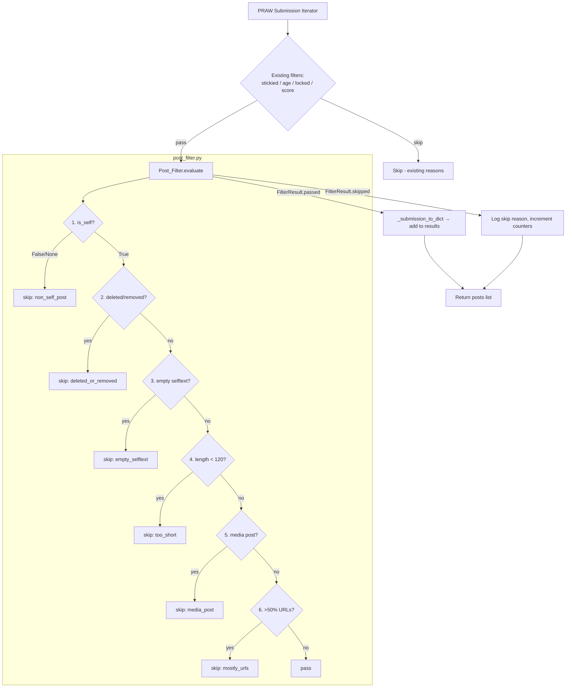

# Design Document: Thread Ingestion Filtering

## Overview

Thread Ingestion Filtering adds a deterministic, zero-cost filter gate inside the `scrape_subreddit` function that rejects Reddit submissions lacking meaningful plain-text content. The filter evaluates each submission against a fixed sequence of rules (cheapest first) and returns a structured `FilterResult` indicating pass/skip with an explicit `SkipReason`. This prevents media-only posts, deleted content, link posts, and URL-heavy text from consuming downstream AI scoring and generation resources.

The module is positioned as a pure function: no database access, no network calls, no external dependencies. It operates solely on the dict returned by `_submission_to_dict()` (plus raw PRAW Submission attributes exposed during iteration). This keeps it fast, testable, and safe to call inside the hot loop of `scrape_subreddit`.

### Design Rationale

- **Placement inside `scrape_subreddit`**: All scraping paths (professional, hobby, repurpose, shared) call `scrape_subreddit`. Filtering here provides universal coverage without code duplication.
- **Evaluation order by cost**: The filter checks `is_self` (boolean compare) before regex-based URL analysis, ensuring the cheapest checks short-circuit first.
- **Separate module**: Keeps `reddit.py` focused on API interaction. The filter is a pure function module at `app/services/post_filter.py`, distinct from the existing `pre_filter.py` (which is keyword/client-based and operates on `RedditThread` ORM objects, not raw submission dicts).

## Architecture



### Module Placement

```
app/services/
├── post_filter.py    ← NEW: pure filter logic (FilterResult, SkipReason, evaluate)
├── pre_filter.py     ← EXISTING: keyword/client-based thread filtering (unchanged)
├── reddit.py         ← MODIFIED: calls post_filter.evaluate() inside scrape_subreddit
└── ...
```

### Integration Point

Inside `scrape_subreddit()` in `app/services/reddit.py`, after the existing checks (stickied, age, locked, score) and before `_submission_to_dict()`:

```python
from app.services.post_filter import evaluate, FilterResult

# ... existing checks ...

# Post content filter (before expensive _submission_to_dict call)
filter_result = evaluate(submission)
if filter_result.skipped:
    skip_counts[filter_result.reason.value] = skip_counts.get(filter_result.reason.value, 0) + 1
    logger.info(
        "POST_FILTER_SKIP | submission_id=%s | subreddit=r/%s | title=%s | reason=%s",
        submission.id, subreddit_name, submission.title[:80], filter_result.reason.value,
    )
    continue
```

Key insight: the filter runs on the raw `praw.models.Submission` object **before** `_submission_to_dict()` is called. This avoids the cost of fetching comments (which `_submission_to_dict` does via `replace_more`) for submissions that will be filtered out anyway.

## Components and Interfaces

### `app/services/post_filter.py`

```python
"""Post content filter — deterministic text-quality gate for ingestion.

Evaluates raw PRAW Submission objects against text-quality rules.
Returns FilterResult with pass/skip decision and reason.
Pure function: no DB, no network, no side effects.
"""

from __future__ import annotations

import re
from dataclasses import dataclass
from enum import Enum
from typing import Any


class SkipReason(str, Enum):
    """Why a submission was filtered out during ingestion."""
    non_self_post = "non_self_post"
    deleted_or_removed = "deleted_or_removed"
    empty_selftext = "empty_selftext"
    too_short = "too_short"
    media_post = "media_post"
    mostly_urls = "mostly_urls"


@dataclass(frozen=True, slots=True)
class FilterResult:
    """Result of evaluating a submission against ingestion filters."""
    passed: bool
    reason: SkipReason | None = None

    @property
    def skipped(self) -> bool:
        return not self.passed

    @classmethod
    def pass_result(cls) -> FilterResult:
        return cls(passed=True, reason=None)

    @classmethod
    def skip(cls, reason: SkipReason) -> FilterResult:
        return cls(passed=False, reason=reason)


# Configuration
MIN_SELF_TEXT_LENGTH: int = 120
URL_RATIO_THRESHOLD: float = 0.50

# Precompiled regex for URL detection
_URL_PATTERN: re.Pattern = re.compile(r"https?://\S+")

# Media post_hint values that always trigger skip
_MEDIA_HINTS: frozenset[str] = frozenset({"image", "hosted:video", "rich:video"})


def evaluate(submission: Any) -> FilterResult:
    """Evaluate a PRAW Submission against ingestion filter rules.

    Rules are evaluated in fixed order (cheapest to most expensive):
    1. is_self check
    2. deleted/removed check
    3. empty selftext check
    4. minimum length check
    5. media post check
    6. URL-dominated text check

    Args:
        submission: A praw.models.Submission object (or duck-typed equivalent).

    Returns:
        FilterResult indicating pass or skip with reason.
    """
    # Rule 1: Self-post gate
    is_self = getattr(submission, "is_self", None)
    if not is_self:  # False or None
        return FilterResult.skip(SkipReason.non_self_post)

    # Rule 2: Deleted/removed detection
    selftext = getattr(submission, "selftext", None)
    if selftext in ("[deleted]", "[removed]"):
        return FilterResult.skip(SkipReason.deleted_or_removed)

    # Rule 3: Empty selftext
    if selftext is None or selftext.strip() == "":
        return FilterResult.skip(SkipReason.empty_selftext)

    # Rule 4: Minimum length
    stripped_text = selftext.strip()
    if len(stripped_text) < MIN_SELF_TEXT_LENGTH:
        return FilterResult.skip(SkipReason.too_short)

    # Rule 5: Media post detection
    media_result = _check_media(submission, selftext)
    if media_result is not None:
        return media_result

    # Rule 6: URL-dominated text
    if _is_mostly_urls(stripped_text):
        return FilterResult.skip(SkipReason.mostly_urls)

    return FilterResult.pass_result()


def _check_media(submission: Any, selftext: str) -> FilterResult | None:
    """Check media-related conditions. Returns FilterResult if skip, None if pass."""
    post_hint = getattr(submission, "post_hint", None)

    # 5.1-5.3: Known media hints
    if post_hint in _MEDIA_HINTS:
        return FilterResult.skip(SkipReason.media_post)

    # 5.4: post_hint "link" with empty selftext
    selftext_empty = (selftext is None or selftext.strip() == "")
    if post_hint == "link" and selftext_empty:
        return FilterResult.skip(SkipReason.media_post)

    # 5.5: Gallery post
    is_gallery = getattr(submission, "is_gallery", None)
    if is_gallery is True:
        return FilterResult.skip(SkipReason.media_post)

    # 5.6: media field present with empty selftext
    media = getattr(submission, "media", None)
    if media is not None and selftext_empty:
        return FilterResult.skip(SkipReason.media_post)

    # 5.7: secure_media field present with empty selftext
    secure_media = getattr(submission, "secure_media", None)
    if secure_media is not None and selftext_empty:
        return FilterResult.skip(SkipReason.media_post)

    return None


def _is_mostly_urls(text: str) -> bool:
    """Check if more than 50% of non-whitespace characters are part of URLs."""
    non_ws_total = len(text.replace(" ", "").replace("\t", "").replace("\n", "").replace("\r", ""))
    if non_ws_total == 0:
        return False

    url_chars = sum(len(m.group()) for m in _URL_PATTERN.finditer(text))
    return (url_chars / non_ws_total) > URL_RATIO_THRESHOLD
```

### Modified `scrape_subreddit()` signature (unchanged externally)

The function signature remains the same. Internally, after the existing skip checks and before `_submission_to_dict()`, the filter is invoked. A summary log line is emitted at the end with per-reason counts.

### Error Handling in Integration

```python
# Inside scrape_subreddit loop:
try:
    filter_result = evaluate(submission)
except Exception as e:
    logger.warning(
        "POST_FILTER_ERROR | submission_id=%s | subreddit=r/%s | error=%s — skipping submission",
        submission.id, subreddit_name, str(e)[:200],
    )
    skipped_filter_error += 1
    continue
```

## Data Models

### `SkipReason` (Enum)

| Value | Description | Trigger |
|-------|-------------|---------|
| `non_self_post` | Not a text post | `is_self` is False or None |
| `deleted_or_removed` | Content deleted by user or mods | selftext is `[deleted]` or `[removed]` |
| `empty_selftext` | No text body | selftext is None or whitespace-only |
| `too_short` | Text body below 120 chars | `len(selftext.strip()) < 120` |
| `media_post` | Image/video/gallery/link-only | post_hint, is_gallery, media fields |
| `mostly_urls` | Text is >50% URL characters | URL char ratio > 0.50 |

### `FilterResult` (Dataclass)

| Field | Type | Description |
|-------|------|-------------|
| `passed` | `bool` | True if submission passes all rules |
| `reason` | `SkipReason \| None` | Reason for skip (None when passed) |

Immutable (`frozen=True`), uses `__slots__` for minimal memory overhead. Factory methods `pass_result()` and `skip(reason)` enforce valid construction.

### Constants

| Name | Value | Description |
|------|-------|-------------|
| `MIN_SELF_TEXT_LENGTH` | 120 | Minimum chars after whitespace strip |
| `URL_RATIO_THRESHOLD` | 0.50 | Max URL char ratio before skip |


## Correctness Properties

*A property is a characteristic or behavior that should hold true across all valid executions of a system — essentially, a formal statement about what the system should do. Properties serve as the bridge between human-readable specifications and machine-verifiable correctness guarantees.*

### Property 1: Non-self posts are always rejected

*For any* submission where `is_self` is False or None (absent), calling `evaluate()` SHALL return a FilterResult with `passed=False` and `reason=SkipReason.non_self_post`, regardless of the values of all other submission fields.

**Validates: Requirements 1.1, 1.3**

### Property 2: Whitespace-only and None selftext is rejected as empty

*For any* self-post submission where the selftext is either None or a string composed entirely of whitespace characters (spaces, tabs, newlines, carriage returns in any combination), calling `evaluate()` SHALL return a FilterResult with `passed=False` and `reason=SkipReason.empty_selftext`.

**Validates: Requirements 3.1, 3.2**

### Property 3: Short text below threshold is rejected

*For any* self-post submission with a non-empty, non-sentinel selftext where `len(selftext.strip())` is in the range [1, 119], calling `evaluate()` SHALL return a FilterResult with `passed=False` and `reason=SkipReason.too_short`.

**Validates: Requirements 4.1**

### Property 4: URL-dominated text is rejected

*For any* self-post submission with selftext of at least 120 stripped characters (no media hints, not a gallery), if the total characters belonging to URL matches (strings starting with `http://` or `https://` extending to the next whitespace or end of text) divided by total non-whitespace characters exceeds 0.50, then `evaluate()` SHALL return a FilterResult with `passed=False` and `reason=SkipReason.mostly_urls`.

**Validates: Requirements 6.1, 6.2, 6.3**

### Property 5: Valid submissions pass all rules

*For any* submission where `is_self=True`, selftext is not `[deleted]`/`[removed]`, `selftext.strip()` has length >= 120, no media conditions are triggered (post_hint not in media set, is_gallery is not True, and either media/secure_media are None or selftext is non-empty), and URL character ratio is <= 0.50, then `evaluate()` SHALL return a FilterResult with `passed=True` and `reason=None`.

**Validates: Requirements 7.1**

### Property 6: Evaluation order — earliest failing rule determines SkipReason

*For any* submission that would fail multiple filter rules, `evaluate()` SHALL return the SkipReason corresponding to the earliest-ordered failing rule according to the fixed evaluation sequence: (1) non_self_post, (2) deleted_or_removed, (3) empty_selftext, (4) too_short, (5) media_post, (6) mostly_urls.

**Validates: Requirements 9.1, 9.2, 9.3**

## Error Handling

### Filter Module (`post_filter.py`)

The filter module is a pure function with no side effects. It does NOT catch exceptions internally — any unexpected error (e.g., PRAW object missing an attribute in an unexpected way) propagates to the caller. This is intentional: the integration layer handles errors.

Exception scenarios:
- **AttributeError**: If a submission object lacks expected attributes, `getattr(submission, attr, None)` safely returns None for all optional fields. The function is designed to handle missing attributes gracefully via `getattr` with defaults.
- **TypeError**: If selftext is an unexpected type (neither str nor None), the `in` check or `.strip()` call could raise. This is unlikely given PRAW's consistent API but handled by the integration layer.

### Integration Layer (`reddit.py`)

The `scrape_subreddit` function wraps the `evaluate()` call in a try/except:

```python
try:
    filter_result = evaluate(submission)
except Exception as e:
    logger.warning(
        "POST_FILTER_ERROR | submission_id=%s | subreddit=r/%s | error=%s — skipping submission",
        submission.id, subreddit_name, str(e)[:200],
    )
    skipped_filter_error += 1
    continue
```

**Behavior on error:**
1. Log at WARNING level with submission context
2. Skip the problematic submission (do not add to results)
3. Continue processing remaining submissions
4. Include error count in the summary log line
5. Never raise — the scrape completes with partial results

**Rationale:** A single malformed submission should not abort an entire subreddit scrape. The warning log provides visibility for debugging while the pipeline continues operating.

### Summary Logging

At the end of each `scrape_subreddit` invocation, a single structured log line reports all filter activity:

```python
logger.info(
    "POST_FILTER_SUMMARY | subreddit=r/%s | %s",
    subreddit_name,
    " | ".join(f"filtered_{reason}={count}" for reason, count in skip_counts.items() if count > 0),
)
```

This provides per-invocation observability without flooding logs with per-submission lines (individual skip logs are also emitted at INFO level for debugging).

## Testing Strategy

### Unit Tests (Example-Based)

Located at `tests/test_post_filter.py`:

1. **Sentinel values**: `[deleted]` and `[removed]` produce `deleted_or_removed`
2. **Media hint values**: Each of `image`, `hosted:video`, `rich:video` produces `media_post`
3. **Gallery flag**: `is_gallery=True` with valid selftext produces `media_post`
4. **Boundary at 120 chars**: 119-char text → `too_short`, 120-char text → continues
5. **URL ratio edge at 50%**: Exactly at boundary (50.1% → skip, 49.9% → pass)
6. **Combined fields**: Submission with multiple skip conditions returns earliest reason
7. **Happy path concrete example**: A realistic self-post with 200+ chars passes

### Property-Based Tests (Hypothesis)

Located at `tests/test_post_filter_properties.py`:

**Library:** [Hypothesis](https://hypothesis.readthedocs.io/) (Python property-based testing)
**Configuration:** Minimum 100 examples per property (`@settings(max_examples=200)`)

Each property test corresponds to a Correctness Property above:

| Property | Test | Tag |
|----------|------|-----|
| 1 | `test_non_self_posts_rejected` | Feature: thread-ingestion-filtering, Property 1: Non-self posts are always rejected |
| 2 | `test_whitespace_only_rejected` | Feature: thread-ingestion-filtering, Property 2: Whitespace-only and None selftext is rejected as empty |
| 3 | `test_short_text_rejected` | Feature: thread-ingestion-filtering, Property 3: Short text below threshold is rejected |
| 4 | `test_url_dominated_rejected` | Feature: thread-ingestion-filtering, Property 4: URL-dominated text is rejected |
| 5 | `test_valid_submissions_pass` | Feature: thread-ingestion-filtering, Property 5: Valid submissions pass all rules |
| 6 | `test_evaluation_order` | Feature: thread-ingestion-filtering, Property 6: Evaluation order — earliest failing rule determines SkipReason |

**Generators:**

```python
@dataclass
class FakeSubmission:
    """Duck-typed PRAW Submission for testing."""
    is_self: bool | None = True
    selftext: str | None = ""
    post_hint: str | None = None
    is_gallery: bool | None = None
    media: object | None = None
    secure_media: object | None = None
```

- **Whitespace strings**: `st.text(alphabet=st.sampled_from(" \t\n\r"), min_size=0, max_size=50)`
- **Short text**: `st.text(min_size=1, max_size=119).filter(lambda s: s.strip() and s not in ("[deleted]", "[removed]"))`
- **Valid text (>=120 chars)**: `st.text(min_size=120, max_size=2000, alphabet=st.characters(blacklist_categories=("Cs",)))`
- **URL-heavy text**: Custom strategy that generates text with controlled URL/non-URL ratio

### Integration Tests

Located at `tests/test_scraping_filter_integration.py`:

1. **Filter is called**: Mock `post_filter.evaluate`, verify it is called for each non-stickied/non-locked submission
2. **Skip logging**: Verify INFO log with submission_id, subreddit, title, reason on skip
3. **Summary log**: Verify per-reason counts in summary line
4. **Error resilience**: Mock `evaluate` to raise for one submission, verify scraping continues and WARNING logged
5. **Pass-through**: Verify passed submissions appear in output with correct `post_body`

### Test Commands

```bash
# Unit + property tests
pytest tests/test_post_filter.py tests/test_post_filter_properties.py -v

# Integration tests (requires mocking PRAW)
pytest tests/test_scraping_filter_integration.py -v

# Property tests only with verbose output
pytest tests/test_post_filter_properties.py -v --hypothesis-show-statistics
```
