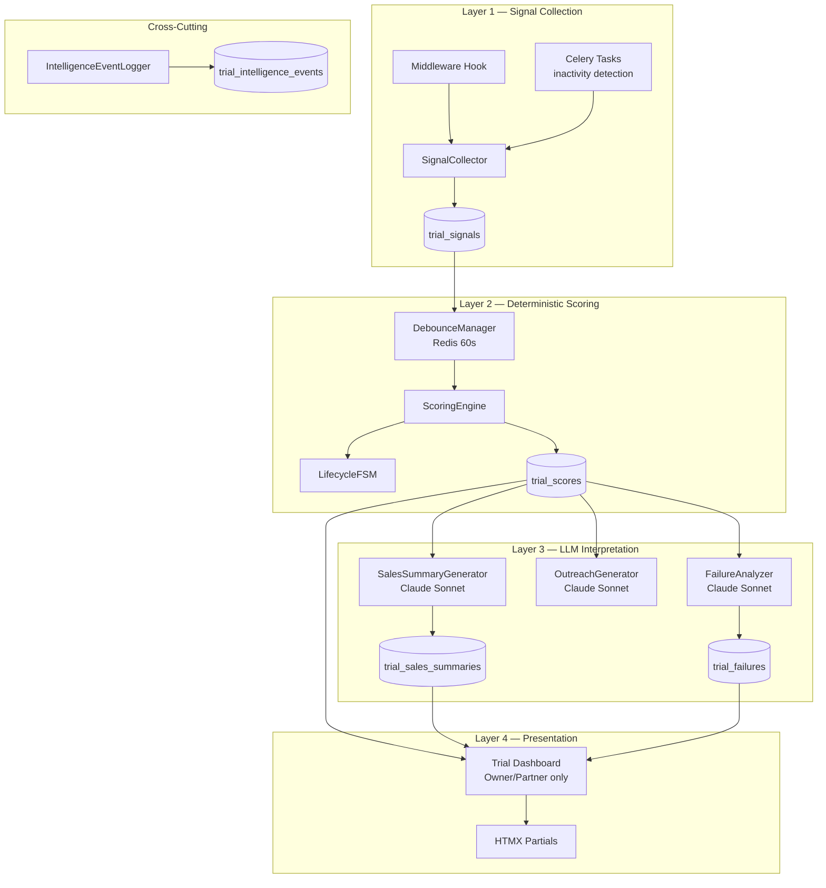

# Technical Design Document — Trial Conversion Intelligence

## Overview

Trial Conversion Intelligence is an internal sales operations layer that treats every trial account as a sales opportunity. The system continuously collects engagement signals, computes deterministic conversion scores, generates AI-powered sales briefings, and surfaces actionable intelligence on a unified dashboard for Owner/Partner roles.

**Key architectural principle:** Signals flow through a deterministic Scoring Engine to produce score snapshots. LLM interpretation (summaries, outreach drafts) operates only on score snapshots — the LLM does NOT compute scores. This ensures reproducibility, auditability, and separation of concerns.

**Key design decisions:**
1. Signal hooks are lightweight middleware injected into existing routes (no route refactoring)
2. Scoring is pure-functional: `f(signals) → scores` with no side effects or external calls
3. LLM interpretation is lazy (on-demand) and cached per score_id
4. Dashboard uses HTMX lazy-load partials for fast initial render
5. All timestamps in Asia/Jerusalem timezone context (matching existing system)

## Architecture

### System Layers



### Data Flow

1. **Signal Collection:** Middleware intercepts trial user HTTP requests (page views, actions). Celery Beat tasks detect async negative signals (72h inactivity, short sessions). All signals written to `trial_signals` table.

2. **Deterministic Scoring:** On new signal, DebounceManager checks if recomputation is needed (60s window). If yes, ScoringEngine reads all signals for the client, computes Conversion_Score, Priority_Score, and Opportunity_Value using weighted formulas. LifecycleFSM determines state transitions. Results stored as immutable snapshots in `trial_scores`.

3. **LLM Interpretation:** On-demand (user clicks "Generate Summary" or "Generate Outreach"), the system reads the latest score snapshot and passes it to Claude Sonnet via LiteLLM. Results are cached per score_id. FailureAnalyzer runs as a daily Celery task for newly expired trials.

4. **Presentation:** Dashboard queries `trial_scores` (latest per client), joins with client data, renders via Jinja2 + HTMX. Inline expansions load Score_Explanation. Summary/outreach generation triggered via HTMX POST with loading states.

### Integration Points

| Existing System | Integration |
|----------------|-------------|
| `Client` model | Read `plan_type`, `created_at`, `onboarding_completed_at`, `industry` |
| `ActivityEvent` model | Pattern reference for event logging (same JSONB metadata approach) |
| `trial_guard.py` | Reuse `TRIAL_DURATION_DAYS = 14` constant |
| `ai.py` service | Use `call_llm()` and `call_llm_json()` for all LLM calls |
| `permissions.py` | New `require_owner_or_partner` dependency for dashboard routes |
| `admin_base.html` | Extend for dashboard template (dark theme) |
| Redis | Debounce keys (`trial:debounce:{client_id}` TTL 60s) |
| Celery Beat | Inactivity detection (every 4h), expired classification (daily 02:00), cleanup (weekly) |
| `distributed_lock.py` | Redis locks for concurrent score computation prevention |

## Components and Interfaces

### 1. SignalCollector (`app/services/trial_signals.py`)

Responsible for recording all trial engagement signals. Lightweight — no computation, just storage.

```python
from datetime import datetime
from uuid import UUID
from enum import StrEnum
from sqlalchemy.orm import Session

class SignalCategory(StrEnum):
    engagement = "engagement"
    intent = "intent"
    value_realization = "value_realization"
    conversion = "conversion"
    negative = "negative"

class SignalCollector:
    """Records trial signals to the database. No scoring logic."""

    def __init__(self, db: Session):
        self.db = db

    def record_signal(
        self,
        client_id: UUID,
        signal_type: str,
        signal_category: SignalCategory,
        signal_value: dict | None = None,
    ) -> UUID:
        """Record a positive or neutral signal.

        Args:
            client_id: Trial client UUID
            signal_type: e.g. "page_view", "report_generated", "pricing_viewed"
            signal_category: One of 5 categories
            signal_value: Optional JSON payload (page URL, duration, etc.)

        Returns:
            UUID of created TrialSignal record

        Side effects:
            - Dispatches debounced recompute_trial_score task
        """
        ...

    def record_negative_signal(
        self,
        client_id: UUID,
        signal_type: str,
        metadata: dict | None = None,
    ) -> UUID:
        """Record a negative signal (detected by async Celery tasks).

        Negative signal types:
            - no_activity_72h
            - bounced_email
            - multiple_short_sessions
            - viewed_pricing_without_upgrade
            - onboarding_abandoned
            - removed_keywords
            - export_without_return
            - report_open_no_scroll

        Returns:
            UUID of created TrialSignal record
        """
        ...

    def get_signals(
        self,
        client_id: UUID,
        since: datetime | None = None,
    ) -> list["TrialSignal"]:
        """Get all signals for a client, optionally since a timestamp."""
        ...
```

**Middleware Hook** (`app/middleware/trial_signals.py`):

```python
from starlette.middleware.base import BaseHTTPMiddleware

class TrialSignalMiddleware(BaseHTTPMiddleware):
    """Intercepts requests from trial users and records signals.

    Route → Signal mapping:
        /portal/home → page_view (engagement)
        /portal/report → report_viewed (value_realization)
        /portal/epg → epg_viewed (engagement)
        /portal/avatars → avatars_viewed (engagement)
        /portal/strategy → strategy_viewed (value_realization)
        /admin/pricing, /onboard/upgrade → pricing_viewed (conversion)
        /portal/keywords → keywords_configured (intent)
        /portal/subreddits → subreddits_configured (intent)

    Only fires for plan_type="trial" clients. Skips static assets, API calls,
    and health checks. Debounces same-route signals to max 1 per 5 minutes.
    """
    ...
```

### 2. ScoringEngine (`app/services/trial_scoring.py`)

Pure deterministic scoring. No LLM calls, no external dependencies. Given signals, produces scores.

```python
from dataclasses import dataclass
from uuid import UUID
from sqlalchemy.orm import Session

@dataclass
class TrialScoreResult:
    conversion_score: int        # 0-100
    priority_score: int          # 0-100
    opportunity_value_cents: int # estimated annual value in cents
    recommended_action: str      # human-readable next step
    score_explanation: dict      # {positive: [...], negative: [...]}
    signal_snapshot: dict        # full signal state for reproducibility
    lifecycle_state: str         # current FSM state

@dataclass
class ScoreExplanation:
    top_positive: list[dict]  # [{signal_type, category, contribution, description}] max 5
    top_negative: list[dict]  # [{signal_type, category, penalty, description}] max 5
    category_scores: dict     # {engagement: 72, intent: 45, ...}

class ScoringEngine:
    """Deterministic scoring engine. Pure function of signals → scores."""

    def __init__(self, db: Session):
        self.db = db

    def compute_scores(self, client_id: UUID) -> TrialScoreResult:
        """Compute all scores for a trial client.

        Algorithm:
        1. Load all signals for client from trial_signals
        2. Compute category sub-scores (engagement, intent, value_realization, conversion)
        3. Apply negative signal penalties
        4. Compute Conversion_Score as weighted sum
        5. Compute Opportunity_Value from intent signals (company size, industry)
        6. Compute Priority_Score = f(conversion, value, urgency)
        7. Determine recommended_action from score + lifecycle + days_remaining
        8. Build score_explanation (top 5 positive + top 5 negative)
        9. Snapshot all signals for reproducibility
        10. Store result in trial_scores table

        Returns:
            TrialScoreResult with all computed values

        Determinism guarantee:
            Given the same signal_snapshot, this function ALWAYS produces
            the same scores. No randomness, no external state, no LLM.
        """
        ...

    def get_score_explanation(self, client_id: UUID) -> ScoreExplanation:
        """Get detailed explanation for the latest score.

        Returns top 5 positive and negative signal contributions with
        numeric values showing each signal's impact on the final score.
        """
        ...

    def get_recommended_action(
        self,
        score: int,
        days_remaining: int,
        lifecycle_state: str,
    ) -> str:
        """Determine the best next action based on current state.

        Decision matrix:
            score > 70 + days < 5 → "Schedule urgent call — high intent, expiring soon"
            score > 70 + days >= 5 → "Send value confirmation email — reinforce decision"
            score 40-70 + days < 5 → "Send case study + urgency message"
            score 40-70 + days >= 5 → "Share additional value proposition"
            score < 40 + at_risk → "Send re-engagement with question"
            score < 40 + engaged → "Identify and address blockers"
            expired → "Classify failure, evaluate reactivation"
        """
        ...
```

**Priority Score Formula:**

```
Priority_Score = 0.45 × Conversion_Score + 0.25 × Normalized_Value + 0.30 × Urgency

Where:
    Normalized_Value = min(100, Opportunity_Value_cents / 500_00)  # $500/yr = 100
    Urgency = max(0, (14 - days_remaining) / 14 × 100)
```

**Category Sub-Score Normalization (diminishing returns):**

```python
import math

def normalize_signal_count(count: int, category_max: int = 20) -> float:
    """Diminishing returns curve for signal counts.

    Uses log scale capped at 100:
        score = min(100, (log2(count + 1) / log2(category_max + 1)) * 100)

    Examples:
        1 signal  → 22 (log2(2)/log2(21)*100)
        3 signals → 46
        7 signals → 68
        15 signals → 92
        20+ signals → 100 (cap)
    """
    if count <= 0:
        return 0.0
    return min(100.0, (math.log2(count + 1) / math.log2(category_max + 1)) * 100)
```

### 3. LifecycleFSM (`app/services/trial_lifecycle.py`)

Finite state machine managing trial lifecycle transitions.

```python
from enum import StrEnum
from uuid import UUID
from sqlalchemy.orm import Session

class TrialLifecycleState(StrEnum):
    trial_started = "trial_started"
    onboarding_started = "onboarding_started"
    activated = "activated"
    engaged = "engaged"
    high_intent = "high_intent"
    at_risk = "at_risk"
    expired = "expired"
    converted = "converted"
    reactivated = "reactivated"

# Valid state transitions (from_state → set of valid to_states)
VALID_TRANSITIONS: dict[TrialLifecycleState, set[TrialLifecycleState]] = {
    TrialLifecycleState.trial_started: {
        TrialLifecycleState.onboarding_started,
        TrialLifecycleState.at_risk,
        TrialLifecycleState.expired,
    },
    TrialLifecycleState.onboarding_started: {
        TrialLifecycleState.activated,
        TrialLifecycleState.at_risk,
        TrialLifecycleState.expired,
    },
    TrialLifecycleState.activated: {
        TrialLifecycleState.engaged,
        TrialLifecycleState.at_risk,
        TrialLifecycleState.expired,
    },
    TrialLifecycleState.engaged: {
        TrialLifecycleState.high_intent,
        TrialLifecycleState.at_risk,
        TrialLifecycleState.expired,
    },
    TrialLifecycleState.high_intent: {
        TrialLifecycleState.converted,
        TrialLifecycleState.at_risk,
        TrialLifecycleState.expired,
    },
    TrialLifecycleState.at_risk: {
        TrialLifecycleState.engaged,        # re-engagement
        TrialLifecycleState.high_intent,    # sudden intent signal
        TrialLifecycleState.expired,
        TrialLifecycleState.converted,
    },
    TrialLifecycleState.expired: {
        TrialLifecycleState.reactivated,
        TrialLifecycleState.converted,      # late conversion
    },
    TrialLifecycleState.converted: set(),   # terminal
    TrialLifecycleState.reactivated: {
        TrialLifecycleState.engaged,
        TrialLifecycleState.high_intent,
        TrialLifecycleState.converted,
        TrialLifecycleState.expired,
    },
}

class LifecycleFSM:
    """Trial lifecycle state machine."""

    def __init__(self, db: Session):
        self.db = db

    def get_state(self, client_id: UUID) -> TrialLifecycleState:
        """Get current lifecycle state for a trial client.

        Reads from the latest trial_scores record. If no score exists,
        returns trial_started.
        """
        ...

    def transition(
        self,
        client_id: UUID,
        trigger_signal: str,
        current_signals: list["TrialSignal"] | None = None,
    ) -> TrialLifecycleState:
        """Attempt a state transition based on a trigger signal.

        Transition triggers:
            trial_started → onboarding_started: onboarding wizard opened
            onboarding_started → activated: onboarding_completed signal
            activated → engaged: 3+ value_realization signals
            engaged → high_intent: any conversion category signal
            any → at_risk: no_activity_72h OR negative signals dominate (>3 negatives)
            any → expired: days_elapsed > 14 (TRIAL_DURATION_DAYS)
            any → converted: plan_type changed from "trial"
            expired → reactivated: new login/activity after expiry

        Returns:
            New TrialLifecycleState after transition (or unchanged if invalid)

        Raises:
            Nothing — invalid transitions are silently ignored (logged).
        """
        ...

    def _determine_target_state(
        self,
        current_state: TrialLifecycleState,
        trigger_signal: str,
        signals: list["TrialSignal"],
        days_elapsed: int,
    ) -> TrialLifecycleState | None:
        """Internal: determine target state from trigger + context.

        Returns None if no transition should occur.
        """
        ...
```

### 4. SalesSummaryGenerator (`app/services/trial_sales_summary.py`)

LLM-powered sales briefing generator. Operates only on score snapshots.

```python
from dataclasses import dataclass
from uuid import UUID
from sqlalchemy.orm import Session

@dataclass
class SalesSummary:
    client_identity: str      # name, company, industry, domain
    activity_summary: str     # what user did during trial
    value_discovered: str     # reports generated, insights viewed
    problems_solved: str      # inferred from onboarding + usage
    likely_objections: str    # inferred from gaps + industry
    score_id: UUID            # which score snapshot this was generated from
    version: int              # incrementing version number

class SalesSummaryGenerator:
    """Generates AI sales summaries from score snapshots."""

    def __init__(self, db: Session):
        self.db = db

    def generate_summary(self, client_id: UUID, score_id: UUID) -> SalesSummary:
        """Generate a new sales summary for a trial client.

        Process:
        1. Load trial_scores record by score_id
        2. Load client profile (name, industry, domain)
        3. Build LLM prompt from signal_snapshot + client data
        4. Call Claude Sonnet via call_llm() with structured prompt
        5. Parse 5-section response
        6. Store in trial_sales_summaries table
        7. Log generated_summary intelligence event

        LLM Model: anthropic/claude-sonnet-4-20250514 (via ai.py call_llm)
        Max tokens: 2048
        Temperature: 0.4 (focused but not rigid)
        Timeout: 15s hard limit

        Returns:
            SalesSummary with all 5 sections populated

        Raises:
            TimeoutError: If LLM takes > 15s
            ValueError: If client has < 3 signals (insufficient data)
        """
        ...

    def get_cached_summary(self, client_id: UUID) -> SalesSummary | None:
        """Return cached summary if the underlying score_id hasn't changed.

        Cache invalidation: when latest trial_scores.id != cached score_id,
        the cache is stale and None is returned (caller should regenerate).
        """
        ...
```

**LLM Prompt Structure:**

```
System: You are a B2B sales intelligence analyst. Generate a structured sales
briefing for an internal sales team preparing to contact a trial user.
Be specific — cite exact actions and data points. Avoid generic statements.

User:
## Trial Account Profile
- Company: {client_name}
- Domain: {brand_domain}
- Industry: {industry}
- Signed up: {created_at}
- Days remaining: {days_remaining}
- Lifecycle state: {lifecycle_state}
- Conversion score: {conversion_score}/100

## Activity During Trial (from signal_snapshot)
{formatted_signals_by_category}

## Score Breakdown
{score_explanation_formatted}

## Generate 5 sections:
1. CLIENT IDENTITY — Who they are (1-2 sentences)
2. ACTIVITY SUMMARY — What they did (bullet points with specific data)
3. VALUE DISCOVERED — What value they found in the platform (specific reports, insights)
4. PROBLEMS BEING SOLVED — Why they signed up, what pain they have (inferred)
5. LIKELY OBJECTIONS — What might stop them from converting (inferred from gaps)
```

### 5. OutreachGenerator (`app/services/trial_outreach.py`)

Generates personalized outreach drafts. Anti-automation safeguards enforced.

```python
from dataclasses import dataclass
from uuid import UUID
from sqlalchemy.orm import Session

@dataclass
class OutreachDraft:
    draft_type: str       # "email" | "linkedin" | "followup" | "call_notes"
    subject: str | None   # email subject line (None for non-email)
    body: str             # draft content
    tone: str             # "urgency" | "curiosity" | "soft_reengagement"
    char_count: int       # for UI display

@dataclass
class OutreachDrafts:
    email: OutreachDraft          # max 1500 chars
    linkedin: OutreachDraft       # max 800 chars
    followup: OutreachDraft       # max 1000 chars
    call_notes: OutreachDraft     # max 2000 chars
    score_id: UUID                # which score snapshot generated these

class OutreachGenerator:
    """Generates personalized outreach drafts with anti-automation safeguards."""

    def __init__(self, db: Session):
        self.db = db

    def generate_outreach(self, client_id: UUID, score_id: UUID) -> OutreachDrafts:
        """Generate 4 outreach drafts for a trial client.

        Tone selection by Conversion_Score:
            > 70: "urgency" — value confirmation, deadline awareness
            40-70: "curiosity" — additional value, question-based
            < 40: "soft_reengagement" — gentle check-in, offer help

        Character limits (enforced via max_tokens):
            email: 1500 chars
            linkedin: 800 chars
            followup: 1000 chars
            call_notes: 2000 chars

        Anti-automation safeguards:
            - Drafts are NEVER sent automatically
            - Copy action logs intelligence event (copied_outreach)
            - No integration with email/LinkedIn APIs
            - Presented as editable text only

        LLM Model: anthropic/claude-sonnet-4-20250514
        Max tokens: 3000 (for all 4 drafts)
        Temperature: 0.6
        Timeout: 20s

        Returns:
            OutreachDrafts with all 4 draft types populated

        Raises:
            TimeoutError: If LLM takes > 20s
        """
        ...

    def log_copy_event(
        self,
        client_id: UUID,
        user_id: UUID,
        draft_type: str,
    ) -> None:
        """Record that a user copied an outreach draft.

        Creates a copied_outreach IntelligenceEvent with:
            - client_id
            - user_id (who copied)
            - draft_type (email/linkedin/followup/call_notes)
            - timestamp
        """
        ...
```

### 6. FailureAnalyzer (`app/services/trial_failure.py`)

Classifies expired trials and generates reactivation intelligence.

```python
from dataclasses import dataclass
from enum import StrEnum
from uuid import UUID
from sqlalchemy.orm import Session

class FailureCategory(StrEnum):
    no_engagement = "no_engagement"
    wrong_icp = "wrong_icp"
    budget_issue = "budget_issue"
    no_urgency = "no_urgency"
    no_value_discovered = "no_value_discovered"
    product_confusion = "product_confusion"
    unknown = "unknown"

@dataclass
class FailureClassification:
    category: FailureCategory
    confidence: float             # 0.0 - 1.0
    evidence: list[str]           # signals that led to classification

@dataclass
class ReactivationIntel:
    win_back_window_days: int     # estimated best time to re-engage
    next_best_action: str         # specific action
    confidence: float             # 0.0 - 1.0
    reasoning: str                # AI explanation

class FailureAnalyzer:
    """Classifies expired trials and generates reactivation intelligence."""

    def __init__(self, db: Session):
        self.db = db

    def classify_failure(self, client_id: UUID) -> FailureClassification:
        """Classify why a trial expired. Deterministic rules (priority order):

        Classification rules (checked in order, first match wins):
        1. no_engagement: fewer than 2 sessions total
        2. wrong_icp: free email domain (gmail/yahoo/hotmail) OR
           mismatched industry signals (no clear B2B intent)
        3. product_confusion: onboarding started but not completed OR
           completed but zero subsequent usage signals
        4. no_value_discovered: no reports generated, no opportunities reviewed,
           no strategic insights viewed
        5. no_urgency: good engagement but no conversion signals at all
           (never viewed pricing, never clicked upgrade)
        6. budget_issue: viewed pricing multiple times without upgrading,
           support contacted with budget-related keywords
        7. unknown: none of the above patterns match

        Returns:
            FailureClassification with category, confidence, evidence
        """
        ...

    def generate_reactivation_intel(
        self,
        client_id: UUID,
        failure: FailureClassification,
    ) -> ReactivationIntel:
        """Generate AI-powered reactivation intelligence.

        Uses Claude Sonnet to analyze the failure pattern and recommend:
        - When to re-engage (win_back_window_days)
        - What to say/do (next_best_action)
        - How confident we are (confidence)

        Win-back window heuristics:
            no_engagement → 30 days (let them forget the bad experience)
            wrong_icp → never (confidence 0.0)
            budget_issue → 60 days (budget cycle)
            no_urgency → 14 days (nudge with new features)
            no_value_discovered → 7 days (offer guided demo)
            product_confusion → 3 days (offer support call)

        LLM Model: anthropic/claude-sonnet-4-20250514
        Max tokens: 512
        Temperature: 0.3
        """
        ...
```

### 7. IntelligenceEventLogger (`app/services/trial_events.py`)

Audit trail for all trial intelligence interactions.

```python
from enum import StrEnum
from uuid import UUID
from sqlalchemy.orm import Session

class IntelligenceEventType(StrEnum):
    generated_summary = "generated_summary"
    generated_outreach = "generated_outreach"
    changed_score = "changed_score"
    opened_trial = "opened_trial"
    marked_contacted = "marked_contacted"
    scheduled_followup = "scheduled_followup"
    copied_outreach = "copied_outreach"

class IntelligenceEventLogger:
    """Logs all trial intelligence interactions for audit."""

    def __init__(self, db: Session):
        self.db = db

    def log_event(
        self,
        client_id: UUID,
        user_id: UUID,
        event_type: IntelligenceEventType,
        metadata: dict | None = None,
    ) -> UUID:
        """Record an intelligence event.

        Args:
            client_id: Trial client being acted upon
            user_id: Owner/Partner performing the action
            event_type: One of 7 event types
            metadata: Optional JSON payload (old_score, new_score, draft_type, etc.)

        Returns:
            UUID of created TrialIntelligenceEvent record
        """
        ...

    def get_events(
        self,
        client_id: UUID,
        limit: int = 20,
    ) -> list["TrialIntelligenceEvent"]:
        """Get recent intelligence events for a trial client."""
        ...
```

### 8. DebounceManager (`app/services/trial_debounce.py`)

Redis-based debouncing to prevent score recomputation storms.

```python
from uuid import UUID
import redis

class DebounceManager:
    """Redis-based debounce for trial score recomputation.

    Key pattern: trial:debounce:{client_id}
    TTL: 60 seconds

    Behavior:
    - First signal in window: SET key, dispatch recompute task
    - Subsequent signals in 60s window: skip (key exists)
    - After TTL expires: next signal triggers new recompute
    """

    def __init__(self, redis_client: redis.Redis):
        self.redis = redis_client
        self.ttl = 60  # seconds

    def should_recompute(self, client_id: UUID) -> bool:
        """Check if scoring should be triggered for this client.

        Returns True if no debounce key exists (first signal in window).
        Returns False if key exists (already pending recompute).
        """
        key = f"trial:debounce:{client_id}"
        # SET NX returns True if key was set (no existing key)
        return bool(self.redis.set(key, "1", nx=True, ex=self.ttl))

    def mark_pending(self, client_id: UUID) -> None:
        """Explicitly mark a client as pending recomputation.

        Used when dispatching the Celery task to ensure no duplicate dispatch.
        """
        key = f"trial:debounce:{client_id}"
        self.redis.set(key, "1", ex=self.ttl)

    def clear(self, client_id: UUID) -> None:
        """Clear debounce after recomputation completes.

        Called at the end of recompute_trial_score task.
        """
        key = f"trial:debounce:{client_id}"
        self.redis.delete(key)
```

## Data Models

### TrialSignal (`app/models/trial_signal.py`)

| Column | Type | Constraints |
|--------|------|-------------|
| id | UUID | PK, default uuid4 |
| client_id | UUID | FK → clients.id, NOT NULL, indexed |
| signal_type | VARCHAR(50) | NOT NULL |
| signal_category | VARCHAR(30) | NOT NULL (engagement/intent/value_realization/conversion/negative) |
| signal_value | JSONB | nullable |
| created_at | TIMESTAMPTZ | NOT NULL, default now(), indexed |

**Indexes:** `(client_id, created_at)` composite, `(client_id, signal_category)` composite

### TrialScore (`app/models/trial_score.py`)

| Column | Type | Constraints |
|--------|------|-------------|
| id | UUID | PK, default uuid4 |
| client_id | UUID | FK → clients.id, NOT NULL, indexed |
| conversion_score | INTEGER | NOT NULL, CHECK (0-100) |
| priority_score | INTEGER | NOT NULL, CHECK (0-100) |
| opportunity_value_cents | INTEGER | NOT NULL, CHECK (>= 0) |
| recommended_action | TEXT | NOT NULL |
| score_explanation | JSONB | NOT NULL |
| signal_snapshot | JSONB | NOT NULL |
| lifecycle_state | VARCHAR(20) | NOT NULL |
| scored_at | TIMESTAMPTZ | NOT NULL, default now() |

**Indexes:** `(client_id, scored_at DESC)`

### TrialFailure (`app/models/trial_failure.py`)

| Column | Type | Constraints |
|--------|------|-------------|
| id | UUID | PK, default uuid4 |
| client_id | UUID | FK → clients.id, NOT NULL, UNIQUE |
| failure_category | VARCHAR(30) | NOT NULL |
| ai_analysis | TEXT | nullable |
| ai_analysis_status | VARCHAR(10) | NOT NULL, default "pending" |
| reactivation_recommended | BOOLEAN | default false |
| win_back_window_days | INTEGER | nullable |
| next_best_action | TEXT | nullable |
| reactivation_confidence | FLOAT | nullable |
| classified_at | TIMESTAMPTZ | NOT NULL, default now() |

### TrialSalesSummary (`app/models/trial_sales_summary.py`)

| Column | Type | Constraints |
|--------|------|-------------|
| id | UUID | PK, default uuid4 |
| client_id | UUID | FK → clients.id, NOT NULL |
| score_id | UUID | FK → trial_scores.id, NOT NULL |
| sales_summary_version | INTEGER | NOT NULL, default 1 |
| content | TEXT | NOT NULL |
| cached_until | TIMESTAMPTZ | NOT NULL |
| generated_at | TIMESTAMPTZ | NOT NULL, default now() |

### TrialIntelligenceEvent (`app/models/trial_intelligence_event.py`)

| Column | Type | Constraints |
|--------|------|-------------|
| id | UUID | PK, default uuid4 |
| client_id | UUID | FK → clients.id, NOT NULL |
| user_id | UUID | FK → users.id, NOT NULL |
| event_type | VARCHAR(30) | NOT NULL |
| event_metadata | JSONB | nullable |
| created_at | TIMESTAMPTZ | NOT NULL, default now() |

**Index:** `(client_id, created_at DESC)`

## Correctness Properties

### Property 1: Deterministic reproducibility

For all signal snapshots S, calling `ScoringEngine.compute(S)` twice produces identical `(conversion_score, priority_score, opportunity_value)`.

**Validates: Requirements 11.1, 11.4**

### Property 2: Score range validity

For all inputs, `0 <= conversion_score <= 100` AND `0 <= priority_score <= 100` AND `opportunity_value_cents >= 0`.

**Validates: Requirements 2.1, 2.2, 2.3**

### Property 3: Negative signals decrease score

For all signal sets S where adding a Negative_Signal N produces S', `compute(S').conversion_score <= compute(S).conversion_score`.

**Validates: Requirements 2.11**

### Property 4: Lifecycle state exclusivity

For all Trial_Accounts at any point in time, exactly one Trial_Lifecycle_State is assigned.

**Validates: Requirements 3.1**

### Property 5: Debounce prevents burst recomputation

For N signals recorded within 60s for a client, at most 1 recompute task is dispatched.

**Validates: Requirements 2.6**

### Property 6: Cache coherence

For all Sales Summary requests: if `latest_score_id == cached_score_id` then cached content is returned; else regeneration occurs.

**Validates: Requirements 5.7, 5.8**

### Property 7: Access control completeness

For all users U where U.role not in {owner, partner}, all trial intelligence endpoints return HTTP 403.

**Validates: Requirements 9.1, 9.2, 9.3**

### Property 8: Audit completeness

For all user interactions (generate, copy, view, mark, schedule), exactly one Intelligence_Event is created.

**Validates: Requirements 10.1, 10.2, 10.3, 10.4, 10.5, 10.6, 10.7**

### Property 9: Score explanation structure

For all score computations, `score_explanation` contains exactly top 5 positive and top 5 negative signals with numeric values.

**Validates: Requirements 2.10**

### Property 10: Priority score monotonicity

For two trials A and B: if A.conversion_score > B.conversion_score AND A.opportunity_value >= B.opportunity_value AND A.days_remaining <= B.days_remaining, then A.priority_score >= B.priority_score.

**Validates: Requirements 2.3**

### Property 11: Forward-skip lifecycle validity

For all lifecycle transitions, the new state is always >= current state in priority order (except at_risk which can override any active state, and reactivated which can only follow expired).

**Validates: Requirements 3.2-3.10**

## Error Handling

| Error | Source | Handling |
|-------|--------|----------|
| DB write failure on signal | SignalCollector | Log ERROR, retry once (2s delay), discard on second failure |
| Redis unavailable (debounce) | DebounceManager | Fallback: always trigger recompute (no debounce) |
| LLM timeout (>15s summary) | SalesSummaryGenerator | Return error to UI, do NOT cache failed result |
| LLM timeout (>20s outreach) | OutreachGenerator | Return error to UI with retry button |
| LLM timeout (>30s failure) | FailureAnalyzer | Store classification without AI analysis, mark status "failed" |
| Score computation exception | ScoringEngine | Log ERROR, return previous score (stale), emit alert |
| Concurrent score recompute | Celery task | Redis distributed lock per client_id (5s TTL) |
| 403 access denied | RBAC guard | Return 403 page, log to AuditLog |
| Missing client data | Scoring/LLM | Graceful degradation (score=0 if no signals, "insufficient data" for LLM) |
| Lifecycle state conflict | FSM | Highest-priority state wins (see priority table) |
| Signal dedup conflict | SignalCollector | Silently discard duplicate (60s window) |

## Testing Strategy

### Unit Tests
- ScoringEngine: pure function tests with known signal sets → expected scores
- LifecycleFSM: transition tests for all 9 states + forward-skip + at_risk override
- FailureAnalyzer: classification logic with signal patterns per category
- DebounceManager: Redis mock tests for should_recompute logic

### Property-Based Tests (Hypothesis)
- Score determinism (same input → same output)
- Score range (always 0-100)
- Negative signal penalty (adding negatives never increases score)
- Priority monotonicity (higher inputs → higher priority)
- Lifecycle exclusivity (exactly one state)
- Forward-skip validity (new state >= current in priority)

### Integration Tests
- Signal collection → score recompute → dashboard display (end-to-end)
- LLM cache: generate → retrieve cached → score change → regenerate
- RBAC: verify 403 for all non-owner/partner roles
- Celery task dispatch and debounce behavior
- Lifecycle non-linear paths (trial_started → high_intent skip)

### Performance Targets
- Score recompute: < 100ms (pure computation, no external calls)
- Dashboard load: < 500ms (10 active trials)
- LLM summary generation: < 15s (hard timeout)
- LLM outreach generation: < 20s (hard timeout)
- Signal recording: < 10ms (fire-and-forget pattern)

## Lifecycle FSM — Edge Cases & Non-Linear Paths

### Forward-Skip Rule

The lifecycle state always reflects the **highest engagement level** reached. A trial user can skip intermediate states entirely.

**Rule:** Any signal that qualifies for a higher state triggers an immediate transition, regardless of current state.

Examples:
- User in `trial_started` clicks pricing → jumps directly to `high_intent` (skips onboarding_started, activated, engaged)
- User in `onboarding_started` generates a landscape report → jumps to `engaged` (skips activated)
- User in `trial_started` contacts support about upgrade → jumps to `high_intent`

**Rationale:** For sales intelligence, we care about the *real* behavior signal, not the formal funnel position. A user who skips to pricing on day 1 is a hotter lead than one who methodically completes onboarding but never looks at pricing.

### No Backward Transitions (except at_risk)

States never regress. Once `high_intent` is reached, the user stays there even if they stop clicking.

**Exception:** `at_risk` can override any active state (trial_started through high_intent) when:
- No activity for 72+ hours, OR
- 3+ negative signals accumulated without any positive signal in between

**at_risk is recoverable:** Any new positive signal from an `at_risk` user transitions them to the highest state their signal history qualifies for (re-evaluation).

### Terminal States

These states are final — no transitions out:
- `expired` — only transitions to `reactivated` (if user returns after expiry)
- `converted` — permanent (user is now a paying client)

### Concurrency & Race Conditions

Multiple signals can arrive simultaneously (e.g., user opens pricing AND clicks upgrade CTA in the same session). Resolution:

1. All signals within 60s debounce window are collected as a batch
2. Lifecycle FSM evaluates the *full batch* against transition rules
3. The highest qualifying state wins
4. Single atomic write to `trial_scores.lifecycle_state`

### State Evaluation Priority Order

When multiple transitions are valid from the same signal batch, apply in this order (highest priority first):

| Priority | Target State | Trigger |
|----------|-------------|---------|
| 1 | `converted` | plan_type changed from "trial" |
| 2 | `expired` | 14 days elapsed, plan_type still "trial" |
| 3 | `at_risk` | 72h inactivity OR 3+ unresolved negatives |
| 4 | `high_intent` | pricing_viewed OR upgrade_cta OR support_contacted |
| 5 | `engaged` | report_viewed OR discovery_run OR 5+ keywords configured |
| 6 | `activated` | onboarding_completed AND valid config |
| 7 | `onboarding_started` | onboarding wizard step 1+ started |
| 8 | `reactivated` | new activity after expired state |
| 9 | `trial_started` | initial signup (default) |

### Edge Cases — Exhaustive

| Scenario | Current State | Event | New State | Rationale |
|----------|--------------|-------|-----------|-----------|
| User signs up, does nothing for 3 days | trial_started | 72h timer | at_risk | Inactivity penalty |
| User signs up, immediately clicks pricing | trial_started | pricing_page_viewed | high_intent | Forward-skip, strong buying signal |
| User in onboarding, abandons, returns day 10 | at_risk | login + page_view | onboarding_started (re-eval) | Recovery from at_risk based on signal history |
| User completes onboarding, never returns | activated | 72h timer | at_risk | Configuration without usage = risk |
| User engaged, views pricing, goes silent 4 days | high_intent | 72h timer | at_risk | Even high_intent decays to at_risk on silence |
| User at_risk, returns and generates report | at_risk | report_generated | engaged (or higher) | Re-evaluation against full signal history |
| User trial expires on day 14 | any active state | 14d timer | expired | Terminal, overrides all |
| Expired user logs in on day 20 | expired | login | reactivated | Only transition out of expired |
| User converts on day 3 | any | plan_type change | converted | Terminal, immediate |
| User starts onboarding, abandons, support emails them, they click pricing link | at_risk | pricing_page_viewed | high_intent | External re-engagement works |
| User completes onboarding in 2 minutes flat | trial_started | onboarding_completed | activated | Normal linear path |
| User skips onboarding entirely, goes straight to discovery | trial_started | discovery_run | engaged | Forward-skip past onboarding |
| User repeatedly views pricing but never upgrades | high_intent | viewed_pricing_without_upgrade (negative) | high_intent (score drops) | State stays, score decreases |
| Two users from same company sign up | independent | independent signals | independent states | Each trial_account scored separately |
| User's trial expires while at high_intent | high_intent | 14d timer | expired | Expiry is absolute |
| Admin manually converts user mid-trial | any | plan_type → "starter" | converted | Terminal |

### Signals That Do NOT Trigger State Transitions

These signals contribute to scoring but do not change lifecycle state:
- `report_open_no_scroll` — negative, affects score only
- `multiple_short_sessions` — negative, affects score only (unless triggers at_risk via accumulation)
- `bounced_email` — negative, affects score and failure classification
- `export_without_return` — negative, affects score only
- Intent signals (email domain, company size) — static attributes, affect score at first recording

### Trial User Experience Gaps — Proactive Coverage

| Gap | System Response |
|-----|----------------|
| User signs up but never logs in again | `no_activity_72h` at +72h → at_risk → "Send welcome email" |
| User completes onboarding but system has no avatar (execution gap) | `onboarding_completed` → score notes "activated but zero output" → Action: "Assign avatar manually" |
| User generates reports but doesn't understand next steps | report_viewed but stagnant → Action: "Schedule walkthrough call" |
| User active days 1-3, then disappears | at_risk at day 6 → Priority increases (urgency) → "Send reactivation nudge" |
| User does everything right but trial expires (no budget) | high_intent → expired → failure: "budget_issue" → reactivation in 60 days |
| Free email domain but high engagement | Intent penalty → but Engagement/Value compensate → net score reflects real interest |
| User opens wizard 5 times without completing | multiple_short_sessions + onboarding_abandoned → at_risk → "Offer guided setup call" |
| User exports data on day 13 | export_without_return negative → captured in failure analysis |
| Converted user wants trial retrospective | converted state preserves signals 180 days → Owner reviews for upsell |
| Competing companies both on trial | Data isolation guaranteed, independent scoring |
