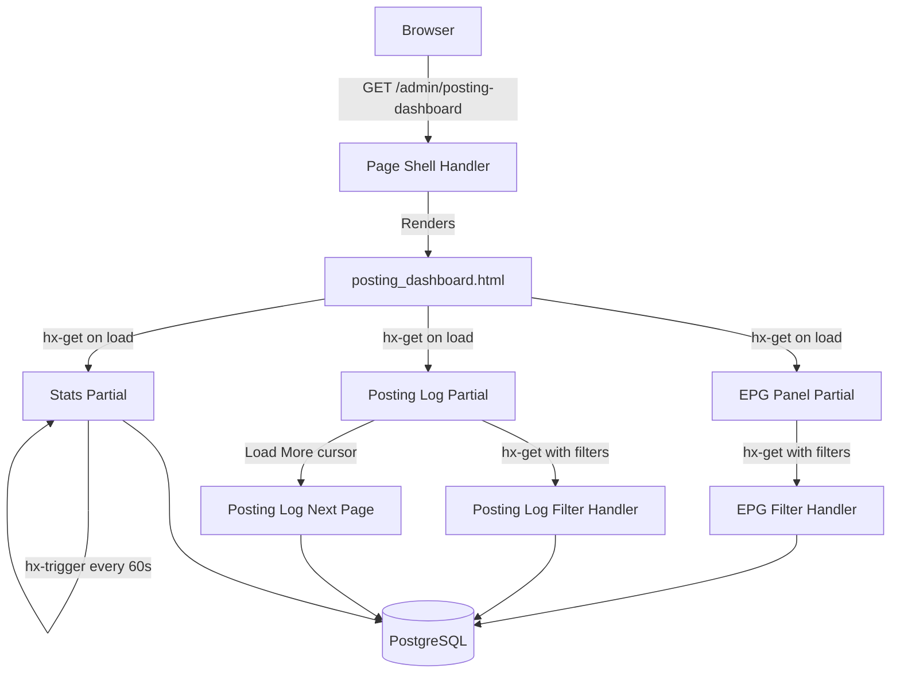

# Design Document: Unified Posting Dashboard

## Overview

The Unified Posting Dashboard consolidates EPG status and posting audit logs across all avatars into a single operational view at `/admin/posting-dashboard`. It replaces the current workflow of opening individual avatar tabs to check posting status.

The page uses the existing admin panel architecture: dark theme (`admin_base.html`), HTMX lazy-loaded partials, and Tailwind CSS. It's accessible only to platform admin roles (owner, partner, avatar_manager) via `require_platform_admin` dependency.

**Key design decisions:**
- **Page shell + lazy partials** — initial page renders instantly, then HTMX loads EPG panel and posting log asynchronously (same pattern as topology panel)
- **Cursor-based pagination** for posting log — avoids OFFSET performance degradation on large tables
- **Server-side filtering** — all filters hit dedicated HTMX endpoints returning partial HTML; no client-side JS filtering
- **Timezone handling** — all datetime display uses `Asia/Jerusalem` via Python `zoneinfo`, not database-level timezone conversion

## Architecture



The dashboard is a single new route module (`app/routes/posting_dashboard.py`) with its own router, registered in `main.py`. This avoids bloating the already-massive `admin.py` (7900+ lines).

## Components and Interfaces

### Route Module: `app/routes/posting_dashboard.py`

```python
router = APIRouter(prefix="/admin/posting-dashboard", tags=["posting-dashboard"])
```

**Endpoints:**

| Method | Path | Purpose | Response |
|--------|------|---------|----------|
| GET | `/admin/posting-dashboard` | Page shell (no data) | Full HTML page |
| GET | `/admin/posting-dashboard/stats` | Summary statistics | HTMX partial |
| GET | `/admin/posting-dashboard/epg-panel` | EPG status panel (filterable) | HTMX partial |
| GET | `/admin/posting-dashboard/posting-log` | Posting log (filterable, paginated) | HTMX partial |

All endpoints use `Depends(require_platform_admin)` for RBAC.

### Endpoint 1: Page Shell

```python
@router.get("", response_class=HTMLResponse)
def posting_dashboard_page(
    request: Request,
    current_user: User = Depends(require_platform_admin),
):
    return templates.TemplateResponse(
        "admin_posting_dashboard.html",
        {"request": request, "current_user": current_user},
    )
```

Returns the page skeleton with `hx-get` triggers for lazy-loading each panel.

### Endpoint 2: Stats Partial

```python
@router.get("/stats", response_class=HTMLResponse)
def posting_dashboard_stats(
    request: Request,
    db: Session = Depends(get_db),
    current_user: User = Depends(require_platform_admin),
):
```

**Query parameters:** None (always computes for "today" in Asia/Jerusalem).

**Returns:** HTMX partial with summary cards.

**Data shape:**
```python
@dataclass
class DashboardStats:
    avatars_with_epg: int        # COUNT(DISTINCT avatar_id) from epg_slots WHERE plan_date = today
    total_slots: int             # COUNT(*) from epg_slots WHERE plan_date = today
    posts_completed: int         # COUNT(*) from posting_events WHERE outcome='success' AND posted_at in today
    failures_today: int          # COUNT(*) from posting_events WHERE outcome='failure' AND posted_at in today
    success_rate_pct: float      # posts_completed / (posts_completed + failures_today) * 100
```

### Endpoint 3: EPG Panel

```python
@router.get("/epg-panel", response_class=HTMLResponse)
def posting_dashboard_epg_panel(
    request: Request,
    db: Session = Depends(get_db),
    current_user: User = Depends(require_platform_admin),
    plan_date: date | None = None,       # defaults to today (Asia/Jerusalem)
    status_filter: str = "all",           # all|planned|generated|approved|posted|skipped
    avatar_search: str = "",              # substring match on reddit_username
):
```

**Data shape per row:**
```python
@dataclass
class EPGSlotRow:
    id: uuid.UUID
    avatar_username: str
    slot_type: str                # hobby | professional
    subreddit: str | None
    thread_title_truncated: str   # max 60 chars
    scheduled_at_display: str     # formatted Asia/Jerusalem
    status: str
    status_color: str             # gray|blue|yellow|green|red
    approver_username: str | None # from draft.approved_by or "—"
    approval_time_display: str | None
```

**Grouping:** Results are grouped by `avatar_id` in Python after query. Each group has:
```python
@dataclass
class EPGAvatarGroup:
    avatar_id: uuid.UUID
    reddit_username: str
    slots: list[EPGSlotRow]
```

**Summary bar:** Computed from the full (unfiltered by avatar_search, but filtered by date + status_filter) query:
```python
@dataclass
class EPGSummary:
    planned: int
    generated: int
    approved: int
    posted: int
    skipped: int
```

### Endpoint 4: Posting Log

```python
@router.get("/posting-log", response_class=HTMLResponse)
def posting_dashboard_posting_log(
    request: Request,
    db: Session = Depends(get_db),
    current_user: User = Depends(require_platform_admin),
    outcome_filter: str = "all",          # all|success|failure|skipped
    avatar_search: str = "",              # substring match
    date_from: date | None = None,        # date range start
    date_to: date | None = None,          # date range end
    cursor: str | None = None,            # ISO timestamp cursor for pagination
):
```

**Cursor-based pagination:** Uses `posted_at` as the cursor column. The cursor value is the `posted_at` ISO timestamp of the last item on the current page. Next page query: `WHERE posted_at < cursor_value ORDER BY posted_at DESC LIMIT 51` (fetch 51 to detect if more pages exist).

**Data shape per row:**
```python
@dataclass
class PostingLogRow:
    id: uuid.UUID
    avatar_username: str
    outcome: str                    # success|failure|skipped
    outcome_color: str              # green|red|gray
    posted_at_display: str          # formatted Asia/Jerusalem
    duration_ms: int | None
    subreddit: str | None           # from linked EPG slot
    reddit_comment_url: str | None  # clickable link
    error_message: str | None       # shown on hover for failures
```

## Data Models

No new database models are required. The dashboard reads from existing models:

- **EPGSlot** — primary data source for EPG panel
- **PostingEvent** — primary data source for posting log
- **Avatar** — joined for `reddit_username`
- **CommentDraft** — joined (via EPGSlot.draft_id) for approval attribution

### Database Queries

**EPG Panel Query:**
```sql
SELECT es.*, a.reddit_username, cd.status as draft_status
FROM epg_slots es
JOIN avatars a ON a.id = es.avatar_id
LEFT JOIN comment_drafts cd ON cd.id = es.draft_id
WHERE es.plan_date = :plan_date
  AND (:status_filter = 'all' OR es.status = :status_filter)
  AND (:avatar_search = '' OR LOWER(a.reddit_username) LIKE LOWER(:avatar_search_pattern))
ORDER BY a.reddit_username, es.scheduled_at
```

Uses existing index: `ix_epg_slots_avatar_date` (avatar_id, plan_date).

**Posting Log Query:**
```sql
SELECT pe.*, a.reddit_username, es.subreddit
FROM posting_events pe
JOIN avatars a ON a.id = pe.avatar_id
LEFT JOIN epg_slots es ON es.id = pe.epg_slot_id
WHERE (:outcome_filter = 'all' OR pe.outcome = :outcome_filter)
  AND (:avatar_search = '' OR LOWER(a.reddit_username) LIKE LOWER(:avatar_search_pattern))
  AND (:date_from IS NULL OR pe.posted_at >= :date_from_tz)
  AND (:date_to IS NULL OR pe.posted_at < :date_to_tz + interval '1 day')
  AND (:cursor IS NULL OR pe.posted_at < :cursor)
ORDER BY pe.posted_at DESC
LIMIT 51
```

**Stats Query:**
```sql
-- EPG stats (single query with conditional aggregation)
SELECT
  COUNT(DISTINCT avatar_id) as avatars_with_epg,
  COUNT(*) as total_slots,
  COUNT(*) FILTER (WHERE status = 'posted') as posts_completed
FROM epg_slots
WHERE plan_date = :today;

-- Posting events stats
SELECT
  COUNT(*) FILTER (WHERE outcome = 'success') as successes,
  COUNT(*) FILTER (WHERE outcome = 'failure') as failures
FROM posting_events
WHERE posted_at >= :today_start AND posted_at < :tomorrow_start;
```

### New Index Required

```sql
CREATE INDEX ix_posting_events_posted_at ON posting_events (posted_at DESC);
CREATE INDEX ix_posting_events_avatar_posted ON posting_events (avatar_id, posted_at DESC);
```

The existing `ix_epg_slots_avatar_date` covers EPG queries. The posting log needs a `posted_at DESC` index for efficient cursor pagination and the avatar+posted_at composite for filtered queries.

### Approval Attribution Strategy

The `CommentDraft` model doesn't have an explicit `approved_by` field. Approval attribution will be sourced from the `AuditLog` table:

```sql
SELECT al.user_id, u.email
FROM audit_logs al
JOIN users u ON u.id = al.user_id
WHERE al.entity_type = 'comment_draft'
  AND al.entity_id = :draft_id
  AND al.action IN ('approve_draft', 'approve', 'set_status_approved')
ORDER BY al.created_at DESC
LIMIT 1;
```

This is loaded in a batch for all displayed EPG slots (single query with `entity_id IN (...)`) to avoid N+1.

## Correctness Properties

*A property is a characteristic or behavior that should hold true across all valid executions of a system — essentially, a formal statement about what the system should do. Properties serve as the bridge between human-readable specifications and machine-verifiable correctness guarantees.*

### Property 1: RBAC Access Control

*For any* user and role combination, the dashboard endpoint returns HTTP 200 if and only if the user's role is in {owner, partner, avatar_manager}; otherwise it returns HTTP 403.

**Validates: Requirements 1.3, 1.4, 1.5, 1.6**

### Property 2: Date Filter Correctness

*For any* set of EPG slots spanning multiple dates and any selected date, the EPG panel query returns only slots whose `plan_date` equals the selected date, and returns all such slots.

**Validates: Requirements 2.1, 2.10**

### Property 3: Avatar Grouping Integrity

*For any* set of EPG slots returned by the query, grouping by avatar produces groups where every slot within a group belongs to the stated avatar, and no slot appears in more than one group.

**Validates: Requirements 2.2**

### Property 4: Status Summary Accuracy

*For any* set of EPG slots for a given date, the sum of per-status counts (planned + generated + approved + posted + skipped) equals the total number of slots, and each individual count matches the actual number of records with that status.

**Validates: Requirements 2.9**

### Property 5: Status Filter Correctness

*For any* valid status filter value and set of EPG slots, the filtered result contains only slots matching the filter status (or all slots if filter is "all"), and contains all matching slots.

**Validates: Requirements 3.1, 3.2**

### Property 6: Avatar Substring Filter Correctness

*For any* search substring and set of records (EPG slots or posting events), the filtered result contains only records belonging to avatars whose `reddit_username` contains the search string (case-insensitive), and contains all such matching records.

**Validates: Requirements 3.3, 5.3**

### Property 7: Posting Log Ordering and Cursor Pagination

*For any* set of posting events and any valid cursor timestamp, the returned page contains events strictly older than the cursor, in descending `posted_at` order, limited to 50 items, and the next cursor (if present) equals the `posted_at` of the last returned item.

**Validates: Requirements 4.1, 4.7, 8.3**

### Property 8: Outcome Filter Correctness

*For any* valid outcome filter value and set of posting events, the filtered result contains only events matching the filter outcome (or all events if filter is "all").

**Validates: Requirements 5.1, 5.2**

### Property 9: Date Range Filter Correctness

*For any* date range [start, end] and set of posting events, the filtered result contains only events whose `posted_at` falls within the range, and contains all such events.

**Validates: Requirements 5.4**

### Property 10: Statistics Aggregation Correctness

*For any* set of today's EPG slots and posting events, the computed statistics satisfy: `avatars_with_epg` equals the number of distinct avatar_ids in today's slots, `total_slots` equals the count of today's slots, `posts_completed` equals the count of events with outcome "success" today, `failures_today` equals the count of events with outcome "failure" today, and `success_rate_pct` equals `posts_completed / (posts_completed + failures_today) * 100` (or 0 if denominator is 0).

**Validates: Requirements 7.1, 7.2**

### Property 11: Timezone Display Consistency

*For any* UTC datetime value, formatting it for display on the dashboard produces a string representing the equivalent time in Asia/Jerusalem timezone (UTC+2 or UTC+3 depending on DST).

**Validates: Requirements 6.2, 7.2**

## Error Handling

| Scenario | Handling |
|----------|----------|
| No EPG slots for selected date | Show empty state: "No EPG slots for this date" |
| No posting events | Show empty state: "No posting events recorded" |
| Database timeout on large queries | SQLAlchemy query timeout (30s), return 500 with friendly error partial |
| Invalid date parameter | Default to today (Asia/Jerusalem) |
| Invalid filter value | Default to "all" |
| Missing avatar relationship (orphan records) | Display "Unknown" for avatar username |
| No audit log for approval | Display "—" in approver column |
| Stats computation division by zero | Return 0% success rate |

## Testing Strategy

### Property-Based Tests (fast-check via Hypothesis)

The feature is suitable for PBT because the core logic involves filtering, sorting, grouping, and aggregating data — all pure functions operating on varying inputs.

**Library:** `hypothesis` (already used in the project per existing tests)
**Minimum iterations:** 100 per property
**Tag format:** `Feature: unified-posting-dashboard, Property N: <text>`

Property tests will focus on the service/query layer functions:
- `filter_epg_slots(slots, plan_date, status_filter, avatar_search)` — pure filtering logic
- `group_epg_by_avatar(slots)` — pure grouping logic
- `compute_epg_summary(slots)` — pure aggregation
- `compute_dashboard_stats(epg_slots, posting_events)` — pure aggregation
- `paginate_posting_log(events, cursor, limit)` — pure pagination logic
- `format_datetime_jerusalem(dt)` — pure timezone conversion

### Unit Tests (Example-Based)

- Status badge color mapping (5 cases)
- Outcome badge color mapping (3 cases)
- Thread title truncation (exact boundary: 59, 60, 61 chars)
- Empty state rendering
- RBAC: unauthenticated → redirect, each denied role → 403
- Approval attribution fallback to "—"
- Cursor pagination: first page (no cursor), last page (< 50 results, no Load More)

### Integration Tests

- Full endpoint response with seeded data (verify HTML structure)
- Sidebar navigation visibility per role
- HTMX partial headers (HX-Request handling)
- Performance: 100 avatars × 10 slots each = 1000 rows renders < 2s

### Performance Considerations (100+ Avatars)

1. **EPG Panel (1000+ slots/day):** Single query with JOIN, uses composite index `ix_epg_slots_avatar_date`. Grouping done in Python (O(n) with defaultdict). Template renders grouped sections — no nested DB queries.

2. **Posting Log:** Cursor-based pagination avoids `OFFSET` degradation. New `ix_posting_events_posted_at` index supports the ORDER BY + WHERE filter efficiently.

3. **Approval Attribution (batch):** Single query with `entity_id IN (...)` for all displayed draft IDs. Cached in a dict for O(1) lookup during template rendering.

4. **Stats:** Two simple aggregate queries (one on `epg_slots`, one on `posting_events`). Both use date-filtered scans on indexed columns.

5. **Lazy loading:** Page shell renders in < 50ms. Three panels load in parallel via HTMX. User sees the page structure immediately while data loads.

6. **Auto-refresh (stats only):** Only the stats partial (lightweight aggregate query) refreshes every 60s. EPG and posting log do NOT auto-refresh — only on user interaction.

## Template Structure

```
templates/
├── admin_posting_dashboard.html          # Page shell (extends admin_base.html)
└── partials/
    ├── posting_dashboard_stats.html      # Summary statistics cards
    ├── posting_dashboard_epg_panel.html  # EPG panel with filters + grouped table
    └── posting_dashboard_posting_log.html # Posting log with filters + paginated table
```

### Page Shell (`admin_posting_dashboard.html`)

```html

Posting Dashboard

<div class="space-y-6">
  <!-- Stats: lazy-loaded, auto-refreshes -->
  <div hx-get="/admin/posting-dashboard/stats" 
       hx-trigger="load, every 60s" 
       hx-swap="innerHTML">
    <!-- skeleton loader -->
  </div>

  <!-- EPG Panel: lazy-loaded -->
  <div hx-get="/admin/posting-dashboard/epg-panel" 
       hx-trigger="load" 
       hx-swap="innerHTML">
    <!-- skeleton loader -->
  </div>

  <!-- Posting Log: lazy-loaded -->
  <div hx-get="/admin/posting-dashboard/posting-log" 
       hx-trigger="load" 
       hx-swap="innerHTML">
    <!-- skeleton loader -->
  </div>
</div>

```

### Filter Interaction Pattern

Filters use `hx-get` with query parameters, targeting the panel container:

```html
<!-- Status filter pills -->
<div class="flex gap-2">
  
  <button hx-get="/admin/posting-dashboard/epg-panel?plan_date={{ plan_date }}&status_filter={{ status }}&avatar_search={{ avatar_search }}"
          hx-target="#epg-panel-content"
          class="px-3 py-1 rounded-full text-xs {{ 'bg-blue-600' if current == status else 'bg-slate-700' }}">
    {{ status }}
  </button>
  
</div>

<!-- Avatar search with debounce -->
<input type="text" name="avatar_search" 
       hx-get="/admin/posting-dashboard/epg-panel"
       hx-trigger="keyup changed delay:300ms"
       hx-target="#epg-panel-content"
       hx-include="[name='plan_date'], [name='status_filter']"
       placeholder="Search avatar...">
```

### RBAC Implementation

Uses existing `require_platform_admin` dependency from `app/dependencies/permissions.py` — this already gates access to owner, partner, and avatar_manager roles (plus legacy is_superuser fallback).

Sidebar navigation visibility uses the same role check in Jinja2:
```html

<a href="/admin/posting-dashboard" 
   class="{{ 'bg-slate-700' if request.url.path == '/admin/posting-dashboard' else '' }}">
  Posting Dashboard
</a>

```
