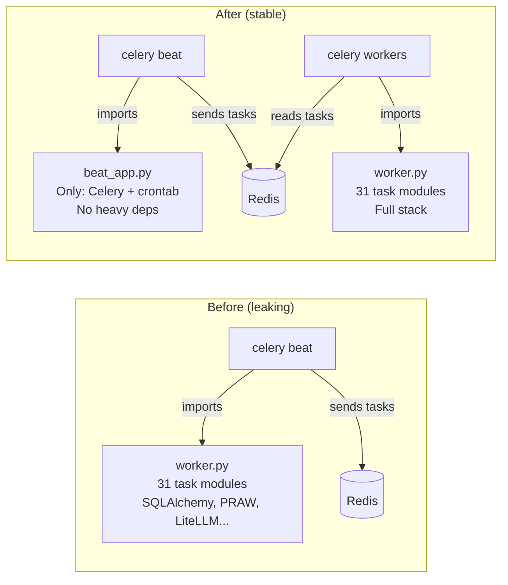

# Celery Beat Memory Architecture (Established July 7, 2026)

## Problem Solved

Celery Beat consumed 225 MB RAM (from 41 MB at startup), crashing every 3-6 hours due to Docker OOM (256 MB limit). Watchdog masked the issue by auto-restarting, producing 1-3 DEAD/RECOVERED Telegram alerts daily.

## Root Cause

Beat used `celery -A app.tasks.worker` which imported all 31 task modules via `include=[]`. These modules pull in SQLAlchemy (65 models), LiteLLM, PRAW, scipy, pydantic — heavy C-level allocations that leak memory over time. Beat never EXECUTES tasks — it only sends task names to Redis. The imports were unnecessary.

## Architecture Decision

## Key Files

| File | Role |
|------|------|
| `app/tasks/beat_app.py` | Lightweight Celery app for Beat: broker + schedule only. ~25 MB RSS. |
| `app/tasks/worker.py` | Full Celery app for workers: includes all task modules. No schedule. |
| `docker-compose.yml` | Beat command: `celery -A app.tasks.beat_app beat --schedule /tmp/celerybeat-schedule` |
| `docker-compose.prod.yml` | Beat memory limit: 128 MB (was 256 MB) |

## Invariants

1. **Schedule lives ONLY in `beat_app.py`** — single source of truth. Adding a new periodic task = edit `beat_app.py`.
2. **Workers have NO schedule** — they only execute tasks received from Redis.
3. **Beat has NO task module imports** — it never needs to know what a task does, only its name.
4. **Beat schedule file in `/tmp/`** — ephemeral, no BerkeleyDB corruption between restarts.
5. **Old `celerybeat-schedule*` deleted at startup** — prevents legacy BDB checksum errors.

## Adding a New Periodic Task — Checklist

1. ✅ Create task function in `app/tasks/<module>.py` with `@celery_app.task(name="task_name")`
2. ✅ Add module to `include=[]` in `app/tasks/worker.py`
3. ✅ Add schedule entry to `beat_schedule` dict in `app/tasks/beat_app.py`
4. ✅ Verify: `python -c "from app.tasks.beat_app import beat_app; print(len(beat_app.conf.beat_schedule))"`

## Deploy Grace Period

`deploy.sh` → `touch /var/lib/ramp-watchdog/deploying` before container restart.
Watchdog skips all checks for 90 seconds after marker creation. Prevents false DEAD alerts during deploys.

## Memory Expectations

| Component | Expected RSS | Limit | Growth |
|-----------|-------------|-------|--------|
| Beat (beat_app) | 20-30 MB | 128 MB | **Stable** (no heavy deps to leak) |
| Beat (old worker) | 41→225 MB in 3h | 256 MB | **Leaking** (C-level from SQLAlchemy/PRAW) |
| Worker (celery) | 150-300 MB | 768 MB | Normal (per-task, recycled via max-tasks-per-child=100) |
| Worker (celery-fast) | 100-200 MB | 384 MB | Normal (same recycling) |
