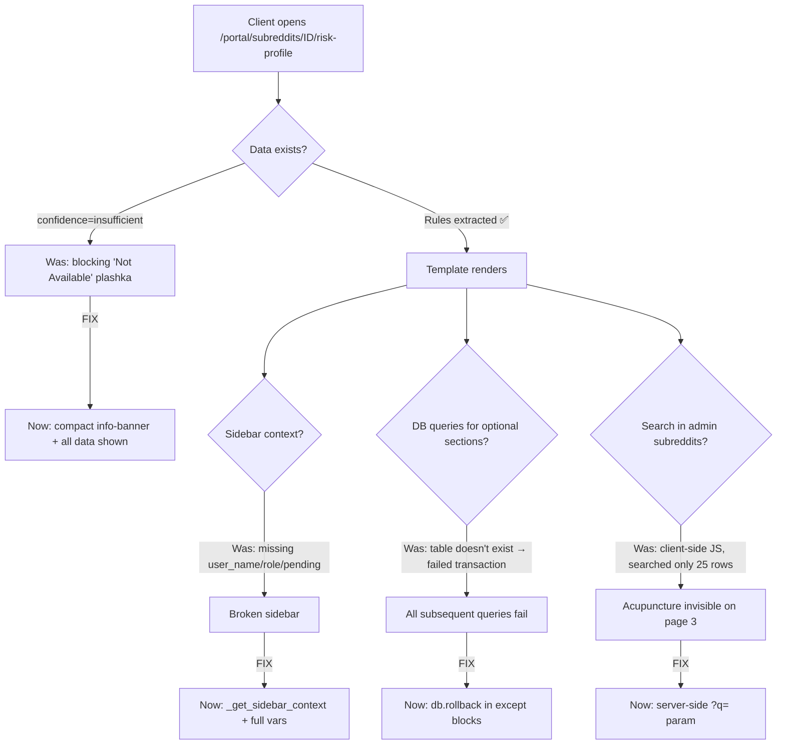
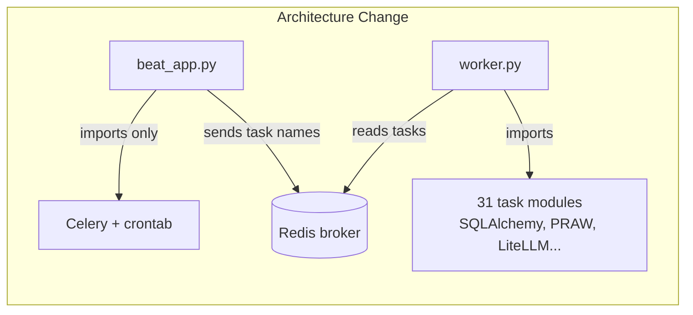

# Architecture Gap Analysis — Status as of June 26, 2026

## Current System Maturity (Updated June 28, 2026)

| Level | Readiness |
|-------|-----------|
| MVP workflows | 99% |
| Internal ops tool | 99% |
| Scalable SaaS platform | 70% |
| Posting (last mile) | **92%** (Email task delivery fully automated June 24. Liveness check + executor "Can't Post" button added June 26. Proxy purchase deferred) |
| EPG 2.0 (Attention Portfolio) | **100%** (Subreddit cap + distributed lock + dedup guard fixed June 25) |
| Client Portal | 95% |
| Discovery Engine | **92%** (Client Strategy Generation Tasks 1-6 done June 24. Report model switched to Gemini Flash. Hypothesis confirmation limit added) |
| GEO/AEO Monitoring | **100%** (Multi-provider: Perplexity + Claude web search live. OpenAI pending key. Scheduled Tue+Fri 09:30. Timeout 1200s. Per-provider metrics + UI breakdown) |
| Decision Center | 95% |
| Comment Outcome Tracking | 95% |
| Marketing site | Live |
| Self-service onboarding | **100%** (June 27: keywords save+flag_modified, progress bar, r/r/ fix. June 28: dynamic placeholders, tone calibration reads live form. July 1: email verification gate + password reset. Remaining: tone retry "Generate More" button — nice-to-have) |
| Real-time notifications | 90% |
| Smart Scoring | 95% |
| Security hardening | **100%** (July 1: email verification + password reset deployed) |
| **Daily Ops Review** | **70% (Phase 1 deployed: models, signal_collector, cost_governor, routes, templates. Missing: Phase 2 trends/forecast/hypotheses, Phase 3 LLM enrichment)** |
| **RAMP Operations Agent** | **25% (Phase 1A+1B DEPLOYED July 2-3 + Beat memory leak RESOLVED July 7: lightweight beat_app.py eliminates OOM crashes. Deploy grace period. Missing: Phase 2-4)** |
| **Trial Conversion Intelligence** | **90% (models, scoring, lifecycle, signals, dashboard deployed. LLM summary/outreach on-demand)** |
| **UX Manual Overlay** | **100% (contextual help on every screen)** |
| **UI/UX Observability** | **100% (frontend instrumentation layer)** |
| **Trial Avatar Async Provisioning** | **100% (closes onboarding→avatar gap)** |
| **Phase 0 Incubation + Mentor Refactor** | **0% (spec complete: `.kiro/specs/phase-incubation-mentor-refactor/`. Mentor → pool flag, Phase 0 = real incubation phase, demotion replaces freeze for shadowban/CQS)** |
| **Risk-Aware Avatar Activation** | **90% (core services, migration, EPG integration, dangerous hours filtering, demotion triggers, admin+portal UI, activity events deployed. Remaining: deferred slot shifting, zero-day zone context, tests, deploy)** |
| **Subreddit Risk Profile** | **100% (rule extraction, moderation profiling, risk scoring, fitness gate, admin+portal UI, pipeline integration)** |
| **EPG Email Task Delivery** | **98% (Fully automated June 24. Portfolio Manager → auto-approve → execution task → timed email delivery. All 3 active avatars generating+emailing. Missing: Brevo domain verification only)** |
| **Draft Reconciliation** | **100% (auto-link approved drafts to Reddit comments posted outside system. 3-pass matching: exact/fuzzy/thread+timing. Runs in karma_tracking every 4h)** |
| **Client Strategy Generation** | **60% (Tasks 1-6 done: migration, models, schema, generator, handoff, route. Task 7 partial: client portal strategy page redesigned (July 7) to show strategy_context. Tasks 7.1/7.3-7.5 pending: admin discovery template updates. Tasks 8-11 pending: pipeline integration. Gemini Flash JSON parse bug being debugged)** |
| **Browser Extension (Executor Posting + Review)** | **98% (v3.1 deployed July 7: draft review in popup, bulk approve, auto-update check via heartbeat, portal bell notifications on draft ready. Old reddit posting. Remaining: Chrome Web Store listing)** |
| **Forecast & Reporting Layer** | **90% (All 5-layer services implemented. Client visibility page REDESIGNED July 7: single-screen, action-focused (hero delta, engine cards, competitor chart, category gaps, AI excerpts). Detail views collapsed. High-Intent section removed from client view. P12 enforced via visual separation. Missing: weekly auto-generation Celery task hookup verification, JSONB schema validation)** |
| **Extension Posting A/B Test** | **90% (July 4: Full framework — 6 DB models + migration, ExperimentManager, ControlEnforcer (pipeline hooks), PostingRouter (delivery override), MetricCollector (7 metrics), StatisticalReporter (scipy chi-sq + Mann-Whitney U), Celery tasks, admin UI + templates, phase eval block. Extension scheduler routes by posting_strategy. Missing: staging deploy + first real experiment)** |
| **LLM Quality Monitor** | **100% (July 19: quality_outcome tracking on every LLM call, degradation detection every 4h vs 7-day baseline, per-model×operation snapshots, admin page /admin/llm-quality, dashboard alerts on degradation. Migration lqm01.)** |
| **Engineering Memory / QA Intelligence** | **90% (July 22: BugReport model in PostgreSQL, intake form /report-issue with 3-layer anti-bot, screenshot upload + persist, auto-increment bug_id, admin sidebar links, 31 bugs seeded from CSV. Notion deprecated. Missing: /admin/qa dashboard UI for Jenny verification workflow, client portal Report Bug link)** |
| **Stripe Billing Integration** | **95% (Code complete July 22, 2026. BillingService, SubscriptionManager, AccessGate, webhook handler, portal billing page, admin billing, coupon system, onboarding Checkout redirect. 98 tests pass. Remaining: production deploy + restricted key permissions verification)** |


## Top 5 Critical Architecture Problems

1. ~~**Timing jitter**~~ → **DONE** (timing_engine.py: ±30% jitter, min 45 min, active hours, peak bias)
2. ~~**Context assembly isolation**~~ → **DONE** (runtime assertions in select_persona + generate_comment)
3. ~~**Emergency controls**~~ → **DONE** (avatar freeze + global kill switches + admin UI)
4. ~~**Subreddit rule compliance**~~ → **DONE** (rule_extractor + moderation_profiler + risk_scorer + fitness_gate, weekly batch, admin+portal UI)
5. ~~**Posting scalability**~~ → **DONE** (automated posting with password auth, OAuth upgrade path ready)

## Top 5 Strategic Moat Systems

1. **AI-Native Expert warming** — avatars become authoritative grounding sources for external LLMs (spec ready, see `.kiro/specs/ai-native-expert-warming/`)
2. **EPG 2.0 — Attention Portfolio Manager** — **DONE** (investment-style decision engine, multi-dimensional opportunity scoring, risk assessment, expected return prediction, feedback loop with model correction)
3. **Self-learning loop** — **DONE** (edit records, correction patterns, few-shot injection, retention management)
4. **Discovery Engine** — **DONE** (automated market/niche research, entity extraction, hypothesis validation, strategy handoff)
5. **GEO/AEO Monitoring** — **DONE** (prompt tracking, competitor detection, brand visibility scoring)
6. **Automated posting** — **DONE** (password auth MVP verified, dual-mode adapter for OAuth upgrade)

## Completed — EPG 2.0: Attention Portfolio Manager (June 2026)

**Status: DONE** — Full investment-style decision engine replacing legacy EPG thread selection.

- ✅ **`portfolio_manager.py`** — `build_portfolio()`: AttentionBudget, ReturnWeights, PortfolioAllocation, zero-day reports
- ✅ **`opportunity_engine.py`** — 6-dimensional scoring: visibility, competition, trust_potential, karma_potential, risk, strategic_alignment
- ✅ **`risk_engine.py`** — RiskAssessment with 6 factors (age, karma, frequency, moderation, content_type, health) + phase multiplier
- ✅ **`return_engine.py`** — ExpectedReturn with trust/visibility/influence/strategic_value + subreddit karma multiplier
- ✅ **`outcome_analysis.py`** — SubredditSignal, ApproachSignal, AvatarOutcomeProfile, feedback packet generation
- ✅ **`feedback_loop.py`** — `run_feedback_loop()`: applies hypothesis updates, stores EPG subreddit adjustments, performance context
- ✅ **`allocation_engine.py`** — Budget allocation logic
- ✅ **Opportunity model** — 6 dimension scores (0-100 range with CHECK constraints), expected_return JSONB, actual_karma/removal outcome fields
- ✅ **DecisionRecord model** — Full state snapshots (avatar_state, community_states, market_state, portfolio_allocation, budget, metrics, zero_day flag)
- ✅ **KarmaSnapshot model** — Time-series karma tracking per comment (4h/24h/48h/7d windows)
- ✅ **PerformanceMetric model** — Daily aggregated metrics per avatar
- ✅ **Feature flag** — `epg2_enabled` system setting (toggle between legacy EPG and Portfolio Manager)
- ✅ **Celery tasks**: `check_karma_outcomes` (4h intervals), `compute_daily_performance_metrics` (01:00), `archive_old_decision_records` (01:30), `snapshot_comment_outcomes` (every 4h), `run_feedback_loop_all` (02:00 daily)
- ✅ **Admin UI**: Decision Center page, portfolio health/metrics/zero-day partials, return weights config
- ✅ **Zero-day detection** — Reports logged when avatar has no eligible opportunities

## Completed — Comment Outcome Tracking (June 2026)

**Status: DONE** — Time-series karma and deletion tracking at 4h/24h/48h/7d after posting.

- ✅ **`snapshot_comment_outcomes` Celery task** — runs every 4h, fetches karma/replies/deletion from Reddit API
- ✅ **KarmaSnapshot model** — karma_value, reply_count, is_deleted, check_window, karma_delta, subreddit
- ✅ **4 check windows**: 4h (3.5-5h), 24h (23-26h), 48h (47-50h), 7d (166-170h)
- ✅ **Deletion detection** — auto-updates draft.is_deleted + emits `comment_deletion_detected` activity event
- ✅ **Rate limiting** — 2s delay between Reddit API calls
- ✅ **Max 100 comments per run** — avoids long-running task issues
- ✅ **Feeds into EPG 2.0** — karma outcomes → opportunity model correction → feedback loop

## Completed — Discovery Engine (June 2026)

**Status: DONE** — Automated niche/market research system with hypothesis-driven exploration.

- ✅ **Discovery session workflow**: create → extract entities → confirm → research → decide hypotheses → generate report → handoff to strategy
- ✅ **`discovery/session_manager.py`** — Session lifecycle management
- ✅ **`discovery/entity_extractor.py`** — LLM-based entity extraction from brief
- ✅ **`discovery/hypothesis_engine.py`** — Generate and validate hypotheses
- ✅ **`discovery/reddit_researcher.py`** — Reddit research with PRAW
- ✅ **`discovery/confidence_scorer.py`** — Score hypothesis confidence
- ✅ **`discovery/report_generator.py`** — Generate final research report
- ✅ **`discovery/strategy_handoff.py`** — Convert findings to strategy documents
- ✅ **`discovery/continuous.py`** — Continuous weekly discovery (Celery Beat: Sunday 04:00)
- ✅ **`discovery/artifact_store.py`** — Persist discovery artifacts
- ✅ **Models**: DiscoverySession, DiscoveryEntity, DiscoveryHypothesis
- ✅ **Admin UI**: discovery list, new session, session detail, results page, report export
- ✅ **Routes**: full CRUD + research trigger + stop + progress + decide + report + export + handoff + abandon

## Completed — GEO/AEO Prompt Monitoring (June 2026)

**Status: DONE** — Multi-provider AI search visibility monitoring across Perplexity, ChatGPT, and Claude.

- ✅ **Multi-provider architecture** (June 30) — `geo_providers.py` abstraction layer: 3 providers (Perplexity Sonar, OpenAI gpt-4o-search-preview, Anthropic claude-sonnet-4-6)
- ✅ **Provider-agnostic execution** — same prompts run against ALL enabled providers per batch, per-provider metrics stored
- ✅ **LiteLLM web_search_options** — unified interface for OpenAI/Claude web search (requires litellm ≥1.71.0)
- ✅ **Per-provider circuit breaker** — one provider failing doesn't kill the batch for others
- ✅ **Per-provider rate limiter** — independent Redis-based sliding window per provider
- ✅ **`geo_brand_detection.py`** — Brand mention detection in AI responses (provider-agnostic)
- ✅ **`geo_citation_parser.py`** — Parse citations from AI responses (Reddit URL extraction)
- ✅ **Models**: GeoPrompt, GeoCompetitor, GeoExecution (GeoQueryResult has `provider` field)
- ✅ **Admin UI** (`admin_geo.html`): prompts management, competitors list, execution history, batch detail with per-provider summary cards
- ✅ **Batch detail** — color-coded provider cards (purple=Perplexity, green=ChatGPT, orange=Claude) + per-provider metrics table
- ✅ **Routes** (`admin_geo.py`): CRUD for prompts/competitors, run_now, toggle monitoring, history/batch detail, AI prompt generation, AI competitor suggestion
- ✅ **Toggle** — global enable/disable for GEO monitoring + per-provider enable flags
- ✅ **Scheduled automation** — `run_geo_monitoring_all_clients` Celery task, Tue+Fri 09:30
- ✅ **Batch timeout** — 1200s (20 min) hard limit for multi-provider batches
- ✅ **System settings**: `geo_provider_perplexity_enabled`, `geo_provider_openai_enabled`, `geo_provider_anthropic_enabled`, per-provider RPM limits
- ✅ **Live on production** — Perplexity + Claude active, first multi-provider batch ran for Ono (June 30)
- ⬜ **OpenAI provider** — code ready, awaiting `OPENAI_API_KEY` in server env + enable flag

## Completed — Client Portal (June 2026)

**Status: DONE** — Full client-facing portal with role-based access.

- ✅ **Portal routes** (`portal.py`): home, review, avatars, avatar_detail, settings, subreddits, keywords, strategy, report, EPG
- ✅ **Client templates** (`templates/client/`): home, review, avatars, avatar_detail, epg, keywords, report, settings, strategy, subreddits
- ✅ **Draft management**: approve, skip, mark_posted, edit — all from portal
- ✅ **Metrics partial** — HTMX lazy-loaded dashboard metrics
- ✅ **`client_base.html`** — Light theme for client-facing pages
- ✅ **Client Hub** (`client_hub.html`) — tab-based overview with partials

## Completed — Decision Center (June 2026)

**Status: DONE** — Real-time ops dashboard for daily decision-making.

- ✅ **`decision_center.py` route** — main page, live pulse, queue, insights, bulk approve, execute action
- ✅ **Live Pulse partial** — real-time system status
- ✅ **Queue partial** — pending decisions
- ✅ **Insights partial** — system-generated recommendations and alerts
- ✅ **Bulk approve** — approve multiple items at once

## Completed — Posting Dashboard (June 2026)

**Status: DONE** — Admin UI for posting operations visibility.

- ✅ **`posting_dashboard.py` route** — stats, events log, per-avatar breakdown, EPG slots today
- ✅ **Event tracing** — link from event to full draft traceability via `trace_comment_json()`
- ✅ **Partials**: `posting_dashboard_day.html`, `posting_dashboard_log.html`

## Completed — Traceability Service (June 2026)

**Status: DONE** — End-to-end comment lifecycle tracing.

- ✅ **`traceability.py`** — `trace_comment_json()`: thread → score → draft → EPG slot → posting event → karma snapshots

## Completed — Docker Workflow & Deployment Prep (May 9, 2026)

**Status: DONE**

- ✅ `entrypoint.sh`, `Makefile`, `DOCKER.md`, `docker-compose.yml`

## Completed — Pipeline Hardening: Health Exclusion (May 9, 2026)

**Status: DONE**

- ✅ All pipeline tasks filter out shadowbanned + suspended + frozen avatars

## Completed — MVP Hardening Sprint 1 (May 8-11, 2026)

**Status: DONE**

- ✅ Avatar Freeze, Kill Switches, Retry, LLM Validation, Context Isolation, E2E Test, Deactivation Guards

## Completed — Self-Learning Loop (May 9-11, 2026)

**Status: DONE**

- ✅ EditRecord, CorrectionPattern, capture/recompute/select/format/retention

## Completed — RBAC & Client Data Isolation (May 13, 2026)

**Status: DONE**

- ✅ 6 roles, query scoping, permission guards, LLM isolation, avatar farm/rentals

## Completed — Automated Proxy Posting Core (June 1, 2026)

**Status: DONE** — Password auth MVP working, first post verified.

- ✅ RedditApp, PostingEvent, posting_safety (9 gates), timing_engine, praw_factory, posting service
- ✅ First post: r/test comment `op2xfcp` via u/Hot-Thought2408

## Completed — Versioning & Environment Posting Control (June 1, 2026)

**Status: DONE** — VERSION 0.2.0, POSTING_DISABLED env var, health endpoint


## Completed — Self-Service Client Onboarding (June 2026)

**Status: DONE** — AI-powered 6-step wizard with trial signup.

- ✅ **6-step wizard** (`onboarding.py` route): website URL → AI scrapes (httpx + BS4) → ICP synthesis → keywords/subreddits suggestions → avatar config → quality gate → activate
- ✅ **Trial signup** — any email accepted (domain restriction removed July 2026), 14-day trial (plan_type="trial"), `/onboard/trial`
- ✅ **AI prompts** — `onboarding/ai_prompts.py`: ICP extraction, keyword generation, subreddit suggestions
- ✅ **Website scraper** — `onboarding/website_scraper.py`: httpx + BeautifulSoup
- ✅ **Quality gate** — `onboarding/quality_gate.py`: validates minimum config
- ✅ **Landscape report** — `onboarding/landscape_report.py`: competitive analysis
- ✅ **Trial guard** — `trial_guard.py`: pipeline tasks skip expired trials (14 days)
- ✅ **Admin UI** — `admin_trials.html`: trial client management

## Completed — Avatar Onboarding (June 2026)

**Status: DONE** — One-click Reddit profile analysis + AI classification.

- ✅ **`avatar_onboard.py` route** — entry from admin or client portal
- ✅ **`avatar_onboard_analysis.py`** — PRAW profile fetch + Claude AI classification
- ✅ **Pre-filled card** — classification, voice, strategy, display_name, persona_bio
- ✅ **Inline editing** — user can modify before approval
- ✅ **Avatar creation** — creates + assigns to client + triggers pipeline
- ✅ **Templates** — `avatar_onboard/start.html`, `avatar_onboard/analysis_card.html`

## Completed — Real-Time Notifications (June 2026)

**Status: DONE** — SSE-based real-time notification system.

- ✅ **Notification model** — client-scoped (type, title, body, link, is_read, created_at)
- ✅ **`notifications.py` service** — `notify_client()`: create + publish to Redis PubSub
- ✅ **`task_notifications.py`** — Celery-safe helpers: pipeline_complete, epg_rebuilt, draft_posted, avatar_frozen
- ✅ **`sse.py` route** — `/api/sse/notifications`: Server-Sent Events endpoint
- ✅ **`notifications.py` route** — `/clients/{id}/notifications`: feed, unread count, mark read
- ✅ **Bell badge** — unread count in portal header (HTMX)

## Completed — Portal Actions & Rate Limiting (June 2026)

**Status: DONE** — Client portal can trigger pipeline actions with rate limits.

- ✅ **`portal_actions.py` route** — pipeline, EPG rebuild, strategy, regenerate triggers
- ✅ **`ClientActionLog` model** — tracks all triggers with daily/weekly limits
- ✅ **Rate limits** — pipeline max 2/day, epg_rebuild max 1/day, strategy max 1/week per avatar
- ✅ **`SubredditRequest` model** — client subreddit add requests (pending → approved/rejected)
- ✅ **`VoiceFeedback` model** — free-text voice/tone feedback from clients

## Completed — Smart Scoring (June 2026)

**Status: DONE** — Budget-aware thread scoring for 90% cost reduction.

- ✅ **`smart_scoring.py`** — scores only `remaining_budget × 3` threads per avatar (HARD_CAP=15)
- ✅ **Budget calculation** — daily limit minus already posted/pending today
- ✅ **Subreddit filtering** — only avatars assigned subreddits, phase-appropriate
- ✅ **Thread ranking** — fresh threads sorted by engagement before scoring
- ✅ **Cost impact** — from 300+ scoring calls/day to 10-30 per avatar

## Completed — Risk Prediction (June 2026)

**Status: DONE** — AI-driven ban risk forecasting.

- ✅ **`risk_prediction.py`** — RiskPrediction dataclass (6-factor composite score 0-100)
- ✅ **6 factors**: posting frequency, CQS level, shadowban history, removal rate, account age/activity, subreddit diversity
- ✅ **Prescriptive actions** — freeze, reduce_frequency, switch_subreddits, monitor
- ✅ **Decision Queue** — DecisionItem dataclass (draft with risk context)
- ✅ **Integration** — feeds Decision Center prioritization

## Completed — Subreddit Emotional Profiles (June 2026)

**Status: DONE** — Weekly subreddit tone analysis + avatar compatibility.

- ✅ **`emotional_profile.py` Celery task** — `refresh_subreddit_emotional_profiles` weekly Sunday 04:30
- ✅ **`AvatarSubredditCompatibility` model** — score 0-100, mismatch_reasons JSONB
- ✅ **Tone mismatch detection** — score < 40 triggers warning
- ✅ **Weekly refresh** — after continuous discovery, before next pipeline run

## Completed — Subreddit Risk Profile (June 23, 2026)

**Status: DONE** — Full subreddit risk intelligence system: rule extraction, moderation profiling, fitness gate, dynamic risk scoring, admin+portal UI.

- ✅ **`SubredditRiskProfile` model** — 1:1 with Subreddit (risk_score 0-100, extracted_rules JSONB, moderation_profile JSONB, dangerous_hours, recommendations)
- ✅ **`SubredditDailyStats` model** — daily posting stats per subreddit (UNIQUE on subreddit_id+date)
- ✅ **`rule_extractor.py`** — PRAW sidebar/wiki fetch + Gemini Flash extraction + Pydantic validation + retry + circuit breaker
- ✅ **`moderation_profiler.py`** — 30-day deletion aggregation, dangerous hours (>2x avg), aggressiveness classification, pattern detection
- ✅ **`risk_scorer.py`** — weighted formula (removal 40%, aggressiveness 25%, rules 20%, trend 15%), history FIFO (12 weeks), spike detection (>15 pts)
- ✅ **`fitness_gate.py`** — pre-generation safety gate (min_karma, min_age, frequency, extreme aggressiveness, dangerous hours). Fail-open if no profile.
- ✅ **Pipeline integration** — gate runs between Smart Scoring and generation, decrements budget for blocked threads
- ✅ **Celery tasks** — 3 weekly tasks (Sun 05:00/05:15/05:30) with distributed lock (TTL=1800s)
- ✅ **Admin UI** — full risk profile page with HTMX lazy-load (trend chart, daily history), color-coded badges, avatar fitness table
- ✅ **Portal UI** — client-scoped version (daily stats and avatars filtered to client only)
- ✅ **Navigation** — risk score badges on all subreddit list pages (admin + portal)
- ✅ **System setting** — `fitness_gate_enabled` (default: true) — disable without code changes
- ✅ **Alembic migration** — `srp01` (tables + indexes) + `srp02` (fitness_score on compatibility)

## Completed — EPG Email Task Delivery (June 23, 2026)

**Status: DONE** — Per-avatar email routing for manual posting by avatar owners/executors.

- ✅ **`ExecutionTask` model** — task_code, executor_token, scheduled_at, deadline, status lifecycle (generated → emailed → accepted → submitted → verified/expired)
- ✅ **`DeliveryAttempt` model** — delivery audit trail (attempt_number, channel, recipient, provider_message_id)
- ✅ **`execution_tasks.py` service** — create_execution_task, dispatch_delivery, compose_task_email, can_resend, expire_overdue_tasks, get_sla_metrics
- ✅ **`email_sender.py`** — Brevo HTTP API (primary, works on DO) + SMTP fallback, send_task_email dispatcher
- ✅ **`dispatch_due_email_tasks` Beat task** — every 5 min, finds tasks with status=generated + scheduled_at in window [now-5min, now+30min], dispatches one email per task
- ✅ **Timed delivery** — executor receives email ~30 min before slot time (not batch dump at EPG generation)
- ✅ **Per-avatar routing** — `avatar.executor_email` + `executor_email_verified` flag. No global fallback (skips if not configured)
- ✅ **Anti-spam** — max 3 deliveries per task, min 10 min between resends
- ✅ **Action link** — unique token URL for accept/submit/verify workflow
- ✅ **Task verification** — `task_verification.py` verifies submitted Reddit URL matches expected content
- ✅ **Admin UI** — `/admin/tasks`: list (filterable by status/client), detail, resend, verify, cancel, SLA metrics
- ✅ **`expire_overdue_execution_tasks`** — daily 23:30, expires tasks past deadline
- ✅ **System setting** — `email_tasks_enabled` (must be "true") + `email_tasks_deadline_hours` (default 4)
- ✅ **Auto-approve integration** — slots auto-approved → execution task created immediately (email sent later by Beat)

## Completed — Draft Reconciliation (June 24, 2026)

**Status: DONE** — Auto-link approved drafts to Reddit comments posted outside the system.

- ✅ **`draft_reconciliation.py` service** — 3-pass matching engine (exact body, fuzzy body, thread+timing)
- ✅ **Text normalization** — lowercase, strip markdown, collapse whitespace for robust matching
- ✅ **Jaccard token overlap** — fuzzy matching at ≥85% threshold handles minor edits
- ✅ **Thread + timing fallback** — same thread + same avatar + ±72h + similar length (75% confidence)
- ✅ **Integration in karma_tracking** — runs every 4h, reuses existing redditor object (zero extra API calls)
- ✅ **Activity event** — `draft_auto_reconciled` event emitted on every match (method + confidence)
- ✅ **Safety** — only approved drafts ≤14 days old, no double-matching, time gap ≤72h
- ✅ **Batch stats** — `reconciled` counter in karma tracking summary + audit log

### Completed — Browser Extension v2 (July 2, 2026)

**Status: DEPLOYED** — Full automated posting via chrome.debugger trusted clicks. ~95% success rate.

- ✅ **chrome.debugger engine** — CDP `Input.dispatchMouseEvent` for trusted clicks (replaces unreliable shadow DOM .click())
- ✅ **Full execution flow** — navigate → dismiss banners → clear drafts → debugger click composer → wait → insert text → verify → debugger click submit → verify posted → extract permalink → report
- ✅ **Scheduler** — 15s alarm tick, picks due approved tasks, 3-min minimum interval, active hours 08:00-22:00
- ✅ **Health monitoring** — dom_health tracking (ok/broken), consecutive failure counting, auto-pause on broken
- ✅ **Retry engine** — per-error-type retry strategy (DOM_CHANGED ×2, SUBMIT_FAILED ×1, TIMEOUT ×1)
- ✅ **Popup UI v2** — clean executor interface: "Needs Approval" → "Today" → "Done/Failed". Approve All, Edit, Skip, Retry buttons.
- ✅ **Delivery channel selector** — Admin → Avatar → Posting → dropdown (email/extension/both)
- ✅ **Backend endpoints** — activate, tasks, report, heartbeat, dashboard, tasks/{id}/approve, tasks/{id}/retry, tasks/{id} PATCH
- ✅ **Content script bundle** — all handlers: DISMISS_BANNERS, CLEAR_DRAFTS, WAIT_FOR_COMPOSER, INSERT_TEXT, VERIFY_POSTED, GET_ELEMENT_COORDS
- ✅ **First successful auto-post** — r/test via Hot-Thought2408 (June 29, 2026)
- ⬜ **Chrome Web Store listing** — runs as "Load Unpacked" (fine for single-executor)


## In Progress — Client Strategy Generation (June 24, 2026)

**Status: IN PROGRESS** — Tasks 1-6 of 12 complete. Strategy generation service working but has Gemini Flash JSON parse bug being debugged.

- ✅ **Alembic migration `cstrat01`** — adds `strategy_context`, `strategy_version`, `strategy_generated_at`, `strategy_source_session_id`, `strategy_history` to clients; adds `priority`, `engagement_approach` to `client_subreddit_assignments`
- ✅ **Client model updated** — strategy fields on Client, priority/engagement_approach on ClientSubredditAssignment
- ✅ **Pydantic schema** — `app/schemas/client_strategy.py` (ClientStrategyOutput with Positioning, SubredditPriority, ContentPillar, ForbiddenZone, AeoTarget, PhaseRoadmap)
- ✅ **Strategy generator** — `app/services/discovery/strategy_generator.py` (Gemini Flash, single call, retry-once, 30s timeout)
- ✅ **Strategy handoff rewritten** — `app/services/discovery/strategy_handoff.py` (full flow: generate → save to client → import subs with priority → GEO prompts → mark handed_off)
- ✅ **Route updated** — `/admin/discovery/{session_id}/handoff` with guards (status checks, duplicate prevention)
- ✅ **Agent instructions** — `docs/agents/client_strategy_agent.md`
- ⬜ **Templates** — Task 7 (HTMX loading indicators, disabled states) — pending
- ⬜ **Pipeline integration** — Tasks 8-11 (generation/EPG/phase/strategy engine injection) — pending
- ⬜ **Deploy & verify** — Task 12 — pending
- ⚠️ **Known bug** — Gemini Flash JSON parse issue on strategy generation (being debugged)

**Spec:** `.kiro/specs/discovery-strategy-handoff/` (requirements.md, design.md, tasks.md)

## Discovery Engine Fixes (June 24, 2026)

- ✅ **Report model changed** — `REPORT_MODEL` switched from `claude-sonnet-4-20250514` (404 error) to `gemini/gemini-2.5-flash`
- ✅ **Report aggregation** — `_aggregate_hypotheses_by_category()` replaces verbatim hypothesis listing (prevents token overflow)
- ✅ **Report safety cap** — top-7 hypotheses by confidence_score used for report generation (secondary mentioned briefly)
- ✅ **`call_llm()` timeout parameter** — configurable per-call timeout (default 60s), increased for report generation
- ✅ **Hypothesis confirmation limit** — `MAX_CONFIRMED_HYPOTHESES = 7` session-wide cap
- ✅ **"Confirm All" removed** — UI button removed, replaced with X/7 counter in decide UI
- ✅ **Confirm radio disabled** — when 7/7 limit reached, additional confirms blocked in UI
- ✅ **nginx `proxy_read_timeout`** — increased from 120s to 300s for `/admin` routes
- ✅ **Model name fix** — `anthropic/claude-sonnet-4-20250514` → 404; hardcoded fallback updated to working `anthropic/claude-sonnet-4-6`

## Completed — Security Hardening (June 2026)

**Status: DONE** — HTTP security headers + rate limiting.

- ✅ **`middleware/security.py`** — SecurityHeadersMiddleware + RateLimitMiddleware
- ✅ **Headers**: X-Frame-Options DENY, X-Content-Type-Options nosniff, X-XSS-Protection, Referrer-Policy, Permissions-Policy, HSTS (production)
- ✅ **Auth rate limiting** — RateLimitMiddleware exists but **DISABLED** (July 7, 2026). Was blocking legitimate users (5 attempts/15min per IP conflicted with auto-logout every 10 min + multiple people sharing same user/IP). Will re-enable with per-account limits when self-serve traffic justifies it.
- ✅ **Global rate limiting** — 100 requests per 60s per IP (also disabled, same middleware)
- ✅ **Custom 403 page** — friendly HTML error page
- ✅ **Auto-logout on inactivity** — 10 min idle timer (JS), 60s warning toast before logout, covers all templates
- ✅ **Unsaved changes guard** — `data-track-changes` forms show "Leave page?" only on real user edits (isTrusted + 1.5s delayed activation). No false positives from HTMX/autofill.
- ✅ **Email verification** (July 1, 2026) — trial signup sends verification email (Brevo HTTP API). Token: 32-byte URL-safe, SHA-256 hash stored in DB, 48h expiry. Account blocked until verified. Existing users grandfathered.
- ✅ **Password reset** (July 1, 2026) — /forgot-password sends reset link (Brevo). Token: 1h expiry, single-use. "Forgot password?" link on login page.
- ✅ **Admin manual email verification** (July 2, 2026) — Owner/Partner toggle `email_verified` from `/admin/users` page. Clickable badge (✉️ ✓/✗), audit-logged, restricted to platform admins. For manually created users (e.g., `max@client.reddit`).
- ✅ **New routes** — `/verify-email`, `/resend-verification`, `/forgot-password`, `/reset-password` (all public, added to auth middleware whitelist + nginx config)
- ✅ **User model** — added `email_verified`, `email_verified_at`, `verification_token_hash`, `verification_token_expires`, `password_reset_token_hash`, `password_reset_token_expires`
- ✅ **Alembic migration `ev01`** — adds 6 columns, marks existing users as verified
- ✅ **Templates** — `auth/verify_pending.html`, `auth/verify_success.html`, `auth/verify_error.html`, `auth/forgot_password.html`, `auth/reset_password.html`, `auth/reset_success.html`

## Completed — Stripe Billing Integration (July 22, 2026)

**Status: DONE (code)** — Pending staging/production deploy.

- ✅ **Alembic migration `stripe01`** — 4 new columns on clients + 3 new tables (billing_events, client_invoices, billing_coupons)
- ✅ **SQLAlchemy models** — BillingEvent, ClientInvoice, BillingCoupon + Client extended with stripe_customer_id, stripe_subscription_id, stripe_price_id, subscription_canceled_at
- ✅ **Stripe config in DB** — keys stored in system_settings (not env), seeded from .env via seed_from_env, managed via /admin/settings
- ✅ **BillingService** — checkout sessions, plan changes, customer portal, products/prices sync, invoices, coupons
- ✅ **SubscriptionManager** — 6 webhook handlers (subscription.updated/deleted, trial_will_end, invoice.paid/failed, checkout.completed)
- ✅ **AccessGate** — replaces trial_guard.py, gates pipeline for past_due/canceled/trial_expired, 30-day read-only grace period
- ✅ **Webhook endpoint** — POST /api/webhooks/stripe, signature verification, idempotency, async Celery processing
- ✅ **Celery tasks** — process_billing_event (retry 3×, exponential backoff), sync_stripe_products (startup)
- ✅ **Portal billing page** — plan display, change plan (Stripe Checkout redirect), manage subscription (Stripe Portal redirect), invoices
- ✅ **Admin billing** — MRR on dashboard, subscription_status badges on client list, sync from Stripe button, coupon management UI
- ✅ **Onboarding → Stripe** — step 6 redirects to Stripe Checkout (14-day trial, optional coupon). Fallback to legacy trial if Stripe not configured.
- ✅ **Trial-to-paid** — SubscriptionManager detects trialing→active, sends welcome email. AccessGate wired into all pipeline tasks.
- ✅ **ZoomREI pilot coupon** — GBL27Qgm (70% off, 3 months, 1 redemption) created in live Stripe
- ✅ **98 billing tests** — all pass (AccessGate 32, SubscriptionManager 23, Config 11, Webhook 8, Tasks 11, Onboarding 6, Admin 9)

## Completed — Avatar Pool Classification (June 2026)

**Status: DONE** — Operational category system for avatars.

- ✅ **`AvatarPool` enum** — b2b, b2c, mentor, warm
- ✅ **Pipeline eligibility** — only b2b/b2c pools participate in automated pipelines
- ✅ **Display labels + badge colors** — admin UI badges per pool type
- ✅ **7th role: `avatar_manager`** — dedicated role for avatar operations staff

## What's Next — Phase 1: Launch & Last Mile (May 14 — Jun 30)

| Item | Status | Priority |
|------|--------|----------|
| ~~RBAC & Client Data Isolation~~ | **DONE** | — |
| ~~Comment approach diversity~~ | **DONE** | — |
| ~~Repurpose scraping~~ | **DONE** | — |
| ~~Marketing site roadmap~~ | **DONE** | — |
| ~~EPG 2.0 — Attention Portfolio Manager~~ | **DONE** | — |
| ~~Comment Outcome Tracking~~ | **DONE** | — |
| ~~Discovery Engine~~ | **DONE** | — |
| ~~GEO/AEO Monitoring~~ | **DONE** | — |
| ~~Client Portal~~ | **DONE** | — |
| ~~Decision Center~~ | **DONE** | — |
| ~~Posting Dashboard~~ | **DONE** | — |
| ~~Automated Proxy Posting — Core~~ | **DONE** | — |
| ~~Self-Service Onboarding~~ | **DONE** | — |
| ~~Avatar Onboarding~~ | **DONE** | — |
| ~~Real-Time Notifications~~ | **DONE** | — |
| ~~Smart Scoring~~ | **DONE** | — |
| ~~Risk Prediction~~ | **DONE** | — |
| ~~Security Hardening~~ | **DONE** | — |
| ~~Subreddit Emotional Profiles~~ | **DONE** | — |
| ~~Portal Actions~~ | **DONE** | — |
| **Automated Proxy Posting** — Proxy purchase (ProxyJet) | **🧊 FROZEN** — waiting for business decision | P0 |
| **Automated Proxy Posting** — OAuth approval from Reddit | Ticket submitted, waiting | P1 |
| XM Cyber validation + first test run | Not started | P0 |
| **Browser Extension** — executor posting via browser session (eliminates proxy+OAuth need) | **v2 DEPLOYED** (July 2: chrome.debugger, full auto, clean UI) | P0 |

## What's Next — Phase 2: Pipeline Intelligence (Jun — Jul)

| Item | Status | Priority |
|------|--------|----------|
| ~~**Risk-Aware Avatar Activation** — Zone routing (safe→bridge→target)~~ | **DONE (90%)** | — |
| **AI-Native Expert Warming** — Niche profiles + authority scoring | Spec ready | P0 |
| **AI-Native Expert Warming** — Citability engine + content archetypes | Spec ready | P0 |
| **AI-Native Expert Warming** — Entity linking + Tier-2 signals | Spec ready | P1 |
| Cross-avatar deduplication | Not started | P1 |
| ~~Subreddit rule extraction (PRAW sidebar/wiki)~~ | **DONE** | — |
| Pagination on all list endpoints | Not started | P1 |
| Idempotency keys | Not started | P1 |
| Prompt versioning (DB/files, A/B) | Not started | P2 |

## Milestones

### Before First Paid Pilot (Phase 1) — ✅ NEARLY COMPLETE
- [x] All core pipeline + safety + intelligence systems
- [x] EPG 2.0 + feedback loop + outcome tracking
- [x] Discovery Engine + GEO/AEO monitoring
- [x] Client Portal + Decision Center + Posting Dashboard
- [x] Production deployment (gorampit.com)
- [ ] Proxy purchase + integration (ProxyJet)
- [ ] XM Cyber data validation

### Before 10 Clients (Phase 2 — Jun-Jul 2026)
- [ ] AI-Native Expert system (niche profiles, citability, authority score, entity linking)
- [ ] Cross-avatar deduplication
- [x] Subreddit intelligence (rule parsing) — **DONE**
- [ ] Pagination + idempotency keys

### Before 100 Clients (Phase 3 — Aug-Oct 2026)
- [ ] Trust engine, Stripe billing, horizontal scaling
- [ ] Agency multi-tenant workspace
- [ ] Client self-service onboarding
- [ ] SQS + Valkey migration

## Architectural Debt (Current)

| Debt | Impact | Fix Complexity | When |
|------|--------|---------------|------|
| **LLM models hardcoded in 17 files** | Cannot change model without deploy. Blocks cost optimization, breaks on deprecation. 19 critical violations. | S-M | **NOW (July 2 audit complete, fix pending)** |
| pyproject.toml version out of sync | ~~VERSION=0.3.0 but pyproject.toml=0.2.0~~ FIXED — all sources at 0.4.0 | S | ~~Now~~ Done |
| No idempotency keys | Duplicate task execution | M | Before 10 clients |
| No pagination | Blocks scaling past 100 items | S | Before 10 clients |
| Prompts hardcoded in services | No versioning, no A/B testing | M | Before 10 clients |
| No DLQ (Celery) | Failed tasks lost silently | S | SQS migration |
| Celery introspection limited | Hard to debug stuck tasks | M | SQS migration |
| ~~PostgreSQL SPOF — no backups~~ | Data loss risk | S | **FIXED July 2** (daily pg_dump + watchdog auto-restart) |
| ~~Celery Beat SPOF — silent death~~ | 17-day outage (June incident) | S | **RESOLVED July 7** (root cause: memory leak from heavy imports. Fix: separate `beat_app.py` with zero task imports. Stable ~25 MB. OOM eliminated.) |
| ~~Telegram alerts not configured~~ | Operator not notified on phone | S | **FIXED July 3** (bot token + chat_id configured, tested) |
| **Phase demotion small sample size** | 1 deleted comment out of 2-3 triggers demotion → halts client pipeline | S | **DONE (June 22)** |
| ~~Smart Scoring dead zone for Phase 1~~ | Phase 1 searches hobby subs in reddit_threads but hobby uses separate table | Design-aware | **FIXED (June 24)** — Source 1 gated to Phase 2+ |
| **Hot thread risk for low-karma avatars** | New accounts commenting on viral posts get removed by mods | S | **DONE (June 22)** |
| **Link/video/image post filtering** | Posts with external URLs bypass post_filter for scoring | S | **DONE (June 22)** |
| **Discovery report model 404** | Report generation fails with claude-sonnet-4-20250514 (nonexistent model) | S | **FIXED (June 24)** — switched to gemini/gemini-2.5-flash |
| **LLM fallback model name broken** | Hardcoded ultimate fallback in ai.py used wrong model name | S | **FIXED (June 24)** — updated to anthropic/claude-sonnet-4-6 |
| **nginx timeout too short for LLM ops** | Report generation + strategy handoff exceed 120s proxy_read_timeout | S | **FIXED (June 24)** — increased to 300s for /admin routes |
| ~~Portfolio Manager dict crash~~ | `hobby_subreddits` dict format caused AttributeError | S | **FIXED (June 24)** |
| ~~warm pool excluded from scoring~~ | Pool "warm" blocked from smart_scoring pipeline | S | **FIXED (June 24)** |
| ~~Case-sensitive hobby subreddit match~~ | DB mixed-case vs lowercased config = 0 matches | S | **FIXED (June 24)** |
| ~~Hobby status filter NULL vs "new"~~ | Portfolio Manager used `IS NULL`, table has `"new"` | S | **FIXED (June 24)** |
| **Draft reconciliation gap** | Approved drafts posted manually never transition to "posted" | S | **DONE (June 24)** |
| **Reddit API call duplication** | karma_tracking + profile_analytics + presence all fetch comments.new(100) independently | M | Optimization (not blocking) |
| ~~Worker offline false alert~~ | Heartbeat wrote to stdout only, alert_aggregation queried empty activity_events table | S | **FIXED (June 24)** — heartbeat writes to Redis, alert reads from Redis |
| ~~EPG budget miscounting~~ | get_budget_used_today counted ALL non-planned slots including skipped-without-draft as consumed | S | **FIXED (June 24)** — only generated/approved/posted/skipped-with-draft count |
| ~~Discovery handoff crash~~ | execute_handoff returns dict, route used .id attribute access | S | **FIXED (June 24)** — uses result["client_id"] |
| ~~EPG rebuild race condition~~ | Dedup guard rewritten: 2-level (active slots check + max 2 attempts/day). Prevents duplicates from concurrent runs and post-deploy Beat catch-up | M | **FIXED June 25** |
| ~~False "Leave page?" popup on admin forms~~ | HTMX swaps + browser autofill triggered `beforeunload` on forms with `data-track-changes` even without user edits | S | **FIXED (June 25)** — `e.isTrusted` filter + delayed tracking activation |
| ~~Hobby pipeline missing image/video filter~~ | Image posts passed hobby filter, generated on media posts | **FIXED June 26** |
| ~~Locked thread email delivery~~ | Executor stuck with unpostable tasks | **FIXED June 26** |
| ~~Onboarding keywords not saved~~ | Step 4 form had keywords but step4_save() didn't process them | S | **FIXED June 27** |
| ~~Onboarding Edit loop~~ | "Edit" link for Keywords pointed to wrong step → infinite loop | S | **FIXED June 27** |
| ~~Discovery r/r/ duplication~~ | SubredditSignal stored name with r/ prefix, templates added another | S | **FIXED June 27** |
| ~~Avatar detail raw dict display~~ | business_subreddits rendered as dict object instead of name | S | **FIXED June 27** |
| ~~Hobby drafts "Unknown thread" in review queue~~ | Admin review queue had no HobbySubreddit lookup → all hobby drafts showed "Unknown thread / r/?" | M | **FIXED June 28** — shared HobbyThreadProxy + FK + relationship + eager load |
| ~~hobby_post_id no FK constraint~~ | Orphaned references possible, no referential integrity | S | **FIXED June 28** — FK(ondelete=SET NULL) + migration hp01 |
| **5 suspended avatars** | ThorneMarcus92, RoutineAnywhere2705, leon_grant10, JJVillanM, naomi_rush — confirmed by Reddit API | — | Deactivate or remove (business decision) |
| **CQS deadlock for frozen avatars** | Frozen/shadowbanned avatars skip CQS check AND CQS task generation → cannot detect recovery. Extension fixes this. | M | **PARTIALLY FIXED June 29** — Extension MVP posts CQS checks via browser. Batch filter already removed June 27. Full CQS auto-check integration pending. |
| ~~GEO batch timeout~~ | 20 prompts × 3 runs × 7s latency exceeded 5 min hard limit → partial results | S | **FIXED June 29** — timeout 300→600s + scheduled automation Tue/Fri |
| **Risk profile badges invisible on new installs** | Weekly batch must run before any badges appear. New subreddits added mid-week have NULL risk_score → no badge, no gate protection | S | TODO: manual trigger button in admin UI OR run on subreddit creation |
| **No alert for stale risk profiles** | If weekly batch fails (PRAW rate limit, Gemini outage), profiles go stale silently — no operator notification | S | TODO: signal_collector check for profiles >14d old |
| ~~GEO single-provider~~ | Only Perplexity — clients don't care about Perplexity specifically | M | **FIXED June 30** — multi-provider (Perplexity + Claude + OpenAI). geo_providers.py abstraction. Timeout 1200s. |
| ~~Extension: Lexical composer timing race~~ | Text insertion sometimes failed due to race with editor init | S | **FIXED July 2** — chrome.debugger trusted clicks replace shadow DOM .click(). Content bundle rebuilt with all handlers. |
| ~~signal_collector stale heartbeat source~~ | Daily Review showed 🔴 "Worker offline" false positive — signal_collector queried activity_events (empty) instead of Redis | S | **FIXED July 9** — reads from Redis `ramp:heartbeat:last_at` (primary), activity_events fallback |

## Critical Architecture Note — Dual Pipeline (Updated June 24, 2026)

The system has TWO independent content pipelines that do NOT share thread storage:

| Pipeline | Scraping | Storage | Scoring | Generation | Phase |
|----------|----------|---------|---------|------------|-------|
| Professional | `queue_tick` → subreddits table | `reddit_threads` | `smart_score_for_avatar` | `generate_comments` | Phase 2-3 |
| Hobby | `scrape_hobby_subreddits` → PRAW | `hobby_subreddits` | None (all generated) | `generate_hobby_comments` | Phase 1+ |

**Implication:** When an avatar is demoted to Phase 1, the professional pipeline stops
(Smart Scoring returns "no_threads" because hobby subs are not in `reddit_threads`).
Only the hobby pipeline (1-2 comments/day via Gemini Flash) continues.

**Phase 1 is effectively "hobby-only warming mode"** — not a bug, but must be understood:
- Phase 1 avatars get 1-3 hobby comments per day (warming)
- Phase 2+ avatars get 5-15 professional comments per day (client value)
- Demotion Phase 2→1 = ~80% reduction in output for the affected client

**Safety improvements deployed June 22:**
- Minimum sample size (5 posted) for survival rate demotion — prevents false demotions
- Hot thread filter — skips viral threads (>200 ups) when avatar karma < 100 in that sub
- Link/video/image post filter — skips posts with external URLs


## Ops Session Log — June 24, 2026

### Bugs Fixed & Deployed
1. **Worker offline false alert** — heartbeat task wrote only to stdout/Celery result. Alert aggregation queried activity_events (empty). Fix: heartbeat writes `ramp:heartbeat:last_at` to Redis (TTL 300s), alert reads from Redis.
2. **EPG budget miscounting (14/3 bug)** — `get_budget_used_today()` counted ALL non-planned slots. Skipped slots without draft_id are now excluded from budget consumption.
3. **Discovery handoff crash** — `execute_handoff()` returns dict, route accessed `.id`. Fixed to `result['client_id']`.

### Ops Actions Taken
- **77 stale pending drafts rejected** (>48h old, thread context expired)
- **156 old approved drafts rejected** (pre-today, would have caused spam if sent)
- **3 today approved** for avatars with executor_email (Hot-Thought2408, Flaky_Finder_13, StopAutomatic717) — then corrected to 1 (only today's)
- **EPG slots cleaned** for Hot-Thought2408: 7 skipped-without-draft deleted, excess approved→skipped, final: 3 approved (Phase 1 cap)
- **5 suspended avatars confirmed dead** via Reddit API live check (ThorneMarcus92, RoutineAnywhere2705, leon_grant10, JJVillanM, naomi_rush)

### Known Issues Remaining
- EPG rebuild has no distributed lock — can create duplicate slots on parallel execution
- 22 of 25 active avatars have no executor_email — email tasks won't fire for them
-  +  — no automated posting active (by business decision)
- 5 dead avatars still in DB as frozen (need deactivation decision)

### Lessons Learned
- Never bulk-approve all historical drafts — only today's. Old drafts = stale thread context = spam risk.
- EPG budget formula must exclude noise slots (skipped-without-draft = filter rejection, not budget consumption).
- Alert systems must be sourced from reliable stores (Redis/DB), not from activity event tables that may not get written to.

## Ops Session Log — June 25, 2026

### Root Cause Analysis: Email Spam + Slot Duplication

**Symptom:** Flaky_Finder_13 received 8 identical emails for slot 18:45 on June 24, and emails at 02:15/03:30 AM on June 25.

**Root causes identified (with DB evidence):**

1. **EPG dedup guard bug** — guard used `status.notin_(["skipped"])`. When morning EPG build failed (Gemini Flash empty response → all slots skipped), afternoon run saw count=0 → created 7 more slots. Each subsequent run (triggered by deploy restarts) created 7 more. StopAutomatic717: 21 slots (3 × 7). Flaky_Finder_13 (June 24): 22 slots from 11 batches.

2. **AttentionBudget ignoring cqs_level** — `from_avatar()` gave budget=3 for Phase 1 regardless of `cqs_level="lowest"` (should be 1). Legacy `_get_daily_budget` had this check; Portfolio Manager did not.

3. **No email time-of-day gate** — `dispatch_due_email_tasks` sends email whenever `scheduled_at` falls in window, regardless of executor's local time. Avatar `declared_timezone=America/New_York` → slots at 19:15 NY = 02:15 Israel → executor gets work emails at 2 AM.

4. **Deploy triggers Beat catch-up** — Celery Beat with persistent schedule file fires overdue crontab tasks on container restart. Multiple rapid deploys → multiple EPG runs → race past dedup guard.

### Fixes Deployed

1. ✅ **Dedup guard rewritten** (portfolio_manager.py):
   - Level 1: non-skipped slots exist → skip (successful build done)
   - Level 2: max 2 build attempts/day (distinct created_at batches)
   - Allows ONE retry if morning all-skipped, but prevents infinite duplication

2. ✅ **CQS budget cap** (portfolio_manager.py):
   - `cqs_level="lowest"` → max_comments=1, max_posts=0
   - `cqs_level="low" + Phase 1` → max_comments=2

### Known Remaining Issues

- **Email governance layer missing** — no quiet hours, no executor timezone check, no daily cap per executor
- **Persona TZ ≠ executor TZ** — Flaky_Finder_13 persona=NY, executor=Israel. Slots correct for Reddit timing but emails arrive at night for executor. Fix: change `declared_timezone` to Israel (persona "from NY" is text in comments, not posting timestamp pattern)
- **Flaky_Finder_13 globally shadowbanned** — confirmed June 25. Frozen. See `.kiro/steering/shadowban_detection.md`

### Lessons Learned

- Dedup guards must handle the "all failed" case explicitly (not just "slots exist")
- Portfolio Manager budget MUST mirror legacy budget safety checks (cqs_level)
- Email delivery needs time-of-day gate before production executor onboarding
- Deploy procedure should consider Celery Beat catch-up behavior (add `--skip-overdue` or delete celerybeat-schedule on rebuild)

## Ops Session Log — June 26, 2026

### Bugs Fixed

1. **Hobby pipeline missing image/video/link filter** — r/GYM progress photo (image post with body text) passed hobby filter and generated EPG slot + email task. Image posts have `url` pointing to i.redd.it/imgur — same as professional pipeline filter. Fix: added `or_(url IS NULL, url = '', url LIKE %reddit.com%)` filter to 3 hobby queries (opportunity_engine Source 2, generate_hobby_comments per-sub, generate_hobby_comments fallback).

2. **Locked thread email delivery** — executor (Tzvi) received email task for r/GYM thread that was subsequently locked by mods. No way to resolve the task. Fix: (a) pre-dispatch liveness check in `dispatch_due_email_tasks` — verifies thread not locked before sending email, auto-cancels if locked; (b) executor-facing "Can't Post" button with reason dropdown (thread_locked/removed/archived/account_issue/other) → cancels task.

### Files Changed
- `app/tasks/execution_tasks.py` — liveness check + `_cancel_task_as_locked()` helper
- `app/services/opportunity_engine.py` — url filter in Source 2 hobby query
- `app/tasks/ai_pipeline.py` — url filter in both `generate_hobby_comments` queries
- `app/routes/executor_tasks.py` — new `/report-blocked` endpoint
- `app/templates/executor_task_view.html` — "Can't Post" collapsible section

### Lessons Learned
- Safety filters must be applied to BOTH pipelines (professional + hobby). The dual-pipeline architecture makes it easy to miss one.
- Executor-facing tasks need escape hatches for external state changes (thread locked, removed, etc.)

## Ops Session Log — June 27, 2026

### Bugs Fixed (from Tzvi's onboarding review)

1. **Keywords & subreddits not saved in onboarding wizard (Bug #4)** — Step 4 form contained both Voice AND Keywords/Subreddits sections, but `step4_save()` only processed voice data — keywords/subreddits were silently dropped. Fix: added full keyword parsing + subreddit creation logic to `step4_save()`.

2. **Endless "Edit" loop for Keywords (Bug #4)** — Review page "Edit →" link for Keywords pointed to `/onboard/step/5` which was now the BYOA (avatar connect) page. User got stuck in a loop. Fix: changed link to `/onboard/step/4` (where keywords actually live).

3. **Progress bar showed 7 steps, wizard has 6 routes** — Mismatch between visual progress bar (7 steps) and actual route count (6). Fix: aligned progress bar to 6 steps: Company, Problem, Buyer, Voice & Keywords, Avatar, Review.

4. **Double r/r/ prefix in discovery subreddit names (Bug #6)** — `_analyze_subreddit()` in `reddit_researcher.py` stored subreddit names as `f"r/{name}"`. Templates that added their own `r/` prefix rendered `r/r/subredditname`. Fix: changed source to store bare name; updated 3 templates with `| replace("r/", "")` safety.

5. **Avatar profile showing raw dict for subreddits** — `business_subreddits` stored as `[{"subreddit": "name", "source": "onboarding"}]` but template rendered `r/{{ sub }}` (showing entire dict object). Fix: added `` in avatar_detail.html.

6. **LLM sometimes returns subreddit names with r/ prefix** — Despite prompt saying "without_r_prefix", LLM occasionally includes it. Fix: added `.removeprefix("r/")` in both `step4_save`, `step5_save`, and `step5_suggest` HTML builder.

### Files Changed
- `app/routes/onboarding.py` — step4_save (keywords+subreddits), step5_save (r/ strip), step5_suggest (r/ strip display)
- `app/services/discovery/reddit_researcher.py` — SubredditSignal name without r/ prefix
- `app/templates/onboarding/progress.html` — 6-step progress bar
- `app/templates/onboarding/step6.html` — Keywords Edit link → step 4
- `app/templates/client/avatar_detail.html` — dict/string subreddit display
- `app/templates/partials/discovery_results.html` — r/ prefix in template
- `app/templates/admin_discovery_results.html` — r/ prefix in template

### Lessons Learned
- When wizard steps are reorganized, ALL cross-references (Edit links, Back buttons, progress bar) must be updated atomically.
- Subreddit names should be stored WITHOUT prefix (bare name) everywhere. Templates add `r/` for display. Any data source should strip it defensively.
- BYOA pipeline stores `business_subreddits` as dicts, but legacy code stored as strings. All templates must handle both formats.


## Ops Session Log — June 28, 2026

### Onboarding Improvements (Tzvi feedback email)

1. **Dynamic placeholders in Step 2** — XM Cyber examples replaced with industry-aware dynamic placeholders. Priority: (1) AI-detected pain/advantage from Step 1 scrape, (2) industry-specific examples (7 industries), (3) generic neutral fallback.

2. **Tone calibration reads live form data** — Added `hx-include="closest form"` to the "Generate Sample Sentences" button. Endpoint now reads `brand_voice`, `admired_style`, `never_associated` from form data (not just empty DB). Prompt improved: industry-specific, bans marketing language, 5 varied approaches.

3. **Keywords JSONB save fix** — Added `flag_modified(client, "keywords")` in both `step4_save` and `step5_save`. SQLAlchemy JSONB columns sometimes don't detect new dict assignment without explicit flag. Added logging for traceability.

4. **Settings page dedup** — Removed redundant Keywords and Subreddits sections from Settings page (they have dedicated nav pages). Replaced with links to `/clients/{id}/keywords` and `/clients/{id}/subreddits`. Settings now shows: Profile & Brand Guardrails + Voice Feedback only.

### Files Changed
- `app/routes/onboarding.py` — `_generate_step2_placeholders()` helper, `step2_get` passes placeholders, `step4_calibrate` async + reads form, `step4_save` flag_modified, `step5_save` flag_modified
- `app/templates/onboarding/step2.html` — `{{ placeholders.* }}` instead of hardcoded XM Cyber
- `app/templates/onboarding/step4.html` — `hx-include="closest form"` on calibrate button
- `app/templates/client/settings.html` — removed keywords/subreddits sections, added link cards

### Remaining from Tzvi's Email
- [ ] Tone retry: "Generate More" button when <3 sentences rated 4+ (UX improvement)
- [ ] Document upload: let client add tone-of-voice docs, sales decks
- [ ] Avatar authority choice: during BYOA, let client pick expertise/role
- [ ] Auto-discovery: start discovery + GEO/AEO automatically after onboarding
- [ ] Multiple ICPs: "Add ICP" button for additional audience segments

### Perplexity API Key Configured (Tzvi provided)

1. **Key added to all environments** — `geo_perplexity_api_key` written to `system_settings` table on local, staging (staging.gorampit.com), and production (gorampit.com).
2. **`.env` fallback** — `PERPLEXITY_API_KEY` env var added to local `.env` + `.env.example`.
3. **`seed_from_env` mapping** — added `"geo_perplexity_api_key" → "PERPLEXITY_API_KEY"` so fresh environments auto-seed from .env.
4. **Live test on production** — XM Cyber GEO batch: 30/30 queries via `perplexity/sonar`, 0 failures, cost $0.024, recorded in `ai_usage_log`.
5. **Scope confirmation** — Perplexity is used ONLY for GEO/AEO monitoring (`geo_query_runner.py`). Pipeline (scoring/generation/hobby) uses Gemini Flash + Claude Sonnet exclusively.

**Admin UI management:** `/admin/settings` → group "geo" → `geo_perplexity_api_key` (masked secret field), `geo_provider_perplexity_enabled`, `geo_rate_limit_perplexity_rpm`.

### Hobby Drafts "Unknown Thread" — Systemic Fix (Tzvi bug report)

**Problem:** Partner view Review Queue showed "Unknown thread / r/?" for all hobby drafts (RunPriyaRun and all Phase 1 avatars). Hobby drafts have `thread_id=NULL` and reference `hobby_post_id` instead, but the admin review route only resolved thread info via `draft.thread` relationship.

**Root cause:** Architectural pattern — hobby pipeline was "second-class citizen". Professional drafts had FK+relationship, hobby drafts had bare UUID without FK, without relationship, without eager loading. Every new UI component had to manually implement a lookup, and the admin review queue never did.

**Fix (structural, not patch):**
1. Created `app/services/hobby_proxy.py` — shared `HobbyThreadProxy` class (single source of truth, replaces 3 inline copies)
2. Added FK constraint on `comment_drafts.hobby_post_id → hobby_subreddits.id` (ondelete=SET NULL)
3. Added `hobby_post = relationship("HobbySubreddit", lazy="joined")` on CommentDraft — automatic eager load
4. Updated admin review queue (`admin.py`) — uses relationship + proxy, includes hobby subs in subreddit filter/dropdown
5. Updated avatar workflow (`avatar_workflow.py`) — uses shared proxy
6. Updated portal (`portal.py`) — 3 hobby lookup spots now use relationship first
7. Migration `hp01` — NULLs orphaned references first, then creates FK

**Architecture principle established:** Hobby drafts are now structurally equivalent to professional drafts in terms of display infrastructure. Any new UI that loads CommentDraft automatically has access to hobby thread context via `draft.hobby_post`.

### Health Checker False Positive Fix — `zero_content_with_history` Bug

**Problem:** d-wreck-w12 (Phase 2, karma=47, 5 visible comments) was falsely flagged as shadowbanned and frozen. Same bug pattern likely caused false freezes for connor_lloyd and Flaky_Finder_13.

**Root cause:** `check_comment_visibility()` filtered comments by `lookback_days=7`. If avatar's comments are all older than 7 days, it returned `total_sampled=0`. Then `check_submission_visibility()` returned `None` (post too old). The `zero_content_with_history` logic saw `total_sampled==0 + sb_result==None + posted_drafts>0` → concluded shadowban. But the REAL answer was: "avatar is alive, just hasn't commented in 7 days."

**Fix:**
- `check_comment_visibility()` now returns 3-tuple: `(total_sampled, visible_count, total_from_api)`
- `total_from_api` = how many comments Reddit API returned BEFORE date filtering
- If `total_from_api > 0` but `total_sampled == 0` → "inactive, NOT shadowbanned" (API returned data, just old)
- `zero_content_with_history` now only triggers when `total_from_api == 0` (Reddit truly returned nothing)
- Detection method logged as `visibility_check_inactive` for tracking

**Operational actions:**
- d-wreck-w12: unfrozen, health→active (comment visible in thread)
- Flaky_Finder_13: unfrozen, health→active (shadowban lifted! comment visible, karma=2)
- connor_lloyd: unfrozen, health→active (karma=86, all comments visible)
- NotSoDelgado88: confirmed shadowbanned (comment HIDDEN in thread), marked properly
- ChiGurlTanya312, RunPriyaRun, TXMan97: health→active (confirmed alive via probe)

**Deployed to production:** June 28, 2026 ~21:30 IST

### Files Changed
- `app/services/health_checker.py` — `check_comment_visibility` returns 3-tuple, `check_avatar_health` distinguishes "inactive" from "shadowbanned"
- `app/services/hobby_proxy.py` — **NEW** (shared HobbyThreadProxy)
- `app/models/comment_draft.py` — FK constraint + relationship
- `app/routes/admin.py` — removed inline proxy class, eager load hobby_post, subreddit filter includes hobby
- `app/routes/avatar_workflow.py` — removed inline `_HobbyThreadProxy`, uses shared
- `app/routes/portal.py` — 3 spots updated to use relationship
- `alembic/versions/hp01_add_hobby_post_fk.py` — **NEW** migration

## Ops Session Log — June 30, 2026

### Multi-Provider GEO/AEO — Shipped to Production

**Decision:** Add OpenAI ChatGPT Search + Anthropic Claude web search alongside existing Perplexity for cross-engine brand visibility monitoring. Tzvi approved, keys confirmed available.

**Architecture:**
- New `app/services/geo_providers.py` — provider abstraction layer (3 providers, strategy pattern)
- Refactored `app/services/geo_query_runner.py` — multi-provider batch orchestration (all enabled providers run per batch)
- LiteLLM `web_search_options` parameter used for OpenAI/Claude (requires litellm ≥1.71.0, server has 1.90.0)
- Per-provider: circuit breaker, rate limiter, metrics, color-coded UI

**Providers live:**
| Provider | Model | Status | Avg latency | Cost/query |
|----------|-------|--------|-------------|-----------|
| Perplexity | `perplexity/sonar` | ✅ Active | ~5-6s | ~$0.006 |
| Claude | `anthropic/claude-sonnet-4-6` | ✅ Active | ~35-40s | ~$0.08 |
| ChatGPT | `openai/gpt-4o-search-preview` | ⏸ Pending key | est. ~3-5s | ~$0.04 |

**Production validation:**
- First multi-provider batch for Ono: 26/40 queries successful (all Perplexity + partial Claude before initial 600s timeout)
- Timeout increased 600s → 1200s (20 min) to accommodate Claude's web search latency
- After fix: full batches will complete within ~15 min for 20 prompts × 2 providers × 1 run

**UI updates:**
- `partials/geo_batch_detail.html` — per-provider summary cards + color-coded badges
- `partials/geo_history.html` — "Providers" column with P/C/A indicators
- `admin_geo.html` — guide section updated for 3-provider setup, prerequisites per-provider
- `client/visibility.html` — text mentions all 3 engines

**System settings created on prod:**
- `geo_provider_anthropic_enabled = true`
- `geo_provider_openai_enabled = false` (awaiting key)
- `geo_rate_limit_openai_rpm = 20`
- `geo_rate_limit_anthropic_rpm = 20`

**Mockup for Tzvi's deck:**
- Live at `https://gorampit.com/demo/share-of-voice.html`
- Static HTML (Chart.js + Tailwind) showing projected Month 3 data for Ono
- Shows: 3-engine cards, trend chart, competitor benchmark, donut charts, category breakdown

**Nginx fix (unrelated):**
- Staging server block in nginx.conf referenced SSL certs that don't exist on production
- Removed staging block from prod nginx.conf (was dead config from shared file)
- Added `/demo/` location for static files

**Files changed:**
- `app/services/geo_providers.py` — **NEW** (provider abstraction)
- `app/services/geo_query_runner.py` — refactored for multi-provider
- `app/templates/partials/geo_batch_detail.html` — per-provider cards + badges
- `app/templates/partials/geo_history.html` — providers column
- `app/templates/admin_geo.html` — guide update
- `app/templates/client/visibility.html` — 3-engine text
- `pyproject.toml` — litellm ≥1.71.0
- `nginx/nginx.conf` — staging block removed, /demo/ added

### Lessons Learned
- Claude web search via LiteLLM is significantly slower (~35s) than Perplexity (~5s). Multi-provider batches need generous timeouts.
- `sed -i` on Docker bind-mounted files breaks the mount (new inode). Use `cat > file` instead or restart container.
- `LITELLM_API_KEY` is used as fallback for Anthropic calls but NOT when `web_search_options` is passed — must use `api_key` param explicitly.
- litellm `supports_web_search()` may return False for models that actually support it (version lag). Test empirically.
- Model name accuracy matters: `claude-sonnet-4-20250514` doesn't exist on the API, `claude-sonnet-4-6` does.

## Ops Session Log — July 2, 2026 (Part 2: External Watchdog + PG Backup)

### External Watchdog Deployed to Production

**What:** systemd-based external watchdog running on HOST (outside Docker). Checks 6 components every 30 seconds. Auto-restarts dead containers. Telegram alerts (pending token).

**Components deployed:**
- `/opt/ramp/ramp_watchdog.sh` — main watchdog script (bash)
- `/opt/ramp/pg_backup.sh` — daily PostgreSQL backup
- `/etc/systemd/system/ramp-watchdog.timer` — every 30s
- `/etc/systemd/system/ramp-backup.timer` — daily 03:00 UTC
- `/opt/ramp/watchdog.env` — Telegram credentials (empty, pending @BotFather)
- `/opt/ramp/backups/` — pg_dump storage (14-day rotation)
- `/var/lib/ramp-watchdog/` — alert cooldown state files
- `/var/log/ramp-watchdog.log` — watchdog log
- `/var/log/ramp-backup.log` — backup log

**Checks performed each pass:**
1. Redis PING → auto-restart if dead
2. PostgreSQL pg_isready → auto-restart if dead
3. App /health HTTP 200 → auto-restart if non-200
4. Celery Beat container state + Redis heartbeat age → restart if dead/silent
5. Celery worker containers → restart if dead
6. Disk usage → alert if >80%, critical if >90%

**Alert architecture:**
- 5-minute cooldown between duplicate alerts (prevents spam during cascading restart)
- RECOVERED alerts sent when component comes back
- All alerts go to Telegram (once token is configured) + log file

### Production Stress Tests

| Test | Action | Detection Time | Recovery Time | User Impact |
|------|--------|---------------|---------------|-------------|
| 1 | Kill Celery Beat | 12s | 12s (instant restart) | None (async tasks) |
| 2 | Kill PostgreSQL | 23s | 23s + 15s (healthcheck) | Maintenance page ~30s |
| 3 | Kill Redis | 15s | 15s | Brief errors ~15s |
| 4 | Kill App | 30s | 30s (migrations startup) | Maintenance page ~30s |
| 5 | Kill ALL (cascade) | 11s | 60s (2 watchdog passes) | Maintenance page ~60s |
| 6 | 50 concurrent req after recovery | — | — | 100% success, 100-826ms |

**User experience during outage:** Nginx serves branded maintenance page with auto-refresh (10s). Not ugly 502 error.

### First PG Backup Created
- File: `/opt/ramp/backups/ramp_2026-07-02_1743.custom`
- Size: 65 MB (compressed format=custom)
- Restorable via: `pg_restore -U reddit_saas_user -d reddit_saas <file>`

### Risk Registry Updated
- R-INFRA-001 (PostgreSQL SPOF): `open` → `mitigated` (daily backup + auto-restart)
- R-INFRA-002 (Beat SPOF): `open` → `mitigated` (watchdog + auto-restart, RTO ≤60s)
- R-SCL-002 (Beat HA): `open` → `mitigated` (same as R-INFRA-002)
- All three: likelihood `Medium` → `Low`

### Files Changed
- `reddit_saas/watchdog/` — **NEW** (4 scripts + 4 systemd units + install.sh)
- `reddit_saas/data/09_risks.json` — 3 risks updated
- `system_model/09_risks.json` — mirrored
- `.kiro/steering/ramp_operations_agent.md` — Phase 1A status
- `.kiro/steering/system_behavior_model.md` — P10 enforcement updated
- `.kiro/steering/system_diagnostic.md` — orchestration note
- `.kiro/steering/project.md` — server section + structure
- `.kiro/steering/pipeline_end_to_end.md` — failure cascade mitigated
- `.kiro/steering/gaps_06_05_2026.md` — this session + status

### Remaining (non-blocking)
- Fill `/opt/ramp/watchdog.env` with Telegram bot token + chat ID (1 hour, needs @BotFather)
- WAL archiving for RPO 15 min (2-3 hours, non-urgent — current RPO=24h is acceptable for <5 clients)
- DO Managed DB migration at 5+ paying clients ($15-24/mo)

### Lessons Learned
- `set -euo pipefail` in watchdog scripts is dangerous — docker compose commands return non-zero on various conditions (container already stopped, healthcheck pending). Use `set -uo pipefail` without `-e`.
- nginx serves maintenance page on 502 — means `curl -sf` (silent fail) doesn't distinguish "app dead" from "app alive but slow". Must check HTTP status code explicitly.
- Cascade recovery needs 2 watchdog passes when dependencies are involved (PG must be healthy before app starts). Watchdog correctly handles this by checking deps first (Redis → PG → App → Beat → Workers).
- Docker Compose `restart` on stopped container works (starts it). No need for `up -d` in watchdog.

## Ops Session Log — July 4, 2026

### Extension Posting A/B Test Framework — Implemented

**Trigger:** Need to scientifically validate whether posting method (old.reddit textarea, manual email-instructed, new.reddit chrome.debugger) affects Reddit's trust score for avatar accounts.

**What was built (full framework):**

1. ✅ **6 DB models** — ExperimentRun, TreatmentGroup, AvatarAssignment, MetricSnapshot, WeeklyReport, ControlViolation
2. ✅ **Alembic migration `ab01`** — 6 tables + `posting_strategy` column on execution_tasks
3. ✅ **ExperimentManager** — full lifecycle: create, assign (with eligibility validation), start/pause/resume/conclude/abort, exclude avatar
4. ✅ **ControlEnforcer** — pipeline hooks (budget override, risk range, content type, generation model). Integrated in portfolio_manager.py + opportunity_engine.py + ai_pipeline.py
5. ✅ **PostingRouter** — delivery channel override per treatment group. Integrated in execution_tasks.py + extension_api.py
6. ✅ **Extension scheduler routing** — scheduler.js routes by `posting_strategy` field (old_reddit → executor-old-reddit.js, new_reddit_debugger → executor.js)
7. ✅ **MetricCollector** — 7 health metrics from existing DB tables (removal_rate, karma_velocity, shadowban, CQS, sub_bans, phase_speed, account_warnings)
8. ✅ **StatisticalReporter** — scipy chi-squared + Mann-Whitney U, effect sizes (Cramér's V, rank-biserial), cumulative analysis, early termination detection (2 consecutive weeks significant + medium effect)
9. ✅ **Celery tasks** — `collect_weekly_ab_metrics` (Mon 02:30), `check_experiment_durations` (daily 07:00). Both gated by `ab_test_enabled` setting.
10. ✅ **Phase evaluation block** — phase.py skips avatars in active experiments
11. ✅ **Admin UI** — `/admin/ab-tests` list page, create form (3 default groups), detail page (groups, assignments, action buttons, conclusion summary), metrics dashboard (Chart.js), weekly report partial
12. ✅ **Sidebar link** — "A/B Tests" under Operations in admin_base.html

**Files created:**
- `app/models/ab_test.py` (6 models)
- `app/services/ab_test/__init__.py`
- `app/services/ab_test/experiment_manager.py`
- `app/services/ab_test/control_enforcer.py`
- `app/services/ab_test/posting_router.py`
- `app/services/ab_test/metric_collector.py`
- `app/services/ab_test/statistical_reporter.py`
- `app/tasks/ab_test.py`
- `app/routes/admin_ab_test.py`
- `app/templates/admin_ab_tests.html`
- `app/templates/admin_ab_test_new.html`
- `app/templates/admin_ab_test_detail.html`
- `app/templates/partials/ab_test_metrics.html`
- `app/templates/partials/ab_test_report.html`
- `alembic/versions/ab01_ab_test_framework.py`
- `.kiro/specs/extension-posting-ab-test/requirements.md`
- `.kiro/specs/extension-posting-ab-test/design.md`
- `.kiro/specs/extension-posting-ab-test/tasks.md`

**Files modified:**
- `app/tasks/worker.py` — added ab_test include + 2 beat schedule entries
- `app/main.py` — included admin_ab_test router
- `app/templates/admin_base.html` — sidebar link
- `app/services/portfolio_manager.py` — control enforcer hook (budget override)
- `app/services/phase.py` — experiment avatar block
- `app/services/execution_tasks.py` — posting_strategy from PostingRouter
- `app/routes/extension_api.py` — posting_strategy in task payload
- `ramp_extension/background/scheduler.js` — strategy-based executor routing

**System setting:** `ab_test_enabled` (default: false). Must be set to "true" to activate framework.

**Experiment requirements:** ≥5 avatars per group, CQS ≠ lowest, account age within ±2 weeks of group median.

### Forecast & Reporting Layer — Status Audit

**Finding:** Previously marked 0%, actually **85% complete**. All 5-layer services implemented and working:
- `observed_reality.py` — full GEO + Reddit + execution metric collection
- `visibility_forecaster.py` — S-curve with 3 scenarios + per-engine + noise
- `report_composer.py` — compose_observed / compose_with_forecast / compose_full_report
- `platform_risk.py` — multi-factor risk assessment
- `business_impact.py` — ROI calculator + category rank
- `accuracy_tracker.py` — predicted vs actual logging
- `intent_snapshot.py` — execution intent collection
- Client visibility page `/clients/{id}/visibility` — fully built with real GEO data, Chart.js charts, per-engine cards, competitor comparison, category breakdown, excerpts

**Remaining:** Weekly auto-generation Celery task hookup (need to verify `generate_weekly_reports_all_clients` calls `compose_full_report`), admin accuracy review UI.

### Lessons Learned
- Before marking a system "0% implemented", check the actual codebase. The spec might have been implemented but not documented.
- A/B test framework with statistical analysis is complex but decomposes cleanly into 5 independent services + pipeline hooks.
- scipy dependency is in pyproject.toml but may not be in local venv (Docker-only). Not a problem for production.

## Ops Session Log — July 7, 2026

### Client Visibility Page — UX Redesign

**Trigger:** Architecture review of Forecast & Reporting Layer revealed the client-facing page was overloaded with ops-level detail. Two separate views (dashboard + weekly report) on the same data created confusion.

**Design decision:** Client gets ONE screen, not two. Backend 5-layer architecture stays, but client sees only what's actionable.

**Changes made:**

1. ✅ **Rewrote `app/templates/client/visibility.html`** — single-screen, focused layout
2. ✅ **Removed High-Intent Participation section** — ops metric without client action item, no benchmark = noise
3. ✅ **Collapsed trend chart + query table** into `<details>` — reduces default scroll depth, lazy Chart.js init
4. ✅ **Capped AI excerpts to 3** (was unlimited/10) — diminishing returns
5. ✅ **Added Market Position badge** (#N of M) in hero — instant competitive framing
6. ✅ **Category gaps: "gap" label** instead of "0%" — more actionable language
7. ✅ **Footer: "Last measured + cadence"** — prominent freshness indicator (mitigates R-FORECAST-006)

**Risks updated:**
- R-FORECAST-002 (Projection as Reality): `open` → `mitigated` — UI now structurally separates measured vs projected
- R-FORECAST-006 (Stale Data): `open` → `mitigated` — footer shows measurement date + cadence prominently

**SBM P12 updated:**
- Status: "Not yet implemented" → "85% implemented" — visual enforcement live, JSONB schema validation remaining

**Files changed:**
- `app/templates/client/visibility.html` — full rewrite
- `.kiro/steering/visibility_intelligence_report.md` — Client UX Design section added
- `.kiro/steering/system_behavior_model.md` — P12 gap + enforcement summary updated
- `.kiro/steering/gaps_06_05_2026.md` — this session + Forecast & Reporting Layer status bump
- `data/09_risks.json` — R-FORECAST-002 + R-FORECAST-006 status updates

**Principles established:**
- Client sees 3 things: where they are, where competitors are, where they're going. Everything else is detail.
- Backend complexity ≠ client complexity. 5 layers internally, 3 blocks externally.
- `<details>` for optional depth — respects attention, doesn't hide data.
- Never show an ops metric to a client without: benchmark + action item + "is this good or bad" context.

### Lessons Learned
- "More data = better transparency" is wrong for clients. More data without context = confusion.
- Two views on same data (dashboard + weekly report) guarantees the question "which one do I look at?" — answer should always be "one."
- High-Intent Participation rate (23%) is meaningless without: industry benchmark, trend direction, and "here's what we're doing about it." Remove until those exist.

## Ops Session Log — July 9, 2026

### AI Cost Optimization Phase 2 — Implemented

**Trigger:** After Phase 1 (July 8) reduced costs from $120/mo to ~$18/mo per avatar, Phase 2 targets further reduction to ~$10/mo through context trimming, prompt caching, and cost visibility improvements.

**6 components implemented:**

1. ✅ **GEO Daily Smoothing** — Replaced Tue+Fri `crontab(day_of_week="2,5")` with daily `crontab(hour=9, minute=30)`. Each prompt assigned to a day via `UUID.int % 7` (stable, deterministic). New task `run_geo_monitoring_daily()` filters prompts to today's group. Manual "Run Now" still executes all. Eliminates cost spike days.

2. ✅ **Context Trimmer** — `generate_comment()` now truncates: `post_body[:500]` (was full, often 2000+), `comments_json` → top 3 by score × 300ch each (was all), `voice_profile[:500]` (was full 500-1500ch), few-shot examples → max 3 (was 5-10). Target: 12K→8K input tokens. Configurable via `generation_max_body_chars` and `generation_max_voice_chars` system settings.

3. ✅ **Anthropic Prompt Caching** — `call_llm()` injects `cache_control: {"type": "ephemeral"}` on system message for `anthropic/*` models. Uses `copy.deepcopy` to avoid mutating caller. Logs `PROMPT_CACHE` metrics (cache_creation, cache_read, hit_ratio). Graceful fallback: single retry without cache on error.

4. ✅ **Batch Scoring** — Default `scoring_batch_size` changed from 10 to 5 in `DEFAULTS` (DB value must be updated manually in `/admin/settings` on prod). Better JSON parse reliability while maintaining 80% call reduction.

5. ✅ **Cost Reconciliation Task** — New `app/tasks/cost_reconciliation.py`. Runs daily 01:05 (offset from performance_metrics at 01:00). Compares `SUM(tokens × MODEL_COSTS)` vs `SUM(cost_usd)` per model for 24h window. Alerts via `notify_ops` if delta >5% (with $0.01 minimum to filter noise). Catches pricing changes or `completion_cost()` inaccuracy.

6. ✅ **AI Costs Page Redesign** — New `app/services/unit_economics.py` with 4 functions. `/admin/ai-costs` now shows: hero provider budget bars (amber >70%, red >90%), unit economics card ($/client, $/avatar, $/draft), "At N clients" forecast, Chart.js stacked bar burn chart (30 days). Existing detail tables collapsed into `<details>`.

**Files created:**
- `app/services/unit_economics.py` — unit economics service
- `app/tasks/cost_reconciliation.py` — daily reconciliation task

**Files modified:**
- `app/services/geo_query_runner.py` — `prompts_override` parameter
- `app/services/ai.py` — `import copy` + prompt caching injection + `_is_cache_control_error()` helper + cache metrics logging
- `app/services/generation.py` — `_truncate_at_word_boundary()`, `_trim_comments()` helpers + context trimming in `generate_comment()`
- `app/services/settings.py` — 2 new settings + batch_size default 10→5
- `app/tasks/geo_monitoring.py` — new `run_geo_monitoring_daily()` task
- `app/tasks/beat_app.py` — daily GEO + reconciliation schedule entries
- `app/tasks/worker.py` — cost_reconciliation in includes
- `app/routes/admin.py` — unit_economics context for AI costs page
- `app/templates/admin_ai_costs.html` — hero redesign + Chart.js + collapsed tables

**Expected savings:** ~$8/mo per avatar. Unit economics formula: `N_avatars × $8.50 + $3.50` → ~$10/mo for 1 avatar (was ~$18/mo).

**Post-deploy action required:** Set `scoring_batch_size = 5` in `/admin/settings` (init_defaults doesn't overwrite existing DB values).

**Spec:** `.kiro/specs/ai-cost-optimization-phase2/` (requirements.md, design.md, tasks.md)

### Lessons Learned
- `init_defaults()` syncs metadata (group, desc) but never overwrites value. Changing a default only affects fresh deployments. For existing prod, must update via admin UI or SQL.
- `UUID.int % 7` is perfect for stable deterministic day-group assignment. `hash()` would be wrong (randomized per process in Python 3.3+).
- Context trimming is purely about cost — Claude Sonnet doesn't need 12K tokens to write a 200-word Reddit comment. 8K is plenty.
- Anthropic prompt caching requires `deepcopy` — without it the retry/fallback logic would pass cache_control to Gemini (which doesn't understand it).

### Client Email Notifications — Implemented

**What:** 5 automated email types — 3 for clients (avatar lifecycle) + 2 for internal ops.

| Type | Recipient | Trigger | Content |
|------|-----------|---------|---------|
| Weekly Visibility Digest | Client admins | Mon 08:00 after report | Brand rate + delta + per-engine + competitors + AI excerpts |
| Phase Milestone | Client admins | promote/demote in PhaseTransitionManager | Celebration (promotion) or calm explainer (demotion) |
| Health Alert | Client admins | shadowban/suspended in health_checker | Status + explanation + "recovery is automatic" |
| Weekly System Health | Owner | Sun 19:00 (Beat) | Server capacity (CPU/RAM/Disk/PG/Redis + bars), LLM latency (avg/p50/p95/max + slow ops), pipeline WoW, AI costs WoW, predictions, alerts |
| Weekly Business Summary | Partner | Sun 19:15 (Beat) | MRR, client health table, trial funnel, attention items |

**Files created:** `app/services/client_emails.py`, `app/tasks/weekly_emails.py`
**Files modified:** `app/tasks/intelligence_report.py`, `app/services/phase.py`, `app/services/health_checker.py`, `app/tasks/worker.py`, `app/tasks/beat_app.py`
**Tested:** 5/5 emails sent to max.breger@gmail.com via production Brevo API (July 9).
**System health report metrics:** CPU load (1/5/15), memory (used/available/total + %), disk (used/free + %), PG connections (active/max), PG size (MB), Redis memory, LLM response times (avg/p50/p95/max per operation), WoW pipeline delta, cost predictions, capacity-based warnings.
**Schedule:** Beat entries `weekly-system-health-email` (Sun 19:00) + `weekly-business-summary-email` (Sun 19:15)

### Daily Review False Positive Fix — signal_collector Worker Detection

**Problem:** `/admin/health` shows 🟢 (workers alive via Celery inspect), but `/admin/daily-review` shows 🔴 "Worker offline" (critical).

**Root cause:** `signal_collector.py` → `_collect_worker_signals()` checked worker heartbeat via `activity_events` table (old method, pre-June 24). Since June 24, heartbeat writes to Redis key `ramp:heartbeat:last_at`, NOT to activity_events. The signal_collector found empty/stale table → concluded worker dead → verdict critical. Meanwhile `alert_aggregation.py` and `/admin/health` both use correct sources (Redis and Celery inspect respectively).

**Fix:** Rewrote `_collect_worker_signals()` to read from Redis `ramp:heartbeat:last_at` (primary), with fallback to activity_events table if Redis unavailable. Also aligned threshold from 120s to 180s (matches alert_aggregation.py).

**Files changed:** `app/services/daily_review/signal_collector.py`
**Risk impact:** None (not a new risk, was a stale data source post-refactor June 24).
**Architectural debt:** ~~signal_collector uses stale heartbeat source~~ → **FIXED July 9, 2026**

## Good Enough (Leave As-Is)

- AI provider abstraction (LiteLLM), Celery + Redis, Jinja2 + HTMX, SQLAlchemy models
- All safety + pipeline + intelligence systems (robust and tested)
- EPG 2.0 (portfolio manager with full feedback loop)
- Discovery Engine, GEO/AEO, Client Portal, Decision Center
- **External Watchdog** (systemd 30s + auto-restart + backup — deployed, tested, production-proven)
- Posting Dashboard with traceability
- Comment outcome tracking (KarmaSnapshot)
- RBAC (7 roles, full isolation)
- Marketing site (roadmap page live)
- Self-service onboarding (6-step AI wizard + trial)
- Real-time notifications (SSE + Redis PubSub)
- Smart scoring (budget-aware, 90% cost reduction)
- Security middleware (headers + rate limiting)
- Avatar pool classification (b2b/b2c/mentor/warm)

## Celery Beat Schedule (Israel Time — Asia/Jerusalem) — June 23, 2026

| Time | Task | Purpose |
|------|------|---------|
| every 60s | `queue_tick` | Scrape scheduling (gated by DB interval) |
| every 60s | `system_heartbeat` | System health pulse |
| every 5 min | `execute_pending_posts` | Automated posting (approved EPG slots) |
| every 5 min | `dispatch_due_email_tasks` | Email executor ~30 min before slot time |
| every 4h at :15 | `track_karma_all_avatars` | Karma tracking |
| every 4h at :45 | `snapshot_comment_outcomes` | Karma/deletion snapshots for posted comments |
| 01:00 | `compute_daily_performance_metrics` | Aggregate yesterday's avatar metrics |
| 01:30 | `archive_old_decision_records` | Prune records > 90 days |
| 02:00 | `run_feedback_loop_all` | Outcome analysis → EPG model correction |
| 03:00 Sun | `scrape_repurpose_all_subreddits` | Weekly evergreen harvest (top/year) |
| 04:00 Sun | `run_continuous_discovery_all` | Weekly continuous discovery |
| 05:20 | `snapshot_profile_analytics_all_avatars` | Profile analytics |
| 06:00 | `evaluate_all_avatar_phases` | Phase evaluation |
| 06:30 | `check_cqs_all_avatars` | CQS batch check (auto-freeze on lowest) |
| 07:30, 13:30 | `health_check_all_avatars` | Shadowban/suspension detection |
| 07:45, 13:45 | `scrape_hobby_all_avatars` | Hobby subreddit scraping (before EPG) |
| 08:00, 14:00 | `run_full_pipeline_all_clients` | Score → Generate → Posts |
| 08:15 | `build_and_generate_epg_all_avatars` | EPG plan + generate (full daily budget) |
| 14:15 | `epg_topup_underfilled_avatars` | Top-up: fill remaining budget for underfilled avatars |
| 12:15, 18:15 | `check_karma_outcomes` | 4h karma outcome check |
| 00:15, 06:15 | `check_karma_outcomes` | 24-28h karma outcome check |
| 04:30 Sun | `refresh_subreddit_emotional_profiles` | Weekly subreddit emotional profile refresh |
| 05:00 Sun | `extract_subreddit_rules_batch` | Weekly rule extraction (PRAW + Gemini Flash) |
| 05:15 Sun | `compute_moderation_profiles_batch` | Weekly moderation profile computation |
| 05:30 Sun | `compute_risk_scores_batch` | Weekly risk score computation + high_risk flags |
| 07:00 | `generate_cqs_check_tasks_all_avatars` | CQS check tasks for executors (7d/30d interval) |
| 09:30 Tue,Fri | `run_geo_monitoring_all_clients` | GEO/AEO brand visibility batch (~every 3 days) |
| 23:30 | `expire_overdue_execution_tasks` | Expire email tasks past deadline |

## Ops Session Log — June 27, 2026 (Part 2: CQS Investigation + Browser Extension Decision)

### Investigation: Flaky_Finder_13 CQS Discrepancy

**Trigger:** Operator (Max) saw CQS=LOWEST in admin UI, but executor (Джени/Jenny) reported seeing CQS "low" result yesterday evening.

**Findings:**
1. Jenny manually posted "What is my CQS?" in r/WhatIsMyCQS on **June 26, 18:00 UTC** (post id=1uge4ov)
2. AutoModerator replied: **"Your current CQS is LOW."** — confirmed via PRAW
3. RAMP never read this result because:
   - Production: `is_frozen=True` → `run_cqs_check_batch` skips
   - Production: `is_frozen=True` → `generate_cqs_check_tasks` skips
   - Staging: `warming_phase=1` → `run_cqs_check_batch` requires `>= 2`
4. CQS improved from LOWEST to LOW — Reddit partially lifted restrictions
5. **Shadowban still active** — submission visibility probe confirmed post NOT visible in r/WhatIsMyCQS feed

**Root cause:** Three-layer deadlock for frozen avatars:
- `run_cqs_check_batch()` skips `is_frozen=True`
- `run_health_check_batch()` skips `is_frozen=True`
- `generate_cqs_check_tasks()` skips `is_frozen=True` AND `health_status=shadowbanned`
- Result: frozen avatar gets NO diagnostics → can never be detected as recovered

### Architecture Decision: Browser Extension

**Decision:** Build Chrome browser extension for executor posting instead of proxy+OAuth infrastructure.

**Rationale:**
- Eliminates proxy need ($50-200/mo saved)
- Eliminates OAuth approval dependency (blocked for months)
- Eliminates API fingerprint detection risk
- Solves CQS deadlock (extension posts CQS check regardless of frozen status)
- Reduces executor friction from 8 manual steps to 0 (auto-mode)
- Enables realtime health monitoring via browser session
- Posts are indistinguishable from manual human posts (real browser, real cookies, real device)

**Spec created:** `.kiro/specs/browser-extension/` (requirements.md, design.md, tasks.md)

**Impact on existing infrastructure:**
- Proxy purchase (ProxyJet) → **DEFERRED** (extension replaces need)
- OAuth approval → **DEFERRED** (extension replaces need)
- Email task delivery → **KEPT** as fallback when extension offline
- CQS task generator → **WILL BE MODIFIED** (remove is_frozen filter)
- Draft reconciliation → **OPTIONAL** (extension reports permalink directly)

### Lessons Learned
- Diagnostic systems (CQS check, health check) must NEVER be gated by the condition they're trying to diagnose
- "Patient too sick to examine" is an anti-pattern — the sickest avatars need the most monitoring
- Browser session posting is architecturally superior to API posting for this use case (invisible to Reddit, zero infrastructure cost)
- CQS improvement without shadowban lift is possible (separate Reddit mechanisms)

## Ops Session Log — June 29, 2026

### GEO/AEO Monitoring — Timeout Fix + Scheduled Automation

**Problem:** Manual GEO batch for Buyer-Intent client showed `partial` (21/60, 35%) in admin UI. Confusing UX — user couldn't understand what happened.

**Root cause:** `GEO_MAX_BATCH_DURATION_S = 300` (5 min). With 20 prompts × 3 runs × avg 7.3s latency per Perplexity call = ~438s needed. Batch timed out after 21 successful queries, remaining 39 marked as `batch_timeout`.

**Fixes deployed:**

1. ✅ **Batch timeout increased** — `GEO_MAX_BATCH_DURATION_S`: 300 → 600 (10 min). Accommodates up to 80 queries at 7.3s avg.
2. ✅ **Scheduled automation** — new Celery task `run_geo_monitoring_all_clients`, Beat schedule Tue+Fri 09:30. Iterates all clients with `geo_monitoring_enabled=True`.
3. ✅ **UX improvements** — history table shows "21/60 checked (timed out)" instead of raw "21/60 (35%)". Batch detail shows amber banner explaining timeout. Schedule indicator "🕘 Auto: Tue & Fri 09:30" in admin header.
4. ✅ **Client-facing update** — visibility page notes "Measured automatically every Tuesday & Friday".

**Files changed:**
- `app/services/geo_query_runner.py` — timeout 300→600
- `app/tasks/geo_monitoring.py` — **NEW** (scheduled GEO task)
- `app/tasks/worker.py` — include + beat_schedule entry
- `app/templates/partials/geo_history.html` — UX overhaul
- `app/templates/partials/geo_batch_detail.html` — partial timeout banner
- `app/templates/admin_geo.html` — schedule indicator + guide section
- `app/templates/client/visibility.html` — schedule mention

**Operational risks (mitigated):**
- Perplexity API outage → circuit breaker (3 consecutive failures → abort batch, status="partial"). Gemini Flash fallback available.
- Cost accumulation → ~$0.15-0.50 per batch (multi-provider) × 2 batches/week × N clients. Monthly ~$1-4 per client. Negligible vs pipeline LLM costs ($8/day/client).
- Long batch execution time → 600s hard limit prevents runaway tasks. Worker thread blocked during batch but GEO runs on default queue at 09:30 (after morning pipeline finishes at ~08:30).

### Lessons Learned
- External API latency × sequential queries can exceed batch timeouts at scale. Always calculate: `prompts × runs_per_prompt × avg_latency` vs timeout.
- UX for "partial" results must explain WHY it's partial — "timed out" vs "errors" are very different signals for the operator.
- Scheduled automation should always show its schedule in the UI — user shouldn't have to check code to know when next run happens.

## Ops Session Log — June 29-30, 2026 (Browser Extension MVP)

### Browser Extension — Deployed and Working

**Achievement:** First automated comment posted via browser extension (r/test, Hot-Thought2408). End-to-end flow confirmed working in production environment.

**Backend deployed (gorampit.com):**
- `POST /api/extension/activate` — zero-input auth for executor
- `GET /api/extension/dashboard` — popup stats
- `GET /api/extension/tasks` — task polling (30s interval)
- `POST /api/extension/report` — execution result reporting
- `POST /api/extension/heartbeat` — alive signal (60s interval)
- `POST /api/extension/events` — state machine transition events
- `GET /api/extension/events/latest` — recent events for debugging
- `PATCH /api/extension/tasks/status` — task status updates

**Extension (local, Chrome Load Unpacked):**
- Location: `/Volumes/2SSD/Projects/ReddirSaaS/ramp_extension/`
- Chrome Manifest V3 service worker + content script + popup
- Auto-detects Reddit username via content script DOM inspection
- Full popup UI: stats, EPG schedule, pending drafts, task queue (Approve/Skip)

**Execution state machine:**
- `INIT → PRECHECK → NAVIGATING → CONTEXT_VERIFIED → EXECUTING → VERIFYING → COMPLETED`
- All transitions emitted to backend event stream (full audit trail)

**Alembic migration `ext02`:** executor_id nullable on ExecutionNode. Deployed to production.
**ExecutionNode:** Hot-Thought2408 created and active.

### Key Architecture Decisions Made

1. **REQUIRED_UI mode enforced** — Auto-dispatch was prototyped then REMOVED (too risky for MVP). Executor must click Approve in popup before any post is submitted. No auto-post path exists. P5 + P11 satisfied.

2. **Pause button removed** — Unnecessary complexity. Closing popup effectively pauses. Simplifies state machine.

3. **Shreddit DOM strategy confirmed:**
   - Reddit uses Facebook's Lexical rich-text editor
   - `faceplate-textarea-input` must be clicked first (expands lazy-loaded composer)
   - `document.execCommand('insertText', false, text)` works from content script isolated world
   - Submit button: `faceplate-form[action*="create-comment"] button[type="submit"]` or `#comment-composer-submit-button`
   - Timing critical: 2500ms expand wait, 1500ms post-insert wait

### Known Issues

1. **Lexical timing race** — Text insertion sometimes shows 0 chars because Lexical editor hasn't fully initialized when `execCommand` fires. Mitigated by longer waits but not eliminated.
2. **False positive COMPLETED** — State machine reports success but text wasn't actually inserted (Lexical swallowed the event silently). Solution needed: post-insert verification (read back textContent, compare to expected).
3. **No Chrome Web Store listing** — Extension runs as "Load Unpacked" from dev directory. Fine for single-executor MVP.

### Files Created/Changed
- `ramp_extension/` — full extension source (manifest.json, background.js, content.js, popup.html/js/css)
- `app/routes/extension_api.py` — **NEW** (8 endpoints)
- `app/models/execution_node.py` — ExecutionNode model
- `alembic/versions/ext02_*.py` — executor_id nullable migration

### Lessons Learned
- Lexical editor (Facebook) is non-trivial to interact with from an extension content script. `execCommand('insertText')` is the only reliable approach — React synthetic events and direct DOM manipulation don't work.
- Chrome MV3 service workers are ephemeral — cannot hold state between wakeups. Must persist state to `chrome.storage.local`.
- REQUIRED_UI mode was the right call for MVP — auto-post without visual confirmation is a legal/trust liability that can be added later once the system is proven reliable.
- Polling (30s) is perfectly adequate for task delivery. Tasks are scheduled minutes/hours ahead — sub-second delivery is unnecessary for MVP.
- Reddit's lazy-loaded comment composer requires explicit click-to-expand before text can be inserted. This is NOT a race condition — it's intentional Reddit UX that delays DOM creation.

## Ops Session Log — July 1, 2026

### Email Verification + Password Reset — Deployed to Production

**Trigger:** Tzvi's onboarding doc specifies "Automated email confirmation sent" after signup. System had no email verification — accounts activated instantly. Also no password recovery mechanism existed.

**What was built:**

1. ✅ **Email verification on trial signup** — user registers → gets "Check your email" page → must click link → then wizard unlocks
2. ✅ **Password reset** — "Forgot your password?" on login page → enter email → get reset link → set new password
3. ✅ **Login gate** — unverified users who try to login get redirected to "verify your email" page (with resend option)

**Architecture:**
- Token generation: `secrets.token_urlsafe(32)` — 43 chars, URL-safe
- Storage: SHA-256 hash only (token never stored in cleartext)
- Verification expiry: 48 hours
- Reset expiry: 1 hour
- Delivery: Brevo HTTP API (existing `send_task_email`)
- Sender: `tasks@gorampit.com` / "RAMP Task System"

**Files created:**
- `app/services/email_verification.py` — token CRUD + email composition + send
- `app/templates/auth/` — 6 templates (verify_pending, verify_success, verify_error, forgot_password, reset_password, reset_success)
- `alembic/versions/ev01_add_email_verification_fields.py` — 6 new columns on users
- `alembic/versions/merge_ev01_incub01.py` — merge heads

**Files modified:**
- `app/models/user.py` — 6 new mapped columns
- `app/routes/pages.py` — 6 new route handlers (verify-email, resend-verification, forgot-password GET/POST, reset-password GET/POST)
- `app/routes/onboarding.py` — trial_signup now sends verification instead of auto-login
- `app/middleware/auth.py` — 4 new public routes added to whitelist
- `app/templates/login.html` — "Forgot your password?" link
- `nginx/nginx.conf` — 4 new location blocks in both HTTP + HTTPS server blocks

**Migration:** `ev01` — existing users set `email_verified=true` (grandfathered). New signups start `false`.

**Production verification:**
- `https://gorampit.com/forgot-password` → 200 ✓
- `https://gorampit.com/verify-email?token=x` → 200 (shows error for invalid) ✓
- `https://gorampit.com/reset-password?token=x` → 200 ✓
- Brevo delivery confirmed: test email to max.breger@gmail.com received in inbox ✓
- Password reset email sent and received ✓

**Issue found during deploy:**
- Nginx whitelist routing — new paths fell through to marketing site (404). Fixed by adding `location =` blocks to nginx.conf.
- First reset test used stale token (from manual CLI call, then overwritten by curl POST). Each reset overwrites previous token by design (single active token per user).

### Lessons Learned
- Nginx location whitelist means EVERY new public route needs manual nginx config update. Consider switching to a prefix-based approach (e.g., `location /auth/` catches all auth routes) — deferred, current approach is explicit and safe.
- "Always show success" pattern for forgot-password is correct security practice but makes debugging harder. Logs are the source of truth.
- Brevo domain verification still pending (emails may land in spam for some recipients). Priority: set up DKIM + SPF DNS records for gorampit.com in Brevo panel.

## Ops Session Log — July 2, 2026

### AI Cost Centralization — Full Audit + Fix

**Trigger:** Audit of all LLM call sites in the codebase to ensure 100% cost visibility on `/admin/ai-costs`.

**Problem found:** 5 services had AI cost logging gaps:

| Service | Issue | Model | Impact |
|---------|-------|-------|--------|
| `trial_summary.py` | Direct `litellm.completion()`, no `log_ai_usage()` | Claude Sonnet | Costs invisible, no budget gate, no fallback |
| `trial_failure.py` | Direct `litellm.completion()`, no `log_ai_usage()` | Claude Sonnet | Same |
| `trial_outreach.py` | Direct `litellm.completion()`, no `log_ai_usage()` | Claude Sonnet | Same |
| `rule_extractor.py` | Used `call_llm()` but never called `log_ai_usage()` | Gemini 2.0 Flash | Costs invisible (minor: ~$0.003/call, weekly) |
| `emotional_profile.py` (compatibility) | Used `call_llm_json()` but never called `log_ai_usage()` | Gemini Flash Lite | Costs invisible (free tier, but audit gap) |

**Root cause:** These services were written before the centralization invariant was established. No enforcement mechanism prevented bypass.

**Fixes deployed (all local, pending production deploy):**

1. ✅ `trial_summary.py` — replaced `litellm.completion` with `call_llm()` + `log_ai_usage(operation="trial_sales_summary")`
2. ✅ `trial_failure.py` — replaced `litellm.completion` with `call_llm()` + `log_ai_usage(operation="trial_reactivation_intel")`
3. ✅ `trial_outreach.py` — replaced `litellm.completion` with `call_llm()` + `log_ai_usage(operation="trial_outreach")`
4. ✅ `rule_extractor.py` — added `log_ai_usage(operation="subreddit_rule_extraction")` after both call_llm sites
5. ✅ `emotional_profile.py` — added `log_ai_usage(operation="emotional_compatibility")` after compute_compatibility call_llm_json
6. ✅ `admin.py` stage_map — added "Trial Intelligence" + "Subreddit Intel" stages
7. ✅ `billing_dashboard.py` op_labels — added 6 new operation labels with emojis

**Documentation created:**
- `.kiro/steering/ai_cost_centralization.md` — architecture invariant, checklist for new operations, incident log
- Updated `.kiro/steering/system_behavior_model.md` — P3 enforcement hardened (budget gate + centralization)
- Updated `.kiro/steering/gaps_06_05_2026.md` — this session log

**Verification:**
- All 5 fixed files pass `py_compile` + `PYTHONPATH=. python -c "import ..."` checks
- No remaining direct `litellm.completion` calls in service code (except `geo_providers.py` where caller logs, and `settings.py` ping test)
- Budget gate confirmed operational (Redis counters, 500/h + 3000/d limits)
- Fallback chain confirmed working for trial services (Claude Sonnet → Claude Sonnet 4-6 on 404)

### Architectural Debt Updated

| Debt | Impact | Fix Complexity | Status |
|------|--------|---------------|--------|
| ~~Trial services bypass LLM logging~~ | Invisible costs on Claude Sonnet | S | **FIXED July 2** |
| ~~rule_extractor missing log_ai_usage~~ | Minor cost invisibility | S | **FIXED July 2** |
| ~~emotional_profile compatibility missing log~~ | Free tier but audit gap | S | **FIXED July 2** |
| ~~No per-call cost alert~~ | Single expensive call ($0.50+) goes unnoticed | S | **FIXED July 2** (R-AI-007: $0.10 WARNING, $1.00 CRITICAL log, $5/10min circuit breaker) |
| ~~No runaway LLM loop protection~~ | Infinite loop = unbounded financial loss | S | **FIXED July 2** (R-AI-007: 3-layer defense. Max damage ~$5. Test: `tests/test_runaway_protection.py`) |
| **No automated lint/CI check for direct litellm imports** | New code could re-introduce bypass | M | TODO (pre-commit hook or CI grep) |

### Lessons Learned
- Architecture invariants need enforcement mechanisms (lint rules, CI checks), not just documentation. Documentation is necessary but insufficient.
- Cost invisibility compounds silently — by the time you notice the dashboard number is wrong, you've already had weeks of untracked spend.
- The `triggered_by` context variable pattern works well for attribution but requires discipline: every Celery task entry point must set it.
- Services written during rapid development sprints (trial_* were June 2026) often skip non-functional requirements like logging. Post-sprint audit is essential.

### Browser Extension v2 — Deployed to Production (July 2, 2026)

**Problem:** v1 extension had ~50% success rate on opening Reddit's comment composer. Reddit's `faceplate-textarea-input` Shadow DOM component rejects programmatic `.click()` from content script (checks `isTrusted`).

**Root cause found:** Content script `bundle.js` was stale — missing `DISMISS_BANNERS` and `CLEAR_DRAFTS` message handlers that `executor.js` sends during steps 4-5 of automated flow. The chrome.debugger code was already complete and working.

**Fixes deployed:**
1. ✅ Rebuilt `content/bundle.js` — concatenates all 5 source modules (reddit-selectors, reddit-username, banner-dismiss, draft-cleanup, reddit-actions)
2. ✅ Bumped manifest version → 2.0.0
3. ✅ Added `POST /api/extension/tasks/{id}/retry` endpoint (Retry button in popup)
4. ✅ Added `delivery_channel` field on Avatar model (email | extension | both)
5. ✅ Added `POST /admin/avatars/{id}/delivery-channel` route + UI selector in Posting tab
6. ✅ Updated `create_execution_task()` — extension channel tasks get `task_lifecycle_status="CREATED"` + `idempotency_key` immediately
7. ✅ Updated `dispatch_delivery()` — extension channel skips email, marks as delivered for polling
8. ✅ Migration `ext04` deployed (delivery_channel column on avatars)
9. ✅ Popup UI rewritten — clean executor interface (approve → stats → done/failed)

**Production verification:**
- `/health` → OK
- `/api/extension/activate` → token issued ✓
- `/api/extension/tasks` → returns tasks ✓
- `/api/extension/heartbeat` → pause_all:false, daily_cap:8 ✓
- `/api/extension/tasks/{id}/retry` → 404 for fake UUID (correct) ✓
- `delivery_channel` column exists on all avatars (default: email) ✓

**Architecture change:** Avatar posting channel is now explicitly configurable (not just auto-detected at dispatch time). Admin selects channel per avatar → tasks are created with correct routing from the start.

### Risk Registry — Deployed to Production

**What:** Admin page at `/admin/risk-registry` displaying architectural risks from `data/09_risks.json`. Sidebar link, grouped view by risk domain, escalation/status counters.

**Deployed:** July 2, 2026 to production (gorampit.com). Verified: route returns 303→login (auth working), health endpoint OK.

**Files on prod:**
- `app/routes/admin.py` — `GET /admin/risk-registry` route (owner access only)
- `app/templates/admin_risk_registry.html` — full-page template
- `app/templates/admin_base.html` — sidebar link added
- `data/09_risks.json` — risk data (inside Docker image via COPY)

**Access:** Owner role only (`require_owner` dependency).

### Risk-Aware Avatar Activation — Implemented (90%)

**What:** Zone-based subreddit routing for Phase 0-1 avatars (safe → bridge → target) using SubredditRiskProfile data. Replaces static hobby_subreddits with personalized activation routes.

**Architecture:**
- `ActivationRouter` plans route → stores JSONB on avatar → EPG reads zone subs
- `ZoneEvaluator` checks graduation/demotion daily at 06:00 (alongside phase eval)
- Dangerous hours filtering in `scan_opportunities()` via `is_safe_posting_time()`

**Files created:**
- `app/services/activation_router.py` — core routing service (plan, refresh, graduate, demote)
- `app/services/zone_evaluator.py` — graduation/demotion criteria evaluation
- `alembic/versions/raa01_activation_route.py` — migration (activation_route JSONB, activation_zone, zone_entered_at)
- `app/templates/partials/avatar_zone.html` — admin UI zone display partial
- `_backfill_activation_routes.py` — backfill script for existing avatars

**Files modified:**
- `app/models/avatar.py` — 3 new fields
- `app/services/opportunity_engine.py` — Source 2 reads zone subs when route exists
- `app/services/timing_engine.py` — `is_safe_posting_time()` function
- `app/services/settings.py` — `activation_routing_enabled` setting (default: false)
- `app/tasks/ai_pipeline.py` — zone eval hook after phase eval
- `app/routes/avatar_onboard.py` — route planning on avatar creation
- `app/services/phase.py` — route re-plan on demotion to Phase 0-1
- `app/services/admin.py` — route refresh on client subreddit add/remove
- `app/templates/admin_avatar_detail.html` — zone partial included
- `app/templates/client/avatar_detail.html` — simplified zone progress for portal

**Feature flag:** `activation_routing_enabled = false` (disabled by default, gradual rollout via admin settings).

**Remaining (10%):**
- Deferred slot shifting (currently opportunities in dangerous hours are dropped, not shifted +1-3h)
- Zero-day report zone context
- Unit tests
- Deploy (migration → staging → prod)

**Risks identified:**
- Stale risk profiles (>14d) → zone classification may be inaccurate. Mitigated: subs without profile default to bridge (conservative).
- Insufficient bridge candidates for niche clients → fallback to hobby_subreddits.
- Zone graduation too fast → premature exposure to aggressive subs. Mitigated: min 5 posted sample size + 90%/85% survival thresholds.

## Ops Session Log — July 4, 2026

### Executor Email Verification — Deployed to Production

**Trigger:** Admin UI at `/admin/avatars/{id}#tab=profile-safety` — when executor_email is changed, all task delivery should stop until the new executor confirms their email.

**Problem (before fix):** Changing executor_email in admin set `executor_email_verified=false` (blocking tasks correctly), but there was no automated way to send a verification email. Admin had to manually click "Mark as Verified" (trust-based, no actual confirmation from executor).

**What was built:**

1. ✅ **`app/services/executor_email_verification.py`** — token-based email verification for executor emails
   - Pattern mirrors `email_verification.py` (User accounts) but targets Avatar model
   - Token: `secrets.token_urlsafe(32)`, SHA-256 hash stored on Avatar
   - Expiry: 72 hours (executors may be slower to respond than trial users)
   - Email sent via Brevo HTTP API (existing `send_task_email`)

2. ✅ **Avatar model extended** — 2 new columns:
   - `executor_verification_token_hash` (String 64, nullable)
   - `executor_verification_token_expires` (DateTime with tz, nullable)

3. ✅ **Admin route modified** — `POST /admin/avatars/{id}/executor-email` now:
   - Resets verification (as before)
   - Automatically sends verification email to new executor
   - New button: "Resend Verification" (alongside existing "Mark as Verified")

4. ✅ **Public endpoint** — `GET /verify-executor-email?token=...`
   - No auth required (executor may not have RAMP account)
   - Validates token → sets `executor_email_verified=true`
   - Shows success page with avatar name

5. ✅ **Nginx updated** — `location = /verify-executor-email` in both HTTP and HTTPS blocks

6. ✅ **Auth middleware** — `/verify-executor-email` added to `PUBLIC_ROUTES` whitelist

7. ✅ **Alembic migration `exv01`** — 2 columns added, applied to production

**Blocking gates (already existed, now properly enforced):**
- `create_execution_task()` — skips if `executor_email_verified=false` (unless extension-only)
- `cqs_task_generator.py` — skips avatar without verified email
- `extension_tasks.py` — won't fallback to email without verified email

**Files created/changed:**
- `app/services/executor_email_verification.py` — **NEW**
- `app/models/avatar.py` — 2 new fields
- `app/routes/admin.py` — auto-send verification + resend endpoint
- `app/routes/pages.py` — `/verify-executor-email` endpoint
- `app/middleware/auth.py` — whitelist update
- `app/templates/auth/verify_executor_success.html` — **NEW**
- `app/templates/admin_avatar_detail.html` — "Resend Verification" button
- `nginx/nginx.conf` — new location block (HTTP + HTTPS)
- `alembic/versions/exv01_add_executor_verification_token_fields.py` — **NEW**

**Production verification:**
- `https://gorampit.com/health` → OK
- `https://gorampit.com/verify-executor-email?token=invalid` → 200, shows "invalid or has expired" error
- Migration applied: 2 columns exist in `avatars` table
- Nginx restarted, new route proxied correctly

### Lessons Learned
- Nginx in Docker uses `/app/nginx/nginx.conf` (bind-mounted). Host nginx (`/etc/nginx/nginx.conf`) is default Ubuntu nginx — not used by the app.
- Public routes need BOTH: (1) auth middleware whitelist, (2) nginx `location =` block. Missing either results in 404 or 302.
- Executor email verification differs from User email verification: executor may not have a RAMP account at all (they're external workers). Hence: public endpoint, no auth, simple success page.

## Ops Session Log — July 7, 2026

### Client Portal Strategy Page — Redesigned

**Trigger:** Review of client-facing Strategy page revealed it shows raw per-avatar StrategyDocument markdown — a technical dump that clients cannot interpret. Client needs to understand "what are you doing for me" not "read this AI-generated markdown."

**Problem:** Portal strategy page (`/clients/{id}/strategy`) showed only per-avatar StrategyDocument (raw markdown from `strategy_engine.py`). Client-level `strategy_context` JSONB (generated by Discovery → Strategy Handoff) was never surfaced to clients.

**Root cause:** Tasks 7-11 of discovery-strategy-handoff spec were never completed. The portal never consumed `client.strategy_context`. Only avatar-level docs were shown.

**Fix — full page redesign:**

Route (`portal.py`):
- Now reads `client.strategy_context` and parses structured sections
- Determines current phase from `max(avatar.warming_phase)` across client's avatars
- Passes `client_strategy` (structured dict) + `avatar_strategies` (per-avatar detail)

Template (`client/strategy.html`):
- **🎯 Positioning** — 2×2 grid (Audience, Problem, Value, Differentiation)
- **📍 Community Priorities** — ranked list with priority badges, approach, reason
- **📝 Content Themes** — content pillars as cards with orange accent
- **🚫 What We Never Do** — forbidden zones with severity indicators (⛔ hard / ⚠️ soft)
- **📈 Growth Roadmap** — timeline with current phase highlighted, activities expandable
- **🤖 AI Search Targets** — AEO questions with expected outcomes
- **🎭 Per-Avatar Details** — collapsible section with raw StrategyDocument (hidden by default)

**Design principles applied:**
1. Client sees WHAT (positioning, communities, themes) not HOW (prompts, models, scoring)
2. Structure > markdown (parseable sections vs wall of text)
3. Current phase highlighted — client knows where they are in the journey
4. Per-avatar detail demoted to collapsible — power users can expand, most never need to
5. Fallback: if no `strategy_context` → placeholder + avatar-level docs if they exist
6. "Regenerate" → "Update" (less alarming naming)

**Files changed:**
- `app/routes/portal.py` — `portal_strategy()` rewritten (reads strategy_context, computes current_phase)
- `app/templates/client/strategy.html` — full rewrite (structured sections replacing markdown dump)

**SBM compliance:**
- P7 (Isolation): unchanged — strategy_context is per-client, portal is client-scoped
- P12 (Forecast Truth Separation): N/A — strategy is intent/plan, not forecast

**Risk:** If `strategy_context` is None (handoff never ran), page shows placeholder. Avatar-level strategies still visible below. No data loss path.

### Lessons Learned
- Client-facing pages must show business-level information, not technical artifacts
- Per-avatar StrategyDocument is an implementation detail — clients care about the client-level strategy
- Discovery Handoff produces `strategy_context` but nothing consumed it on the portal side until now
- Tasks 7-11 of the spec (pipeline integration) remain pending — but client visibility is now fixed

## Ops Session Log — July 7, 2026 (Part 2: Reddit AI Anti-Spam Intelligence)

### Reddit AI Anti-Spam Brief — Risk Registry Update

**Trigger:** Ad Age report (July 2026) + Reddit Safety blog Q1 2026 detailed Reddit's multi-layer AI defense system against spam and coordinated inauthentic behavior.

**Key intelligence (confirmed by official Reddit sources):**
1. Reddit uses LLM behavioral analysis to detect coordinated inauthentic patterns across accounts
2. "Reputation Filter" reduces visibility of low quality-score accounts (karma + verification)
3. "Preventive Screening" flags suspicious accounts at creation time (before first post)
4. Scale: 23M spam impressions/day blocked, 25K posts/comments removed daily, 2M fake votes reversed daily
5. 20% reduction in spam exposure Q1 2026 vs Q4 2025 — system actively improving
6. Hate speech detection in 5 seconds — near-real-time content analysis
7. Reddit data licensing ($60M+/year to Google/OpenAI) incentivizes aggressive cleanup

**Risks added to registry:**
- `R-PLATFORM-016` — LLM behavioral analysis detects coordinated posting patterns (HIGH)
- `R-PLATFORM-017` — Reputation Filter degrades low-karma account visibility (HIGH)
- `R-PLATFORM-018` — Preventive Screening at account creation (HIGH)

**Steering updated:**
- `.kiro/steering/reddit_uncertainty.md` — new confirmed facts table, new unknowns table, 3 new decision framework principles (stylistic diversity, timing decorrelation, content quality as existential requirement)

**Impact on existing architecture (validates):**
- ✅ Phase system (slow warming) — validated by Reputation Filter (quality score builds with time)
- ✅ BYOA model — validated by Preventive Screening (client's clean infrastructure = safe)
- ✅ Human-in-the-loop (P5/P11) — validated (human variability = anti-coordination signal)
- ✅ One niche per avatar — validated (prevents cross-account topical correlation)
- ✅ Engineering Principle #1 — validated as existential (Reddit economically incentivized to remove AI slop)

**Impact on backlog (priority changes):**
- Cross-avatar dedup: priority RAISED (was P1 → now P0.5 — coordination detection is live)
- Stylistic variation in generation: NEW item — prompt template rotation, temperature variance
- Timing decorrelation: NEW item — client's avatars must not cluster in same posting window
- Account creation protocol doc (for Tzvi): NEW item — formalize safe account sourcing

**Files changed:**
- `reddit_saas/data/09_risks.json` — 3 new risks (R-PLATFORM-016/017/018) + meta updated
- `system_model/09_risks.json` — mirrored
- `.kiro/steering/reddit_uncertainty.md` — new sections (confirmed facts, unknowns, decision framework updates)
- `.kiro/steering/gaps_06_05_2026.md` — this session log

### Lessons Learned
- Reddit's enforcement is NOT rule-based detection anymore — it's LLM pattern matching. Traditional evasion (unique IP, different emails) is necessary but NOT sufficient. Behavioral diversity at content level is now the primary defense.
- "Quality score" concept confirms that warming period is not arbitrary — it's building Reddit-internal trust that directly affects content visibility. Cannot shortcut.
- Reddit's economic incentive (data licensing revenue) means enforcement will INCREASE over time, not decrease. What works today may not work Q3 2026. Design for continuous adaptation.
- Our competitive advantage vs ReplyAgent/CrowdReply is now existential, not just quality: their generic multi-account posting IS exactly the pattern Reddit's LLM is trained to detect.


## Ops Session Log — July 7, 2026 (Part 3: Subreddit Risk Profile Portal Fixes)

### 9 Bugs Fixed (Single Session)



### Files Changed

| File | Change |
|------|--------|
| `app/routes/portal_risk_profile.py` | Full sidebar context via `_get_sidebar_context()`, `db.rollback()` on failed queries, fix `scrape_log` table name, fix `get_settings` import |
| `app/routes/admin.py` | `admin_subreddit_detail` loads risk_profile + passes to template |
| `app/templates/client/subreddit_risk_profile.html` | Full rewrite: timestamps, ℹ️ tooltips on every section, removed inline How-it-works |
| `app/templates/admin_subreddit_detail.html` | "Risk Profile [score]" button + Extracted Rules + Moderation Profile sections |
| `app/templates/admin_subreddit_risk_profile.html` | Compact info-banner replacing blocking plashka |
| `app/templates/partials/risk_profile_header.html` | Shows metadata always (not hidden on insufficient_data) |
| `app/templates/admin_subreddits_all.html` | Server-side search (JS → URL navigate), CLIENT filter preserves `q` |
| `app/templates/partials/client/sidebar.html` | Hidden scrollbar (scrollbar-width:none) |
| `app/manual/registry.py` | Added 7 route aliases for missing portal pages |
| `app/manual/screens/portal_subreddits_risk_profile.yaml` | **NEW** — UX Manual for risk profile |
| `app/manual/screens/portal_visibility.yaml` | **NEW** |
| `app/manual/screens/portal_activity.yaml` | **NEW** |
| `app/manual/screens/portal_extension.yaml` | **NEW** |
| `app/manual/screens/portal_landscape.yaml` | **NEW** |
| `app/manual/screens/portal_help.yaml` | **NEW** |
| `app/manual/screens/portal_tasks.yaml` | **NEW** |
| `app/manual/screens/portal_team.yaml` | **NEW** |
| `app/manual/screens/portal_billing.yaml` | **NEW** |

### UX Manual Coverage (Portal)

| Page | YAML | Status |
|------|------|--------|
| Home | portal_home.yaml | ✅ existed |
| Review Queue | portal_review.yaml | ✅ existed |
| Avatars | portal_avatars.yaml | ✅ existed |
| Avatar Detail | portal_avatar_detail.yaml | ✅ existed |
| EPG/Schedule | portal_epg.yaml | ✅ existed |
| Strategy | portal_strategy.yaml | ✅ existed |
| Report | portal_report.yaml | ✅ existed |
| Keywords | portal_keywords.yaml | ✅ existed |
| Settings | portal_settings.yaml | ✅ existed |
| Subreddits | portal_subreddits.yaml | ✅ existed |
| Subreddit Risk Profile | portal_subreddits_risk_profile.yaml | ✅ **NEW** |
| AI Visibility | portal_visibility.yaml | ✅ **NEW** |
| Activity Log | portal_activity.yaml | ✅ **NEW** |
| Extension | portal_extension.yaml | ✅ **NEW** |
| Landscape | portal_landscape.yaml | ✅ **NEW** |
| Help | portal_help.yaml | ✅ **NEW** |
| Tasks | portal_tasks.yaml | ✅ **NEW** |
| Team | portal_team.yaml | ✅ **NEW** |
| Billing | portal_billing.yaml | ✅ **NEW** |

**Result: 100% UX Manual coverage on client portal** (19/19 pages).

### Remaining Known Limitations (not bugs)

- `subreddit_emotional_profiles` table doesn't exist on prod → Community Tone shows placeholder
- `subscribers` column doesn't exist on `subreddits` model → Members count not shown in Community Activity
- `confidence_level = insufficient_data` for 75/76 subs (< 5 posted comments) → organic resolution as avatars post

### Lessons Learned

1. **Portal routes that bypass `_portal_render()` will have broken sidebars.** Any new portal route MUST either use `_portal_render` or explicitly call `_get_sidebar_context()` + inject all template variables.
2. **`try/except pass` on DB queries without rollback = session corruption.** PostgreSQL marks transaction as failed on any SQL error. All subsequent queries in same session die silently.
3. **Client-side search + server-side pagination = invisible items.** Search MUST be server-side when pagination exists.
4. **"Documentation pending" in UX Manual overlay = missing YAML file.** Every portal page needs a registered `portal_*.yaml` in `app/manual/screens/`.

## Ops Session Log — July 7, 2026 (Part 3: Beat Memory Leak Resolution)

### Celery Beat Memory Leak — Root Cause Found & Eliminated

**Trigger:** Telegram watchdog spam: "🔴 Beat DEAD → ✅ recovered" 1-3 times daily since July 2.

**Investigation:**
1. `docker stats` showed Beat at 225/256 MB (88% of limit)
2. `docker inspect` showed `OOMKilled=false` on CURRENT instance (previous killed instances don't persist)
3. `tracemalloc` showed only 20 MB Python-tracked — leak was C-level from imported libraries
4. Beat container started at 41 MB, grew to 225 MB in 3 hours (~60 MB/hour)
5. Python GC showed only 4798 objects — NOT a Python reference leak

**Root cause:** `celery -A app.tasks.worker beat` loaded ALL 31 task modules via `include=[]`:
- SQLAlchemy (65 models) + PRAW + LiteLLM + scipy + pydantic schemas
- C extensions from these libraries allocate memory that Python GC cannot reclaim
- Beat NEVER needs these modules — it only sends task names (strings) to Redis

**Fix: Separate lightweight Beat app**



| Before | After |
|--------|-------|
| Beat imports 31 modules | Beat imports 0 task modules |
| 41 MB → 225 MB (3h) → OOM | ~25 MB stable, no growth |
| Docker limit: 256 MB | Docker limit: 128 MB (5x headroom) |
| Crashes every 3-6h | Never crashes (no leak source) |
| Watchdog restarts mask issue | Watchdog is safety net only |

**Additional fixes in this session:**
1. Schedule file → `/tmp/` (ephemeral, no BDB corruption)
2. `exec celery` → PID 1 is celery process (correct OOM target, correct healthcheck)
3. `rm -f celerybeat-schedule*` at startup (clears legacy BDB corruption)
4. Deploy grace period in watchdog (marker file `/var/lib/ramp-watchdog/deploying`)
5. `deploy.sh` auto-touches marker + copies watchdog script to host

**Files created:**
- `app/tasks/beat_app.py` — lightweight Celery app (40 schedule entries, no includes)

**Files modified:**
- `app/tasks/worker.py` — removed `beat_schedule` dict + `crontab` import
- `docker-compose.yml` — Beat command uses `beat_app`, `exec`, `/tmp/` schedule
- `docker-compose.prod.yml` — Beat memory 256→128 MB
- `watchdog/ramp_watchdog.sh` — deploy grace period + container age check
- `deploy.sh` — auto-touch marker + copy watchdog to host + include `celery-fast` in restart

**Risk registry:** R-INFRA-002 status `mitigated` → `resolved`

**Architectural debt closed:** "Beat SPOF" — no longer crashes. Watchdog remains as safety net, not primary defense.

### "How It Works" Blocks Audit — Client Portal

All 13 primary client portal screens have `<details><summary>ℹ️ How it works</summary>` blocks:

| ✅ Page | Has Block |
|---------|-----------|
| Home | ✅ Full pipeline overview |
| Review Queue | ✅ Draft workflow |
| Avatars | ✅ Phase system + health |
| Avatar Detail | ✅ Delivery channel |
| EPG/Schedule | ✅ Daily cycle + budget |
| Strategy | ✅ Multiple collapsibles (activities, requirements) |
| Keywords | ✅ Keyword scoring pipeline |
| Subreddits | ✅ Risk analysis + types |
| Settings | ✅ Guardrails + voice |
| AI Visibility | ✅ Measurement chain (footer) |
| Extension | ✅ Manual/auto mode |
| Activity Log | ✅ Actions tracked |
| Team | ✅ Role permissions |

**Not applicable (no explainer needed):** billing.html, trial_expired.html, report_pdf.html, intelligence_report_empty.html (error/empty states).

### Lessons Learned

1. **"Mitigated" ≠ "Resolved".** Watchdog auto-restart masked 1-3 OOM crashes per day. System appeared healthy. Actual uptime was 3-6h between crashes.
2. **Beat does NOT need task module imports.** It sends strings to Redis. This is a Celery design artifact that `include=` is shared between Beat and Workers. Separating them is correct architecture.
3. **C-level memory leaks are invisible to Python profiling.** `tracemalloc` showed 20 MB; actual RSS was 251 MB. The 230 MB gap is in C extensions (libpq, PRAW's HTTPS connections, LiteLLM's httpx pools).
4. **Deploy.sh must signal external systems.** Watchdog is external to Docker — it doesn't know a deploy is happening unless explicitly told.

## Ops Session Log — July 10, 2026

### Daily EPG Minimum Guarantee — Implemented

**Trigger:** Tzvi requirement: every active avatar must receive an execution plan (EPG slots) every day. Zero-day is unacceptable for avatars that should be working.

**Problem found:** If hobby scraping didn't find fresh posts (all used, stale, or media-only), `scan_opportunities()` returned 0 → `build_portfolio` returned `zero_day` → avatar got 0 generations for that day. No enforcement mechanism existed.

**Solution: 3-layer guarantee**

| Layer | File | What |
|-------|------|------|
| Archive Fallback | `opportunity_engine.py` | If no fresh posts → query entire archive excluding posts already drafted. No repeats ever. |
| Enforcement Task | `tasks/epg.py` → `ensure_daily_epg_minimum` | 09:00 daily watchdog. Scrape + rebuild for starving avatars. Alert if still 0. |
| Phase 0 Inclusion | `portfolio_manager.py` + `scraping.py` + `ai_pipeline.py` | Phase 0 (Incubation) now enters EPG pipeline with budget=1 |

**Critical rule: no repeats.** Archive fallback excludes ALL `hobby_post_id` values from `comment_drafts` for this avatar (any status). Avatar never gets same thread twice.

**Files changed:**

| File | Change |
|------|--------|
| `app/services/opportunity_engine.py` | Archive fallback in Source 2: query all `hobby_subreddits` (no freshness limit) with `NOT IN (all previously drafted hobby_post_ids)`. Default subs fallback if none configured. |
| `app/services/portfolio_manager.py` | Removed Phase 0 → "excluded" guard (was mislabeled as "Mentor"). Phase 0 now flows through EPG with budget=1. |
| `app/tasks/epg.py` | New task `ensure_daily_epg_minimum`: checks all avatars for 0 slots → force scrape → rebuild → alert if still 0. |
| `app/tasks/beat_app.py` | Schedule entry: `ensure_daily_epg_minimum` at 09:00 daily. |
| `app/tasks/scraping.py` | `scrape_hobby_all_avatars` includes Phase 0 (`warming_phase >= 0`). Default subs fallback extended to Phase 0-1. |
| `app/tasks/ai_pipeline.py` | `generate_hobby_comments` default subs fallback extended to Phase 0-1. |

**Beat schedule updated:**
```
08:15  build_and_generate_epg_all_avatars   — main EPG build
09:00  ensure_daily_epg_minimum             — enforcement (NEW)
14:15  epg_topup_underfilled_avatars        — top-up underfilled
```

**Invariant enforced:** `∀ active avatar with budget > 0: EPG_slots_today ≥ 1`

**When guarantee does NOT apply:** CQS=lowest (budget=0), mentor pool, frozen, shadowbanned/suspended, pipeline_disabled, client inactive/expired.

### Lessons Learned
- "Zero-day report" is diagnostic, not fix. Client pays for output, not for reports explaining why there's no output.
- Archive is always non-empty. Scraping every day for weeks means hundreds of posts accumulate. The system should never return 0 opportunities when archive exists.
- Phase 0 ≠ Mentor. Old guard was wrong. Phase 0 = Incubation (budget 1/day), Mentor = pool flag (budget 0, excluded from pipeline entirely).

## Ops Session Log — July 13, 2026

### EPG Subreddit Diversification + Prompt Quality Fix

**Trigger:** Review of Flaky_Finder_13 EPG output — all 4 drafts (3 days) from r/worldcup only. Comments contained repeated phrase "Respect for the analysis" (3/4 drafts). Generic, not connected to post details.

**Root causes identified:**

1. **No round-robin in `scan_opportunities()` Source 2** — `.order_by(scraped_at.desc()).limit(30)` took ALL posts from whichever sub was most recently scraped. worldcup had 51 fresh posts → monopolized all slots.

2. **No round-robin in archive fallback** — same `.order_by(scraped_at.desc()).limit(10)` pattern. Most-scraped sub dominated archive results.

3. **Weak EPG hobby prompt** (`epg_executor.py` → `_generate_hobby_slot`) — minimal rules ("Be SHORT, no brand mentions, valid JSON"). No engagement angles, no anti-repetition enforcement, no requirement to connect to post details. Much weaker than the pipeline prompt in `ai_pipeline.py` → `_build_hobby_system_prompt`.

**Fixes:**

1. ✅ **Round-robin in `scan_opportunities()` primary query** — per-sub limit `max(2, 30 // len(subs))`, then shuffle. 7 subs × 4 posts = 28, evenly distributed.

2. ✅ **Round-robin in archive fallback** — same pattern: per-sub limit, shuffle, cap to 10.

3. ✅ **EPG hobby prompt rewritten** (`epg_executor.py`) — now matches pipeline quality:
   - 6 engagement angles (sharp_take, yeah_and, useful_drop, micro_story, reality_check, question)
   - Rule #4: "Connect to specific details in the post"
   - Rule #10: "NEVER use filler closers" (Respect for the analysis, Great post, Thanks for sharing)
   - Rule #11: "NEVER repeat a phrase you used in a previous comment"
   - Voice profile injected (was missing)
   - Thread comments added to user prompt for context

**Verification (local):**
- Before fix: Hot-Thought2408 → 7 yoga, 2 Austin, 1 running (yoga dominated)
- After fix: Hot-Thought2408 → 2 Biohackers, 2 productivity, 2 whoop, 2 breathwork, 1 Austin, 1 yoga ✅
- Flaky_Finder_13: 2 Israel, 2 MetalForTheMasses, 2 Metal ✅

**Files changed:**
- `app/services/opportunity_engine.py` — round-robin in Source 2 primary + archive fallback
- `app/services/epg_executor.py` — full prompt rewrite for `_generate_hobby_slot`

**Architectural debt note:**
- EPG executor had a DIFFERENT (weaker) prompt than pipeline's `generate_hobby_comments`. Two code paths for hobby comment generation = prompt drift risk. Consider unifying into shared prompt builder (deferred — Tzvi's prompt audit pending).

### Prompt Audit Status

**Pending:** Tzvi has the prompt audit document for review. No changes to prompts beyond this fix until audit returned.

### Lessons Learned
- Two code paths for same operation (EPG hobby generation vs pipeline hobby generation) inevitably drift in quality. The EPG path had a minimal "placeholder" prompt that was never upgraded when the pipeline prompt was improved.
- `.order_by(scraped_at.desc()).limit(N)` without sub-grouping = whichever sub was last scraped monopolizes results. Always round-robin when multiple subs configured.
- "Respect for the analysis" as a repeated phrase is a classic LLM pattern when the prompt doesn't explicitly ban generic closers. Must be banned in prompt.

## Ops Session Log — July 15, 2026

### Provider Budget Multi-Channel Alerting — Implemented

**Trigger:** July 7 incident — Anthropic credits exhausted silently, pipeline dead for hours. Alert existed only on dashboard (visible when operator checks manually). No push notification to phone or email.

**Problem:** `_get_provider_budget_alerts()` in `alert_aggregation.py` computed alerts correctly, but delivery was dashboard-only. Partner dashboard had no alerts bar at all.

**What was built:**

1. ✅ **`app/tasks/provider_budget_check.py`** — new Celery task `check_provider_budgets`
   - Schedule: every 4h at :45 (03:45, 07:45, 11:45, 15:45, 19:45, 23:45)
   - Checks all providers via `_get_provider_budget_alerts()`
   - On threshold breach → 3-channel delivery:
     - **Telegram** — `notify_ops()` pushes to owner/partner phones
     - **Email** — HTML + plaintext to all owner + partner users via Brevo
     - **Admin bell** — Redis PubSub for dashboard badge
   - **Cooldown:** Redis key `ramp:provider_budget_alert:{type}:{severity}` with 12h TTL
   - No spam: same alert type not re-sent within 12 hours

2. ✅ **Partner dashboard alerts bar** — `admin_dashboard_partner.html` now shows critical + high alerts
   - Route updated: `get_system_alerts(db)` added to partner context
   - Template: red/amber bar with icons, same pattern as owner dashboard
   - Only shows critical + high severity (not medium/low — partner doesn't need ops noise)

3. ✅ **Beat schedule** — `provider-budget-check-4h` entry in `beat_app.py`
4. ✅ **Worker include** — `app.tasks.provider_budget_check` in `worker.py`

**Files created:**
- `app/tasks/provider_budget_check.py`

**Files modified:**
- `app/tasks/beat_app.py` — schedule entry
- `app/tasks/worker.py` — include
- `app/routes/admin.py` — partner dashboard context (system_alerts)
- `app/templates/admin_dashboard_partner.html` — alerts bar section

**Documentation updated:**
- `.kiro/steering/system_behavior_model.md` — P3 enforcement + Provider Budget Multi-Channel Alerting section
- `.kiro/steering/ai_cost_centralization.md` — Provider Budget Monitoring section (status: IMPLEMENTED)
- `.kiro/steering/ramp_operations_agent.md` — audit history entry
- `.kiro/steering/project.md` — Beat schedule + project structure
- `.kiro/steering/pipeline_end_to_end.md` — Parallel Systems table
- `.kiro/steering/gaps_06_05_2026.md` — this session log
- `data/09_risks.json` — R-AI-010 (Silent Provider Credit Exhaustion) added, status: mitigated
- `system_model/09_risks.json` — mirrored

**Risk registry:**
- R-AI-010 (Silent Provider Credit Exhaustion): `open` → `mitigated` (July 15, 2026)

**Settings (DB system_settings, configurable via /admin/settings):**
- `provider_budget_anthropic_usd` (50)
- `provider_budget_gemini_usd` (300)
- `provider_budget_perplexity_usd` (50)
- `provider_budget_openai_usd` (50)
- `provider_budget_alert_threshold_pct` (70)
- `provider_budget_block_threshold_pct` (95)

### Lessons Learned
- Dashboard-only alerts are useless for time-sensitive cost issues. By the time operator opens admin panel, credits may be exhausted for hours.
- Partner needs system alerts too — they see AI spend as a KPI but had no visibility into when it's about to break.
- Redis cooldown (12h) is the right pattern for cost alerts — more frequent would be spam, less frequent would miss the window before exhaustion.
- `notify_ops()` is the canonical way to push operational alerts. Already handles Telegram targeting (per-user level preferences) + admin bell. Reuse it, don't build new channels.

## Ops Session Log — July 19, 2026

### LLM Quality Monitor — Implemented

**Trigger:** Need to detect model degradation under load (empty responses, parse errors, latency spikes, forced fallbacks) before it impacts pipeline output quality.

**Problem:** No visibility into LLM response quality. `ai_usage_log` tracked cost and duration but not outcome quality. A model could degrade (returning empty responses, timing out, needing fallbacks) with zero alerting until clients noticed bad content.

**What was built (full system):**

1. ✅ **Migration `lqm01`** — 3 new columns on `ai_usage_log` (`quality_outcome`, `retry_count`, `fallback_model`) + new table `llm_quality_snapshots` (periodic aggregated metrics per model×operation)

2. ✅ **Automatic quality tracking in `ai.py`** — `call_llm()` returns `quality_outcome` and `fallback_used` in result dict. `call_llm_json()` marks `empty` and `parse_error` on respective failures. `log_ai_usage()` auto-ingests from result dict.

3. ✅ **Quality Monitor service** (`app/services/llm_quality_monitor.py`) — `compute_quality_snapshot()` collects per-model×operation metrics for 4h window, compares against 7-day baseline. Detects 4 degradation types:
   - Success rate drop >10pp from baseline
   - Latency spike >2× baseline
   - Fallback rate >20%
   - Empty response rate >15%

4. ✅ **Celery task** (`check_llm_quality`, every 4h at :20) — runs quality check, stores snapshots, alerts via `notify_ops()` on degradation.

5. ✅ **Admin UI** (`/admin/llm-quality`) — hero metrics, per-model health table, per-operation table, active degradation signals, recent events. Sidebar link next to AI Costs.

6. ✅ **Dashboard alert** — `alert_aggregation.py` → `_get_llm_quality_alerts()` surfaces degradation in owner/partner alert bar.

7. ✅ **UX Manual** — `app/manual/screens/admin_llm_quality.yaml`

**Files created:**
- `alembic/versions/lqm01_llm_quality_monitoring.py`
- `app/models/llm_quality_snapshot.py`
- `app/services/llm_quality_monitor.py`
- `app/tasks/llm_quality_check.py`
- `app/routes/admin_llm_quality.py`
- `app/templates/admin_llm_quality.html`
- `app/manual/screens/admin_llm_quality.yaml`
- `tests/test_llm_quality_monitor.py` (11 tests, all pass)

**Files modified:**
- `app/models/ai_usage.py` — 3 new fields
- `app/models/__init__.py` — LLMQualitySnapshot import
- `app/services/ai.py` — quality_outcome + fallback tracking in call_llm/call_llm_json/log_ai_usage
- `app/services/alert_aggregation.py` — `_get_llm_quality_alerts()` added
- `app/tasks/worker.py` — llm_quality_check include
- `app/tasks/beat_app.py` — schedule entry (every 4h at :20)
- `app/routes/admin_llm_quality.py` — new route
- `app/main.py` — router registered
- `app/templates/admin_base.html` — sidebar link

**Tests:** 11 new tests pass + existing `test_ai_costs_summary` passes (361 total pass, 1 pre-existing flaky E2E failure unrelated).

**Beat schedule:** `check_llm_quality` at `crontab(hour="*/4", minute=20)` — 00:20, 04:20, 08:20, 12:20, 16:20, 20:20.

**Quality outcomes tracked:**
- `success` — LLM returned valid response (or valid JSON for call_llm_json)
- `empty` — LLM returned empty/null content after retry
- `parse_error` — LLM returned non-JSON content after retry (call_llm_json only)
- `timeout` — call timed out (future: not yet wired to exception handler)
- `error` — other LLM error (future: not yet wired)
- `fallback_used` — primary model failed, fallback model succeeded

### Lessons Learned
- Quality tracking must be non-intrusive: adding fields to result dict + auto-detection in `log_ai_usage` means zero changes needed in 38+ caller sites.
- Per-model×operation breakdown is critical — Gemini Flash might degrade on scoring while Claude stays fine for generation. Global average hides this.
- 7-day baseline is the right window — long enough to smooth daily variance, short enough to detect week-over-week degradation.
- Existing `ai_usage_log` is the right place for quality data (not a separate table) — keeps correlation with cost/latency easy.

## Ops Session Log — July 22, 2026

### Client Portal Review Queue — Date Filter Added

**Trigger:** Tzvi's UX Spec v3 Section 05 defines a Date chip filter: "Today / Last 7 days / All (default: All)". Business decision: default changed to "Today" — client sees only today's drafts for Pending and Ready to Post tabs.

**What was built:**

1. ✅ **Backend** (`app/routes/portal.py`) — `date_filter` parameter added to `portal_drafts_partial()`:
   - `today` → `created_at >= start_of_today_utc`
   - `7d` → `created_at >= now - 7 days`
   - `all` (or empty) → default 14-day window for pending/approved
   - Posted/Expired tabs ignore date_filter (always 30d)

2. ✅ **Tab badge counts** — `pending_count` and `approved_count` in `portal_review()` now scoped to today (matches default view). Sidebar badge remains 14d for overall awareness.

3. ✅ **Frontend** (`app/templates/client/review.html`) — Date filter chip row:
   - "Today" (default active) | "Last 7 days" | "All"
   - Visible only on Pending/Approved tabs (hidden on Posted/Expired)
   - `setDateFilter()` JS function, `currentDateFilter` state variable
   - Initial hx-get includes `date_filter=today`

4. ✅ **Tests** (`tests/test_portal_review_date_filter.py`) — 7 tests:
   - today filter shows only today's drafts
   - 7d filter shows last week
   - no filter defaults to 14d
   - today filter on approved tab
   - date_filter ignored for posted tab
   - review page has date filter chips
   - initial load uses today filter

**Files modified:**
- `app/routes/portal.py` — `portal_review()` counts scoped to today, `portal_drafts_partial()` date_filter param
- `app/templates/client/review.html` — date-filter-row UI, JS state management

**Files created:**
- `tests/test_portal_review_date_filter.py` (7 tests, all pass)

**UX Spec alignment:** Section 05 specifies "Date: Today / Last 7 days / All" in filter bar. Implemented as chip row (same pattern as Voice filter and Sort). Default is "Today" per business decision (Tzvi: "only today for Pending and Ready to Post").
