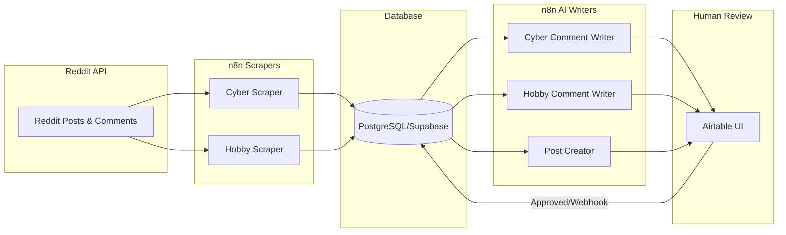

# Reddit Engagement System — Master Transfer Index

This folder contains the complete, ready-to-deploy Reddit engagement automation system. The system discovers relevant Reddit discussions, uses AI avatars to leave highly contextual comments, posts original content, and maintains "hobby" karma for the avatars to ensure authenticity.

## 1. Folder Map

| File | What it is |
|------|------------|
| `Run subreddits - Cyber copy.json` | Orchestrator workflow: Iterates subreddits and scores threads for engagement. |
| `Scrape subreddit copy.json` | Sub-workflow: Scrapes a single subreddit using the Reddit API. |
| `XM Cyber _ Write comments copy.json` | Pipeline: Writes AI comments for high-value professional threads. |
| `Run hobby subreddits [1] copy.json` | Orchestrator workflow: Coordinates scraping of hobby subreddits for avatars. |
| `Scrape hoby subreddit [2] copy.json` | Sub-workflow: Scrapes a single hobby subreddit. |
| `Hobby Comment Writing copy.json` | Pipeline: Writes karma-building AI comments on hobby threads. |
| `XM Cyber — Reddit Post Creation (draft) copy.json` | Pipeline: Drafts original Reddit posts based on scraped news. |
| `Update comment sent copy.json` | Helper: Moves approved/posted comments in Airtable from the queue to tracking. |
| `Reddit _ Comments _ Official copy.json` | Helper sub-workflow: Recursively fetches and flattens Reddit comment trees. |
| `database_schema.md` | The database schema required for Postgres/Supabase. |
| `airtable_automation.md` | Guide to rebuilding the required Airtable automation. |
| `airtable_interfaces.md` | Guide to rebuilding the Airtable UI for human review. |
| `[Various CSV files]` | Structural exports and data for Airtable and initial database seeding. |

## 2. Setup Order

Follow these steps exactly to deploy the system in your environment:

1.  **Database:** Provision a PostgreSQL database (e.g., Supabase) and create the tables according to `database_schema.md`.
2.  **Airtable Bases:** Import the provided CSVs to create your Airtable bases and tables.
3.  **Airtable UI & Automations:** Follow `airtable_interfaces.md` and `airtable_automation.md` to build the human-in-the-loop review screens and the webhook trigger.
4.  **Import Workflows:** Import the 9 JSON workflow files into your n8n instance.
5.  **Wire Sub-workflows:** Update the "Execute Workflow" nodes in the orchestrators to point to the new IDs of your imported sub-workflows.
6.  **Set Credentials & Hardcoded Values:** Go through each workflow and update the credentials (DB, API, Airtable) and hardcoded IDs (e.g., `1PFMSu` Client ID, Airtable Base IDs). See Section 4 below for details.

## 3. Workflow Architecture & Data Flow

### Workflow Dependencies (Which calls which)
```mermaid
graph TD
    A[Run subreddits - Cyber] -->|Calls| B[Scrape subreddit]
    B -->|Calls| C[Reddit | Comments | Official]
    
    D[Run hobby subreddits] -->|Calls| E[Scrape hoby subreddit]
    E -->|Calls| C
    
    F[XM Cyber _ Write comments]
    G[Hobby Comment Writing]
    H[XM Cyber — Reddit Post Creation]
    I[Update comment sent]
```

### Data Flow (End-to-End)


## 4. Required Migration Steps (Workflow Fixes)

Because this package was extracted from a larger agency system, Tzvi must make three specific fixes to the workflows to connect them to the new schema and remove agency dependencies.

### Fix 1: Update the DB Table to `reddit_threads`

The legacy system used a table called `XM_Cyber_Reddit`. The new, clean schema uses `reddit_threads` for scraped posts and `reddit_comment_drafts` for the generated comments. Tzvi must update these two workflows:

**In `Run subreddits - Cyber copy.json`:**
*   Locate the Postgres insert node (named "Postgres_XM_Cyber_Reddit").
*   Change the target table from `XM_Cyber_Reddit` to `reddit_threads`.

**In `XM Cyber _ Write comments copy.json`:**
1.  Locate the first Postgres node ("Postgres_XM_Cyber_Reddit1"). Change the SQL query to:
    ```sql
    SELECT *
    FROM reddit_threads
    WHERE tag = 'engage'
      AND created >= now() - interval '24 hours'
    ORDER BY (alert = 'true') DESC, created DESC
    LIMIT 10;
    ```
2.  Locate the second Postgres node ("Postgres_XM_Cyber_Reddit"). Change the SQL query to fetch past drafts:
    ```sql
    SELECT array_agg(ai_draft) AS comments
    FROM (
      SELECT ai_draft
      FROM reddit_comment_drafts
      WHERE ai_draft IS NOT NULL
      ORDER BY created_at DESC
      LIMIT 20
    ) subquery
    ```
3.  Locate the Supabase node ("update_XM_Cyber_Reddit"). Change it to INSERT into `reddit_comment_drafts` instead of updating the legacy table. Make sure to map the `avatar_id` and `reddit_threads_item_id`.

### Fix 2: Redirect Post Creation to `reddit_threads`

The workflow `XM Cyber — Reddit Post Creation (draft) copy.json` currently reads from `news_scrape`, an internal agency table that is not included. Tzvi must change it to source data from `reddit_threads` instead.

1.  Locate the Postgres node ("Fetch pipeline input"). Change the SQL query to:
    ```sql
    WITH pick AS (
      SELECT rt.*
      FROM reddit_threads rt
      WHERE rt.client_id = '1PFMSu'
        AND rt.tag = 'engage'
        AND rt.composite >= 7
        AND NOT EXISTS (
          SELECT 1 FROM reddit_post_drafts rpd
          WHERE rpd.source_item_id = rt.id
        )
      ORDER BY rt.created DESC
      LIMIT 1
    )
    SELECT
      to_jsonb(pick) AS news,
      (SELECT to_jsonb(c) FROM clients c WHERE c.client_id = '1PFMSu') AS client,
      (SELECT COALESCE(jsonb_agg(to_jsonb(p)), '[]'::jsonb)
       FROM personas p
       WHERE p.client_id = '1PFMSu' AND p.platform = 'reddit' AND p.is_active = true) AS reddit_personas,
      (SELECT COALESCE(jsonb_agg(to_jsonb(a)), '[]'::jsonb)
       FROM reddit_avatars a
       WHERE a.active = true AND a.client_id @> ARRAY['1PFMSu']::text[]) AS reddit_avatars
    FROM pick;
    ```
2.  Locate the Code node ("Prepare payloads"). Update the mapping variables from `news.summary` to use the Reddit thread columns (`news.post_title`, `news.post`, `news.url`).
3.  Locate the Code node ("Map to schema"). Change `news.item_id` to `news.id`.

### Fix 3: Replace the Reddit Scraper

The scraper sub-workflows (`Scrape subreddit copy` and `Scrape hoby subreddit [2] copy`) use an internal agency Reddit API App credential. Tzvi does not have this app. 

Tzvi must replace the data source inside these two sub-workflows. He has three options:
1.  **Create a Reddit App:** Go to [reddit.com/prefs/apps](https://reddit.com/prefs/apps) and create a new script app to get OAuth credentials.
2.  **Use a 3rd-Party API:** Use a service like the RapidAPI "Reddit Unofficial" API.
3.  **Use RSS:** Use Reddit's `.rss` endpoints to fetch the JSON feeds.

*Important:* Whichever scraper method Tzvi chooses, the final output node of these two sub-workflows must return the exact same JSON keys expected by the orchestrators (`subreddit`, `title`, `post`, `comments`, `ups`, `downs`, `permalink`, `author`, `id`, `post_image`, `pubDate`).

## 5. Posting is a Manual Process

There is no workflow that automatically pushes comments or posts live to Reddit. This is a deliberate security and quality choice to protect the avatars from bans.

**The Workflow:**
1.  AI drafts a comment/post and saves it to Airtable.
2.  A human reviews and edits it in the Airtable Interface.
3.  The human logs into the specific Reddit avatar account, copies the refined text, and manually posts it to Reddit.
4.  The human checks the `comment_sent` box in Airtable.
5.  This checkbox triggers a webhook (hitting the `Update comment sent copy` workflow) which moves the record into the "Tracking" table to clear the queue.

## 6. Step-by-Step Setup & Test Guide

Follow this exact order to deploy the system without errors:

1.  **Database Build:** Run the SQL to create all tables defined in `database_schema.md`. Use the provided CSVs to seed the `clients` table and `reddit_avatars` table.
2.  **Reddit Scraper Test:** Choose a scraping method (Fix 3). Update the `Scrape subreddit copy` workflow. Click "Test Workflow" and confirm you receive a formatted array of Reddit posts.
3.  **Comments Helper Test:** Import `Reddit _ Comments _ Official copy.json`. Pass it a valid Reddit Post ID and test that it returns a flattened array of comments.
4.  **Professional Scraper Pipeline Test:** Import `Run subreddits - Cyber copy.json`. Wire the sub-workflow nodes to your new scrapers. Apply the SQL table fix (Fix 1). Run it. Check your `reddit_threads` database table to ensure scored posts are saving.
5.  **Airtable Setup:** Create the bases using the CSVs, and build the Interfaces and Automations using `airtable_interfaces.md` and `airtable_automation.md`.
6.  **Comment Writer Pipeline Test:** Import `XM Cyber _ Write comments copy.json`. Apply the SQL table fixes (Fix 1). Run it once. Confirm an AI draft appears in your Airtable queue.
7.  **Webhook Tracking Test:** Import `Update comment sent copy`. Get the webhook URL, place it in your Airtable automation script, and click the `comment_sent` checkbox. Confirm the record moves to the tracking table.
8.  **Hobby Pipeline Test:** Import the three hobby workflows. Wire the sub-workflow IDs. Run the orchestrator. Confirm hobby comments save to the DB and Airtable.
9.  **Post Creator Test:** Import `XM Cyber — Reddit Post Creation`. Apply the SQL fix (Fix 2). Run it. Confirm a draft post appears in Airtable.
10. **Go Live:** Activate the Schedule and Webhook triggers on all workflows.

### 1. Run subreddits - Cyber copy
*   **Trigger:** Execute Workflow Trigger
*   **Summary:** Scrapes a list of subreddits, normalizes data, and uses an AI chain to score threads (relevance, quality, strategic value) to determine if they need engagement.
*   **DB touched:** Writes to `XM_Cyber_Reddit` (Note: ensure this maps to `reddit_threads` or your chosen table).
*   **Hardcoded values to change:** 
    *   Subreddit list inside the "urls1" node.
    *   Sub-workflow ID for the scrape workflow (`K5htMcpnriUZEb3byeLKz`).

### 2. Scrape subreddit copy
*   **Trigger:** Manual, Chat, Execute Workflow
*   **Summary:** Fetches latest posts from a subreddit, extracts images, filters posts older than 24h, and calls a sub-workflow to get comments.
*   **Hardcoded values to change:** Sub-workflow ID for the comments sub-workflow (`5GjrL0160kCVo5Ye`).

### 3. XM Cyber _ Write comments copy
*   **Trigger:** Execute Workflow Trigger
*   **Summary:** Fetches "engage" tagged posts from DB, selects a persona, generates an expert comment via AI, and pushes it to Airtable for review.
*   **DB touched:** Reads/Writes `XM_Cyber_Reddit`.
*   **Hardcoded values to change:** 
    *   Airtable Base ID (`appBJpoCIlUHEYi5J`) and Table IDs.
    *   Pushover API credentials and User Key.

### 4. Run hobby subreddits [1] copy
*   **Trigger:** Execute Workflow Trigger
*   **Summary:** Pulls active Reddit avatars from DB, extracts their unique hobby subreddits, and calls the hobby scraper for each.
*   **DB touched:** Reads `reddit_avatars`, Writes `hobby_subreddits`.
*   **Hardcoded values to change:** Sub-workflow ID (`Jclm2WMIZwsSodlW`).

### 5. Scrape hoby subreddit [2] copy
*   **Trigger:** Manual, Chat, Execute Workflow
*   **Summary:** Scrapes top "hot" posts from a given hobby subreddit within the last 24h and fetches comments.
*   **Hardcoded values to change:** Sub-workflow ID for comments (`5GjrL0160kCVo5Ye`).

### 6. Hobby Comment Writing copy
*   **Trigger:** Execute Workflow Trigger
*   **Summary:** Pairs avatars with hobby posts, checks past comments to avoid repetition, writes a human-like comment via AI, and logs to Airtable.
*   **DB touched:** Reads `hobby_subreddits`, `reddit_avatars`. Writes `hobby_subreddits`.
*   **Hardcoded values to change:** 
    *   Airtable Base ID (`appBJpoCIlUHEYi5J`) and Table IDs.

### 7. XM Cyber — Reddit Post Creation (draft) copy
*   **Trigger:** Schedule (8am, 2pm), Manual, Execute Workflow
*   **Summary:** Creates original Reddit posts by generating a brief from recent scraped news, selecting a persona, drafting the post, and pushing to Airtable.
*   **DB touched:** Reads `news_scrape`. Writes `reddit_post_drafts`.
*   **Hardcoded values to change:** 
    *   Client ID in Postgres query (`1PFMSu`).
    *   Airtable Base/Table IDs.
    *   Pushover target user.

### 8. Update comment sent copy
*   **Trigger:** Webhook
*   **Summary:** Receives a webhook when a comment is posted to Reddit, moves the record to a tracking table in Airtable, and deletes it from the queue.
*   **Hardcoded values to change:** Webhook Path ID, Airtable Base/Table IDs.

### 9. Reddit _ Comments _ Official copy
*   **Trigger:** Execute Workflow Trigger
*   **Summary:** Helper that hits the Reddit API, recursively flattens nested comment trees, and returns a clean array.
*   **Hardcoded values to change:** None, but ensure your Reddit OAuth credentials are set.

## 5. Airtable Setup (CSVs)

Import the provided CSV files to bootstrap your Airtable base.
*   `Reddit Personas-Grid view.csv` -> Import as **Reddit Personas** table
*   `Reddit Comments-Grid view.csv` -> Import as **Reddit Comments** table
*   `Reddit Comments Tracking-Grid view.csv` -> Import as **Reddit Comments Tracking**
*   `XM Cyber Reddit Posts-Grid view.csv` -> Import as **XM Cyber Reddit Posts**
*   `Scrape-Grid view.csv` (Contains raw scraped data; use if needed for context).

## 6. Credentials Checklist

You will need the following credentials set up in n8n:
1.  **PostgreSQL**: For the main database.
2.  **Supabase API**: If using Supabase for DB and its REST API.
3.  **OpenRouter API**: To access LLMs (Claude, Gemini, GPT).
4.  **Airtable Token API**: For human-in-the-loop review bases.
5.  **Reddit OAuth2 API**: To scrape and fetch comments.
6.  **Pushover API**: (Optional) For mobile push notifications.
