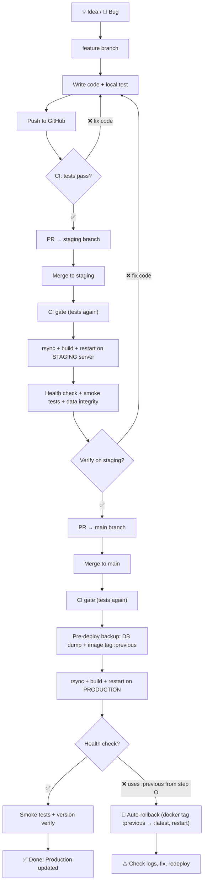

# Developer Flow — From Idea to Production

## Architecture

```
SSH + rsync + on-server Docker build + rollback
No registry. No artifact transfer. Build happens on the server itself.
```

## Visual Overview



---

## Step by Step

### 1. Start Work

```bash
git checkout staging
git pull origin staging
git checkout -b feature/fix-epg-race
```

### 2. Develop Locally

Write code, run locally, iterate:
```bash
# Run tests locally (optional, CI will catch failures)
cd reddit_saas
pytest tests/ -x -q --timeout=30

# Commit as needed
git add -A
git commit -m "fix: EPG race condition"
git push -u origin feature/fix-epg-race
```

**On every push** → CI runs tests automatically. See results in GitHub → Actions.

### 3. Pull Request to staging

When ready:
- Go to GitHub → Create Pull Request targeting `staging`
- CI shows ✅ or ❌
- If ❌ → fix code, push again
- If ✅ → Merge PR

### 4. Staging Auto-Deploy

After merge to `staging`:
- CI automatically: rsync → build on server → restart → health check → smoke tests
- **Staging ready ~3-5 minutes after merge**

Verify at `https://staging.gorampit.com`:
- [ ] /health → 200
- [ ] /login → page loads
- [ ] /admin/ → redirects to login
- [ ] Your feature works

### 5. Deploy to Production

If staging looks good:
- Go to GitHub → Create Pull Request: `staging` → `main`
- Merge it
- CI automatically deploys to production (with health check + auto-rollback)

Or manually: GitHub → Actions → "Deploy Production" → Run workflow → type `deploy`

CI will:
- Backup current image as `:previous` (for rollback)
- rsync code to production
- Gracefully stop Celery
- Build on server
- Restart services
- Health check (6 retries × 10s)
- **Auto-rollback if health check fails**
- Smoke tests
- Version verification

### 6. Marketing Site (Automatic)

Changes to `marketing_site/` deploy automatically when merged to main.
No manual action needed.

---

## Rollback

**Automatic:** If production health check fails after deploy, CI automatically restores the previous image.

**Manual (if needed):**
```bash
ssh ramp "docker tag reddit-saas-app:previous reddit-saas-app:latest && \
  cd /app && docker compose -f docker-compose.yml -f docker-compose.prod.yml up -d --no-deps app celery celery-fast celery-beat nginx"
```

---

## Workflow Files

| File | Trigger | What it does |
|------|---------|-------------|
| `ci.yml` | Every push | Tests + imports + alembic check |
| `deploy-staging.yml` | Push to `staging` | rsync → build → deploy staging server |
| `deploy-production.yml` | Push to `main` or manual | rsync → build → deploy prod + rollback |
| `deploy-marketing.yml` | Push to main (marketing_site/* changed) | Deploy marketing only |

---

## Required GitHub Setup

### Secrets (Settings → Secrets → Actions)

| Secret | Value |
|--------|-------|
| `STAGING_SSH_KEY` | Private SSH key for staging server |
| `STAGING_SERVER_IP` | `167.172.191.42` |
| `STAGING_SERVER_USER` | `root` |
| `STAGING_URL` | `https://staging.gorampit.com` |
| `PRODUCTION_SSH_KEY` | Private SSH key for production server |
| `PRODUCTION_SERVER_IP` | `161.35.27.165` |
| `PRODUCTION_SERVER_USER` | `root` |
| `PRODUCTION_URL` | `https://gorampit.com` |

### Environments (Settings → Environments)

| Environment | Protection |
|-------------|-----------|
| `staging` | None (auto-deploy) |
| `production` | Required reviewers (manual approval) |

### SSH Key Generation

```bash
ssh-keygen -t ed25519 -f deploy_ci -C "github-actions" -N ""
# deploy_ci     → paste contents into GitHub Secret
# deploy_ci.pub → add to server's ~/.ssh/authorized_keys
```

---

## Commands Cheat Sheet

```bash
# === Daily work ===
git checkout staging && git pull
git checkout -b feature/my-task
# ... work ...
git add -A && git commit -m "feat: description"
git push -u origin feature/my-task
# → GitHub: PR → staging → Merge → staging auto-deploys

# === Production deploy ===
# GitHub: PR staging → main → Merge → production auto-deploys
# Or: Actions → Deploy Production → Run workflow → type "deploy"

# === Check what's deployed ===
curl -s https://gorampit.com/health | python3 -m json.tool
curl -s https://staging.gorampit.com/health | python3 -m json.tool
```

---

## FAQ

**Q: Tests fail on PR — what now?**
A: Fix code, push again. CI re-runs automatically.

**Q: Staging is broken after merge — what do I do?**
A: Don't merge to main. Fix in a new feature branch → merge to staging → staging fixes itself.

**Q: Production deploy failed — what happens?**
A: CI auto-rolls back to previous image. Check logs, fix, redeploy.

**Q: Multiple features in parallel?**
A: Each in its own feature branch. Merge to staging independently. Staging = latest staging branch.

**Q: Can I deploy a specific branch to staging (not through merge)?**
A: Yes. Go to Actions → "Deploy Staging" → "Run workflow" → select branch.

**Q: Marketing site changed — do I need to do anything?**
A: No. Changes to `marketing_site/` auto-deploy when merged to main.
