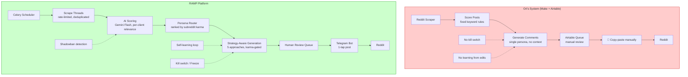
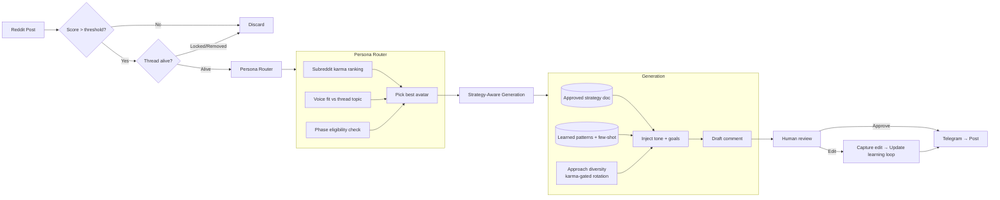
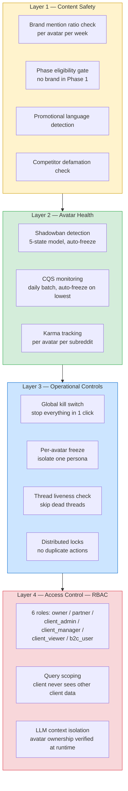
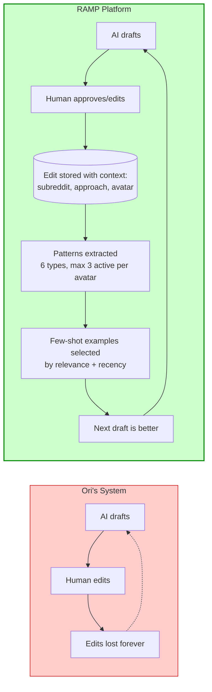
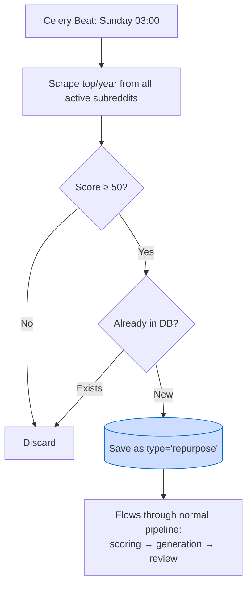

# RAMP — Product Roadmap & Visual Materials

_Last updated: 2026-05-15_

---

## Platform Status: MVP Complete (98%)

All core systems built and tested. Remaining: Telegram bot + production deployment.

---

## 1. Architecture Comparison — Ori vs RAMP



### Feature Matrix

| Capability | Ori's System | RAMP |
|-----------|-------------|------|
| Scraping | Make.com webhook | Celery + PRAW (rate-limited, deduplicated, freshness-gated) |
| Scoring | Fixed keyword rules | AI scoring (Gemini Flash) + per-client relevance + 72h freshness cutoff |
| Generation | Single persona, no context | Multi-persona, strategy-aware, 5 karma-gated approaches |
| Learning | None (edits lost forever) | Self-learning loop (patterns → few-shot → improvement) |
| Posting | Manual copy-paste (2-5 min each) | Telegram bot (1-tap post, 15-30 sec) |
| Safety | None | 4-layer safety (content + health + ops + RBAC) |
| Multi-client | Separate Airtable per client | Single platform, full data isolation, 6-role RBAC |
| Kill switch | None | Global + per-avatar + per-client |
| Shadowban detection | None | 5-state model, auto-freeze, daily batch check |
| Evergreen content | None | Weekly top/year harvest (Sunday 03:00) |
| Cost per client | ~$200/mo (Make + Airtable + manual labor) | ~$35/mo (LLM only, infra shared) |

---

## 2. Comment Generation Pipeline



**Persona Router logic:** Avatars ranked by subreddit karma (who has the most karma in this specific sub goes first). Voice fit and phase eligibility are secondary filters. Single-avatar clients skip routing entirely (saves ~$0.01/thread).

**5 Comment Approaches (karma-gated):**
- Low karma (any avatar): `reframe_drop`, `the_scar`
- Medium karma (50+): + `contrarian`, `drive_by`
- High karma (200+): + `cynical_deconstruction`

System rotates approaches automatically — no more than 2 identical in a row, least-used gets priority.

---

## 3. Safety & Compliance Layer



---

## 4. Self-Learning Flywheel



**How it works in practice:**
1. Human edits a draft → system stores original + edited version + context
2. Every 5 new edits → system recomputes correction patterns (e.g., "shorten to 200 chars", "remove guru-speak")
3. Next generation → system injects relevant few-shot examples + active patterns into prompt
4. Result: edit rate expected to drop from ~60% to ~20% over 3 months
5. Retention: 200 active records max, 180-day archive TTL

**Competitive moat:** 6 months of accumulated learning cannot be replicated by a new competitor overnight.

---

## 5. Daily Activity Timeline

```mermaid
gantt
    title RAMP Daily Operations (Israel Time — Asia/Jerusalem)
    dateFormat HH:mm
    axisFormat %H:%M

    section Monitoring
    Profile analytics snapshots     :05:20, 15min
    Phase evaluation (promote/demote) :06:00, 15min
    CQS batch check (auto-freeze)   :06:30, 30min
    Health check (shadowban)         :07:30, 30min
    Health check #2                  :13:30, 30min

    section AI Pipeline
    Morning burst (score + generate) :08:00, 30min
    Hobby pipeline (warm-up content) :10:00, 15min
    Afternoon burst (score + generate):14:00, 30min

    section Human Review
    Review window                    :09:00, 11h

    section Background
    Scraping (continuous, every 60s) :00:00, 24h
    Karma tracking (every 4h)        :00:00, 24h

    section Weekly
    Evergreen harvest (Sunday 03:00) :03:00, 30min
```

**Key insight:** Scraping is continuous (subreddit-centric, rate-limited). AI is bursty (08:00 + 14:00). Human review fills the gap. System is "alive" 24/7 but respects human working hours.

---

## 6. Cost Waterfall (Unit Economics)

```
Revenue per client (avg):           $500/mo
┌──────────────────────────────────────────────────────────────┐
│                                                              │
│  LLM API cost:        -$35/mo  (7%)                         │
│  ├── Comment generation (Claude Sonnet):  $17/mo            │
│  ├── Persona selection (Claude Sonnet):    $9/mo            │
│  ├── Comment editing (Claude Sonnet):      $8/mo            │
│  ├── Scoring (Gemini Flash):              $0.18/mo          │
│  └── Hobby comments (Gemini Flash):       $0.14/mo          │
│                                                              │
│  AWS/DO infra (shared across all clients):                   │
│  ├── EC2/Droplet:     -$2.00/mo per client (amortized)      │
│  ├── Valkey/Redis:    -$0.60/mo per client (amortized)      │
│  ├── SQS:             -$0.00/mo (free tier)                  │
│  └── Total infra:     -$2.70/mo  (0.5%)                     │
│                                                              │
│  ═══════════════════════════════════════════                  │
│  Gross margin:        $462/mo  (92.4%)                       │
│                                                              │
└──────────────────────────────────────────────────────────────┘
```

**Scaling:**

| Clients | LLM/mo | Infra/mo | Total cost/mo | Revenue/mo | Margin |
|---------|--------|----------|---------------|------------|--------|
| 3 | $105 | $27 | $132 | $1,500 | 91% |
| 10 | $351 | $27 | $378 | $5,000 | 92% |
| 50 | $1,755 | $54 | $1,809 | $25,000 | 93% |
| 100 | $3,510 | $130 | $3,640 | $50,000 | 93% |

**Key insight:** LLM = 93% of costs. AWS infra is noise. Margins stay above 90% at all scales because LLM costs scale linearly with revenue.

---

## 7. Approach Diversity (Rhetorical Technique Rotation)

```
                    ┌─────────────────────────────┐
                    │   KARMA-GATED APPROACHES    │
                    └─────────────────────────────┘

    ┌─────────────────────────────────────────────────────────┐
    │                                                         │
    │  HIGH KARMA (200+)                                      │
    │  ┌─────────────────────────────────────────────────┐    │
    │  │  cynical_deconstruction                         │    │
    │  │  "Dismantle the premise with sharp logic"       │    │
    │  └─────────────────────────────────────────────────┘    │
    │                                                         │
    │  MEDIUM KARMA (50+)                                     │
    │  ┌─────────────────────────────────────────────────┐    │
    │  │  contrarian          │  drive_by               │    │
    │  │  "Challenge the      │  "Quick, punchy         │    │
    │  │   consensus view"    │   one-liner insight"    │    │
    │  └─────────────────────────────────────────────────┘    │
    │                                                         │
    │  ANY KARMA (safe for new avatars)                       │
    │  ┌─────────────────────────────────────────────────┐    │
    │  │  reframe_drop        │  the_scar               │    │
    │  │  "Reframe the        │  "Share a personal      │    │
    │  │   problem entirely"  │   failure/lesson"       │    │
    │  └─────────────────────────────────────────────────┘    │
    │                                                         │
    └─────────────────────────────────────────────────────────┘

    Rules:
    • Max 2 identical approaches in a row
    • Least-used approach gets priority
    • Last 20 drafts analyzed per avatar
    • Avatar voice/personality unchanged — only technique rotates
    • If computation fails, generation proceeds without constraint
```

**Why this matters:** Ori's system used the same approach for every comment (monotonous, detectable). Our system forces variety while respecting avatar maturity — new avatars play it safe, established avatars can be bold.

---

## 8. Evergreen Content Harvest



**Parameters:**
- Schedule: Weekly, Sunday 03:00 (low-traffic)
- Source: `top/year` (not last 7 days — we want proven evergreen content)
- Min score: 50 upvotes (configurable via system settings)
- Limit: 25 posts per subreddit per run
- Deduplication: checked against entire `reddit_threads` table
- Thread type: `"repurpose"` (distinguishable from fresh threads in DB)

**Why:** Evergreen threads with high upvotes are proven engagement magnets. Commenting on them is lower risk (community already validated the topic) and provides steady content flow even when fresh threads are scarce.

---

## 9. Sprint Plan

### Sprint 1: May 14–18 — Deployment & Last Mile (Current)

| # | Task | Status | Owner |
|---|------|--------|-------|
| 1 | Telegram Posting Bot — core (aiogram 3.x, webhook) | Spec ready | Max |
| 2 | Telegram Bot — notifications on approval | Spec ready | Max |
| 3 | Telegram Bot — admin panel (assign avatars to owners) | Spec ready | Max |
| 4 | Production deployment (DigitalOcean Docker Compose) | Not started | Max |
| 5 | XM Cyber data validation + first test run | Not started | Max + Tzvi |

### Sprint 2: May 19–25 — Pipeline Intelligence

| # | Task | Priority |
|---|------|----------|
| 1 | Subreddit rule extraction (PRAW sidebar/wiki → LLM parsing → compliance) | P1 |
| 2 | Comment outcome tracking (karma snapshots at 4h/24h/48h + removal detection) | P1 |
| 3 | Budget engine (smart daily limits per avatar) | P1 |
| 4 | Cross-avatar deduplication (prevent 2 avatars on same thread) | P1 |
| 5 | Timing jitter (±30% randomization on all intervals) | P1 |

### Sprint 3: May 26–June 1 — Scale Prep

| # | Task | Priority |
|---|------|----------|
| 1 | Pagination on all list endpoints | P1 |
| 2 | Idempotency keys (prevent duplicate task execution) | P1 |
| 3 | Prompt versioning (move hardcoded prompts to DB/files, enable A/B testing) | P2 |
| 4 | Strategy Questions feedback loop (structured answers → next generation) | P2 |
| 5 | Queue observability (DLQ + metrics + alerting) | P2 |

---

## 10. Long-Term Roadmap

### Before 10 Clients (June 2026)

- [ ] Subreddit intelligence (rule parsing + mod analysis)
- [ ] Comment outcome tracking (karma snapshots)
- [ ] Budget engine (daily limits per avatar)
- [ ] Cross-avatar deduplication
- [ ] Timing jitter (behavioral randomization)
- [ ] Pagination on all endpoints
- [ ] Idempotency keys
- [ ] Strategy Questions feedback loop

### Before 100 Clients (Q3 2026)

| Item | Trigger | Complexity |
|------|---------|-----------|
| Trust engine (per-avatar decay scores) | 10+ clients | M |
| Billing integration (Stripe) | Self-service launch | M |
| Horizontal scaling (separate worker pools) | CPU > 80% sustained | M |
| SQS + Valkey migration | 100+ avatars OR enterprise | L |
| Client self-service portal | 5+ self-service clients | L |
| Vector memory (long-term avatar context) | After learning loop proves ROI | M |

### Future (Q4 2026+)

| Item | Trigger |
|------|---------|
| AWS migration (EC2 → ECS, RDS) | Enterprise requirement |
| White-label (custom domain, branding) | Agency demand |
| PDF reports (auto-generated for clients) | Client request |
| Viral acceleration rules | After outcome tracking proves patterns |
| Competitor intelligence module | PRD Section 8 ready |
| Mentor tracking & strategy | PRD Section 8.3 ready |

---

## 11. Architectural Debt

| Debt | Impact | Fix | When |
|------|--------|-----|------|
| Fixed timing constants | Detectable automation patterns | Add jitter (±30%) | Sprint 2 |
| No idempotency keys | Duplicate task execution possible | Redis task_id dedup | Sprint 3 |
| No pagination | UI breaks at 100+ items | ?page=N&size=M | Sprint 3 |
| Prompts hardcoded in services | No versioning, no A/B testing | Move to DB/files | Sprint 3 |
| No DLQ (Celery) | Failed tasks lost silently | SQS migration | Q3 |
| Celery introspection limited | Hard to debug stuck tasks | SQS migration | Q3 |

---

## 12. Milestones Checklist

### ✅ Done — Before First Paid Pilot

- [x] Full pipeline (scrape → score → generate → review)
- [x] 6-role RBAC with query scoping + LLM context isolation
- [x] Self-learning loop (edit capture → pattern extraction → few-shot)
- [x] Safety layer (kill switches, freeze, shadowban, CQS)
- [x] Avatar Intelligence UI (confidence, removal rate, patterns)
- [x] Comment approach diversity (5 techniques, karma-gated)
- [x] Repurpose scraping (evergreen top/year, weekly)
- [x] Strategy-aware generation (tone/cadence/goals injection)
- [x] Scoring optimization (Gemini Flash + 50/run cap + 72h cutoff)
- [x] Scraping architecture (subreddit-centric, async, rate-limited)
- [x] Pipeline hardening (unhealthy avatar exclusion before LLM)
- [x] Thread liveness protection (locked/removed/archived)
- [x] Shadowban detection (5-state, auto-freeze)
- [x] CQS automated monitoring (daily batch, auto-freeze)
- [x] Mentor phase (phase 0, excluded from all pipelines)
- [x] LLM output validation (Pydantic schemas)
- [x] Context isolation assertions (runtime checks)
- [x] Retry with exponential backoff (3 retries, 60×2^attempt)
- [x] Docker workflow (Makefile, entrypoint, db-sync)
- [x] E2E onboarding test

### 🔲 In Progress — Launch (May 14–18)

- [ ] Telegram Posting Bot (core + notifications + admin)
- [ ] Production deployment (DigitalOcean)
- [ ] XM Cyber data validation + first test run

### 🔲 Next — Before 10 Clients (June)

- [ ] Subreddit intelligence (rule parsing)
- [ ] Comment outcome tracking
- [ ] Budget engine
- [ ] Cross-avatar deduplication
- [ ] Timing jitter
- [ ] Pagination + idempotency
