# Reddit Avatar Publisher — Complete System Diagram (Mermaid)

## 0. High-Level Architecture (Top Level)

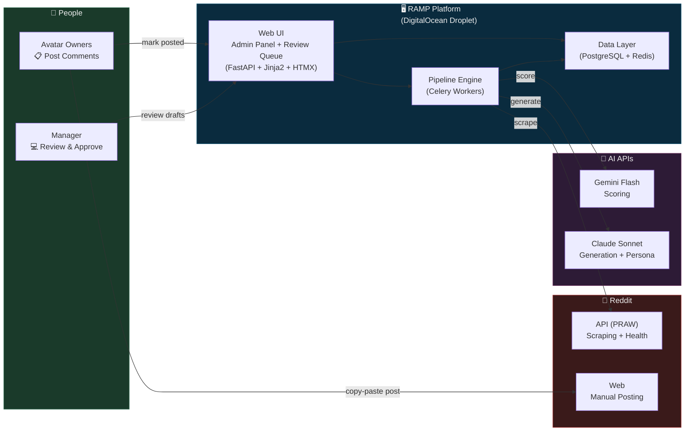

---

## 1. Complete System Diagram

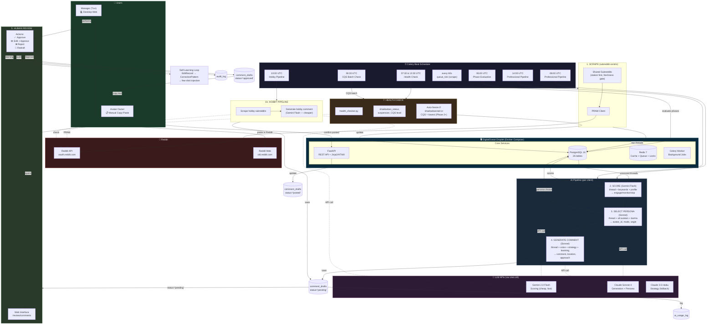

---

## 2. Simplified Data Flow Diagram

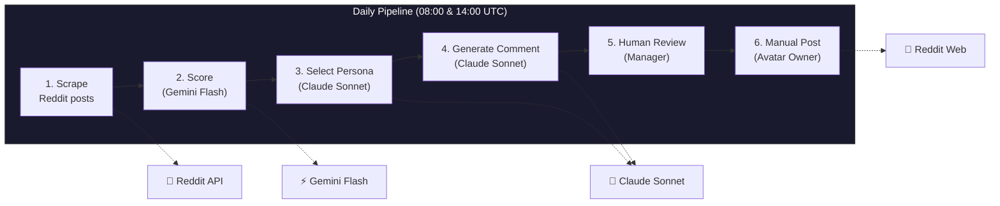

---

## 3. Component Interaction Diagram

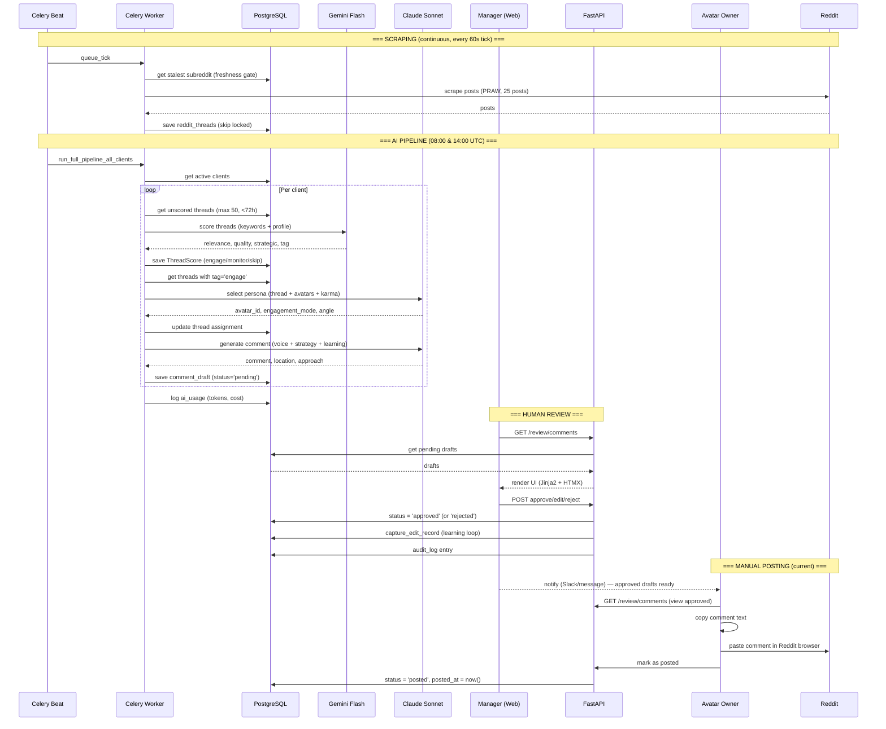

---

## 4. Mobile App State Diagram [PLANNED — NOT YET IMPLEMENTED]

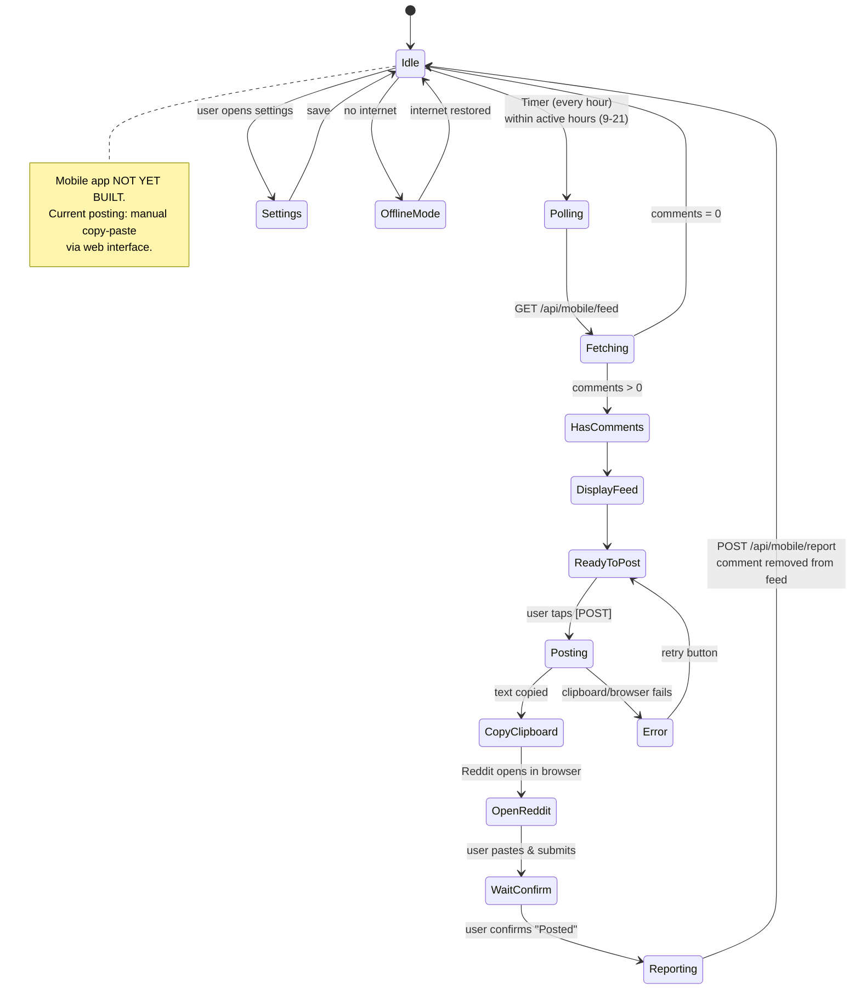

---

## 5. Database Table Relationships

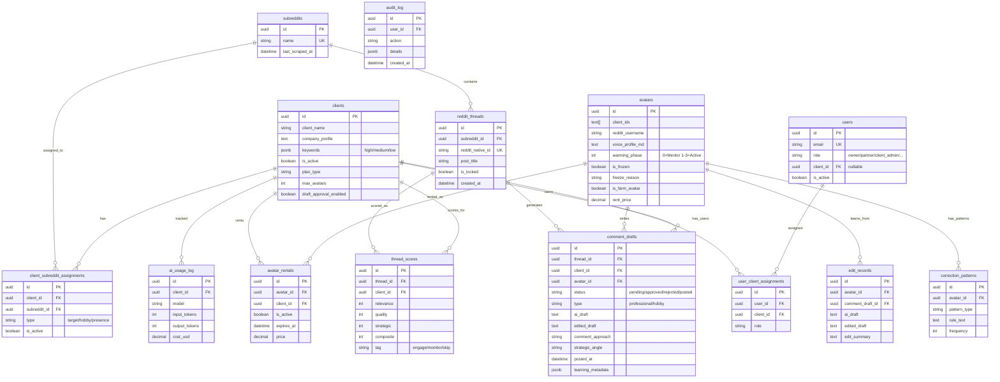

---

## 6. Deployment Architecture (Current — DigitalOcean)

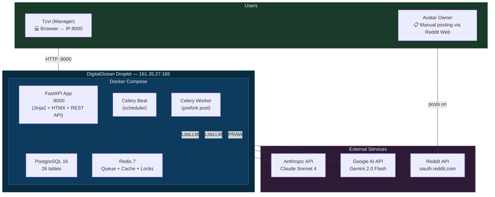

---

## 7. Deployment Architecture (Planned — AWS Migration)

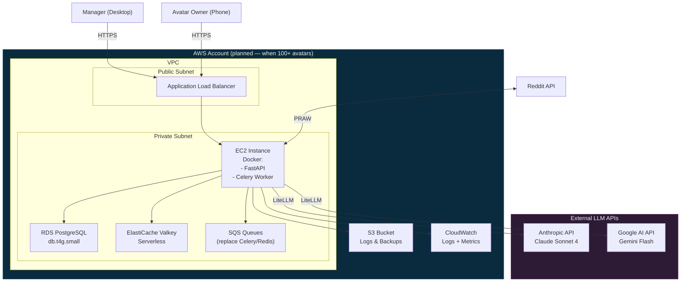

---

## 8. Celery Beat Schedule (Visual)

```mermaid
gantt
    title Daily Task Schedule (UTC)
    dateFormat HH:mm
    axisFormat %H:%M

    section Continuous
    queue_tick (scrape)          :active, 00:00, 24h

    section Morning Batch
    Profile Analytics           :05:20, 10min
    Phase Evaluation            :06:00, 15min
    CQS Batch Check             :06:30, 20min
    Health Check (AM)           :07:30, 15min
    AI Pipeline (morning)       :08:00, 30min

    section Midday
    Hobby Pipeline              :10:00, 15min
    Health Check (PM)           :13:30, 15min
    AI Pipeline (afternoon)     :14:00, 30min

    section Periodic
    Karma Tracking (every 4h)   :00:15, 10min
```

---

## 9. Comment Draft Status Workflow

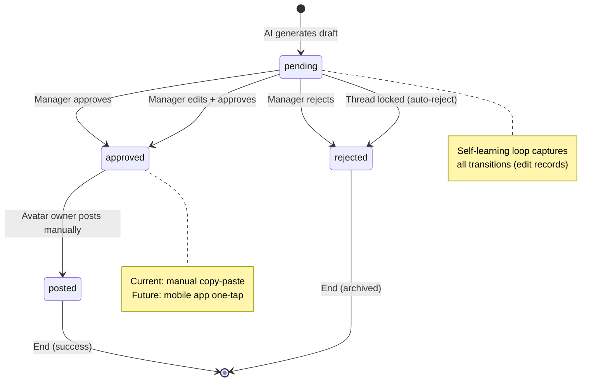

---

## 10. Self-Learning Loop

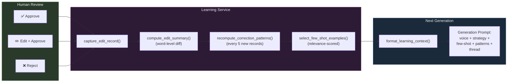

---

## Legend

| Icon | Meaning |
|------|---------|
| 🔄 | Scheduled / Automated Job |
| 🧠 | AI Call (LiteLLM → Anthropic/Google) |
| 👤 | Human Action |
| 💾 | Database / Storage |
| 📋 | Manual Copy-Paste (current posting) |
| 📱 | Mobile Application [PLANNED] |
| 💻 | Desktop Web |
| 🔴 | Reddit External Service |
| ⏰ | Time-based Trigger |
| 🖥️ | DigitalOcean Droplet |
