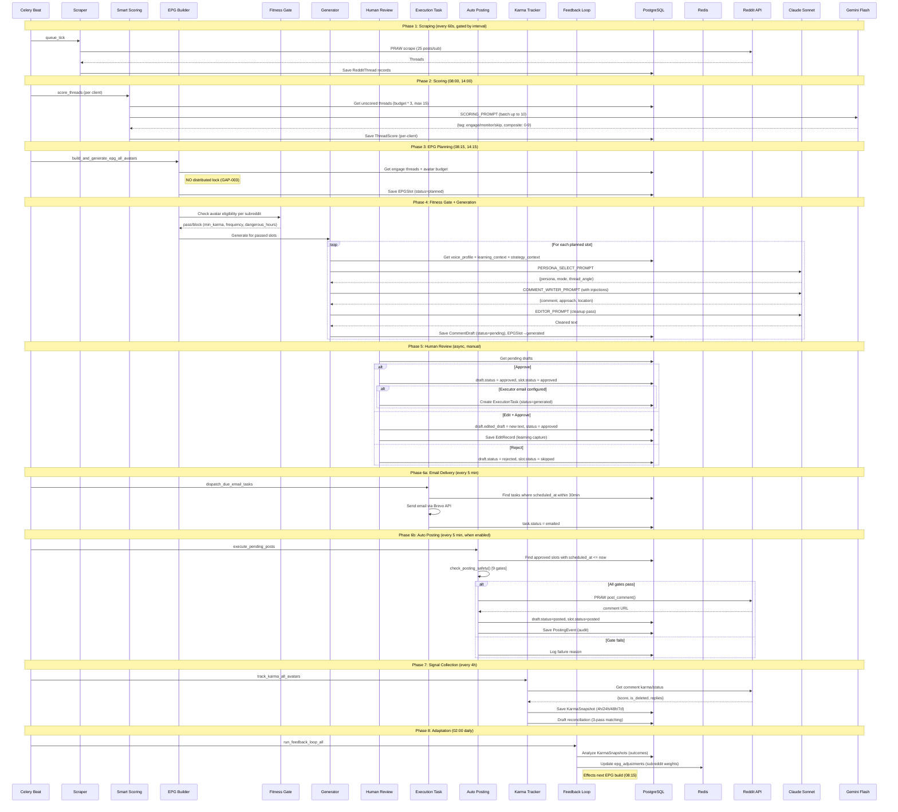
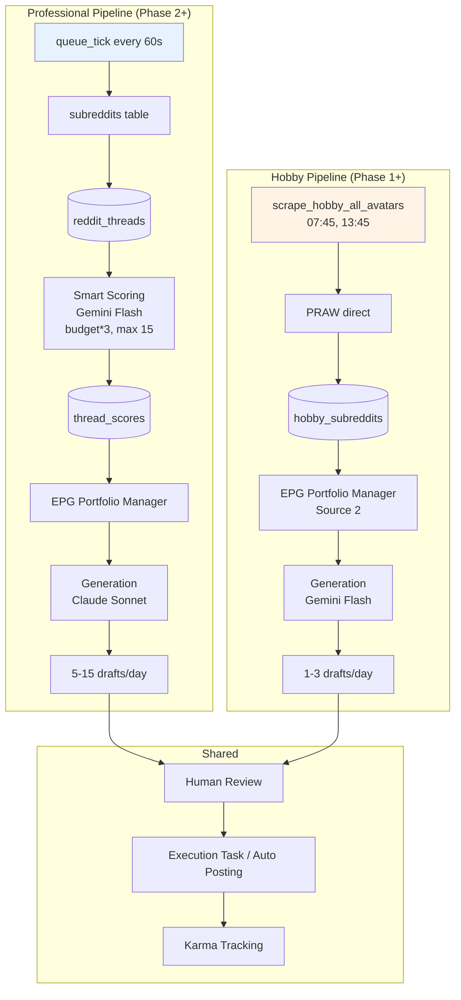
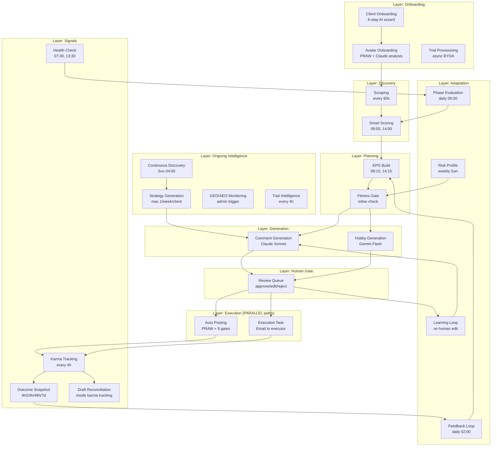

> **What this is:** RAMP execution flow diagrams — full pipeline sequence diagram, dual pipeline architecture, component layout.
> **Data source:** Extracted from tasks/worker.py (Beat schedule), tasks/orchestrator.py (chaining), services/ (business logic).
> **IMPORTANT:** EPG build has NO distributed lock (GAP-003). Execution Task and Auto Posting are PARALLELLLEL paths (not ). Fitness Gate   EPG and Generation.

---

# Pipeline Diagrams (Correct)

## Main Pipeline Sequence

## Dual Pipeline Architecture

## Component Architecture

